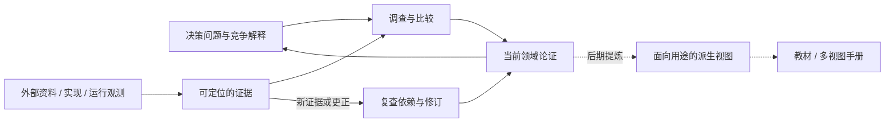

# ARCHITECTURE.md · 可纠错的认知体系

> 2026-09-20 重建设计。本文说明当前选择及其边界，不证明领域结论已经成立。
> 审查依据与旧设计的具体问题见 [深度审查](analysis/project-review-2026-09-20.md)，本次决定见 [设计记录](notes/2026-09-20-research-architecture.md)。

## 一、先明确要做成什么

项目研究的问题是：**Agent 如何把过去的信息变成未来可用、可更新、可追责的决策依据，并在质量、延迟和成本之间作选择？**

Memory 与上下文工程是中心。Harness 只研究与这件事有关的运行控制：何时读写、如何组装输入、怎样恢复、怎样观测错误。通用部署、UI、所有 Agent 框架的百科式覆盖不自动进入范围。参数与隐态记忆属于比较边界，但当前主攻能直接审查和操作的外部状态与调用上下文。

受众已了解 LLM 与 Agent，仍需要精确的工作定义、因果解释和必要事实。项目的价值是使读者在新情境下作出更好的判断；“已有资料能否搜到”“AI 能否生成”都不能独立决定取舍。

**当前建设认知层，不建设教材和手册。** 认知会过时，可靠性的来源是能找回依据、看见边界、传播修正。长期资产是这些能力及积累，不是某一版永远正确的目录或理论。

## 二、先修研究闭环，再扩材料

旧结构可以让一个推测经历“分析 → 证据复述 → 认知结论”，语气逐层增强，而没有增加独立依据。新结构要求每次研究说明：它改变了哪项选择、加强了保留现有选择的依据、缩小了适用范围，或明确了为什么暂时无法区分。支持简单方案和无差异结果同样可以结束研究，不要求每次找到新策略。

研究的最小单位是**一个可审查的论证**。它包含问题、当前判断、支撑、推理和边界；需要时展开竞争解释与下一步观察。一个文件可以承载一条较长推导，不规定“一条结论一张卡”，也不强制研究者填相同模板。

要防止两种相反失效：只有资料而无判断；只有漂亮判断而无依据。缺少关键事实时允许暂不下结论，不要求每篇都产出“反直觉发现”。

这张图描述工作的依赖，不规定信息必须穿过每一层。定义可直接引用论文，机制可直接引用实验；同一系统中的反例可以否定全称命题，但多个产品转述同一来源不会增加独立证据。

## 三、职责分层，不用目录承诺真假

保留现有主要目录，按来源和职责组织，具体放置规则只在 [CONVENTIONS.md](CONVENTIONS.md) 维护。

| 逻辑对象 | 主要位置 | 解决的问题 |
|---|---|---|
| 当前解释 | `domain/` | 我们现在怎么看、为什么、在哪里不成立 |
| 当前研究赌注 | `THESIS.md` | 哪些少数假设最值得优先检验 |
| 调查与检验 | `analysis/` | 如何得到这个判断、排除了什么解释 |
| 外部材料 | `sources/` | 别人到底写了什么、实现了什么 |
| 已引用的具体依据 | `evidence/` | 某一句主张能回到哪段原文或观测 |
| 决定与讨论历史 | `notes/`、`dialogue/`、`archive/` | 为什么改变、以前相信过什么 |

不再声称目录“按半衰期”划分：原件可能永久不变，其结论仍可能过时；访问频率与有效期也不同。目录位置不能表示“已证实”，文件日期不能表示“仍有效”。

不新增横跨全项目的状态数据库、手工主张索引或额外审批流。现阶段用正文标签、小节锚点、明确链接和引用搜索足够。若后续修订经常漏掉依赖，先量出实际漏失，再考虑自动生成依赖图。

## 四、证据强度决定结论力度

来源可信与结论可信是两件事。官方文档可说明产品如何被描述，代码可说明固定版本中某条路径如何实现，实验可说明固定条件下发生什么；它们各自不能自动证明普遍优越性。

重要主张至少能检查以下关系：

**主张 → 支撑片段 → 来源版本或运行条件 → 我方推理 → 适用边界。**

来源缺失时写明缺失，不能补一个主页让旧结论继续显得可信。没有 URL 的所谓“官方原话”不能当成已核对一手材料。原文中的推荐与数值，也不能直接推为因果定律或系统性阈值。

正文可以引用 `sources/` 的确切小节；需要稳定摘录、动态网页或运行记录时使用 `evidence/`，避免为每条引用机械复制原文。文件同名关系辅助导航，显式链接承担追溯。

我方笔记、阅读导航与 AI 调研属于分析材料，不能因位于 `sources/` 而获得外部证据身份。解析正文中的导航与原文也要分开。来源版本不明的现存材料可以支持本地文本核对，但不能伪称已固定外部版本。

## 五、纠错是一条完整操作路径

认知层和分析正文都允许修订。稳定保存的是原始证据与历史，而当前页面应当给当前答案。

以本次真实问题为例：

1. 旧认知称“谁决定”是本项目新增维度。
2. 库内论文 §3.3 已直接讨论 control policy，构成反例。
3. 撤回原创性主张，保留这一有用视角并归还来源。
4. 同步认知入口、主线和受影响的阅读判断；旧版进入快照。
5. 新的研究问题变为“如何进一步区分提出、授权、执行和覆盖”，而不是维护原创叙事。

对“证据不足”和“已经错误”采用不同处理：前者退回待核实或缩小表述，后者明确撤回。不能因为价格表没出处就宣称数字虚假，也不能因为暂时没找到反例就宣布为真。

历史不要求塞回现行正文。当前说明变更理由并链接旧稿即可。没有 Git 的阶段，大改先保存涉及文件的快照与校验清单。本次快照见 [历史入口](archive/2026-09-20-architecture-review-before/SNAPSHOT.md)。

## 六、领域模型先解释操作，再讨论分类

最初的六段循环把信息操作、持久化阶段、控制约束与产品按钮混在一起。流水线可以带过滤，召回可以为空；“准入策略”与“数据流图”无需二选一。

新的工作模型区分：

- **状态**：原始记录、提炼结果、当前上下文以及对它们的定位和版本信息。
- **操作**：选择、写入、更新、召回、呈现、外部化、压缩、隔离、恢复、删除。
- **控制**：谁提出、谁授权、何时触发、谁执行、谁能覆盖。
- **评价**：任务结果、约束保持、恢复能力、成本、延迟与错误传播。

这些是观察问题的工具，不是必须填满的本体分类。一个功能可以同时执行多个操作；所谓治理可以贯穿写入、读取与删除，不必对应某个独立模块。详细定义与失效边界放在 [领域基础](domain/foundations.md)。

项目的工作假设是：**比较信息是否在未来决策中正确生效，通常比比较存了多少、用了什么数据库更有解释力。** 它是否足够有用，要由案例比较检验，不能仅靠定义获胜。

## 七、系统选择服务于区分解释

不按知名度把所有产品拆一遍。优先选择能改变当前判断的样本：

- 一个实现可查的 harness，检查接口叙述与实际请求路径是否一致。
- 一个能更新、纠错和删除外部记忆的实现，检查旧值如何停止影响后续决策。
- 一个与编码任务不同的持续任务，检验抽象是否过拟合代码助手。
- 无专门记忆、完整历史或简单文本状态等低复杂度基线，判断额外机制是否值得。

“选三个系统”不是充分性标准。我们要的是相互独立的证据和能区分解释的条件变化。负结果、来源不可用和无法区分也记录下来。具体优先问题及停止条件见 [研究议程](analysis/research-agenda.md)。

研究按一次可改变判断的增量推进：提出问题、查到关键片段、检查最强替代解释、修订结论、留下下一步。无需做完一个系统的全部模块才允许更新认识。

## 八、两种视图，不建两套真源

人需要连续论证；未来组装产物需要可定位的判断与条件。两种消费方式不同，但不意味着同一内容永远不能支持两者。

当前 `domain/` 保留论证与稳定小节。后期按用途生成 `entries/` 或其他结构化视图；它们是可再生成的投影，不能手工发展出另一套结论。

提取时至少保留：主张、适用条件、反例或失效边界、依据位置、源版本。源结论改变后，旧条目需要失效或重建。不能只把一句强结论连回长文章，就认为限制条件已经自动随它传播。

教材与手册分别从认知层派生。教材重构学习顺序，手册按决策、产品或症状检索；两者都需要编辑与验收，不能预先承诺“一把梭哈无需重写”。症状反查是手册的重要视图，但教材也可以采用，不人为禁止有用体例。

## 九、怎样判断这套设计是否值得继续

验收对象是研究行为：

- 一个关键判断能否回到确切依据，读者能否区分来源与我方推论？
- 一个反例出现后，当前入口、依赖结论和阅读导航是否同步改变？
- 同一机制换个任务、预算或恢复条件时，能否预测何时应换方案？
- 研究是否记录了无法区分与失败，是否认真比较过更简单的基线？
- 后期提取时，条件和反例是否保留下来，是否出现无来源的新结论？

不以文章数、目录完整度、卡片数或引用数代替这些目标。指标有助于诊断，但不能独自决定质量。也不把“判断力”说成永远无法测量；在具体任务中可以观察约束违反、错误选择与恢复结果。

## 十、对旧设计五个重点问题的回答

| 原问题 | 本次决定 |
|---|---|
| 论述层与条目层是否过度设计？ | 保留两种用途，取消“必须两套持久真源”；现在先让论证可定位，派生层后建 |
| `domain/` 是否需要换名？ | 保留；边界与使用证据比猜测一个词激活何种模型先验更可靠 |
| 来源、分析、证据是否会混淆？ | 已经混淆；通过作者归属、版本、原文/解释分开和明确链接修复 |
| 以前四次错误是否同一根因？ | 部分是代理指标替代，另有分类混轴、事实越界和规则复制；不能压成一个万能解释，更不足以直接立章 |
| 分析与认知之间是否缺一层？ | 缺的是比较、检验和修订操作；先放进现有分析工作，不为一种操作新造目录层 |

本次选择也会接受反证：若上述轻量结构持续漏掉修订依赖，增加自动检查；若研究问题被工作模型反复遮蔽，改模型。架构服务于发现错误与建立判断，不要求材料证明架构正确。
