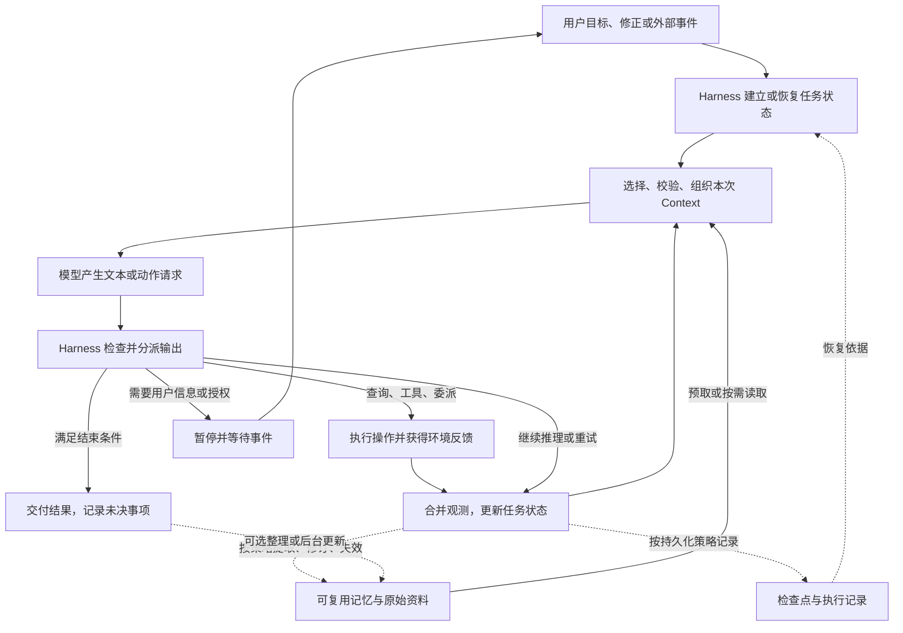

# Agent 的持续运行：Harness、Context 与 Memory 怎样共同把信息变成行动

> 首版主题综合，2026-09-20。本文把已有概念研究、官方工程文档与明确标注的构造案例连起来，形成可继续修订的运行模型。它不是教材正文，也不是对某个产品的完整源码审查；没有声称做过模型行为实验。术语是本项目的工作约定，具体实现的差异会在正文保留。

## 先把三个观察尺度放在一起

一次模型调用在当前获得的信息和模型已有能力的基础上产生输出。一个持续工作的 Agent 系统，还需要决定下一次调用何时发生、给它哪些信息、执行哪些动作、如何接受新反馈，以及中断之后怎样继续。过去的信息要持续起作用，就必须在这些操作之间留下可用状态。

**Harness 组织执行，Context 是一次调用实际获得的信息，Memory 让过去的状态有机会影响后续行动。** 三者在一次任务中反复相遇，不能按“先完成 Harness，再进入 Context，最后接上 Memory”的顺序理解。Memory 的读写可以由模型提出，也可以由固定程序或后台任务触发；Context 组装和工具执行则总要在某种运行机制中完成。

本文用 Agent 指承担任务、根据观测推进工作的整体系统，用模型指其中生成判断、文本或动作请求的组件。不同来源对 agent 与 workflow 的命名不完全相同。[Anthropic 的区分](../../evidence/domain/runtime-primary-sources.md#anthropic-agents)强调控制路径由预定义代码决定还是由模型动态选择；这两种方式也可以混合。

| 观察尺度 | 核心问题 | 相关对象 |
|---|---|---|
| 一次模型调用 | 此刻依据什么产生输出？ | 本次 Context、模型能力、可用工具描述与输出协议 |
| 一个持续任务 | 谁安排下一步，结果怎样反馈，何时暂停或结束？ | Harness、运行状态、工具与环境、检查点 |
| 多个步骤或任务之间 | 什么留下来，怎样更新，再次使用时是否仍有效？ | Memory、原始记录、派生表示、索引与读取策略 |

任务内也存在 Memory 问题。例如第一轮的约束要在第四十轮继续生效，并不因为没有跨会话就失去研究价值。[本地综述段落](../../evidence/domain/reviewed-local-passages.md#memory-scope)也包含任务内状态，但这不是所有来源统一采用的术语定义。

## 一张运行图：控制流连接信息流

下面是一种便于分析的典型路径。图中的节点是职责，不要求实现为同名模块，也不要求每次调用都走遍所有节点。

这张图同时包含三条关系。**控制关系**决定先做什么、能否执行、是否继续；**信息关系**决定模型实际拿到什么、输出怎样成为下一轮的材料；**持久化关系**决定哪些状态可以恢复或跨任务复用。它们常由同一段代码实现，但需要分别解释。

图中的外部资料不都属于个人或任务记忆；固定文档也可以被检索使用。工具可能只读取环境，也可能改变文件、数据库或其他外部状态。因此保存执行记录，并不代表能撤销工具已经产生的效果。

模型请求调用工具与工具完成执行是两个事件。OpenAI 的[工具调用流程](../../evidence/domain/runtime-primary-sources.md#openai-tools)明确区分模型返回请求、应用执行和后续传回结果；托管工具也可能在服务端执行，但执行责任与结果反馈仍然存在。

## 用一个持续任务把流程走通

以下是构造案例，用于解释边界，不是实测轨迹。用户让 Agent 核对一个项目的 API 迁移说明，要求“以当前实现为准，只修改文档，不修改业务代码”。仓库里有旧说明、当前代码和一份过去任务留下的迁移摘要。任务进行到一半，用户更正了目标版本；之后运行被打断，再由另一次任务继续。

### 1. 接受目标，形成可执行的当前状态

Harness 接收目标、项目位置、版本约束、可用工具和权限。当前状态至少需要能够表达任务是什么、哪些限制仍有效、已做什么、还缺什么。它可能保存在内存对象、消息列表、文件或框架状态中，并不要求先建一个独立 Memory 服务。

“只修改文档”既是模型应当理解的指令，也是执行层应当贯彻的权限目标。只把它写进提示，不能保证一个错误动作请求不会修改代码；工具范围或执行检查可以进一步承载约束。历史摘要里的“上次允许修改代码”不会因为检索相关就自动获得本次授权。

这一阶段的关键是把**目标、已知事实、未验证的线索和允许的动作**区分开。前者决定要完成什么，事实支撑判断，线索引导调查，权限限制行动。四者即便最终进入同一段输入，也不应被当成同一种文本。

### 2. 为当前决策准备一次 Context

系统不必先读取整个仓库。可以先给模型任务约束、必要的项目入口、当前待办和查询工具，让它判断需要查哪个接口；也可以由代码预先读出已知相关文件。两种方式可组合。

Context 的形成包括发现候选、选择相关内容、检查版本和适用范围、裁剪或转换表示、安排来源与顺序。并不是把存储中“命中的前几条”直接拼起来就完成了工程。

文件列表或来源指针可能已经在 Context 中，正文却还没有。模型据此提出读取某文件的请求，实际读取结果将参与下一次输入。[Anthropic 的按需检索描述](../../evidence/domain/runtime-primary-sources.md#anthropic-context)支持这种执行中获取信息的方式；它不能保证模型总会知道自己还缺什么。

Context 在这里指一次模型计算实际获得的信息。应用可观察到请求载荷、注入材料和部分续接标识，但服务端管理的历史、内部表示或不透明续接状态未必全部可检查。工程说明应分清“我们发送了什么”和“能够确认模型使用了什么”。更深入的区分见 [状态与上下文](state-and-context.md)。

### 3. 模型提出动作，Harness 负责把它落到环境

模型可能请求读取函数定义、查询提交记录，或者把一组文件交给子任务研究。Harness 解析请求，检查参数与允许范围，调用工具，记录可观察的成功或失败。调用名称正确，不证明参数、权限或目标版本正确。

工具返回也有不同语义：读到了文件、查询超时、修改操作已生效、服务返回了“接受请求”，不能都压成“完成”。系统要把相关结果和限制留在当前状态中，供后续判断使用。

网页或源码里的命令式文字属于被读取的内容，其可信身份没有因进入工具结果而改变。Context 工程需要保留来源边界，Harness 仍应控制执行权限。低可信文本被摘要成一句没有出处的“应该执行”，是信息处理与控制约束共同失守的一种可能路径。

### 4. 反馈改变状态，再组织下一次输入

发现当前实现与旧文档不一致后，系统更新已核实事实、待核实问题和下一步计划。模型需要的是这些变化及必要证据，不一定需要每次重看所有工具输出。

此时可以选择直接保留原文、摘要、外部保存后按需读取，或组合。选择会同时影响下一轮输入、恢复成本和遗漏风险。压缩是表示变化；把内容放到文件是存储变化；子 Agent 隔离是计算与可见范围变化。三者可以同时发生，不能仅用“卸荷”一个名字替代分析。[留存研究](../../analysis/context-retention.md)给出了条件推演。

一次工具结果没有出现在下一次 Context 中，可能是已经无关，也可能是信息选择失败。反过来，内容进入 Context 也不保证模型正确采用。检查任务结果时，必须允许“信息足够但推理或执行失败”这一解释。

### 5. 用户更正目标版本，更新要穿过多个表示

用户要求从版本 A 改为版本 B。当前任务状态应更新，旧计划可能需要重算；依赖 A 的摘要与已完成判断不再自动适用。先前派出去的子任务也可能仍在按 A 工作。

更新的目标不是让所有历史记录都改成 B。历史中的 A 是真实发生过的背景，当前采用 B 是新的控制与事实状态。系统应让后续选择能识别二者的作用范围，撤回受影响的派生判断，必要时补读或重新检查。

这里同时涉及 Memory 的修订、Context 的新旧材料选择和 Harness 的取消、通知、等待或重试。把三者分别设计之后再“接线”，容易漏掉这种跨边界行为。[记忆生命周期](memory-lifecycle.md)进一步解释修正怎样传播到读取和行动。

### 6. 中断与恢复：恢复任务状态，同时检查外部进度

假设文档已写入，但记录“写入成功”的步骤之前发生中断。恢复旧任务状态之后，文件不一定回到旧版；继续执行同一写入也不一定总是无害。

这是一个工程推断：**执行状态的恢复与外部效果的恢复需要分别说明。** [LangGraph 的检查点与重放文档](../../evidence/domain/runtime-primary-sources.md#langgraph-checkpointers)给出了具体例子：状态快照含下一执行位置，重放后续节点可能重新发起模型和 API 调用。不能因此断言所有故障恢复都会重做全部动作，也不能把读回聊天记录等同于恢复执行。

在这个案例里，恢复时可先核对文件内容、操作标识和目标版本，判断哪些工作确已完成；若动作不可重复，需要去重、幂等接口或补偿设计。检查点只存内存还是持久存储、保存发生在什么时候，也会改变能恢复到哪里。

### 7. 交付结果，选择是否形成跨任务记忆

完成说明时，应能区分已经核实的迁移差异、实际修改和仍未解决的问题。模型说“完成”只是一个信号；是否满足任务，需要结合文件、检查结果和用户约束判断。

任务结束可以触发整理，但记忆写入并不只能在结尾发生。某次明确更正可以立刻写入，耗时的经验提取可以在后台进行，某些临时发现则完全没有跨任务保存价值。[LangChain 对主路径和后台写入的区分](../../evidence/domain/runtime-primary-sources.md#langchain-memory)提供了实际框架例证。

比如“本次迁移目标为 B”通常属于本次任务，而“这个项目的接口证据优先从生成配置回查”可能成为可复用线索。后者仍应说明出处、适用版本或条件；一次成功经验不自动成为通用操作规则。

## 不同系统怎样改变这张图

| 形态 | 控制方式与变化 | 仍要解释的交叉关系 |
|---|---|---|
| 单次问答 | 准备输入后直接生成结果；可能没有工具和持久记忆 | 输入来源与输出依据是什么 |
| 固定工作流 | 代码决定节点与分支，模型只承担部分操作 | 节点间传什么状态，失败后从哪继续 |
| 工具驱动的 Agent | 模型根据观测选择动作，Harness 执行并约束 | 动作请求、真实结果和下一轮可见信息如何对应 |
| 先检索再生成或执行中检索 | 检索可在调用前、工具循环中，也可多次发生 | 原资料如何被选择、更新和解释 |
| 多 Agent 与并行任务 | 各分支有局部 Context 和状态，通过消息、结果或共享存储协作 | 分支是否获得最新约束，主任务实际收到什么，谁处理冲突 |
| 后台记忆处理 | 形成或更新记忆与当前回答异步发生 | 新状态何时对哪个任务可见，失败后如何重试或失效 |

这些形态可以叠加。并行任务没有天然的单一“第 t 轮”，整个系统也未必总存在一份能被所有 Agent 同时看见的 Context。单循环图只是入口，遇到分布式执行时，应明确每个分支的局部状态和交换边界。

## 什么被保存，不等于什么被用上

对一项外部记忆，至少需要逐步确认：它是否保存、是否仍有效且有权访问、是否被定位取回、是否进入本次可见信息、是否被正确采用，以及是否在真实行动中兑现。这不是要求建立六个新模块，而是避免把前一项成功当成后一项成功的证明。

权限等约束也可以由 Harness 直接执行，并不总需要经过模型的语义使用。参数或隐态记忆还有不同作用路径；本主题重点讨论运行时外部状态，不把这条诊断路径扩大成所有 Memory 的定义。

多个存储也可能承载不同职责：执行记录帮助回查发生过什么；检查点帮助恢复任务；事实、偏好或经验支持未来选择；产物文件保存已经完成的工作。同一个文件可以兼任几种职责，职责相同也不意味着要用同一数据库。详见 [状态与上下文](state-and-context.md#storage-roles)。

## 工程判断应沿整个任务衡量

更短的输入可能减少驻留成本，也可能增加读取、摘要、子任务和返工。更丰富的记忆可能提高复用能力，也可能引入过时信息与维护工作。更细的检查点可能增强某些恢复能力，也有保存、同步和恢复语义上的代价。

因此质量、费用、时延、可恢复性与约束遵循应分别观察。没有可靠测量，就不把它们折成一个貌似精确的总分。[研究议程](../../analysis/research-agenda.md)保留了充分证据诊断对照、简单基线和完整调用成本等检验方法；[失效定位](failure-modes.md)说明应在哪条路径寻找证据。

这份综合当前能够提供共同的分析语言：把任务目标、执行控制、可见信息、保存状态和外部效果联系起来。它尚不能给出压缩率、最优检索数量、产品排名或多 Agent 收益，更不能证明全部系统都应采用同一架构。

## 深入阅读与教学使用

- [状态与上下文](state-and-context.md)：状态、历史、Context、检查点、外部世界的关系，以及一组用于暴露假设的形式化表达。
- [记忆的形成、更新与再次生效](memory-lifecycle.md)：写入、读取、冲突、删除、时机和作用范围怎样连接。
- [从错误行动反查失效位置](failure-modes.md)：信息问题、能力问题、恢复问题与成本转移怎样区分。
- [一手资料与引用边界](../../evidence/domain/runtime-primary-sources.md)：本主题引用的官方资料、访问日期与短摘录。
- [教材结构草案](../../analysis/book-design.md)：怎样从本主题提取第一章的整体地图，再在后续章节深入。

作为研究主题，这组正文可以继续增长，补充更细的解释、反例和实现差异。未来第一章只承担建立整体关系的任务，其他深入材料可以分布到多章；研究主题不受第一章的篇幅和教学顺序限制。
