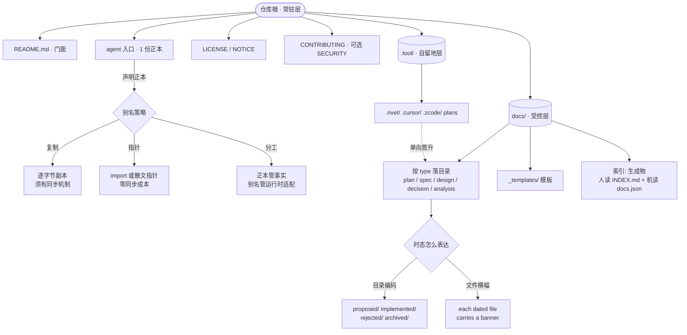

# 研究报告 · AI 时代仓库文档的实际治理

> 属于 `domain\repo-context\` 研究，阶段 **00docslist**（本阶段的综合层，独立于账本）
> 产出者：ds（AI 生成，见 `domain\AGENTS.md` 的命名约定）
> 证据基础：`sources/repos/` 18 个快照仓，17 个有本地 checkout（`claude-code` 无）
> 账本与逐仓明细：`domain\repo-context\00docslist\index.csv`（134 行）、`ds\{id}.md`（18 份）
> 取证日期：2026-09-25

---

## 摘要

把 18 个真实仓库的**根目录文档**逐字节量过一遍之后，能被证据支持的核心结论只有一条——

> **文档治理没有收敛成一套规范，它收敛成了几条「必须自己表态」的选择题。**

能收敛的部分（80% 以上的仓一致）：根目录用 `README.md`（17/17）；有 agent 入口（15/17）；把设计记录与当前状态分开；用 `LICENSE`/`NOTICE` 承担法务。

**没有收敛**的部分：入口文件叫哪个名字、它和别名是什么关系、记录用文件还是目录、skill 放哪里、索引要不要手维护、语言变体怎么命名。

因此本报告不给「最佳实践清单」——那种清单在这个样本里会被反复打脸（见 §7 反例清单）。本报告给的是：**7 条实测规律 + 5 个必须表态的分歧点 + 一个能同时容纳两派做法的分层模型**。

---

## 1. 方法与证据边界

| 项 | 值 |
|---|---|
| 样本 | `sources/repos/` 下 18 个仓；17 个有 checkout，`claude-code` 为 `completeness=binary` 无快照 |
| 口径 | **根目录直接子文件** + agent 面（指令分级 / skills / 工具目录）；不含子树正文 |
| 收录 | 根级 `*.md` + `*.i18n.yaml` + 治理型非 md（`NOTICE`/`LICENSE.txt`/`architecture-policy.yaml`/`marketplace.json`）；**不含**构建与 CI 配置 |
| 规模 | 134 行索引（133 `verified` + 1 `absent`）；22 份根级 agent 入口；18 份明细共 1721 行 |
| 字节 | `find -printf '%s'` 实测，非估算 |
| 指纹 | `sha256(首行)[:8]`，写进 `index.csv` 的 `evidence` 列 |
| 副本判定 | `cmp -s` 逐字节比对（非「大小相同」） |
| 可复现 | `python domain/repo-context/00docslist/_scripts/build_index.py` 重跑后 CSV 字节不变；9 条不变量测试全绿（含「账本数字必须能指回磁盘字节」） |

**两条方法纪律**（本轮付出过代价才确立的）：

1. `read_file` 对 `sources/repos/**` 硬拒（gitignored），`glob` 静默返回空——枚举只能走 `bash find` 或 `repo_map`。
2. **`grep` 的目录检索不递归**，只覆盖该目录的直接子文件。因此它给出的「未找到匹配」是**假阴性**，不得据此下负向结论。本会话早期正是这样误判了 `llms.txt` 与 `copilot-instructions`「不存在」，实测两者都存在（§7 反例 6）。

---

## 2. 跨仓基线

| 仓 | 根文档数 | 根文档总字节 | 最大单文档 | 根级 agent 入口 |
|---|---:|---:|---|---|
| `deepseek-harness` | 16 | 78158 | `THIRD_PARTY_NOTICES.md` 23KB | `AGENTS.md` + `CLAUDE.md`（**逐字节相同**） |
| `goose` | 16 | 118849 | `CUSTOM_DISTROS.md` 27KB | `AGENTS.md` + `CLAUDE.md`（**11B `@AGENTS.md`**） |
| `Tianshu-harness` | 15 | 560757 | `README.ja.md` 113KB | `AGENTS.md`（架构地图）+ `CLAUDE.md`（命令手册） |
| `Raven` | 12 | 393921 | `CONTEXT.md` 190KB | `AGENTS.md` + `CLAUDE.md`（**逐字节相同**） |
| `EverOS` | 11 | 161321 | `CHANGELOG.md` 69KB | **仅** `CLAUDE.md`（无 `AGENTS.md`） |
| `mem0` | 8 | 95938 | `LLM.md` 36KB | `AGENTS.md` + `CLAUDE.md`（**逐字节相同**） |
| `ZCode` | 8 | 2071664 | `THIRD-PARTY-NOTICES.md` 1932KB | `AGENTS.md` |
| `memU` | 7 | 85014 | `CHANGELOG.md` 37KB | `AGENTS.md` |
| `cline` | 6 | 165515 | `CHANGELOG.md` 134KB | `AGENTS.md` + `.clinerules/` |
| `qwen-code` | 6 | 951604 | `CHANGELOG.md` 886KB | `AGENTS.md` + `CLAUDE.md`（350B 散文指针） |
| `codex` | 5 | 27226 | `AGENTS.md` 21KB | `AGENTS.md` |
| `gemini-cli` | 5 | 44670 | `CONTRIBUTING.md` 19KB | **仅** `GEMINI.md` |
| `MemOS` | 5 | 62602 | `README.md` 17KB | `AGENTS.md` + `CLAUDE.md`（1.2KB 分工件） |
| `minimax-cli` | 5 | 39465 | `ERRORS.md` 10KB | `AGENTS.md` |
| `OpenHands` | 4 | 18666 | `README.md` 9KB | `AGENTS.md` |
| `MemoryBear` | 3 | 43505 | `README.md` 21KB | **无** |
| `ReFind` | 1 | 7225 | `README.md` 7KB | **无** |

`kind` 分布（134 行）：`collab-rule` 31 · `facade` 28 · `agent-entry` 22 · `topic-manual` 17 · `record` 11 · `legal` 11 · `machine` 7 · `semantic` 6。

**role 覆盖率**：134 行里 122 行能对上 `02docsdefine` 的 D 编号，**11 行对不上**（`GOVERNANCE`、`MAINTAINERS`、`DESIGN`、`EXTERNAL-PRS`、`architecture-policy.yaml`、`marketplace.json`、`.rivet.md`、4 份 `.i18n.yaml`）。→ 这 11 个名字是**样本扩到 18 仓后新出现的命名族**，`02docsdefine` 目前没有覆盖。

---

## 3. 七条实测规律

### L1 · 根目录文档数由「交付物形态」决定，不由「是不是 AI 项目」决定

样本全是 AI 相关仓，根文档数却从 **1 到 16** 铺满。最少的是 `ReFind`（只有 `README.md` 7KB），最多的是 `deepseek-harness` 与 `goose`（各 16 份）。

- `ReFind` 的根目录**没有 `LICENSE`、没有 `CONTRIBUTING`、没有任何 agent 入口**，它的 `docs/` 里只有 `METHOD_CARD.md` 与 `SUBMISSION.md`——**交付物是榜单成绩与论文**。
- `goose` 的 16 份里有 5 份是构建/发行手册（`BUILDING_*.md`、`CUSTOM_DISTROS.md`、`RISCV_SETUP.md`）——**交付物是给很多人装的产品**。

→ 讨论「根目录该放几份文档」之前，先问「这仓的交付物是什么」。本样本的证据不支持任何固定数字。

### L2 · 命名收敛度：`README` 100%，agent 入口 88%，但**具体名字只有 76%**

| 名字 | 命中（有 checkout 的 17 仓） |
|---|---|
| `README.md` | **17 / 17 = 100%** |
| `AGENTS.md` | **13 / 17 = 76%** |
| `AGENTS.md` ∪ `CLAUDE.md` ∪ `GEMINI.md` | **15 / 17 = 88%** |

三处反例：

- `gemini-cli` 有 8 份 `GEMINI.md` **而没有一份 `AGENTS.md`**；
- `EverOS` 有 `CLAUDE.md` 而**没有 `AGENTS.md`**；
- `MemoryBear` 与 `ReFind` **一份 agent 入口都没有**——而这恰好是本样本里根目录文档最少的两个仓（3 份 / 1 份）。

→ 「AGENTS.md 已成行业标准」这句话只对 76% 成立。准确的说法是：**「多数仓有 agent 入口」是事实（88%），「入口叫 AGENTS.md」是多数派而非标准（76%）**。

### L3 · 别名策略分化成 5 型，没有一型占优

`CLAUDE.md` 与正本的关系，实测 5 种（全部由 `cmp`/字节数定案）：

| 型 | 仓 | 证据 |
|---|---|---|
| **整份复制** | `deepseek-harness` 17805B、`Raven` 22349B、`mem0` 11997B | `cmp -s` 退出 0，逐字节相同 |
| **import 指针** | `goose` **11B** | 全文单行 `@AGENTS.md`（两级都是） |
| **散文指针** | `qwen-code` 350B | 逐项列出 `AGENTS.md` 覆盖哪些领域 |
| **互补分工** | `MemOS` 1200B、`Tianshu-harness` 17418B | MemOS 自述「Project facts live in AGENTS.md. This file only covers Claude Code runtime adaptation.」 |
| **单向存在** | `EverOS` 4297B | 有 `CLAUDE.md`，**无 `AGENTS.md`** |

→ 「别名应该做成指针」是一条**规范主张**，不是实测结论。三家最大的 harness 周边仓选的是**整份复制**。

### L4 · 指令分级数随「有没有子树专属约定」，不随仓库大小

22 份根级 + 子树 `AGENTS.md`/`CLAUDE.md`/`GEMINI.md` 合计：

| 仓 | 份数 | 形态 |
|---|---:|---|
| `deepseek-harness` | 25 | 根 + `docs/` + `benchmarks/` + `scripts/` + `packages/`（5 个子包）+ `vendor/` + `website/` + `.github/` + `.agents/notes/`（3 层）+ 夹具 |
| `mem0` | 22 | **11 组对**（每个子包各一份 `AGENTS.md` + 一份逐字节相同的 `CLAUDE.md`） |
| `gemini-cli` | 8 | 根 + 7 个 package，**全部叫 `GEMINI.md`** |
| `cline` | 3 | 根 + `sdk/` + `sdk/packages/llms/` |
| `codex` | 2 | 根（标题却是 `# Rust/codex-rs`）+ `codex-rs/tui/src/bottom_pane/` |
| `Tianshu-harness` | 2 | 根 2 份，**子树 0 份** |
| `MemoryBear` | **0** | monorepo（`api/`、`gateway-service/`、`identity-service/`、`packages/`、`web/` …），零份 |

**关键反例**：`MemoryBear` 与 `mem0` **都是 monorepo**，一个 0 份、一个 22 份。→ 「monorepo ⇒ 需要分级 AGENTS.md」不成立。真正的判据是**有没有子树专属的约定要写**。

### L5 · `SKILL.md` 的落点完全没有收敛（至少 14 种目录形态）

实测出现过的 skill 父目录：

```
.agents/skills        .claude/skills        .cline/skills       .codex/skills
.gemini/skills        .qwen/skills          skills              skill（单数）
opencode-skills       bundled-skills        bundled             Skills（大写）
assets/samples        仓库根
```

同一仓可同时有多处：`cline` 用 **3 处**（`.agents/`、`.claude/`、`.cline/`）；`mem0` 用 **10 处**；`gemini-cli` 用 **6 处**（含两个独立 bot 的 `.gemini/skills/`）。

唯一稳定的是**文件名 `SKILL.md`**——而 `memU` 连这条也破了：它的 `INSTALL-LATEST.md`（5482B）首行是 `---`，frontmatter 写着 `name: install-memu-latest`，**是 skill 描述符，不是安装文档**。

→ 判据必须从「看路径」改成「**看首行是不是 frontmatter、有没有 `name`/`description`**」。

### L6 · 重复副本是常态，且有同步机制的只是少数

逐字节实测：

| 仓 | 重复形态 | 是否逐字节相同 | 同步机制 |
|---|---|---|---|
| `mem0` | 11 组 `AGENTS.md`/`CLAUDE.md` 对 | **全部相同**（`cmp` 逐对退出 0） | **无** |
| `mem0` | 56 份 `SKILL.md` = 6 类能力 × 6 个 harness 插件 + 其他 | 未逐份比对 | **无** |
| `cline` | 同一 skill 出现在 `.agents/`、`.claude/`、`.cline/` | **相同**（5 个 skill 三项全等） | **无** |
| `deepseek-harness` | `README`/`CONTRIBUTING`/`SAFETY`/`BRAND_GUIDELINES` 各有英文 + `.zh.md` | 翻译，非副本 | ✅ `.i18n.yaml` sidecar（382–1082B） |
| `deepseek-harness`/`codex`/`ZCode` | `THIRD_PARTY_NOTICES.md` 等生成物 | — | ✅ 生成标记 `do not edit by hand` |

→ **凡有重复的地方，只有极少数仓引入机械化；其余靠人守。** 这直接解释了为什么「同一事实只有一个出处」在当前生态里反复失守——**它不是认知问题，是缺少强制机制**。

### L7 · 「记录」与「现况」分离有两派做法，各有代价

**A 派 · 目录编码时态**：

- `deepseek-harness`：`.agents/notes/{proposed,implemented,rejected,archived}/{class}/yyyy-mm-dd-topic.md`。代价写在自己的 README 里：*"an Agent Note **moves between folders** as that status changes"*——状态变化要挪文件，且依赖 Git 追踪移动。
- `Tianshu-harness`：`docs/{plans,specs,design,decision,analysis,research,changelog,known-issues,releases}/`，12 个受控 `type` 枚举 + 边界判据 + `_templates/` 7 个模板。

**B 派 · 文件自带声明**：

- `Raven`：`docs/README.md:7-9` 逐字——*"Several files below are dated records kept for their history rather than descriptions of the current tree; **each such file carries a banner saying so**."*；`plans/` 自述 *"an archive, **deliberately not held to today's layout**"*。

→ 两派解决的是同一个问题（读者如何知道这份文件描述的是「当时」还是「现在」），但**成本落在不同人身上**：A 派把成本放在写作者（挪文件），B 派把成本放在读者（必须先读到横幅）。

---

## 4. 五个必须自己表态的分歧点

这五处在本样本里**两派都有实证**，因此不构成「最佳实践」，只构成「你必须选一个并写下来」。

| # | 分歧 | 一派 | 另一派 | 判据 |
|---|---|---|---|---|
| **D1** | 要不要一份总索引 | **不做**：`deepseek-harness` 明令 *"Do not add a centralized `INDEX.md`"*，理由由一条独立 Agent Note 承载 | **做，但不手维护**：`Tianshu-harness` 的 `INDEX.md` + `docs.json` + `MINDMAP.md` 全由 `scripts/docs-index.ts` 生成，理由是 *"手维护的总索引必然腐烂"* | 若索引可生成 → 做；若只能手写 → 不做 |
| **D2** | 生成物怎么防手改 | 生成标记：`<!-- Generated by … do not edit by hand -->`（DSH、codex、ZCode 的 NOTICE 类） | **无标记**：多数仓的手写文档与生成文档混在同一命名空间 | 凡有生成物，就必须有标记，否则「禁止手改」无法执行 |
| **D3** | 记录用文件还是目录 | 单文件 `CHANGELOG.md` / `DECISIONS.md` | 目录：`docs/{plans,specs,decision,changelog}/`（Raven、TS）、`.agents/notes/`（DSH） | 实测**全是目录型**；单文件型的最大样本是 `qwen-code` 的 886KB `CHANGELOG.md`——**膨胀到不可读是单文件派的失效点** |
| **D4** | 语言变体怎么命名 | 点号：`README.zh-CN.md`、`.zh.md`、`.en/.ja/.ko.md` | 下划线：`README_ZH.md`、`README_CN.md` | 6 种写法并存。且**不承诺内容对齐**：`MemoryBear` 两份 README 用**不同的** hero 图资源 ID；`EverOS` 差 61 字节；`ZCode` 差 12% |
| **D5** | 根目录能不能放过期过程稿 | 明确隔离：`Tianshu-harness` 把工具运行时产物圈进 `.rivet/plans/`、`.cursor/plans/`、`.zcode/plans/`，并规定**单向晋升路径**（定稿后移入 docs 类型目录 + 补 frontmatter） | 放任：`goose` 的 `MERGE_FIXES.md`（10.6KB）首行自述 *"Delete this file before the branch merges"*，却**长期占着仓库根** | 有临时稿 → 必须有隔离区，否则它会占据最显眼的位置 |

---

## 5. 一个能同时容纳两派做法的工作模型

本模型不是新发明的规范，是从实测里**归纳**出的公共结构——18 仓里没有一个完整具备三层，但每一层都能在若干仓里找到成熟实现。



**两条跨层纪律**（本样本里能验证其代价）：

1. **别名的正本必须被声明**。五型别名都可行，但只有声明了正本才可判定冲突。样本里写得最完整的是 `MemOS/AGENTS.md:2-3`——一句话定正本、一句话列消费者、一句话划反向边界（*"Runtime-specific adaptation … do not mix it in here"*）。
2. **凡重复必机械化**。三层里任何重复（多语言、多 harness、多子包）都必须有 sidecar、生成标记或派生脚本三者之一；否则 §L6 的实测会复现：`mem0` 11 组对、`cline` 3 副本，全靠人守。

**判断「该放哪一层」的三个问句**（沿用本项目 `CONVENTIONS.md` 已有的判据，实测证明它对样本同样适用）：

- 它**回答的问题**和已有文件一样吗？
- 它的**更新节奏**和已有文件一样吗？
- 它**常需要和别人一起被读**吗？

三个都「是」→ 合并；任一「否」→ 拆开。

---

## 6. 对研究本身的推论

1. **「一个名字一个文件」的直觉在真实仓库里是失效的**。`AGENTS.md` 在 `codex` 里标题是 `# Rust/codex-rs`；在 `Tianshu-harness` 里是 Architecture Map；在 `OpenHands` 里叫 `# Repository Notes`。**名字是约定，内容不是**。`01docsclassify` 若按文件名归类，必须同时记录「实际标题」与「实际受众」。
2. **「类型」的稳定度远高于「命名」**。134 行里 122 行能对上 D 编号，说明 `02docsdefine` 的类型划分**基本立得住**；失配的 11 行全集中在「新出现的一族」——机读治理件（`architecture-policy.yaml`）、多 harness 插件清单（`marketplace.json`）、社区治理（`GOVERNANCE`/`MAINTAINERS`）、sidecar（`.i18n.yaml`）。→ **要补的不是重新分类，是补这几族的定义**。
3. **「文档-证据分离」在样本里是被实践了的**，只是分法各异：`Raven` 靠横幅、`DSH` 靠目录、`Tianshu-harness` 靠生成式索引。三种都有效，说明**分离本身是刚需，分离手段不是**。

---

## 7. 反例清单（推翻常见断言）

以下每一条都是本样本里**真实存在**的反例。它们的作用不是「纠正某个仓」，而是提醒任何规范文档：**别用「普遍」措辞**。

| # | 常见断言 | 反例 | 证据 |
|---|---|---|---|
| 1 | AI 时代的仓都有 `AGENTS.md` | `MemoryBear` 0 份；`EverOS`、`gemini-cli` 无 `AGENTS.md` | `find -name AGENTS.md` 实测 |
| 2 | `CLAUDE.md` 是指针 | 3 家是 17–22KB **逐字节副本** | `cmp -s` 退出 0 |
| 3 | `AGENTS.md` 只写怎么执行，不解释系统是什么 | `Tianshu-harness/AGENTS.md` 首行即 `# 天枢 (Tiānshū) — Architecture Map` | 首行逐字 |
| 4 | skill 放在 `skills/` 下 | 至少 14 种目录形态；`memU` 的 skill 叫 `INSTALL-LATEST.md` | `find -name SKILL.md -printf '%h'` + frontmatter |
| 5 | `ROADMAP.md` 这类只在草案里有人提，现实没人用 | `gemini-cli/ROADMAP.md` 存在（5748B） | `index.csv` role=D26 |
| 6 | `llms.txt`、`copilot-instructions.md` 没人用 | `goose/documentation/static/llms.txt`、`goose/.github/copilot-instructions.md`、`mem0/docs/llms.txt`、`cline/.github/copilot-instructions.md` 都存在 | `find` 实测（**早期 `grep` 判为不存在，是假阴性**） |
| 7 | 根目录文档越少越好 | 16 份的 `goose` 与 1 份的 `ReFind` 各自成立 | 取决于交付物形态（§L1） |
| 8 | monorepo 需要分级 `AGENTS.md` | `MemoryBear` 是 monorepo 且 **0 份**；`mem0` 是 monorepo 且 **11 组对** | `find` 实测 |
| 9 | 有 skill 加载能力就有 `SKILL.md` | `MemoryBear` 有 `load_skill_tools`、**0 份 `SKILL.md`** | `find` 零命中 + `index.csv` 关键词 |
| 10 | 同一类型文档的体量是可预期的 | `CHANGELOG.md`：`codex` 330B · `mem0` — · `qwen-code` **886KB** | `wc -c` |

---

## 8. 未取证与下一步

**未取证（不得当作结论引用）**：

- `claude-code` 无 checkout，其根目录形态**完全未知**（`index.csv` 里以 `status=absent` 占位）。
- 绝大多数仓只读了根级文档的**首 3 行**；正文级判断（如 `qwen-code/AGENTS.md` 17KB）未展开。
- `Tianshu-harness/scripts/docs-index.ts` 「索引由脚本生成」是**总纲的自述**，本轮未验证脚本是否存在、可否运行。
- `mem0` 56 份 `SKILL.md` 中跨 harness 的同名 skill**未逐份 `cmp`**（`cline` 的同类现象已证实相同）。
- `architecture-policy.yaml` 是否有配套执行器（CI 是否真的按它判定）未验证。

**下一步（按依赖排序）**：

1. 给 `02docsdefine` 提交一份**增量清单**：11 个无 D 编号的命名 + 3 处归属错误（D01 的 `README_CN` 归属、D10 的 DSH 字节数、D26 的 `ROADMAP` 状态）。本阶段不直接改 02，只提供可核对的输入。
2. 把 §4 的 5 个分歧点整理成 `03docscompare` 的对照骨架——每一点在两派各取一个仓作代表，证据已在 `ds\*.md` 中就位。
3. 若要做「重复副本」的完整量化，需要一次跨 harness 的 `cmp` 矩阵（本阶段只覆盖了 `cline` 与 `mem0` 的两处）。

---

> **证据说明**：本报告所有数字来自 `2026-09-25` 对 `sources/repos/` 17 个 checkout 的实测（`find -printf`、`wc -c`、`cmp -s`、`sha256`），并经 `domain\repo-context\00docslist\_scripts\test_build_index.py` 的 9 条不变量测试守住（其中一条专门断言「账本里的字节数与首行哈希必须能指回磁盘」）。凡标「未取证」者，均为**在本次检索范围内未查**，不是「不存在」。
