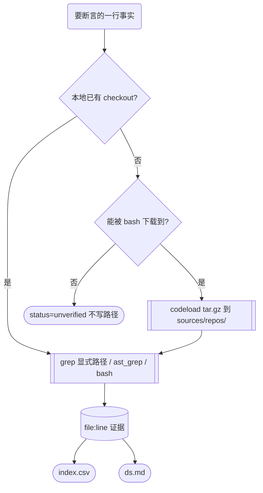

# harness 的 read 工具与 skill 加载工具：源码事实与开源形态

> 属于 `domain\repo-context\` 研究，阶段 **04how-agent-read-file** · 产出者 **ds**
> 上游：`domain\repo-context\README.md`（研究纲领末节）、`domain\repo-context\02docsdefine\ds.md`（11 仓命名实测）
> 立场：本文只写**能在源码里读到**的东西。凡未取得一手证据的，标 `unverified` 而不补猜。所有路径相对各对象自己的仓库根。

---

## 0. 四句话结论

1. **read 工具分成两派**：一派把「读文件」做成专用的、带 offset/limit 与行号的**模型可见工具**；另一派**不设**这个工具，让模型用 shell（`cat`/`sed`）去读。codex 属后者，且这是本轮唯一一个反例核对后才敢下的结论。
2. **「一次读多个文件」才是真正的分水岭**：多数实现一次只读一个文件，靠模型多次调用；只有 gemini-cli 把 `read_many_files` 做成**独立工具**，Tianshu-harness 把它塞进同一个 `read_file` 的 `paths` 参数（上限 5 个）。
3. **skill 侧命名一致（`SKILL.md`），加载实现分三种**：独立工具＋两级渐进披露 / 提示注入＋显式·隐式调用检测 / RPC 目录。**是否真的把技能正文"按需"读进来**是三种实现的共同目标，差别在触发与路由由谁负责。
4. **「开源了客户端但没实现」确实存在，而且能精确定位**：OpenHands 的公开仓库只是 Web/Electron 前端（无 agent 核心、无 `pyproject.toml`）；Claude Code 的 npm 包是 27KB 的启动包装器加载预编译 `claude.exe`，只公开了工具契约 `sdk-tools.d.ts`——**实现一行都没发**。

## 1. 取证边界（先说清楚，免得下游误读）



三个通道的实测状态：

| 通道 | 状态 | 复现证据 |
|---|---|---|
| `read_file` / `glob` 对 `sources/repos/**` | **不可用** | `read_file ...\sources\repos\codex\README.md` → `Error: File is gitignored (node_modules, build artifacts, etc.)`；`glob sources/repos/*` → 未找到匹配 |
| `web_fetch` / `web_search` | **不可用** | `web_fetch https://github.com/openai/codex` → `Access denied: github.com resolves to a private/reserved IP (198.18.0.36)`；`web_search` 对 codex 技术问题返回知乎/CSDN 安装教程 |
| `bash`（curl / npm / find / grep -r） | **可用** | `curl -sI https://github.com` → `HTTP/1.1 200 OK`；`npm view @anthropic-ai/claude-code version` → `2.1.282` |

**由此产生的硬纪律**：`web_search` 的"搜不到"**不是**证据。所有外部对象要么下到本地读源码（gemini-cli、qwen-code、cline、OpenHands、Claude Code npm 包），要么留 `unverified`。

本轮下载日期均为 **2026-09-24**，落盘位置 `sources/repos/<name>/`，提交指纹记在 `sources/repos/_commits.json`（新增项尚未写入该文件）。

## 2. read 工具逐对象

### 2.1 不设专用读工具：codex

工具处理器模块清单里没有 `read_file`、也没有 `list_dir`——`sources/repos/codex/codex-rs/core/src/tools/handlers/mod.rs:1-37` 列出的是一组 `apply_patch`、`current_time`、`dynamic`、`extension_tools`、`get_context_remaining`、`list_available_plugins_to_install`、`mcp`、`mcp_resource`、`multi_agents`、`new_context_window`、`plan`、`request_permissions`、`request_plugin_install`、`request_user_input`、`send_message_to_user`、`shell_spec`、`sleep`、`test_sync`、`tool_search`、`unified_exec`、`view_image`、`wait_for_environment`。

反向枚举 `ToolName::plain("…")` 得到实际注册名：`exec_command`、`write_stdin`、`apply_patch`、`view_image`、`update_plan`、`web_search`、`tool_search`、`read_mcp_resource`、`list_mcp_resources`、`spawn_agent`、`network_access`——**没有 `read_file`**。

`read_file` 这个名字在 codex 里只出现在三种非模型工具的场合：

- **文件系统抽象层**：`sources/repos/codex/codex-rs/file-system/src/lib.rs:635-660` 的 `ExecutorFileSystem` trait——`read_file` 返回 `Vec<u8>`、`read_file_stream` 分块返回（`FILE_READ_CHUNK_SIZE = 1024*1024`，见同文件 `:41`）、`read_file_text` 是带默认实现的 UTF-8 版本。`ReadFileOptions` 只有一个字段 `follow_symlinks`（`:53-64`）。**这一层没有行号生成，也没有读取截断策略**——行号不属于读实现，属于上层的渲染。
- **MCP filesystem 工具**：`sources/repos/codex/codex-rs/core/src/tools/handlers/mcp.rs:727-743` 注册的是 `tool_info('filesystem','filesystem','read_file')`，即外部 MCP server 提供的工具，不是内置能力。
- **`view_image` 内部调用**：`sources/repos/codex/codex-rs/core/src/tools/handlers/view_image.rs:177` 读图片字节；`git-utils/src/trust.rs:179`、`core-plugins/src/script_attribution.rs:408` 同理——都是内部读写，不对模型暴露。

**因此 codex 的模型读文件靠 `exec_command`（shell）**。这不是"实现缺失"，而是一种设计取舍：把读、找、跑统一进 shell，代价是每次读都要模型自己拼命令、也不会有内建的行号与截断预算。

### 2.2 专用读工具 + 多文件 + 片段提取：Tianshu-harness

`sources/repos/Tianshu-harness/src/tools/default-registry.ts:17/34-35` 同时注册了 `SKILL_TOOL`、`READ_FILE_TOOL`、`READ_SECTION_TOOL`。

工具定义在 `sources/repos/Tianshu-harness/src/tools/read-file.ts:723`：

- `name: 'read_file'`，描述原文："约 50,000 行以内的文件完整返回——不要自己切成小片分多次读"（`:726-729`）。
- 参数除了 `file_path` / `offset` / `limit`，还有两个不常见的：
  - `paths`（数组）："一次调用读取多个文件。用于替代重复的 read_file 调用。每个文件单独成节。最多 5 个文件。"（`:742-743`）
  - `focus` / `focus_max_matches`："任务关键词或问题；只返回结构摘要和相关片段"（`:748-749`）

行为常量（同文件）：

| 常量 | 值 | 作用 |
|---|---|---|
| `READ_REF_THRESHOLD` | `2048` | 文件超过 2KiB 且本轮已读过 → 复读时返回**引用**而非全文（`:151`、判定在 `:878-881`） |
| `MAX_TOOL_INPUT_BYTES` | `100 * 1024` | 超过 100KiB 且没给显式范围/focus 时拒绝整读（`:399`、`:602`） |
| `MAX_FOCUS_SCAN_BYTES` | `2 * 1024 * 1024` | focus 模式扫描上限，超限报错："Focused read refuses files over 2MB. Use grep or an explicit offset/limit range first."（`:401`、`:596-598`） |
| `MAX_IMAGE_BYTES` | `10 * 1024 * 1024` | 图片读上限（`:443`） |
| `READ_HISTORY_MAX` / `FILE_READ_HISTORY_MAX` / `LAST_KNOWN_MAX` | `500` / `200` / `500` | 三类历史表容量（`:62`、`:94`、`:112`） |

另有一套按 **offset/limit 键**与**整文件键**分开的去重表：`readHistoryKey` 把 `sessionId::cwd::path::offset::limit` 拼成键（`:193-194`），`isUnchangedRepeatRead` 只在 **mtime 与 size 都一致**时才判定"未变"（`:219-236`）。还有 `registerGrepFileAccess`、`getReadRefStats()`（`savedBytes`/`count`）这类把"grep 也已看过"纳入同一账本的设计（`:362`、`:370`）。

### 2.3 行号 + 流式 + 三个 cap：deepseek-harness

`sources/repos/deepseek-harness/packages/fs/tool-fs/src/read.ts:78` 注册的工具名是 **`read`**（不是 `read_file`）：

- 描述："Read a UTF-8 text file and return line-numbered content."（`:79`）
- 参数：`file_path` / `offset`（1-based，默认 1）/ `limit`（默认 `caps.limit`）（`:80-83`）
- 常量：`READ_LIMIT = 2000`（默认且是允许的最大行数，`:15`）、`STREAM_MIN_SIZE = 10 * 1024 * 1024`（达到即流式，`:21`）
- `ReadToolCaps` 四个字段：`limit` / `maxLineLength` / `maxBytes` / `streamMinSize`（`:24-33`）

它还给系统提示注入了一条显式偏好（`:74`）：

> "Use the read tool — not shell commands like cat — to inspect text files. Results include line numbers. Use offset and limit to continue reading large files."

——**与 codex 正好相反**：codex 靠 shell 读，dsh 明令"别用 cat"。

### 2.4 字符预算 + 分页续读提示：Raven

工具名 `read_file`，以**插件贡献**方式声明：`sources/repos/Raven/agents/raven-code/plugins/code-flow/raven-plugin.toml:50-51` 写 `name = "read_file"`、`factory = "code_flow.tools.plugin:make_read_file"`；工厂在 `.../code_flow/tools/plugin.py:51`。

实现分两层——fork 的「脸」与 trunk 的「身」：

- **fork 侧** `.../code_flow/tools/filesystem.py:89` `class ReadFileTool(_Aliased, trunk.ReadFileTool)`，只改三件事（文件头 `:1-14` 自述）：模型可见 schema 的参数拼写、别名映射（`cast_params`）、以及两条实测出来的行为。其中一条是 `_MAX_LINE_CHARS = 2_000`（`:98`）——**单行超长截断**，注释解释了理由：长行会让分页失效（`offset` 停在原地可以无限重复读）。
- **trunk 侧** `sources/repos/Raven/raven/agent/tools/filesystem.py:156` `class ReadFileTool(_FsTool)`，真正的读取逻辑：描述写 "Text files return numbered lines — use offset and limit to…"（`:169`）；`_MAX_CHARS = 128_000`（`:159`）、`_DEFAULT_LIMIT = 2000`（`:160`）；offset 超界时报 `Error: offset N is beyond end of file (M lines)`（`:260-261`）；结尾附续读提示 `(Showing lines X-Y of Z. Use offset=Z+1 to continue.)`（`:279`）。

还有一个跨工具的联动细节：`.../code_flow/tools/exec.py:121-129` 把超长命令输出**落盘**，并在截断提示里写 "grep it, or page through it with read_file offset/limit"——读工具被当成 shell 溢出的分页后端。

### 2.5 三个常量定全局面：gemini-cli

`sources/repos/gemini-cli/packages/core/src/tools/` 下有两个**并列**的读工具：

- `read-file.ts`（325 行）
- `read-many-files.ts`（553 行）——**独立的多文件读工具**

限额集中在 `sources/repos/gemini-cli/packages/core/src/utils/constants.ts:10-12`：

```
DEFAULT_MAX_LINES_TEXT_FILE = 2000
MAX_LINE_LENGTH_TEXT_FILE   = 2000
MAX_FILE_SIZE_MB            = 20
```

`read-file.ts` 本身不含这些常量，它把内容处理委派给 `../utils/fileUtils.js` 的 `processSingleFileContent`（超限报 `File size exceeds the 20MB limit.`，见 `utils/fileUtils.ts:522-524`），schema 来自 `./definitions/coreTools.js` 的 `READ_FILE_DEFINITION`。版本 `0.62.0-nightly.20260918.g9450ade79`。

### 2.6 fork 之后加了 PDF 与 notebook：qwen-code

`sources/repos/qwen-code/packages/core/src/tools/read-file.ts` 在 gemini-cli 的基础上扩了三类输入，描述原文（`:543`）：

> "For text files, it can read specific line ranges. For PDF files, use the 'pages' parameter to extract specific page ranges as text (e.g. '1-5'). Max N pages per request… This tool can read Jupyter notebooks (.ipynb) and returns structured cell content with outputs."

配套还有两个 gemini-cli 没有的模块：`packages/core/src/tools/file-read-permission.ts`（读权限）与 `priorReadEnforcement.ts`（读前强制）——把"读"从一个纯工具变成带准入的状态机。

### 2.7 read 工具横向对照

| 对象 | 工具名 | 是否专用工具 | 行号 | 分页 | 单次多文件 | 明示上限 |
|---|---|---|---|---|---|---|
| codex | （无） | 否（走 shell） | 无 | 无 | 无 | 无 |
| Tianshu-harness | `read_file` | 是 | 是 | offset/limit | **是（`paths` ≤5）** | 100KiB 整读 / 2MiB focus / 2KiB 复读转引用 |
| deepseek-harness | `read` | 是 | 是 | offset/limit | 否 | 2000 行 / 10MiB 起流式 |
| Raven | `read_file` | 是 | 是 | offset/limit | 否 | 128000 字符 / 2000 行 / 单行 2000 字符 |
| gemini-cli | `read_file` + `read_many_files` | 是（两个） | 是 | 有 | **是（独立工具）** | 2000 行 / 单行 2000 字符 / 20MB |
| qwen-code | `read_file` | 是 | 是 | offset/limit | 否 | 同 gemini-cli + PDF 页数上限 |
| cline | `read_files` | 是 | 未取证 | 未取证 | 名字即复数 | 未取证 |
| claude-code | `FileReadInput` | 契约可见、实现不可见 | — | offset/limit/pages | — | — |

## 3. skill 加载逐对象

### 3.1 提示注入 + 两套调用检测：codex

`skill` **不是一个工具**。codex 的 skills crate（`sources/repos/codex/codex-rs/skills/src/`）把技能拆成"策略 + 选择 + 调用"三段：

- `model.rs:63` `SkillPolicy`、`:8` `SkillMetadata`、`:71` `SkillInterface`
- `selection.rs:42` `collect_explicit_skill_mentions`——**显式点名**
- `invocation.rs:14` `ImplicitSkillAccess`、`:26` `detect_implicit_skill_invocation_for_command`——**隐式匹配**（任务描述匹配技能描述）
- `parser.rs:44-92` `parse_skill_frontmatter_metadata`：首行与闭合必须是 `---`，否则 `MissingFrontmatter`；`name` 上限 64（`:200-221`）；`description` 缺失直接报错
- `loading.rs:52` `SkillRootSnapshots` 是 `Arc<dyn SkillRootSnapshotCache>` 的句柄，相等与哈希按 **Arc 指针身份**（`:78-90`）
- 系统技能用 `include_dir!` 内嵌，安装到 `$CODEX_HOME/skills/.system`，靠 marker 文件指纹跳过重复安装（`lib.rs:55-101`）

发现动作**不在** skills crate，而在 `codex-rs/ext/skills/src/loader/discovery.rs`：`MAX_SKILLS_ENTRIES_PER_ROOT = 20_000`、`MAX_CONCURRENT_SKILL_LOADS = 64`（`:17-18`）、`MAX_SCAN_DEPTH` 按模式取（`:70-74`）；`codex-rs/exec-server/src/capability_discovery.rs` 另有一套 `SKILL_FILE_NAME='SKILL.md'`、`MAX_SCAN_DEPTH=6`、`MAX_ROOTS_PER_REQUEST=128`（`:21-30`）。

### 3.2 工具 + 两级渐进披露：Tianshu-harness

`SKILL_TOOL`（`default-registry.ts:17`）对应 `sources/repos/Tianshu-harness/src/skills/skill-loader.ts`。文件头两行就是机制说明（`:5`、`:8`）：

> Tier 1 (discovery): only name + description of every skill is injected
> Tier 2 (activation): the full SKILL.md body is loaded ON DEMAND — by the …

`SkillRegistry`（`:126`）扫两种目录形态：`<dir>/<name>/SKILL.md`（注释写明 "Claude/agentskills format, copied in"，`:145-170`）与 `.claude/skills/<name>/SKILL.md`（`:186-213`）——**兼容 Claude Code 的技能目录**。此外 `listSkillFiles`（`:359`）列出技能目录内的附属文件，`readSkillContent`（`:647`）、`writeSkill`（`:670`）、`uninstallSkill`（`:694`）构成一套读写 API，`BUILTIN_SKILLS`（`:401`）是内置技能。

### 3.3 会话级 Remote + 客户端 UI：deepseek-harness

skill 走一条**服务化**路径：`sources/repos/deepseek-harness/docs/capability-seams.zh.md:559` 显示 `svc_sessionSkillCatalog` 由 `packages/api/session-controller` 提供（"Session-addressed skill Remote adapter"）；客户端侧 `packages/client/ui-skill/src/client/index.ts:105` 在失败时抛 `skills/list failed`（`:105`）。也就是说 skill 目录由会话控制器管，UI 只是消费者。

### 3.4 RPC 契约 + CLI 子命令：Raven

`raven/rpc/models.py:84` `SkillInfo`、`:1381` `SkillListParams`、`:1388` `SkillListResult`、`:1392` `SkillPinParams`，并在 `METHOD_MODELS` 登记 `skill.list` / `skill.pin` / `skill.unpin`（`:4464-4466`）。这些是 **wire 契约**，不是实现体。

实现落在 CLI：`sources/repos/Raven/raven/cli/skill_commands.py:79` `def skill_list`；`rpc-schema/openrpc.json:892-894` 的 `skill.list` 条目直接写明 routing 方式——"routed via `cli.dispatch(argv=['skill','list'])`"。

### 3.5 有创作工具、没有加载工具：claude-code

`sdk-tools.d.ts`（npm 包 2.1.282 内，4153 行）公开的工具联合里出现了 `ProposeSkillsInput` / `ProposeSkillsOutput`——一个把 SKILL.md 写出来的**创作**工具，其字段说明写得很直白（`:2967-2984`）：`kebab-case skill slug`、描述"aim for under 200 characters, never more than 1024"、正文"`The complete SKILL.md exactly as it should be saved`"。

但工具联合里**没有** `SkillInput` / `SkillOutput`（`grep -cE "^export interface Skill(Input|Output)"` = 0）。公开契约里存在技能创作入口，却不存在模型侧的技能加载入口——加载要么发生在契约之外（插件/目录约定），要么根本不由工具承担。**这一条只描述 2.1.282 这个版本的公开契约，不外推到产品行为。**

### 3.6 skill 横向对照

| 对象 | 载体名 | 加载形态 | 发现/路由在哪 |
|---|---|---|---|
| codex | `SKILL.md` | 提示注入 + 显式/隐式调用检测 | `skills/src/{selection,invocation}.rs`；扫描在 `ext/skills/src/loader/discovery.rs` |
| Tianshu-harness | `SKILL.md` | **独立 `skill` 工具** + 两级渐进披露 | `src/skills/skill-loader.ts`，扫描含 `.claude/skills/` |
| deepseek-harness | `SKILL.md` | 会话级 Remote 目录 | `packages/api/session-controller`（服务端）+ `ui-skill`（客户端） |
| Raven | `SKILL.md` | RPC `skill.list/pin/unpin`（落到 CLI 子命令） | `raven/cli/skill_commands.py` |
| gemini-cli | `SKILL.md` | 加载器 + CLI 子命令（install/link/list/enable/disable/uninstall） | `packages/core/src/skills/{skillLoader,skillManager}.ts`、`packages/cli/src/commands/skills/` |
| qwen-code | `SKILL.md` | 加载器 + bundled skills | `packages/core/src/skills/`（含 `agent-delegation-skill`） |
| cline | `SKILL.md` | 技能目录 | 仓库自带 `.agents/skills`、`.claude/skills`、`.cline/skills` |
| claude-code | `SKILL.md` | **公开契约里只有创作工具** | 不可见 |

## 4. 回纲领那句话：「谁开源了这段代码，开在哪里」

三种形态，全部有本地一手证据：

### 形态 A：完整开源 harness —— 读工具与 skill 加载都能读到源码

codex（Apache-2.0）、gemini-cli（Apache-2.0）、qwen-code（Apache-2.0）、cline（Apache-2.0）、deepseek-harness、Raven、Tianshu-harness。它们每一个都能指出实现文件与行号，见 `index.csv`。

### 形态 B：只开源了客户端，实现不在公开仓库里 —— 本轮抓到了两个实例

**OpenHands**（MIT，`All-Hands-AI/OpenHands` main，2026-09-24）。顶层是 `electron/`、`src/`、`vite.config.ts`、`playwright.config.ts`、`package.json`——一个 Web/Electron 应用；`find . -maxdepth 2 -name pyproject.toml` **零命中**，也没有 `openhands/` Python 包。仓内与"读"有关的 TS 只有 `src/components/features/chat/tool-visualizers/file-editor/file-editor.tsx`，即**工具结果的可视化组件**；技能侧只有 `src/components/features/skills`（界面）与 `.agents/skills`（目录）。**agent 核心（含读工具实现）不在本仓。**

**Claude Code**。`npm pack @anthropic-ai/claude-code@2.1.282` 得到的 tarball 只有 **27KB**，包内文件是：`cli-wrapper.cjs`、`install.cjs`、`bin/claude.exe`、`package.json`、`LICENSE.md`、`README.md`、`sdk-tools.d.ts`。`cli-wrapper.cjs` 的注释自述它是**降级启动器**：

> "Normally the postinstall script copies the native binary over bin/claude.exe, so this file is never invoked. It exists for environments where postinstall doesn't run (`--ignore-scripts`)"

也就是说：发布物 = 下载/启动包装器 + **预编译二进制** + 一份工具类型契约。读工具的实现（`FileReadInput{file_path; offset?; limit?; pages?}`）与 skill 加载的实现，**一行源码都没有发布**。这是"开源了客户端，但那个没有实现"最干净的样本——它连客户端 JS 源码都没发。

### 形态 C：只发布 `SKILL.md`，不实现加载器

| 对象 | SKILL.md 数量 | 落点 |
|---|---|---|
| mem0 | **56** | `integrations/claude-code-plugin/skills/`、`integrations/antigravity-plugin/skills/`（如 `remember`、`forget`、`pause`、`resume`），配套 `integrations/agent-plugin-core` 的 build/validate |
| MemOS | 7 | `apps/memos-local-openclaw/skill/{memos-memory-guide,browserwing-admin,browserwing-executor}` |
| EverOS | 5 | 仓内分布 |
| memU | 1 | 根级 `SKILL.md` |
| minimax-cli | 1 | `skill/SKILL.md`（`README.md:33` 教用户 `npx skills add MiniMax-AI/cli`） |

`MemoryBear` 是这一组里的异类：**0 个 SKILL.md，但有实现**——`api/app/core/agent/agent_middleware.py:78` `def load_skill_tools`（`:131`、`:149` 的异步版），把技能装载成工具集。

> **纠偏记录**：本轮初稿据子代理报告把这七个记忆库一律标为 `absent`。逐仓复核后发现该结论只对 ReFind 与 vanilla-rag-memory 成立（7 类关键词整树零命中），其余五个都有 SKILL.md 或 `load_skill` 命中。子代理的"未找到"基于另一组关键词，不可直接采信。

## 5. 边界与未做

- **未做**：read 工具对 token 耗费与模型理解影响的量化比较（纲领那句"具体区别"）。要做需要固定模型、固定任务、控制变量，本文只提供源码侧的对照面。
- **未做**：cline 的 `read_files` 限额与分页行为未逐一取证；`index.csv` 中该行已标"未取证"。
- **未完成**：goose 下载在 900s 超时后 tar 只解开一部分，已隔离为 `_partial-goose-dl-failed-20260924/`，**不得引用**；该行标 `unverified`。
- **未找到确证**：Cursor、Windsurf、Devin 是否公开过读工具或 skill 实现——本环境 `web_fetch` 全域被 DNS 层拦截，无法核验，`index.csv` 中三行标 `unverified`。
- **版本限定**：codex、Raven、Tianshu-harness、deepseek-harness、minimax-cli 五个 checkout **没有提交指纹记录**（`sources/repos/_commits.json` 只覆盖 7 个记忆框架）。文中对它们的断言只对"该 checkout"成立，不能写成产品当前行为。gemini-cli（`bedef96e`）、qwen-code（`ffea2d02`）、cline（`dd2e190e`）有下载当日的 sha。

## 6. 证据索引（可复现）

| 断言 | 复现方式 |
|---|---|
| codex 无专用读工具 | `grep -rn 'ToolName::plain(' sources/repos/codex/codex-rs/core/src/tools` 全量枚举；`grep -rn 'read_file' sources/repos/codex/codex-rs --include=*.rs` 只看内部调用 |
| Tianshu-harness 阈值 | `grep -nE "READ_REF_THRESHOLD\|MAX_TOOL_INPUT_BYTES\|MAX_FOCUS_SCAN_BYTES" sources/repos/Tianshu-harness/src/tools/read-file.ts` |
| dsh `read` 上限 | `grep -nE "READ_LIMIT\|STREAM_MIN_SIZE" sources/repos/deepseek-harness/packages/fs/tool-fs/src/read.ts` |
| Raven 双层实现 | `grep -n "_MAX_CHARS\|_DEFAULT_LIMIT" sources/repos/Raven/raven/agent/tools/filesystem.py` |
| gemini-cli 三个常量 | `grep -n "MAX" sources/repos/gemini-cli/packages/core/src/utils/constants.ts` |
| Claude Code 发布物形态 | `npm pack @anthropic-ai/claude-code && tar -tzf anthropic-ai-claude-code-2.1.282.tgz` |
| OpenHands 无 agent 核心 | `find sources/repos/OpenHands -maxdepth 2 -name pyproject.toml`（空） |
| 记忆库 SKILL.md 分布 | `for r in mem0 memU MemoryBear MemOS EverOS ReFind vanilla-rag-memory; do find $r -name SKILL.md \| wc -l; done` |
| 外部 checkout 获取 | `curl -sL https://codeload.github.com/<owner>/<repo>/tar.gz/refs/heads/main \| tar -xz -C sources/repos/<name> --strip-components=1` |

> 取证时注意：`read_file`/`glob` 对 `sources/repos/**` 拒读，`web_fetch`/`web_search` 在本环境被 DNS 层拦（域名解析到保留段 198.18.0.0/15）。**能用的是 `bash`**——它走另一条网络与文件通道。这正是本阶段能拿到外部一手证据的原因。
