# Evaluating Very Long-Term Conversational Memory of LLM Agents

- 解析器: mineru-cloud 3.4.4（语言 en）
- 转换时间: 2026-09-24T15:35:09.843036+00:00
- 本地 PDF SHA256: `218188e1d66a553afe324491e3e5e5d0af107196c9ff32c65bb3640ebf638539`
- 图片: 18 个，1497 KB；字节已写入 assets/

> 本文件由 MinerU 云端接口转换，转换成功不等于已对 PDF 做视觉核验。
> 表格、公式与图像仍需在使用时核对；引用具体数字请回 pdf/ 定位原文。
> 分隔线之后为转换正文，上方 front matter 是本项目的登记信息。

---

# Evaluating Very Long-Term Conversational Memory of LLM Agents

Adyasha Maharana<sup>1</sup> Dong-Ho Lee<sup>2</sup> Sergey Tulyakov<sup>3</sup> Mohit Bansal<sup>1†</sup> Francesco Barbieri<sup>†</sup> Yuwei Fang<sup>3†</sup>

University of North Carolina, Chapel Hill<sup>1</sup> University of Southern California<sup>2</sup> Snap Inc.<sup>3</sup>

## Abstract

Existing works on long-term open-domain dialogues focus on evaluating model responses within contexts spanning no more than five chat sessions. Despite advancements in longcontext large language models (LLMs) and retrieval augmented generation (RAG) techniques, their efficacy in very long-term dialogues remains unexplored. To address this research gap, we introduce a machine-human pipeline to generate high-quality, very longterm dialogues by leveraging LLM-based agent architectures and grounding their dialogues on personas and temporal event graphs. Moreover, we equip each agent with the capability of sharing and reacting to images. The generated conversations are verified and edited by human annotators for long-range consistency and grounding to the event graphs. Using this pipeline, we collect LOCOMO, a dataset of very longterm conversations, each encompassing 300 turns and 9K tokens on avg., over up to 35 sessions. Based on LOCOMO, we present a comprehensive evaluation benchmark to measure long-term memory in models, encompassing question answering, event summarization, and multi-modal dialogue generation tasks. Our experimental results indicate that LLMs exhibit challenges in understanding lengthy conversations and comprehending long-range temporal and causal dynamics within dialogues. Employing strategies like long-context LLMs or RAG can offer improvements but these models still substantially lag behind human performance.<sup>1</sup>

## 1 Introduction

Despite recent advancements in dialogue models based on LLMs for extended contexts (Bertsch et al., 2024; Xiao et al., 2023), as well as the integration of retrieval augmented generation (RAG)

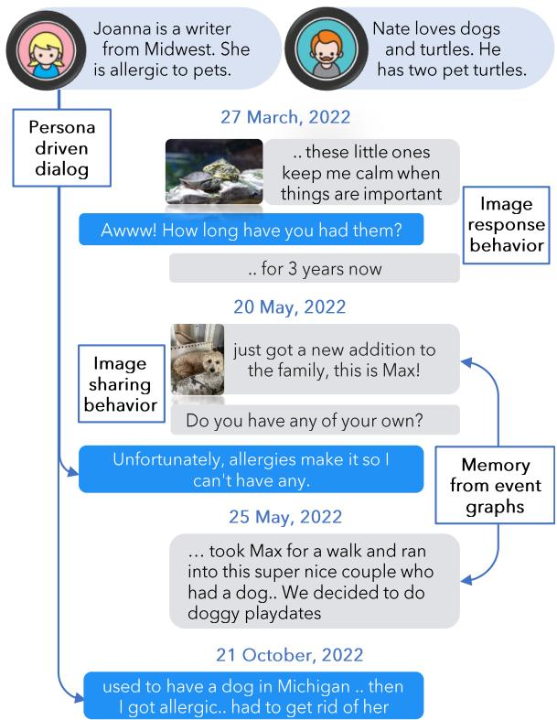  
Figure 1: An example in LOCOMO. Dialogs are steered by the speakers’ personas and corresponding events e.g., Joanna’s responses are consistent with her pet allergies. For Nate, the event got a new dog is followed by a playdate with neighbor’s dog, showcasing long-term memory. Multimodal dialog is enabled with image-sharing and image-response behaviors.

techniques (Shuster et al., 2021; Ram et al., 2023; Shi et al., 2023), there is still a need for thorough evaluation of their efficacy in handling very long conversations. Indeed, studies in long-term opendomain dialogues have concentrated on assessing model responses within limited contexts e.g., ∼1K tokens over five chat sessions (Xu et al., 2022; Jang et al., 2023; Zhang et al., 2023). This long term evaluation is crucial for refining engaging chatbots capable of remembering key information from past interactions, to generate empathetic, consistent, and useful responses.

<table><tr><td>Dataset</td><td>Avg. turns per conv.</td><td>Avg. sessions per conv.</td><td>Avg. tokens per conv.</td><td>Time Interval</td><td>Multimodal</td><td>Collection</td></tr><tr><td>MPChat (Ahn et al., 2023)</td><td>2.8</td><td>1</td><td>53.3</td><td>-</td><td>√</td><td>Reddit</td></tr><tr><td>MMDialog (Feng et al., 2023)</td><td>4.6</td><td>1</td><td>72.5</td><td>-</td><td>√</td><td>Social media</td></tr><tr><td>Daily Dialog (Li et al., 2017)</td><td>7.9</td><td>1</td><td>114.7</td><td>-</td><td>✕</td><td>Crowdsourcing</td></tr><tr><td>SODA (Kim et al., 2023)</td><td>7.6</td><td>1</td><td>122.4</td><td>-</td><td>✕</td><td>LLM-generated</td></tr><tr><td>MSC (Xu et al., 2022) (train; 1-4 sessions)</td><td>53.3</td><td>4</td><td>1,225.9</td><td>few days</td><td>✕</td><td>Crowdsourcing</td></tr><tr><td>Conversation Chronicles (Jang et al., 2023)</td><td>58.5</td><td>5</td><td>1,054.7</td><td>few hours - years</td><td>✕</td><td>LLM-generated</td></tr><tr><td>LoCoMo (ours)</td><td>304.9</td><td>19.3</td><td>9,209.2</td><td>few months</td><td>√</td><td>LLM-gen. + crowdsourc.</td></tr></table>

Table 1: Statistics of LOCOMO compared to existing dialog datasets. The average length of a conversation in LOCOMO is 9x that of MSC (Xu et al., 2022), distributed over 6x more turns and 4x more sessions (on average).

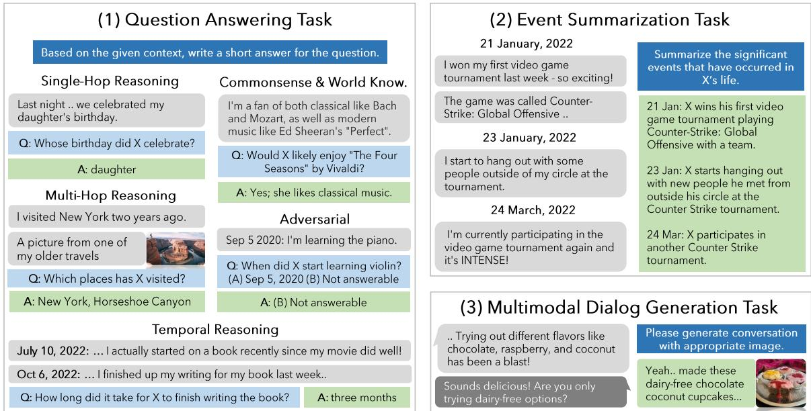  
Figure 2: Overview of our evaluation framework. We propose three tasks: question answering, event summarization and multimodal dialog generation to evaluate models’ comprehension in very long-term dialogues.

To this end, we present the first study of very long-term open-domain multi-modal dialogues, closely mirroring real-world online interactions, collected via a human-machine pipeline where we first use LLM-based generative agents to generate conversations and then ask human annotators to fix any long-term inconsistencies in the conversations. Specifically, drawing on the understanding that real-world conversations are a complex blend of collective memories (Assmann and Czaplicka, 1995; Hirst and Manier, 2008), individual viewpoints (Hirst et al., 2018), external influences (Hirst and Echterhoff, 2012), and the unique persona of the speakers (Pruitt and Grudin, 2003; Cooper, 1999; Zhou et al., 2020; Shum et al., 2020), we create very long-term dialogues based on LLM agent with the following features: (1) a unique persona (§3.1); (2) a timeline of causally interlinked events in their lives (§3.2); and (3) reflect & response mechanism to respond based on dialogue history (like in Park et al. (2023)) and image sharing & image reaction behavior which sends or reacts to images (§3.3). Finally, human annotators fix longrange inconsistencies in dialogues, remove irrelevant images, and verify the grounding of dialogs to events (§3.4). With this pipeline, we create LO-COMO, a dataset of 50 very long-term dialogues, each consisting of 300 turns and 9K tokens on avg., over up to 35 sessions (see Figure 1 and Table 1).

Conventional approaches for evaluating conversational agents in open-domain dialogues involves directly evaluating the agent response based on past dialogue history. It often employs lexical overlap (Papineni et al., 2002) and semantic overlap (Zhang et al., 2019) between ground truth and the agent response, or consistency (Ghazarian et al., 2022), contradiction (Nie et al., 2021; Welleck et al., 2019), and empathy (Zhang et al., 2021a, 2022) of the agent response. However, these evaluation metrics are not well-suited for directly assessing the agent’s comprehension of long-term contexts.

In this study, we present a holistic evaluation framework to assess an agent’s proficiency in managing and responding within long-term contexts (see Figure 2). First, agents need to “recall” past context correctly to integrate relevant information into future responses. We present a direct examination of their memory via a question answering (QA) task (§4.1). We classify questions into five distinct reasoning types to evaluate memory from multiple perspectives: single-hop, multi-hop, temporal, commonsense or world knowledge, and adversarial. Second, agents also need to recognize long-range causal and temporal connections in the dialogues to generate empathetic and relevant responses. We propose a measurement of their causal and temporal understanding with an event graph summarization task (§4.2). In this task, the event graphs linked to each LLM speaker serve as the correct answers, and models are tasked with extracting this information from the conversation history. Third, conversational agents need to utilize relevant context recalled from past conversations to generate responses that are consistent with the ongoing narrative. We assess this ability via the multi-modal dialog generation task (§4.3).

We present extensive experimental results on the LOCOMO benchmark using instruction-based LLMs, long-context LLMs, and RAG techniques (§5). Our findings include:

(1) Long-context LLMs and RAG demonstrate effectiveness in QA tasks, improving ‘memory’ capabilities of LLMs (with improvements ranging from 22-66%), but still significantly lag behind human levels (by 56%), especially in temporal reasoning, (by 73%);

(2) long-context LLMs demonstrate significant difficulty with adversarial questions in the QA task, showing a performance that is 83% lower than the base model. They are especially prone to misassigning dialogs or events to the wrong speaker. Moreover, they show poor performance on event graph summarization, lagging behind the base model by 14%, indicating that they may grasp the factual elements within the entire conversation but do not accurately comprehend the context; and

(3) RAG offers a balanced compromise, combining the accuracy of short-context LLMs with the extensive comprehension of wide-context LLMs, and does particularly well when dialogues are transformed into a database of assertions (observations) about each speaker’s life and persona.

## 2 Related Work

Long-term Dialogue. Recent approaches involve retrieving historical context from a range of previous dialogues and reasoning over retrieved segments in a temporal order (Lee et al., 2023b; Lu et al., 2023; Zhong et al., 2023; Liang et al., 2023) and/or using events to scaffold the dialogues (Jang et al., 2023; Zhang et al., 2023) to enable consistency in long-term conversations. Some limitations of such frameworks are: (1) The accuracy of retrieval can be compromised, as the retrieval model is generally trained on tasks focusing on semantic similarity rather than specifically on such dialogues. Additionally, real-world dialogues often feature co-references and missing content (i.e., anaphora) (Anantha et al., 2021), which further complicate the retrieval process (Mallen et al., 2023; Gao et al., 2023b; Liu et al., 2023); (2) Challenges arise in reasoning over retrieved documents, especially when the model struggles to identify the correct context among the retrieved data (Liu et al., 2024); (3) Reasoning over time intervals presents challenges. For example, the way a system responds about past events can vary depending on the amount of time that has passed since the last conversation (Zhang et al., 2023; Jang et al., 2023). Therefore, it is essential to have conversations of considerable length, as well as a systematic evaluation framework, to accurately assess the effectiveness of approaches to long-term dialogue generation. We design a long-term conversation generation pipeline based on retrieval augmentation and events graphs and propose a framework for evaluating long-term dialog agents.

Multi-modal Dialogue. Multi-modal dialogue primarily consists of two types of tasks: imagegrounded dialogue and image-sharing dialogue. The image-grounded dialogue task is centered around responding to questions (Antol et al., 2015; Das et al., 2017; Kottur et al., 2019) or creating natural conversations related to specific images (Mostafazadeh et al., 2017; Shuster et al., 2020; Meng et al., 2020; Zheng et al., 2022). Conversely, the image-sharing dialogue task focuses on selecting images that semantically align with the provided dialogue context (Zang et al., 2021; Feng et al., 2023; Lee et al., 2023c). We use a method from the image-sharing dialogue task to create multimodal dialogs which are then evaluated as an image-grounded dialogue task.

Synthetic Evaluation Benchmark. Faced with a shortage of human-generated data and observing that LLMs are approaching the quality of humanlevel annotations (He et al., 2023; Lee et al., 2023a), there has been a surge in research drawing inspiration from this development. Consequently, numerous studies have started utilizing LLMs to augment or synthesize large-scale dialogue benchmarks for assessing responses in everyday social interactions (Kim et al., 2023), examining responses in multi-modal environment (Feng et al., 2023), and evaluating responses that align with specific persona (Jandaghi et al., 2023). We leverage LLMs to create data but ensure its high quality with human verification and editing.

## 3 Generative Pipeline for LOCOMO

An overview of our generative pipeline for LO-COMO is shown in Figure 3. We create two virtual agents, named $\mathcal { L } _ { 1 }$ and $\mathcal { L } _ { 2 }$ , each initialized with a LLM M (i.e., gpt-3.5-turbo). To start, unique persona statements p are assigned to each agent $\mathcal { L } _ { i }$ ensuring the integration of distinct personalities into their dialogues (§3.1). To mirror real-life experiences, we create a temporal event graph $\mathcal { G }$ for each agent, which illustrates a realistic sequence of life events (§3.2). The LLM agent architecture (Park et al., 2023) is utilized for each agent $\mathcal { L } _ { i }$ enabling them to effectively memorize and reflect conversation history into ongoing dialogues (§3.3). Further, each agent $\mathcal { L } _ { i }$ can share coherent images, thereby enhancing the multi-modal dialogue aspect. Finally, human annotators are tasked with manually filtering and refining the generated data (§3.4).

## 3.1 Persona

We select an initial persona statement $p _ { c }$ from the MSC dataset (Xu et al., 2022), encompassing 4 to 5 sentences, and employ gpt-3.5-turbo as $\mathcal { M }$ to expand these into full persona statement $p$ (See examples and prompt details in Appendix A.1). The generated statements typically include details about one or more of the following elements (Gao et al., 2023a): objectives, past experiences, daily habits, and interpersonal relationships, as well as name, age, and gender of the individual.

## 3.2 Temporal Event Graph

To utilize the real-life experiences of each agent in the conversation, we construct a temporal event graph, labeled as $\mathcal { G } _ { : }$ for each agent. This graph $\mathcal { G }$ , consisting of events $e _ { i } ,$ , is produced by applying the condition of M (i.e., text-davinci-003) on a designated persona $p .$ Each event $e _ { i }$ is associated with a date of occurrence $t _ { i } .$ $\mathcal { G }$ includes causal connections $\boldsymbol { l } = ( e _ { i } , e _ { j } )$ that illustrate the causal relationships among events $e _ { i } \in { \mathcal { G } }$ and reflect a natural succession of events in an individual’s life. For each ${ \mathcal { G } } ,$ we create up to 25 events, spread across a time frame of 6 to 12 months, in an iterative process that balances between inference time and the coherence of temporal and causal connections in the timeline. Initially, a small batch of $k = 3$ events is generated, which is then used iteratively as input prompt to create the subsequent batch of k events. See details in Appendix A.2.

## 3.3 Virtual Agent Architecture

Every agent $\mathcal { L } _ { i }$ incorporates modules from generative agent architecture (Park et al., 2023). The agent has two functions: (1) reflect & respond; and (2) image sharing & image reaction. The agent is asked to primarily use the reflect & respond function while employing image sharing & image reaction function judiciously and appropriately within the context of the conversation.

Reflect & Respond. The fundamental process for each agent to reflect and respond involves the concept of short-term and long-term memory. During inference, agent $\mathcal { L } _ { i }$ conditions its responses on both short and long-term memories, paralleling how humans remember recent conversations while also recalling distilled important experiences from long-term memory. Following each session $k ,$ , each agent is asked to produce a summary $w _ { k }$ that is then stored in the short-term $\mathcal { H } _ { s }$ . This summary $w _ { k }$ is generated by conditioning $\mathcal { M }$ on both the most recent session conversation history $h _ { k }$ and the preceding summary $w _ { k - 1 } \in \mathcal { H } _ { l }$ . For each turn $j$ within session $k ,$ , a single turn of the conversation $h _ { k _ { j } }$ is transformed into an observation $\ O _ { k _ { i } }$ and then stored in the long-term memory $\mathcal { H } _ { l }$ . Then, agent $\mathcal { L } _ { i }$ generates a response in session $k + 1$ on the date $t _ { k + 1 } ^ { s }$ by basing it on the latest summary $w _ { k } .$ , reflections based on the retrieved relevant observations $o \in \mathcal { H } _ { s }$ , the ongoing conversation history in the current session $h _ { k + 1 }$ and persona statement $p .$ Long-term temporal narratives are induced in the conversation by additionally conditioning the agent’s response on the subset of events in $\mathcal { G }$ that occur between the last and current session i.e. $\{ e \in \mathcal { G } | t _ { k } ^ { s } \ < \ t _ { i } ^ { e } \ < \ t _ { k + 1 } ^ { s } \}$ . See details in $\mathsf { A p - }$ pendix A.2.1.

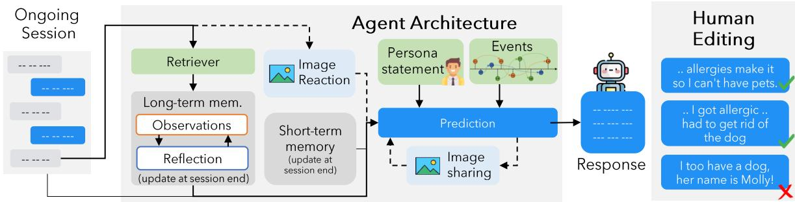  
Figure 3: Overview of the generative pipeline for LOCOMO. Each LLM agent is assigned a distinct persona and a timeline of causally connected events in their file. The agent is equipped with a memory and reflection module to retrieve relevant history for dialog generation and is also enabled for image-sharing and image-reaction behaviors (left). The generated conversations are edited by human annotators to maintain long-range consistency (right).

Image Sharing & Image Reaction. The image sharing & image reaction functions are integrated to add a multi-modal dimension to the long-term dialogues.<sup>2</sup> The image sharing function is called when the agent decides to send an image. This process includes: (1) Generate a caption c for the intended image using M; (2) Convert the caption c into relevant keywords w using M; (3) Use the keywords k to find an image through web search WEB(k)<sup>3</sup>; (4) Share the chosen image. Conversely, the image reaction function is triggered upon receiving an image from another agent and entails: (1) Generate caption c for the received image<sup>4</sup>; (2) Generate a reaction for the received image in response using M (See Appendix A.2.1).

## 3.4 Human Verification & Editing

In the concluding phase, human annotators are tasked with (1) editing the dialogue to eliminate long-term inconsistencies, (2) removing or substituting irrelevant images, and (3) verifying and editing for alignment between event graphs and the content of the conversations. Overall, we observed that annotators edited nearly 15% of the dialog turns and removed or substituted approx. 19% images present in the LLM-generated dataset. See examples of some edits in Appendix A.3.

## 4 LOCOMO Evaluation Benchmark

Based on the dialogues generated in section 3, we introduce an evaluation benchmark (see Figure 2) composed of three tasks to assess the accuracy of long-term memory. See statistics of the dataset and evaluation benchmark in Table 5 in the Appendix.

## 4.1 Question Answering Task

A conversational agent is expected to possess a memory to remember previous dialogues, reflecting it to create more engaging responses in future conversations. For a comprehensive assessment of this memory, we introduce a question-answering task divided into five distinct reasoning categories: (1) Single-hop questions require answers based on a single session; (2) Multi-hop questions require synthesizing information from multiple different sessions; (3) Temporal reasoning questions can be answered through temporal reasoning and capturing time-related data cues within the conversation; (4) Open-domain knowledge questions can be answered by integrating a speaker’s provided information with external knowledge such as commonsense or world facts; (5) Adversarial questions are designed to trick the agent into providing wrong answers, with the expectation that the agent will correctly identify them as unanswerable.

For each category, we calculate the F1 score for exact matches, following the normalization of both the predicted and the actual ground truth answers. However, evaluating long-form answers with automated metrics often presents challenges (Xu et al., 2023). LLMs tend to produce paraphrased responses in varied formats, complicating exact match evaluation. To simplify evaluation in our task, we ensure that answers in our QA annotations are directly taken from the conversations as much as possible. We instruct the LLMs to repli cate the exact wording in the conversation when feasible and employ the F1 partial match metric for evaluating the predictions. Each QA sample is also annotated with the turn IDs in the conversation logs that contain the answer. We report the accuracy of retrieving the correct context for RAG models.

## 4.2 Event Summarization Task

The conversation is generated based on a temporal event graph G which is constructed by conditioning an LLM on a persona statement p, reflecting the chronological sequence of events in an individual’s life. A conversational agent is expected to not only comprehend the causal connections and the sequence of events in G but also to recount these events as required. To evaluate the agent’s grasp of event dynamics, we introduce the event summarization task which challenges the agent to summarize the events within a designated timeframe and compares the agent’s summary with events in G. The events in LOCOMO are densely annotated lists of life events that are hard to summarize due to temporal and causal coreferences present in the dialogues, in contrast to existing summarization benchmarks of research papers (Li et al., 2023a), movie scripts (Chen et al., 2022), books (Krysci´ nski et al.´ , 2022), emails (Zhang et al., 2021b) etc.

Traditional metrics like BLEU (Papineni et al., 2002) and ROGUE (Lin, 2004) focus on lexical similarity between the reference and generated summaries, not meeting our needs as we emphasize factual accuracy in summarization. In this context, we employ FactScore (Min et al., 2023), a method that evaluates the factuality of generated text by decomposing both the reference and hypothesis into atomic facts. We adapt the metric to measure (1) precision of the summarized content by counting the number of atomic facts within the content that correspond with those in G; (2) recall of the summarized content by determining how comprehensively the atomic facts of G are represented within the content. We present the F1 score, derived from the calculated precision and recall.

## 4.3 Multi-Modal Dialogue Generation Task

The conversations in our dataset are anchored to specific personas p and corresponding events G tailored to p. The topics in conversations evolve from events that were introduced in earlier dialogues, spanning weeks or months. This structure allows for an assessment of whether conversational agents can sustain a coherent persona and a continuous narrative over time. For example, if a speaker recently had an injury, the next conversations would likely focus on them recuperating, rather than engaging in adventurous activities. We assess such consistency by measuring how closely the predicted multi-modal dialogues align with the ground truth multi-modal dialogues in our dataset, quantifying this alignment through MMRelevance (Feng et al., 2023), in addition to other NLG metrics.

## 5 Experimental Setup

For the question-answering and event summarization tasks, we replace images in LOCOMO with their captions (Li et al., 2023b), and use state-ofart LLMs to reason over text-only dialogues interleaved with image captions. We use images directly for the multimodal dialog generation task only. See additional details in Appendix C.

Question Answering. We evaluate three types of models: (1) Base LLMs operating with constrained context lengths where earlier dialogues are omitted i.e., Mistral-7B (Jiang et al., 2023), LLama-70B-chat (Touvron et al., 2023), gpt-3.5-turbo <sup>5</sup>, and gpt-4-turbo <sup>6</sup>; (2) Longcontext LLMs with an extended context window i.e., gpt-3.5-turbo-16k; (3) Retrievalaugmented Generation (RAG) involves retrieving relevant context from a database of dialog history, observations (assertions about speakers; see §3.3, Figure 9), or session-level summaries (see §3.3, Figure 8). We employ DRAGON (Lin et al., 2023) as retriever and gpt-3.5-turbo-16k as reader.

Event Summarization. We present experiments using Base and Long-context setups from the question-answering task, but refrain from including RAG since summarization requires a comprehensive understanding of the entire dialogue, rather than just retrieving a specific portion. We implement incremental summarization i.e., iteratively create a summary of a preceding sessions and then use that summary as a basis to summarize the subsequent sessions (Chang et al., 2023).

Multi-modal Dialogue Generation. We generate 50 conversations using our automated pipeline (without human filtering; §3) for training data and train three versions of MiniGPT-5 (Zheng et al., 2023): (1) Base trains on prior dialogue turns only; (2) + summary trains on prior dialogue turns and a global summary of the ongoing conversation; (3) + observation trains on prior dialogue turns and observations retrieved from conversation history. Each run is initialized with a MiniGPT-5 checkpoint finetuned on MMDialog (Feng et al., 2023).

<table><tr><td rowspan="2">Category</td><td rowspan="2">Model</td><td rowspan="2">Context Length</td><td colspan="6">Answer Prediction (F1)</td></tr><tr><td>Single Hop</td><td>Multi Hop</td><td>Temporal</td><td>Open Domain</td><td>Adversarial</td><td>Overall</td></tr><tr><td>Human</td><td>Human</td><td>-</td><td>95.1</td><td>85.8</td><td>92.6</td><td>75.4</td><td>89.4</td><td>87.9</td></tr><tr><td rowspan="4">Base</td><td>Mistral-Instruct-7B</td><td>8K</td><td>10.2</td><td>12.8</td><td>16.1</td><td>19.5</td><td>17.0</td><td>13.9</td></tr><tr><td>Llama-2-Chat-70B</td><td>4,096</td><td>19.7</td><td>14.4</td><td>13.3</td><td>15.9</td><td>22.1</td><td>17.9</td></tr><tr><td>GPT-3.5-turbo</td><td>4,096</td><td>29.9</td><td>23.3</td><td>17.5</td><td>29.5</td><td>12.8</td><td>22.4</td></tr><tr><td>GPT-4-turbo</td><td>4,096</td><td>23.4</td><td>23.4</td><td>10.4</td><td>24.6</td><td>70.2</td><td>32.1</td></tr><tr><td rowspan="4">Long context</td><td rowspan="4">GPT-3.5-turbo-16K</td><td>4K</td><td>31.7</td><td>25.4</td><td>16.8</td><td>27.6</td><td>13.1</td><td>24.1</td></tr><tr><td>8K</td><td>38.8</td><td>31.2</td><td>21.0</td><td>35.0</td><td>8.4</td><td>25.2</td></tr><tr><td>12K</td><td>51.1</td><td>40.4</td><td>25.0</td><td>36.5</td><td>6.4</td><td>33.5</td></tr><tr><td>16K</td><td>56.4</td><td>42.0</td><td>20.3</td><td>37.2</td><td>2.1</td><td>37.8</td></tr></table>

Table 2: Question answering performance of Base and Long-context models. Optimal performance is in bold. Results are based on F1-score for answer prediction; higher is better.

<table><tr><td rowspan="2">Retrieval Unit</td><td rowspan="2">top-k</td><td colspan="6">Answer Prediction (F1 score)</td><td colspan="6">Recall Accuracy (R@k)</td></tr><tr><td>Single Hop</td><td>Multi Hop</td><td>Temporal</td><td>Open Domain</td><td>Adver-sarial</td><td>Overall</td><td>Single Hop</td><td>Multi Hop</td><td>Temporal</td><td>Open Domain</td><td>Adver-sarial</td><td>Overall</td></tr><tr><td>None</td><td>-</td><td>29.9</td><td>23.3</td><td>17.5</td><td>29.5</td><td>12.8</td><td>22.4</td><td>-</td><td>-</td><td>-</td><td>-</td><td>-</td><td>-</td></tr><tr><td rowspan="4">Dialog</td><td>5</td><td>42.9</td><td>19.4</td><td>21.3</td><td>35.8</td><td>31.9</td><td>31.7</td><td>66.2</td><td>34.4</td><td>89.2</td><td>38.5</td><td>45.7</td><td>58.8</td></tr><tr><td>10</td><td>46.3</td><td>26.8</td><td>24.8</td><td>37.5</td><td>29.8</td><td>34.6</td><td>72.8</td><td>247.4</td><td>97.3</td><td>53.8</td><td>54.3</td><td>67.5</td></tr><tr><td>25</td><td>48.1</td><td>36.1</td><td>26.2</td><td>43.4</td><td>23.4</td><td>35.8</td><td>87.5</td><td>64.1</td><td>97.3</td><td>67.9</td><td>69.1</td><td>79.9</td></tr><tr><td>50</td><td>50.9</td><td>37.2</td><td>24.6</td><td>38.3</td><td>17.0</td><td>34.8</td><td>90.4</td><td>75.5</td><td>97.3</td><td>67.9</td><td>77.7</td><td>84.8</td></tr><tr><td rowspan="4">Observation</td><td>5</td><td>44.3</td><td>30.6</td><td>41.9</td><td>40.2</td><td>44.7</td><td>41.4</td><td>52.9</td><td>40.1</td><td>81.1</td><td>38.5</td><td>29.8</td><td>49.6</td></tr><tr><td>10</td><td>42.2</td><td>30.5</td><td>42.1</td><td>41.9</td><td>36.2</td><td>38.8</td><td>57.4</td><td>53.1</td><td>83.8</td><td>46.2</td><td>41.5</td><td>57.1</td></tr><tr><td>25</td><td>44.6</td><td>33.2</td><td>41.8</td><td>41.9</td><td>27.7</td><td>38.0</td><td>71.3</td><td>63.8</td><td>83.8</td><td>66.7</td><td>45.7</td><td>66.0</td></tr><tr><td>50</td><td>44.0</td><td>34.5</td><td>41.1</td><td>41.9</td><td>27.7</td><td>37.8</td><td>72.8</td><td>73.2</td><td>83.8</td><td>74.4</td><td>56.4</td><td>71.1</td></tr><tr><td rowspan="3">Summary</td><td>2</td><td>34.6</td><td>15.7</td><td>26.9</td><td>26.5</td><td>36.2</td><td>29.9</td><td>68.4</td><td>39.6</td><td>56.8</td><td>50.0</td><td>73.4</td><td>61.5</td></tr><tr><td>5</td><td>36.6</td><td>16.6</td><td>31.0</td><td>34.7</td><td>38.3</td><td>32.5</td><td>81.6</td><td>57.0</td><td>70.3</td><td>60.3</td><td>86.2</td><td>75.1</td></tr><tr><td>10</td><td>34.5</td><td>14.7</td><td>29.3</td><td>31.6</td><td>40.4</td><td>31.5</td><td>93.4</td><td>82.3</td><td>91.9</td><td>80.8</td><td>94.7</td><td>90.7</td></tr></table>

Table 3: Question answering performance of RAG-based GPT-3.5-turbo-16k. Optimal performance is in bold. Results are based on F1-score metric for answer prediction and recall@k for recall accuracy; higher is better.

## 6 Experimental Results

We evaluate and analyze the comprehensive performance of all baseline methods for question answering (§6.1), event graph summarization (§6.2), and multi-modal dialogue generation (§6.3).

## 6.1 Question Answering Task

Tables 2 and 3 present the performance results for the question answering task. We find that: (1) LLMs with limited context length face challenges in understanding extremely long conversations due to truncated context windows. Despite gpt-4-turbo emerging as the top-performing model with an overall score of 32.4, it notably lags behind the human benchmark of 87.9; (2) longcontext LLMs can comprehend longer narratives, yet they are prone to generating hallucinations. gpt-3.5-turbo-16k outperforms other approaches, but its performance on adversarial questions drops to a mere 2.1%, as compared to 22.1% using Llama-2-Chat and 70.2% using GPT-4-turbo with 4K context windows. This indicates that LLMs can be easily misled into generating hallucinations when they are subjected to long contexts; (3) RAG is effective when conversations are stored as observations. There is a noticeable 5% improvement with gpt-3.5-turbo when the input is top 5 relevant observations instead of pure conversation logs. This improvement falters with an increase in the number of retrieved observations, suggesting that it is important to reduce the signalto-noise (SNR) ratio in retrieved contexts for models to utilize the context accurately. Conversely, using session summaries as context does not significantly improve the performance despite high recall accuracies<sup>7</sup>, likely due to loss of information during the conversion of dialogs to summaries.

The interesting finding is that time reasoning and open-domain knowledge questions are the most challenging scenarios.

(1) LLMs face challenges in understanding time concepts within dialogues, which is consistent with findings from other single-turn-based benchmarks focused on temporal reasoning capabilities for LLMs (Wang and Zhao, 2023).

(2) LLMs struggle with open-domain knowledge and degrade in the RAG setting. This suggests that while certain open-domain knowledge may be embedded within the model’s parameters, introducing improper context from inaccurate retrieval can lead to a decline in performance (Mallen et al., 2023).

<table><tr><td rowspan="2">Category</td><td rowspan="2">Model</td><td rowspan="2">Context Length</td><td colspan="3">ROGUE</td><td colspan="3">FactScore</td></tr><tr><td>ROGUE-1</td><td>ROGUE-2</td><td>ROGUE-L</td><td>Precision</td><td>Recall</td><td>F1</td></tr><tr><td rowspan="4">Base</td><td>Mistral-Instruct-7B</td><td>8K</td><td>29.4</td><td>7.2</td><td>14.1</td><td>27.1</td><td>19.8</td><td>23.0</td></tr><tr><td>Llama-2-Chat-70B</td><td>4,096</td><td>28.1</td><td>9.3</td><td>14.8</td><td>36.3</td><td>22.7</td><td>28.3</td></tr><tr><td>GPT-4-turbo</td><td>4,096</td><td>38.8</td><td>11.4</td><td>20.6</td><td>51.6</td><td>41.8</td><td>45.1</td></tr><tr><td>GPT-3.5-turbo</td><td>4,096</td><td>41.1</td><td>13.5</td><td>20.9</td><td>45.3</td><td>46.5</td><td>45.9</td></tr><tr><td>Long context</td><td>GPT-3.5-turbo-16K</td><td>16K</td><td>36.2</td><td>8.5</td><td>16.4</td><td>42.3</td><td>37.8</td><td>39.9</td></tr></table>

Table 4: Event summarization performance of Base and Long-context models. The optimal performance is shown in bold. Results are based on ROUGE and FactScore (Min et al., 2023) metrics; higher is better.

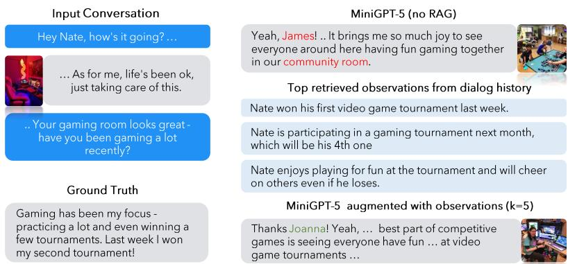  
A. Example of a prediction from MiniGPT-5 with and without retrieval-based augmentation

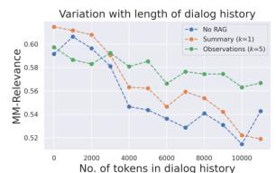

B. MM-Relevance by length of dialog (tokens)  
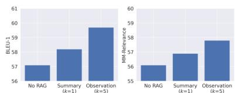  
C. BL EU-1 MM-Relevance of various methods  
Figure 4: Multimodal dialog generation performance of MiniGPT-5. (A) an example of multimodal dialog predicted using MiniGPT5 with and without observation as retrieved context, (B) Variation of MM-Relevance score with length of dialog history, and (C) comparison of RAG-based MiniGPT-5 methods.

## 6.2 Event Summarization Task

Table 4 presents results for the event summarization task. The use of incremental summarization with gpt-3.5-turbo leads to the highest performance in both recall and F1 score. While gpt-4-turbo records a 5.3% improvement in precision over with gpt-3.5-turbo, it does not fare as well in terms of recall. The event summarization task requires long-range dependency to understand the temporal and causal connections between the events discussed by the speaker in multiple sessions (see Figure 7). Contrary to expectations, the long-context model does not surpass the base model, despite its capability for extended-range reasoning facilitated by a larger context window. gpt-3.5-turbo-16k exhibits a decline in both precision (by 3.0%) and recall (by 8.7%) compared to gpt-3.5-turbo which has a 4K context window. This suggests that longcontext models may not be proficient at utilizing their context appropriately, which also aligns with similar findings in Li et al. (2023a) as well as the QA task in LOCOMO. In terms of both the ROUGE and FactScore metrics, commercial models (gpt-4-turbo, gpt-3.5-turbo) significantly outshine their open-source counterparts. Nonetheless, there remains considerable scope for improving performance on this task.

From a manual analysis of predicted summaries, we identify five broad categories of event summarization errors made by LLMs: (1) missing information in events because the model fails to make temporal and/or causal connections over a lengthy conversation; (2) hallucinations i.e., models pad extra details that are either not present in the conversation or are part of a different event in the same session; (3) errors from misunderstanding of dialog cues such as humor or sarcasm is a distinctive issue with comprehension of dialogs; (4) inaccurate speaker attributions; and (5) insignificant dialogs that are wrongly considered as salient events. See examples in Table 7 in the Appendix.

## 6.3 Multi-Modal Dialog Generation Task

Figure 4 illustrates the effectiveness of various MiniGPT-5 training variants in multi-modal dialogue generation. Incorporating context into training enhances performance, with the inclusion of observation as context yielding significantly improved results. For instance, in Figure 4A, the retrieved observations contain information about the speaker’s experience in video game tournaments, which leads to the prediction of dialog and images that are more faithful to the speaker’s persona. This observation is consistent with earlier findings from the QA task as well (see Table 3). Also, we observe that the MM-Relevance score drops with an increase in the length of dialog history (see Figure 4B). Retrieval-augmented generation alleviates the drop in MM-Relevance to some extent.

## 7 Conclusion

We develop a human-machine pipeline to collect LOCOMO, a datset of 50 high-quality very long conversations, each encompassing 300 turns and 9K tokens on avg., over up to 35 sessions, and propose an evaluation framework consisting of three tasks that evaluate models’ proficiency in long conversations. Our experiments show that LLMs struggle to comprehend long-term narratives within the dialog and fail to draw temporal and causal connections between events discussed by speakers.

## 8 Limitations

Hybrid human-machine generated data. Our dataset is sourced primarily from text generated by LLMs. We pursued this method, which has quickly emerged as a popular alternative to time-intensive manual data collection (Kim et al., 2023; Jang et al., 2023), to avoid the logistical and legal complexities of collecting very long-term real-world conversations at scale. We ensure that the dataset mirrors real-world interactions as much as possible by having human annotators verify and edit the generated conversations. However, we acknowledge that this dataset may not fully reflect the nuances of realworld online conversations.

Limited exploration of multimodal behavior. Since the images in our dataset are sourced from the web, they do not demonstrate the visual long-term consistencies that are usually exhibited in personal photos (e.g., appearance, home environment, people and pets, etc.). Consequently, we find that the images in our dataset can be replaced with their captions without much loss of information, except for cases where OCR is required. Nevertheless, our work is a first step toward research into the multimodal aspect of very long-term conversations.

Language. Our LLM-based pipeline for generating long-term conversations has been developed for the English language only. However, our pipeline can be made to work with any other language using an LLM that is proficient at that language and appropriate translations of our prompts.

Closed-source LLMs. We use state-of-the-art LLMs in our dialog generation pipeline to create a dialog dataset that is as realistic as possible. Unfortunately, this meant employing the strongest commercial LLMs available through a paid API, similar to many concurrent works that generate synthetic conversations (Zhong et al., 2023; Lu et al., 2023). We will make the code for our generative pipeline publicly available in the hope that it can be made to work effectively with state-of-the-art open-source LLMs in the future.

Evaluation of long-form NLG. LLMs are prone to generating verbose answers even when prompted to answer in short phrases. This creates challenges in evaluating the correctness of answers provided by LLMs and has been widely documented in NLP literature (Chang et al., 2023; Xu et al., 2023; Krishna et al., 2023). Our evaluation framework suffers from the same challenges when used for experimenting with LLMs.

## 9 Broader Impacts

We adopt and improve a framework of generative agents introduced in Park et al. (2023) for the generation of long-term conversations. Consequently, the ethical concerns of generative agents outlined by Park et al. (2023) apply to our work as well, especially since the goal of our framework is to make the conversations as realistic as possible.

Specifically, conversational agents that can pose as human beings with a realistic life, as enabled by the temporal event graphs in our framework, pose the risk that users may form parasocial relationships with such agents that may affect their lives adversely. We recommend that any practical deployment of the generative frameworks mentioned in our work be always prefaced with a disclaimer about the source of the dialogs.

Second, the use of multimodal LLMs (Zheng et al., 2023) to generate images conditioned on dialog can lead to the propagation of misinformation and social biases, especially if the conversational agent can be coerced into parroting false information or dangerous opinions.

Third, it is tempting to use generative agents to substitute real humans for a process, especially when there are significant challenges in working with humans for a particular goal e.g., collecting real-world interactions between humans over a year or more. Care must be taken to ensure that such substitutes are not made in studies whose outcomes may be used to make real-world decisions with tangible impacts on humans. Our work is merely a study of model comprehension in very long-term conversations. We do not make any recommendations for real-world policies based on this study and advise potential users of our framework to avoid making such recommendations as well.

## References

Jaewoo Ahn, Yeda Song, Sangdoo Yun, and Gunhee Kim. 2023. MPCHAT: Towards multimodal personagrounded conversation. In Proceedings of the 61st Annual Meeting of the Association for Computational Linguistics (Volume 1: Long Papers), pages 3354– 3377, Toronto, Canada. Association for Computational Linguistics.

Raviteja Anantha, Svitlana Vakulenko, Zhucheng Tu, Shayne Longpre, Stephen Pulman, and Srinivas Chappidi. 2021. Open-domain question answering goes conversational via question rewriting. In Proceedings ofthe 2021 Conference ofthe North American Chapter ofthe Associationfor Computational Linguistics: Human Language Technologies, pages 520–534.

Stanislaw Antol, Aishwarya Agrawal, Jiasen Lu, Margaret Mitchell, Dhruv Batra, C Lawrence Zitnick, and Devi Parikh. 2015. Vqa: Visual question answering. In Proceedings ofthe IEEE international conference on computer vision, pages 2425–2433.

Jan Assmann and John Czaplicka. 1995. Collective memory and cultural identity. New german critique, (65):125–133.

Amanda Bertsch, Uri Alon, Graham Neubig, and Matthew Gormley. 2024. Unlimiformer: Long-range transformers with unlimited length input. Advances in Neural Information Processing Systems, 36.

Yapei Chang, Kyle Lo, Tanya Goyal, and Mohit Iyyer. 2023. Booookscore: A systematic exploration of book-length summarization in the era of llms. In The Twelfth International Conference on Learning Representations.

Mingda Chen, Zewei Chu, Sam Wiseman, and Kevin Gimpel. 2022. Summscreen: A dataset for abstractive screenplay summarization. In Proceedings ofthe 60th Annual Meeting ofthe Associationfor Computational Linguistics (Volume 1: Long Papers), pages 8602–8615.

Yukang Chen, Shengju Qian, Haotian Tang, Xin Lai, Zhijian Liu, Song Han, and Jiaya Jia. 2023. Longlora: Efficient fine-tuning of long-context large language models. In The Twelfth International Conference on Learning Representations.

Alan Cooper. 1999. The inmates are running the asylum. Springer.

Tri Dao, Dan Fu, Stefano Ermon, Atri Rudra, and Christopher Ré. 2022. Flashattention: Fast and memory-efficient exact attention with io-awareness. Advances in Neural Information Processing Systems, 35:16344–16359.

Abhishek Das, Satwik Kottur, Khushi Gupta, Avi Singh, Deshraj Yadav, José MF Moura, Devi Parikh, and Dhruv Batra. 2017. Visual dialog. In Proceedings of the IEEE conference on computer vision and pattern recognition, pages 326–335.

Jiazhan Feng, Qingfeng Sun, Can Xu, Pu Zhao, Yaming Yang, Chongyang Tao, Dongyan Zhao, and Qingwei Lin. 2023. MMDialog: A large-scale multi-turn dialogue dataset towards multi-modal open-domain conversation. In Proceedings of the 61st Annual Meeting of the Association for Computational Linguistics (Volume 1: Long Papers), pages 7348–7363, Toronto, Canada. Association for Computational Linguistics.

Silin Gao, Beatriz Borges, Soyoung Oh, Deniz Bayazit, Saya Kanno, Hiromi Wakaki, Yuki Mitsufuji, and Antoine Bosselut. 2023a. PeaCoK: Persona commonsense knowledge for consistent and engaging narratives. In Proceedings ofthe 61st Annual Meeting ofthe Associationfor Computational Linguistics (Volume 1: Long Papers), pages 6569–6591, Toronto, Canada. Association for Computational Linguistics.

Tianyu Gao, Howard Yen, Jiatong Yu, and Danqi Chen. 2023b. Enabling large language models to generate text with citations. In Proceedings ofthe 2023 Conference on Empirical Methods in Natural Language Processing, pages 6465–6488, Singapore. Association for Computational Linguistics.

Sarik Ghazarian, Nuan Wen, Aram Galstyan, and Nanyun Peng. 2022. Deam: Dialogue coherence evaluation using amr-based semantic manipulations. In Proceedings of the 60th Annual Meeting of the Associationfor Computational Linguistics (Volume 1: Long Papers), pages 771–785.

Xingwei He, Zhenghao Lin, Yeyun Gong, Alex Jin, Hang Zhang, Chen Lin, Jian Jiao, Siu Ming Yiu, Nan Duan, Weizhu Chen, et al. 2023. Annollm: Making large language models to be better crowdsourced annotators. arXiv preprint arXiv:2303.16854.

William Hirst and Gerald Echterhoff. 2012. Remembering in conversations: The social sharing and reshaping of memories. Annual review ofpsychology, 63:55–79.

William Hirst and David Manier. 2008. Towards a psychology of collective memory. Memory, 16(3):183– 200.

William Hirst, Jeremy K Yamashiro, and Alin Coman. 2018. Collective memory from a psychological perspective. Trends in cognitive sciences, 22(5):438– 451.

Pegah Jandaghi, XiangHai Sheng, Xinyi Bai, Jay Pujara, and Hakim Sidahmed. 2023. Faithful persona-based conversational dataset generation with large language models. arXiv preprint arXiv:2312.10007.

Jihyoung Jang, Minseong Boo, and Hyounghun Kim. 2023. Conversation chronicles: Towards diverse temporal and relational dynamics in multi-session conversations. In Proceedings of the 2023 Conference on Empirical Methods in Natural Language Processing, pages 13584–13606, Singapore. Association for Computational Linguistics.

Albert Q Jiang, Alexandre Sablayrolles, Arthur Mensch, Chris Bamford, Devendra Singh Chaplot, Diego de las Casas, Florian Bressand, Gianna Lengyel, Guillaume Lample, Lucile Saulnier, et al. 2023. Mistral 7b. arXiv preprint arXiv:2310.06825.

Hyunwoo Kim, Jack Hessel, Liwei Jiang, Peter West, Ximing Lu, Youngjae Yu, Pei Zhou, Ronan Bras, Malihe Alikhani, Gunhee Kim, Maarten Sap, and Yejin Choi. 2023. SODA: Million-scale dialogue distillation with social commonsense contextualization. In Proceedings of the 2023 Conference on Empirical Methods in Natural Language Processing, pages 12930–12949, Singapore. Association for Computational Linguistics.

Satwik Kottur, José M. F. Moura, Devi Parikh, Dhruv Batra, and Marcus Rohrbach. 2019. CLEVR-dialog: A diagnostic dataset for multi-round reasoning in visual dialog. In Proceedings ofthe 2019 Conference ofthe North American Chapter ofthe Associationfor Computational Linguistics: Human Language Technologies, Volume 1 (Long and Short Papers), pages 582–595, Minneapolis, Minnesota. Association for Computational Linguistics.

Kalpesh Krishna, Erin Bransom, Bailey Kuehl, Mohit Iyyer, Pradeep Dasigi, Arman Cohan, and Kyle Lo. 2023. Longeval: Guidelines for human evaluation of faithfulness in long-form summarization. In Proceed ings ofthe 17th Conference ofthe European Chapter ofthe Associationfor Computational Linguistics, pages 1642–1661.

Wojciech Krysci´ nski, Nazneen Rajani, Divyansh Agar-´ wal, Caiming Xiong, and Dragomir Radev. 2022. Booksum: A collection of datasets for long-form narrative summarization. In Findings ofthe Associ ationfor Computational Linguistics: EMNLP 2022, pages 6536–6558.

Dong-Ho Lee, Jay Pujara, Mohit Sewak, Ryen White, and Sujay Jauhar. 2023a. Making large language models better data creators. In Proceedings of the 2023 Conference on Empirical Methods in Natural Language Processing, pages 15349–15360, Singapore. Association for Computational Linguistics.

Gibbeum Lee, Volker Hartmann, Jongho Park, Dimitris Papailiopoulos, and Kangwook Lee. 2023b. Prompted LLMs as chatbot modules for long opendomain conversation. In Findings ofthe Association

for Computational Linguistics: ACL 2023, pages 4536–4554, Toronto, Canada. Association for Computational Linguistics.

Young-Jun Lee, Byungsoo Ko, Han-Gyu Kim, Jonghwan Hyeon, and Ho-Jin Choi. 2023c. Dialogcc: An automated pipeline for creating high-quality multimodal dialogue datasets. In NeurIPS 2023 Workshop on Instruction Tuning and Instruction Following.

Jiaqi Li, Mengmeng Wang, Zilong Zheng, and Muhan Zhang. 2023a. Loogle: Can long-context language models understand long contexts? arXiv preprint arXiv:2311.04939.

Junnan Li, Dongxu Li, Silvio Savarese, and Steven Hoi. 2023b. Blip-2: Bootstrapping language-image pretraining with frozen image encoders and large language models. In International Conference on Machine Learning.

Yanran Li, Hui Su, Xiaoyu Shen, Wenjie Li, Ziqiang Cao, and Shuzi Niu. 2017. Dailydialog: A manually labelled multi-turn dialogue dataset. In Proceedings of the Eighth International Joint Conference on Natural Language Processing (Volume 1: Long Papers), pages 986–995.

Xinnian Liang, Bing Wang, Hui Huang, Shuangzhi Wu, Peihao Wu, Lu Lu, Zejun Ma, and Zhoujun Li. 2023. Unleashing infinite-length input capacity for largescale language models with self-controlled memory system. arXiv preprint arXiv:2304.13343.

Chin-Yew Lin. 2004. ROUGE: A package for automatic evaluation of summaries. In Text Summarization Branches Out, pages 74–81, Barcelona, Spain. Association for Computational Linguistics.

Sheng-Chieh Lin, Akari Asai, Minghan Li, Barlas Oguz, Jimmy Lin, Yashar Mehdad, Wen-tau Yih, and Xilun Chen. 2023. How to train your dragon: Diverse augmentation towards generalizable dense retrieval. In Findings ofthe Associationfor Computational Linguistics: EMNLP 2023, pages 6385–6400, Singapore. Association for Computational Linguistics.

Nelson Liu, Tianyi Zhang, and Percy Liang. 2023. Evaluating verifiability in generative search engines. In Findings ofthe Associationfor Computational Linguistics: EMNLP 2023, pages 7001–7025, Singapore. Association for Computational Linguistics.

Nelson F. Liu, Kevin Lin, John Hewitt, Ashwin Paranjape, Michele Bevilacqua, Fabio Petroni, and Percy Liang. 2024. Lost in the Middle: How Language Models Use Long Contexts. Transactions ofthe Associationfor Computational Linguistics, 12:157–173.

Junru Lu, Siyu An, Mingbao Lin, Gabriele Pergola, Yulan He, Di Yin, Xing Sun, and Yunsheng Wu. 2023. Memochat: Tuning llms to use memos for consistent long-range open-domain conversation. arXiv preprint arXiv:2308.08239.

Alex Mallen, Akari Asai, Victor Zhong, Rajarshi Das, Daniel Khashabi, and Hannaneh Hajishirzi. 2023. When not to trust language models: Investigating effectiveness of parametric and non-parametric memories. In Proceedings ofthe 61st Annual Meeting of the Associationfor Computational Linguistics (Volume 1: Long Papers), pages 9802–9822, Toronto, Canada. Association for Computational Linguistics.

Yuxian Meng, Shuhe Wang, Qinghong Han, Xiaofei Sun, Fei Wu, Rui Yan, and Jiwei Li. 2020. Openvidial: A large-scale, open-domain dialogue dataset with visual contexts. arXiv preprint arXiv:2012.15015.

Sewon Min, Kalpesh Krishna, Xinxi Lyu, Mike Lewis, Wen-tau Yih, Pang Koh, Mohit Iyyer, Luke Zettlemoyer, and Hannaneh Hajishirzi. 2023. FActScore: Fine-grained atomic evaluation of factual precision in long form text generation. In Proceedings ofthe 2023 Conference on Empirical Methods in Natural Language Processing, pages 12076–12100, Singapore. Association for Computational Linguistics.

Nasrin Mostafazadeh, Chris Brockett, Bill Dolan, Michel Galley, Jianfeng Gao, Georgios Spithourakis, and Lucy Vanderwende. 2017. Image-grounded conversations: Multimodal context for natural question and response generation. In Proceedings of the Eighth International Joint Conference on Natural Language Processing (Volume 1: Long Papers), pages 462–472, Taipei, Taiwan. Asian Federation of Natural Language Processing.

Yixin Nie, Mary Williamson, Mohit Bansal, Douwe Kiela, and Jason Weston. 2021. I like fish, especially dolphins: Addressing contradictions in dialogue modeling. In Proceedings ofthe 59th Annual Meeting of the Association for Computational Linguistics and the 11th International Joint Conference on Natural Language Processing (Volume 1: Long Papers), pages 1699–1713.

Kishore Papineni, Salim Roukos, Todd Ward, and Wei-Jing Zhu. 2002. Bleu: a method for automatic evaluation of machine translation. In Proceedings ofthe 40th Annual Meeting ofthe Associationfor Computational Linguistics, pages 311–318, Philadelphia, Pennsylvania, USA. Association for Computational Linguistics.

Joon Sung Park, Joseph O’Brien, Carrie Jun Cai, Meredith Ringel Morris, Percy Liang, and Michael S. Bernstein. 2023. Generative agents: Interactive simulacra of human behavior. In Proceedings ofthe 36th Annual ACM Symposium on User Interface Software and Technology, UIST ’23, New York, NY, USA. Association for Computing Machinery.

John Pruitt and Jonathan Grudin. 2003. Personas: practice and theory. In Proceedings of the 2003 conference on Designingfor user experiences, pages 1–15.

Ori Ram, Yoav Levine, Itay Dalmedigos, Dor Muhlgay, Amnon Shashua, Kevin Leyton-Brown, and Yoav

Shoham. 2023. In-context retrieval-augmented language models. Transactions of the Association for Computational Linguistics, 11:1316–1331.

Weijia Shi, Sewon Min, Michihiro Yasunaga, Minjoon Seo, Rich James, Mike Lewis, Luke Zettlemoyer, and Wen-tau Yih. 2023. Replug: Retrievalaugmented black-box language models. arXiv preprint arXiv:2301.12652.

Michael Shum, Stephan Zheng, Wojciech Kryscinski, Caiming Xiong, and Richard Socher. 2020. Sketchfill-a-R: A persona-grounded chit-chat generation framework. In Proceedings of the 2nd Workshop on Natural Language Processingfor Conversational AI, pages 118–131, Online. Association for Computational Linguistics.

Kurt Shuster, Samuel Humeau, Antoine Bordes, and Jason Weston. 2020. Image-chat: Engaging grounded conversations. In Proceedings of the 58th Annual Meeting of the Association for Computational Linguistics, pages 2414–2429, Online. Association for Computational Linguistics.

Kurt Shuster, Spencer Poff, Moya Chen, Douwe Kiela, and Jason Weston. 2021. Retrieval augmentation reduces hallucination in conversation. In Findings of the Association for Computational Linguistics: EMNLP 2021, pages 3784–3803.

Hugo Touvron, Louis Martin, Kevin Stone, Peter Albert, Amjad Almahairi, Yasmine Babaei, Nikolay Bashlykov, Soumya Batra, Prajjwal Bhargava, Shruti Bhosale, et al. 2023. Llama 2: Open foundation and fine-tuned chat models. arXiv preprint arXiv:2307.09288.

Yuqing Wang and Yun Zhao. 2023. Tram: Benchmarking temporal reasoning for large language models. arXiv preprint arXiv:2310.00835.

Sean Welleck, Jason Weston, Arthur Szlam, and Kyunghyun Cho. 2019. Dialogue natural language inference. In Proceedings ofthe 57th Annual Meeting ofthe Associationfor Computational Linguistics, pages 3731–3741, Florence, Italy. Association for Computational Linguistics.

Thomas Wolf, Lysandre Debut, Victor Sanh, Julien Chaumond, Clement Delangue, Anthony Moi, Pierric Cistac, Tim Rault, Remi Louf, Morgan Funtowicz, Joe Davison, Sam Shleifer, Patrick von Platen, Clara Ma, Yacine Jernite, Julien Plu, Canwen Xu, Teven Le Scao, Sylvain Gugger, Mariama Drame, Quentin Lhoest, and Alexander Rush. 2020. Transformers: State-of-the-art natural language processing. In Proceedings ofthe 2020 Conference on Empirical Methods in Natural Language Processing: System Demonstrations, pages 38–45, Online. Association for Computational Linguistics.

Guangxuan Xiao, Yuandong Tian, Beidi Chen, Song Han, and Mike Lewis. 2023. Efficient streaming language models with attention sinks. arXiv preprint arXiv:2309.17453.

Fangyuan Xu, Yixiao Song, Mohit Iyyer, and Eunsol Choi. 2023. A critical evaluation of evaluations for long-form question answering. In Proceedings ofthe 61st Annual Meeting ofthe Associationfor Computational Linguistics (Volume 1: Long Papers), pages 3225–3245, Toronto, Canada. Association for Computational Linguistics.

Jing Xu, Arthur Szlam, and Jason Weston. 2022. Beyond goldfish memory: Long-term open-domain conversation. In Proceedings ofthe 60th Annual Meet ing ofthe Associationfor Computational Linguistics (Volume 1: Long Papers), pages 5180–5197.

Xiaoxue Zang, Lijuan Liu, Maria Wang, Yang Song, Hao Zhang, and Jindong Chen. 2021. PhotoChat: A human-human dialogue dataset with photo sharing behavior for joint image-text modeling. In Proceedings ofthe 59th Annual Meeting ofthe Associationfor Computational Linguistics and the 11th International Joint Conference on Natural Language Processing (Volume 1: Long Papers), pages 6142–6152, Online. Association for Computational Linguistics.

Chen Zhang, Yiming Chen, Luis Fernando D’Haro, Yan Zhang, Thomas Friedrichs, Grandee Lee, and Haizhou Li. 2021a. Dynaeval: Unifying turn and dialogue level evaluation. In Proceedings ofthe 59th Annual Meeting ofthe Associationfor Computational Linguistics and the 11th International Joint Confer ence on Natural Language Processing (Volume 1: Long Papers), pages 5676–5689.

Chen Zhang, Luis Fernando D’Haro, Qiquan Zhang, Thomas Friedrichs, and Haizhou Li. 2022. Finedeval: Fine-grained automatic dialogue-level evalu ation. In Proceedings of the 2022 Conference on Empirical Methods in Natural Language Processing, pages 3336–3355.

Qiang Zhang, Jason Naradowsky, and Yusuke Miyao. 2023. Mind the gap between conversations for improved long-term dialogue generation. In Findings of the Association for Computational Linguistics: EMNLP 2023, pages 10735–10762, Singapore. Association for Computational Linguistics.

Shiyue Zhang, Asli Celikyilmaz, Jianfeng Gao, and Mohit Bansal. 2021b. Emailsum: Abstractive email thread summarization. In Proceedings of the 59th Annual Meeting ofthe Associationfor Computational Linguistics and the 11th International Joint Conference on Natural Language Processing (Volume 1: Long Papers), pages 6895–6909.

Tianyi Zhang, Varsha Kishore, Felix Wu, Kilian Q Weinberger, and Yoav Artzi. 2019. Bertscore: Evaluating text generation with bert. In International Conference on Learning Representations.

Kaizhi Zheng, Xuehai He, and Xin Eric Wang. 2023. Minigpt-5: Interleaved vision-and-language generation via generative vokens. arXiv preprint arXiv:2310.02239

Yinhe Zheng, Guanyi Chen, Xin Liu, and Jian Sun. 2022. MMChat: Multi-modal chat dataset on social media. In Proceedings of the Thirteenth Language Resources and Evaluation Conference, pages 5778–5786, Marseille, France. European Language Resources Association.

Wanjun Zhong, Lianghong Guo, Qiqi Gao, and Yanlin Wang. 2023. Memorybank: Enhancing large language models with long-term memory. arXiv preprint arXiv:2305.10250.

Li Zhou, Jianfeng Gao, Di Li, and Heung-Yeung Shum. 2020. The design and implementation of xiaoice, an empathetic social chatbot. Computational Linguistics, 46(1):53–93.

## Appendix Overview

The appendix is organized as follows:

Section A: Details of generative pipeline for the LOCOMO dataset.

Section B: Statistics of LOCOMO dataset, license for data release and annotator details.

Section C: Experimental setup and implementation details.

Section D: Additional results from evaluation on the LOCOMO benchmark.

## A Generative Pipeline for LOCOMO

## A.1 Persona

We assign unique persona statement p to each agent $\mathcal { L } _ { i }$ . For this, we select a range of initial persona statements $p _ { c }$ from the MSC dataset (Xu et al., 2022), each encompassing 4 to 5 sentences. We employ gpt-3.5-turbo as $\mathcal { M }$ to expand these into full persona statement $p ,$ conditioning M on the chosen statements $p _ { c } .$ . The prompt used for converting a short list of speaker attributes from the MSC dataset (Xu et al., 2022) into a complete persona summary is presented in Fig. 5. We also use a single example of speaker attribute → persona summary as an in-context demonstration along with the prompt. A small selection of personas showcasing the diversity of speakers in the LOCOMO dataset is demonstrated in Fig. 5.

## A.2 Temporal Event Graph

As outlined in Sec. 3.2, we use an iterative process for generating event graphs consisting of causally connected events based on a given persona summary. The base prompt for describing the constitution of the event graph, the nature of events and causal connections between events is shown in

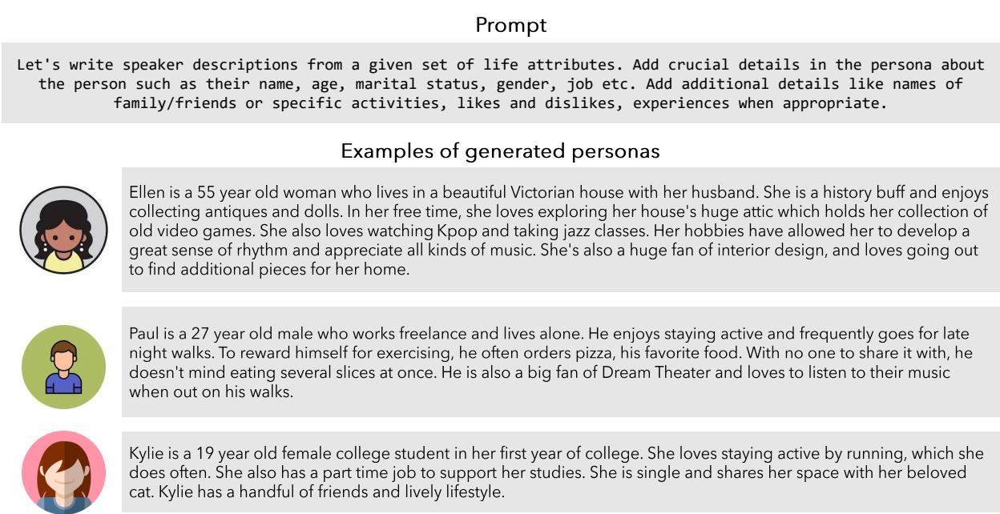  
Figure 5: Prompt for persona statement (p) generation and examples of personas in LOCOMO. The prompt used to generate expanded persona statements (p) from initial personas (p ) for the virtual agents in our conversation generation pipeline (top) and select examples of persona statements present in the LOCOMO dataset.

Fig. 6. First, the base prompt is used along with the prompt for event graph initialization to generate three independent events relevant to a given personality. Then, the base prompt is combined with the prompt for the iterative generation of events to continue generating events that are caused by one or more of the events that are already present in the graph. See an example of a persona and the corresponding temporal event graph in Fig. 7. In the example, Jack aspires to be a hotel manager. Consequently, he enrolls in a hotel management course in July, and after three months, he expresses his excitement about the course on social media. In a similar vein, his passion for gaming results in an invitation from a well-known gaming company.

## A.2.1 Virtual Agent Architecture

As outlined in Section 3.3, the virtual agents in our generative pipelines are composed of two mechanisms, Reflect & respond (Park et al., 2023) and Image sharing & response.

Reflect & respond. This mechanism operates over a combination of short-term and long-term memory. The short-term memory is a summary of a session that is conditioned on the summary from a previous session. See the prompt given to LLMs in our pipeline for generating summaries, and an example of a generated summary, in Fig. 8. The long-term memory is a database of observations about each speaker, that are essentially assertive statements about the speaker’s persona and life. See the prompt given to LLMs in our pipeline for generating observations, and an example of observations extracted from a conversation, in Fig. 9. In practice, the conversation is annotated with turn IDs for each turn, and the model is also instructed to indicate the turn IDs that directly contribute to each observation. This allows us to keep track of the evidence when using observations as the context for RAG-based models used in our experiments (see Section 5).

Image sharing & response. See prompts for implementing image-sharing and image-response behaviors in Figure 10.

## A.3 Human Filtering

Human annotators are instructed to edit the LLMgenerated conversations in the following scenarios:

• Remove an image if it is not relevant to the current dialog or the conversation.

• Add context about an image to the current speaker’s dialog if it is not discussed by them but the subsequent speaker has reacted to the image.

• Replace an image if it does not match the caption that was used to query for images.

```txt
Base prompt for event graph generation
Let's write a graph representing events that occur in a person's life based on a short summary of their personality. Nodes represent events and edges represent the influence of past sub-events on a current event.
- The graph is represented in the form of a json list.
- Each entry is a dictionary containing the following keys: "event", "date", "caused_by", "id".
- The "event" field contains a short description of the event.
- The "date" field contains a date.
- The "id" field contains a unique identifier for the event.
- The "caused_by" field represents edges and is a list of "id" of existing events that have caused this event. Events in the "caused_by" field should occur on dates before the event they have caused. Generate as many causal connections as possible.
- An example of a causal effect is when the event "started a vegetable garden" causes "harvested tomatoes".
- Events can be positive or negative life events.
```

## Additional prompt for event graph initialization

For the following input personality, generate three independent events E1, E2 and E3 aligned with their personality. Events can be positive or negative life events and should reflect evolution in the person's relationships, state of mind, personality etc.

Additional prompt for iterative generation of causal events

For the following input personality, generate new events that are caused by one or more EXISTING events. Events can be positive or negative life events and should reflect evolution in the person's relationships, state of mind, personality etc. Do not repeat existing sub-events. Start and end your answer with a square bracket.

Figure 6: Prompts for temporal event graph generation. The prompt used to generate complete personas for the LLMs in our conversation generation pipeline (top) and examples of personas present in the LOCOMO dataset.  
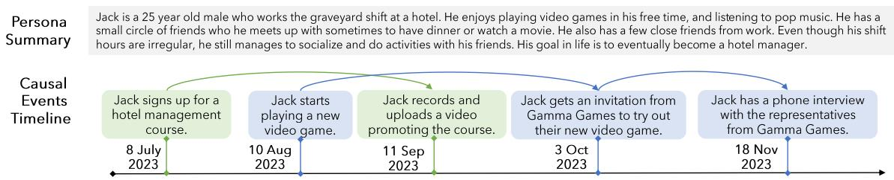  
Figure 7: Temporal Event Graph G Creation. Each event is generated in accordance with the specified persona p and causal connections l between events are depicted to illustrate the casual relationships among them.

• Edit the dialog when the information present in the dialog is inconsistent with something said (or shared through an image) in earlier or later turns.

• Edit the dialog to ensure that the details in the conversation are consistent with those given in the event for the session.

• Remove any events from the event graph if they do not appear in the conversation.

See an example of some edits in Fig. 11.

## B Dataset

## B.1 Dataset Statistics

See a breakdown of the statistics of the conversations in the LOCOMO dataset in the top panel of Table 5. Also, see a breakdown of the statistics of the annotations in the evaluation benchmark in the bottom panel of Table 5.

## B.2 Dataset License

The LOCOMO dataset will be released under the CC BY-NC 4.0 DEED license.<sup>8</sup>

## B.3 Annotator Details

The annotators who worked on the LOCOMO dataset were in-house annotators and we were unable to obtain their demographics due to the confidential nature of such information.

## C Experimental Setup

## C.1 Baselines

The conversations in the LOCOMO dataset are composed of natural language dialogs and images that require higher-order reasoning and multimodal coreference resolution, respectively. From initial studies, we observed that multimodal coreference resolution can be performed effectively by replacing images in LOCOMO with their captions generated using BLIP-2 (Li et al., 2023b), and using state-of-art LLMs to reason over natural language text interleaved with image captions. Hence, our experiments for the question answering and event summarization tasks are conducted using LLMs. We use the images directly only for experiments on the multimodal dialog generation task.

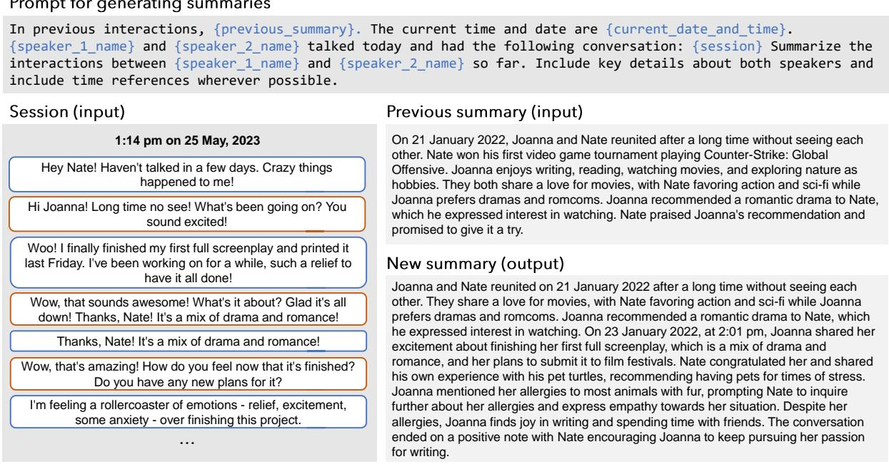  
Figure 8: Prompt for generating conversation summaries. The prompt used to iteratively generate a summary for the current session by conditioning on summary from preceding sessions and the raw conversation logs of the current session (top); and an example of inputs for the prompt and corresponding output summary of a session from the LOCOMO dataset.

<table><tr><td>Conversation Statistics</td><td># Counts</td></tr><tr><td>Total. # conversations h.</td><td>50</td></tr><tr><td>Avg. # sessions k. in conversation h</td><td>19.3</td></tr><tr><td>Avg. # turns j. in session k</td><td>15.8</td></tr><tr><td>Avg. # tokens. conversation h</td><td>9,209.2</td></tr><tr><td>Avg. # tokens. dialogue  $h_{k_j}$  of turn j in session k</td><td>30.2</td></tr><tr><td>Avg. # tokens. observation  $o_{k_j}$  of turn j in session k</td><td>18.2</td></tr><tr><td>Avg. # tokens. summary  $w_k$  of session k</td><td>127.4</td></tr><tr><td colspan="2">QA Benchmark Statistics</td></tr><tr><td># questions. single-hop retrieval</td><td>2,705 (36%)</td></tr><tr><td># questions. multi-hop retrieval</td><td>1,104 (14.6%)</td></tr><tr><td># questions. temporal reasoning</td><td>1,547 (20.6%)</td></tr><tr><td># questions. open domain knowledge</td><td>285 (3.9%)</td></tr><tr><td># questions. adversarial</td><td>1,871 (24.9%)</td></tr><tr><td>Total. # questions.</td><td>7,512</td></tr><tr><td colspan="2">Event Summarization Statistics</td></tr><tr><td>Avg. # ground truth events. in conversation h</td><td>24.2</td></tr><tr><td>Avg. # tokens. event summary</td><td>896.5</td></tr><tr><td colspan="2">Multi-modal Dialogue Generation Statistics</td></tr><tr><td>Avg. # images. in conversation h</td><td>32.3</td></tr></table>

Table 5: Dataset Statistics of conversation and corresponding benchmark

Question Answering. We carry out experiments using three distinct methodologies: (1) Base involves utilizing LLMs to directly conduct the task within a constrained context. The task description comes after the dialogue history. To accommodate the restricted context window size, earlier dialogues are omitted; (2) Long-context employs LLMs with an extended context window to expose the models to as much dialogue context as possible; (3) Retrieval-augmented Generation (RAG) involves retrieving relevant context from a database of dialog history, observations, or sessionlevel summaries. Observations are assertions about each speaker extracted from the dialog history as described in §3.3, see an example in Figure 9. Session-level summaries are concise summaries of the conversation that takes place in each session, see an example in Figure 8.

For the retrieval model, we employ DRAGON (Lin et al., 2023). In the Base, we utilize Mistral-7B (Jiang et al., 2023), LLama-70B-chat (Touvron et al., 2023), gpt-3.5-turbo <sup>9</sup>, and gpt-4-turbo <sup>10</sup>. To assess the effectiveness in practical scenarios for Long-context and RAG, we draw comparisons using variants of gpt-3.5-turbo. We do not report the performance of long-context fine-tuned open-source models (Chen et al., 2023) or those utilizing sliding window (Bertsch et al., 2024; Dao et al., 2022) due to the variability inherent across different open-source models and the potential reduction in their capability on shorter context.

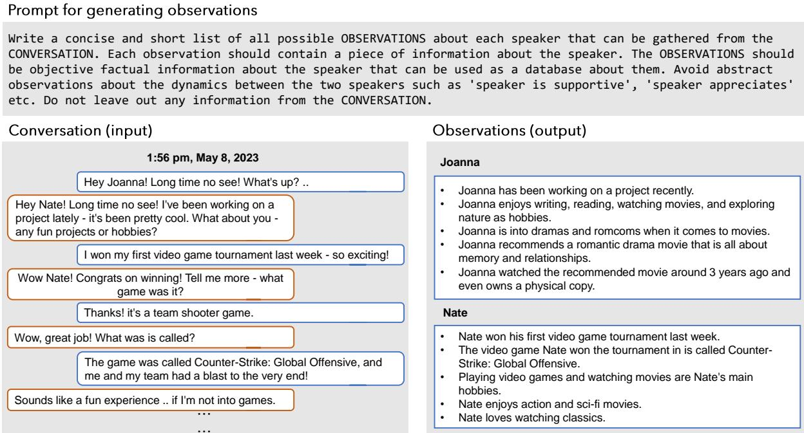  
Figure 9: Prompts for generating observations from conversations. The prompt used to generate observations from a conversation (top); and an example of inputs for the prompt and corresponding output observations for a session from the LOCOMO dataset.

Event Summarization. We present experiments conducted in two distinct configurations. We use both the Base and Long-context setups from the question answering task, but we refrained from including RAG since summarization requires a comprehensive understanding of the entire dialogue, rather than just retrieving a specific portion. A notable distinction in our approach, compared to the question-answering task, lies in our handling of the context. Specifically, we employ an iterative process of creating a summary of a preceding session and then use that summary as a basis to generate the summary for the subsequent session (Chang et al., 2023). Further, we use a single in-context demonstration of input and output to guide the model toward selecting only significant life events for the summary.

Multi-modal Dialogue Generation. For evaluating multi-modal dialogue generation, we train MiniGPT-5 (Zheng et al., 2023) on 50 conversations generated using our automated pipeline (without human filtering) as detailed in §3. Three distinct versions of the model were developed, each with varying training data: (1) Base trains on preceding dialogue turns; (2) + summary trains on both prior dialogue turns and a global summary of the ongoing conversation; (3) + observation trains on both preceding dialogue turns and relevant observations retrieved from the conversation history. For each of these models, we started with a MiniGPT-5 checkpoint pretrained on the MMDialog dataset (Feng et al., 2023).

## C.2 Implementation Details

We use OpenAI API and Huggingface (Wolf et al., 2020), as of January 2024, with specific settings of temperature set to 0 and top set to 1 for evaluation of the LOCOMO benchmark. All experiments, including those for RAG-based models, MiniGPT-5 training, and inference, are conducted on an Nvidia A6000 server with FP32. We report results from a single inference run for each model in our experiments. For MiniGPT-5, we used the hyperparameters recommended in the original codebase and trained our models for 10 epochs, which took approximately 30 hours on a single A6000 GPU.

We use the default implementations of BLEU<sup>11</sup>,

```txt
Image sharing: Prompt for generated image caption → image query

Let's write short image search queries from textual descriptions of photos shared by a user. Queries should not include names of people, years and other irrelevant details. For example:

Input: That sounds relaxing, Jeremy! As for video game suggestions, have you ever tried "The Legend of Zelda: Breath of the Wild"? It's an open-world adventure game that I absolutely love. [shares a photo of Link standing in front of a breathtaking landscape] Have a look at this stunning view! Output: the legend of zelda: breath of wild link landscape

Input: {generated_image_caption}

Output:

Image response: Prompt for shared image caption → response grounded in image

{speaker_1_persona}
{speaker_2_persona}

{speaker_1_name} says, {current_turn}, and shares a photo of {shared_image_caption_blip2}. Write the most natural question or comment {speaker_2_name} can include in their response.
```  
Figure 10: Prompts for image-sharing and image-response behavior. The prompt used to convert a caption generated by the virtual agent into an image query for the web-based image crawler in our pipeline (top), and the prompt used to generate a response grounded in the image shared by a virtual agent during a conversation as well as the personas of the respective speakers (bottom).

<table><tr><td>Category</td><td>top-k</td><td>BLEU-1/2</td><td>Rouge-L</td><td>MM-R</td></tr><tr><td>Base</td><td>-</td><td>57.1 / 34.2</td><td>12.4</td><td>56.1</td></tr><tr><td>+ summary</td><td>1</td><td>58.2 / 34.1</td><td>12.8</td><td>56.9</td></tr><tr><td>+ summary</td><td>2</td><td>56.5 / 32.8</td><td>12.1</td><td>55.1</td></tr><tr><td>+ summary</td><td>5</td><td>56.1 / 32.5</td><td>12.0</td><td>55.2</td></tr><tr><td>+ observation</td><td>5</td><td>59.7 / 35.1</td><td>13.6</td><td>57.8</td></tr><tr><td>+ observation</td><td>10</td><td>59.1 / 34.9</td><td>12.8</td><td>57.1</td></tr><tr><td>+ observation</td><td>25</td><td>58.5 / 34.2</td><td>12.0</td><td>56.5</td></tr></table>

Table 6: Multi-modal dialogue generation performance comparison between different training variants of MiniGPT-5. The optimal performance is shown in bold.

ROUGE<sup>12</sup>, BertScore<sup>13</sup>, FactScore<sup>14</sup> metrics in their respective Python packages in our evaluation protocol.

## D Results

## D.1 Event Summarization Task

See an example of the five broad categories of event summarization errors made by LLMs, outlined in Section 6.2, in Table 7.

## D.2 Multimodal Dialog Generation Task

Results from evaluation of various version of MiniGPT-5 model on the multimodal dialog generation task in the L C M benchmark is in Table 6.

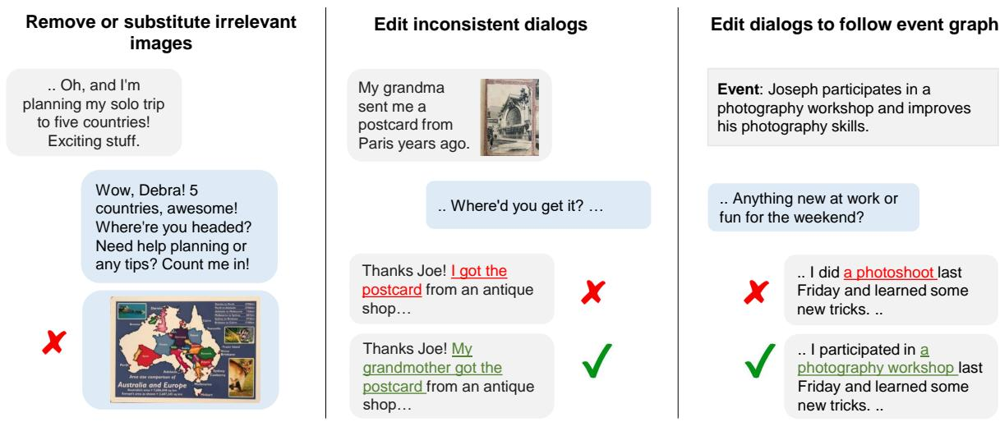  
Figure 11: Example of edits made by annotators. Human annotators are instructed to make edits in the LLM generated conversations to remove irrelevant The prompt used to generate complete personas for the LLMs in our conversation generation pipeline (top) and examples of personas present in the LOCOMO dataset.

<table><tr><td>Error Type</td><td>Explanation</td><td>Ground truth event or relevant dialogs</td><td>Predicted event</td></tr><tr><td>Missing information</td><td>Key details about event are omitted because the model fails to make causal and temporal connections over a long conversation.</td><td>Joanna submits her third screenplay on loss, identity, and connection to a film contest</td><td>Joanna submits her recent screenplay to a film contest.</td></tr><tr><td>Hallucination</td><td>Non-existent details or details from a different event are padded onto an event</td><td>N: ‘The gaming party was a great success!’N: ‘... said they’d want to do it again next month!’N: ‘On another note, I made vegan ice cream ...’</td><td>Nate’s vegan ice cream is a huge success and people want to do it again next month.</td></tr><tr><td>Misunder-standing of dialog cues</td><td>e.g., model confuses a light-hearted statement from a speaker as a serious statement</td><td>J: ‘.. these trails that made me feel like writing a drama.’N: ‘.. go together .. Maybe I’ll start to think of a drama myself and write a screenplay ...’J: ‘Haha, now that would be something! ...’</td><td>Nate considers writing his own drama screenplay.</td></tr><tr><td>Speaker attribution</td><td>Event is attributed to the wrong speaker</td><td>Nate invites Joanna to try his homemade lactose-free ice cream.</td><td>Joanna invites Nate to her home to try her dairy-free ice cream recipe.</td></tr><tr><td>Saliency</td><td>Unimportant interactions in the conversation are considered significant by model</td><td>N: Hey Joanna, what’s been up since we last chatted? How’s it going?</td><td>Nate asks Joanna how she has been she they last talked.</td></tr></table>

Table 7: Taxonomy of errors in LLM-generated event summaries. Five types of errors predominantly occur in the event summaries generated by LLMs. Examples are based on predictions from gpt-3.5-turbo.
