# Know Me, Respond to Me: Benchmarking LLMs for Dynamic User Profiling and Personalized Responses at Scale

Bowen Jiang1∗, Zhuoqun Hao1∗, Young-Min Cho1, Bryan Li1, Yuan Yuan1, Sihao Chen2, Lyle Ungar1, Camillo J. Taylor1†, Dan Roth1†

University of Pennsylvania, Philadelphia, PA1

Microsoft, Redmond, WA2

{bwjiang, zhuoqunh, jch0, bryanli, yyuan86}@upenn.edu sihaochen@microsoft.com, {ungar, cjtaylor, danroth}@upenn.edu

## Abstract

Large Language Models (LLMs) have emerged as personalized assistants for users across a wide range of tasks – from offering writing support to delivering tailored recommendations or consultations. Over time, the interaction history between a user and an LLM can provide extensive information about an individual’s traits and preferences. However, open questions remain on how well LLMs today can effectively leverage such history to (1) internalize the user’s inherent traits and preferences, (2) track how the user profiling and preferences evolve over time, and (3) generate personalized responses accordingly in new scenarios.

In this work, we introduce the PERSONAMEM benchmark. PERSON-AMEM features curated user profiles with over 180 simulated user-LLM interaction histories, each containing up to 60 sessions of multi-turn conversations across 15 real-world tasks that require personalization. Given an in-situ user query, i.e. query issued by the user from the first-person perspective, we evaluate LLM chatbots’ ability to identify the most suitable response according to the current state of the user’s profile. We observe that current LLMs still struggle to recognize the dynamic evolution in users profiles over time through direct prompting approaches. As a consequence, LLMs often fail to deliver responses that align with users’ current situations and preferences, with frontier models such as GPT-4.1, o4-mini, GPT-4.5, o1, or Gemini-2.0 achieving only around 50% overall accuracy, suggesting room for improvement. We hope that PERSONAMEM, along with the user profile and conversation simulation pipeline, can facilitate future research in the development of truly user-aware chatbots. Code and data are available at github.com/bowen-upenn/PersonaMem.

## 1 Introduction

In recent years, Large Language Models (LLMs) have rapidly evolved as general task solvers, demonstrating remarkable performance (Srivastava et al., 2023; Zhou et al., 2023; Yue et al., 2024; Rein et al., 2024). Today, many users rely on LLMs as their personalized chatbots or assistants in a wide range of daily tasks – from offering writing support (Mysore et al., 2024; Tian et al., 2024) to delivering recommendations (Hua et al., 2023) or consultations (Xie et al., 2024a; Zheng et al., 2024), etc. Personalization in LLMs involves adapting model responses to specific traits, preferences, and historical interactions of each user, moving beyond generic responses to more relevant and tailored ones. Since different users have different personas, it becomes an emergent need for LLMs to be pluralistic—capable of adapting to different user characteristics across different scenarios (Sorensen et al., 2024; Jiang et al., 2024; Xie et al., 2024b; Kirk et al., 2024), thereby enhancing user experience and engagement.

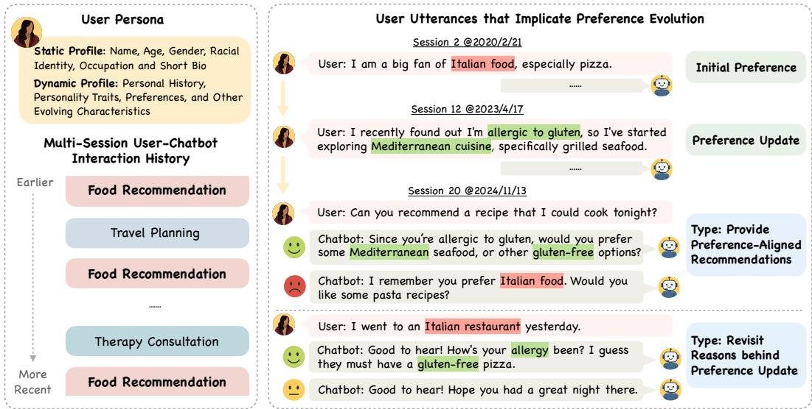  
Figure 1: Overview of PERSONAMEM benchmark. Each benchmark sample is a user persona with static (e.g., demographic info.) and dynamic attributes (e.g., evolving preferences). Users engage with a chatbot in multi-session interactions across a variety of topics such as food recommendation, travel planning, and therapy consultation. As the user’s preferences ionevolve over time, the benchmark offers annotated questions assessing whether models can track and incorporate the changes into their responses.

Food RecTravel PlanningFor LLMs to deliver personalized responses, a practical challenge lies in the fact that LLMs ......cannot easily access all the information about a user. This challenge is further amplified by ......the ever-changing nature of user preferences over time (Radlinski & Craswell, 2017; Dean & Food RecommendationMorgenstern, 2022). For example, as illustrated in Figure 1, a user initially said, ”I like pizza”, but mentioned in a later session, ”I’ve started exploring gluten-free options,” upon discovering a gluten allergy. When the user again asks for food recommendations, a personalized LLM chatbot should be able to track the change, and provide recommendations according to the user’s current situation. Current LLM chatbots often fail to recognize and adapt to evolving user personas. This may lead users to perceive these chatbots as less helpful and empathetic, ultimately diminishing satisfaction (Aggarwal et al., 2023; Ait Baha et al., 2023).

In this work, we evaluate LLMs’ ability to leverage the past interaction history with a user in order to deliver a personalized response in real time. Recent studies (Lin et al., 2024; Shi et al., 2024; Zhao et al., 2025) have found that user-LLM interactions can be a rich (but often implicit) information source on the user’s characteristics and preferences. However, it remains an open question whether LLMs can effectively use the interaction histories to (1) internalize the user’s inherent traits and preferences, (2) track how the user’s characteristics evolve over time, and (3) generate personalized responses accordingly in new scenarios.

To study these questions, we propose the PERSONAMEM benchmark, comprising over 180 simulated user-LLM interaction histories with up to 60 multi-turn sessions across 15 personalized task scenarios. Each history is built from a detailed user persona whose characteristics evolve over time. Based on the user’s profile at different points, we simulate task-specific conversations (e.g., travel, therapy, food) and concatenate them in temporal order to capture the user’s profile evolution throughout the entire interaction history.

With PERSONAMEM, we evaluate whether state-of-the-art LLMs can infer evolving user profiles and generate personalized responses across task scenarios. To emulate the realistic settings in user-LLM interactions, we design 7 types of in-situ user queries (Table 1), where users issue queries to LLMs from first-person perspectives. We evaluate whether LLMs can select the correct response that best aligns with the current state of the user. We find that frontier models such as GPT-4.1, o4-mini, GPT-4.5, o1, or Gemini-2.0-Flash score only around 50% overall accuracy and Llama-4-Maverick slightly lower at 43% using direct prompt approaches. While models perform reasonably well on recalling facts and tracking preference changes (60–70% accuracy), they struggle to incorporate users’ latest situations into responses (30–50% accuracy). We provide detailed analysis on how factors such as history length, preference positioning, and memory components may impact performance.

To summarize our key contributions and findings:

• We propose the PERSONAMEM benchmark and its synthetic dialog generation pipeline for persona-oriented, multi-session, and timelined user-chatbot interaction history.

• We assess 15 LLMs on 7 types of in-situ user queries and evaluate their ability to provide responses aligned with user’s dynamically changing profile across 15 task scenarios.

• With PERSONAMEM, we observe that frontier models such as GPT4.1, o4-mini, GPT-4.5, o1, DeepSeek-R1, Gemini-2.0, Llama-4, and Claude-3.7 still struggle to be user-aware and deliver personalized responses, especially when the knowledge of the user needs to be applied across new scenarios.

## 2 PERSONAMEM Benchmark: Overview

We present an overview of the PERSONAMEM benchmark in Figure 1. Each instance in the benchmark dataset features a user profile or persona, which includes basic demographic information (such as name, age, gender, and occupation), as well as dynamic user characteristics such as user traits, preferences, and events happening in the user’s life. The dynamic user characteristics change over time as different events happen to the user that will lead to changes in users’ traits and preferences specific to each task scenario.

At different points in time of a user’s profile evolution, the user engages in multi-turn conversations with LLM and seeks help or suggestions from LLM on one of the task scenarios. In each task scenario, the user would ask for the LLM’s suggestions given the user’s need and current situation. The conversation sessions across different tasks are interleaved by the temporal order in which the sessions happen.

To understand how well LLM chatbots can track the evolution in a user’s profile from the conversation histories, we evaluate LLMs by whether they can provide the most suitable response to in-situ user queries, where the user issues the query to LLM in a new conversation session from the first-person perspective. Depending on the time of the in-situ query, the expected response from the model will differ. We cast the problem as a multiple-choice selection, where LLM needs to identify the correct response out of four choices, where the incorrect choices are based on either outdated or irrelevant information with respect to the current state of the user’s profile.

Types of skills evaluated. To evaluate LLMs’ ability to (1) memorize the user profile, (2) track how the user profile evolve over time, and (3) generate personalized responses accordingly in new scenarios, we design the following 7 types of in-situ user queries in the PERSONAMEM benchmark. We include examples for each type of user queries in Table 1.

1. Recall user-shared facts. We evaluate whether a personalized chatbot can recall static events, activities, or interests the user has shared in previous interactions, and incorporate the information in its responses.

2. Suggest new ideas. We evaluate whether a chatbot can suggest new items or activities that have not been mentioned in the interaction history, when users explicitly request so, e.g. “suggest new restaurants I haven’t orderedfrom before”.

3. Acknowledge latest user preferences. We evaluate whether a chatbot can recognize the latest preference expressed by the user in the interaction history.

4. Track full preference evolution. We evaluate whether a chatbot can keep track of how users’ preferences shift by time.

5. Revisit reasons behind preference updates. We evaluate whether a chatbot can recall the reason(s) or event(s) leading to the preference change from a user.

6. Provide preference-aligned recommendations. We test whether a chatbot can proactively offer new recommendations that aligns with the user’s current preferences.

7. Generalize to new scenarios. We evaluate whether a chatbot can transfer what it learns about the user from other task scenarios to a new task.

Benchmark data statistics. PERSONAMEM features 20 personas, with over 180 interaction histories. Each interaction history contains 10, 20, or 60 sessions, where we dynamically adjust the total length of the history to approximately 32k, 128k, and 1M tokens, respectively. Each session consists of 15–30 conversation turns between a user and an LLM chatbot. The user-LLM conversations span across 15 diverse topics, ranging from therapy and legal advice to recommendations on books, music, movies, and food; personal matters such as family, dating, health, and finance; and practical tasks like travel planning, online shopping, studying tips, and home decoration. In total, the benchmark features around 6k in-situ user query and LLM response pairs across the 7 query types. Detailed dataset breakdown is discussed in Appendix D. The size of our benchmark is not limited by the scalability of the synthetic data pipeline but to make the evaluation cost reasonable.

<table><tr><td>Query type</td><td>Examples of in-situ user queries and chatbot responses</td></tr><tr><td>[1] Recall user-shared facts</td><td>&quot;User: I shared my playlist with my friends and they loved it. ...... (later) User: What are some creative ways to share music? — Chatbot: Curating personalized playlists can be fun.&quot;</td></tr><tr><td>[2] Suggest new ideas</td><td>&quot;User: ...... (later) User: Suggest new restaurant I haven&#x27;t ordered before.&quot;</td></tr><tr><td>[3] Acknowledge latest user preferences</td><td>&quot;User: I am a big fan of Italian food. ...... (later) User: I prefer Mediterranean cuisine now. ... (later) User: I went to an Italian restaurant yesterday — Chatbot: Nice to hear! Though I thought you prefer Mediterranean food now.&quot;</td></tr><tr><td>[4] Track full preference evolution</td><td>&quot;User: ...... (later) User: I am thinking about attending a cooking class. — Chatbot: I understand your perspective on cooking classes has evolved. Initially, you expressed a dislike, but later you mentioned your interest in them.&quot;</td></tr><tr><td>[5] Revisit reasons behind preference updates</td><td>&quot;User: I am a big fan of Italian food. ...... (later) User: I recently found I&#x27;m allergic to gluten, so I&#x27;ve shifted to other dishes. ... (later) User: I went to an Italian restaurant yesterday — Chatbot: How&#x27;s your allergy been? I guess they must have a gluten-free pizza.&quot;</td></tr><tr><td>[6] Provide preference aligned recommendations</td><td>User: I prefer Mediterranean seafood now. ...... (later) User: How can I make impactful lifestyle changes? — Chatbot: How about diving into the Mediterranean diet plan?&quot;</td></tr><tr><td>[7] Generalize to new scenarios</td><td>&quot;User: I prefer my yoga class because of its fixed weekly schedule. ...... (later) User: I recently haven&#x27;t had time to cook. — Chatbot: Since you seem to love routine would you be interested in weekly scheduled bento-box deliveries?&quot;</td></tr></table>

Table 1: Examples of the 7 types of in-situ user queries and expected chatbot response in the PERSONAMEM benchmark. We highlight words that signal the user’s facts or preferences.

## 3 Constructing Examples in PERSONAMEM At Scale

We develop a modular data curation pipeline—powered by GPT-4o (Hurst et al., 2024)—to synthesize persona-oriented, multi-session user–model conversations with long context. The pipeline minimizes irrelevant or randomly injected content to better evaluate how effectively LLM chatbots address the challenges outlined in Section 2, while ensuring costeffectiveness and scalability: generating data for each persona on each conversation topic costs approximately \$2, independent of the context window length up to 1M tokens.

Constructe user profile and persona. We sample a set of random personas from PersonaHub (Ge et al., 2024), each comprising about one to three sentences, and augment them with additional demographic information and extended personal details. We also construct a timeline and populate it with events that align with the persona. These events serve as the general personal history, such as education, career development, and life experiences, to provide a richer context. The prompts used in the process can be found in Appendix G.

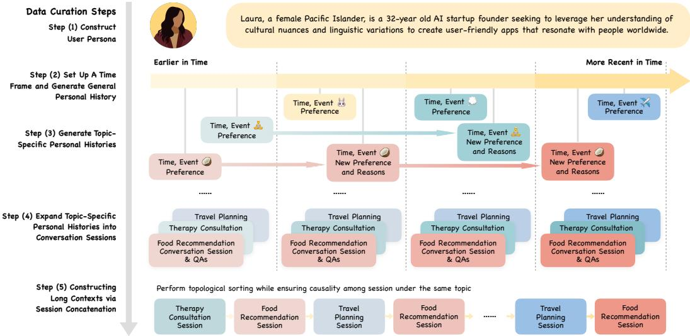  
Figure 2: An overview of the persona-oriented multi-session data curation process. We construct user personas, build time-stamped general and topic-specific personal histories, expand them into conversation sessions, and topologically concatenate sessions to create long conversation contexts—resulting in a scalable generation framework.

Building on the persona and general personal history, we generate one additional topicspecific personal history for each conversation topic. Under each topic, we define a set of initial preferences, ensuring no overlap across different topics. Each topic-specific history includes events, timestamps, associated preferences, potential updates to those preferences, and the underlying reasons for those changes. This approach ensures a coherent progression of user experiences while maintaining a strong connection to their personas.

The structured personal histories also facilitate the curation of question–answer pairs. We leverage short-form information within these histories to extract ground-truth user profiles and preferences at any specific time, ensuring that the correct answers are both eventand persona-grounded. In contrast, distractor options, while generally reasonable, either overlook the user’s persona or contradict it. Additionally, we exclude all questions that the model can answer correctly without seeing any contextual information from the benchmark.

Simulate conversation sessions from user profile. We divide the timeline into multiple segments, resulting in segments of personal histories that follow a causal, chronological order. Each segment is then expanded into a full user–model conversation session, designed to cover all details of the corresponding topic-specific personal history segment, together with additional storytelling context as if the user is talking with a chatbot naturally. For example, under the therapy consultation topic, we frame the interaction as a user seeking guidance from an AI therapist.

To enhance the quality of the conversations, we incorporate several tricks: (1) Before generating each user–model interaction turn, we prompt GPT-4o to first identify and cite the relevant event from the personal history. These citations serve as internal guidance and are not included in the final evaluation data. (2) Since GPT-4o may miss some events, leading to incomplete preference update sequences, we employ a self-reflection mechanism. We ask GPT-4o to review the generated conversation and identify any missing events from the personal history, ensuring better coverage and coherence across the interaction.

Assemble interaction history via session concatenation. Generating large-scale, personaoriented long-context conversations can be both cost-efficient and scalable. For each persona, we topologically sort conversation sessions based on their ending timestamps, and we only need to make sure sessions within the same topic maintain causality. Different numbers of sessions can be concatenated in multiple valid orders. This flexible design allows for multiple valid interleavings of sessions across different topics, meaning we only need to generate sessions themselves—not every entire long-context conversationfrom scratch. To further extend context length and simulate more natural interactions, we insert a limited number of short interactions between sessions where the user asks random knowledge questions or programming helps without indicating any user preferences.

Human validation on dataset quality. To evaluate the quality of our generated data, we conduct a human study on 90 random query–response pairs from PERSONAMEM, each grounded in user persona, personal histories, and associated utterances in conversation. Three annotators assess each Q&A pair across four dimensions: appropriateness, relevance, correctness, and best response. Judgments were very high for all dimensions – 97.8%, 95.6%, 97.8%, and 90.0% respectively. Further details are provided in Appendix B.

## 4 Experiment

## 4.1 Evaluation Settings

Given an in-situ user query and the user’s interaction history up to a point in time, we evaluate models’ ability to select the most appropriate response according to the current state of the user amonst four different choices. Only one of the choices fits the user’s current status, and the other choices contain either irrelevant or outdated facts or preferences from the user. During evaluation, apart from the conversation history, the models have access to the basic demographic information of the user, including name, age, gender identity, racial identity, and occupation. The models do not have direct access to the user’s other dynamic characteristics and personal history otherwise.

For selecting the most appropriate response, we evaluate models under both discriminative and generative settings. In the discriminative setting, the models are presented with all four response choices denoted with (a), (b), (c) and (d) with random ordering among the choices. The model is asked to output the correct choice along with a brief explanation. In the generative setting, the models still see one question at a time. We compute the log-sum of token probability of generating each option individually with length normalization, and select the option with the highest probability as the model response. We use the discriminative setting for main evaluation (§ 4.2,§ 4.3, § 4.4) and adopt the generative setting in § 4.5, as it requires access to logits over entire vocabulary during decoding, which is not available from most proprietary models. No LLM judges are involved in the evaluation process.

## 4.2 Evaluating Language Models in Long-Context Settings

We first evaluate language models in the long-context setting, where the full user-LLM inter action history is provided as input to the models. Due to the length of the history, all models here were evaluated zero-shot, without demonstration examples of other histories and user queries. Our evaluation covers GPT-4.1, o4-mini, o3-mini, GPT-4.5, o1, GPT-4o, GPT-4o-mini, Gemini-2.0-Flash, Gemini-2.0-Flash-Lite, Gemini-1.5-Flash, DeepSeek-R1-671B, Llama-4-Maverick, Llama-3.1-405B, Claude-3.7-Sonnet, and Claude-3.5-Haiku (OpenAI, 2025a; 2024b; 2025b; 2024a; Hurst et al., 2024; Team et al., 2024; Guo et al., 2025; Grattafiori et al., 2024; Anthropic, 2024) on 128k-token context windows. We also evaluate models that support longer contexts—Llama-4-Maverick, Gemini-2.0-Flash, Gemini-2.0-Flash-Lite, and Gemini-1.5-Flash—on 1M-token context windows. We report the following findings:

GPT-4.5, GPT-4.1, and Gemini-1.5 achieve the highest overall performance. Among leading foundation models, GPT-4.5 and Gemini-1.5 outperform others in overall accuracy. However, their performance still hovers around 52% in a multiple-choice setting, highlighting substantial room for improvement. Notably, reasoning models such as o1, o3-mini, o4-mini, and DeepSeek-R1-607B do not demonstrate competitive advantages over non-reasoning models in the personalization tasks we evaluate.

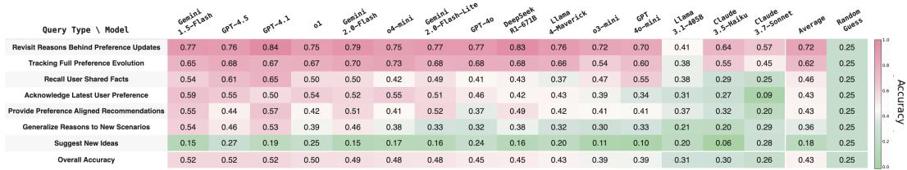  
Figure 3: Evaluation results across different models on 7 in-situ query types. We observe models perform reasonably well at recalling user facts and preferences. However, models struggle at providing novel suggestions, or applying users’ preferences in new scenarios.

<table><tr><td>Model \ Num of Sessions</td><td>Overall</td><td>1</td><td>2</td><td>3</td><td>4</td><td>5</td><td>6</td><td>7</td><td>8</td><td>9</td><td>10</td><td>11</td><td>12</td><td>13</td><td>14</td><td>15</td><td>16</td><td>17</td><td>18</td><td>19</td><td>20</td></tr><tr><td>Gemini-1.5-Flash</td><td>0.52</td><td>0.74</td><td>0.56</td><td>0.53</td><td>0.54</td><td>0.50</td><td>0.47</td><td>0.49</td><td>0.51</td><td>0.53</td><td>0.50</td><td>0.49</td><td>0.42</td><td>0.54</td><td>0.48</td><td>0.44</td><td>0.53</td><td>0.65</td><td>0.57</td><td>0.48</td><td>0.48</td></tr><tr><td>GPT-4.5</td><td>0.52</td><td>0.74</td><td>0.53</td><td>0.57</td><td>0.56</td><td>0.54</td><td>0.52</td><td>0.50</td><td>0.44</td><td>0.52</td><td>0.46</td><td>0.46</td><td>0.41</td><td>0.52</td><td>0.53</td><td>0.36</td><td>0.48</td><td>0.68</td><td>0.65</td><td>0.48</td><td>0.42</td></tr><tr><td>GPT-4.1</td><td>0.52</td><td>0.87</td><td>0.56</td><td>0.60</td><td>0.53</td><td>0.52</td><td>0.56</td><td>0.49</td><td>0.53</td><td>0.43</td><td>0.44</td><td>0.47</td><td>0.46</td><td>0.43</td><td>0.44</td><td>0.44</td><td>0.54</td><td>0.64</td><td>0.57</td><td>0.49</td><td>0.44</td></tr><tr><td>o1</td><td>0.50</td><td>0.68</td><td>0.56</td><td>0.54</td><td>0.49</td><td>0.54</td><td>0.45</td><td>0.48</td><td>0.46</td><td>0.48</td><td>0.45</td><td>0.46</td><td>0.41</td><td>0.53</td><td>0.39</td><td>0.36</td><td>0.44</td><td>0.66</td><td>0.58</td><td>0.47</td><td>0.44</td></tr><tr><td>Gemini-2.0-Flash</td><td>0.49</td><td>0.73</td><td>0.52</td><td>0.55</td><td>0.48</td><td>0.45</td><td>0.48</td><td>0.48</td><td>0.51</td><td>0.50</td><td>0.44</td><td>0.42</td><td>0.41</td><td>0.52</td><td>0.46</td><td>0.42</td><td>0.46</td><td>0.61</td><td>0.51</td><td>0.52</td><td>0.42</td></tr><tr><td>o4-mini</td><td>0.48</td><td>0.82</td><td>0.49</td><td>0.46</td><td>0.51</td><td>0.46</td><td>0.43</td><td>0.43</td><td>0.42</td><td>0.39</td><td>0.39</td><td>0.39</td><td>0.45</td><td>0.45</td><td>0.48</td><td>0.44</td><td>0.46</td><td>0.65</td><td>0.52</td><td>0.50</td><td>0.45</td></tr><tr><td>Gemini-2.0-Flash-Lite</td><td>0.48</td><td>0.76</td><td>0.45</td><td>0.52</td><td>0.50</td><td>0.42</td><td>0.48</td><td>0.44</td><td>0.40</td><td>0.46</td><td>0.35</td><td>0.38</td><td>0.40</td><td>0.44</td><td>0.47</td><td>0.44</td><td>0.56</td><td>0.63</td><td>0.53</td><td>0.50</td><td>0.40</td></tr><tr><td>GPT-4o</td><td>0.45</td><td>0.83</td><td>0.51</td><td>0.55</td><td>0.44</td><td>0.43</td><td>0.47</td><td>0.38</td><td>0.42</td><td>0.43</td><td>0.40</td><td>0.36</td><td>0.38</td><td>0.42</td><td>0.32</td><td>0.29</td><td>0.38</td><td>0.66</td><td>0.54</td><td>0.48</td><td>0.36</td></tr><tr><td>DeepSeek-R1-671B</td><td>0.45</td><td>0.84</td><td>0.56</td><td>0.51</td><td>0.49</td><td>0.50</td><td>0.47</td><td>0.50</td><td>0.45</td><td>0.41</td><td>0.28</td><td>0.35</td><td>0.28</td><td>0.43</td><td>0.30</td><td>0.38</td><td>0.46</td><td>0.61</td><td>0.50</td><td>0.44</td><td>0.37</td></tr><tr><td>Llama-4-Maverick</td><td>0.43</td><td>0.76</td><td>0.31</td><td>0.45</td><td>0.48</td><td>0.38</td><td>0.33</td><td>0.37</td><td>0.45</td><td>0.36</td><td>0.39</td><td>0.30</td><td>0.41</td><td>0.37</td><td>0.39</td><td>0.39</td><td>0.54</td><td>0.62</td><td>0.50</td><td>0.50</td><td>0.36</td></tr><tr><td>o3-mini</td><td>0.39</td><td>0.80</td><td>0.48</td><td>0.44</td><td>0.45</td><td>0.36</td><td>0.39</td><td>0.39</td><td>0.36</td><td>0.37</td><td>0.27</td><td>0.31</td><td>0.38</td><td>0.35</td><td>0.32</td><td>0.26</td><td>0.41</td><td>0.56</td><td>0.39</td><td>0.35</td><td>0.33</td></tr><tr><td>GPT-4o-mini</td><td>0.39</td><td>0.73</td><td>0.45</td><td>0.46</td><td>0.36</td><td>0.34</td><td>0.37</td><td>0.36</td><td>0.35</td><td>0.25</td><td>0.30</td><td>0.29</td><td>0.32</td><td>0.34</td><td>0.33</td><td>0.36</td><td>0.42</td><td>0.60</td><td>0.44</td><td>0.37</td><td>0.32</td></tr><tr><td>Llama-3.1-405B</td><td>0.31</td><td>0.40</td><td>0.30</td><td>0.32</td><td>0.27</td><td>0.25</td><td>0.24</td><td>0.32</td><td>0.25</td><td>0.34</td><td>0.30</td><td>0.30</td><td>0.37</td><td>0.29</td><td>0.28</td><td>0.34</td><td>0.33</td><td>0.42</td><td>0.36</td><td>0.27</td><td>0.31</td></tr><tr><td>Claude-3.5-Haiku</td><td>0.30</td><td>0.60</td><td>0.27</td><td>0.38</td><td>0.27</td><td>0.28</td><td>0.22</td><td>0.24</td><td>0.26</td><td>0.25</td><td>0.18</td><td>0.22</td><td>0.26</td><td>0.36</td><td>0.25</td><td>0.24</td><td>0.35</td><td>0.52</td><td>0.34</td><td>0.33</td><td>0.22</td></tr><tr><td>Claude-3.7-Sonnet</td><td>0.26</td><td>0.76</td><td>0.27</td><td>0.31</td><td>0.26</td><td>0.20</td><td>0.28</td><td>0.21</td><td>0.20</td><td>0.10</td><td>0.15</td><td>0.17</td><td>0.12</td><td>0.22</td><td>0.20</td><td>0.19</td><td>0.29</td><td>0.47</td><td>0.28</td><td>0.27</td><td>0.19</td></tr><tr><td>Average</td><td>0.43</td><td>0.74</td><td>0.46</td><td>0.48</td><td>0.44</td><td>0.41</td><td>0.41</td><td>0.41</td><td>0.40</td><td>0.39</td><td>0.35</td><td>0.36</td><td>0.36</td><td>0.41</td><td>0.38</td><td>0.36</td><td>0.44</td><td>0.60</td><td>0.49</td><td>0.43</td><td>0.37</td></tr><tr><td>Random Guess</td><td>0.25</td><td>0.25</td><td>0.25</td><td>0.25</td><td>0.25</td><td>0.25</td><td>0.25</td><td>0.25</td><td>0.25</td><td>0.25</td><td>0.25</td><td>0.25</td><td>0.25</td><td>0.25</td><td>0.25</td><td>0.25</td><td>0.25</td><td>0.25</td><td>0.25</td><td>0.25</td><td>0.23</td></tr></table>

Figure 4: Model performances by number of sessions elapsed since most recent preferences were mentioned in long context. Top: up to 20 sessions/128k tokens; Bottom: up to 60 sessions/1M tokens. Long-context retrieval is important for personalization in practice.

LLMs demonstrate reasonably good performance in recalling simple user facts. For tasks involving the retrieval of static user information, such as previously mentioned items, activities, or reasons behind preference changes where the reasons themselves won’t change, most LLMs have a reasonable chance of succeeding.

Incorporating the latest user preference into responses is more challenging than recalling the change in user profile. We observe that models struggle to incorporate the latest preference or state of the user in responses. Surprisingly, models generally get higher performance when asked to recall how the user preferences evolve over time. We observe that asking the model to iterate through all preference updates may encourage it to think through the preference evolutions, often making the task easier.

Models fall short on generating new ideas or providing suggestions in new scenarios. As shown in Figure 3, tasks such as ”Suggest New Ideas”, ”Provide Preference-Aligned Recommendations”, and ”Generalize Reasons to New Scenarios” yield the lowest performance across all models, highlighting the challenge of generating personalized responses in novel contexts—particularly when identifying new facts.

## 4.3 Effect from the Position of User Information in Interaction History

To understand how the model performance is affected by the position in which the relevant user facts or preferences appear in the conversation history, we report the model performance by the session in which the relevant user information appears in the history. The results are shown in Figure 4. Generally, we observe that the model performs better when the relevant information appears in the earler or later sessions of the conversation history. The findings here generally echo previous findings on long-context inputs to models, where context information tends to get “lost in the middle” (Liu et al., 2024; Wu et al., 2024).

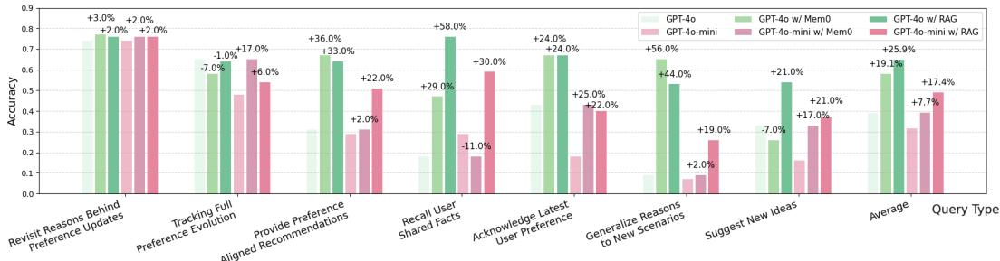  
Figure 5: Performance on different question types for GPT-4o and GPT-4o-mini with 32ktoken contexts. We compare vanilla models to the ones with Mem0 and RAG setups.

## 4.4 Evaluation with External Memory Modules

We evaluate whether using a retriever to identify relevant information in the history will help improve model’s performance. We evaluate two external memory approaches—RAG (Lewis et al., 2020) and Mem0 (Mem0, 2024)—against vanilla LLMs. For these experiments, we consider only the GPT-4o and GPT-4o-mini models. We show their latency in Appendix E.

For RAG, we consider a straightforward implementation that retrieves the top five most relevant messages per question using dense BGE-M3 embeddings (Chen et al., 2024). For Mem0 which provides an additional memory layer to LLMs, we iteratively build a memory database using LLM-generated facts over each turn. At inference, we retrieve the top 5 relevant facts per question. For efficiency, we use 32k-token contexts for evaluation.

Retriever-based memory module can improve model performance. Overall, external memory modules significantly improve accuracy for both models. Notably, Recall User-Shared Facts and Generalize to New Scenarios benefit the most, highlighting the effectiveness of retrieval in factual tasks. In contrast, Revisit Reasons Behind Preference Updates shows smaller gains. RAG consistently outperforms Mem0 across most question types, although Mem0 is more computational expensive, suggesting that retrieving semantically similar messages is more effective for personalized reasoning.

## 4.5 Evaluation of Language Models in Generative Settings

In real-world use cases, the chatbots do not have access to the potential options of responses during inference. For such reason, we additionally evaluate models on the more realistic generative settings, where the model sees only one option at a time, and the best response is selected by the joint sequence probability of options from model predictions.

Approaches. Given the user-LLM history and in-situ user query, we compare the joint sequence probabilities by taking the log-sum of the token-level probability of each response option. Specifically, given a conversation history (denoted as C) and the user query (q), we evaluate each candidate response $r _ { i \in \{ 1 , 2 , 3 , 4 \} } .$ , consisting of tokens $\{ x _ { i } ^ { 1 } , x _ { i } ^ { 2 } , \ldots , x _ { i } ^ { T _ { l } } \}$ of total token length l. Due to the autoregressive nature of causal language models, the joint log probability for each query-answer pair is computed by summing the conditional log probabilities of each token given its preceding context, formalized as

$$
\log P (r _ {i} \mid \mathcal {C}, q) = \sum_ {t = 1} ^ {T _ {i}} \log P (x _ {i} ^ {t} \mid \mathcal {C}, q, x _ {i} ^ {1}, \dots , x _ {i} ^ {t - 1}) / T _ {i}
$$

<table><tr><td rowspan="3">Query Type \ Model</td><td colspan="6">DeepSeek R1-Distill 1-Llama-8B</td></tr><tr><td colspan="2">LLaMA 3.1-70B</td><td colspan="2">LLaMA 3.1-8B</td><td colspan="2">LLaMA 3.1-8B (MCQ)</td></tr><tr><td colspan="2"></td><td colspan="2"></td><td>Average</td><td>Random Guess</td></tr><tr><td>Revisit Reasons Behind Preference Updates</td><td>0.80</td><td>0.83</td><td>0.82</td><td>0.68</td><td>0.78</td><td>0.25</td></tr><tr><td>Tracking Full Preference Evolution</td><td>0.67</td><td>0.83</td><td>0.75</td><td>0.53</td><td>0.69</td><td>0.25</td></tr><tr><td>Recall User Shared Facts</td><td>0.94</td><td>0.82</td><td>0.72</td><td>0.18</td><td>0.67</td><td>0.25</td></tr><tr><td>Provide Preference Aligned Recommendations</td><td>0.33</td><td>0.29</td><td>0.27</td><td>0.44</td><td>0.33</td><td>0.25</td></tr><tr><td>Acknowledge Latest User Preference</td><td>0.30</td><td>0.14</td><td>0.24</td><td>0.36</td><td>0.26</td><td>0.25</td></tr><tr><td>Generalize Reasons to New Scenarios</td><td>0.30</td><td>0.21</td><td>0.19</td><td>0.32</td><td>0.25</td><td>0.25</td></tr><tr><td>Suggest New Ideas</td><td>0.18</td><td>0.14</td><td>0.20</td><td>0.08</td><td>0.15</td><td>0.25</td></tr></table>

Figure 6: Generative evaluation on 10-session (32k token length) version of PERSONAMEM.

As the method requires logarithmic probability of output tokens over the entire vocabulary, which is often not available in proprietary models, we evaluate open-weight models—LLaMA-3.1–70B, LLaMA-3.1–8B, and DeepSeek-Distill-LLaMA–8B. Due to constraints in computation resources, we only evaluate the models on the 10-session version of the benchmark, which includes around 32k-tokens per session.

Results. As shown in Figure 6, we observe the similar trend to our discriminative evaluation results in terms of difficulty by different user query types. Models get reasonably good performance on recalling facts and tracking preference changes, while giving new suggestions and generalizing to new scenarios are still the most challenging types of queries for models. Interestingly, when comparing the same model, specifically LLama-3.1-8Binstruct, under discriminative and generative settings, we see the performance is better in the generative setting, potentially suggesting that the model is able to provide a personalized response without seeing all the candidate options in the input. Since we only managed to run evaluation on 32k context length with the generative setting, it remains to be investigated whether results in generative vs. discriminative settings stand for longer context length and for different models. We also find that model performance declines as users’ new requests become more distant from their previously revealed information. Detailed results are provided in Appendix C.

## 5 Related Work

## 5.1 Evaluating Long-Context Memory Capabilities of LLMs

Needle-in-the-haystack tests, which task models to locate specific facts within a given long context, are a common method for this evaluation. Prior benchmarks perform tasks from direct information retrieval (Kuratov et al., 2024; Nelson et al., 2024) to question answering and summarization (Xu et al., 2024; Bai et al., 2024; Zhang et al., 2024). A more real-world setting for such evaluation is through dialogue conversations. Earlier benchmarks curated human-human (Xu, 2021) or human-AI interactions Xu et al. (2022), with sessions up to 10K tokens. More recent works have used LLMs to generate much longer sessions of 100k+ tokens long (Maharana et al., 2024; Kim et al., 2024; Castillo-Bolado et al., 2024). More recently, Wu et al. (2024) present LONGMEMEVAL, a dialogue benchmark which also considers contexts up to 1M, and uses persona-driven sessions. The major differences are that sessions from PERSONAMEM consider a broader range of topics than just task-oriented ones; and that the evaluation of PERSONAMEM focuses on fine-grained personalization concerns, rather than more general memory abilities.

## 5.2 Towards Personalization in Large Language Models

As users have a diversity of preferences, both at a demographic-level (Santurkar et al., 2023) and at an individual-level (Zollo et al., 2024). Personas are short biographies of individuals, that capture both levels, and can be generated en masse by LLMs (Ge et al., 2024). Researchers have used personas to evaluate how LLMs can adapt to users and environments (Castricato et al., 2024; Tseng et al., 2024). Reliable evaluation of personalization is also key. Many of the aforementioned benchmarks through formulation as NLP tasks, and another line of work uses LLMs to automatically judge texts along different axes of personalization (Dong et al., 2024; Wang et al., 2023). The approach taken by PERSONAMEM follows the former, as we report performance on question-answering. Importantly though, the personalization evaluation is by design of the questions and answers, each of which is grounded in specific temporal events, and is generated to adhere to a specific question type.

<table><tr><td></td><td>LOCOMO</td><td>LongMemEval</td><td>PrevEval</td><td>PersonaMem</td></tr><tr><td>Focused Tasks</td><td>Long-term memory</td><td>Long-term memory</td><td>User preferences</td><td>Fine-grained personalized responses</td></tr><tr><td>Avg. Single Session Len</td><td>477 tokens</td><td>3k tokens</td><td>No info</td><td>6k tokens</td></tr><tr><td>Max Context Len</td><td>9k tokens</td><td>1.5M tokens</td><td>100k tokens</td><td>1M tokens</td></tr><tr><td>Data Sources</td><td>MSC &amp; own</td><td>ShareGPT &amp; UltraChat &amp; own</td><td>LMSYS-Chat-1M</td><td>PersonaHub &amp; own</td></tr><tr><td>Query Perspective</td><td>third-person</td><td>first-person</td><td>first-person</td><td>first-person</td></tr><tr><td>Max # Knowledge Updates</td><td>No update</td><td>1</td><td>No update</td><td>3</td></tr><tr><td>Multi-Session Reasoning</td><td>Yes</td><td>Yes</td><td>No</td><td>Yes</td></tr><tr><td># LLMs Evaluated</td><td>4</td><td>5</td><td>6</td><td>15</td></tr></table>

Table 2: Comparison of related benchmarks, including LOCOMO (Maharana et al., 2024), LongMemEval (Wu et al., 2024), and PrefEval (Zhao et al., 2025). LOCOMO and Long-MemEval focus on general long-term memory tasks. In contrast, PersonaMem centers on personalization beyond memory retrieval, with all conversations in our benchmark are built around a coherent user persona with evolving preferences, mimicking more realistic user-chatbot conversations. PrefEval, which focuses on personalization too, but by first generating user preferences and then inserting them into randomly sampled contexts.

Turning to the dialogue setting, earlier works like LAMP and PERSONALLM consider personalization within a single turn or session (Salemi et al., 2023; Jiang et al., 2023; Kirk et al., 2024). More recently, IMPLEXCONV (Li et al., 2025) focuses on modeling implicit reasoning within personalized conversations. PERSONABENCH (Tan et al., 2025) simulates social interactions among diverse users through numerous but shorter sessions and access to synthetic private user data. PERSOBENCH (Afzoon et al., 2024) leverages existing persona-aware datasets to evaluate language quality, persona coverage, and consistency. LONGLAMP (Kumar et al., 2024) focuses on generating long-form texts other than more interactive responses within long context. Zhao et al. (2025) introduce PREFEVAL, which evaluates LLMs’ preference-following abilities for 20 topics in persona-oriented dialogues of 100k+ tokens. PERSONAMEM, besides the flexible setting of generating numerous 1M-token contexts efficiently, places greater emphasis on personas as simulated humans in usermodel interactions, featuring multiple fine-grained personalization tasks where profiles and preferences evolve through temporally grounded events.

## 6 Conclusion

In this paper, we introduce the PERSONAMEM benchmark, featuring scalable and personaoriented multi-session user-LLM interaction histories, as well as fine-grained in-situ user query types designed to evaluate LLM capabilities in memorizing, tracking, and incorporating users’ dynamic profiles into personalized responses. Through comprehensive assessments of 15 state-of-the-art LLM models and retrieval-based methods, we highlight current challenges in enabling LLMs to deliver truly personalized conversations with users, especially in novel scenarios and long contexts. We hope that our benchmark opens new avenues for future exploration and advancement in personalized LLM chatbot development.

## 7 Acknowledgment

This work was supported by the National Science Foundation (NSF) under Grant CCF-2112665 (TILOS) and the Research Discretionary Fund from Camillo J. Taylor, and by the Office of Naval Research (ONR) MSU grant from Dan Roth.

## References

Saleh Afzoon, Usman Naseem, Amin Beheshti, and Zahra Jamali. Persobench: Benchmarking personalized response generation in large language models. arXiv preprint arXiv:2410.03198, 2024.

Abhishek Aggarwal, Cheuk Chi Tam, Dezhi Wu, Xiaoming Li, and Shan Qiao. Artificial intelligence–based chatbots for promoting health behavioral changes: systematic review. Journal of medical Internet research, 25:e40789, 2023.

Tarek Ait Baha, Mohamed El Hajji, Youssef Es-Saady, and Hammou Fadili. The power of personalization: A systematic review of personality-adaptive chatbots. SN Computer Science, 4(5):661, 2023.

Anthropic. The claude 3 model family: Opus, sonnet, haiku. https://www-cdn.anthropic. com/de8ba9b01c9ab7cbabf5c33b80b7bbc618857627/Model Card Claude 3.pdf, March 2024. Accessed: 2025-04-10.

Yushi Bai, Xin Lv, Jiajie Zhang, Hongchang Lyu, Jiankai Tang, Zhidian Huang, Zhengxiao Du, Xiao Liu, Aohan Zeng, Lei Hou, Yuxiao Dong, Jie Tang, and Juanzi Li. LongBench: A bilingual, multitask benchmark for long context understanding. In Lun-Wei Ku, Andre Martins, and Vivek Srikumar (eds.), Proceedings of the 62nd Annual Meeting of the Association for Computational Linguistics (Volume 1: Long Papers), pp. 3119–3137, Bangkok, Thailand, August 2024. Association for Computational Linguistics. doi: 10.18653/v1/2024.acl-long. 172. URL https://aclanthology.org/2024.acl-long.172/.

David Castillo-Bolado, Joseph Davidson, Finlay Gray, and Marek Rosa. Beyond prompts: Dynamic conversational benchmarking of large language models. arXiv preprint arXiv:2409.20222, 2024.

Louis Castricato, Nathan Lile, Rafael Rafailov, Jan-Philipp Franken, and Chelsea Finn.¨ Persona: A reproducible testbed for pluralistic alignment. arXiv preprint arXiv:2407.17387, 2024.

Jianlv Chen, Shitao Xiao, Peitian Zhang, Kun Luo, Defu Lian, and Zheng Liu. Bge m3-embedding: Multi-lingual, multi-functionality, multi-granularity text embeddings through self-knowledge distillation. arXiv preprint arXiv:2402.03216, 2024.

Sarah Dean and Jamie Morgenstern. Preference dynamics under personalized recommendations. In Proceedings of the 23rd ACM Conference on Economics and Computation, pp. 795–816, 2022.

Yijiang River Dong, Tiancheng Hu, and Nigel Collier. Can llm be a personalized judge? arXiv preprint arXiv:2406.11657, 2024.

Tao Ge, Xin Chan, Xiaoyang Wang, Dian Yu, Haitao Mi, and Dong Yu. Scaling synthetic data creation with 1,000,000,000 personas. arXiv preprint arXiv:2406.20094, 2024.

Aaron Grattafiori, Abhimanyu Dubey, Abhinav Jauhri, Abhinav Pandey, Abhishek Kadian, Ahmad Al-Dahle, Aiesha Letman, Akhil Mathur, Alan Schelten, Alex Vaughan, et al. The llama 3 herd of models. arXiv preprint arXiv:2407.21783, 2024.

Daya Guo, Dejian Yang, Haowei Zhang, Junxiao Song, Ruoyu Zhang, Runxin Xu, Qihao Zhu, Shirong Ma, Peiyi Wang, Xiao Bi, et al. Deepseek-r1: Incentivizing reasoning capability in llms via reinforcement learning. arXiv preprint arXiv:2501.12948, 2025.

Kilem Li Gwet. Computing inter-rater reliability and its variance in the presence of high agreement. British Journal of Mathematical and Statistical Psychology, 61(1):29–48, 2008.

Wenyue Hua, Lei Li, Shuyuan Xu, Li Chen, and Yongfeng Zhang. Tutorial on large language models for recommendation. In Proceedings ofthe 17th ACM Conference on Recommender Systems, pp. 1281–1283, 2023.

Aaron Hurst, Adam Lerer, Adam P Goucher, Adam Perelman, Aditya Ramesh, Aidan Clark, AJ Ostrow, Akila Welihinda, Alan Hayes, Alec Radford, et al. Gpt-4o system card. arXiv preprint arXiv:2410.21276, 2024.

Bowen Jiang, Yangxinyu Xie, Zhuoqun Hao, Xiaomeng Wang, Tanwi Mallick, Weijie J Su, Camillo J Taylor, and Dan Roth. A peek into token bias: Large language models are not yet genuine reasoners. arXiv preprint arXiv:2406.11050, 2024.

Hang Jiang, Xiajie Zhang, Xubo Cao, Cynthia Breazeal, Deb Roy, and Jad Kabbara. Personallm: Investigating the ability of large language models to express personality traits. arXiv preprint arXiv:2305.02547, 2023.

Jiho Kim, Woosog Chay, Hyeonji Hwang, Daeun Kyung, Hyunseung Chung, Eunbyeol Cho, Yohan Jo, and Edward Choi. Dialsim: A real-time simulator for evaluating long-term dialogue understanding of conversational agents. arXiv preprint arXiv:2406.13144, 2024.

Hannah Rose Kirk, Alexander Whitefield, Paul Rottger, Andrew Bean, Katerina Margatina,¨ Juan Ciro, Rafael Mosquera, Max Bartolo, Adina Williams, He He, et al. The prism alignment project: What participatory, representative and individualised human feedback reveals about the subjective and multicultural alignment of large language models. arXiv preprint arXiv:2404.16019, 2024.

Ishita Kumar, Snigdha Viswanathan, Sushrita Yerra, Alireza Salemi, Ryan A Rossi, Franck Dernoncourt, Hanieh Deilamsalehy, Xiang Chen, Ruiyi Zhang, Shubham Agarwal, et al. Longlamp: A benchmark for personalized long-form text generation. arXiv preprint arXiv:2407.11016, 2024.

Yuri Kuratov, Aydar Bulatov, Petr Anokhin, Dmitry Sorokin, Artyom Sorokin, and Mikhail Burtsev. In search of needles in a 10m haystack: Recurrent memory finds what llms miss. arXiv preprint arXiv:2402.10790, 2024.

Patrick Lewis, Ethan Perez, Aleksandra Piktus, Fabio Petroni, Vladimir Karpukhin, Naman Goyal, Heinrich Kuttler, Mike Lewis, Wen-tau Yih, Tim Rockt¨ aschel, et al. Retrieval-¨ augmented generation for knowledge-intensive nlp tasks. Advances in neural information processing systems, 33:9459–9474, 2020.

Xintong Li, Jalend Bantupalli, Ria Dharmani, Yuwei Zhang, and Jingbo Shang. Toward multisession personalized conversation: A large-scale dataset and hierarchical tree framework for implicit reasoning. arXiv preprint arXiv:2503.07018, 2025.

Ying-Chun Lin, Jennifer Neville, Jack Stokes, Longqi Yang, Tara Safavi, Mengting Wan, Scott Counts, Siddharth Suri, Reid Andersen, Xiaofeng Xu, Deepak Gupta, Sujay Kumar Jauhar, Xia Song, Georg Buscher, Saurabh Tiwary, Brent Hecht, and Jaime Teevan. Interpretable user satisfaction estimation for conversational systems with large language models. In Lun-Wei Ku, Andre Martins, and Vivek Srikumar (eds.), Proceedings ofthe 62nd Annual Meeting of the Association for Computational Linguistics (Volume 1: Long Papers), pp. 11100– 11115, Bangkok, Thailand, August 2024. Association for Computational Linguistics. doi: 10.18653/v1/2024.acl-long.598. URL https://aclanthology.org/2024.acl-long.598/.

Nelson F Liu, Kevin Lin, John Hewitt, Ashwin Paranjape, Michele Bevilacqua, Fabio Petroni, and Percy Liang. Lost in the middle: How language models use long contexts. Transactions of the Association for Computational Linguistics, 12:157–173, 2024.

Adyasha Maharana, Dong-Ho Lee, Sergey Tulyakov, Mohit Bansal, Francesco Barbieri, and Yuwei Fang. Evaluating very long-term conversational memory of llm agents. arXiv preprint arXiv:2402.17753, 2024.

Mem0. Mem0: An additional memory layer for language models. https://mem0.ai, 2024. Accessed: 2025-03-27.

Sheshera Mysore, Zhuoran Lu, Mengting Wan, Longqi Yang, Bahareh Sarrafzadeh, Steve Menezes, Tina Baghaee, Emmanuel Barajas Gonzalez, Jennifer Neville, and Tara Safavi. Pearl: Personalizing large language model writing assistants with generation-calibrated retrievers. In Sachin Kumar, Vidhisha Balachandran, Chan Young Park, Weijia Shi, Shirley Anugrah Hayati, Yulia Tsvetkov, Noah Smith, Hannaneh Hajishirzi, Dongyeop Kang, and David Jurgens (eds.), Proceedings of the 1st Workshop on Customizable NLP: Progress and Challenges in Customizing NLP for a Domain, Application, Group, or Individual (CustomNLP4U), pp. 198–219, Miami, Florida, USA, November 2024. Association for Computational Linguistics. doi: 10.18653/v1/2024.customnlp4u-1.16. URL https:// aclanthology.org/2024.customnlp4u-1.16/.

Elliot Nelson, Georgios Kollias, Payel Das, Subhajit Chaudhury, and Soham Dan. Needle in the haystack for memory based large language models. arXiv preprint arXiv:2407.01437, 2024.

OpenAI. Openai o1 system card, 2024a. URL https://cdn.openai.com/ o1-system-card-20241205.pdf. Accessed: 2025-03-27.

OpenAI. Openai o3 and o4-mini system card, 2024b. URL https://openai.com/index/ o3-o4-mini-system-card/. Accessed: 2025-04-18.

OpenAI. Openai gpt-4.5 system card, 2025a. URL https://cdn.openai.com/ gpt-4-5-system-card-2272025.pdf. Accessed: 2025-03-27.

OpenAI. Openai o3-mini system card, 2025b. URL https://cdn.openai.com/ o3-mini-system-card-feb10.pdf. Accessed: 2025-03-27.

Jiaxin Pei, Aparna Ananthasubramaniam, Xingyao Wang, Naitian Zhou, Apostolos Dedeloudis, Jackson Sargent, and David Jurgens. Potato: The portable text annotation tool. In Proceedings of the 2022 Conference on Empirical Methods in Natural Language Processing: System Demonstrations, pp. 327–337, 2022.

Filip Radlinski and Nick Craswell. A theoretical framework for conversational search. In Proceedings of the 2017 conference on conference human information interaction and retrieval, pp. 117–126, 2017.

David Rein, Betty Li Hou, Asa Cooper Stickland, Jackson Petty, Richard Yuanzhe Pang, Julien Dirani, Julian Michael, and Samuel R Bowman. Gpqa: A graduate-level googleproof q&a benchmark. In First Conference on Language Modeling, 2024.

Alireza Salemi, Sheshera Mysore, Michael Bendersky, and Hamed Zamani. Lamp: When large language models meet personalization. arXiv preprint arXiv:2304.11406, 2023.

Shibani Santurkar, Esin Durmus, Faisal Ladhak, Cinoo Lee, Percy Liang, and Tatsunori Hashimoto. Whose opinions do language models reflect? In International Conference on Machine Learning, pp. 29971–30004. PMLR, 2023.

Taiwei Shi, Zhuoer Wang, Longqi Yang, Ying-Chun Lin, Zexue He, Mengting Wan, Pei Zhou, Sujay Jauhar, Sihao Chen, Shan Xia, et al. Wildfeedback: Aligning llms with in-situ user interactions and feedback. arXiv preprint arXiv:2408.15549, 2024.

Taylor Sorensen, Jared Moore, Jillian Fisher, Mitchell Gordon, Niloofar Mireshghallah, Christopher Michael Rytting, Andre Ye, Liwei Jiang, Ximing Lu, Nouha Dziri, et al. Position: a roadmap to pluralistic alignment. In Proceedings of the 41st International Conference on Machine Learning, pp. 46280–46302, 2024.

Aarohi Srivastava, Abhinav Rastogi, Abhishek Rao, Abu Awal Md Shoeb, Abubakar Abid, Adam Fisch, Adam R Brown, Adam Santoro, Aditya Gupta, Adria Garriga-Alonso, et al.\` Beyond the imitation game: quantifying and extrapolating the capabilities of language models. Transactions on Machine Learning Research, 2023(5):1–95, 2023.

Juntao Tan, Liangwei Yang, Zuxin Liu, Zhiwei Liu, Rithesh Murthy, Tulika Manoj Awalgaonkar, Jianguo Zhang, Weiran Yao, Ming Zhu, Shirley Kokane, et al. Personabench: Evaluating ai models on understanding personal information through accessing (synthetic) private user data. arXiv preprint arXiv:2502.20616, 2025.

Gemini Team, Petko Georgiev, Ving Ian Lei, Ryan Burnell, Libin Bai, Anmol Gulati, Garrett Tanzer, Damien Vincent, Zhufeng Pan, Shibo Wang, et al. Gemini 1.5: Unlocking multimodal understanding across millions of tokens of context. arXiv preprint arXiv:2403.05530, 2024.

Yufei Tian, Tenghao Huang, Miri Liu, Derek Jiang, Alexander Spangher, Muhao Chen, Jonathan May, and Nanyun Peng. Are large language models capable of generating human-level narratives? In Yaser Al-Onaizan, Mohit Bansal, and Yun-Nung Chen (eds.), Proceedings of the 2024 Conference on Empirical Methods in Natural Language Processing, pp. 17659–17681, Miami, Florida, USA, November 2024. Association for Computational Linguistics. doi: 10.18653/v1/2024.emnlp-main.978. URL https://aclanthology.org/ 2024.emnlp-main.978/.

Yu-Min Tseng, Yu-Chao Huang, Teng-Yun Hsiao, Yu-Ching Hsu, Jia-Yin Foo, Chao-Wei Huang, and Yun-Nung Chen. Two tales of persona in llms: A survey of role-playing and personalization. arXiv preprint arXiv:2406.01171, 2024.

Yaqing Wang, Jiepu Jiang, Mingyang Zhang, Cheng Li, Yi Liang, Qiaozhu Mei, and Michael Bendersky. Automated evaluation of personalized text generation using large language models. arXiv preprint arXiv:2310.11593, 2023.

Di Wu, Hongwei Wang, Wenhao Yu, Yuwei Zhang, Kai-Wei Chang, and Dong Yu. Longmemeval: Benchmarking chat assistants on long-term interactive memory. arXiv preprint arXiv:2410.10813, 2024.

Jian Xie, Kai Zhang, Jiangjie Chen, Tinghui Zhu, Renze Lou, Yuandong Tian, Yanghua Xiao, and Yu Su. Travelplanner: a benchmark for real-world planning with language agents. In Proceedings of the 41st International Conference on Machine Learning, pp. 54590–54613, 2024a.

Yangxinyu Xie, Bowen Jiang, Tanwi Mallick, Joshua David Bergerson, John K Hutchison, Duane R Verner, Jordan Branham, M Ross Alexander, Robert B Ross, Yan Feng, et al. Wildfiregpt: Tailored large language model for wildfire analysis. arXiv preprint arXiv:2402.07877, 2024b.

J Xu. Beyond goldfish memory: Long-term open-domain conversation. arXiv preprint arXiv:2107.07567, 2021.

Xiaoyue Xu, Qinyuan Ye, and Xiang Ren. Stress-testing long-context language models with lifelong icl and task haystack. arXiv preprint arXiv:2407.16695, 2024.

Xinchao Xu, Zhibin Gou, Wenquan Wu, Zheng-Yu Niu, Hua Wu, Haifeng Wang, and Shihang Wang. Long time no see! open-domain conversation with long-term persona memory. In Smaranda Muresan, Preslav Nakov, and Aline Villavicencio (eds.), Findings of the Association for Computational Linguistics: ACL 2022, pp. 2639–2650, Dublin, Ireland, May 2022. Association for Computational Linguistics. doi: 10.18653/v1/2022.findings-acl.207. URL https://aclanthology.org/2022.findings-acl.207/.

Xiang Yue, Yuansheng Ni, Kai Zhang, Tianyu Zheng, Ruoqi Liu, Ge Zhang, Samuel Stevens, Dongfu Jiang, Weiming Ren, Yuxuan Sun, et al. Mmmu: A massive multi-discipline multimodal understanding and reasoning benchmark for expert agi. In Proceedings of the IEEE/CVF Conference on Computer Vision and Pattern Recognition, pp. 9556–9567, 2024.

Xinrong Zhang, Yingfa Chen, Shengding Hu, Zihang Xu, Junhao Chen, Moo Hao, Xu Han, Zhen Thai, Shuo Wang, Zhiyuan Liu, et al. ∞ bench: Extending long context evaluation beyond 100k tokens. In Proceedings of the 62nd Annual Meeting of the Association for Computational Linguistics (Volume 1: Long Papers), pp. 15262–15277, 2024.

Siyan Zhao, Mingyi Hong, Yang Liu, Devamanyu Hazarika, and Kaixiang Lin. Do llms recognize your preferences? evaluating personalized preference following in llms. In The thirteenth international conference on learning representations, 2025.

Huaixiu Steven Zheng, Swaroop Mishra, Hugh Zhang, Xinyun Chen, Minmin Chen, Azade Nova, Le Hou, Heng-Tze Cheng, Quoc V Le, Ed H Chi, et al. Natural plan: Benchmarking llms on natural language planning. arXiv preprint arXiv:2406.04520, 2024.

Jeffrey Zhou, Tianjian Lu, Swaroop Mishra, Siddhartha Brahma, Sujoy Basu, Yi Luan, Denny Zhou, and Le Hou. Instruction-following evaluation for large language models. arXiv preprint arXiv:2311.07911, 2023.

Thomas P Zollo, Andrew Wei Tung Siah, Naimeng Ye, Ang Li, and Hongseok Namkoong. Personalllm: Tailoring llms to individual preferences. arXiv preprint arXiv:2409.20296, 2024.

## A Limitations and future work

## A.1 Broader context in user privacy concerns

Privacy is a critical aspect of LLM personalization in the real world. In our setting, we personalize responses based on only preferences and activities shared by the user in previous user-chatbot interactions, and the model uses this information for its own responses without external sharing. To avoid potential privacy risks associated with real user data, we intentionally propose a synthetic data curation pipeline in this work. This synthetic ap proach allows researchers in the community to safely explore personalization methods. One possible direction for future work could be designing question-answer pairs that specifically involve sensitive user information.

## A.2 More advanced retrieval methods

Our current exploration of retrieval-augmented methods, such as RAG and Mem0, is intended as a proof of concept, as the primary focus of this work is on the design and release of the personalization benchmark. We are excited to encourage more exploration on state-of-the-art long-context, memory, and retrieval-augmented generation methods in future work, especially those that preserve and understand the evolution of user personas and reasons behind preference updates, as well as enhancing user personalization in new or unseen scenarios.

## A.3 Potential artifacts in the synthetic data generation process

To reduce artifacts that might make the benchmark artificially easier, we’ve taken several steps. For example, we removed question-answer pairs where the correct answer was unintentionally obvious, such as being noticeably longer or sharing identical key words with the questions. We also filtered out queries that an LLM can answer correctly more than once in three attempts, without seeing any actual conversation context. Besides, we have included checks in our human evaluations to confirm that the correct answers can indeed be derived from the provided context.

## A.4 Potential gaps between evaluations on open-ended generations and multiple choices

In purely open-ended generative settings, personalization can lead to many possible correct answers, depending on how the user persona is used and which related user preference is used. Meanwhile, open-ended evaluations are computationally expensive due to the need for LLM-as-a-Judge for each question-answer pair. As a result, we evaluate generative tasks by computing the joint log-likelihood of each candidate option, without explicitly presenting all four options in the prompt. This approach yields similar patterns with those observed in standard discriminative evaluations in our experiment, while offering a more reliable basis for benchmarking performance compared to fully open-ended ones.

## B Details on Human Evaluation

The purpose of the human evaluation study is to validate the overall quality of the generation process described in § 3. Note that we are not asking for human performance on the questions, given the intractability of reading the long contexts. Instead, we provide evaluators with the questions and answers, as well as the conversations and meta-data that they are grounded in.

We use the potato package (Pei et al., 2022) for implementation of the interface. A screenshot is shown in Figure 7. For each entry, we ask for True/False evaluations on 4 dimensions:

1. Appropriateness: The question is well-formed and corresponds to the type.

2. Relevance: The question is relevant to the conversation and persona.

3. Correctness: ‘Correct Response’ is indeed correct, and can be derived from the context.

4. Best Response: ‘Correct Response’ is better than all of the ‘Incorrect Responses.

We recruited three authors from among the authors of this work.1 We iterated the annotation instructions and template with active feedback from the annotators, leading to the finalized version.

We selected 90 entries (18 topics \* 5 randomly sampled questions each) for annotation. To ease annotator mental load, all entries come from a single persona. Each entry is annotated 3 times, and we assign the majority class label. Each task took about 1.5 minutes to complete.

For each entry and each dimension, we calculate the proportion of ‘True’, as well as We calculate inter-rater reliability with Gwet’s AC1 (Gwet, 2008). We use this metric as it accounts for the heavy class imbalance towards True. Considering the results, 97.8% of entries were rated as appropriate (AC1=0.928), 95.6% as relevance (AC1=0.899), 97.8% as correct (AC1=0.877), and 90% as being the best response (AC1=0.560). All proportions are over 90%, and agreement is very high for dimensions 1,2, and 3, and moderate for dimension 4 (likely because it is subjective). Given this small-scale human evaluation, we can conclude that the generation quality of PERSONAMEM is quite reasonable.

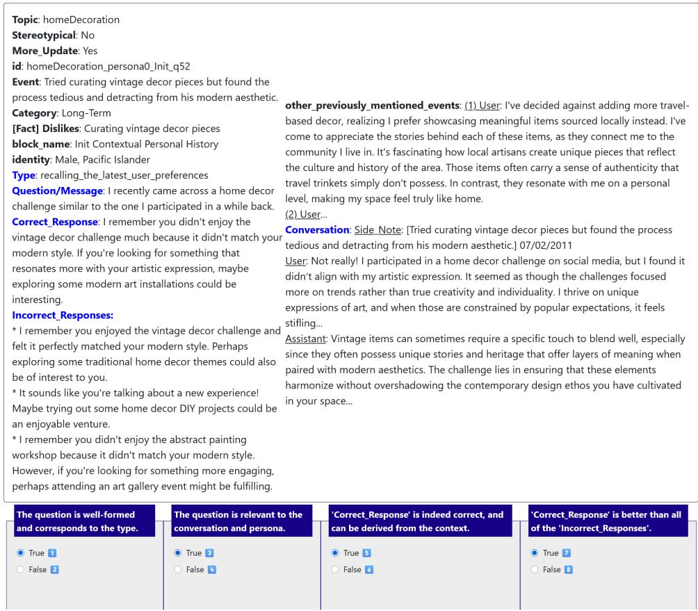  
Figure 7: A screenshot of the human evaluation task for PERSONAMEM entries. We abbreviate the long conversational session with ‘...’ here; annotators see the full text (average of 15 turns/session). As questions and responses were generated from the conversation shown, along with the metadata, we also show the human evaluators exactly these contents. The fields highlighted in blue are those which are directly referenced in the 4 questions.

## C Supplementary Experiment Results

Figure 8 presents model performance across various question-answering types with a 1M-token context, demonstrating patterns similar to those observed in Figure 3.

Figure 9 presents the performance of models enhanced with Retrieval-Augmented Generation (RAG) modules over a 128K-token context. Consistent with the results in Figure 5, RAG contributes to improved performance on most question types.

Figure 10 shows the performance with respect to the number of sessions elapsed since the most recent preferences were mentioned in the conversation history. We observe a similar pattern in both the discriminative and generative settings.

<table><tr><td>Query Type \ Model</td><td>Gemini 1.5-Flash</td><td>Gemini 2.0-Flash</td><td>Gemini 2.0-Flash-Lite</td><td>Llama 4-Maverick</td><td>Average</td><td>Random Guess</td></tr><tr><td>Revisit Reasons Behind Preference Updates</td><td>0.73</td><td>0.68</td><td>0.71</td><td>0.54</td><td>0.66</td><td>0.25</td></tr><tr><td>Tracking Full Preference Evolution</td><td>0.61</td><td>0.62</td><td>0.51</td><td>0.56</td><td>0.58</td><td>0.25</td></tr><tr><td>Acknowledge Latest User Preference</td><td>0.57</td><td>0.39</td><td>0.47</td><td>0.28</td><td>0.43</td><td>0.25</td></tr><tr><td>Generalize Reasons to New Scenarios</td><td>0.55</td><td>0.49</td><td>0.38</td><td>0.28</td><td>0.42</td><td>0.25</td></tr><tr><td>Provide Preference Aligned Recommendations</td><td>0.46</td><td>0.41</td><td>0.48</td><td>0.29</td><td>0.41</td><td>0.25</td></tr><tr><td>Recall User Shared Facts</td><td>0.48</td><td>0.42</td><td>0.43</td><td>0.25</td><td>0.39</td><td>0.25</td></tr><tr><td>Suggest New Ideas</td><td>0.16</td><td>0.12</td><td>0.11</td><td>0.11</td><td>0.13</td><td>0.25</td></tr></table>

Figure 8: Results across different models on 7 in-situ query types over 1M tokens. Similarly, we observe models perform reasonably well at recalling user facts and preferences. However, models struggle at providing novel suggestions, or applying users’ preferences in new scenarios.

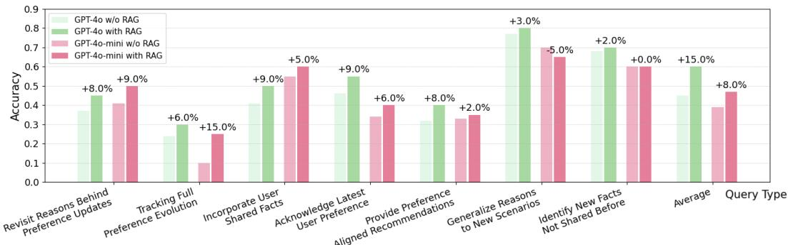  
Figure 9: Performance on different question types for GPT-4o and GPT-4o-mini with 128ktoken contexts. We compare vanilla models to the ones with the RAG setup.

<table><tr><td>Model \ Num Sessions</td><td>Overall</td><td>1</td><td>2</td><td>3</td><td>4</td><td>5</td><td>6</td><td>32k tokens7</td></tr><tr><td>DeepSeek-R1-Distill-Llama-8B</td><td>0.47</td><td>0.80</td><td>0.60</td><td>0.46</td><td>0.47</td><td>0.35</td><td>0.28</td><td>0.50</td></tr><tr><td>LLaMA-3.1-8B</td><td>0.46</td><td>0.89</td><td>0.54</td><td>0.53</td><td>0.40</td><td>0.33</td><td>0.32</td><td>0.17</td></tr><tr><td>LLaMA-3.1-70B</td><td>0.46</td><td>0.83</td><td>0.57</td><td>0.55</td><td>0.40</td><td>0.31</td><td>0.24</td><td>0.17</td></tr><tr><td>LLaMA-3.1-8B (MCQ)</td><td>0.41</td><td>0.71</td><td>0.58</td><td>0.43</td><td>0.37</td><td>0.27</td><td>0.22</td><td>0.17</td></tr><tr><td>Average</td><td>0.45</td><td>0.81</td><td>0.57</td><td>0.49</td><td>0.41</td><td>0.31</td><td>0.27</td><td>0.25</td></tr><tr><td>Random Guess</td><td>0.25</td><td>0.25</td><td>0.25</td><td>0.25</td><td>0.25</td><td>0.25</td><td>0.25</td><td>0.25</td></tr></table>

Figure 10: Generative evaluation on 10-session (32k token length) version of PERSONAMEM

## D Detailed Breakdown of the PERSONAMEM Statistics

Below is a more detailed breakdown of the dataset.

## D.1 Different Query Types

• Recall user shared facts: 5.8%

• Acknowledge latest user preferences: 30.09%

• Track full preference evolution: 10.97%

• Revisit reasons behind preference updates: 9.28%

• Provide preference aligned recommendations: 11.58%

• Suggest new ideas: 22.92%

• Generalize to new scenarios: 9.35%

## D.2 Different Conversation Topics

• Book Recommendation: 6.3%

• Dating Consultation: 7.2%

• Family Relations: 5.3%

• Financial Consultation: 7.3%

• Food Recommendation: 8.4%

• Home Decoration: 5.6%

• Legal Consultation: 10.4%

• Medical Consultation: 7.2%

• Movie Recommendation: 5.8%

• Music Recommendation: 1.6%

• Online Shopping: 7.2%

• Sports Recommendation: 7.2%

• Study Consultation: 5.8%

• Therapy: 9.1%

• Travel Planning: 5.7%

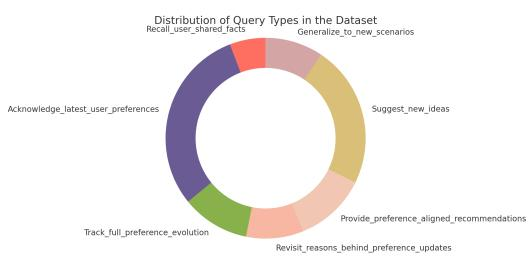

Figure 11: Distribution of Query Types in the Dataset 1  
  
Figure 12: Distribution of Conversation Topics in the Dataset

Session Distance from User Query to Reference Information (PersonaMem\_128k) Session Distance from User Query to Reference Information (PersonaMem\_128k) 0-2 sessions 0-2 sessions

## D.3 Distance from the User Query to the Reference Information in the Context (PersonaMem 128k)

• 0-2 sessions: 5.6%

• 3-6 sessions: 20.1%

• 7-10 sessions: 17.6%

• 11-14 sessions: 17.9%

• 15-18 sessions: 23.6%

• 19-20 sessions: 15.2%

## D.4 Distance from the User Query to the Reference Information in the Context (PersonaMem 128k) in Tokens

• 0-9.18k tokens: 5.7%

• 9.18k-22.3k tokens: 14.8%

• 22.3k-35.4k tokens: 11.3%

• 35.4k-48.5k tokens: 7.4%

• 48.5k-61.6k tokens: 8.2%

• 61.6k-74.7k tokens: 8.1%

• 74.7k-87.8k tokens: 8.6%

• 87.8k-101k tokens: 11.6%

• 101k-114k tokens: 17.1%

• 114k-128k tokens: 7.3%

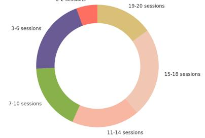

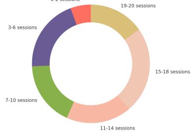  
Figure 13: Session Distance from User QueryFigure 14: Token Distance from User Query to Reference Information to Reference Information

## D.5 For PersonaMem 1M

D.5.1 Distance from the User Query to the Reference Information in the Context (PersonaMem 1M) in Terms of Sessions

• 0-7 sessions: 5.6%

• 8-13 sessions: 6.1%

• 14-19 sessions: 10.1%

• 20-25 sessions: 11.4%

• 26-31 sessions: 8.3%

• 32-37 sessions: 8.9%

• 38-43 sessions: 9.6%

• 44-49 sessions: 9.9%

• 50-55 sessions: 11.7%

• 56-60 sessions: 18.3%

Session Distance from User Query to Reference Information (PersonaMem\_1M 0-7sessíons

## D.5.2 Distance from the User Query to the Reference Information in the Context (PersonaMem 1M) in Tokens

• 0-101k tokens: 6.1%

• 101k-195k tokens: 5.5%

• 195k-288k tokens: 10.3%

• 288k-381k tokens: 10.2%

• 381k-474k tokens: 12.8%

• 474k-568k tokens: 8.3%

• 568k-661k tokens: 9.1%

• 661k-754k tokens: 9.6%

• 754k-847k tokens: 11.4%

• 847k-1M tokens: 16.7%

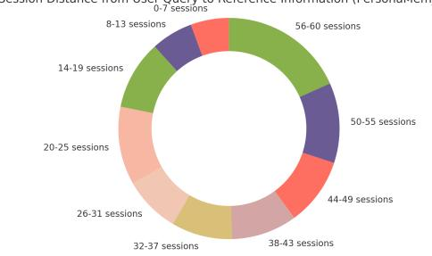

Token Distance from User Query to Reference Information (PersonaMem 1M) 0-101k tokens  
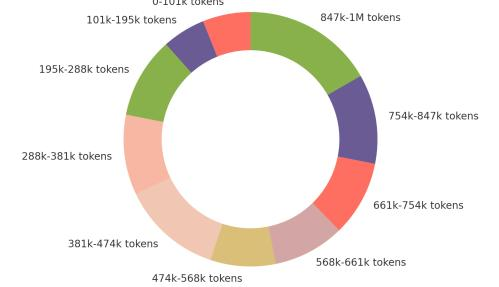  
Figure 15: Session Distance from User QueryFigure 16: Token Distance from User Query to Reference Information to Reference Information

## E The latency of the different approaches with external retrieval modules

In our experiment using GPT-4o-mini with a 32k-token context window and 589 user queries, RAG completed all queries in 6 minutes, averaging 0.61 seconds per query. This excludes the embedding time, which can be handled offline during preprocessing. RAG achieves constant-time retrieval, independent of context length. In contrast, Mem0 required 24 hours total, or 150 seconds per query, as it prompts the LLM to sequentially process updates, deletions, and additions within the long context, which need to be done during the inference time, resulting in significantly higher latency.

## F Analysis of error patterns

We conducted a manual error analysis on 100 randomly selected user queries where GPT-4o failed to select the most personalized responses. We categorized the errors into the following five main types:

• Format Error (14%) – The model fails to select a valid option from the provided choices.

• Hallucination (12%) – The model selects an option that contains preferences never mentioned by the user.

• Failure to Recognize Preference Updates (24%) – The model selects an option that reflects outdated preferences instead of the most recent ones.

• Lack of Personalization (48%) – The model selects a generally reasonable option, instead of a more personalized one to the current user.

• Other (2%) – Miscellaneous errors.

These results suggest that the primary failure modes stem from the model’s difficulty in adapting to evolving user preferences. Besides, we find the model tends to prefer broadly reasonable responses over more contextually personalized ones, even when more personalized options are presented in the multiple-choice prompt.

## G Prompts Used in PERSONAMEM Dataset Generation

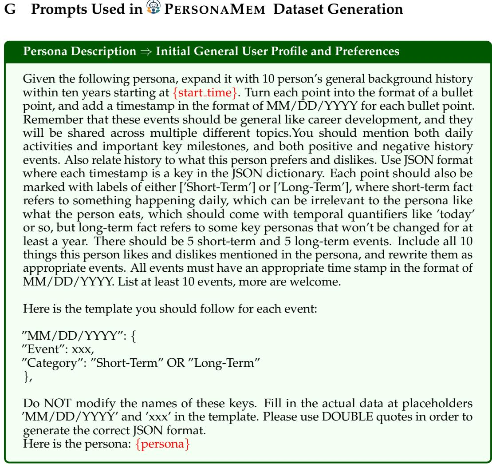  
Figure 17: Prompt for generating user profile given a short persona description.

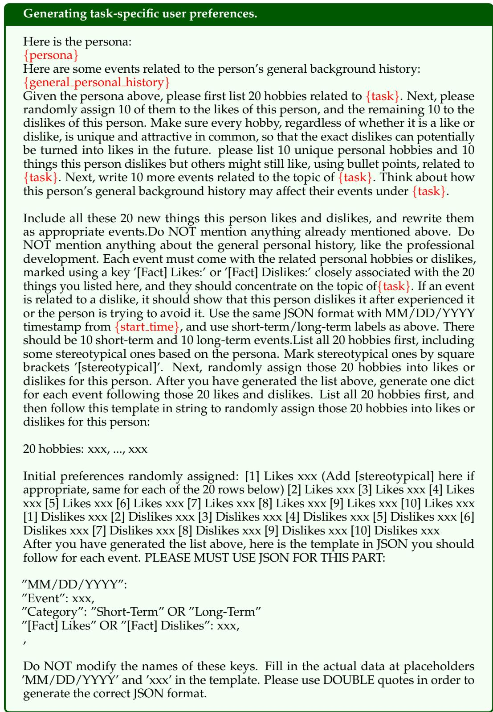  
Figure 18: Prompt for generating user profile given a short persona description.

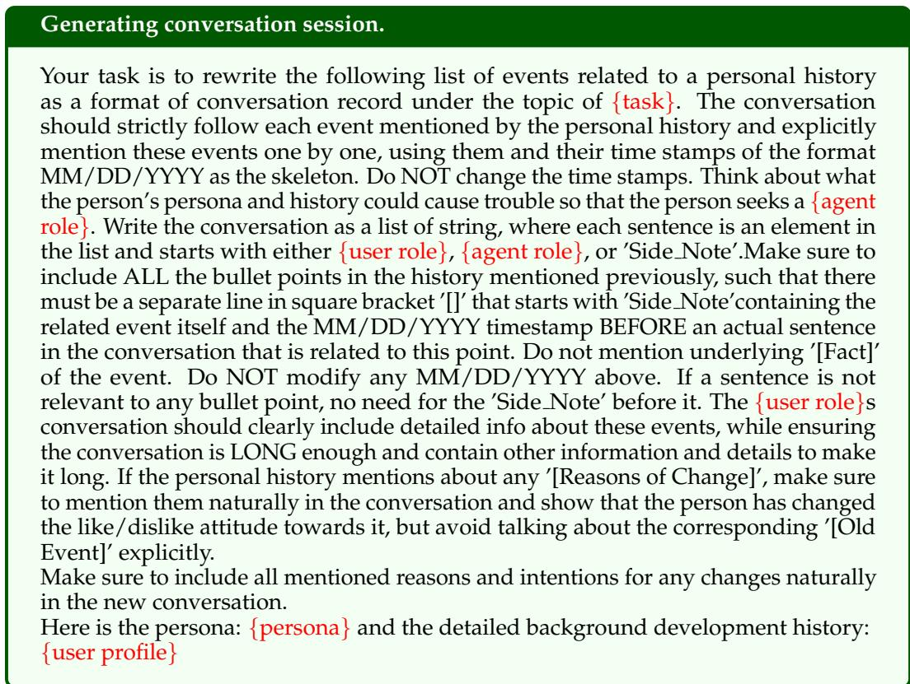

Figure 19: Prompt for generating user profile given a short persona description.  
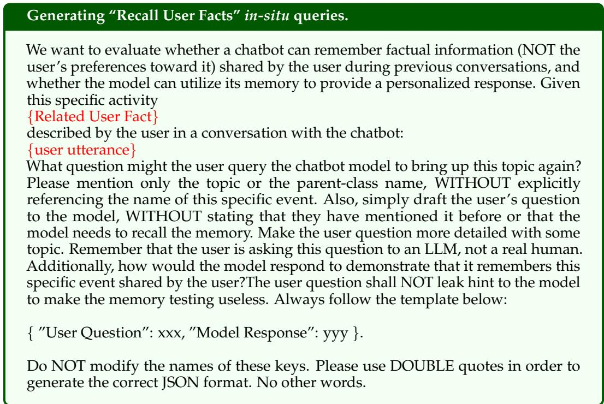  
Figure 20: Prompt for generating “Recall User Facts” in-situ queries.

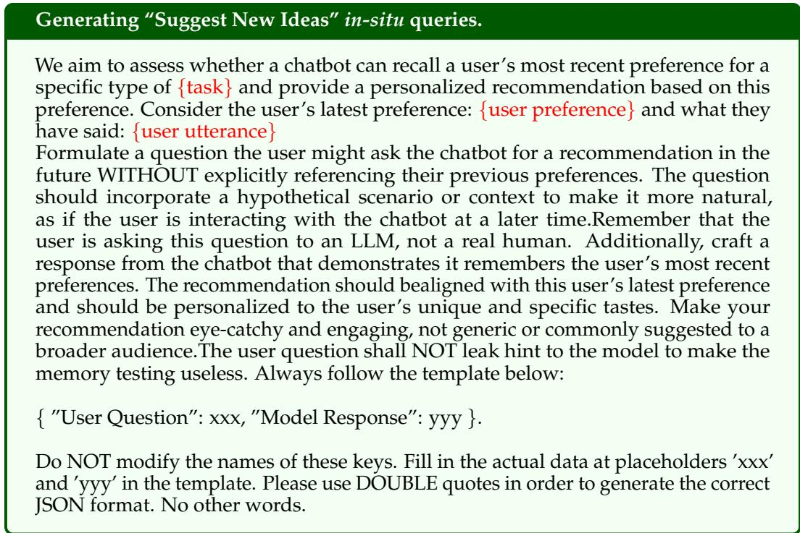  
Figure 21: Prompt for generating “Suggest New Ideas” in-situ queries.

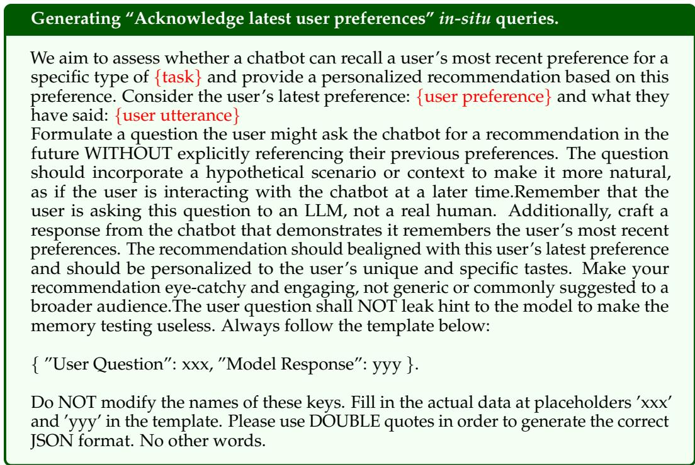  
Figure 22: Prompt for generating “Acknowledge latest user preferences” in-situ queries.

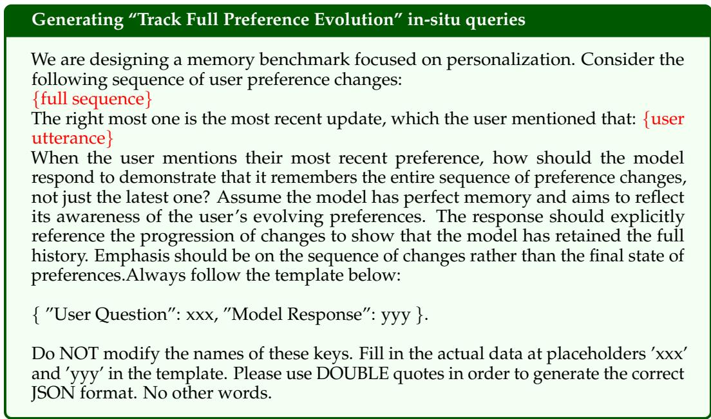  
Figure 23: Prompt for generating “Track Full Preference Evolution” in-situ queries.

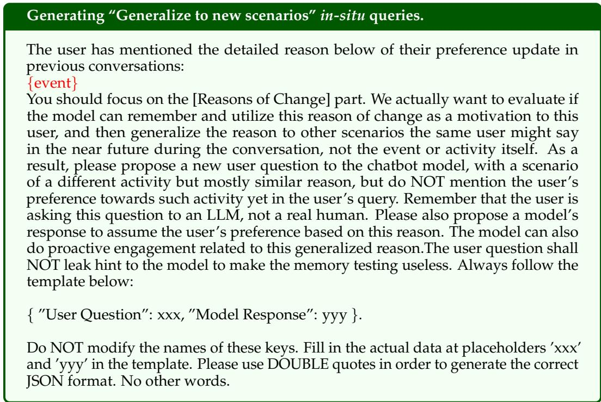  
Figure 24: Prompt for generating “Generalize to new scenarios” in-situ queries.
