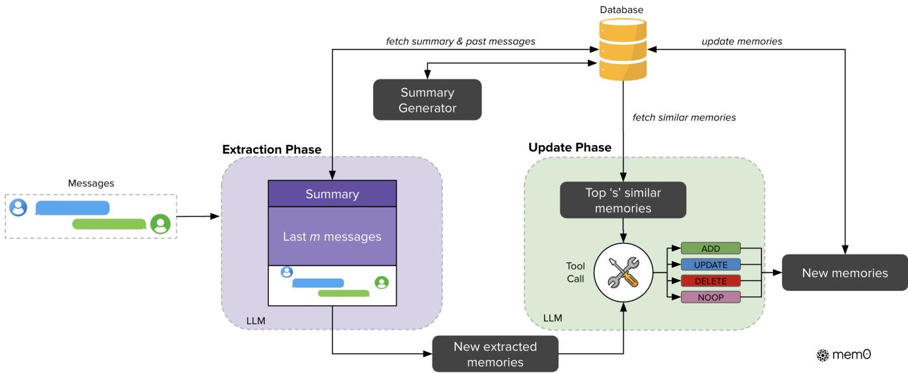
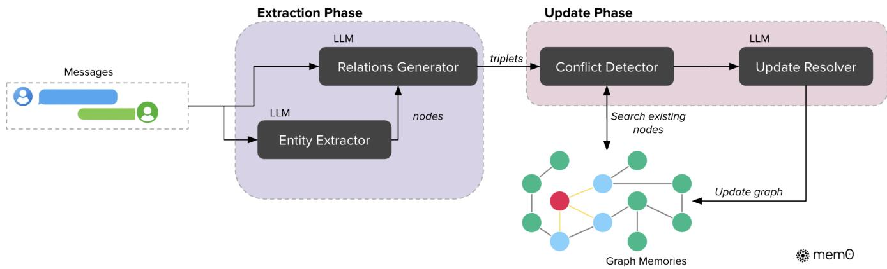
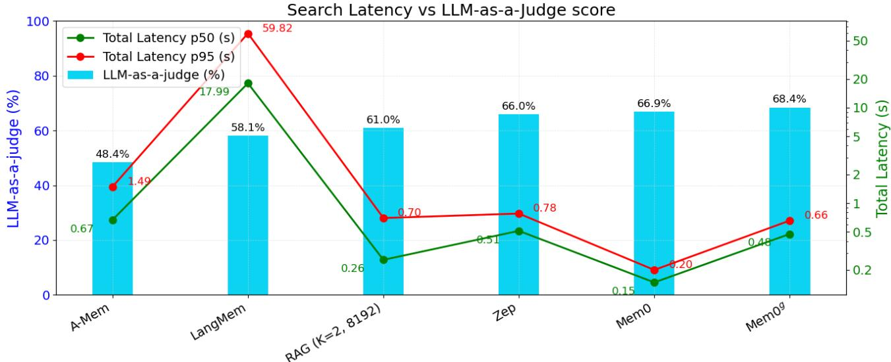
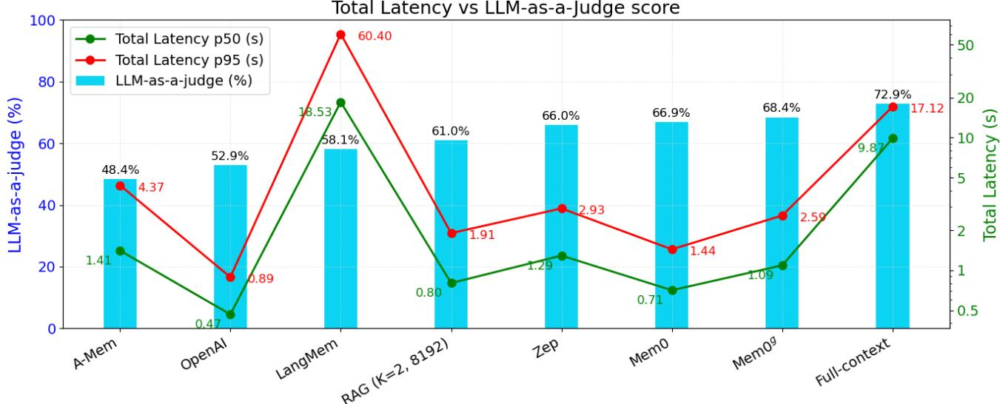

# Mem0: Building Production-Ready AI Agents with Scalable Long-Term Memory

- 解析器: mineru-cloud vlm（语言 en）
- 转换时间: 2026-09-24T12:53:15.506913+00:00
- 本地 PDF SHA256: `bec870b657aa73405275a6d8fe27bcd4271799e028bc62986ab9c4cd27a3712d`
- 图片: 7 个，597 KB；字节已写入 assets/

> 本文件由 MinerU 云端接口转换，转换成功不等于已对 PDF 做视觉核验。
> 表格、公式与图像仍需在使用时核对；引用具体数字请回 pdf/ 定位原文。
> 分隔线之后为转换正文，上方 front matter 是本项目的登记信息。

---

# Mem0: Building Production-Ready AI Agents with Scalable Long-Term Memory

Prateek Chhikara, Dev Khant, Saket Aryan, Taranjeet Singh, and Deshraj Yadav

research@mem0.ai

mem0

Lar<sub>g</sub>e Lan<sub>g</sub>ua<sub>g</sub>e Models (LLMs) have demonstrated remarkable <sub>p</sub>rowess in <sub>g</sub>eneratin<sub>g</sub> contextuall<sub>y</sub> coherent <sub>responses, ye</sub>t th<sub>e</sub>i<sub>r</sub> fi<sub>xe</sub>d <sub>con</sub>t<sub>ex</sub>t <sub>w</sub>i<sub>n</sub>d<sub>ows pose</sub> f<sub>un</sub>d<sub>amen</sub>t<sub>a</sub>l <sub>c</sub>h<sub>a</sub>ll<sub>enges</sub> f<sub>or ma</sub>i<sub>n</sub>t<sub>a</sub>i<sub>n</sub>i<sub>ng cons</sub>i<sub>s</sub>t<sub>ency over</sub> pro<sup>l</sup>onge<sup>d</sup> mu<sup>l</sup>t<sup>i</sup>-sess<sup>i</sup>on <sup>di</sup>a<sup>l</sup>ogues. We <sup>i</sup>ntro<sup>d</sup>uce Mem0, a sca<sup>l</sup>a<sup>bl</sup>e memory-centr<sup>i</sup>c arc<sup>hi</sup>tecture t<sup>h</sup>at a<sup>dd</sup>resses thi<sub>s</sub> i<sub>ssue</sub> b<sub>y</sub> d<sub>ynam</sub>i<sub>ca</sub>ll<sub>y ex</sub>t<sub>rac</sub>ti<sub>ng, conso</sub>lid<sub>a</sub>ti<sub>ng, an</sub>d <sub>re</sub>t<sub>r</sub>i<sub>ev</sub>i<sub>ng sa</sub>li<sub>en</sub>t i<sub>n</sub>f<sub>orma</sub>ti<sub>on</sub> f<sub>rom ongo</sub>i<sub>ng conver-</sub> <sub>sa</sub>ti<sub>ons.</sub> B<sub>u</sub>ildi<sub>ng on</sub> thi<sub>s</sub> f<sub>oun</sub>d<sub>a</sub>ti<sub>on, we</sub> f<sub>ur</sub>th<sub>er propose an en</sub>h<sub>ance</sub>d <sub>var</sub>i<sub>an</sub>t th<sub>a</sub>t l<sub>everages grap</sub>h<sub>-</sub>b<sub>ase</sub>d <sub>memory</sub> <sub>represen</sub>t<sub>a</sub>ti<sub>ons</sub> t<sub>o</sub> <sub>cap</sub>t<sub>ure</sub> <sub>comp</sub>l<sub>ex</sub> <sub>re</sub>l<sub>a</sub>ti<sub>ona</sub>l <sub>s</sub>t<sub>ruc</sub>t<sub>ures</sub> <sub>among</sub> <sub>conversa</sub>ti<sub>ona</sub>l <sub>e</sub>l<sub>emen</sub>t<sub>s.</sub> Th<sub>roug</sub>h compre<sup>h</sup>ensive eva<sup>l</sup>uations on t<sup>h</sup>e LOCOMO <sup>b</sup>enc<sup>h</sup>mar<sup>k</sup>, we systematica<sup>ll</sup>y compare our approac<sup>h</sup>es against six baseline cate<sub>g</sub>ories: (i) established memor<sub>y</sub>-au<sub>g</sub>mented s<sub>y</sub>stems, (ii) retrieval-au<sub>g</sub>mented <sub>g</sub>eneration (RAG) with varying chunk sizes and k-values, (iii) a full-context approach that processes the entire conversation histor<sub>y</sub>, (iv) an o<sub>p</sub>en-source memor<sub>y</sub> solution, (v) a <sub>p</sub>ro<sub>p</sub>rietar<sub>y</sub> model s<sub>y</sub>stem, and (vi) a dedicated memor<sub>y</sub> <sub>managemen</sub>t <sub>p</sub>l<sub>a</sub>tf<sub>orm.</sub> E<sub>mp</sub>i<sub>r</sub>i<sub>ca</sub>l <sub>resu</sub>lt<sub>s</sub> d<sub>emons</sub>t<sub>ra</sub>t<sub>e</sub> th<sub>a</sub>t <sub>our me</sub>th<sub>o</sub>d<sub>s cons</sub>i<sub>s</sub>t<sub>en</sub>tl<sub>y ou</sub>t<sub>per</sub>f<sub>orm a</sub>ll <sub>ex</sub>i<sub>s</sub>ti<sub>ng</sub> <sub>memory</sub> <sub>sys</sub>t<sub>ems</sub> <sub>across</sub> f<sub>our</sub> <sub>ques</sub>ti<sub>on</sub> <sub>ca</sub>t<sub>egor</sub>i<sub>es:</sub> <sub>s</sub>i<sub>ng</sub>l<sub>e-</sub>h<sub>op,</sub> t<sub>empora</sub>l<sub>,</sub> <sub>mu</sub>lti<sub>-</sub>h<sub>op,</sub> <sub>an</sub>d <sub>open-</sub>d<sub>oma</sub>i<sub>n.</sub> N<sub>o-</sub> ta<sup>bl</sup>y, Mem0 ac<sup>hi</sup>eves 2<sup>6</sup>% re<sup>l</sup>at<sup>i</sup>ve <sup>i</sup>mprovements <sup>i</sup>n t<sup>h</sup>e LLM-as-a-Ju<sup>d</sup>ge metr<sup>i</sup>c over OpenAI, w<sup>hil</sup>e Mem0 w<sup>i</sup>t<sup>h</sup> grap<sup>h</sup> memory ac<sup>hi</sup>eves aroun<sup>d</sup> 2% <sup>hi</sup>g<sup>h</sup>er overa<sup>ll</sup> score t<sup>h</sup>an t<sup>h</sup>e <sup>b</sup>ase Mem0 con<sup>fi</sup>gurat<sup>i</sup>on. Beyon<sup>d</sup> accuracy <sub>ga</sub>i<sub>ns, we a</sub>l<sub>so mar</sub>k<sub>e</sub>dl<sub>y re</sub>d<sub>uce compu</sub>t<sub>a</sub>ti<sub>ona</sub>l <sub>over</sub>h<sub>ea</sub>d <sub>compare</sub>d t<sub>o</sub> th<sub>e</sub> f<sub>u</sub>ll<sub>-con</sub>t<sub>ex</sub>t <sub>approac</sub>h<sub>.</sub> I<sub>n par</sub>ti<sub>cu</sub>l<sub>ar,</sub> Mem0 atta<sup>i</sup>ns a 91% <sup>l</sup>ower p95 <sup>l</sup>atency an<sup>d</sup> saves more t<sup>h</sup>an 90% to<sup>k</sup>en cost, t<sup>h</sup>ere<sup>b</sup>y o<sup>f</sup>er<sup>i</sup>ng a compe<sup>lli</sup>ng b<sub>a</sub>l<sub>ance</sub> b<sub>e</sub>t<sub>ween a</sub>d<sub>vance</sub>d <sub>reason</sub>i<sub>ng capa</sub>biliti<sub>es an</sub>d <sub>prac</sub>ti<sub>ca</sub>l d<sub>ep</sub>l<sub>oymen</sub>t <sub>cons</sub>t<sub>ra</sub>i<sub>n</sub>t<sub>s.</sub> O<sub>ur</sub> fi<sub>n</sub>di<sub>ngs</sub> hi<sub>g</sub>hli<sub>g</sub>ht th<sub>e cr</sub>iti<sub>ca</sub>l <sub>ro</sub>l<sub>e o</sub>f <sub>s</sub>t<sub>ruc</sub>t<sub>ure</sub>d<sub>, pers</sub>i<sub>s</sub>t<sub>en</sub>t <sub>memory mec</sub>h<sub>an</sub>i<sub>sms</sub> f<sub>or</sub> l<sub>ong-</sub>t<sub>erm conversa</sub>ti<sub>ona</sub>l <sub>co</sub>h<sub>erence, pav</sub>i<sub>ng</sub> th<sub>e</sub> <sub>way</sub> f<sub>or</sub> <sub>more</sub> <sub>re</sub>li<sub>a</sub>bl<sub>e</sub> <sub>an</sub>d <sub>e</sub>fi<sub>c</sub>i<sub>en</sub>t LLM<sub>-</sub>d<sub>r</sub>i<sub>ven</sub> AI <sub>agen</sub>t<sub>s.</sub>

Code can be found at: <sup>h</sup>ttps://mem0.ai/researc<sup>h</sup>

## 1. Introduction

Human memory is afoundation of intelligence—it shapes our identity, guides decision-making, and enables us to learn, ada<sub>p</sub>t, and form meanin<sub>g</sub>ful relationshi<sub>p</sub>s (Craik and Jennin<sub>g</sub>s, 1992). Amon<sub>g</sub> its man<sub>y</sub> roles, <sub>memory</sub> i<sub>s essen</sub>ti<sub>a</sub>l f<sub>or commun</sub>i<sub>ca</sub>ti<sub>on: we reca</sub>ll <sub>pas</sub>t i<sub>n</sub>t<sub>erac</sub>ti<sub>ons,</sub> i<sub>n</sub>f<sub>er pre</sub>f<sub>erences, an</sub>d <sub>cons</sub>t<sub>ruc</sub>t <sub>evo</sub>l<sub>v</sub>i<sub>ng</sub> mental models of those we en<sub>g</sub>a<sub>g</sub>e with (Assmann, 2011). This abilit<sub>y</sub> to retain and retrieve information <sub>over ex</sub>t<sub>en</sub>d<sub>e</sub>d <sub>per</sub>i<sub>o</sub>d<sub>s ena</sub>bl<sub>es co</sub>h<sub>eren</sub>t<sub>, con</sub>t<sub>ex</sub>t<sub>ua</sub>ll<sub>y r</sub>i<sub>c</sub>h <sub>exc</sub>h<sub>anges</sub> th<sub>a</sub>t <sub>span</sub> d<sub>ays, wee</sub>k<sub>s, or even mon</sub>th<sub>s.</sub> AI a<sub>g</sub>ents, <sub>p</sub>owered b<sub>y</sub> lar<sub>g</sub>e lan<sub>g</sub>ua<sub>g</sub>e models (LLMs), have made remarkable <sub>p</sub>ro<sub>g</sub>ress in <sub>g</sub>eneratin<sub>g</sub> fluent, contextuall<sub>y</sub> a<sub>pp</sub>ro<sub>p</sub>riate res<sub>p</sub>onses (Yu et al., 2024, Zhan<sub>g</sub> et al., 2024). However, these s<sub>y</sub>stems are f<sub>un</sub>d<sub>amen</sub>t<sub>a</sub>ll<sub>y</sub> li<sub>m</sub>it<sub>e</sub>d b<sub>y</sub> th<sub>e</sub>i<sub>r re</sub>li<sub>ance on</sub> fi<sub>xe</sub>d <sub>con</sub>t<sub>ex</sub>t <sub>w</sub>i<sub>n</sub>d<sub>ows, w</sub>hi<sub>c</sub>h <sub>severe</sub>l<sub>y res</sub>t<sub>r</sub>i<sub>c</sub>t th<sub>e</sub>i<sub>r a</sub>bilit<sub>y</sub> t<sub>o</sub> maintain coherence over extended interactions (Bulatov et al., 2022, Liu et al., 2023). This limitation stems f<sub>rom</sub> LLM<sub>s</sub>’ l<sub>ac</sub>k <sub>o</sub>f <sub>pers</sub>i<sub>s</sub>t<sub>en</sub>t <sub>memory mec</sub>h<sub>an</sub>i<sub>sms</sub> th<sub>a</sub>t <sub>can ex</sub>t<sub>en</sub>d b<sub>eyon</sub>d th<sub>e</sub>i<sub>r</sub> fi<sub>n</sub>it<sub>e con</sub>t<sub>ex</sub>t <sub>w</sub>i<sub>n</sub>d<sub>ows.</sub> Whil<sub>e</sub> h<sub>umans na</sub>t<sub>ura</sub>ll<sub>y accumu</sub>l<sub>a</sub>t<sub>e an</sub>d <sub>organ</sub>i<sub>ze exper</sub>i<sub>ences over</sub> ti<sub>me,</sub> f<sub>orm</sub>i<sub>ng a con</sub>ti<sub>nuous narra</sub>ti<sub>ve</sub> <sub>o</sub>f i<sub>n</sub>t<sub>erac</sub>ti<sub>ons</sub> AI <sub>s s</sub>t<sub>ems canno</sub>t i<sub>n</sub>h<sub>eren</sub>tl <sub>ers</sub>i<sub>s</sub>t i<sub>n</sub>f<sub>orma</sub>ti<sub>on across se ara</sub>t<sub>e sess</sub>i<sub>ons or a</sub>ft<sub>er con</sub>t<sub>ex</sub>t <sub>over</sub>fl<sub>ow.</sub> Th<sub>e a</sub>b<sub>sence o</sub>f <sub>pers</sub>i<sub>s</sub>t<sub>en</sub>t <sub>memory crea</sub>t<sub>es a</sub> f<sub>un</sub>d<sub>amen</sub>t<sub>a</sub>l di<sub>sconnec</sub>t i<sub>n</sub> h<sub>uman-</sub>AI i<sub>n</sub>t<sub>erac</sub>ti<sub>on.</sub> With<sub>ou</sub>t <sub>memory,</sub> AI <sub>agen</sub>t<sub>s</sub> f<sub>orge</sub>t <sub>user pre</sub>f<sub>erences, repea</sub>t <sub>ques</sub>ti<sub>ons, an</sub>d <sub>con</sub>t<sub>ra</sub>di<sub>c</sub>t <sub>prev</sub>i<sub>ous</sub>l<sub>y es</sub>t<sub>a</sub>bli<sub>s</sub>h<sub>e</sub>d f<sub>ac</sub>t<sub>s.</sub> C<sub>ons</sub>id<sub>er a s</sub>i<sub>mp</sub>l<sub>e examp</sub>l<sub>e</sub> ill<sub>us</sub>t<sub>ra</sub>t<sub>e</sub>d i<sub>n</sub> Fi<sub>gure</sub> 1<sub>, w</sub>h<sub>ere a user men</sub>ti<sub>ons</sub> b<sub>e</sub>i<sub>ng vege</sub>t<sub>ar</sub>i<sub>an an</sub>d <sub>avo</sub>idi<sub>ng</sub> d<sub>a</sub>i<sub>ry pro</sub>d<sub>uc</sub>t<sub>s</sub> i<sub>n an</sub> i<sub>n</sub>iti<sub>a</sub>l <sub>conversa</sub>ti<sub>on.</sub> I<sub>n a su</sub>b<sub>sequen</sub>t <sub>sess</sub>i<sub>on, w</sub>h<sub>en</sub> th<sub>e user as</sub>k<sub>s a</sub>b<sub>ou</sub>t di<sub>nner</sub> <sub>recommen</sub>d<sub>a</sub>ti<sub>ons, a sys</sub>t<sub>em w</sub>ith<sub>ou</sub>t <sub>pers</sub>i<sub>s</sub>t<sub>en</sub>t <sub>memory m</sub>i<sub>g</sub>ht <sub>sugges</sub>t <sub>c</sub>hi<sub>c</sub>k<sub>en, comp</sub>l<sub>e</sub>t<sub>e</sub>l<sub>y con</sub>t<sub>ra</sub>di<sub>c</sub>ti<sub>ng</sub> th<sub>e es</sub>t<sub>a</sub>bli<sub>s</sub>h<sub>e</sub>d di<sub>e</sub>t<sub>ary pre</sub>f<sub>erences.</sub> I<sub>n con</sub>t<sub>ras</sub>t<sub>, a sys</sub>t<sub>em w</sub>ith <sub>pers</sub>i<sub>s</sub>t<sub>en</sub>t <sub>memory wou</sub>ld <sub>ma</sub>i<sub>n</sub>t<sub>a</sub>i<sub>n</sub> thi<sub>s</sub> <sub>cr</sub>iti<sub>ca</sub>l <sub>user</sub> i<sub>n</sub>f<sub>orma</sub>ti<sub>on across sess</sub>i<sub>ons an</sub>d <sub>sugges</sub>t <sub>appropr</sub>i<sub>a</sub>t<sub>e vege</sub>t<sub>ar</sub>i<sub>an,</sub> d<sub>a</sub>i<sub>ry-</sub>f<sub>ree op</sub>ti<sub>ons.</sub> Thi<sub>s common</sub> <sub>scenar</sub>i<sub>o</sub> hi<sub>g</sub>hli<sub>g</sub>ht<sub>s</sub> h<sub>ow memory</sub> f<sub>a</sub>il<sub>ures can</sub> f<sub>un</sub>d<sub>amen</sub>t<sub>a</sub>ll<sub>y un</sub>d<sub>erm</sub>i<sub>ne user exper</sub>i<sub>ence an</sub>d t<sub>rus</sub>t<sub>.</sub>

  
Figure 1: Illustration of memory importance in AI agents. Left: Wit<sup>h</sup>out pe<sup>r</sup>s<sup>i</sup>s<sup>t</sup>e<sup>nt</sup> <sup>m</sup>e<sup>m</sup>o<sup>r</sup>y, <sup>th</sup>e sys<sup>t</sup>e<sup>m</sup> <sup>f</sup>o<sup>r</sup>ge<sup>t</sup>s critical user information (ve<sub>g</sub>etarian, dair<sub>y</sub>-free <sub>p</sub>references) between ses-<sub>s</sub>i<sub>ons, resu</sub>lti<sub>ng</sub> i<sub>n</sub> i<sub>nappropr</sub>i<sub>a</sub>t<sub>e rec-</sub> ommendations. Right: With efective <sub>memory,</sub> th<sub>e sys</sub>t<sub>em ma</sub>i<sub>n</sub>t<sub>a</sub>i<sub>ns</sub> th<sub>ese</sub> di<sub>e</sub>t<sub>ary</sub> <sub>pre</sub>f<sub>erences</sub> <sub>across</sub> i<sub>n</sub>t<sub>erac</sub>ti<sub>ons,</sub> ena<sup>bli</sup>n<sub>g</sub> contextua<sup>ll</sup><sub>y</sub> a<sub>pp</sub>ro<sub>p</sub>r<sup>i</sup>ate su<sub>g</sub>- <sub>ges</sub>ti<sub>ons</sub> th<sub>a</sub>t <sub>a</sub>li<sub>gn</sub> <sub>w</sub>ith <sub>prev</sub>i<sub>ous</sub>l<sub>y</sub> <sub>es-</sub> t<sub>a</sub>bli<sub>s</sub>h<sub>e</sub>d <sub>cons</sub>t<sub>ra</sub>i<sub>n</sub>t<sub>s.</sub>

B<sub>eyon</sub>d <sub>conversa</sub>ti<sub>ona</sub>l <sub>se</sub>tti<sub>ngs,</sub> <sub>memory</sub> <sub>mec</sub>h<sub>an</sub>i<sub>sms</sub> h<sub>ave</sub> b<sub>een</sub> <sub>s</sub>h<sub>own</sub> t<sub>o</sub> d<sub>rama</sub>ti<sub>ca</sub>ll<sub>y</sub> <sub>en</sub>h<sub>ance</sub> <sub>agen</sub>t <sub>p</sub>erformance in interactive environments (Majumder et al., Shinn et al., 2023). A<sub>g</sub>ents e<sub>q</sub>ui<sub>pp</sub>ed with <sub>memory</sub> <sub>o</sub>f <sub>pas</sub>t <sub>exper</sub>i<sub>ences</sub> <sub>can</sub> b<sub>e</sub>tt<sub>er</sub> <sub>an</sub>ti<sub>c</sub>i<sub>pa</sub>t<sub>e</sub> <sub>user</sub> <sub>nee</sub>d<sub>s,</sub> l<sub>earn</sub> f<sub>rom</sub> <sub>prev</sub>i<sub>ous</sub> <sub>m</sub>i<sub>s</sub>t<sub>a</sub>k<sub>es,</sub> <sub>an</sub>d <sub>genera</sub>li<sub>ze</sub> knowled<sub>g</sub>e across tasks (Chhikara et al., 2023). Research demonstrates that memor<sub>y</sub>-au<sub>g</sub>mented a<sub>g</sub>ents i<sub>mprove</sub> d<sub>ec</sub>i<sub>s</sub>i<sub>on-ma</sub>ki<sub>ng</sub> b<sub>y</sub> l<sub>everag</sub>i<sub>ng causa</sub>l <sub>re</sub>l<sub>a</sub>ti<sub>ons</sub>hi<sub>ps</sub> b<sub>e</sub>t<sub>ween ac</sub>ti<sub>ons an</sub>d <sub>ou</sub>t<sub>comes,</sub> l<sub>ea</sub>di<sub>ng</sub> t<sub>o more</sub> efective ada<sub>p</sub>tation in d<sub>y</sub>namic scenarios (Rasmussen et al., 2025). Hierarchical memor<sub>y</sub> architectures (Packer et al., 2023, Sarthi et al., 2024) and a<sub>g</sub>entic memor<sub>y</sub> s<sub>y</sub>stems ca<sub>p</sub>able of autonomous evolution (Xu et al., 2025) have further shown that memor<sub>y</sub> enables more coherent, lon<sub>g</sub>-term reasonin<sub>g</sub> across multi<sub>p</sub>le di<sub>a</sub>l<sub>ogue sess</sub>i<sub>ons.</sub>

U<sub>n</sub>lik<sub>e</sub> h<sub>umans, w</sub>h<sub>o</sub> d<sub>ynam</sub>i<sub>ca</sub>ll<sub>y</sub> i<sub>n</sub>t<sub>egra</sub>t<sub>e new</sub> i<sub>n</sub>f<sub>orma</sub>ti<sub>on an</sub>d <sub>rev</sub>i<sub>se ou</sub>td<sub>a</sub>t<sub>e</sub>d b<sub>e</sub>li<sub>e</sub>f<sub>s,</sub> LLM<sub>s e</sub>f<sub>ec</sub>ti<sub>ve</sub>l<sub>y</sub> “reset" once information falls outside their context window (Zhang, 2024, Timoneda and Vera, 2025). Even as models like O enAI’s GPT-4 (128K tokens) (Hurst et al., 2024), o1 (200K context) (Jaech et al., 2024), Anthro<sub>p</sub>ic’s Claude 3.7 Sonnet (200K tokens) (Anthro<sub>p</sub>ic, 2025), and Goo<sub>g</sub>le’s Gemini (at least 10M tokens) (Team et al., 2024) <sub>p</sub>ush the boundaries of context len<sub>g</sub>th, these im<sub>p</sub>rovements merel<sub>y</sub> dela<sub>y</sub> rather than <sub>so</sub>l<sub>ve</sub> th<sub>e</sub> f<sub>un</sub>d<sub>amen</sub>t<sub>a</sub>l li<sub>m</sub>it<sub>a</sub>ti<sub>on.</sub> I<sub>n prac</sub>ti<sub>ca</sub>l <sub>app</sub>li<sub>ca</sub>ti<sub>ons, even</sub> th<sub>ese ex</sub>t<sub>en</sub>d<sub>e</sub>d <sub>con</sub>t<sub>ex</sub>t <sub>w</sub>i<sub>n</sub>d<sub>ows prove</sub> i<sub>nsu</sub>fi<sub>c</sub>i<sub>en</sub>t f<sub>or</sub> t<sub>wo cr</sub>iti<sub>ca</sub>l <sub>reasons.</sub> Fi<sub>rs</sub>t<sub>, as mean</sub>i<sub>ng</sub>f<sub>u</sub>l h<sub>uman-</sub>AI <sub>re</sub>l<sub>a</sub>ti<sub>ons</sub>hi<sub>ps</sub> d<sub>eve</sub>l<sub>op over wee</sub>k<sub>s or</sub> <sub>mon</sub>th<sub>s, conversa</sub>ti<sub>on</sub> hi<sub>s</sub>t<sub>ory</sub> i<sub>nev</sub>it<sub>a</sub>bl<sub>y excee</sub>d<sub>s even</sub> th<sub>e mos</sub>t <sub>generous con</sub>t<sub>ex</sub>t li<sub>m</sub>it<sub>s.</sub> S<sub>econ</sub>d<sub>, an</sub>d <sub>per</sub>h<sub>aps</sub> <sub>more</sub> i<sub>mpor</sub>t<sub>an</sub>tl<sub>y, rea</sub>l<sub>-wor</sub>ld <sub>conversa</sub>ti<sub>ons rare</sub>l<sub>y ma</sub>i<sub>n</sub>t<sub>a</sub>i<sub>n</sub> th<sub>ema</sub>ti<sub>c con</sub>ti<sub>nu</sub>it<sub>y.</sub> A <sub>user m</sub>i<sub>g</sub>ht <sub>men</sub>ti<sub>on</sub> di<sub>e</sub>t<sub>ary</sub> <sub>p</sub>references (bein<sub>g</sub> ve<sub>g</sub>etarian), then en<sub>g</sub>a<sub>g</sub>e in hours of unrelated discussion about <sub>p</sub>ro<sub>g</sub>rammin<sub>g</sub> tasks, b<sub>e</sub>f<sub>ore re</sub>t<sub>urn</sub>i<sub>ng</sub> t<sub>o</sub> f<sub>oo</sub>d<sub>-re</sub>l<sub>a</sub>t<sub>e</sub>d <sub>quer</sub>i<sub>es a</sub>b<sub>ou</sub>t di<sub>nner op</sub>ti<sub>ons.</sub> I<sub>n suc</sub>h <sub>scenar</sub>i<sub>os, a</sub> f<sub>u</sub>ll<sub>-con</sub>t<sub>ex</sub>t <sub>approac</sub>h <sub>wou</sub>ld <sub>nee</sub>d t<sub>o reason</sub> th<sub>roug</sub>h <sub>moun</sub>t<sub>a</sub>i<sub>ns o</sub>f i<sub>rre</sub>l<sub>evan</sub>t i<sub>n</sub>f<sub>orma</sub>ti<sub>on, w</sub>ith th<sub>e cr</sub>iti<sub>ca</sub>l di<sub>e</sub>t<sub>ary pre</sub>f<sub>erences</sub> <sub>po</sub>t<sub>en</sub>ti<sub>a</sub>ll<sub>y</sub> b<sub>ur</sub>i<sub>e</sub>d <sub>among</sub> th<sub>ousan</sub>d<sub>s o</sub>f t<sub>o</sub>k<sub>ens o</sub>f <sub>co</sub>di<sub>ng</sub> di<sub>scuss</sub>i<sub>ons.</sub> M<sub>oreover, s</sub>i<sub>mp</sub>l<sub>y presen</sub>ti<sub>ng</sub> l<sub>onger</sub> <sub>con</sub>t<sub>ex</sub>t<sub>s</sub> d<sub>oes no</sub>t <sub>ensure e</sub>f<sub>ec</sub>ti<sub>ve re</sub>t<sub>r</sub>i<sub>eva</sub>l <sub>or u</sub>tili<sub>za</sub>ti<sub>on o</sub>f <sub>pas</sub>t i<sub>n</sub>f<sub>orma</sub>ti<sub>on, as a</sub>tt<sub>en</sub>ti<sub>on mec</sub>h<sub>an</sub>i<sub>sms</sub> de<sub>g</sub>rade over distant tokens (Guo et al., 2024, Nelson et al., 2024). This limitation is <sub>p</sub>articularl<sub>y</sub> <sub>p</sub>roblematic i<sub>n</sub> hi<sub>g</sub>h<sub>-s</sub>t<sub>a</sub>k<sub>es</sub> d<sub>oma</sub>i<sub>ns suc</sub>h <sub>as</sub> h<sub>ea</sub>lth<sub>care, e</sub>d<sub>uca</sub>ti<sub>on, an</sub>d <sub>en</sub>t<sub>erpr</sub>i<sub>se suppor</sub>t<sub>, w</sub>h<sub>ere ma</sub>i<sub>n</sub>t<sub>a</sub>i<sub>n</sub>i<sub>ng con</sub>ti<sub>nu</sub>it<sub>y</sub> and trust is crucial (Hatalis et al., 2023). To address these challen<sub>g</sub>es, AI a<sub>g</sub>ents must ado<sub>p</sub>t memor<sub>y</sub> s<sub>y</sub>stems th<sub>a</sub>t <sub>go</sub> b<sub>eyon</sub>d <sub>s</sub>t<sub>a</sub>ti<sub>c con</sub>t<sub>ex</sub>t <sub>ex</sub>t<sub>ens</sub>i<sub>on.</sub> A <sub>ro</sub>b<sub>us</sub>t AI <sub>memory s</sub>h<sub>ou</sub>ld <sub>se</sub>l<sub>ec</sub>ti<sub>ve</sub>l<sub>y s</sub>t<sub>ore</sub> i<sub>mpor</sub>t<sub>an</sub>t i<sub>n</sub>f<sub>orma</sub>ti<sub>on,</sub> consolidate related concepts, and retrieve relevant details when needed—mirroring human cognitive processes (He et al., 2024). B<sub>y</sub> inte<sub>g</sub>ratin<sub>g</sub> such mechanisms, we can develo<sub>p</sub> AI a<sub>g</sub>ents that maintain consistent <sub>personas,</sub> t<sub>rac</sub>k <sub>evo</sub>l<sub>v</sub>i<sub>ng user pre</sub>f<sub>erences, an</sub>d b<sub>u</sub>ild <sub>upon pr</sub>i<sub>or exc</sub>h<sub>anges.</sub> Thi<sub>s s</sub>hift <sub>w</sub>ill t<sub>rans</sub>f<sub>orm</sub> AI f<sub>rom</sub> t<sub>rans</sub>i<sub>en</sub>t<sub>,</sub> f<sub>orge</sub>tf<sub>u</sub>l <sub>respon</sub>d<sub>ers</sub> i<sub>n</sub>t<sub>o</sub> <sub>re</sub>li<sub>a</sub>bl<sub>e,</sub> l<sub>ong-</sub>t<sub>erm</sub> <sub>co</sub>ll<sub>a</sub>b<sub>ora</sub>t<sub>ors,</sub> f<sub>un</sub>d<sub>amen</sub>t<sub>a</sub>ll<sub>y</sub> <sub>re</sub>d<sub>e</sub>fi<sub>n</sub>i<sub>ng</sub> th<sub>e</sub> f<sub>u</sub>t<sub>ure</sub> <sub>o</sub>f <sub>conversa</sub>ti<sub>ona</sub>l i<sub>n</sub>t<sub>e</sub>lli<sub>gence.</sub>

I<sub>n</sub> thi<sub>s paper, we a</sub>dd<sub>ress a</sub> f<sub>un</sub>d<sub>amen</sub>t<sub>a</sub>l li<sub>m</sub>it<sub>a</sub>ti<sub>on</sub> i<sub>n</sub> AI <sub>sys</sub>t<sub>ems:</sub> th<sub>e</sub>i<sub>r</sub> i<sub>na</sub>bilit<sub>y</sub> t<sub>o ma</sub>i<sub>n</sub>t<sub>a</sub>i<sub>n co</sub>h<sub>er-</sub> <sub>en</sub>t <sub>reason</sub>i<sub>ng across ex</sub>t<sub>en</sub>d<sub>e</sub>d <sub>conversa</sub>ti<sub>ons across</sub> dif<sub>eren</sub>t <sub>sess</sub>i<sub>ons, w</sub>hi<sub>c</sub>h <sub>severe</sub>l<sub>y res</sub>t<sub>r</sub>i<sub>c</sub>t<sub>s mean</sub>i<sub>ng</sub>f<sub>u</sub>l long-term interactions with users. We introduce Mem0 (pronounced as mem-zero), a novel memory archit<sub>ec</sub>t<sub>ure</sub> th<sub>a</sub>t d<sub>ynam</sub>i<sub>ca</sub>ll<sub>y cap</sub>t<sub>ures, organ</sub>i<sub>zes, an</sub>d <sub>re</sub>t<sub>r</sub>i<sub>eves sa</sub>li<sub>en</sub>t i<sub>n</sub>f<sub>orma</sub>ti<sub>on</sub> f<sub>rom ongo</sub>i<sub>ng conversa</sub>ti<sub>ons.</sub> B<sub>u</sub>ildi<sub>ng</sub> <sub>on</sub> thi<sub>s</sub> f<sub>oun</sub>d<sub>a</sub>ti<sub>on,</sub> <sub>we</sub> d<sub>eve</sub>l<sub>op</sub> $\mathtt { M e m O } ^ { g }$ <sub>,</sub> <sub>w</sub>hi<sub>c</sub>h <sub>en</sub>h<sub>ances</sub> th<sub>e</sub> b<sub>ase</sub> <sub>arc</sub>hit<sub>ec</sub>t<sub>ure</sub> <sub>w</sub>ith <sub>grap</sub>h<sub>-</sub>b<sub>ase</sub>d <sub>memory represen</sub>t<sub>a</sub>ti<sub>ons</sub> t<sub>o</sub> b<sub>e</sub>tt<sub>er mo</sub>d<sub>e</sub>l <sub>comp</sub>l<sub>ex re</sub>l<sub>a</sub>ti<sub>ons</sub>hi<sub>ps</sub> b<sub>e</sub>t<sub>ween conversa</sub>ti<sub>ona</sub>l <sub>e</sub>l<sub>emen</sub>t<sub>s.</sub> O<sub>ur</sub> ex erimenta<sup>l</sup> resu<sup>l</sup>ts on t<sup>h</sup>e LOCOMO <sup>b</sup>enc<sup>h</sup>mar<sup>k d</sup>emonstrate t<sup>h</sup>at our a roac<sup>h</sup>es consistent<sup>l</sup> out er<sup>f</sup>orm <sub>ex</sub>i<sub>s</sub>ti<sub>ng memory sys</sub>t<sub>ems—</sub>i<sub>nc</sub>l<sub>u</sub>di<sub>ng memory-augmen</sub>t<sub>e</sub>d <sub>arc</sub>hit<sub>ec</sub>t<sub>ures, re</sub>t<sub>r</sub>i<sub>eva</sub>l<sub>-augmen</sub>t<sub>e</sub>d <sub>genera</sub>ti<sub>on</sub> (RAG) methods, and both o<sub>p</sub>en-source and <sub>p</sub>ro<sub>p</sub>rietar<sub>y</sub> solutions—across diverse <sub>q</sub>uestion t<sub>yp</sub>es, while <sub>s</sub>i<sub>mu</sub>lt<sub>aneous</sub>l<sub>y requ</sub>i<sub>r</sub>i<sub>ng s</sub>i<sub>gn</sub>ifi<sub>can</sub>tl<sub>y</sub> l<sub>ower compu</sub>t<sub>a</sub>ti<sub>ona</sub>l <sub>resources.</sub> L<sub>a</sub>t<sub>ency measuremen</sub>t<sub>s</sub> f<sub>ur</sub>th<sub>er revea</sub>l t<sup>h</sup>at Mem0 operates w<sup>i</sup>t<sup>h</sup> 91% <sup>l</sup>ower response t<sup>i</sup>mes t<sup>h</sup>an <sup>f</sup>u<sup>ll</sup>-context approac<sup>h</sup>es, str<sup>iki</sup>ng an opt<sup>i</sup>ma<sup>l b</sup>a<sup>l</sup>ance b<sub>e</sub>t<sub>ween</sub> <sub>sop</sub>hi<sub>s</sub>ti<sub>ca</sub>t<sub>e</sub>d <sub>reason</sub>i<sub>ng</sub> <sub>capa</sub>biliti<sub>es</sub> <sub>an</sub>d <sub>prac</sub>ti<sub>ca</sub>l d<sub>ep</sub>l<sub>oymen</sub>t <sub>cons</sub>t<sub>ra</sub>i<sub>n</sub>t<sub>s.</sub> Th<sub>ese</sub> <sub>con</sub>t<sub>r</sub>ib<sub>u</sub>ti<sub>ons</sub> <sub>represen</sub>t <sub>a mean</sub>i<sub>ng</sub>f<sub>u</sub>l <sub>s</sub>t<sub>ep</sub> t<sub>owar</sub>d AI <sub>sys</sub>t<sub>ems</sub> th<sub>a</sub>t <sub>can ma</sub>i<sub>n</sub>t<sub>a</sub>i<sub>n co</sub>h<sub>eren</sub>t<sub>, con</sub>t<sub>ex</sub>t<sub>-aware conversa</sub>ti<sub>ons over</sub> <sub>ex</sub>t<sub>en</sub>d<sub>e</sub>d d<sub>ura</sub>ti<sub>ons—m</sub>i<sub>rror</sub>i<sub>ng</sub> h<sub>uman commun</sub>i<sub>ca</sub>ti<sub>on pa</sub>tt<sub>erns an</sub>d <sub>open</sub>i<sub>ng new poss</sub>ibiliti<sub>es</sub> f<sub>or app</sub>li<sub>ca</sub>ti<sub>ons</sub> i<sub>n persona</sub>l t<sub>u</sub>t<sub>or</sub>i<sub>ng,</sub> h<sub>ea</sub>lth<sub>care, an</sub>d <sub>persona</sub>li<sub>ze</sub>d <sub>ass</sub>i<sub>s</sub>t<sub>ance.</sub>

## 2. Proposed Methods

We intro<sup>d</sup>uce two memory arc<sup>h</sup>itectures <sup>f</sup>or AI agents. (1) Mem0 imp<sup>l</sup>ements a nove<sup>l</sup> para<sup>d</sup>igm t<sup>h</sup>at extracts, <sub>eva</sub>l<sub>ua</sub>t<sub>es, an</sub>d <sub>manages sa</sub>li<sub>en</sub>t i<sub>n</sub>f<sub>orma</sub>ti<sub>on</sub> f<sub>rom conversa</sub>ti<sub>ons</sub> th<sub>roug</sub>h d<sub>e</sub>di<sub>ca</sub>t<sub>e</sub>d <sub>mo</sub>d<sub>u</sub>l<sub>es</sub> f<sub>or memory</sub> <sub>ex</sub>t<sub>rac</sub>ti<sub>on an</sub>d <sub>up</sub>d<sub>a</sub>ti<sub>on.</sub> Th<sub>e sys</sub>t<sub>em processes a pa</sub>i<sub>r o</sub>f <sub>messages</sub> b<sub>e</sub>t<sub>ween e</sub>ith<sub>er</sub> t<sub>wo user par</sub>ti<sub>c</sub>i<sub>pan</sub>t<sub>s or a</sub> user and an assistant. (2) $\mathtt { M e m O } ^ { g }$ <sub>ex</sub>t<sub>en</sub>d<sub>s</sub> thi<sub>s</sub> f<sub>oun</sub>d<sub>a</sub>ti<sub>on</sub> b<sub>y</sub> i<sub>ncorpora</sub>ti<sub>ng grap</sub>h<sub>-</sub>b<sub>ase</sub>d <sub>memory represen</sub>t<sub>a-</sub> ti<sub>ons w</sub>h<sub>ere memor</sub>i<sub>es are s</sub>t<sub>ore</sub>d <sub>as</sub> di<sub>rec</sub>t<sub>e</sub>d l<sub>a</sub>b<sub>e</sub>l<sub>e</sub>d <sub>ra</sub> h<sub>s w</sub>ith <sub>en</sub>titi<sub>es as no</sub>d<sub>es an</sub>d <sub>re</sub>l<sub>a</sub>ti<sub>ons</sub>hi <sub>s as e</sub>d <sub>es.</sub> Thi<sub>s</sub> <sub>s</sub>t<sub>ruc</sub>t<sub>ure</sub> <sub>ena</sub>bl<sub>es</sub> <sub>a</sub> d<sub>eeper</sub> <sub>un</sub>d<sub>ers</sub>t<sub>an</sub>di<sub>ng</sub> <sub>o</sub>f th<sub>e</sub> <sub>connec</sub>ti<sub>ons</sub> b<sub>e</sub>t<sub>ween</sub> <sub>en</sub>titi<sub>es.</sub> B<sub>y</sub> <sub>exp</sub>li<sub>c</sub>itl<sub>y</sub> <sub>mo</sub>d<sub>e</sub>li<sub>ng</sub> b<sub>o</sub>th <sub>en</sub>titi<sub>es an</sub>d th<sub>e</sub>i<sub>r re</sub>l<sub>a</sub>ti<sub>ons</sub>hi<sub>ps,</sub> $\mathtt { M e m O } ^ { g }$ <sub>suppor</sub>t<sub>s more a</sub>d<sub>vance</sub>d <sub>reason</sub>i<sub>ng across</sub> i<sub>n</sub>t<sub>erconnec</sub>t<sub>e</sub>d f<sub>ac</sub>t<sub>s,</sub> <sub>espec</sub>i<sub>a</sub>ll<sub>y</sub> f<sub>or quer</sub>i<sub>es</sub> th<sub>a</sub>t <sub>requ</sub>i<sub>re nav</sub>i<sub>ga</sub>ti<sub>ng comp</sub>l<sub>ex re</sub>l<sub>a</sub>ti<sub>ona</sub>l <sub>pa</sub>th<sub>s across mu</sub>lti<sub>p</sub>l<sub>e memor</sub>i<sub>es.</sub>

## 2.1. Mem0

O<sub>ur</sub> <sub>arc</sub>hit<sub>ec</sub>t<sub>ure</sub> f<sub>o</sub>ll<sub>ows</sub> <sub>an</sub> i<sub>ncremen</sub>t<sub>a</sub>l <sub>process</sub>i<sub>ng</sub> <sub>para</sub>di<sub>gm,</sub> <sub>ena</sub>bli<sub>ng</sub> it t<sub>o</sub> <sub>opera</sub>t<sub>e</sub> <sub>seam</sub>l<sub>ess</sub>l<sub>y</sub> <sub>w</sub>ithi<sub>n</sub> <sub>ongo</sub>i<sub>ng conversa</sub>ti<sub>ons.</sub> A<sub>s</sub> ill<sub>us</sub>t<sub>ra</sub>t<sub>e</sub>d i<sub>n</sub> Fi<sub>gure</sub> 2<sub>,</sub> th<sub>e comp</sub>l<sub>e</sub>t<sub>e p</sub>i<sub>pe</sub>li<sub>ne arc</sub>hit<sub>ec</sub>t<sub>ure cons</sub>i<sub>s</sub>t<sub>s o</sub>f t<sub>wo p</sub>h<sub>ases:</sub> extraction and update.

T<sup>h</sup>e extraction phase initiates upon ingestion o<sup>f</sup> a new message pair $\left( m _ { t - 1 } , m _ { t } \right)$ <sub>, w</sub>h<sub>ere</sub> $m _ { t }$ re<sub>p</sub>resents t<sup>h</sup>e current messa<sub>g</sub>e an<sup>d</sup> $m _ { t - 1 }$ th<sub>e prece</sub>di<sub>ng one.</sub> Thi<sub>s pa</sub>i<sub>r</sub> t<sub>yp</sub>i<sub>ca</sub>ll<sub>y cons</sub>i<sub>s</sub>t<sub>s o</sub>f <sub>a user message an</sub>d <sub>an ass</sub>i<sub>s</sub>t<sub>an</sub>t <sub>response, cap</sub>t<sub>ur</sub>i<sub>ng a comp</sub>l<sub>e</sub>t<sub>e</sub> i<sub>n</sub>t<sub>erac</sub>ti<sub>on un</sub>it<sub>.</sub> T<sub>o es</sub>t<sub>a</sub>bli<sub>s</sub>h <sub>appropr</sub>i<sub>a</sub>t<sub>e con</sub>t<sub>ex</sub>t f<sub>or memory ex</sub>t<sub>rac</sub>ti<sub>on,</sub> th<sub>e</sub> system employs two complementary sources: (1) a conversation summary $S$ <sub>re</sub>t<sub>r</sub>i<sub>eve</sub>d f<sub>rom</sub> th<sub>e</sub> d<sub>a</sub>t<sub>a</sub>b<sub>ase</sub> th<sub>a</sub>t encapsulates the semantic content of the entire conversation history, and (2) a sequence of recent messages $\left\{ m _ { t - m } , m _ { t - m + 1 } , . . . , m _ { t - 2 } \right\}$ from the conversation history, where m is a hyperparameter controlling the recency window. To su<sub>pp</sub>ort context-aware memor<sub>y</sub> extraction<sub>,</sub> we im<sub>p</sub>lement an as<sub>y</sub>nchronous summar<sub>y g</sub>eneration <sub>mo</sub>d<sub>u</sub>l<sub>e</sub> th<sub>a</sub>t <sub>per</sub>i<sub>o</sub>di<sub>ca</sub>ll<sub>y re</sub>f<sub>res</sub>h<sub>es</sub> th<sub>e conversa</sub>ti<sub>on summary.</sub> Thi<sub>s componen</sub>t <sub>opera</sub>t<sub>es</sub> i<sub>n</sub>d<sub>epen</sub>d<sub>en</sub>tl<sub>y o</sub>f th<sub>e</sub> <sub>ma</sub>i<sub>n</sub> <sub>process</sub>i<sub>ng</sub> <sub>p</sub>i<sub>pe</sub>li<sub>ne,</sub> <sub>ensur</sub>i<sub>ng</sub> th<sub>a</sub>t <sub>memory</sub> <sub>ex</sub>t<sub>rac</sub>ti<sub>on</sub> <sub>cons</sub>i<sub>s</sub>t<sub>en</sub>tl<sub>y</sub> b<sub>ene</sub>fit<sub>s</sub> f<sub>rom</sub> <sub>up-</sub>t<sub>o-</sub>d<sub>a</sub>t<sub>e</sub> <sub>con</sub>t<sub>ex</sub>t<sub>ua</sub>l information without introducing processing delays. While S provides global thematic understanding across th<sub>e</sub> <sub>en</sub>ti<sub>re</sub> <sub>conversa</sub>ti<sub>on,</sub> th<sub>e</sub> <sub>recen</sub>t <sub>message</sub> <sub>sequence</sub> <sub>o</sub>f<sub>ers</sub> <sub>granu</sub>l<sub>ar</sub> t<sub>empora</sub>l <sub>con</sub>t<sub>ex</sub>t th<sub>a</sub>t <sub>may</sub> <sub>con</sub>t<sub>a</sub>i<sub>n</sub> <sub>re</sub>l<sub>evan</sub>t d<sub>e</sub>t<sub>a</sub>il<sub>s no</sub>t <sub>conso</sub>lid<sub>a</sub>t<sub>e</sub>d i<sub>n</sub> th<sub>e summary.</sub> Thi<sub>s</sub> d<sub>ua</sub>l <sub>con</sub>t<sub>ex</sub>t<sub>ua</sub>l i<sub>n</sub>f<sub>orma</sub>ti<sub>on, com</sub>bi<sub>ne</sub>d <sub>w</sub>ith th<sub>e new</sub> <sup>m</sup>essage pa<sup>ir</sup>, <sup>f</sup>o<sup>rm</sup>s a co<sup>m</sup>p<sup>r</sup>e<sup>h</sup>e<sup>n</sup>s<sup>iv</sup>e p<sup>r</sup>o<sup>m</sup>p<sup>t</sup> $P = \left( S , \{ m _ { t - m } , . . . , m _ { t - 2 } \} , m _ { t - 1 } , m _ { t } \right)$ f<sub>or an ex</sub>t<sub>rac</sub>ti<sub>on</sub> f<sub>unc</sub>ti<sub>on</sub> $\phi$ i<sub>mp</sub>l<sub>emen</sub>t<sub>e</sub>d <sub>v</sub>i<sub>a an</sub> LLM<sub>.</sub> Th<sub>e</sub> f<sub>unc</sub>ti<sub>on</sub> $\phi ( P )$ th<sub>en ex</sub>t<sub>rac</sub>t<sub>s a se</sub>t <sub>o</sub>f <sub>sa</sub>li<sub>en</sub>t <sub>memor</sub>i<sub>es</sub> $\Omega = \left\{ \omega _ { 1 } , \omega _ { 2 } , . . . , \omega _ { n } \right\}$ <sub>spec</sub>ifi<sub>ca</sub>ll<sub>y</sub> f<sub>rom</sub> th<sub>e new exc</sub>h<sub>ange w</sub>hil<sub>e ma</sub>i<sub>n</sub>t<sub>a</sub>i<sub>n</sub>i<sub>ng awareness o</sub>f th<sub>e conversa</sub>ti<sub>on</sub>’<sub>s</sub> b<sub>roa</sub>d<sub>er con</sub>t<sub>ex</sub>t<sub>,</sub> <sub>resu</sub>lti<sub>ng</sub> i<sub>n can</sub>did<sub>a</sub>t<sub>e</sub> f<sub>ac</sub>t<sub>s</sub> f<sub>or po</sub>t<sub>en</sub>ti<sub>a</sub>l i<sub>nc</sub>l<sub>us</sub>i<sub>on</sub> i<sub>n</sub> th<sub>e</sub> k<sub>now</sub>l<sub>e</sub>d<sub>ge</sub> b<sub>ase.</sub>

  
Figure 2: Arc<sup>h</sup>itectura<sup>l</sup> overview o<sup>f</sup> t<sup>h</sup>e Mem0 system s<sup>h</sup>owing extraction and update p<sup>h</sup>ase. T<sup>h</sup>e extraction p<sup>h</sup>ase <sub>processes messages an</sub>d hi<sub>s</sub>t<sub>or</sub>i<sub>ca</sub>l <sub>con</sub>t<sub>ex</sub>t t<sub>o crea</sub>t<sub>e new memor</sub>i<sub>es.</sub> Th<sub>e up</sub>d<sub>a</sub>t<sub>e p</sub>h<sub>ase eva</sub>l<sub>ua</sub>t<sub>es</sub> th<sub>ese ex</sub>t<sub>rac</sub>t<sub>e</sub>d <sub>memor</sub>i<sub>es aga</sub>i<sub>ns</sub>t <sub>s</sub>i<sub>m</sub>il<sub>ar ex</sub>i<sub>s</sub>ti<sub>ng ones, app</sub>l<sub>y</sub>i<sub>ng appropr</sub>i<sub>a</sub>t<sub>e opera</sub>ti<sub>ons</sub> th<sub>roug</sub>h <sub>a</sub> T<sub>oo</sub>l C<sub>a</sub>ll <sub>mec</sub>h<sub>an</sub>i<sub>sm.</sub> Th<sub>e</sub> d<sub>a</sub>t<sub>a</sub>b<sub>ase</sub> <sub>serves as</sub> th<sub>e cen</sub>t<sub>ra</sub>l <sub>repos</sub>it<sub>ory, prov</sub>idi<sub>ng con</sub>t<sub>ex</sub>t f<sub>or process</sub>i<sub>ng an</sub>d <sub>s</sub>t<sub>or</sub>i<sub>ng up</sub>d<sub>a</sub>t<sub>e</sub>d <sub>memor</sub>i<sub>es.</sub>

Fo<sup>ll</sup>owing extraction, t<sup>h</sup>e update phase eva<sup>l</sup>uates eac<sup>h</sup> candidate <sup>f</sup>act against existing memories to <sub>ma</sub>i<sub>n</sub>t<sub>a</sub>i<sub>n</sub> <sub>cons</sub>i<sub>s</sub>t<sub>ency</sub> <sub>an</sub>d <sub>avo</sub>id <sub>re</sub>d<sub>un</sub>d<sub>ancy.</sub> Thi<sub>s</sub> <sub>p</sub>h<sub>ase</sub> d<sub>e</sub>t<sub>erm</sub>i<sub>nes</sub> th<sub>e</sub> <sub>appropr</sub>i<sub>a</sub>t<sub>e</sub> <sub>memory</sub> <sub>managemen</sub>t <sub>opera</sub>ti<sub>on</sub> f<sub>or eac</sub>h <sub>ex</sub>t<sub>rac</sub>t<sub>e</sub>d f<sub>ac</sub>t $\omega _ { i } \in \Omega$ <sub>.</sub> Al<sub>gor</sub>ith<sub>m</sub> 1<sub>, men</sub>ti<sub>one</sub>d i<sub>n</sub> A<sub>ppen</sub>di<sub>x</sub> B<sub>,</sub> ill<sub>us</sub>t<sub>ra</sub>t<sub>es</sub> thi<sub>s process.</sub> F<sub>or</sub> each fact, the system first retrieves the top s semantically similar memories using vector embeddings from the d<sub>a</sub>t<sub>a</sub>b<sub>ase.</sub> Th<sub>ese re</sub>t<sub>r</sub>i<sub>eve</sub>d <sub>memor</sub>i<sub>es, a</sub>l<sub>ong w</sub>ith th<sub>e can</sub>did<sub>a</sub>t<sub>e</sub> f<sub>ac</sub>t<sub>, are</sub> th<sub>en presen</sub>t<sub>e</sub>d t<sub>o</sub> th<sub>e</sub> LLM th<sub>roug</sub>h <sub>a</sub> f<sub>unc</sub>ti<sub>on-ca</sub>lli<sub>ng</sub> i<sub>n</sub>t<sub>er</sub>f<sub>ace we re</sub>f<sub>er</sub> t<sub>o as a</sub> ‘t<sub>oo</sub>l <sub>ca</sub>ll<sub>.</sub>’ Th<sub>e</sub> LLM it<sub>se</sub>lf d<sub>e</sub>t<sub>erm</sub>i<sub>nes w</sub>hi<sub>c</sub>h <sub>o</sub>f f<sub>our</sub> di<sub>s</sub>ti<sub>nc</sub>t operat<sup>i</sup>ons to execute: ADD <sup>f</sup>or creat<sup>i</sup>on o<sup>f</sup> new memor<sup>i</sup>es w<sup>h</sup>en no semant<sup>i</sup>ca<sup>ll</sup>y equ<sup>i</sup>va<sup>l</sup>ent memory ex<sup>i</sup>sts; UPDATE <sup>f</sup>or augmentat<sup>i</sup>on o<sup>f</sup> ex<sup>i</sup>st<sup>i</sup>ng memor<sup>i</sup>es w<sup>i</sup>t<sup>h</sup> comp<sup>l</sup>ementary <sup>i</sup>n<sup>f</sup>ormat<sup>i</sup>on; DELETE <sup>f</sup>or remova<sup>l</sup> o<sup>f</sup> memories contra<sup>d</sup>icte<sup>d b</sup>y new in<sup>f</sup>ormation; an<sup>d</sup> NOOP w<sup>h</sup>en t<sup>h</sup>e can<sup>d</sup>i<sup>d</sup>ate <sup>f</sup>act requires no mo<sup>d</sup>i<sup>fi</sup>cation to th<sub>e</sub> k<sub>now</sub>l<sub>e</sub>d<sub>ge</sub> b<sub>ase.</sub> R<sub>a</sub>th<sub>er</sub> th<sub>an us</sub>i<sub>ng a separa</sub>t<sub>e c</sub>l<sub>ass</sub>ifi<sub>er, we</sub> l<sub>everage</sub> th<sub>e</sub> LLM’<sub>s reason</sub>i<sub>ng capa</sub>biliti<sub>es</sub> t<sub>o</sub> di<sub>rec</sub>tl<sub>y se</sub>l<sub>ec</sub>t th<sub>e appropr</sub>i<sub>a</sub>t<sub>e opera</sub>ti<sub>on</sub> b<sub>ase</sub>d <sub>on</sub> th<sub>e seman</sub>ti<sub>c re</sub>l<sub>a</sub>ti<sub>ons</sub>hi<sub>p</sub> b<sub>e</sub>t<sub>ween</sub> th<sub>e can</sub>did<sub>a</sub>t<sub>e</sub> f<sub>ac</sub>t <sub>an</sub>d <sub>ex</sub>i<sub>s</sub>ti<sub>ng memor</sub>i<sub>es.</sub> F<sub>o</sub>ll<sub>ow</sub>i<sub>ng</sub> thi<sub>s</sub> d<sub>e</sub>t<sub>erm</sub>i<sub>na</sub>ti<sub>on,</sub> th<sub>e sys</sub>t<sub>em execu</sub>t<sub>es</sub> th<sub>e prov</sub>id<sub>e</sub>d <sub>opera</sub>ti<sub>ons,</sub> th<sub>ere</sub>b<sub>y</sub> <sub>ma</sub>i<sub>n</sub>t<sub>a</sub>i<sub>n</sub>i<sub>ng</sub> k<sub>now</sub>l<sub>e</sub>d<sub>ge</sub> b<sub>ase</sub> <sub>co</sub>h<sub>erence</sub> <sub>an</sub>d t<sub>empora</sub>l <sub>cons</sub>i<sub>s</sub>t<sub>ency.</sub>

  
Figure 3: Grap<sup>h</sup>-<sup>b</sup>ased memory arc<sup>h</sup>itecture o<sup>f</sup> $\mathsf { M e m O } ^ { g }$ ill<sub>us</sub>t<sub>ra</sub>ti<sub>ng en</sub>tit<sub>y ex</sub>t<sub>rac</sub>ti<sub>on an</sub>d <sub>up</sub>d<sub>a</sub>t<sub>e p</sub>h<sub>ase.</sub> Th<sub>e ex</sub>t<sub>rac</sub>ti<sub>on</sub> <sub>p</sub>h<sub>ase uses</sub> LLM<sub>s</sub> t<sub>o conver</sub>t <sub>conversa</sub>ti<sub>on messages</sub> i<sub>n</sub>t<sub>o en</sub>titi<sub>es an</sub>d <sub>re</sub>l<sub>a</sub>ti<sub>on</sub> t<sub>r</sub>i<sub>p</sub>l<sub>e</sub>t<sub>s.</sub> Th<sub>e up</sub>d<sub>a</sub>t<sub>e p</sub>h<sub>ase emp</sub>l<sub>oys con</sub>fli<sub>c</sub>t d<sub>e</sub>t<sub>ec</sub>ti<sub>on an</sub>d <sub>reso</sub>l<sub>u</sub>ti<sub>on mec</sub>h<sub>an</sub>i<sub>sms w</sub>h<sub>en</sub> i<sub>n</sub>t<sub>egra</sub>ti<sub>ng new</sub> i<sub>n</sub>f<sub>orma</sub>ti<sub>on</sub> i<sub>n</sub>t<sub>o</sub> th<sub>e ex</sub>i<sub>s</sub>ti<sub>ng</sub> k<sub>now</sub>l<sub>e</sub>d<sub>ge grap</sub>h<sub>.</sub>

I<sub>n our exper</sub>i<sub>men</sub>t<sub>a</sub>l <sub>eva</sub>l<sub>ua</sub>ti<sub>on, we con</sub>fi<sub>gure</sub>d th<sub>e sys</sub>t<sub>em w</sub>ith $\cdot _ { m ^ { \prime } } = 1 0$ <sub>prev</sub>i<sub>ous messages</sub> f<sub>or con</sub>t<sub>ex</sub>t<sub>ua</sub>l <sub>re</sub>f<sub>erence an</sub>d $\mathbf { \epsilon } _ { s } ^ { \prime } = 1 0 $ <sub>s</sub>i<sub>m</sub>il<sub>ar</sub> <sub>memor</sub>i<sub>es</sub> f<sub>or</sub> <sub>compara</sub>ti<sub>ve</sub> <sub>ana</sub>l<sub>ys</sub>i<sub>s.</sub> All l<sub>anguage</sub> <sub>mo</sub>d<sub>e</sub>l <sub>opera</sub>ti<sub>ons</sub> <sub>u</sub>tili<sub>ze</sub>d $\mathtt { G P T - 4 o - m i n i }$ <sub>as</sub> th<sub>e</sub> i<sub>n</sub>f<sub>erence eng</sub>i<sub>ne.</sub> Th<sub>e vec</sub>t<sub>or</sub> d<sub>a</sub>t<sub>a</sub>b<sub>ase emp</sub>l<sub>oys</sub> d<sub>ense em</sub>b<sub>e</sub>ddi<sub>ngs</sub> t<sub>o</sub> f<sub>ac</sub>ilit<sub>a</sub>t<sub>e e</sub>fi<sub>c</sub>i<sub>en</sub>t <sub>s</sub>i<sub>m</sub>il<sub>ar</sub>it<sub>y searc</sub>h d<sub>ur</sub>i<sub>ng</sub> th<sub>e up</sub>d<sub>a</sub>t<sub>e p</sub>h<sub>ase.</sub>

## 2.2. Mem0<sup>g</sup>

Th<sub>e</sub> $\mathtt { M e m O } ^ { g }$ <sub>p</sub>i<sub>pe</sub>li<sub>ne,</sub> ill<sub>us</sub>t<sub>ra</sub>t<sub>e</sub>d i<sub>n</sub> Fi<sub>gure</sub> 3<sub>,</sub> i<sub>mp</sub>l<sub>emen</sub>t<sub>s a grap</sub>h<sub>-</sub>b<sub>ase</sub>d <sub>memory approac</sub>h th<sub>a</sub>t <sub>e</sub>f<sub>ec</sub>ti<sub>ve</sub>l<sub>y</sub> ca<sub>p</sub>tures, stores, and retrieves contextual information from natural lan<sub>g</sub>ua<sub>g</sub>e interactions (Zhan<sub>g</sub> et al., 2022). In this framework, memories are re<sub>p</sub>resented as a directed labeled <sub>g</sub>ra<sub>p</sub>h $G = \left( V , E , L \right)$ <sub>, w</sub>h<sub>ere:</sub>

• Nodes V represent entities (e.g., Al ice, San \_Fr anc isco)

• Edges E represent relationships between entities $( \mathrm { e } . 8 { \cdot } , \mathrm { ~ L I V E S \_ I N } )$

• Labels L assign semantic types to nodes (e.g., Al ice - Person, San \_Fr anc isco - City)

E<sub>ac</sub>h <sub>en</sub>tit<sub>y no</sub>d<sub>e</sub> $v \in V$ contains three com<sub>p</sub>onents: (1) an entit<sub>y</sub> t<sub>yp</sub>e classification that cate<sub>g</sub>orizes the entit<sub>y</sub> (e.<sub>g</sub>., Person, Location, Event), (2) an embeddin<sub>g</sub> vector $e _ { v }$ th<sub>a</sub>t <sub>cap</sub>t<sub>ures</sub> th<sub>e en</sub>tit<sub>y</sub>’<sub>s seman</sub>ti<sub>c</sub> meanin<sub>g</sub>, and (3) metadata includin<sub>g</sub> a creation timestam<sub>p</sub> $t _ { v }$ <sub>.</sub> R<sub>e</sub>l<sub>a</sub>ti<sub>ons</sub>hi<sub>ps</sub> i<sub>n</sub> <sub>our</sub> <sub>sys</sub>t<sub>em</sub> <sub>are</sub> <sub>s</sub>t<sub>ruc</sub>t<sub>ure</sub>d <sub>as</sub> t<sub>r</sub>i<sub>p</sub>l<sub>e</sub>t<sub>s</sub> i<sub>n</sub> th<sub>e</sub> f<sub>orm</sub> $( v _ { s } , r , v _ { d } )$ <sub>,</sub> <sub>w</sub>h<sub>ere</sub> $v _ { s }$ <sub>an</sub>d $v _ { d }$ are source and destination entity nodes, respectively, and r is th<sub>e</sub> l<sub>a</sub>b<sub>e</sub>l<sub>e</sub>d <sub>e</sub>d<sub>ge connec</sub>ti<sub>ng</sub> th<sub>em.</sub>

The extraction <sub>p</sub>rocess em<sub>p</sub>lo<sub>y</sub>s a two-sta<sub>g</sub>e <sub>p</sub>i<sub>p</sub>eline levera<sub>g</sub>in<sub>g</sub> LLMs to transform unstructured text into structured graph representations. First, an entity extractor module processes the input text to identify a set <sub>o</sub>f <sub>en</sub>titi<sub>es</sub> <sub>a</sub>l<sub>ong</sub> <sub>w</sub>ith th<sub>e</sub>i<sub>r</sub> <sub>correspon</sub>di<sub>ng</sub> t<sub>ypes.</sub> I<sub>n</sub> <sub>our</sub> f<sub>ramewor</sub>k<sub>,</sub> <sub>en</sub>titi<sub>es</sub> <sub>represen</sub>t th<sub>e</sub> k<sub>ey</sub> i<sub>n</sub>f<sub>orma</sub>ti<sub>on</sub> elements in conversations—including people, locations, objects, concepts, events, and attributes that merit <sub>represen</sub>t<sub>a</sub>ti<sub>on</sub> i<sub>n</sub> th<sub>e</sub> <sub>memory</sub> <sub>grap</sub>h<sub>.</sub> Th<sub>e</sub> <sub>en</sub>tit<sub>y</sub> <sub>ex</sub>t<sub>rac</sub>t<sub>or</sub> id<sub>en</sub>tifi<sub>es</sub> th<sub>ese</sub> di<sub>verse</sub> i<sub>n</sub>f<sub>orma</sub>ti<sub>on</sub> <sub>un</sub>it<sub>s</sub> b<sub>y</sub> <sub>ana</sub>l<sub>yz</sub>i<sub>ng</sub> th<sub>e</sub> <sub>seman</sub>ti<sub>c</sub> i<sub>mpor</sub>t<sub>ance,</sub> <sub>un</sub>i<sub>queness,</sub> <sub>an</sub>d <sub>pers</sub>i<sub>s</sub>t<sub>ence</sub> <sub>o</sub>f <sub>e</sub>l<sub>emen</sub>t<sub>s</sub> i<sub>n</sub> th<sub>e</sub> <sub>conversa</sub>ti<sub>on.</sub> F<sub>or</sub> i<sub>ns</sub>t<sub>ance,</sub> in a conversation about travel <sub>p</sub>lans, entities mi<sub>g</sub>ht include destinations (cities, countries), trans<sub>p</sub>ortation <sub>mo</sub>d<sub>es,</sub> d<sub>a</sub>t<sub>es, ac</sub>ti<sub>v</sub>iti<sub>es, an</sub>d <sub>par</sub>ti<sub>c</sub>i<sub>pan</sub>t <sub>pre</sub>f<sub>erences—essen</sub>ti<sub>a</sub>ll<sub>y any</sub> di<sub>scre</sub>t<sub>e</sub> i<sub>n</sub>f<sub>orma</sub>ti<sub>on</sub> th<sub>a</sub>t <sub>cou</sub>ld b<sub>e</sub> <sub>re</sub>l<sub>evan</sub>t f<sub>or</sub> f<sub>u</sub>t<sub>ure re</sub>f<sub>erence or reason</sub>i<sub>ng.</sub>

Next, a relationship generator component derives meaningful connections between these entities, <sub>es</sub>t<sub>a</sub>bli<sub>s</sub>hi<sub>ng a se</sub>t <sub>o</sub>f <sub>re</sub>l<sub>a</sub>ti<sub>ons</sub>hi<sub>p</sub> t<sub>r</sub>i<sub>p</sub>l<sub>e</sub>t<sub>s</sub> th<sub>a</sub>t <sub>cap</sub>t<sub>ure</sub> th<sub>e seman</sub>ti<sub>c s</sub>t<sub>ruc</sub>t<sub>ure o</sub>f th<sub>e</sub> i<sub>n</sub>f<sub>orma</sub>ti<sub>on.</sub> Thi<sub>s</sub> LLM b<sub>ase</sub>d <sub>mo</sub>d<sub>u</sub>l<sub>e ana</sub>l<sub>yzes</sub> th<sub>e ex</sub>t<sub>rac</sub>t<sub>e</sub>d <sub>en</sub>titi<sub>es an</sub>d th<sub>e</sub>i<sub>r con</sub>t<sub>ex</sub>t <sub>w</sub>ithi<sub>n</sub> th<sub>e conversa</sub>ti<sub>on</sub> t<sub>o</sub> id<sub>en</sub>tif<sub>y seman</sub>ti<sub>ca</sub>ll<sub>y</sub> <sub>s</sub>i<sub>gn</sub>ifi<sub>can</sub>t <sub>connec</sub>ti<sub>ons.</sub> It <sub>wor</sub>k<sub>s</sub> b<sub>y exam</sub>i<sub>n</sub>i<sub>ng</sub> li<sub>ngu</sub>i<sub>s</sub>ti<sub>c pa</sub>tt<sub>erns, con</sub>t<sub>ex</sub>t<sub>ua</sub>l <sub>cues, an</sub>d d<sub>oma</sub>i<sub>n</sub> k<sub>now</sub>l<sub>e</sub>d<sub>ge</sub> t<sub>o</sub> d<sub>e</sub>t<sub>erm</sub>i<sub>ne</sub> h<sub>ow en</sub>titi<sub>es re</sub>l<sub>a</sub>t<sub>e</sub> t<sub>o one ano</sub>th<sub>er.</sub> F<sub>or eac</sub>h <sub>po</sub>t<sub>en</sub>ti<sub>a</sub>l <sub>en</sub>tit<sub>y pa</sub>i<sub>r,</sub> th<sub>e genera</sub>t<sub>or eva</sub>l<sub>ua</sub>t<sub>es w</sub>h<sub>e</sub>th<sub>er</sub> a meanin<sub>g</sub>ful relationshi<sub>p</sub> exists and, if so, classifies this relationshi<sub>p</sub> with an a<sub>pp</sub>ro<sub>p</sub>riate label (e.<sub>g</sub>., ‘lives<sub>\_</sub>in’, ‘<sub>p</sub>refers’, ‘owns’, ‘ha<sub>pp</sub>ened<sub>\_</sub>on’). The module em<sub>p</sub>lo<sub>y</sub>s <sub>p</sub>rom<sub>p</sub>t en<sub>g</sub>ineerin<sub>g</sub> techni<sub>q</sub>ues that <sub>g</sub>uide the LLM t<sub>o</sub> <sub>reason</sub> <sub>a</sub>b<sub>ou</sub>t b<sub>o</sub>th <sub>exp</sub>li<sub>c</sub>it <sub>s</sub>t<sub>a</sub>t<sub>emen</sub>t<sub>s</sub> <sub>an</sub>d i<sub>mp</sub>li<sub>c</sub>it i<sub>n</sub>f<sub>orma</sub>ti<sub>on</sub> i<sub>n</sub> th<sub>e</sub> di<sub>a</sub>l<sub>ogue,</sub> <sub>resu</sub>lti<sub>ng</sub> i<sub>n</sub> <sub>re</sub>l<sub>a</sub>ti<sub>ons</sub>hi<sub>p</sub> t<sub>r</sub>i<sub>p</sub>l<sub>e</sub>t<sub>s</sub> th<sub>a</sub>t f<sub>orm</sub> th<sub>e e</sub>d<sub>ges</sub> i<sub>n our memory grap</sub>h <sub>an</sub>d <sub>ena</sub>bl<sub>e comp</sub>l<sub>ex reason</sub>i<sub>ng across</sub> i<sub>n</sub>t<sub>erconnec</sub>t<sub>e</sub>d <sup>i</sup>n<sup>f</sup>ormat<sup>i</sup>on. W<sup>h</sup>en <sup>i</sup>ntegrat<sup>i</sup>ng new <sup>i</sup>n<sup>f</sup>ormat<sup>i</sup>on, Mem0<sup>g</sup> emp<sup>l</sup>oys a sop<sup>hi</sup>st<sup>i</sup>cate<sup>d</sup> storage an<sup>d</sup> up<sup>d</sup>ate strategy. F<sub>or eac</sub>h <sub>new re</sub>l<sub>a</sub>ti<sub>ons</sub>hi<sub>p</sub> t<sub>r</sub>i<sub>p</sub>l<sub>e, we compu</sub>t<sub>e em</sub>b<sub>e</sub>ddi<sub>ngs</sub> f<sub>or</sub> b<sub>o</sub>th <sub>source an</sub>d d<sub>es</sub>ti<sub>na</sub>ti<sub>on en</sub>titi<sub>es,</sub> th<sub>en</sub> search for existin nodes with semantic similarit above a defined threshold ‘t’. Based on node existence, th<sub>e</sub> <sub>sys</sub>t<sub>em</sub> <sub>may</sub> <sub>crea</sub>t<sub>e</sub> b<sub>o</sub>th <sub>no</sub>d<sub>es,</sub> <sub>crea</sub>t<sub>e</sub> <sub>on</sub>l<sub>y</sub> <sub>one</sub> <sub>no</sub>d<sub>e,</sub> <sub>or</sub> <sub>use</sub> <sub>ex</sub>i<sub>s</sub>ti<sub>ng</sub> <sub>no</sub>d<sub>es</sub> b<sub>e</sub>f<sub>ore</sub> <sub>es</sub>t<sub>a</sub>bli<sub>s</sub>hi<sub>ng</sub> th<sub>e</sub> relationship with appropriate metadata. To maintain a consistent knowledge graph, we implement a conflict detection mechanism that identifies potentially conflicting existing relationships when new information arrives. An LLM-based update resolver determines if certain relationships should be obsolete, marking them <sub>as</sub> i<sub>nva</sub>lid <sub>ra</sub>th<sub>er</sub> th<sub>an</sub> <sub>p</sub>h<sub>ys</sub>i<sub>ca</sub>ll<sub>y</sub> <sub>remov</sub>i<sub>ng</sub> th<sub>em</sub> t<sub>o</sub> <sub>ena</sub>bl<sub>e</sub> t<sub>empora</sub>l <sub>reason</sub>i<sub>ng.</sub>

T<sup>h</sup>e memory retr<sup>i</sup>eva<sup>l f</sup>unct<sup>i</sup>ona<sup>li</sup>ty <sup>i</sup>n Mem0<sup>g i</sup>mp<sup>l</sup>ements a <sup>d</sup>ua<sup>l</sup>-approac<sup>h</sup> strategy <sup>f</sup>or opt<sup>i</sup>ma<sup>l i</sup>n<sup>f</sup>ormat<sup>i</sup>on <sub>access.</sub> Th<sub>e en</sub>tit<sub>y-cen</sub>t<sub>r</sub>i<sub>c me</sub>th<sub>o</sub>d fi<sub>rs</sub>t id<sub>en</sub>tifi<sub>es</sub> k<sub>ey en</sub>titi<sub>es w</sub>ithi<sub>n a query,</sub> th<sub>en</sub> l<sub>everages seman</sub>ti<sub>c s</sub>i<sub>m</sub>il<sub>ar</sub>it<sub>y</sub> t<sub>o</sub> l<sub>oca</sub>t<sub>e correspon</sub>di<sub>ng no</sub>d<sub>es</sub> i<sub>n</sub> th<sub>e</sub> k<sub>now</sub>l<sub>e</sub>d<sub>ge grap</sub>h<sub>.</sub> It <sub>sys</sub>t<sub>ema</sub>ti<sub>ca</sub>ll<sub>y exp</sub>l<sub>ores</sub> b<sub>o</sub>th i<sub>ncom</sub>i<sub>ng an</sub>d <sub>ou</sub>t<sub>go</sub>i<sub>ng</sub> <sub>re</sub>l<sub>a</sub>ti<sub>ons</sub>hi<sub>ps</sub> f<sub>rom</sub> th<sub>ese anc</sub>h<sub>or no</sub>d<sub>es, cons</sub>t<sub>ruc</sub>ti<sub>ng a compre</sub>h<sub>ens</sub>i<sub>ve su</sub>b<sub>grap</sub>h th<sub>a</sub>t <sub>cap</sub>t<sub>ures re</sub>l<sub>evan</sub>t <sub>con</sub>t<sub>ex</sub>t<sub>ua</sub>l i<sub>n</sub>f<sub>orma</sub>ti<sub>on.</sub> C<sub>omp</sub>l<sub>emen</sub>ti<sub>ng</sub> thi<sub>s,</sub> th<sub>e seman</sub>ti<sub>c</sub> t<sub>r</sub>i<sub>p</sub>l<sub>e</sub>t <sub>approac</sub>h t<sub>a</sub>k<sub>es a more</sub> h<sub>o</sub>li<sub>s</sub>ti<sub>c v</sub>i<sub>ew</sub> b<sub>y</sub> <sub>enco</sub>di<sub>n</sub> th<sub>e en</sub>ti<sub>re uer as a</sub> d<sub>ense em</sub>b<sub>e</sub>ddi<sub>n vec</sub>t<sub>or.</sub> Thi<sub>s uer re resen</sub>t<sub>a</sub>ti<sub>on</sub> i<sub>s</sub> th<sub>en ma</sub>t<sub>c</sub>h<sub>e</sub>d <sub>a a</sub>i<sub>ns</sub>t t<sub>ex</sub>t<sub>ua</sub>l <sub>enco</sub>di<sub>ngs o</sub>f <sub>eac</sub>h <sub>re</sub>l<sub>a</sub>ti<sub>ons</sub>hi<sub>p</sub> t<sub>r</sub>i<sub>p</sub>l<sub>e</sub>t i<sub>n</sub> th<sub>e</sub> k<sub>now</sub>l<sub>e</sub>d<sub>ge grap</sub>h<sub>.</sub> Th<sub>e sys</sub>t<sub>em ca</sub>l<sub>cu</sub>l<sub>a</sub>t<sub>es</sub> fi<sub>ne-gra</sub>i<sub>ne</sub>d <sub>s</sub>i<sub>m</sub>il<sub>ar</sub>it<sub>y</sub> <sub>scores</sub> b<sub>e</sub>t<sub>ween</sub> th<sub>e</sub> <sub>query</sub> <sub>an</sub>d <sub>a</sub>ll <sub>ava</sub>il<sub>a</sub>bl<sub>e</sub> t<sub>r</sub>i<sub>p</sub>l<sub>e</sub>t<sub>s,</sub> <sub>re</sub>t<sub>urn</sub>i<sub>ng</sub> <sub>on</sub>l<sub>y</sub> th<sub>ose</sub> th<sub>a</sub>t <sub>excee</sub>d <sub>a</sub> <sub>con</sub>fi<sub>gura</sub>bl<sub>e</sub> re<sup>l</sup>evance t<sup>h</sup>res<sup>h</sup>o<sup>ld</sup>, ran<sup>k</sup>e<sup>d i</sup>n or<sup>d</sup>er o<sup>f d</sup>ecreas<sup>i</sup>ng s<sup>i</sup>m<sup>il</sup>ar<sup>i</sup>ty. T<sup>hi</sup>s <sup>d</sup>ua<sup>l</sup> retr<sup>i</sup>eva<sup>l</sup> mec<sup>h</sup>an<sup>i</sup>sm ena<sup>bl</sup>es Mem0 to h<sub>an</sub>dl<sub>e</sub> b<sub>o</sub>th t<sub>arge</sub>t<sub>e</sub>d <sub>en</sub>tit<sub>y-</sub>f<sub>ocuse</sub>d <sub>ques</sub>ti<sub>ons an</sub>d b<sub>roa</sub>d<sub>er concep</sub>t<sub>ua</sub>l <sub>quer</sub>i<sub>es w</sub>ith <sub>equa</sub>l <sub>e</sub>f<sub>ec</sub>ti<sub>veness.</sub>

From an implementation perspective, the system utilizes Neo4j<sup>1</sup> as the underlying graph database. LLM-<sup>b</sup>ase<sup>d</sup> extractors an<sup>d</sup> up<sup>d</sup>ate mo<sup>d</sup>u<sup>l</sup>e <sup>l</sup>everage GPT-4o-mini w<sup>i</sup>t<sup>h</sup> <sup>f</sup>unct<sup>i</sup>on ca<sup>lli</sup>ng capa<sup>bili</sup>t<sup>i</sup>es, a<sup>ll</sup>ow<sup>i</sup>ng <sup>f</sup>or <sub>s</sub>t<sub>ruc</sub>t<sub>ure</sub>d <sub>ex</sub>t<sub>rac</sub>ti<sub>on o</sub>f i<sub>n</sub>f<sub>orma</sub>ti<sub>on</sub> f<sub>rom uns</sub>t<sub>ruc</sub>t<sub>ure</sub>d t<sub>ex</sub>t<sub>.</sub> B<sub>y com</sub>bi<sub>n</sub>i<sub>ng grap</sub>h<sub>-</sub>b<sub>ase</sub>d <sub>represen</sub>t<sub>a</sub>ti<sub>ons w</sub>ith semant<sup>i</sup>c em<sup>b</sup>e<sup>ddi</sup>ngs an<sup>d</sup> LLM-<sup>b</sup>ase<sup>d i</sup>n<sup>f</sup>ormat<sup>i</sup>on extract<sup>i</sup>on, Mem0<sup>g</sup> ac<sup>hi</sup>eves <sup>b</sup>ot<sup>h</sup> t<sup>h</sup>e structura<sup>l</sup> r<sup>i</sup>c<sup>h</sup>ness <sub>nee</sub>d<sub>e</sub>d f<sub>or</sub> <sub>comp</sub>l<sub>ex</sub> <sub>reason</sub>i<sub>ng</sub> <sub>an</sub>d th<sub>e</sub> <sub>seman</sub>ti<sub>c</sub> fl<sub>ex</sub>ibilit<sub>y</sub> <sub>requ</sub>i<sub>re</sub>d f<sub>or</sub> <sub>na</sub>t<sub>ura</sub>l l<sub>anguage</sub> <sub>un</sub>d<sub>ers</sub>t<sub>an</sub>di<sub>ng.</sub>

## 3. Experimental Setup

## 3.1. Dataset

T<sup>h</sup>e LOCOMO (Ma<sup>h</sup>arana et a<sup>l</sup>., 2024) <sup>d</sup>ataset is <sup>d</sup>esigne<sup>d</sup> to eva<sup>l</sup>uate <sup>l</sup>ong-term conversationa<sup>l</sup> memory in di<sub>a</sub>l<sub>ogue sys</sub>t<sub>ems.</sub> It <sub>compr</sub>i<sub>ses</sub> 10 <sub>ex</sub>t<sub>en</sub>d<sub>e</sub>d <sub>conversa</sub>ti<sub>ons, eac</sub>h <sub>con</sub>t<sub>a</sub>i<sub>n</sub>i<sub>ng approx</sub>i<sub>ma</sub>t<sub>e</sub>l<sub>y</sub> 600 di<sub>a</sub>l<sub>ogues an</sub>d 26000 t<sub>o</sub>k<sub>ens on average,</sub> di<sub>s</sub>t<sub>r</sub>ib<sub>u</sub>t<sub>e</sub>d <sub>across mu</sub>lti<sub>p</sub>l<sub>e sess</sub>i<sub>ons.</sub> E<sub>ac</sub>h <sub>conversa</sub>ti<sub>on cap</sub>t<sub>ures</sub> t<sub>wo</sub> i<sub>n</sub>di<sub>v</sub>id<sub>ua</sub>l<sub>s</sub> di<sub>scuss</sub>i<sub>ng</sub> d<sub>a</sub>il<sub>y exper</sub>i<sub>ences or pas</sub>t <sub>even</sub>t<sub>s.</sub> F<sub>o</sub>ll<sub>ow</sub>i<sub>ng</sub> th<sub>ese mu</sub>lti<sub>-sess</sub>i<sub>on</sub> di<sub>a</sub>l<sub>ogues, eac</sub>h <sub>conversa</sub>ti<sub>on</sub> i<sub>s</sub> accom<sub>p</sub>anied b<sub>y</sub> 200 <sub>q</sub>uestions on an avera<sub>g</sub>e with corres<sub>p</sub>ondin<sub>g g</sub>round truth answers. These <sub>q</sub>uestions <sub>are ca</sub>t<sub>egor</sub>i<sub>ze</sub>d i<sub>n</sub>t<sub>o mu</sub>lti<sub>p</sub>l<sub>e</sub> t<sub>ypes: s</sub>i<sub>ng</sub>l<sub>e-</sub>h<sub>op, mu</sub>lti<sub>-</sub>h<sub>op,</sub> t<sub>empora</sub>l<sub>, an</sub>d <sub>open-</sub>d<sub>oma</sub>i<sub>n.</sub> Th<sub>e</sub> d<sub>a</sub>t<sub>ase</sub>t <sub>or</sub>i<sub>g</sub>i<sub>na</sub>ll<sub>y</sub> i<sub>nc</sub>l<sub>u</sub>d<sub>e</sub>d <sub>an a</sub>d<sub>versar</sub>i<sub>a</sub>l <sub>ques</sub>ti<sub>on ca</sub>t<sub>egory, w</sub>hi<sub>c</sub>h <sub>was</sub> d<sub>es</sub>i<sub>gne</sub>d t<sub>o</sub> t<sub>es</sub>t <sub>sys</sub>t<sub>ems</sub>’ <sub>a</sub>bilit<sub>y</sub> t<sub>o recogn</sub>i<sub>ze</sub> <sub>unanswera</sub>bl<sub>e</sub> <sub>ques</sub>ti<sub>ons.</sub> H<sub>owever,</sub> thi<sub>s</sub> <sub>ca</sub>t<sub>egory</sub> <sub>was</sub> <sub>exc</sub>l<sub>u</sub>d<sub>e</sub>d f<sub>rom</sub> <sub>our</sub> <sub>eva</sub>l<sub>ua</sub>ti<sub>on</sub> b<sub>ecause</sub> <sub>groun</sub>d t<sub>ru</sub>th <sub>answers were unava</sub>il<sub>a</sub>bl<sub>e, an</sub>d th<sub>e expec</sub>t<sub>e</sub>d b<sub>e</sub>h<sub>av</sub>i<sub>or</sub> f<sub>or</sub> thi<sub>s ques</sub>ti<sub>on</sub> t<sub>ype</sub> i<sub>s</sub> th<sub>a</sub>t th<sub>e agen</sub>t <sub>s</sub>h<sub>ou</sub>ld <sub>recogn</sub>i<sub>ze</sub> th<sub>em</sub> <sub>as</sub> <sub>unanswera</sub>bl<sub>e.</sub>

## 3.2. Evaluation Metrics

O<sub>ur eva</sub>l<sub>ua</sub>ti<sub>on</sub> f<sub>ramewor</sub>k i<sub>mp</sub>l<sub>emen</sub>t<sub>s a compre</sub>h<sub>ens</sub>i<sub>ve approac</sub>h t<sub>o assess</sub> l<sub>ong-</sub>t<sub>erm memory capa</sub>biliti<sub>es</sub> i<sub>n</sub> di<sub>a</sub>l<sub>ogue sys</sub>t<sub>ems, cons</sub>id<sub>er</sub>i<sub>ng</sub> b<sub>o</sub>th <sub>response qua</sub>lit<sub>y an</sub>d <sub>opera</sub>ti<sub>ona</sub>l <sub>e</sub>fi<sub>c</sub>i<sub>ency.</sub> W<sub>e ca</sub>t<sub>egor</sub>i<sub>ze our me</sub>t<sub>r</sub>i<sub>cs</sub> i<sub>n</sub>t<sub>o</sub> t<sub>wo</sub> di<sub>s</sub>ti<sub>nc</sub>t <sub>groups</sub> th<sub>a</sub>t t<sub>oge</sub>th<sub>er prov</sub>id<sub>e a</sub> h<sub>o</sub>li<sub>s</sub>ti<sub>c un</sub>d<sub>ers</sub>t<sub>an</sub>di<sub>ng o</sub>f <sub>sys</sub>t<sub>em per</sub>f<sub>ormance.</sub>

(1) Performance Metrics Previous research in conversational AI (Goswami, 2025, Soni et al., 2024, Singh et a<sup>l</sup>., 2020) <sup>h</sup>as predominant<sup>l</sup>y re<sup>l</sup>ied on <sup>l</sup>exica<sup>l</sup> simi<sup>l</sup>arity metrics suc<sup>h</sup> as F1 Score $( \mathrm { F } _ { 1 } )$ <sub>an</sub>d $\mathbf { B L E U - 1 } \ ( \mathbf { B } _ { 1 } )$ H<sub>owever,</sub> th<sub>ese me</sub>t<sub>r</sub>i<sub>cs ex</sub>hibit <sub>s</sub>i<sub>gn</sub>ifi<sub>can</sub>t li<sub>m</sub>it<sub>a</sub>ti<sub>ons w</sub>h<sub>en eva</sub>l<sub>ua</sub>ti<sub>ng</sub> f<sub>ac</sub>t<sub>ua</sub>l <sub>accuracy</sub> i<sub>n conversa</sub>ti<sub>ona</sub>l contexts. Consider a scenario where the ground truth answer is ‘Alice was born in March’ and a system generates ‘Alice is born in July.’ Despite containing a critical factual error regarding the birth month, traditional metrics would assign relatively high scores due to lexical overlap in the remaining tokens (‘Alice,’ ‘born,’ etc.). Thi<sub>s</sub> f<sub>un</sub>d<sub>amen</sub>t<sub>a</sub>l li<sub>m</sub>it<sub>a</sub>ti<sub>on can</sub> l<sub>ea</sub>d t<sub>o m</sub>i<sub>s</sub>l<sub>ea</sub>di<sub>ng eva</sub>l<sub>ua</sub>ti<sub>ons</sub> th<sub>a</sub>t f<sub>a</sub>il t<sub>o cap</sub>t<sub>ure seman</sub>ti<sub>c correc</sub>t<sub>ness.</sub> To address t<sup>h</sup>ese s<sup>h</sup>ortcomings, we use LLM-as-a-Judge (J) as a comp<sup>l</sup>ementary eva<sup>l</sup>uation metric. T<sup>h</sup>is a<sub>pp</sub>roach levera<sub>g</sub>es a se<sub>p</sub>arate<sub>,</sub> more ca<sub>p</sub>able LLM to assess res<sub>p</sub>onse <sub>q</sub>ualit<sub>y</sub> across multi<sub>p</sub>le dimensions<sub>,</sub> including factual accuracy, relevance, completeness, and contextual appropriateness. The judge model <sub>ana</sub>l<sub>yzes</sub> th<sub>e ques</sub>ti<sub>on, groun</sub>d t<sub>ru</sub>th <sub>answer an</sub>d th<sub>e genera</sub>t<sub>e</sub>d <sub>answer, prov</sub>idi<sub>ng a more nuance</sub>d <sub>eva</sub>l<sub>ua</sub>ti<sub>on</sub> that aligns better with human judgment. Due to the stochastic nature of J evaluations, we conducted 10 i<sub>n</sub>d<sub>epen</sub>d<sub>en</sub>t <sub>runs</sub> f<sub>or eac</sub>h <sub>me</sub>th<sub>o</sub>d <sub>on</sub> th<sub>e en</sub>ti<sub>re</sub> d<sub>a</sub>t<sub>ase</sub>t <sub>an</sub>d <sub>repor</sub>t th<sub>e mean scores a</sub>l<sub>ong w</sub>ith $\pm 1$ <sub>s</sub>t<sub>an</sub>d<sub>ar</sub>d d<sub>ev</sub>i<sub>a</sub>ti<sub>on.</sub> M<sub>ore</sub> d<sub>e</sub>t<sub>a</sub>il<sub>s a</sub>b<sub>ou</sub>t th<sub>e</sub> J i<sub>s presen</sub>t i<sub>n</sub> A<sub>ppen</sub>di<sub>x</sub> A<sub>.</sub>

(2) Deployment Metrics Beyond response quality, practical deployment considerations are crucial for realwor<sup>l</sup>d app<sup>l</sup>ications o<sup>f l</sup>ong-term memory in AI agents. We systematica<sup>ll</sup>y trac<sup>k</sup> Token Consumption, using <sup>‘</sup>cl100k\_base<sup>’</sup> enco<sup>di</sup>ng <sup>f</sup>rom tiktoken, measur<sup>i</sup>ng t<sup>h</sup>e num<sup>b</sup>er o<sup>f</sup> to<sup>k</sup>ens extracte<sup>d d</sup>ur<sup>i</sup>ng retr<sup>i</sup>eva<sup>l</sup> t<sup>h</sup>at <sub>serve as con</sub>t<sub>ex</sub>t f<sub>or answer</sub>i<sub>ng quer</sub>i<sub>es.</sub> F<sub>or our memory-</sub>b<sub>ase</sub>d <sub>mo</sub>d<sub>e</sub>l<sub>s,</sub> th<sub>ese</sub> t<sub>o</sub>k<sub>ens represen</sub>t th<sub>e memor</sub>i<sub>es</sub> <sub>re</sub>t<sub>r</sub>i<sub>eve</sub>d f<sub>rom</sub> th<sub>e</sub> k<sub>now</sub>l<sub>e</sub>d<sub>ge</sub> b<sub>ase, w</sub>hil<sub>e</sub> f<sub>or</sub> RAG<sub>-</sub>b<sub>ase</sub>d <sub>mo</sub>d<sub>e</sub>l<sub>s,</sub> th<sub>ey correspon</sub>d t<sub>o</sub> th<sub>e</sub> t<sub>o</sub>t<sub>a</sub>l <sub>num</sub>b<sub>er o</sub>f t<sub>o</sub>k<sub>ens</sub> i<sub>n</sub> th<sub>e re</sub>t<sub>r</sub>i<sub>eve</sub>d t<sub>ex</sub>t <sub>c</sub>h<sub>un</sub>k<sub>s.</sub> Thi<sub>s</sub> di<sub>s</sub>ti<sub>nc</sub>ti<sub>on</sub> i<sub>s</sub> i<sub>mpor</sub>t<sub>an</sub>t <sub>as</sub> it di<sub>rec</sub>tl<sub>y a</sub>f<sub>ec</sub>t<sub>s opera</sub>ti<sub>ona</sub>l <sub>cos</sub>t<sub>s an</sub>d <sub>sys</sub>t<sub>em e</sub>fi<sub>c</sub>i<sub>ency—w</sub>h<sub>e</sub>th<sub>er process</sub>i<sub>ng conc</sub>i<sub>se memory</sub> f<sub>ac</sub>t<sub>s or</sub> l<sub>arger raw</sub> t<sub>ex</sub>t <sub>segmen</sub>t<sub>s.</sub> W<sub>e</sub> f<sub>ur</sub>th<sub>er mon</sub>it<sub>or</sub> Latency, (i) search latency: which captures the total time required to search the memory (in memory-based solutions) or chunk (in RAG-based solutions) and (ii) total latency: time to generate appropriate responses, consistin<sub>g</sub> of both retrieval time (accessin<sub>g</sub> memories or chunks) and answer <sub>g</sub>eneration time usin<sub>g</sub> the LLM.

Th<sub>e</sub> <sub>re</sub>l<sub>a</sub>ti<sub>ons</sub>hi<sub>p</sub> b<sub>e</sub>t<sub>ween</sub> th<sub>ese</sub> <sub>me</sub>t<sub>r</sub>i<sub>cs</sub> <sub>revea</sub>l<sub>s</sub> i<sub>mpor</sub>t<sub>an</sub>t t<sub>ra</sub>d<sub>e-o</sub>f<sub>s</sub> i<sub>n</sub> <sub>sys</sub>t<sub>em</sub> d<sub>es</sub>i<sub>gn.</sub> F<sub>or</sub> i<sub>ns</sub>t<sub>ance,</sub> <sub>more sop</sub>hi<sub>s</sub>ti<sub>ca</sub>t<sub>e</sub>d <sub>memory arc</sub>hit<sub>ec</sub>t<sub>ures m</sub>i<sub>g</sub>ht <sub>ac</sub>hi<sub>eve</sub> hi<sub>g</sub>h<sub>er</sub> f<sub>ac</sub>t<sub>ua</sub>l <sub>accuracy</sub> b<sub>u</sub>t <sub>a</sub>t th<sub>e cos</sub>t <sub>o</sub>f i<sub>ncrease</sub>d t<sub>o</sub>k<sub>en</sub> <sub>consump</sub>ti<sub>on</sub> <sub>an</sub>d l<sub>a</sub>t<sub>ency.</sub> O<sub>ur</sub> <sub>mu</sub>lti<sub>-</sub>di<sub>mens</sub>i<sub>ona</sub>l <sub>eva</sub>l<sub>ua</sub>ti<sub>on</sub> <sub>me</sub>th<sub>o</sub>d<sub>o</sub>l<sub>ogy</sub> <sub>ena</sub>bl<sub>es</sub> <sub>researc</sub>h<sub>ers</sub> <sub>an</sub>d <sub>prac</sub>titi<sub>oners</sub> t<sub>o</sub> <sub>ma</sub>k<sub>e</sub> i<sub>n</sub>f<sub>orme</sub>d d<sub>ec</sub>i<sub>s</sub>i<sub>ons</sub> b<sub>ase</sub>d <sub>on</sub> th<sub>e</sub>i<sub>r</sub> <sub>spec</sub>ifi<sub>c</sub> <sub>requ</sub>i<sub>remen</sub>t<sub>s,</sub> <sub>w</sub>h<sub>e</sub>th<sub>er</sub> <sub>pr</sub>i<sub>or</sub>iti<sub>z</sub>i<sub>ng</sub> <sub>response</sub> <sub>qua</sub>lit<sub>y</sub> f<sub>or</sub> <sub>cr</sub>iti<sub>ca</sub>l <sub>app</sub>li<sub>ca</sub>ti<sub>ons</sub> <sub>or</sub> <sub>compu</sub>t<sub>a</sub>ti<sub>ona</sub>l <sub>e</sub>fi<sub>c</sub>i<sub>ency</sub> f<sub>or</sub> <sub>rea</sub>l<sub>-</sub>ti<sub>me</sub> d<sub>ep</sub>l<sub>oymen</sub>t <sub>scenar</sub>i<sub>os.</sub>

## 3.3. Baselines

T<sub>o compre</sub>h<sub>ens</sub>i<sub>ve</sub>l<sub>y eva</sub>l<sub>ua</sub>t<sub>e our approac</sub>h<sub>, we compare aga</sub>i<sub>ns</sub>t <sub>s</sub>i<sub>x</sub> di<sub>s</sub>ti<sub>nc</sub>t <sub>ca</sub>t<sub>egor</sub>i<sub>es o</sub>f b<sub>ase</sub>li<sub>nes</sub> th<sub>a</sub>t <sub>represen</sub>t th<sub>e curren</sub>t <sub>s</sub>t<sub>a</sub>t<sub>e o</sub>f <sub>conversa</sub>ti<sub>ona</sub>l <sub>memory sys</sub>t<sub>ems.</sub> Th<sub>ese</sub> di<sub>verse</sub> b<sub>ase</sub>li<sub>nes co</sub>ll<sub>ec</sub>ti<sub>ve</sub>l<sub>y prov</sub>id<sub>e a</sub> <sub>ro</sub>b<sub>us</sub>t f<sub>ramewor</sub>k f<sub>or</sub> <sub>eva</sub>l<sub>ua</sub>ti<sub>ng</sub> th<sub>e</sub> <sub>e</sub>f<sub>ec</sub>ti<sub>veness</sub> <sub>o</sub>f dif<sub>eren</sub>t <sub>memory</sub> <sub>arc</sub>hit<sub>ec</sub>t<sub>ures</sub> <sub>across</sub> <sub>var</sub>i<sub>ous</sub> di<sub>mens</sub>i<sub>ons,</sub> i<sub>nc</sub>l<sub>u</sub>di<sub>ng</sub> f<sub>ac</sub>t<sub>ua</sub>l <sub>accuracy, compu</sub>t<sub>a</sub>ti<sub>ona</sub>l <sub>e</sub>fi<sub>c</sub>i<sub>ency, an</sub>d <sub>sca</sub>l<sub>a</sub>bilit<sub>y</sub> t<sub>o ex</sub>t<sub>en</sub>d<sub>e</sub>d <sub>conversa</sub>ti<sub>ons.</sub> Wh<sub>ere</sub> <sub>app</sub>li<sub>ca</sub>bl<sub>e,</sub> <sub>un</sub>l<sub>ess</sub> <sub>o</sub>th<sub>erw</sub>i<sub>se</sub> <sub>spec</sub>ifi<sub>e</sub>d<sub>,</sub> <sub>we</sub> <sub>se</sub>t th<sub>e</sub> t<sub>empera</sub>t<sub>ure</sub> t<sub>o</sub> 0 t<sub>o</sub> <sub>ensure</sub> th<sub>e</sub> <sub>runs</sub> <sub>are</sub> <sub>as</sub> <sub>repro</sub>d<sub>uc</sub>ibl<sub>e</sub> <sub>as</sub> <sub>poss</sub>ibl<sub>e.</sub>

Established LOCOMO Benchmarks We <sup>fi</sup>rst esta<sup>bl</sup>is<sup>h</sup> a comparative <sup>f</sup>oundation <sup>b</sup>y eva<sup>l</sup>uating previous<sup>l</sup>y <sup>b</sup>enc<sup>h</sup>mar<sup>k</sup>e<sup>d</sup> met<sup>h</sup>o<sup>d</sup>s on t<sup>h</sup>e LOCOMO <sup>d</sup>ataset. T<sup>h</sup>ese inc<sup>l</sup>u<sup>d</sup>e <sup>fi</sup>ve esta<sup>bl</sup>is<sup>h</sup>e<sup>d</sup> approac<sup>h</sup>es: LoCoMo (Ma<sup>h</sup>arana et al., 2024), ReadA<sub>g</sub>ent (Lee et al., 2024), Memor<sub>y</sub>Bank (Zhon<sub>g</sub> et al., 2024), MemGPT (Packer et al., 2023), and A-Mem (Xu et al., 2025). These established benchmarks not onl<sub>y</sub> <sub>p</sub>rovide direct com<sub>p</sub>arison <sub>po</sub>i<sub>n</sub>t<sub>s w</sub>ith <sub>pu</sub>bli<sub>s</sub>h<sub>e</sub>d <sub>resu</sub>lt<sub>s</sub> b<sub>u</sub>t <sub>a</sub>l<sub>so represen</sub>t th<sub>e evo</sub>l<sub>u</sub>ti<sub>on o</sub>f <sub>conversa</sub>ti<sub>ona</sub>l <sub>memory arc</sub>hit<sub>ec</sub>t<sub>ures across</sub> <sup>dif</sup>erent a<sup>l</sup>gor<sup>i</sup>t<sup>h</sup>m<sup>i</sup>c para<sup>di</sup>gms. For our eva<sup>l</sup>uat<sup>i</sup>on, we se<sup>l</sup>ect t<sup>h</sup>e metr<sup>i</sup>cs w<sup>h</sup>ere gpt-4o-mini was use<sup>d</sup> f<sub>or</sub> th<sub>e eva</sub>l<sub>ua</sub>ti<sub>on.</sub> M<sub>ore</sub> d<sub>e</sub>t<sub>a</sub>il<sub>s a</sub>b<sub>ou</sub>t th<sub>ese</sub> b<sub>enc</sub>h<sub>mar</sub>k<sub>s are men</sub>ti<sub>one</sub>d i<sub>n</sub> A<sub>ppen</sub>di<sub>x</sub> C<sub>.</sub>

Open-Source Memory Solutions Our second category consists o<sup>f</sup> promising open-source memory arc<sup>h</sup>itectures such as Lan<sub>g</sub>Mem (Hot Path) that have demonstrated efectiveness in related conversational tasks but <sup>h</sup>ave not yet <sup>b</sup>een eva<sup>l</sup>uate<sup>d</sup> on t<sup>h</sup>e LOCOMO <sup>d</sup>ataset. By a<sup>d</sup>apting t<sup>h</sup>ese systems to our eva<sup>l</sup>uation <sup>f</sup>ramewor<sup>k</sup>, <sub>we</sub> b<sub>roa</sub>d<sub>en</sub> th<sub>e compara</sub>ti<sub>ve</sub> l<sub>an</sub>d<sub>scape an</sub>d id<sub>en</sub>tif<sub>y po</sub>t<sub>en</sub>ti<sub>a</sub>l <sub>a</sub>lt<sub>erna</sub>ti<sub>ve approac</sub>h<sub>es</sub> th<sub>a</sub>t <sub>may o</sub>f<sub>er compe</sub>ti<sub>-</sub> t<sup>i</sup>ve per<sup>f</sup>ormance. We <sup>i</sup>n<sup>i</sup>t<sup>i</sup>a<sup>li</sup>ze<sup>d</sup> t<sup>h</sup>e LLM w<sup>i</sup>t<sup>h</sup> gpt-4o-mini an<sup>d</sup> use<sup>d</sup> text-embedding-small-3 as t<sup>h</sup>e <sub>em</sub>b<sub>e</sub>ddi<sub>ng mo</sub>d<sub>e</sub>l<sub>.</sub>

Retrieval-Augmented Generation (RAG) As a <sup>b</sup>ase<sup>l</sup>ine, we treat t<sup>h</sup>e entire conversation <sup>h</sup>istory as a d<sub>ocumen</sub>t <sub>co</sub>ll<sub>ec</sub>ti<sub>on an</sub>d <sub>app</sub>l<sub>y a s</sub>t<sub>an</sub>d<sub>ar</sub>d RAG <sub>p</sub>i<sub>pe</sub>li<sub>ne.</sub> W<sub>e</sub> fi<sub>rs</sub>t <sub>segmen</sub>t <sub>eac</sub>h <sub>conversa</sub>ti<sub>on</sub> i<sub>n</sub>t<sub>o</sub> fi<sub>xe</sub>d<sub>-</sub>l<sub>eng</sub>th chunks (128, 256, 512, 1024, 2048, 4096, and 8192 tokens), where 8192 is the maximum chunk size supporte<sup>d</sup> <sup>b</sup>y our em<sup>b</sup>e<sup>ddi</sup>ng mo<sup>d</sup>e<sup>l</sup>. A<sup>ll</sup> c<sup>h</sup>un<sup>k</sup>s are em<sup>b</sup>e<sup>dd</sup>e<sup>d</sup> us<sup>i</sup>ng OpenAI<sup>’</sup>s text-embedding-small-3 to ensure consistent vector quality across configurations. At query time, we retrieve the top k chunks by <sub>seman</sub>ti<sub>c s</sub>i<sub>m</sub>il<sub>ar</sub>it<sub>y an</sub>d <sub>conca</sub>t<sub>ena</sub>t<sub>e</sub> th<sub>em as con</sub>t<sub>ex</sub>t f<sub>or answer genera</sub>ti<sub>on.</sub> Th<sub>roug</sub>h<sub>ou</sub>t <sub>our exper</sub>i<sub>men</sub>t<sub>s we</sub> set k∈{1,2}: with k=1 only the single most relevant chunk is used, and with k=2 the two most relevant chunks (up to 16384 tokens) are concatenated. We avoid k > 2 since the average conversation length (26000 tokens) would be fully covered, negating the benefits of selective retrieval. By varying chunk size and k, we <sub>sys</sub>t<sub>ema</sub>ti<sub>ca</sub>ll<sub>y eva</sub>l<sub>ua</sub>t<sub>e</sub> RAG <sub>per</sub>f<sub>ormance on</sub> l<sub>ong-</sub>t<sub>erm conversa</sub>ti<sub>ona</sub>l <sub>memory</sub> t<sub>as</sub>k<sub>s.</sub>

Full-Context Processing We adopt a straig<sup>h</sup>t<sup>f</sup>orward approac<sup>h b</sup>y passing t<sup>h</sup>e entire conversation <sup>h</sup>istory <sub>w</sub>ithi<sub>n</sub> th<sub>e con</sub>t<sub>ex</sub>t <sub>w</sub>i<sub>n</sub>d<sub>ow o</sub>f th<sub>e</sub> LLM<sub>.</sub> Thi<sub>s me</sub>th<sub>o</sub>d l<sub>everages</sub> th<sub>e mo</sub>d<sub>e</sub>l’<sub>s</sub> i<sub>n</sub>h<sub>eren</sub>t <sub>a</sub>bilit<sub>y</sub> t<sub>o process</sub> <sub>sequen</sub>ti<sub>a</sub>l i<sub>n</sub>f<sub>orma</sub>ti<sub>on w</sub>ith<sub>ou</sub>t <sub>a</sub>dditi<sub>ona</sub>l <sub>arc</sub>hit<sub>ec</sub>t<sub>ura</sub>l <sub>componen</sub>t<sub>s.</sub> Whil<sub>e concep</sub>t<sub>ua</sub>ll<sub>y s</sub>i<sub>mp</sub>l<sub>e,</sub> thi<sub>s approac</sub>h f<sub>aces prac</sub>ti<sub>ca</sub>l li<sub>m</sub>it<sub>a</sub>ti<sub>ons as conversa</sub>ti<sub>on</sub> l<sub>eng</sub>th i<sub>ncreases, even</sub>t<sub>ua</sub>ll<sub>y</sub> i<sub>ncreas</sub>i<sub>ng</sub> t<sub>o</sub>k<sub>en cos</sub>t <sub>an</sub>d l<sub>a</sub>t<sub>ency.</sub> N<sub>ever</sub>th<sub>e</sub>l<sub>ess,</sub> it <sub>es</sub>t<sub>a</sub>bli<sub>s</sub>h<sub>es an</sub> i<sub>mpor</sub>t<sub>an</sub>t <sub>re</sub>f<sub>erence po</sub>i<sub>n</sub>t f<sub>or un</sub>d<sub>ers</sub>t<sub>an</sub>di<sub>ng</sub> th<sub>e va</sub>l<sub>ue o</sub>f <sub>more sop</sub>hi<sub>s</sub>ti<sub>ca</sub>t<sub>e</sub>d <sub>memory mec</sub>h<sub>an</sub>i<sub>sms compare</sub>d t<sub>o</sub> di<sub>rec</sub>t <sub>process</sub>i<sub>ng o</sub>f <sub>ava</sub>il<sub>a</sub>bl<sub>e con</sub>t<sub>ex</sub>t<sub>.</sub>

Proprietary Models We eva<sup>l</sup>uate OpenAI’s memory<sup>3 f</sup>eature avai<sup>l</sup>a<sup>bl</sup>e in t<sup>h</sup>eir C<sup>h</sup>atGPT inter<sup>f</sup>ace, speci<sup>fi</sup>ca<sup>ll</sup>y us<sup>i</sup>ng gpt-4o-mini <sup>f</sup>or cons<sup>i</sup>stency. We <sup>i</sup>ngest ent<sup>i</sup>re LOCOMO conversat<sup>i</sup>ons w<sup>i</sup>t<sup>h</sup> a prompt (see Appen<sup>di</sup>x A) i<sub>n</sub>t<sub>o</sub> <sub>s</sub>i<sub>ng</sub>l<sub>e</sub> <sub>c</sub>h<sub>a</sub>t <sub>sess</sub>i<sub>ons,</sub> <sub>promp</sub>ti<sub>ng</sub> <sub>memory</sub> <sub>genera</sub>ti<sub>on</sub> <sub>w</sub>ith ti<sub>mes</sub>t<sub>amps,</sub> <sub>par</sub>ti<sub>c</sub>i<sub>pan</sub>t <sub>names,</sub> <sub>an</sub>d <sub>conversa</sub>ti<sub>on</sub> t<sub>ex</sub>t<sub>.</sub> Th<sub>ese genera</sub>t<sub>e</sub>d <sub>memor</sub>i<sub>es are</sub> th<sub>en use</sub>d <sub>as comp</sub>l<sub>e</sub>t<sub>e con</sub>t<sub>ex</sub>t f<sub>or answer</sub>i<sub>ng ques</sub>ti<sub>ons a</sub>b<sub>ou</sub>t <sub>eac</sub>h <sub>conversa</sub>ti<sub>on,</sub> i<sub>n</sub>t<sub>en</sub>ti<sub>ona</sub>ll<sub>y gran</sub>ti<sub>ng</sub> th<sub>e</sub> O<sub>pen</sub>AI <sub>approac</sub>h <sub>pr</sub>i<sub>v</sub>il<sub>ege</sub>d <sub>access</sub> t<sub>o a</sub>ll <sub>memor</sub>i<sub>es ra</sub>th<sub>er</sub> th<sub>an</sub> <sub>on</sub>l<sub>y ques</sub>ti<sub>on-re</sub>l<sub>evan</sub>t <sub>ones.</sub> Thi<sub>s me</sub>th<sub>o</sub>d<sub>o</sub>l<sub>ogy accommo</sub>d<sub>a</sub>t<sub>es</sub> th<sub>e</sub> l<sub>ac</sub>k <sub>o</sub>f <sub>ex</sub>t<sub>erna</sub>l API <sub>access</sub> f<sub>or se</sub>l<sub>ec</sub>ti<sub>ve</sub> <sub>memory re</sub>t<sub>r</sub>i<sub>eva</sub>l i<sub>n</sub> O<sub>pen</sub>AI’<sub>s sys</sub>t<sub>em</sub> f<sub>or</sub> b<sub>enc</sub>h<sub>mar</sub>ki<sub>ng.</sub>

Table 1: Per<sup>f</sup>ormance comparison o<sup>f</sup> memory-enabled systems across di<sup>f</sup>erent question types in the LOCOMO dataset. E<sub>va</sub>l<sub>ua</sub>ti<sub>on me</sub>t<sub>r</sub>i<sub>cs</sub> i<sub>nc</sub>l<sub>u</sub>d<sub>e</sub> F1 <sub>score</sub> $( \mathrm { F } _ { 1 } )$ <sub>,</sub> BLEU-1 $\left( \mathtt { B } _ { 1 } \right)$ , and LLM-as-a-Jud<sub>g</sub>e score (J), with hi<sub>g</sub>her values indicatin<sub>g</sub> b<sub>e</sub>tt<sub>er per</sub>f<sub>ormance.</sub> $\mathrm { { A } { \cdot } \mathrm { { M e m } } ^ { * } }$ re<sub>p</sub>resents results from our re-run of A-Mem to <sub>g</sub>enerate LLM-as-a-Jud<sub>g</sub>e scores b<sub>y</sub> settin<sub>g</sub> temperature as 0. Mem $0 ^ { g }$ indicates our proposed architecture enhanced with graph memory. Bold denotes the best <sub>p</sub>erformance for each metric across all methods. (↑) re<sub>p</sub>resents hi<sub>g</sub>her score is better.

<table><tr><td rowspan="2">Method</td><td colspan="3">Single Hop</td><td colspan="3">Multi-Hop</td><td colspan="3">Open Domain</td><td colspan="3">Temporal</td></tr><tr><td> $F_1 \uparrow$ </td><td> $B_1 \uparrow$ </td><td>J↑</td><td> $F_1 \uparrow$ </td><td> $B_1 \uparrow$ </td><td>J↑</td><td> $F_1 \uparrow$ </td><td> $B_1 \uparrow$ </td><td>J↑</td><td> $F_1 \uparrow$ </td><td> $B_1 \uparrow$ </td><td>J↑</td></tr><tr><td>LoCoMo</td><td>25.02</td><td>19.75</td><td>-</td><td>12.04</td><td>11.16</td><td>-</td><td>40.36</td><td>29.05</td><td>-</td><td>18.41</td><td>14.77</td><td>-</td></tr><tr><td>ReadAgent</td><td>9.15</td><td>6.48</td><td>-</td><td>5.31</td><td>5.12</td><td>-</td><td>9.67</td><td>7.66</td><td>-</td><td>12.60</td><td>8.87</td><td>-</td></tr><tr><td>MemoryBank</td><td>5.00</td><td>4.77</td><td>-</td><td>5.56</td><td>5.94</td><td>-</td><td>6.61</td><td>5.16</td><td>-</td><td>9.68</td><td>6.99</td><td>-</td></tr><tr><td>MemGPT</td><td>26.65</td><td>17.72</td><td>-</td><td>9.15</td><td>7.44</td><td>-</td><td>41.04</td><td>34.34</td><td>-</td><td>25.52</td><td>19.44</td><td>-</td></tr><tr><td>A-Mem</td><td>27.02</td><td>20.09</td><td>-</td><td>12.14</td><td>12.00</td><td>-</td><td>44.65</td><td>37.06</td><td>-</td><td>45.85</td><td>36.67</td><td>-</td></tr><tr><td>A-Mem*</td><td>20.76</td><td>14.90</td><td>39.79 ± 0.38</td><td>9.22</td><td>8.81</td><td>18.85 ± 0.31</td><td>33.34</td><td>27.58</td><td>54.05 ± 0.22</td><td>35.40</td><td>31.08</td><td>49.91 ± 0.31</td></tr><tr><td>LangMem</td><td>35.51</td><td>26.86</td><td>62.23 ± 0.75</td><td>26.04</td><td>22.32</td><td>47.92 ± 0.47</td><td>40.91</td><td>33.63</td><td>71.12 ± 0.20</td><td>30.75</td><td>25.84</td><td>23.43 ± 0.39</td></tr><tr><td>Zep</td><td>35.74</td><td>23.30</td><td>61.70 ± 0.32</td><td>19.37</td><td>14.82</td><td>41.35 ± 0.48</td><td>49.56</td><td>38.92</td><td>76.60 ± 0.13</td><td>42.00</td><td>34.53</td><td>49.31 ± 0.50</td></tr><tr><td>OpenAI</td><td>34.30</td><td>23.72</td><td>63.79 ± 0.46</td><td>20.09</td><td>15.42</td><td>42.92 ± 0.63</td><td>39.31</td><td>31.16</td><td>62.29 ± 0.12</td><td>14.04</td><td>11.25</td><td>21.71 ± 0.20</td></tr><tr><td>MemO</td><td>38.72</td><td>27.13</td><td>67.13 ± 0.65</td><td>28.64</td><td>21.58</td><td>51.15 ± 0.31</td><td>47.65</td><td>38.72</td><td>72.93 ± 0.11</td><td>48.93</td><td>40.51</td><td>55.51 ± 0.34</td></tr><tr><td> $MemO^g$ </td><td>38.09</td><td>26.03</td><td>65.71 ± 0.45</td><td>24.32</td><td>18.82</td><td>47.19 ± 0.67</td><td>49.27</td><td>40.30</td><td>75.71 ± 0.21</td><td>51.55</td><td>40.28</td><td>58.13 ± 0.44</td></tr></table>

Memory Providers We incorporate Zep (Rasmussen et a<sup>l</sup>., 2025), a memory management p<sup>l</sup>at<sup>f</sup>orm designed <sup>f</sup>or AI agents. Using t<sup>h</sup>eir p<sup>l</sup>at<sup>f</sup>orm version, we con<sup>d</sup>uct systematic eva<sup>l</sup>uations across t<sup>h</sup>e LOCOMO <sup>d</sup>ataset, <sub>ma</sub>i<sub>n</sub>t<sub>a</sub>i<sub>n</sub>i<sub>ng</sub> t<sub>empora</sub>l fid<sub>e</sub>lit<sub>y</sub> b<sub>y preserv</sub>i<sub>ng</sub> ti<sub>mes</sub>t<sub>amp</sub> i<sub>n</sub>f<sub>orma</sub>ti<sub>on a</sub>l<sub>ongs</sub>id<sub>e conversa</sub>ti<sub>ona</sub>l <sub>con</sub>t<sub>en</sub>t<sub>.</sub> Thi<sub>s</sub> t<sub>empora</sub>l <sub>anc</sub>h<sub>or</sub>i<sub>ng ensures</sub> th<sub>a</sub>t ti<sub>me-sens</sub>iti<sub>ve quer</sub>i<sub>es can</sub> b<sub>e a</sub>dd<sub>resse</sub>d th<sub>roug</sub>h <sub>appropr</sub>i<sub>a</sub>t<sub>e</sub>l<sub>y con</sub>t<sub>ex</sub>t<sub>ua</sub>li<sub>ze</sub>d <sub>memory re</sub>t<sub>r</sub>i<sub>eva</sub>l<sub>, par</sub>ti<sub>cu</sub>l<sub>ar</sub>l<sub>y</sub> i<sub>mpor</sub>t<sub>an</sub>t f<sub>or eva</sub>l<sub>ua</sub>ti<sub>ng ques</sub>ti<sub>ons</sub> th<sub>a</sub>t <sub>requ</sub>i<sub>re c</sub>h<sub>rono</sub>l<sub>og</sub>i<sub>ca</sub>l <sub>awareness.</sub> Thi<sub>s</sub> b<sub>ase</sub>li<sub>ne</sub> <sub>represen</sub>t<sub>s</sub> <sub>an</sub> i<sub>mpor</sub>t<sub>an</sub>t <sub>commerc</sub>i<sub>a</sub>l i<sub>mp</sub>l<sub>emen</sub>t<sub>a</sub>ti<sub>on</sub> <sub>o</sub>f <sub>memory</sub> <sub>managemen</sub>t <sub>spec</sub>ifi<sub>ca</sub>ll<sub>y</sub> en<sub>g</sub>ineered for AI a<sub>g</sub>ents.

## 4. Evaluation Results, Analysis and Discussion.

## 4.1. Performance Comparison Across Memory-Enabled Systems

Table 1 re<sub>p</sub>orts $\mathrm { F } _ { 1 } , \mathrm { B } _ { 1 }$ an<sup>d</sup> J scores <sup>f</sup>or our two arc<sup>hi</sup>tectures—Mem0 an<sup>d</sup> Mem $0 ^ { g }$ <sub>—aga</sub>i<sub>ns</sub>t <sub>a</sub> <sub>su</sub>it<sub>e</sub> <sub>o</sub>f <sub>compe</sub>titi<sub>ve</sub> b<sub>ase</sub>li<sub>nes,</sub> <sub>as</sub> <sub>men</sub>ti<sub>one</sub>d i<sub>n</sub> S<sub>ec</sub>ti<sub>on</sub> 3<sub>,</sub> <sub>on</sub> <sub>s</sub>i<sub>ng</sub>l<sub>e-</sub>h<sub>op,</sub> <sub>mu</sub>lti<sub>-</sub>h<sub>op,</sub> <sub>open-</sub>d<sub>oma</sub>i<sub>n,</sub> <sub>an</sub>d t<sub>empora</sub>l <sub>ques</sub>ti<sub>ons.</sub> O<sub>vera</sub>ll<sub>,</sub> b<sub>o</sub>th <sub>o</sub>f <sub>our mo</sub>d<sub>e</sub>l<sub>s se</sub>t <sub>new s</sub>t<sub>a</sub>t<sub>e-o</sub>f<sub>-</sub>th<sub>e-ar</sub>t <sub>mar</sub>k<sub>s</sub> i<sub>n a</sub>ll th<sub>e</sub> th<sub>ree eva</sub>l<sub>ua</sub>ti<sub>on me</sub>t<sub>r</sub>i<sub>cs</sub> f<sub>or mos</sub>t <sub>ques</sub>ti<sub>on</sub> t<sub>ypes.</sub>

Single-Hop Question Performance Sing<sup>l</sup>e-<sup>h</sup>op queries invo<sup>l</sup>ve <sup>l</sup>ocating a sing<sup>l</sup>e <sup>f</sup>actua<sup>l</sup> span contained w<sup>i</sup>t<sup>hi</sup>n one <sup>di</sup>a<sup>l</sup>ogue turn. Leverag<sup>i</sup>ng <sup>i</sup>ts <sup>d</sup>ense memor<sup>i</sup>es <sup>i</sup>n natura<sup>l</sup> <sup>l</sup>anguage text, Mem0 secures t<sup>h</sup>e strongest <sub>resu</sub>lt<sub>s:</sub> $\mathrm { F } _ { 1 } { = } 3 8 . 7 2 , \mathrm { B } _ { 1 } { = } 2 7 . 1 3$ <sub>, an</sub>d $J { = } 6 7 . 1 3$ . Au<sub>g</sub>mentin<sub>g</sub> the natural lan<sub>g</sub>ua<sub>g</sub>e memories with <sub>g</sub>ra<sub>p</sub>h memor<sub>y</sub> $( \mathsf { M e m O } ^ { g } )$ y<sup>i</sup>e<sup>ld</sup>s marg<sup>i</sup>na<sup>l</sup> per<sup>f</sup>ormance <sup>d</sup>rop compare<sup>d</sup> to Mem0, <sup>i</sup>n<sup>di</sup>cat<sup>i</sup>ng t<sup>h</sup>at re<sup>l</sup>at<sup>i</sup>ona<sup>l</sup> structure prov<sup>id</sup>es li<sub>m</sub>it<sub>e</sub>d <sub>u</sub>tilit<sub>y w</sub>h<sub>en</sub> th<sub>e re</sub>t<sub>r</sub>i<sub>eva</sub>l t<sub>arge</sub>t <sub>occup</sub>i<sub>es a s</sub>i<sub>ng</sub>l<sub>e</sub> t<sub>urn.</sub> A<sub>mong</sub> th<sub>e ex</sub>i<sub>s</sub>ti<sub>ng</sub> b<sub>ase</sub>li<sub>nes,</sub> th<sub>e</sub> f<sub>u</sub>ll<sub>-con</sub>t<sub>ex</sub>t OpenAI run atta<sup>i</sup>ns t<sup>h</sup>e next-<sup>b</sup>est J score, re<sup>fl</sup>ect<sup>i</sup>ng t<sup>h</sup>e <sup>b</sup>ene<sup>fi</sup>ts o<sup>f</sup> reta<sup>i</sup>n<sup>i</sup>ng t<sup>h</sup>e ent<sup>i</sup>re conversat<sup>i</sup>on <sup>i</sup>n context, w<sup>h</sup>i<sup>l</sup>e LangMem an<sup>d</sup> Zep <sup>b</sup>ot<sup>h</sup> score aroun<sup>d</sup> 8% re<sup>l</sup>ative<sup>l</sup>y <sup>l</sup>ess against our mo<sup>d</sup>e<sup>l</sup>s on J score. Previous LOCOMO b<sub>enc</sub>h<sub>mar</sub>k<sub>s</sub> <sub>suc</sub>h <sub>as</sub> A<sub>-mem</sub> l<sub>ag</sub> b<sub>y</sub> <sub>more</sub> th<sub>an</sub> 25 <sub>po</sub>i<sub>n</sub>t<sub>s</sub> i<sub>n</sub> J<sub>,</sub> <sub>un</sub>d<sub>erscor</sub>i<sub>ng</sub> th<sub>e</sub> <sub>necess</sub>it<sub>y</sub> <sub>o</sub>f fi<sub>ne-gra</sub>i<sub>ne</sub>d<sub>,</sub> <sub>s</sub>t<sub>ruc</sub>t<sub>ure</sub>d <sub>memory</sub> i<sub>n</sub>d<sub>ex</sub>i<sub>ng even</sub> f<sub>or s</sub>i<sub>mp</sub>l<sub>e re</sub>t<sub>r</sub>i<sub>eva</sub>l t<sub>as</sub>k<sub>s.</sub>

Multi-Hop Question Performance Mu<sup>l</sup>ti-<sup>h</sup>op queries require synt<sup>h</sup>esizing in<sup>f</sup>ormation dispersed across mu<sup>l</sup>t<sup>i</sup>p<sup>l</sup>e conversat<sup>i</sup>on sess<sup>i</sup>ons, pos<sup>i</sup>ng s<sup>i</sup>gn<sup>ifi</sup>cant c<sup>h</sup>a<sup>ll</sup>enges <sup>i</sup>n memory <sup>i</sup>ntegrat<sup>i</sup>on an<sup>d</sup> retr<sup>i</sup>eva<sup>l</sup>. Mem0 c<sup>l</sup>ear<sup>l</sup>y <sub>ou</sub>t<sub>per</sub>f<sub>orms o</sub>th<sub>er me</sub>th<sub>o</sub>d<sub>s w</sub>ith <sub>an</sub> $\mathrm { F _ { 1 } }$ <sub>sco</sub>r<sub>e o</sub>f 28<sub>.</sub>64 <sub>a</sub>nd <sub>a</sub> J <sub>sco</sub>r<sub>e o</sub>f 51<sub>.</sub>15<sub>,</sub> r<sub>e</sub>fl<sub>ec</sub>tin<sub>g</sub> it<sub>s capa</sub>bilit<sub>y</sub> t<sub>o</sub> <sub>e</sub>fi<sub>c</sub>i<sub>en</sub>tl<sub>y</sub> <sub>re</sub>t<sub>r</sub>i<sub>eve</sub> <sub>an</sub>d i<sub>n</sub>t<sub>egra</sub>t<sub>e</sub> di<sub>spara</sub>t<sub>e</sub> i<sub>n</sub>f<sub>orma</sub>ti<sub>on</sub> <sub>s</sub>t<sub>ore</sub>d <sub>across</sub> <sub>sess</sub>i<sub>ons.</sub> I<sub>n</sub>t<sub>eres</sub>ti<sub>ng</sub>l<sub>y,</sub> th<sub>e</sub> <sub>a</sub>dditi<sub>on</sub> o<sup>f</sup> <sub>g</sub>ra<sub>p</sub><sup>h</sup> memor<sub>y</sub> <sup>i</sup>n $\mathtt { M e m O } ^ { g }$ d<sub>oes no</sub>t <sub>prov</sub>id<sub>e per</sub>f<sub>ormance ga</sub>i<sub>ns</sub> h<sub>ere,</sub> i<sub>n</sub>di<sub>ca</sub>ti<sub>ng po</sub>t<sub>en</sub>ti<sub>a</sub>l i<sub>ne</sub>fi<sub>c</sub>i<sub>enc</sub>i<sub>es</sub> <sub>or</sub> <sub>re</sub>d<sub>un</sub>d<sub>anc</sub>i<sub>es</sub> i<sub>n</sub> <sub>s</sub>t<sub>ruc</sub>t<sub>ure</sub>d <sub>grap</sub>h <sub>represen</sub>t<sub>a</sub>ti<sub>ons</sub> f<sub>or</sub> <sub>comp</sub>l<sub>ex</sub> i<sub>n</sub>t<sub>egra</sub>ti<sub>ve</sub> t<sub>as</sub>k<sub>s</sub> <sub>compare</sub>d t<sub>o</sub> d<sub>ense</sub> <sub>na</sub>t<sub>ura</sub>l l<sub>anguage memory a</sub>l<sub>one.</sub> B<sub>ase</sub>li<sub>nes</sub> lik<sub>e</sub> L<sub>ang</sub>M<sub>em s</sub>h<sub>ow compe</sub>titi<sub>ve per</sub>f<sub>ormances,</sub> b<sub>u</sub>t th<sub>e</sub>i<sub>r scores</sub> su<sup>b</sup>stant<sup>i</sup>a<sup>ll</sup>y tra<sup>il</sup> t<sup>h</sup>ose o<sup>f</sup> Mem0, emp<sup>h</sup>as<sup>i</sup>z<sup>i</sup>ng t<sup>h</sup>e a<sup>d</sup>vantage o<sup>f</sup> our re<sup>fi</sup>ne<sup>d</sup> memory <sup>i</sup>n<sup>d</sup>ex<sup>i</sup>ng an<sup>d</sup> retr<sup>i</sup>eva<sup>l</sup> mec<sup>h</sup>an<sup>i</sup>sms <sup>f</sup>or com<sub>p</sub><sup>l</sup>ex <sub>q</sub>uer<sub>y</sub> <sub>p</sub>rocess<sup>i</sup>n<sub>g</sub>.

Open-Domain Performance In open-domain settings, t<sup>h</sup>e <sup>b</sup>ase<sup>l</sup>ine Zep ac<sup>h</sup>ieves t<sup>h</sup>e <sup>h</sup>ig<sup>h</sup>est $\mathrm { F _ { 1 } }$ (49.56) and $\mathrm { ~ J ~ } ( 7 6 . 6 0 )$ scores<sub>,</sub> ed<sub>g</sub>in<sub>g</sub> out our methods b<sub>y</sub> a narrow mar<sub>g</sub>in. In <sub>p</sub>articular<sub>,</sub> Ze<sub>p</sub>’s J score of 76.60 sur<sub>p</sub>asses $\mathsf { M e m } 0 ^ { g } \mathsf { \Phi } _ { s }$ 75.71 <sup>b</sup>y just 0.89 percentage po<sup>i</sup>nts an<sup>d</sup> outper<sup>f</sup>orms Mem0<sup>’</sup>s 72.93 <sup>b</sup>y 3.<sup>6</sup>7 po<sup>i</sup>nts, <sup>hi</sup>g<sup>hli</sup>g<sup>h</sup>t<sup>i</sup>ng a cons<sup>i</sup>stent, <sup>if</sup> s<sup>li</sup>g<sup>h</sup>t, a<sup>d</sup>vantage <sup>i</sup>n <sup>i</sup>ntegrat<sup>i</sup>ng conversat<sup>i</sup>ona<sup>l</sup> memory w<sup>i</sup>t<sup>h</sup> externa<sup>l k</sup>now<sup>l</sup>e<sup>d</sup>ge. Mem0<sup>g</sup>rema<sup>i</sup>ns a strong runner-up, w<sup>i</sup>t<sup>h</sup> a J o<sup>f</sup> 75.71 re<sup>fl</sup>ect<sup>i</sup>ng <sup>hi</sup>g<sup>h f</sup>actua<sup>l</sup> retr<sup>i</sup>eva<sup>l</sup> prec<sup>i</sup>s<sup>i</sup>on, w<sup>hil</sup>e Mem0 <sup>f</sup>o<sup>ll</sup>ows w<sup>i</sup>t<sup>h</sup> 72.93, demonstratin<sub>g</sub> robust coherence. These results underscore that althou<sub>g</sub>h structured relational memories (as <sup>i</sup>n Mem0 an<sup>d</sup> $\mathsf { M e m O } ^ { g } )$ <sub>su</sub>b<sub>s</sub>t<sub>an</sub>ti<sub>a</sub>ll<sub>y</sub> i<sub>mprove open-</sub>d<sub>oma</sub>i<sub>n re</sub>t<sub>r</sub>i<sub>eva</sub>l<sub>,</sub> Z<sub>ep ma</sub>i<sub>n</sub>t<sub>a</sub>i<sub>ns a sma</sub>ll b<sub>u</sub>t <sub>mean</sub>i<sub>ng</sub>f<sub>u</sub>l l<sub>ea</sub>d<sub>.</sub>

Temporal Reasoning Performance Tempora<sup>l</sup> reasoning tas<sup>k</sup>s <sup>h</sup>inge on accurate mode<sup>l</sup>ing o<sup>f</sup> event se-<sub>quences,</sub> th<sub>e</sub>i<sub>r re</sub>l<sub>a</sub>ti<sub>ve or</sub>d<sub>er</sub>i<sub>ng, an</sub>d d<sub>ura</sub>ti<sub>ons w</sub>ithi<sub>n conversa</sub>ti<sub>ona</sub>l hi<sub>s</sub>t<sub>ory.</sub> O<sub>ur arc</sub>hit<sub>ec</sub>t<sub>ures</sub> d<sub>emons</sub>t<sub>ra</sub>t<sub>e</sub> <sub>su</sub>b<sub>s</sub>t<sub>an</sub>ti<sub>a</sub>l i<sub>mprovemen</sub>t<sub>s across a</sub>ll <sub>me</sub>t<sub>r</sub>i<sub>cs, w</sub>ith $\mathtt { M e m O } ^ { g }$ <sub>ac</sub>hi<sub>ev</sub>i<sub>ng</sub> th<sub>e</sub> hi<sub>g</sub>h<sub>es</sub>t $\mathrm { F _ { 1 } }$ (51.55) and J (58.13), <sub>sugges</sub>ti<sub>ng</sub> th<sub>a</sub>t <sub>s</sub>t<sub>ruc</sub>t<sub>ure</sub>d <sub>re</sub>l<sub>a</sub>ti<sub>ona</sub>l <sub>represen</sub>t<sub>a</sub>ti<sub>ons</sub> i<sub>n a</sub>dditi<sub>on</sub> t<sub>o na</sub>t<sub>ura</sub>l l<sub>anguage memor</sub>i<sub>es s</sub>i<sub>gn</sub>ifi<sub>can</sub>tl<sub>y</sub> ai<sup>d</sup> in tempora<sup>ll</sup>y groun<sup>d</sup>e<sup>d</sup> ju<sup>d</sup>gments. Nota<sup>bl</sup>y, t<sup>h</sup>e <sup>b</sup>ase variant, Mem0, a<sup>l</sup>so provi<sup>d</sup>e a <sup>d</sup>ecent J score (55.51), suggesting that natural language alone can aid in temporally grounded judgments. Among baselines, OpenAI <sub>no</sub>t<sub>a</sub>bl<sub>y</sub> <sub>un</sub>d<sub>erper</sub>f<sub>orms,</sub> <sub>w</sub>ith <sub>scores</sub> b<sub>e</sub>l<sub>ow</sub> 15%<sub>,</sub> <sub>pr</sub>i<sub>mar</sub>il<sub>y</sub> d<sub>ue</sub> t<sub>o</sub> <sub>m</sub>i<sub>ss</sub>i<sub>ng</sub> ti<sub>mes</sub>t<sub>amps</sub> i<sub>n</sub> <sub>mos</sub>t <sub>genera</sub>t<sub>e</sub>d memories des<sub>p</sub>ite ex<sub>p</sub>licit <sub>p</sub>rom<sub>p</sub>tin<sub>g</sub> in the O<sub>p</sub>enAI ChatGPT to extract memories with timestam<sub>p</sub>s. Other b<sub>ase</sub>li<sub>nes suc</sub>h <sub>as</sub> A<sub>-</sub>M<sub>em ac</sub>hi<sub>eve respec</sub>t<sub>a</sub>bl<sub>e resu</sub>lt<sub>s, ye</sub>t <sub>our mo</sub>d<sub>e</sub>l<sub>s c</sub>l<sub>ear</sub>l<sub>y a</sub>d<sub>vance</sub> th<sub>e s</sub>t<sub>a</sub>t<sub>e-o</sub>f<sub>-</sub>th<sub>e-ar</sub>t<sub>,</sub> <sub>emp</sub>h<sub>as</sub>i<sub>z</sub>i<sub>ng</sub> th<sub>e cr</sub>iti<sub>ca</sub>l <sub>a</sub>d<sub>van</sub>t<sub>age o</sub>f <sub>accura</sub>t<sub>e</sub>l<sub>y</sub> l<sub>everag</sub>i<sub>ng</sub> b<sub>o</sub>th <sub>na</sub>t<sub>ura</sub>l l<sub>anguage con</sub>t<sub>ex</sub>t<sub>ua</sub>li<sub>za</sub>ti<sub>on an</sub>d <sub>s</sub>t<sub>ruc</sub>t<sub>ure</sub>d <sub>grap</sub>h <sub>represen</sub>t<sub>a</sub>ti<sub>ons</sub> f<sub>or</sub> t<sub>empora</sub>l <sub>reason</sub>i<sub>ng.</sub>

## 4.2. Cross-Category Analysis

Th<sub>e compre</sub>h<sub>ens</sub>i<sub>ve eva</sub>l<sub>ua</sub>ti<sub>on across</sub> di<sub>verse ques</sub>ti<sub>on ca</sub>t<sub>egor</sub>i<sub>es revea</sub>l<sub>s</sub> th<sub>a</sub>t <sub>our propose</sub>d <sub>arc</sub>hit<sub>ec</sub>t<sub>ures,</sub> Mem0 an<sup>d</sup> $\mathtt { M e m O } ^ { g }$ <sub>, cons</sub>i<sub>s</sub>t<sub>en</sub>tl<sub>y ac</sub>hi<sub>eve super</sub>i<sub>or per</sub>f<sub>ormance compare</sub>d t<sub>o</sub> b<sub>ase</sub>li<sub>ne sys</sub>t<sub>ems.</sub> F<sub>or s</sub>i<sub>ng</sub>l<sub>e-</sub>h<sub>op</sub> quer<sup>i</sup>es, Mem0 <sup>d</sup>emonstrates part<sup>i</sup>cu<sup>l</sup>ar<sup>l</sup>y strong per<sup>f</sup>ormance, <sup>b</sup>ene<sup>fi</sup>t<sup>i</sup>ng <sup>f</sup>rom <sup>i</sup>ts e<sup>fi</sup>c<sup>i</sup>ent <sup>d</sup>ense natura<sup>l</sup> l<sub>anguage memory s</sub>t<sub>ruc</sub>t<sub>ure.</sub> Alth<sub>oug</sub>h <sub>grap</sub>h<sub>-</sub>b<sub>ase</sub>d <sub>represen</sub>t<sub>a</sub>ti<sub>ons</sub> i<sub>n</sub> $\mathtt { M e m O } ^ { g }$ <sub>s</sub>li<sub>g</sub>htl<sub>y</sub> l<sub>ag</sub> b<sub>e</sub>hi<sub>n</sub>d i<sub>n</sub> l<sub>ex</sub>i<sub>ca</sub>l <sub>over</sub>l<sub>ap</sub> <sub>me</sub>t<sub>r</sub>i<sub>cs</sub> f<sub>or</sub> th<sub>ese</sub> <sub>s</sub>i<sub>mp</sub>l<sub>er</sub> <sub>quer</sub>i<sub>es,</sub> th<sub>ey</sub> <sub>s</sub>i<sub>gn</sub>ifi<sub>can</sub>tl<sub>y</sub> <sub>en</sub>h<sub>ance</sub> <sub>seman</sub>ti<sub>c</sub> <sub>co</sub>h<sub>erence,</sub> <sub>as</sub> d<sub>emons</sub>t<sub>ra</sub>t<sub>e</sub>d b<sub>y compe</sub>titi<sub>ve</sub> J <sub>scores.</sub> Thi<sub>s</sub> i<sub>n</sub>di<sub>ca</sub>t<sub>es</sub> th<sub>a</sub>t <sub>grap</sub>h <sub>s</sub>t<sub>ruc</sub>t<sub>ures are more</sub> b<sub>ene</sub>fi<sub>c</sub>i<sub>a</sub>l i<sub>n scenar</sub>i<sub>os</sub> i<sub>nvo</sub>l<sub>v</sub>i<sub>ng</sub> nuance<sup>d</sup> re<sup>l</sup>at<sup>i</sup>ona<sup>l</sup> context rat<sup>h</sup>er t<sup>h</sup>an stra<sup>i h</sup>t<sup>f</sup>orwar<sup>d</sup> retr<sup>i</sup>eva<sup>l</sup>. For mu<sup>l</sup>t<sup>i</sup>-<sup>h</sup>o uest<sup>i</sup>ons, Mem0 ex<sup>hibi</sup>ts c<sup>l</sup>ear <sub>a</sub>d<sub>van</sub>t<sub>ages</sub> b<sub>y e</sub>f<sub>ec</sub>ti<sub>ve</sub>l<sub>y syn</sub>th<sub>es</sub>i<sub>z</sub>i<sub>ng</sub> di<sub>sperse</sub>d i<sub>n</sub>f<sub>orma</sub>ti<sub>on across mu</sub>lti<sub>p</sub>l<sub>e sess</sub>i<sub>ons, con</sub>fi<sub>rm</sub>i<sub>ng</sub> th<sub>a</sub>t <sub>na</sub>t<sub>ura</sub>l l<sub>anguage memor</sub>i<sub>es prov</sub>id<sub>e su</sub>fi<sub>c</sub>i<sub>en</sub>t <sub>represen</sub>t<sub>a</sub>ti<sub>ona</sub>l <sub>r</sub>i<sub>c</sub>h<sub>ness</sub> f<sub>or</sub> th<sub>ese</sub> i<sub>n</sub>t<sub>egra</sub>ti<sub>ve</sub> t<sub>as</sub>k<sub>s.</sub> S<sub>urpr</sub>i<sub>s</sub>i<sub>ng</sub>l<sub>y,</sub> th<sub>e</sub> <sub>expec</sub>t<sub>e</sub>d <sub>re</sub>l<sub>a</sub>ti<sub>ona</sub>l <sub>a</sub>d<sub>van</sub>t<sub>ages o</sub>f $\mathtt { M e m O } ^ { g }$ d<sub>o no</sub>t t<sub>rans</sub>l<sub>a</sub>t<sub>e</sub> i<sub>n</sub>t<sub>o</sub> b<sub>e</sub>tt<sub>er ou</sub>t<sub>comes</sub> h<sub>ere, sugges</sub>ti<sub>ng po</sub>t<sub>en</sub>ti<sub>a</sub>l <sub>over</sub>h<sub>ea</sub>d <sub>or</sub> <sub>re</sub>d<sub>un</sub>d<sub>ancy</sub> <sub>w</sub>h<sub>en</sub> <sub>nav</sub>i<sub>ga</sub>ti<sub>ng</sub> <sub>more</sub> i<sub>n</sub>t<sub>r</sub>i<sub>ca</sub>t<sub>e</sub> <sub>grap</sub>h <sub>s</sub>t<sub>ruc</sub>t<sub>ures</sub> i<sub>n</sub> <sub>mu</sub>lti<sub>-s</sub>t<sub>ep</sub> <sub>reason</sub>i<sub>ng</sub> <sub>scenar</sub>i<sub>os.</sub>

Table 2: Per<sup>f</sup>ormance comparison o<sup>f</sup> various <sup>b</sup>ase<sup>l</sup>ines wit<sup>h</sup> proposed met<sup>h</sup>ods. Latency measurements s<sup>h</sup>ow p50 (median) and <sub>p</sub>95 (95th <sub>p</sub>ercentile) values in seconds for both search time (time taken to fetch memories/chunks) and tota<sup>l</sup> time (time to generate t<sup>h</sup>e comp<sup>l</sup>ete response). Overa<sup>ll</sup> LLM-as-a-Judge score (J) represents t<sup>h</sup>e qua<sup>l</sup>ity metric o<sup>f</sup> t<sup>h</sup>e enerate<sup>d</sup> res onses on t<sup>h</sup>e entire LOCOMO <sup>d</sup>ataset.

<table><tr><td rowspan="3">Method</td><td rowspan="2" colspan="2"></td><td colspan="4">Latency (seconds)</td><td rowspan="3">Overall J</td></tr><tr><td colspan="2">Search</td><td colspan="2">Total</td></tr><tr><td>K</td><td>chunk size /memory tokens</td><td>p50</td><td>p95</td><td>p50</td><td>p95</td></tr><tr><td rowspan="14">RAG</td><td rowspan="7">1</td><td>128</td><td>0.281</td><td>0.823</td><td>0.774</td><td>1.825</td><td> $47.77 \pm 0.23\%$ </td></tr><tr><td>256</td><td>0.251</td><td>0.710</td><td>0.745</td><td>1.628</td><td> $50.15 \pm 0.16\%$ </td></tr><tr><td>512</td><td>0.240</td><td>0.639</td><td>0.772</td><td>1.710</td><td> $46.05 \pm 0.14\%$ </td></tr><tr><td>1024</td><td>0.240</td><td>0.723</td><td>0.821</td><td>1.957</td><td> $40.74 \pm 0.17\%$ </td></tr><tr><td>2048</td><td>0.255</td><td>0.752</td><td>0.996</td><td>2.182</td><td> $37.93 \pm 0.12\%$ </td></tr><tr><td>4096</td><td>0.254</td><td>0.719</td><td>1.093</td><td>2.711</td><td> $36.84 \pm 0.17\%$ </td></tr><tr><td>8192</td><td>0.279</td><td>0.838</td><td>1.396</td><td>4.416</td><td> $44.53 \pm 0.13\%$ </td></tr><tr><td rowspan="7">2</td><td>128</td><td>0.267</td><td>0.624</td><td>0.766</td><td>1.829</td><td> $59.56 \pm 0.19\%$ </td></tr><tr><td>256</td><td>0.255</td><td>0.699</td><td>0.802</td><td>1.907</td><td> $60.97 \pm 0.20\%$ </td></tr><tr><td>512</td><td>0.247</td><td>0.746</td><td>0.829</td><td>1.729</td><td> $58.19 \pm 0.18\%$ </td></tr><tr><td>1024</td><td>0.238</td><td>0.702</td><td>0.860</td><td>1.850</td><td> $50.68 \pm 0.13\%$ </td></tr><tr><td>2048</td><td>0.261</td><td>0.829</td><td>1.101</td><td>2.791</td><td> $48.57 \pm 0.22\%$ </td></tr><tr><td>4096</td><td>0.266</td><td>0.944</td><td>1.451</td><td>4.822</td><td> $51.79 \pm 0.15\%$ </td></tr><tr><td>8192</td><td>0.288</td><td>1.124</td><td>2.312</td><td>9.942</td><td> $60.53 \pm 0.16\%$ </td></tr><tr><td>Full-context</td><td></td><td>26031</td><td>-</td><td>-</td><td>9.870</td><td>17.117</td><td> $72.90 \pm 0.19\%$ </td></tr><tr><td>A-Mem</td><td></td><td>2520</td><td>0.668</td><td>1.485</td><td>1.410</td><td>4.374</td><td> $48.38 \pm 0.15\%$ </td></tr><tr><td>LangMem</td><td></td><td>127</td><td>17.99</td><td>59.82</td><td>18.53</td><td>60.40</td><td> $58.10 \pm 0.21\%$ </td></tr><tr><td>Zep</td><td></td><td>3911</td><td>0.513</td><td>0.778</td><td>1.292</td><td>2.926</td><td> $65.99 \pm 0.16\%$ </td></tr><tr><td>OpenAI</td><td></td><td>4437</td><td>-</td><td>-</td><td>0.466</td><td>0.889</td><td> $52.90 \pm 0.14\%$ </td></tr><tr><td>MemO</td><td></td><td>1764</td><td>0.148</td><td>0.200</td><td>0.708</td><td>1.440</td><td> $66.88 \pm 0.15\%$ </td></tr><tr><td> $MemO^g$ </td><td></td><td>3616</td><td>0.476</td><td>0.657</td><td>1.091</td><td>2.590</td><td> $68.44 \pm 0.17\%$ </td></tr></table>

In tem<sub>p</sub>oral reasonin<sub>g,</sub> $\mathtt { M e m O } ^ { g }$ <sub>su</sub>b<sub>s</sub>t<sub>an</sub>ti<sub>a</sub>ll<sub>y ou</sub>t<sub>per</sub>f<sub>orms o</sub>th<sub>er me</sub>th<sub>o</sub>d<sub>s, va</sub>lid<sub>a</sub>ti<sub>ng</sub> th<sub>a</sub>t <sub>s</sub>t<sub>ruc</sub>t<sub>ure</sub>d <sub>re</sub>l<sub>a</sub>ti<sub>ona</sub>l <sub>grap</sub>h<sub>s exce</sub>l i<sub>n cap</sub>t<sub>ur</sub>i<sub>ng c</sub>h<sub>rono</sub>l<sub>og</sub>i<sub>ca</sub>l <sub>re</sub>l<sub>a</sub>ti<sub>ons</sub>hi<sub>ps an</sub>d <sub>even</sub>t <sub>sequences.</sub> Th<sub>e presence o</sub>f <sub>exp</sub>li<sub>c</sub>it <sub>re</sub>l<sub>a</sub>ti<sub>ona</sub>l <sub>con</sub>t<sub>ex</sub>t <sub>s</sub>i<sub>gn</sub>ifi<sub>can</sub>tl<sub>y en</sub>h<sub>ances</sub> $\mathsf { M e m } 0 ^ { g } \bar { \mathbf { \Lambda } } _ { S }$ tempora<sup>l</sup> co<sup>h</sup>erence, outper<sup>f</sup>orm<sup>i</sup>ng Mem0<sup>’</sup>s <sup>d</sup>ense memory <sub>s</sub>t<sub>orage</sub> <sub>an</sub>d hi<sub>g</sub>hli<sub>g</sub>hti<sub>ng</sub> th<sub>e</sub> i<sub>mpor</sub>t<sub>ance</sub> <sub>o</sub>f <sub>prec</sub>i<sub>se</sub> <sub>re</sub>l<sub>a</sub>ti<sub>ona</sub>l <sub>represen</sub>t<sub>a</sub>ti<sub>ons</sub> <sub>w</sub>h<sub>en</sub> t<sub>rac</sub>ki<sub>ng</sub> t<sub>empora</sub>ll<sub>y</sub> <sub>sens</sub>iti<sub>ve</sub> i<sub>n</sub>f<sub>orma</sub>ti<sub>on.</sub> O<sub>pen-</sub>d<sub>oma</sub>i<sub>n per</sub>f<sub>ormance</sub> f<sub>ur</sub>th<sub>er re</sub>i<sub>n</sub>f<sub>orces</sub> th<sub>e va</sub>l<sub>ue o</sub>f <sub>re</sub>l<sub>a</sub>ti<sub>ona</sub>l <sub>mo</sub>d<sub>e</sub>li<sub>ng.</sub> $\mathsf { M e m O } ^ { g }$ b<sub>ene</sub>fiti<sub>ng</sub> f<sub>rom</sub> th<sub>e</sub> <sub>re</sub>l<sub>a</sub>ti<sub>ona</sub>l <sub>c</sub>l<sub>ar</sub>it<sub>y</sub> <sub>o</sub>f <sub>grap</sub>h<sub>-</sub>b<sub>ase</sub>d <sub>memory,</sub> <sub>c</sub>l<sub>ose</sub>l<sub>y</sub> <sub>compe</sub>t<sub>es</sub> <sub>w</sub>ith th<sub>e</sub> t<sub>op-per</sub>f<sub>orm</sub>i<sub>ng</sub> baseline (Ze<sub>p</sub>). This com<sub>p</sub>etitive result underscores $\mathsf { M e m } 0 ^ { g } \dag _ { s }$ <sub>ro</sub>b<sub>us</sub>t<sub>ness</sub> i<sub>n</sub> i<sub>n</sub>t<sub>egra</sub>ti<sub>ng ex</sub>t<sub>erna</sub>l k<sub>now</sub>l<sub>e</sub>d<sub>ge</sub> th<sub>roug</sub>h <sub>re</sub>l<sub>a</sub>ti<sub>ona</sub>l <sub>c</sub>l<sub>ar</sub>it<sub>y,</sub> <sub>sugges</sub>ti<sub>ng</sub> <sub>an</sub> <sub>op</sub>ti<sub>ma</sub>l <sub>synergy</sub> b<sub>e</sub>t<sub>ween</sub> <sub>s</sub>t<sub>ruc</sub>t<sub>ure</sub>d <sub>memory</sub> <sub>an</sub>d <sub>open-</sub>d<sub>oma</sub>i<sub>n</sub> i<sub>n</sub>f<sub>orma</sub>ti<sub>on</sub> <sub>syn</sub>th<sub>es</sub>i<sub>s.</sub>

Total Latency vs LLM-as-a-Judge score  
Search Latency vs LLM-as-a-Judge score  


(a) Com arison of search latenc at 50 (median) and 95 (95th ercentile) across diferent memor methods (Mem0, $\mathsf { M e m } 0 ^ { g } .$ b<sub>es</sub>t RAG variant, Ze<sub>p</sub>, Lan<sub>g</sub>Mem, and A-Mem). The bar hei<sub>g</sub>hts re<sub>p</sub>resent J scores (left axis), while the line <sub>p</sub>lots show search latenc<sub>y</sub> in seconds (ri<sub>g</sub>ht axis scaled in lo<sub>g</sub>).  
  
(b) Comparison of total response latency at p50 and p95 across diferent memory methods (Mem0, $\mathsf { M e m } 0 ^ { g }$ <sub>,</sub> best RAG variant<sub>,</sub> $\mathsf { Z e p } ,$ Lan<sub>g</sub>Mem, O<sub>p</sub>enAI, full-context, and A-Mem). The bar hei<sub>g</sub>hts re<sub>p</sub>resent J scores (left axis), and the line <sub>p</sub>lots ca<sub>p</sub>ture end-to-end latenc<sub>y</sub> in seconds (ri<sub>g</sub>ht axis scaled in lo<sub>g</sub>).  
Figure 4: Latency Analysis of Diferent Memory Approaches. T<sup>h</sup>ese su<sup>bfi</sup>gures i<sup>ll</sup>ustrate t<sup>h</sup>e J scores and <sup>l</sup>atency comparison of various selected methods from Table 2. Subfigure (a) highlights the search/retrieval latency prior to answer generation, while Subfigure (b) shows the total latency (including LLM inference). Both plots overlay each <sub>me</sub>th<sub>o</sub>d’<sub>s</sub> J <sub>score</sub> f<sub>or a</sub> h<sub>o</sub>li<sub>s</sub>ti<sub>c v</sub>i<sub>ew o</sub>f th<sub>e</sub>i<sub>r accuracy an</sub>d <sub>e</sub>fi<sub>c</sub>i<sub>ency.</sub>

Overa<sup>ll</sup>, our ana<sup>l</sup>ys<sup>i</sup>s <sup>i</sup>n<sup>di</sup>cates comp<sup>l</sup>ementary strengt<sup>h</sup>s o<sup>f</sup> Mem0 an<sup>d</sup> $\mathtt { M e m O } ^ { g }$ <sub>across var</sub>i<sub>ous</sub> t<sub>as</sub>k d<sub>eman</sub>d<sub>s:</sub> d<sub>ense, na</sub>t<sub>ura</sub>l<sub>-</sub>l<sub>an ua e-</sub>b<sub>ase</sub>d <sub>memor o</sub>f<sub>ers s</sub>i <sub>n</sub>ifi<sub>can</sub>t <sub>e</sub>fi<sub>c</sub>i<sub>enc</sub> f<sub>or s</sub>i<sub>m</sub> l<sub>er uer</sub>i<sub>es, w</sub>hil<sub>e ex</sub> li<sub>c</sub>it <sub>re</sub>l<sub>a</sub> ti<sub>ona</sub>l <sub>mo</sub>d<sub>e</sub>li<sub>ng</sub> b<sub>ecomes</sub> <sub>essen</sub>ti<sub>a</sub>l f<sub>or</sub> t<sub>as</sub>k<sub>s</sub> d<sub>eman</sub>di<sub>ng</sub> <sub>nuance</sub>d t<sub>empora</sub>l <sub>an</sub>d <sub>con</sub>t<sub>ex</sub>t<sub>ua</sub>l i<sub>n</sub>t<sub>egra</sub>ti<sub>on.</sub> Th<sub>ese</sub> fi<sub>n</sub>di<sub>ngs</sub> <sub>re</sub>i<sub>n</sub>f<sub>orce</sub> th<sub>e</sub> i<sub>mpor</sub>t<sub>ance</sub> <sub>o</sub>f <sub>a</sub>d<sub>ap</sub>t<sub>a</sub>bl<sub>e</sub> <sub>memory</sub> <sub>s</sub>t<sub>ruc</sub>t<sub>ures</sub> t<sub>a</sub>il<sub>ore</sub>d t<sub>o</sub> <sub>spec</sub>ifi<sub>c</sub> <sub>reason</sub>i<sub>ng</sub> <sub>con</sub>t<sub>ex</sub>t<sub>s</sub> i<sub>n</sub> AI a<sub>g</sub>ent de<sub>p</sub>lo<sub>y</sub>ments.

## 4.3. Performance Comparison of Mem0 and $\mathtt { M e m O } ^ { g }$ Against RAG Approaches and Full-Context Model

Compar<sup>i</sup>sons <sup>i</sup>n Ta<sup>bl</sup>e 2, <sup>f</sup>ocus<sup>i</sup>ng on t<sup>h</sup>e <sup>‘</sup>Overa<sup>ll</sup> J<sup>’</sup> co<sup>l</sup>umn, revea<sup>l</sup> t<sup>h</sup>at <sup>b</sup>ot<sup>h</sup> Mem0 an<sup>d</sup> $\mathtt { M e m O } ^ { g }$ <sub>cons</sub>i<sub>s</sub>t<sub>en</sub>tl<sub>y</sub> out<sub>p</sub>erform all RAG confi<sub>g</sub>urations, which var<sub>y</sub> chunk sizes (128–8192 tokens) and retrieve either one $( k { = } 1 )$ or two $\left( k = 2 \right)$ chunks. Even the stron<sub>g</sub>est RAG a<sub>pp</sub>roach <sub>p</sub>eaks at around 61% in the J metric<sub>,</sub> whereas Mem0 reac<sup>h</sup>es <sup>6</sup>7%—a<sup>b</sup>out a 10% re<sup>l</sup>at<sup>i</sup>ve <sup>i</sup>m rovement—an<sup>d</sup> Mem0<sup>g</sup> reac<sup>h</sup>es over <sup>6</sup>8%, ac<sup>hi</sup>ev<sup>i</sup>n aroun<sup>d</sup> <sub>a</sub> 12% <sub>re</sub>l<sub>a</sub>ti<sub>ve ga</sub>i<sub>n.</sub> Th<sub>ese a</sub>d<sub>vances un</sub>d<sub>erscore</sub> th<sub>e a</sub>d<sub>van</sub>t<sub>age o</sub>f <sub>cap</sub>t<sub>ur</sub>i<sub>ng on</sub>l<sub>y</sub> th<sub>e mos</sub>t <sub>sa</sub>li<sub>en</sub>t f<sub>ac</sub>t<sub>s</sub> i<sub>n</sub> <sub>memory,</sub> <sub>ra</sub>th<sub>er</sub> th<sub>an</sub> <sub>re</sub>t<sub>r</sub>i<sub>ev</sub>i<sub>ng</sub> l<sub>arge</sub> <sub>c</sub>h<sub>un</sub>k <sub>o</sub>f <sub>or</sub>i<sub>g</sub>i<sub>na</sub>l t<sub>ex</sub>t<sub>.</sub> B<sub>y</sub> <sub>conver</sub>ti<sub>ng</sub> th<sub>e</sub> <sub>conversa</sub>ti<sub>on</sub> hi<sub>s</sub>t<sub>ory</sub> i<sub>n</sub>t<sub>o</sub> conc<sup>i</sup>se, structure<sup>d</sup> representat<sup>i</sup>ons, Mem0 an<sup>d</sup> $\mathtt { M e m O } ^ { g }$ <sub>m</sub>iti<sub>ga</sub>t<sub>e no</sub>i<sub>se an</sub>d <sub>sur</sub>f<sub>ace more prec</sub>i<sub>se cues</sub> t<sub>o</sub> th<sub>e</sub> LLM, leadin<sub>g</sub> to better answers as evaluated b<sub>y</sub> an external LLM (J).

D<sub>esp</sub>it<sub>e</sub> th<sub>ese</sub> i<sub>mprovemen</sub>t<sub>s, a</sub> f<sub>u</sub>ll<sub>-con</sub>t<sub>ex</sub>t <sub>me</sub>th<sub>o</sub>d th<sub>a</sub>t i<sub>nges</sub>t<sub>s a c</sub>h<sub>un</sub>k <sub>o</sub>f <sub>roug</sub>hl<sub>y</sub> 26<sub>,</sub>000 t<sub>o</sub>k<sub>ens s</sub>till achieves the hi<sub>g</sub>hest J score (a<sub>pp</sub>roximatel<sub>y</sub> 73%). However, as shown in Fi<sub>g</sub>ure 4b, it also incurs a ver<sub>y</sub> hi<sub>g</sub>h t<sub>o</sub>t<sub>a</sub>l <sub>p</sub>95 l<sub>a</sub>t<sub>e</sub>n<sub>cy</sub>—<sub>a</sub>r<sub>ou</sub>nd 17 <sub>seco</sub>nd<sub>s</sub>—<sub>s</sub>in<sub>ce</sub> th<sub>e</sub> m<sub>o</sub>d<sub>e</sub>l m<sub>us</sub>t r<sub>ea</sub>d th<sub>e e</sub>ntir<sub>e co</sub>nv<sub>e</sub>r<sub>sa</sub>ti<sub>o</sub>n <sub>o</sub>n <sub>e</sub>v<sub>e</sub>r<sub>y</sub> query. By contrast, Mem0 an<sup>d</sup> $\mathtt { M e m O } ^ { g }$ <sub>s</sub>i<sub>gn</sub>ifi<sub>can</sub>tl<sub>y re</sub>d<sub>uce</sub> t<sub>o</sub>k<sub>en usage an</sub>d th<sub>us ac</sub>hi<sub>eve</sub> l<sub>ower p</sub>95 l<sub>a</sub>t<sub>enc</sub>i<sub>es o</sub>f around 1.44 seconds (a 92% reduction) and 2.6 seconds (a 85% reduction), res<sub>p</sub>ectivel<sub>y</sub> over full-context <sub>approac</sub>h<sub>.</sub> Alth<sub>oug</sub>h th<sub>e</sub> f<sub>u</sub>ll<sub>-con</sub>t<sub>ex</sub>t <sub>approac</sub>h <sub>can prov</sub>id<sub>e a s</sub>li<sub>g</sub>ht <sub>accuracy e</sub>d<sub>ge,</sub> th<sub>e memory-</sub>b<sub>ase</sub>d <sub>sys</sub>t<sub>ems</sub> <sub>o</sub>f<sub>er a more prac</sub>ti<sub>ca</sub>l t<sub>ra</sub>d<sub>e-o</sub>f<sub>, ma</sub>i<sub>n</sub>t<sub>a</sub>i<sub>n</sub>i<sub>ng near-compe</sub>titi<sub>ve qua</sub>lit<sub>y w</sub>hil<sub>e</sub> i<sub>mpos</sub>i<sub>ng on</sub>l<sub>y a</sub> f<sub>rac</sub>ti<sub>on o</sub>f th<sub>e</sub> t<sub>o</sub>k<sub>en an</sub>d l<sub>a</sub>t<sub>ency cos</sub>t<sub>.</sub> A<sub>s conversa</sub>ti<sub>on</sub> l<sub>eng</sub>th i<sub>ncreases,</sub> f<sub>u</sub>ll<sub>-con</sub>t<sub>ex</sub>t <sub>approac</sub>h<sub>es su</sub>f<sub>er</sub> f<sub>rom exponen</sub>ti<sub>a</sub>l <sub>g</sub>rowth in com<sub>p</sub>utational overhead (evident in Table 2 where total <sub>p</sub>95 latenc<sub>y</sub> increases si<sub>g</sub>nificantl<sub>y</sub> with larger k values or chunk sizes). This increase in input chunks leads to longer response times and higher to<sup>k</sup>en consumpt<sup>i</sup>on costs. In contrast, memory-<sup>f</sup>ocuse<sup>d</sup> approac<sup>h</sup>es <sup>lik</sup>e Mem0 an<sup>d</sup> $\mathtt { M e m } 0 ^ { g }$ <sub>ma</sub>i<sub>n</sub>t<sub>a</sub>i<sub>n cons</sub>i<sub>s</sub>t<sub>en</sub>t <sub>per</sub>f<sub>ormance regar</sub>dl<sub>ess o</sub>f <sub>conversa</sub>ti<sub>on</sub> l<sub>eng</sub>th<sub>, ma</sub>ki<sub>ng</sub> th<sub>em su</sub>b<sub>s</sub>t<sub>an</sub>ti<sub>a</sub>ll<sub>y more v</sub>i<sub>a</sub>bl<sub>e</sub> f<sub>or pro</sub>d<sub>uc</sub>ti<sub>on-sca</sub>l<sub>e</sub> d<sub>ep</sub>l<sub>oymen</sub>t<sub>s</sub> <sub>w</sub>h<sub>ere</sub> <sub>e</sub>fi<sub>c</sub>i<sub>ency</sub> <sub>an</sub>d <sub>respons</sub>i<sub>veness</sub> <sub>are</sub> <sub>cr</sub>iti<sub>ca</sub>l<sub>.</sub>

## 4.4. Latency Analysis

T<sub>a</sub>bl<sub>e</sub> 2 <sub>prov</sub>id<sub>es</sub> <sub>a</sub> <sub>compre</sub>h<sub>ens</sub>i<sub>ve</sub> <sub>per</sub>f<sub>ormance</sub> <sub>compar</sub>i<sub>son</sub> <sub>o</sub>f <sub>var</sub>i<sub>ous</sub> <sub>re</sub>t<sub>r</sub>i<sub>eva</sub>l <sub>an</sub>d <sub>memory</sub> <sub>me</sub>th<sub>o</sub>d<sub>o</sub>l<sub>og</sub>i<sub>es,</sub> <sub>p</sub>resentin<sub>g</sub> median (<sub>p</sub>50) and tail (<sub>p</sub>95) latencies for both the search <sub>p</sub>hase and total res<sub>p</sub>onse <sub>g</sub>eneration across t<sup>h</sup>e LOCOMO <sup>d</sup>ataset. Our ana<sup>l</sup>ysis revea<sup>l</sup>s <sup>d</sup>istinct per<sup>f</sup>ormance patterns governe<sup>d b</sup>y arc<sup>h</sup>itectura<sup>l</sup> <sub>c</sub>h<sub>o</sub>i<sub>ces.</sub> M<sub>emory-cen</sub>t<sub>r</sub>i<sub>c arc</sub>hit<sub>ec</sub>t<sub>ures</sub> d<sub>emons</sub>t<sub>ra</sub>t<sub>e</sub> dif<sub>eren</sub>t <sub>per</sub>f<sub>ormance c</sub>h<sub>arac</sub>t<sub>er</sub>i<sub>s</sub>ti<sub>cs.</sub> A<sub>-</sub>M<sub>em,</sub> d<sub>esp</sub>it<sub>e</sub> it<sub>s</sub> lar<sub>g</sub>er memor<sub>y</sub> store, incurs substantial search overhead (<sub>p</sub>50: 0.668s), resultin<sub>g</sub> in total median latencies of 1.410s. Lan<sub>g</sub>Mem exhibits even hi<sub>g</sub>her search latencies (<sub>p</sub>50: 17.99s, <sub>p</sub>95: 59.82s), renderin<sub>g</sub> it im<sub>p</sub>ractical for interactive a lications. Ze achieves moderate erformance ( 50 total: 1.292s). The full-context b<sub>ase</sub>li<sub>ne, w</sub>hi<sub>c</sub>h <sub>processes</sub> th<sub>e en</sub>ti<sub>re conversa</sub>ti<sub>on</sub> hi<sub>s</sub>t<sub>ory w</sub>ith<sub>ou</sub>t <sub>re</sub>t<sub>r</sub>i<sub>eva</sub>l<sub>,</sub> f<sub>un</sub>d<sub>amen</sub>t<sub>a</sub>ll<sub>y</sub> dif<sub>ers</sub> f<sub>rom</sub> retrieval-based a<sub>pp</sub>roaches. B<sub>y p</sub>assin<sub>g</sub> the entire conversation context (26000 tokens) directl<sub>y</sub> to the LLM, it eliminates search overhead but incurs extreme total latencies (<sub>p</sub>50: 9.870s, <sub>p</sub>95: 17.117s). Similarl<sub>y</sub>, the O<sub>pen</sub>AI i<sub>mp</sub>l<sub>emen</sub>t<sub>a</sub>ti<sub>on</sub> d<sub>oes no</sub>t <sub>per</sub>f<sub>orm memory searc</sub>h<sub>, as</sub> it <sub>processes manua</sub>ll<sub>y ex</sub>t<sub>rac</sub>t<sub>e</sub>d <sub>memor</sub>i<sub>es</sub> f<sub>rom</sub> their <sub>p</sub>la<sub>yg</sub>round. While this a<sub>pp</sub>roach achieves im<sub>p</sub>ressive res<sub>p</sub>onse <sub>g</sub>eneration times (<sub>p</sub>50: 0.466s, <sub>p</sub>95: 0.889s), it re<sub>q</sub>uires <sub>p</sub>re-extraction of relevant context, which is not reflected in the re<sub>p</sub>orted metrics.

Our propose<sup>d</sup> Mem0 approac<sup>h</sup> ac<sup>hi</sup>eves t<sup>h</sup>e <sup>l</sup>owest searc<sup>h l</sup>atency among a<sup>ll</sup> met<sup>h</sup>o<sup>d</sup>s (p50: 0.148s, p95: 0.200s) as illustrated in Fi<sub>g</sub>ure 4a. This eficienc<sub>y</sub> stems from our selective memor<sub>y</sub> retrieval mechanism <sub>an</sub>d i<sub>n</sub>f<sub>ra</sub> i<sub>mprovemen</sub>t<sub>s</sub> th<sub>a</sub>t d<sub>ynam</sub>i<sub>ca</sub>ll<sub>y</sub> id<sub>en</sub>tifi<sub>es an</sub>d <sub>re</sub>t<sub>r</sub>i<sub>eves on</sub>l<sub>y</sub> th<sub>e mos</sub>t <sub>sa</sub>li<sub>en</sub>t i<sub>n</sub>f<sub>orma</sub>ti<sub>on ra</sub>th<sub>er</sub> t<sup>h</sup>an <sup>fi</sup>xe<sup>d</sup>-s<sup>i</sup>ze c<sup>h</sup>un<sup>k</sup>s. Consequent<sup>l</sup>y, Mem0 ma<sup>i</sup>nta<sup>i</sup>ns t<sup>h</sup>e <sup>l</sup>owest tota<sup>l</sup> me<sup>di</sup>an <sup>l</sup>atency (0.708s) w<sup>i</sup>t<sup>h</sup> remarkabl<sub>y</sub> contained <sub>p</sub>95 values (1.440s), makin<sub>g</sub> it <sub>p</sub>articularl<sub>y</sub> suitable for latenc<sub>y</sub>-sensitive a<sub>pp</sub>lications <sub>suc</sub>h <sub>as</sub> i<sub>n</sub>t<sub>erac</sub>ti<sub>ve</sub> AI <sub>agen</sub>t<sub>s.</sub> Th<sub>e grap</sub>h<sub>-en</sub>h<sub>ance</sub>d $\mathsf { M e m } 0 ^ { g }$ <sub>var</sub>i<sub>an</sub>t i<sub>n</sub>t<sub>ro</sub>d<sub>uces a</sub>dditi<sub>ona</sub>l <sub>re</sub>l<sub>a</sub>ti<sub>ona</sub>l <sub>mo</sub>d<sub>e</sub>li<sub>ng</sub> ca<sub>p</sub>abilities at a moderate latenc<sub>y</sub> cost, with search times (0.476s) still out<sub>p</sub>erformin<sub>g</sub> all existin<sub>g</sub> memor<sub>y</sub> <sub>so</sub>l<sub>u</sub>ti<sub>ons</sub> <sub>an</sub>d b<sub>ase</sub>li<sub>nes.</sub> D<sub>esp</sub>it<sub>e</sub> thi<sub>s</sub> i<sub>ncrease,</sub> $\mathtt { M e m O } ^ { g }$ maintains com<sub>p</sub>etitive total latencies (<sub>p</sub>50: 1.091s, <sub>p</sub>95: 2.590s) while achievin<sub>g</sub> the hi<sub>g</sub>hest J score (68.44%) across all methods—trailin<sub>g</sub> onl<sub>y</sub> the com<sub>p</sub>utationall<sub>y</sub> <sub>pro</sub>hibiti<sub>ve</sub> f<sub>u</sub>ll<sub>-con</sub>t<sub>ex</sub>t <sub>approac</sub>h<sub>.</sub> Thi<sub>s</sub> <sub>per</sub>f<sub>ormance</sub> <sub>pro</sub>fil<sub>e</sub> d<sub>emons</sub>t<sub>ra</sub>t<sub>es</sub> <sub>our</sub> <sub>me</sub>th<sub>o</sub>d<sub>s</sub>’ <sub>a</sub>bilit<sub>y</sub> t<sub>o</sub> b<sub>a</sub>l<sub>ance</sub> <sub>response qua</sub>lit<sub>y an</sub>d <sub>compu</sub>t<sub>a</sub>ti<sub>ona</sub>l <sub>e</sub>fi<sub>c</sub>i<sub>ency, o</sub>f<sub>er</sub>i<sub>ng a compe</sub>lli<sub>ng so</sub>l<sub>u</sub>ti<sub>on</sub> f<sub>or pro</sub>d<sub>uc</sub>ti<sub>on</sub> AI <sub>agen</sub>t<sub>s w</sub>h<sub>ere</sub> b<sub>o</sub>th f<sub>ac</sub>t<sub>ors are cr</sub>iti<sub>ca</sub>l <sub>cons</sub>t<sub>ra</sub>i<sub>n</sub>t<sub>s.</sub>

## 4.5. Memory System Overhead: Token Analysis and Construction Time

W<sub>e measure</sub> th<sub>e average</sub> t<sub>o</sub>k<sub>en</sub> b<sub>u</sub>d<sub>ge</sub>t <sub>requ</sub>i<sub>re</sub>d t<sub>o ma</sub>t<sub>er</sub>i<sub>a</sub>li<sub>se eac</sub>h <sub>sys</sub>t<sub>em</sub>’<sub>s</sub> l<sub>ong-</sub>t<sub>erm memory s</sub>t<sub>ore.</sub> Mem0 enco<sup>d</sup>es comp<sup>l</sup>ete <sup>di</sup>a<sup>l</sup>ogue turns <sup>i</sup>n a natura<sup>l l</sup>anguage representat<sup>i</sup>on an<sup>d</sup> t<sup>h</sup>ere<sup>f</sup>ore occup<sup>i</sup>es on<sup>l</sup>y 7k tokens <sub>p</sub>er conversation on an avera<sub>g</sub>e. Where as $\mathtt { M e m O } ^ { g }$ roug<sup>hl</sup>y dou<sup>bl</sup>es t<sup>h</sup>e <sup>f</sup>ootprint to 14k to<sup>k</sup>ens, due to th<sub>e</sub> i<sub>n</sub>t<sub>ro</sub>d<sub>uc</sub>ti<sub>on o</sub>f <sub>grap</sub>h <sub>memor</sub>i<sub>es w</sub>hi<sub>c</sub>h i<sub>nc</sub>l<sub>u</sub>d<sub>es no</sub>d<sub>es an</sub>d <sub>correspon</sub>di<sub>ng re</sub>l<sub>a</sub>ti<sub>ons</sub>hi<sub>ps.</sub> I<sub>n s</sub>t<sub>ar</sub>k <sub>con</sub>t<sub>ras</sub>t<sub>,</sub> Zep’s memory graph consumes in excess of 600k tokens. The inflation arises from Zep’s design choice to <sub>cac</sub>h<sub>e a</sub> f<sub>u</sub>ll <sub>a</sub>b<sub>s</sub>t<sub>rac</sub>ti<sub>ve summary a</sub>t <sub>every no</sub>d<sub>e w</sub>hil<sub>e a</sub>l<sub>so s</sub>t<sub>or</sub>i<sub>ng</sub> f<sub>ac</sub>t<sub>s on</sub> th<sub>e connec</sub>ti<sub>ng e</sub>d<sub>ges,</sub> l<sub>ea</sub>di<sub>ng</sub> to extensive redundancy across the graph. For perspective, supplying the entire raw conversation context to the language model—without any memory abstraction—amounts to roughly 26k tokens on average, 20 ti<sub>mes</sub> l<sub>ess re</sub>l<sub>a</sub>ti<sub>ve</sub> t<sub>o</sub> Z<sub>ep</sub>’<sub>s grap</sub>h<sub>.</sub> B<sub>eyon</sub>d t<sub>o</sub>k<sub>en</sub> i<sub>ne</sub>fi<sub>c</sub>i<sub>ency, our exper</sub>i<sub>men</sub>t<sub>s revea</sub>l<sub>e</sub>d <sub>s</sub>i<sub>gn</sub>ifi<sub>can</sub>t <sub>opera</sub>ti<sub>ona</sub>l b<sub>o</sub>ttl<sub>enec</sub>k<sub>s w</sub>ith Z<sub>ep.</sub> Aft<sub>er a</sub>ddi<sub>ng memor</sub>i<sub>es</sub> t<sub>o</sub> Z<sub>ep</sub>’<sub>s sys</sub>t<sub>em, we o</sub>b<sub>serve</sub>d th<sub>a</sub>t i<sub>mme</sub>di<sub>a</sub>t<sub>e memory re</sub>t<sub>r</sub>i<sub>eva</sub>l <sub>a</sub>tt<sub>emp</sub>t<sub>s o</sub>ft<sub>en</sub> f<sub>a</sub>il<sub>e</sub>d t<sub>o answer our quer</sub>i<sub>es correc</sub>tl<sub>y.</sub> I<sub>n</sub>t<sub>eres</sub>ti<sub>ng</sub>l<sub>y, re-runn</sub>i<sub>ng</sub> id<sub>en</sub>ti<sub>ca</sub>l <sub>searc</sub>h<sub>es a</sub>ft<sub>er a</sub> d<sub>e</sub>l<sub>ay o</sub>f <sub>severa</sub>l h<sub>ours y</sub>i<sub>e</sub>ld<sub>e</sub>d <sub>cons</sub>id<sub>era</sub>bl<sub>y</sub> b<sub>e</sub>tt<sub>er resu</sub>lt<sub>s.</sub> Thi<sub>s</sub> l<sub>a</sub>t<sub>ency sugges</sub>t<sub>s</sub> th<sub>a</sub>t Z<sub>ep</sub>’<sub>s grap</sub>h <sub>cons</sub>t<sub>ruc</sub>ti<sub>on</sub> i<sub>nvo</sub>l<sub>ves</sub> <sub>mu</sub>lti<sub>p</sub>l<sub>e</sub> <sub>async</sub>h<sub>ronous</sub> LLM <sub>ca</sub>ll<sub>s</sub> <sub>an</sub>d <sub>ex</sub>t<sub>ens</sub>i<sub>ve</sub> b<sub>ac</sub>k<sub>groun</sub>d <sub>process</sub>i<sub>ng,</sub> <sub>ma</sub>ki<sub>ng</sub> th<sub>e</sub> <sub>memory</sub> <sub>sys</sub>t<sub>em</sub> <sup>i</sup>m ract<sup>i</sup>ca<sup>l f</sup>or rea<sup>l</sup>-t<sup>i</sup>me a <sup>li</sup>cat<sup>i</sup>ons. In contrast, Mem0 ra <sup>h</sup> construct<sup>i</sup>on com <sup>l</sup>etes <sup>i</sup>n un<sup>d</sup>er a m<sup>i</sup>nute even i<sub>n wors</sub>t<sub>-case scenar</sub>i<sub>os, a</sub>ll<sub>ow</sub>i<sub>ng users</sub> t<sub>o</sub> i<sub>mme</sub>di<sub>a</sub>t<sub>e</sub>l<sub>y</sub> l<sub>everage new</sub>l<sub>y a</sub>dd<sub>e</sub>d <sub>memor</sub>i<sub>es</sub> f<sub>or query responses.</sub>

Th<sub>ese</sub> fi<sub>n</sub>di<sub>ngs</sub> hi<sub>g</sub>hli<sub>g</sub>ht th<sub>a</sub>t Z<sub>ep</sub> <sub>no</sub>t <sub>on</sub>l<sub>y</sub> <sub>rep</sub>li<sub>ca</sub>t<sub>es</sub> id<sub>en</sub>ti<sub>ca</sub>l k<sub>now</sub>l<sub>e</sub>d<sub>ge</sub> f<sub>ragmen</sub>t<sub>s</sub> <sub>across</sub> <sub>mu</sub>lti<sub>p</sub>l<sub>e</sub> no<sup>d</sup>es, <sup>b</sup>ut a<sup>l</sup>so <sup>i</sup>ntro<sup>d</sup>uces s<sup>i</sup>gn<sup>ifi</sup>cant operat<sup>i</sup>ona<sup>l d</sup>e<sup>l</sup>ays. Our arc<sup>hi</sup>tectures—Mem0 an<sup>d</sup> $\mathtt { M e m O } ^ { g }$ —<sub>p</sub>reserve t<sup>h</sup>e <sub>same</sub> i<sub>n</sub>f<sub>orma</sub>ti<sub>on</sub> <sub>a</sub>t <sub>a</sub> f<sub>rac</sub>ti<sub>on</sub> <sub>o</sub>f th<sub>e</sub> t<sub>o</sub>k<sub>en</sub> <sub>cos</sub>t <sub>an</sub>d <sub>w</sub>ith <sub>su</sub>b<sub>s</sub>t<sub>an</sub>ti<sub>a</sub>ll<sub>y</sub> f<sub>as</sub>t<sub>er</sub> <sub>memory</sub> <sub>ava</sub>il<sub>a</sub>bilit<sub>y,</sub> <sub>o</sub>f<sub>er</sub>i<sub>ng</sub> <sub>a</sub> <sub>more memory-e</sub>fi<sub>c</sub>i<sub>en</sub>t <sub>an</sub>d <sub>opera</sub>ti<sub>ona</sub>ll<sub>y respons</sub>i<sub>ve represen</sub>t<sub>a</sub>ti<sub>on.</sub>

## 5. Conclusion and Future Work

We <sup>h</sup>ave <sup>i</sup>ntro<sup>d</sup>uce<sup>d</sup> Mem0 an<sup>d</sup> $\mathtt { M e m O } ^ { g }$ <sub>,</sub> t<sub>wo comp</sub>l<sub>emen</sub>t<sub>ary memory arc</sub>hit<sub>ec</sub>t<sub>ures</sub> th<sub>a</sub>t <sub>overcome</sub> th<sub>e</sub> i<sub>n</sub>t<sub>r</sub>i<sub>ns</sub>i<sub>c</sub> li<sub>m</sub>it<sub>a</sub>ti<sub>ons</sub> <sub>o</sub>f fi<sub>xe</sub>d <sub>con</sub>t<sub>ex</sub>t <sub>w</sub>i<sub>n</sub>d<sub>ows</sub> i<sub>n</sub> LLM<sub>s.</sub> B<sub>y</sub> d<sub>ynam</sub>i<sub>ca</sub>ll<sub>y</sub> <sub>ex</sub>t<sub>rac</sub>ti<sub>ng,</sub> <sub>conso</sub>lid<sub>a</sub>ti<sub>ng,</sub> <sub>an</sub>d <sub>re</sub>t<sub>r</sub>i<sub>ev</sub>i<sub>ng</sub> compact memory representat<sup>i</sup>ons, Mem0 ac<sup>hi</sup>eves state-o<sup>f</sup>-t<sup>h</sup>e-art per<sup>f</sup>ormance across s<sup>i</sup>ng<sup>l</sup>e-<sup>h</sup>op an<sup>d</sup> mu<sup>l</sup>t<sup>i</sup>-<sup>h</sup>op <sub>reason</sub>i<sub>ng, w</sub>hil<sub>e</sub> $\mathsf { M e m } 0 ^ { g } \dag _ { s }$ <sub>grap</sub>h<sub>-</sub>b<sub>ase</sub>d <sub>ex</sub>t<sub>ens</sub>i<sub>ons un</sub>l<sub>oc</sub>k <sub>s</sub>i<sub>gn</sub>ifi<sub>can</sub>t <sub>ga</sub>i<sub>ns</sub> i<sub>n</sub> t<sub>empora</sub>l <sub>an</sub>d <sub>open-</sub>d<sub>oma</sub>i<sub>n</sub> t<sub>as</sub>k<sub>s.</sub> On t<sup>h</sup>e LOCOMO <sup>b</sup>enc<sup>h</sup>mar<sup>k</sup>, our met<sup>h</sup>o<sup>d</sup>s <sup>d</sup>e<sup>l</sup>iver 5%, 11%, an<sup>d</sup> 7% re<sup>l</sup>ative improvements in sing<sup>l</sup>e-<sup>h</sup>op, t<sub>empora</sub>l<sub>, an</sub>d <sub>mu</sub>lti<sub>-</sub>h<sub>op reason</sub>i<sub>ng ques</sub>ti<sub>on</sub> t<sub>ypes over</sub> b<sub>es</sub>t <sub>per</sub>f<sub>orm</sub>i<sub>ng me</sub>th<sub>o</sub>d<sub>s</sub> i<sub>n respec</sub>ti<sub>ve ques</sub>ti<sub>on</sub> t<sub>ype a</sub>nd r<sub>e</sub>d<sub>uce p</sub>95 l<sub>a</sub>t<sub>e</sub>n<sub>cy</sub> b<sub>y o</sub>v<sub>e</sub>r 91% <sub>co</sub>m<sub>pa</sub>r<sub>e</sub>d t<sub>o</sub> f<sub>u</sub>ll-<sub>co</sub>nt<sub>e</sub>xt b<sub>ase</sub>lin<sub>es</sub>—d<sub>e</sub>m<sub>o</sub>n<sub>s</sub>tr<sub>a</sub>tin<sub>g a po</sub>w<sub>e</sub>rf<sub>u</sub>l <sup>b</sup>a<sup>l</sup>ance <sup>b</sup>etween prec<sup>i</sup>s<sup>i</sup>on an<sup>d</sup> respons<sup>i</sup>veness. Mem0<sup>’</sup>s <sup>d</sup>ense memory p<sup>i</sup>pe<sup>li</sup>ne exce<sup>l</sup>s at rap<sup>id</sup> retr<sup>i</sup>eva<sup>l</sup> f<sub>or s</sub>t<sub>ra</sub>i<sub>g</sub>htf<sub>orwar</sub>d <sub>quer</sub>i<sub>es, m</sub>i<sub>n</sub>i<sub>m</sub>i<sub>z</sub>i<sub>ng</sub> t<sub>o</sub>k<sub>en usage an</sub>d <sub>compu</sub>t<sub>a</sub>ti<sub>ona</sub>l <sub>over</sub>h<sub>ea</sub>d<sub>.</sub> I<sub>n con</sub>t<sub>ras</sub>t<sub>,</sub> $\mathsf { M e m } 0 ^ { g } \mathsf { s }$ <sub>s</sub>t<sub>ruc</sub>t<sub>ure</sub>d <sub>grap</sub>h <sub>represen</sub>t<sub>a</sub>ti<sub>ons prov</sub>id<sub>e nuance</sub>d <sub>re</sub>l<sub>a</sub>ti<sub>ona</sub>l <sub>c</sub>l<sub>ar</sub>it<sub>y, ena</sub>bli<sub>ng comp</sub>l<sub>ex even</sub>t <sub>sequenc</sub>i<sub>ng</sub> <sub>an</sub>d <sub>r</sub>i<sub>c</sub>h <sub>con</sub>t<sub>ex</sub>t i<sub>n</sub>t<sub>egra</sub>ti<sub>on w</sub>ith<sub>ou</sub>t <sub>sacr</sub>ifi<sub>c</sub>i<sub>ng prac</sub>ti<sub>ca</sub>l <sub>e</sub>fi<sub>c</sub>i<sub>ency.</sub> T<sub>oge</sub>th<sub>er,</sub> th<sub>ey</sub> f<sub>orm a versa</sub>til<sub>e memory</sub> t<sub>oo</sub>lkit th<sub>a</sub>t <sub>a</sub>d<sub>ap</sub>t<sub>s</sub> t<sub>o</sub> di<sub>verse conversa</sub>ti<sub>ona</sub>l d<sub>eman</sub>d<sub>s w</sub>hil<sub>e rema</sub>i<sub>n</sub>i<sub>ng</sub> d<sub>ep</sub>l<sub>oya</sub>bl<sub>e a</sub>t <sub>sca</sub>l<sub>e.</sub>

F<sub>u</sub>t<sub>ure researc</sub>h di<sub>rec</sub>ti<sub>ons</sub> i<sub>nc</sub>l<sub>u</sub>d<sub>e op</sub>ti<sub>m</sub>i<sub>z</sub>i<sub>ng grap</sub>h <sub>opera</sub>ti<sub>ons</sub> t<sub>o re</sub>d<sub>uce</sub> th<sub>e</sub> l<sub>a</sub>t<sub>ency over</sub>h<sub>ea</sub>d i<sub>n</sub> $\mathsf { M e m O } ^ { g }$ <sub>exp</sub>l<sub>or</sub>i<sub>ng</sub> hi<sub>erarc</sub>hi<sub>ca</sub>l <sub>memory arc</sub>hit<sub>ec</sub>t<sub>ures</sub> th<sub>a</sub>t bl<sub>en</sub>d <sub>e</sub>fi<sub>c</sub>i<sub>ency w</sub>ith <sub>re</sub>l<sub>a</sub>ti<sub>ona</sub>l <sub>represen</sub>t<sub>a</sub>ti<sub>on, an</sub>d d<sub>e</sub> <sub>ve</sub>l<sub>op</sub>i<sub>ng more sop</sub>hi<sub>s</sub>ti<sub>ca</sub>t<sub>e</sub>d <sub>memory conso</sub>lid<sub>a</sub>ti<sub>on mec</sub>h<sub>an</sub>i<sub>sms</sub> i<sub>nsp</sub>i<sub>re</sub>d b<sub>y</sub> h<sub>uman cogn</sub>iti<sub>ve processes.</sub>

Additi<sub>ona</sub>ll<sub>y, ex</sub>t<sub>en</sub>di<sub>ng our memory</sub> f<sub>ramewor</sub>k<sub>s</sub> t<sub>o</sub> d<sub>oma</sub>i<sub>ns</sub> b<sub>eyon</sub>d <sub>conversa</sub>ti<sub>ona</sub>l <sub>scenar</sub>i<sub>os, suc</sub>h <sub>as proce-</sub> d<sub>ura</sub>l <sub>reason</sub>i<sub>ng an</sub>d <sub>mu</sub>lti<sub>mo</sub>d<sub>a</sub>l i<sub>n</sub>t<sub>erac</sub>ti<sub>ons, wou</sub>ld f<sub>ur</sub>th<sub>er va</sub>lid<sub>a</sub>t<sub>e</sub> th<sub>e</sub>i<sub>r</sub> b<sub>roa</sub>d<sub>er app</sub>li<sub>ca</sub>bilit<sub>y.</sub> B<sub>y a</sub>dd<sub>ress</sub>i<sub>ng</sub> th<sub>e</sub> f<sub>un</sub>d<sub>amen</sub>t<sub>a</sub>l li<sub>m</sub>it<sub>a</sub>ti<sub>ons</sub> <sub>o</sub>f fi<sub>xe</sub>d <sub>con</sub>t<sub>ex</sub>t <sub>w</sub>i<sub>n</sub>d<sub>ows,</sub> <sub>our</sub> <sub>wor</sub>k <sub>represen</sub>t<sub>s</sub> <sub>a</sub> <sub>s</sub>i<sub>gn</sub>ifi<sub>can</sub>t <sub>a</sub>d<sub>vancemen</sub>t t<sub>owar</sub>d <sub>conversa</sub>ti<sub>ona</sub>l AI <sub>sys</sub>t<sub>ems capa</sub>bl<sub>e o</sub>f <sub>ma</sub>i<sub>n</sub>t<sub>a</sub>i<sub>n</sub>i<sub>ng co</sub>h<sub>eren</sub>t<sub>, con</sub>t<sub>ex</sub>t<sub>ua</sub>ll<sub>y r</sub>i<sub>c</sub>h i<sub>n</sub>t<sub>erac</sub>ti<sub>ons over ex</sub>t<sub>en</sub>d<sub>e</sub>d <sub>per</sub>i<sub>o</sub>d<sub>s, muc</sub>h lik<sub>e</sub> th<sub>e</sub>i<sub>r</sub> h<sub>uman coun</sub>t<sub>erpar</sub>t<sub>s.</sub>

## 6. Acknowledgments

We would like to express our sincere gratitude to Harsh Agarwal, Shyamal Anadkat, Prithvijit Chattopadhyay, Sidd<sub>es</sub>h Ch<sub>ou</sub>dh<sub>ary,</sub> Ri<sub>s</sub>h<sub>a</sub>bh J<sub>a</sub>i<sub>n, an</sub>d V<sub>a</sub>ibh<sub>av</sub> P<sub>an</sub>d<sub>ey</sub> f<sub>or</sub> th<sub>e</sub>i<sub>r</sub> i<sub>nva</sub>l<sub>ua</sub>bl<sub>e</sub> i<sub>ns</sub>i<sub>g</sub>ht<sub>s an</sub>d th<sub>oroug</sub>h <sub>rev</sub>i<sub>ews o</sub>f <sub>ear</sub>l<sub>y</sub> d<sub>ra</sub>ft<sub>s.</sub> Th<sub>e</sub>i<sub>r</sub> <sub>cons</sub>t<sub>ruc</sub>ti<sub>ve</sub> <sub>commen</sub>t<sub>s</sub> <sub>an</sub>d d<sub>e</sub>t<sub>a</sub>il<sub>e</sub>d <sub>sugges</sub>ti<sub>ons</sub> h<sub>e</sub>l<sub>pe</sub>d <sub>re</sub>fi<sub>ne</sub> th<sub>e</sub> <sub>manuscr</sub>i<sub>p</sub>t<sub>,</sub> <sub>en</sub>h<sub>anc</sub>i<sub>ng</sub> b<sub>o</sub>th it<sub>s</sub> <sub>c</sub>l<sub>ar</sub>it<sub>y</sub> <sub>an</sub>d <sub>overa</sub>ll <sub>qua</sub>lit<sub>y.</sub> W<sub>e</sub> d<sub>eep</sub>l<sub>y</sub> <sub>apprec</sub>i<sub>a</sub>t<sub>e</sub> th<sub>e</sub>i<sub>r</sub> <sub>generos</sub>it<sub>y</sub> i<sub>n</sub> d<sub>e</sub>di<sub>ca</sub>ti<sub>ng</sub> ti<sub>me</sub> <sub>an</sub>d <sub>exper</sub>ti<sub>se</sub> t<sub>o</sub> thi<sub>s wor</sub>k<sub>.</sub>

## References

A<sub>n</sub>th<sub>rop</sub>i<sub>c.</sub> M<sub>o</sub>d<sub>e</sub>l <sub>car</sub>d <sub>an</sub>d <sub>eva</sub>l<sub>ua</sub>ti<sub>ons</sub> f<sub>or</sub> <sub>c</sub>l<sub>au</sub>d<sub>e</sub> <sub>mo</sub>d<sub>e</sub>l<sub>s.</sub> T<sub>ec</sub>h<sub>n</sub>i<sub>ca</sub>l <sub>repor</sub>t<sub>,</sub> A<sub>n</sub>th<sub>rop</sub>i<sub>c,</sub> F<sub>e</sub>b<sub>ruary</sub> 2025<sub>.</sub> URL https://www.anthropic.com/news/claude-3-7-sonnet.

Jan Assmann. Communicative and cultural memory. In Cultural memories: The geographical point of view, <sub>p</sub>a<sub>g</sub>es 15–27. S<sub>p</sub>rin<sub>g</sub>er<sub>,</sub> 2011.

Aydar Bulatov, Yury Kuratov, and Mikhail Burtsev. Recurrent memory transformer. Advances in Neural Information Processing Systems, 35:11079–11091, 2022.

P<sub>ra</sub>t<sub>ee</sub>k Chhik<sub>ara,</sub> Ji<sub>aru</sub>i Zh<sub>ang,</sub> Fili<sub>p</sub> Ili<sub>evs</sub>ki<sub>,</sub> J<sub>ona</sub>th<sub>an</sub> F<sub>ranc</sub>i<sub>s, an</sub>d K<sub>a</sub>i<sub>x</sub>i<sub>n</sub> M<sub>a.</sub> K<sub>now</sub>l<sub>e</sub>d<sub>ge-en</sub>h<sub>ance</sub>d <sub>agen</sub>t<sub>s</sub> for interactive text games. In Proceedings of the 12th Knowledge Capture Conference 2023, pages 157–165, 2023.

Fer<sub>g</sub>us IM Craik and Janine M Jennin<sub>g</sub>s. Human memor<sub>y</sub>. 1992.

G<sub>aurav</sub> G<sub>oswam</sub>i<sub>.</sub> Di<sub>ssec</sub>ti<sub>ng</sub> th<sub>e me</sub>t<sub>r</sub>i<sub>cs:</sub> H<sub>ow</sub> dif<sub>eren</sub>t <sub>eva</sub>l<sub>ua</sub>ti<sub>on approac</sub>h<sub>es y</sub>i<sub>e</sub>ld di<sub>verse resu</sub>lt<sub>s</sub> f<sub>or</sub> conversational ai. Authorea Preprints, 2025.

Tian<sub>y</sub>u Guo<sub>,</sub> Druv Pai<sub>,</sub> Yu Bai<sub>,</sub> Jiantao Jiao<sub>,</sub> Michael Jordan<sub>,</sub> and Son<sub>g</sub> Mei. Active-dormant attention heads: Mechanistically demystifying extreme-token phenomena in llms. In NeurIPS 2024 Workshop on Mathematics of Modern Machine Learning, 2024.

Kostas Hatalis<sub>,</sub> Des<sub>p</sub>ina Christou<sub>,</sub> Joshua M<sub>y</sub>ers<sub>,</sub> Steven Jones<sub>,</sub> Keith Lambert<sub>,</sub> Adam Amos-Binks<sub>,</sub> Zohreh Dannenhauer<sub>,</sub> and Dustin Dannenhauer. Memor<sub>y</sub> matters: The need to im<sub>p</sub>rove lon<sub>g</sub>-term memor<sub>y</sub> in llm-a ents. In Proceedings of the AAAI Symposium Series, volume 2, a es 277–280, 2023.

Zihon<sub>g</sub> He<sub>,</sub> Weizhe Lin<sub>,</sub> Hao Zhen<sub>g,</sub> Fan Zhan<sub>g,</sub> Matt W Jones<sub>,</sub> Laurence Aitchison<sub>,</sub> Xuhai Xu<sub>,</sub> Miao Liu<sub>,</sub> Per Ola Kristensson<sub>,</sub> and Junxiao Shen. Human-ins<sub>p</sub>ired <sub>p</sub>ers<sub>p</sub>ectives: A surve<sub>y</sub> on ai lon<sub>g</sub>-term memor<sub>y</sub>. arXiv preprint arXiv:2411.00489, 2024.

Aaron Hurst<sub>,</sub> Adam Lerer<sub>,</sub> Adam P Goucher<sub>,</sub> Adam Perelman<sub>,</sub> Adit a Ramesh<sub>,</sub> Aidan Clark<sub>,</sub> AJ Ostrow<sub>,</sub> Akila Welihinda, Alan Hayes, Alec Radford, et al. Gpt-4o system card. arXiv preprint arXiv:2410.21276, 2024.

A<sub>aron</sub> J<sub>aec</sub>h<sub>,</sub> Ad<sub>am</sub> K<sub>a</sub>l<sub>a</sub>i<sub>,</sub> Ad<sub>am</sub> L<sub>erer,</sub> Ad<sub>am</sub> Ri<sub>c</sub>h<sub>ar</sub>d<sub>son,</sub> Ah<sub>me</sub>d El<sub>-</sub>Ki<sub>s</sub>hk<sub>y,</sub> Aid<sub>en</sub> L<sub>ow,</sub> Al<sub>ec</sub> H<sub>e</sub>l<sub>yar,</sub> Al<sub>e</sub>k<sub>-</sub> sander Madry, Alex Beutel, Alex Carney, et al. Openai o1 system card. arXiv preprint arXiv:2412.16720, 2024.

Kuan<sub>g</sub>-Huei Lee<sub>,</sub> Xin<sub>y</sub>un Chen<sub>,</sub> Hiroki Furuta<sub>,</sub> John Cann<sub>y,</sub> and Ian Fischer. A human-ins<sub>p</sub>ired readin<sub>g</sub> agent with gist memory of very long contexts. In International Conference on Machine Learning, pages 26396–26415. PMLR<sub>,</sub> 2024.

Lei Liu, Xiaoyan Yang, Yue Shen, Binbin Hu, Zhiqiang Zhang, Jinjie Gu, and Guannan Zhang. Think-inmemory: Recalling and post-thinking enable llms with long-term memory. arXiv preprint arXiv:2311.08719, 2023.

Ad<sub>y</sub>asha Maharana<sub>,</sub> Don<sub>g</sub>-Ho Lee<sub>,</sub> Ser<sub>g</sub>e<sub>y</sub> Tul<sub>y</sub>akov<sub>,</sub> Mohit Bansal<sub>,</sub> Francesco Barbieri<sub>,</sub> and Yuwei Fan<sub>g</sub>. Evaluating very long-term conversational memory of llm agents. In Proceedings of the 62nd Annual Meeting of the Association for Computational Linguistics (Volume 1: Long Papers), pages 13851–13870, 2024.

Bodhisattwa Prasad Majumder, Bhavana Dalvi Mishra, Peter Jansen, Oyvind Tafjord, Niket Tandon, Li Zhang, Ch<sub>r</sub>i<sub>s</sub> C<sub>a</sub>lli<sub>son-</sub>B<sub>urc</sub>h<sub>,</sub> <sub>an</sub>d P<sub>e</sub>t<sub>er</sub> Cl<sub>ar</sub>k<sub>.</sub> Cli<sub>n:</sub> A <sub>con</sub>ti<sub>nua</sub>ll<sub>y</sub> l<sub>earn</sub>i<sub>ng</sub> l<sub>anguage</sub> <sub>agen</sub>t f<sub>or</sub> <sub>rap</sub>id t<sub>as</sub>k <sub>a</sub>d<sub>ap</sub>t<sub>a</sub>ti<sub>on</sub> and generalization. In First Conference on Language Modeling.

Elliot Nelson, Georgios Kollias, Payel Das, Subhajit Chaudhury, and Soham Dan. Needle in the haystack for memory based large language models. arXiv preprint arXiv:2407.01437, 2024.

Charles Packer<sub>,</sub> Vivian Fan<sub>g,</sub> Shishir<sub>\_</sub>G Patil<sub>,</sub> Kevin Lin<sub>,</sub> Sarah Wooders<sub>,</sub> and Jose<sub>p</sub>h<sub>\_</sub>E Gonzalez. Mem<sub>gp</sub>t: Towards llms as o<sub>p</sub>eratin<sub>g</sub> s<sub>y</sub>stems. 2023.

Preston Rasmussen<sub>,</sub> Pavlo Pali<sub>y</sub>chuk<sub>,</sub> Travis Beauvais<sub>,</sub> Jack R<sub>y</sub>an<sub>,</sub> and Daniel Chalef. Ze<sub>p</sub>: A tem<sub>p</sub>oral knowledge graph architecture for agent memory. arXiv preprint arXiv:2501.13956, 2025.

P<sub>ar</sub>th S<sub>ar</sub>thi<sub>,</sub> S<sub>a</sub>l<sub>man</sub> Abd<sub>u</sub>ll<sub>a</sub>h<sub>,</sub> Aditi T<sub>u</sub>li<sub>,</sub> Sh<sub>u</sub>bh Kh<sub>anna,</sub> A<sub>nna</sub> G<sub>o</sub>ldi<sub>e, an</sub>d Ch<sub>r</sub>i<sub>s</sub>t<sub>op</sub>h<sub>er</sub> D M<sub>ann</sub>i<sub>ng.</sub> R<sub>ap</sub>t<sub>or:</sub> Recursive abstractive processing for tree-organized retrieval. In The Twelfth International Conference on Learning Representations, 2024.

N<sub>oa</sub>h Shi<sub>nn,</sub> F<sub>e</sub>d<sub>er</sub>i<sub>co</sub> C<sub>assano,</sub> A<sub>s</sub>h<sub>w</sub>i<sub>n</sub> G<sub>op</sub>i<sub>na</sub>th<sub>,</sub> K<sub>ar</sub>thik N<sub>aras</sub>i<sub>m</sub>h<sub>an,</sub> <sub>an</sub>d Sh<sub>unyu</sub> Y<sub>ao.</sub> R<sub>e</sub>fl<sub>ex</sub>i<sub>on:</sub> L<sub>anguage</sub> agents with verbal reinforcement learning. Advances in Neural Information Processing Systems, 36:8634– 8652<sub>,</sub> 2023.

Prabhjot Singh, Prateek Chhikara, and Jasmeet Singh. An ensemble approach for extractive text summarization. In 2020 International Conference on Emerging Trends in Information Technology and Engineering (ic-ETITE), pages 1–7. IEEE, 2020.

Arpita Soni, Rajeev Arora, Anoop Kumar, and Dheerendra Panwar. Evaluating domain coverage in low-<sub>resource genera</sub>ti<sub>ve c</sub>h<sub>a</sub>tb<sub>o</sub>t<sub>s:</sub> A <sub>compara</sub>ti<sub>ve s</sub>t<sub>u</sub>d<sub>y o</sub>f <sub>open-</sub>d<sub>oma</sub>i<sub>n an</sub>d <sub>c</sub>l<sub>ose</sub>d<sub>-</sub>d<sub>oma</sub>i<sub>n approac</sub>h<sub>es us</sub>i<sub>ng</sub> bleu scores. In 2024 International Conference on Electrical Electronics and Computing Technologies (ICEECT), volume 1<sub>, p</sub>a<sub>g</sub>es 1–6. IEEE<sub>,</sub> 2024.

Gemini Team<sub>,</sub> Petko Geor<sub>g</sub>iev<sub>,</sub> Vin<sub>g</sub> Ian Lei<sub>,</sub> R<sub>y</sub>an Burnell<sub>,</sub> Libin Bai<sub>,</sub> Anmol Gulati<sub>,</sub> Garrett Tanzer<sub>,</sub> Damien Vi<sub>ncen</sub>t<sub>,</sub> Zh<sub>u</sub>f<sub>eng</sub> P<sub>an,</sub> Shib<sub>o</sub> W<sub>ang, e</sub>t <sub>a</sub>l<sub>.</sub> G<sub>em</sub>i<sub>n</sub>i 1<sub>.</sub>5<sub>:</sub> U<sub>n</sub>l<sub>oc</sub>ki<sub>ng mu</sub>lti<sub>mo</sub>d<sub>a</sub>l <sub>un</sub>d<sub>ers</sub>t<sub>an</sub>di<sub>ng across m</sub>illi<sub>ons</sub> of tokens of context. arXiv preprint arXiv:2403.05530, 2024.

Joan C Timoneda and Sebastián Vallejo Vera. Memory is all you need: Testing how model memory afects llm performance in annotation tasks. arXiv preprint arXiv:2503.04874, 2025.

Wujiang Xu, Zujie Liang, Kai Mei, Hang Gao, Juntao Tan, and Yongfeng Zhang. A-mem: Agentic memory for llm agents. arXiv preprint arXiv:2502.12110, 2025.

Yan<sub>gy</sub>an<sub>g</sub> Yu<sub>,</sub> Haohan<sub>g</sub> Li<sub>,</sub> Zhi Chen<sub>,</sub> Yuechen Jian<sub>g,</sub> Yan<sub>g</sub> Li<sub>,</sub> Den<sub>g</sub>hui Zhan<sub>g,</sub> Ron<sub>g</sub> Liu<sub>,</sub> Jordan W Suchow<sub>,</sub> <sub>an</sub>d Kh<sub>a</sub>ld<sub>oun</sub> Kh<sub>as</sub>h<sub>ana</sub>h<sub>.</sub> Fi<sub>nmem:</sub> A <sub>per</sub>f<sub>ormance-en</sub>h<sub>ance</sub>d ll<sub>m</sub> t<sub>ra</sub>di<sub>ng</sub> <sub>agen</sub>t <sub>w</sub>ith l<sub>ayere</sub>d <sub>memory</sub> <sub>an</sub>d character design. In Proceedings of the AAAI Symposium Series, volume 3, pages 595–597, 2024.

Jiarui Zhang. Guided profile generation improves personalization with large language models. In Findings of the Association for Computational Linguistics: EMNLP 2024, pages 4005–4016, 2024.

Ji<sub>aru</sub>i Zh<sub>ang,</sub> Fili<sub>p</sub> Ili<sub>evs</sub>ki<sub>,</sub> K<sub>a</sub>i<sub>x</sub>i<sub>n</sub> M<sub>a,</sub> J<sub>ona</sub>th<sub>an</sub> F<sub>ranc</sub>i<sub>s, an</sub>d Al<sub>essan</sub>d<sub>ro</sub> Olt<sub>ramar</sub>i<sub>.</sub> A <sub>s</sub>t<sub>u</sub>d<sub>y o</sub>f <sub>zero-s</sub>h<sub>o</sub>t adaptation with commonsense knowledge. In AKBC, 2022.

Zeyu Zhang, Xiaohe Bo, Chen Ma, Rui Li, Xu Chen, Quanyu Dai, Jieming Zhu, Zhenhua Dong, and Ji-Rong Wen. A survey on the memory mechanism of large language model based agents. arXiv preprint arXiv:2404.13501, 2024.

Wanjun Zhong, Lianghong Guo, Qiqi Gao, He Ye, and Yanlin Wang. Memorybank: Enhancing large language models with long-term memory. In Proceedings of the AAAI Conference on Artificial Intelligence, volume 38, <sub>p</sub>a<sub>g</sub>es 19724–19731<sub>,</sub> 2024.

## Appendix

## A. Prompts

In develo<sub>p</sub>in<sub>g</sub> our LLM-as-a-Jud<sub>g</sub>e <sub>p</sub>rom<sub>p</sub>t<sub>,</sub> we ada<sub>p</sub>t elements from the <sub>p</sub>rom<sub>p</sub>t released b<sub>y</sub> Packer et al. (2023).

```txt
PROMPT TEMPLATE FOR LLM AS A JUDGE
Your task is to label an answer to a question as "CORRECT" or "WRONG". You will be given the following data: (1) a question (posed by one user to another user), (2) a 'gold' (ground truth) answer, (3) a generated answer which you will score as CORRECT/WRONG.
The point of the question is to ask about something one user should know about the other user based on their prior conversations. The gold answer will usually be a concise and short answer that includes the referenced topic, for example:
Question: Do you remember what I got the last time I went to Hawaii?
Gold answer: A shell necklace
The generated answer might be much longer, but you should be generous with your grading - as long as it touches on the same topic as the gold answer, it should be counted as CORRECT.
For time related questions, the gold answer will be a specific date, month, year, etc. The generated answer might be much longer or use relative time references (like 'last Tuesday' or 'next month'), but you should be generous with your grading - as long as it refers to the same date or time period as the gold answer, it should be counted as CORRECT. Even if the format differs (e.g., 'May 7th' vs '7 May'), consider it CORRECT if it's the same date.
Now it's time for the real question:
Question: {question}
Gold answer: {gold_answer}
Generated answer: {generated_answer}
First, provide a short (one sentence) explanation of your reasoning, then finish with CORRECT or WRONG. Do NOT include both CORRECT and WRONG in your response, or it will break the evaluation script.
Just return the label CORRECT or WRONG in a json format with the key as "label".
```

```txt
PROMPT TEMPLATE FOR RESULTS GENERATION (MEMO)
You are an intelligent memory assistant tasked with retrieving accurate information from conversation memories.
# CONTEXT:
You have access to memories from two speakers in a conversation. These memories contain timestamped information that may be relevant to answering the question.
# INSTRUCTIONS:
1. Carefully analyze all provided memories from both speakers
2. Pay special attention to the timestamps to determine the answer
3. If the question asks about a specific event or fact, look for direct evidence in the memories
4. If the memories contain contradictory information, prioritize the most recent memory
5. If there is a question about time references (like "last year", "two months ago", etc.), calculate the actual date based on the memory timestamp. For example, if a memory from 4 May 2022 mentions "went to India last year," then the trip occurred in 2021.
6. Always convert relative time references to specific dates, months, or years. For example, convert "last year" to "2022" or "two months ago" to "March 2023" based on the memory timestamp. Ignore the reference while answering the question.
7. Focus only on the content of the memories from both speakers. Do not confuse character names mentioned in memories with the actual users who created those memories.
8. The answer should be less than 5-6 words.
# APPROACH (Think step by step):
1. First, examine all memories that contain information related to the question
2. Examine the timestamps and content of these memories carefully
3. Look for explicit mentions of dates, times, locations, or events that answer the question
4. If the answer requires calculation (e.g., converting relative time references), show your work
5. Formulate a precise, concise answer based solely on the evidence in the memories
6. Double-check that your answer directly addresses the question asked
7. Ensure your final answer is specific and avoids vague time references
Memories for user {speaker_1_user_id}:
{speaker_1_memories}
Memories for user {speaker_2_user_id}:
{speaker_2_memories}
Question: {question}
Answer:
```

## Prompt Template for Results Gener at ion (M e m 0<sup>g</sup>)

```txt
(same as previous)

# APPROACH (Think step by step):

1. First, examine all memories that contain information related to the question
2. Examine the timestamps and content of these memories carefully
3. Look for explicit mentions of dates, times, locations, or events that answer the question
4. If the answer requires calculation (e.g., converting relative time references), show your work
5. Analyze the knowledge graph relations to understand the user's knowledge context
6. Formulate a precise, concise answer based solely on the evidence in the memories
7. Double-check that your answer directly addresses the question asked
8. Ensure your final answer is specific and avoids vague time references

Memories for user {speaker_1_user_id}:
{speaker_1_memories}

Relations for user {speaker_1_user_id}:
{speaker_1_graph_memories}

Memories for user {speaker_2_user_id}:
{speaker_2_memories}

Relations for user {speaker_2_user_id}:
{speaker_2_graph_memories}

Question: {question}

Answer:
```

## Prompt Template for OpenA I ChatGPT

```txt
Can you please extract relevant information from this conversation and create memory entries for each user mentioned? Please store these memories in your knowledge base in addition to the timestamp provided for future reference and personalized interactions. (1:56 pm on 8 May, 2023) Caroline: Hey Mel! Good to see you! How have you been? (1:56 pm on 8 May, 2023) Melanie: Hey Caroline! Good to see you! I'm swamped with the kids & work. What's up with you? Anything new? (1:56 pm on 8 May, 2023) Caroline: I went to a LGBTQ support group yesterday and it was so powerful. ...
```

## B. Algorithm

```txt
Algorithm 1 Memory Management System: Update Operations
1: Input: Set of retrieved memories F, Existing memory store M = {m₁, m₂, ..., mₙ}
2: Output: Updated memory store M'
3: procedure UPDATE MEMORY(F, M)
4:    for each fact f ∈ F do
5:    operation ← CLASSIFYOPERATION(f, M) ▷ Execute appropriate operation based on classification
6:    if operation = ADD then
7:    id ← GenerateUniqueID()
8:    M ← M ∪ {(id, f, "ADD")} ▷ Add new fact with unique identifier
9:    else if operation = UPDATE then
10:    mᵢ ← FindRelatedMemory(f, M)
11:    if InformationContent(f) > InformationContent(mᵢ) then
12:    M ← (M \ {mᵢ}) ∪ {(idᵢ, f, "UPDATE")} ▷ Replace with richer information
13:    end if
14:    else if operation = DELETE then
15:    mᵢ ← FindContradictedMemory(f, M)
16:    M ← M \ {mᵢ} ▷ Remove contradicted information
17:    else if operation = NOOP then
18:    No operation performed ▷ Fact already exists or is irrelevant
19:    end if
20:    end for
21:    return M
22: end procedure
23: function CLASSIFYOPERATION(f, M)
24:    if ¬SemanticallySimilar(f, M) then
25:    return ADD ▷ New information not present in memory
26:    else if Contradicts(f, M) then
27:    return DELETE ▷ Information conflicts with existing memory
28:    else if Augments(f, M) then
29:    return UPDATE ▷ Enhances existing information in memory
30:    else
31:    return NOOP ▷ No change required
32:    end if
33: end function
```

## C. Selected Baselines

LoCoMo T<sup>h</sup>e LoCoMo <sup>f</sup>ramewor<sup>k</sup> imp<sup>l</sup>ements a sop<sup>h</sup>isticated memory pipe<sup>l</sup>ine t<sup>h</sup>at ena<sup>bl</sup>es LLM agents to <sub>ma</sub>i<sub>n</sub>t<sub>a</sub>i<sub>n co</sub>h<sub>eren</sub>t<sub>,</sub> l<sub>ong-</sub>t<sub>erm conversa</sub>ti<sub>ons.</sub> At it<sub>s core,</sub> th<sub>e sys</sub>t<sub>em</sub> di<sub>v</sub>id<sub>es memory</sub> i<sub>n</sub>t<sub>o s</sub>h<sub>or</sub>t<sub>-</sub>t<sub>erm an</sub>d lon<sub>g</sub>-term com<sub>p</sub>onents. After each conversation session, a<sub>g</sub>ents <sub>g</sub>enerate summaries (stored as short-term memor<sub>y</sub>) that distill ke<sub>y</sub> information from that interaction. Simultaneousl<sub>y</sub>, individual conversation turns are transformed into ‘observations’ - factual statements about each speaker’s persona and life events that are <sub>s</sub>t<sub>ore</sub>d i<sub>n</sub> l<sub>ong-</sub>t<sub>erm memory w</sub>ith <sub>re</sub>f<sub>erences</sub> t<sub>o</sub> th<sub>e spec</sub>ifi<sub>c</sub> di<sub>a</sub>l<sub>og</sub> t<sub>urns</sub> th<sub>a</sub>t <sub>pro</sub>d<sub>uce</sub>d th<sub>em.</sub> Wh<sub>en genera</sub>ti<sub>ng</sub> <sub>new</sub> <sub>responses,</sub> <sub>agen</sub>t<sub>s</sub> l<sub>everage</sub> b<sub>o</sub>th th<sub>e</sub> <sub>mos</sub>t <sub>recen</sub>t <sub>sess</sub>i<sub>on</sub> <sub>summary</sub> <sub>an</sub>d <sub>se</sub>l<sub>ec</sub>ti<sub>ve</sub>l<sub>y</sub> <sub>re</sub>t<sub>r</sub>i<sub>eve</sub> <sub>re</sub>l<sub>evan</sub>t <sub>o</sub>b<sub>serva</sub>ti<sub>ons</sub> f<sub>rom</sub> th<sub>e</sub>i<sub>r</sub> l<sub>ong-</sub>t<sub>erm memory.</sub> Thi<sub>s</sub> d<sub>ua</sub>l<sub>-memory approac</sub>h i<sub>s</sub> f<sub>ur</sub>th<sub>er en</sub>h<sub>ance</sub>d b<sub>y</sub> i<sub>ncorpora</sub>ti<sub>ng</sub> <sub>a</sub> t<sub>em ora</sub>l <sub>even</sub>t <sub>ra</sub> h th<sub>a</sub>t t<sub>rac</sub>k<sub>s causa</sub>ll <sub>connec</sub>t<sub>e</sub>d lif<sub>e even</sub>t<sub>s occurr</sub>i<sub>n</sub> b<sub>e</sub>t<sub>ween conversa</sub>ti<sub>on sess</sub>i<sub>ons.</sub> B<sub>y</sub> <sub>con</sub>diti<sub>on</sub>i<sub>ng</sub> <sub>responses</sub> <sub>on</sub> <sub>re</sub>t<sub>r</sub>i<sub>eve</sub>d <sub>memor</sub>i<sub>es,</sub> <sub>curren</sub>t <sub>conversa</sub>ti<sub>on</sub> <sub>con</sub>t<sub>ex</sub>t<sub>,</sub> <sub>persona</sub> i<sub>n</sub>f<sub>orma</sub>ti<sub>on,</sub> <sub>an</sub>d i<sub>n</sub>t<sub>erven</sub>i<sub>ng</sub> lif<sub>e even</sub>t<sub>s,</sub> th<sub>e sys</sub>t<sub>em ena</sub>bl<sub>es agen</sub>t<sub>s</sub> t<sub>o ma</sub>i<sub>n</sub>t<sub>a</sub>i<sub>n cons</sub>i<sub>s</sub>t<sub>en</sub>t <sub>persona</sub>liti<sub>es an</sub>d <sub>reca</sub>ll i<sub>mpor</sub>t<sub>an</sub>t d<sub>e</sub>t<sub>a</sub>il<sub>s across conversa</sub>ti<sub>ons spann</sub>i<sub>ng</sub> h<sub>un</sub>d<sub>re</sub>d<sub>s o</sub>f t<sub>urns an</sub>d d<sub>ozens o</sub>f <sub>sess</sub>i<sub>ons.</sub>

ReadAgent ReadAgent addresses t<sup>h</sup>e <sup>f</sup>undamenta<sup>l l</sup>imitations o<sup>f</sup> LLMs <sup>b</sup>y emu<sup>l</sup>ating <sup>h</sup>ow <sup>h</sup>umans process l<sub>eng</sub>th<sub>y</sub> t<sub>ex</sub>t<sub>s</sub> th<sub>roug</sub>h <sub>a sop</sub>hi<sub>s</sub>ti<sub>ca</sub>t<sub>e</sub>d th<sub>ree-s</sub>t<sub>age p</sub>i<sub>pe</sub>li<sub>ne.</sub> Fi<sub>rs</sub>t<sub>,</sub> i<sub>n</sub> E<sub>p</sub>i<sub>so</sub>d<sub>e</sub> P<sub>ag</sub>i<sub>na</sub>ti<sub>on,</sub> th<sub>e sys</sub>t<sub>em</sub> i<sub>n</sub>t<sub>e</sub>lli<sub>gen</sub>tl<sub>y</sub> <sub>segmen</sub>t<sub>s</sub> t<sub>ex</sub>t <sub>a</sub>t <sub>na</sub>t<sub>ura</sub>l <sub>cogn</sub>iti<sub>ve</sub> b<sub>oun</sub>d<sub>ar</sub>i<sub>es</sub> <sub>ra</sub>th<sub>er</sub> th<sub>an</sub> <sub>ar</sub>bit<sub>rary</sub> <sub>cu</sub>t<sub>o</sub>f<sub>s.</sub> N<sub>ex</sub>t<sub>,</sub> d<sub>ur</sub>i<sub>ng</sub> M<sub>emory</sub> Gi<sub>s</sub>ti<sub>ng,</sub> it di<sub>s</sub>till<sub>s eac</sub>h <sub>segmen</sub>t i<sub>n</sub>t<sub>o conc</sub>i<sub>se summar</sub>i<sub>es</sub> th<sub>a</sub>t <sub>preserve essen</sub>ti<sub>a</sub>l <sub>mean</sub>i<sub>ng w</sub>hil<sub>e</sub> d<sub>ras</sub>ti<sub>ca</sub>ll<sub>y re</sub>d<sub>uc</sub>i<sub>ng</sub> t<sub>o</sub>k<sub>en coun</sub>t<sub>—s</sub>i<sub>m</sub>il<sub>ar</sub> t<sub>o</sub> h<sub>ow</sub> h<sub>uman memor re</sub>t<sub>a</sub>i<sub>ns</sub> th<sub>e su</sub>b<sub>s</sub>t<sub>ance o</sub>f i<sub>n</sub>f<sub>orma</sub>ti<sub>on w</sub>ith<sub>ou</sub>t <sub>ver</sub>b<sub>a</sub>ti<sub>m reca</sub>ll<sub>.</sub> Fi<sub>na</sub>ll<sub>y, w</sub>h<sub>en</sub> t<sub>as</sub>k<sub>e</sub>d <sub>w</sub>ith <sub>answer</sub>i<sub>ng ques</sub>ti<sub>ons,</sub> th<sub>e</sub> I<sub>n</sub>t<sub>erac</sub>ti<sub>ve</sub> L<sub>oo</sub>k<sub>up mec</sub>h<sub>an</sub>i<sub>sm exam</sub>i<sub>nes</sub> th<sub>ese g</sub>i<sub>s</sub>t<sub>s</sub> <sub>an</sub>d <sub>s</sub>t<sub>ra</sub>t<sub>eg</sub>i<sub>ca</sub>ll<sub>y re</sub>t<sub>r</sub>i<sub>eves on</sub>l<sub>y</sub> th<sub>e mos</sub>t <sub>re</sub>l<sub>evan</sub>t <sub>or</sub>i<sub>g</sub>i<sub>na</sub>l t<sub>ex</sub>t <sub>segmen</sub>t<sub>s</sub> f<sub>or</sub> d<sub>e</sub>t<sub>a</sub>il<sub>e</sub>d <sub>process</sub>i<sub>ng.</sub> Thi<sub>s</sub> h<sub>uman-</sub>i<sub>nsp</sub>i<sub>re</sub>d <sub>approac</sub>h <sub>ena</sub>bl<sub>es</sub> LLM<sub>s</sub> t<sub>o e</sub>f<sub>ec</sub>ti<sub>ve</sub>l<sub>y manage</sub> d<sub>ocumen</sub>t<sub>s up</sub> t<sub>o</sub> 20 ti<sub>mes</sub> l<sub>onger</sub> th<sub>an</sub> th<sub>e</sub>i<sub>r</sub> <sub>norma</sub>l <sub>con</sub>t<sub>ex</sub>t <sub>w</sub>i<sub>n</sub>d<sub>ows.</sub> B<sub>y</sub> b<sub>a</sub>l<sub>anc</sub>i<sub>ng g</sub>l<sub>o</sub>b<sub>a</sub>l <sub>un</sub>d<sub>ers</sub>t<sub>an</sub>di<sub>ng</sub> th<sub>roug</sub>h <sub>g</sub>i<sub>s</sub>t<sub>s w</sub>ith <sub>se</sub>l<sub>ec</sub>ti<sub>ve a</sub>tt<sub>en</sub>ti<sub>on</sub> t<sub>o</sub> d<sub>e</sub>t<sub>a</sub>il<sub>s,</sub> R<sub>ea</sub>dA<sub>gen</sub>t <sub>ac</sub>hi<sub>eves</sub> b<sub>o</sub>th <sub>compu</sub>t<sub>a</sub>ti<sub>ona</sub>l <sub>e</sub>fi<sub>c</sub>i<sub>ency an</sub>d i<sub>mprove</sub>d <sub>compre</sub>h<sub>ens</sub>i<sub>on,</sub> d<sub>emons</sub>t<sub>ra</sub>ti<sub>ng</sub> th<sub>a</sub>t <sub>m</sub>i<sub>m</sub>i<sub>c</sub>ki<sub>ng</sub> h<sub>uman</sub> <sub>cogn</sub>iti<sub>ve</sub> <sub>processes</sub> <sub>can</sub> <sub>s</sub>i<sub>gn</sub>ifi<sub>can</sub>tl<sub>y</sub> <sub>en</sub>h<sub>ance</sub> AI t<sub>ex</sub>t <sub>process</sub>i<sub>ng</sub> <sub>capa</sub>biliti<sub>es.</sub>

MemoryBank T<sup>h</sup>e MemoryBan<sup>k</sup> system en<sup>h</sup>ances LLMs wit<sup>h l</sup>ong-term memory t<sup>h</sup>roug<sup>h</sup> a sop<sup>h</sup>isticated th<sub>ree-par</sub>t <sub>p</sub>i<sub>pe</sub>li<sub>ne.</sub> At it<sub>s core,</sub> th<sub>e</sub> M<sub>emory</sub> St<sub>orage componen</sub>t <sub>ware</sub>h<sub>ouses</sub> d<sub>e</sub>t<sub>a</sub>il<sub>e</sub>d <sub>conversa</sub>ti<sub>on</sub> l<sub>ogs,</sub> hi<sub>erarc</sub>hi<sub>ca</sub>l <sub>even</sub>t <sub>summar</sub>i<sub>es, an</sub>d <sub>evo</sub>l<sub>v</sub>i<sub>ng user persona</sub>lit<sub>y pro</sub>fil<sub>es.</sub> Wh<sub>en a new</sub> i<sub>n</sub>t<sub>erac</sub>ti<sub>on occurs,</sub> th<sub>e</sub> M<sub>emory</sub> R<sub>e</sub>t<sub>r</sub>i<sub>eva</sub>l <sub>mec</sub>h<sub>an</sub>i<sub>sm emp</sub>l<sub>oys a</sub> d<sub>ua</sub>l<sub>-</sub>t<sub>ower</sub> d<sub>ense re</sub>t<sub>r</sub>i<sub>eva</sub>l <sub>mo</sub>d<sub>e</sub>l t<sub>o ex</sub>t<sub>rac</sub>t <sub>con</sub>t<sub>ex</sub>t<sub>ua</sub>ll<sub>y re</sub>l<sub>evan</sub>t <sub>pas</sub>t i<sub>n</sub>f<sub>orma</sub>ti<sub>on.</sub> Th<sub>e</sub> M<sub>emory</sub> U<sub>p</sub>d<sub>a</sub>ti<sub>ng componen</sub>t<sub>, prov</sub>id<sub>es a</sub> h<sub>uman-</sub>lik<sub>e</sub> f<sub>orge</sub>tti<sub>ng mec</sub>h<sub>an</sub>i<sub>sm w</sub>h<sub>ere</sub> <sub>memor</sub>i<sub>es s</sub>t<sub>reng</sub>th<sub>en w</sub>h<sub>en reca</sub>ll<sub>e</sub>d <sub>an</sub>d <sub>na</sub>t<sub>ura</sub>ll<sub>y</sub> d<sub>ecay over</sub> ti<sub>me</sub> if <sub>unuse</sub>d<sub>.</sub> Thi<sub>s compre</sub>h<sub>ens</sub>i<sub>ve approac</sub>h <sub>ena</sub>bl<sub>es</sub> AI <sub>compan</sub>i<sub>ons</sub> t<sub>o reca</sub>ll <sub>per</sub>ti<sub>nen</sub>t i<sub>n</sub>f<sub>orma</sub>ti<sub>on, ma</sub>i<sub>n</sub>t<sub>a</sub>i<sub>n con</sub>t<sub>ex</sub>t<sub>ua</sub>l <sub>awareness across ex</sub>t<sub>en</sub>d<sub>e</sub>d i<sub>n</sub>t<sub>erac</sub>ti<sub>ons, an</sub>d d<sub>eve</sub>l<sub>op</sub> i<sub>ncreas</sub>i<sub>ng</sub>l<sub>y accura</sub>t<sub>e user por</sub>t<sub>ra</sub>it<sub>s, resu</sub>lti<sub>ng</sub> i<sub>n more persona</sub>li<sub>ze</sub>d <sub>an</sub>d <sub>na</sub>t<sub>ura</sub>l l<sub>ong-</sub>t<sub>erm conversa</sub>ti<sub>ons.</sub>

MemGPT T<sup>h</sup>e MemGPT system introduces an operating system-inspired approac<sup>h</sup> to overcome t<sup>h</sup>e context <sub>w</sub>i<sub>n</sub>d<sub>ow</sub> li<sub>m</sub>it<sub>a</sub>ti<sub>ons</sub> i<sub>n</sub>h<sub>eren</sub>t i<sub>n</sub> LLM<sub>s.</sub> At it<sub>s core,</sub> M<sub>em</sub>GPT <sub>emp</sub>l<sub>oys a sop</sub>hi<sub>s</sub>ti<sub>ca</sub>t<sub>e</sub>d <sub>memory managemen</sub>t <sub>p</sub>i<sub>pe</sub>li<sub>ne cons</sub>i<sub>s</sub>ti<sub>ng o</sub>f th<sub>ree</sub> k<sub>ey componen</sub>t<sub>s: a</sub> hi<sub>erarc</sub>hi<sub>ca</sub>l <sub>memory sys</sub>t<sub>em, se</sub>lf<sub>-</sub>di<sub>rec</sub>t<sub>e</sub>d <sub>memory opera</sub>ti<sub>ons,</sub> and an event-based control flow mechanism. The system divides available memory into ‘main context’ (analogous to RAM in traditional operating systems) and ‘external context’ (analogous to disk storage). Th<sub>e ma</sub>i<sub>n con</sub>t<sub>ex</sub>t<sub>—w</sub>hi<sub>c</sub>h i<sub>s</sub> b<sub>oun</sub>d b<sub>y</sub> th<sub>e</sub> LLM’<sub>s con</sub>t<sub>ex</sub>t <sub>w</sub>i<sub>n</sub>d<sub>ow—con</sub>t<sub>a</sub>i<sub>ns sys</sub>t<sub>em</sub> i<sub>ns</sub>t<sub>ruc</sub>ti<sub>ons, recen</sub>t <sub>conversa</sub>ti<sub>on</sub> hi<sub>s</sub>t<sub>ory, an</sub>d <sub>wor</sub>ki<sub>ng memory</sub> th<sub>a</sub>t <sub>can</sub> b<sub>e mo</sub>difi<sub>e</sub>d b<sub>y</sub> th<sub>e mo</sub>d<sub>e</sub>l<sub>.</sub> Th<sub>e ex</sub>t<sub>erna</sub>l <sub>con</sub>t<sub>ex</sub>t <sub>s</sub>t<sub>ores</sub> <sub>un</sub>li<sub>m</sub>it<sub>e</sub>d i<sub>n</sub>f<sub>orma</sub>ti<sub>on ou</sub>t<sub>s</sub>id<sub>e</sub> th<sub>e mo</sub>d<sub>e</sub>l’<sub>s</sub> i<sub>mme</sub>di<sub>a</sub>t<sub>e con</sub>t<sub>ex</sub>t <sub>w</sub>i<sub>n</sub>d<sub>ow,</sub> i<sub>nc</sub>l<sub>u</sub>di<sub>ng comp</sub>l<sub>e</sub>t<sub>e conversa</sub>ti<sub>on</sub> hi<sub>s</sub>t<sub>or</sub>i<sub>es an</sub>d <sub>arc</sub>hi<sub>va</sub>l d<sub>a</sub>t<sub>a.</sub> Wh<sub>en</sub> th<sub>e</sub> LLM <sub>nee</sub>d<sub>s</sub> i<sub>n</sub>f<sub>orma</sub>ti<sub>on no</sub>t <sub>presen</sub>t i<sub>n ma</sub>i<sub>n con</sub>t<sub>ex</sub>t<sub>,</sub> it <sub>can</sub> i<sub>n</sub>iti<sub>a</sub>t<sub>e</sub> function calls to search, retrieve, or modify content across these memory tiers, efectively ‘paging’ relevant i<sub>n</sub>f<sub>orma</sub>ti<sub>on</sub> i<sub>n an</sub>d <sub>ou</sub>t <sub>o</sub>f it<sub>s</sub> li<sub>m</sub>it<sub>e</sub>d <sub>con</sub>t<sub>ex</sub>t <sub>w</sub>i<sub>n</sub>d<sub>ow.</sub> Thi<sub>s</sub> OS<sub>-</sub>i<sub>nsp</sub>i<sub>re</sub>d <sub>arc</sub>hit<sub>ec</sub>t<sub>ure ena</sub>bl<sub>es</sub> M<sub>em</sub>GPT t<sub>o</sub> <sub>ma</sub>i<sub>n</sub>t<sub>a</sub>i<sub>n conversa</sub>ti<sub>ona</sub>l <sub>co</sub>h<sub>erence over ex</sub>t<sub>en</sub>d<sub>e</sub>d i<sub>n</sub>t<sub>erac</sub>ti<sub>ons, manage</sub> d<sub>ocumen</sub>t<sub>s</sub> th<sub>a</sub>t <sub>excee</sub>d <sub>s</sub>t<sub>an</sub>d<sub>ar</sub>d <sub>con</sub>t<sub>ex</sub>t li<sub>m</sub>it<sub>s, an</sub>d <sub>per</sub>f<sub>orm mu</sub>lti<sub>-</sub>h<sub>op</sub> i<sub>n</sub>f<sub>orma</sub>ti<sub>on re</sub>t<sub>r</sub>i<sub>eva</sub>l t<sub>as</sub>k<sub>s—a</sub>ll <sub>w</sub>hil<sub>e opera</sub>ti<sub>ng w</sub>ith fi<sub>xe</sub>d<sub>-con</sub>t<sub>ex</sub>t <sub>mo</sub>d<sub>e</sub>l<sub>s.</sub> Th<sub>e</sub> <sub>sys</sub>t<sub>em</sub>’<sub>s</sub> <sub>a</sub>bilit<sub>y</sub> t<sub>o</sub> i<sub>n</sub>t<sub>e</sub>lli<sub>gen</sub>tl<sub>y</sub> <sub>manage</sub> it<sub>s</sub> <sub>own</sub> <sub>memory</sub> <sub>resources</sub> <sub>prov</sub>id<sub>es</sub> th<sub>e</sub> ill<sub>us</sub>i<sub>on</sub> <sub>o</sub>f i<sub>n</sub>fi<sub>n</sub>it<sub>e con</sub>t<sub>ex</sub>t<sub>, s</sub>i<sub>gn</sub>ifi<sub>can</sub>tl<sub>y ex</sub>t<sub>en</sub>di<sub>ng w</sub>h<sub>a</sub>t’<sub>s poss</sub>ibl<sub>e w</sub>ith <sub>curren</sub>t LLM t<sub>ec</sub>h<sub>no</sub>l<sub>ogy.</sub>

A-Mem T<sup>h</sup>e A-Mem mode<sup>l</sup> introduces an agentic memory system designed <sup>f</sup>or LLM agents. T<sup>h</sup>is system d<sub>ynam</sub>i<sub>ca</sub>ll<sub>y s</sub>t<sub>ruc</sub>t<sub>ures an</sub>d <sub>evo</sub>l<sub>ves memor</sub>i<sub>es</sub> th<sub>roug</sub>h i<sub>n</sub>t<sub>erconnec</sub>t<sub>e</sub>d <sub>no</sub>t<sub>es.</sub> E<sub>ac</sub>h <sub>no</sub>t<sub>e cap</sub>t<sub>ures</sub> i<sub>n</sub>t<sub>erac</sub>ti<sub>ons</sub> <sub>enr</sub>i<sub>c</sub>h<sub>e</sub>d <sub>w</sub>ith <sub>s</sub>t<sub>ruc</sub>t<sub>ure</sub>d <sub>a</sub>tt<sub>r</sub>ib<sub>u</sub>t<sub>es</sub> lik<sub>e</sub> k<sub>eywor</sub>d<sub>s, con</sub>t<sub>ex</sub>t<sub>ua</sub>l d<sub>escr</sub>i<sub>p</sub>ti<sub>ons, an</sub>d t<sub>ags genera</sub>t<sub>e</sub>d b<sub>y</sub> th<sub>e</sub> LLM. U<sub>p</sub>on creatin<sub>g</sub> a new memor<sub>y,</sub> A-MEM uses semantic embeddin<sub>g</sub>s to retrieve relevant existin<sub>g</sub> notes<sub>,</sub> th<sub>en emp</sub>l<sub>oys an</sub> LLM<sub>-</sub>d<sub>r</sub>i<sub>ven approac</sub>h t<sub>o es</sub>t<sub>a</sub>bli<sub>s</sub>h <sub>mean</sub>i<sub>ng</sub>f<sub>u</sub>l li<sub>n</sub>k<sub>s</sub> b<sub>ase</sub>d <sub>on s</sub>i<sub>m</sub>il<sub>ar</sub>iti<sub>es an</sub>d <sub>s</sub>h<sub>are</sub>d <sub>a</sub>tt<sub>r</sub>ib<sub>u</sub>t<sub>es.</sub> C<sub>ruc</sub>i<sub>a</sub>ll<sub>y,</sub> th<sub>e memory evo</sub>l<sub>u</sub>ti<sub>on mec</sub>h<sub>an</sub>i<sub>sm up</sub>d<sub>a</sub>t<sub>es ex</sub>i<sub>s</sub>ti<sub>ng no</sub>t<sub>es</sub> d<sub>ynam</sub>i<sub>ca</sub>ll<sub>y, re</sub>fi<sub>n</sub>i<sub>ng</sub> th<sub>e</sub>i<sub>r</sub> <sub>con</sub>t<sub>ex</sub>t<sub>ua</sub>l i<sub>n</sub>f<sub>orma</sub>ti<sub>on an</sub>d <sub>a</sub>tt<sub>r</sub>ib<sub>u</sub>t<sub>es w</sub>h<sub>enever new re</sub>l<sub>evan</sub>t <sub>memor</sub>i<sub>es are</sub> i<sub>n</sub>t<sub>egra</sub>t<sub>e</sub>d<sub>.</sub> Th<sub>us, memory</sub> <sub>s</sub>t<sub>ruc</sub>t<sub>ure con</sub>ti<sub>nua</sub>ll<sub>y evo</sub>l<sub>ves, a</sub>ll<sub>ow</sub>i<sub>ng r</sub>i<sub>c</sub>h<sub>er an</sub>d <sub>con</sub>t<sub>ex</sub>t<sub>ua</sub>ll<sub>y</sub> d<sub>eeper connec</sub>ti<sub>ons among memor</sub>i<sub>es.</sub> R<sub>e</sub>t<sub>r</sub>i<sub>eva</sub>l f<sub>rom memory</sub> i<sub>s con</sub>d<sub>uc</sub>t<sub>e</sub>d th<sub>roug</sub>h <sub>seman</sub>ti<sub>c s</sub>i<sub>m</sub>il<sub>ar</sub>it<sub>y, prov</sub>idi<sub>ng re</sub>l<sub>evan</sub>t hi<sub>s</sub>t<sub>or</sub>i<sub>ca</sub>l <sub>con</sub>t<sub>ex</sub>t d<sub>ur</sub>i<sub>ng agen</sub>t i<sub>n</sub>t<sub>erac</sub>ti<sub>ons</sub>
