# Rethinking Memory in LLM based Agents: Representations, Operations, and Emerging Topics

YIMING DU∗, The Chinese University of Hong Kong, China and The University of Edinburgh, UK

WENYU HUANG∗, The University of Edinburgh, UK

DANNA ZHENG∗, The University of Edinburgh, UK

ZHAOWEI WANG, The Hong Kong University of Science and Technology, China

SEBASTIEN MONTELLA, Huawei Technologies Research & Development (UK) Limited, UK

MIRELLA LAPATA, The University of Edinburgh, UK

KAM-FAI WONG, The Chinese University of Hong Kong, China

JEFF Z. PAN, The University of Edinburgh, UK and Huawei Technologies Research & Development (UK) Limited, UK

Abstract: Memory is fundamental to large language model (LLM)-based agents, but existing surveys emphasize application-level use (e.g., personalized dialogue), while overlooking the atomic operations governing memory dynamics. This work categorizes memory into parametric (implicit in model weights) and contextual (explicit external data, structured/unstructured) forms, and defines six core operations: Consolidation, Updating, Indexing, Forgetting, Retrieval, and Condensation. Mapping these dimensions reveals four key research topics: long-term, long-context, parametric modification, and multi-source memory. The taxonomy provides a structured view of memory-related research, benchmarks, and tools, clarifying functional interactions in LLM-based agents and guiding future advancements. The datasets, papers, and tools are publicly available at https://github.com/Elvin-Yiming-Du/Survey\_Memory\_in\_AI.

## 1 Introduction

Memory is a core component of Large Language Model (LLM) based agents [301] and a critical step towards AGI [228], enabling persistent interactions [196, 375], reasoning [78], multi-modal understanding [189], personalization [153], and multi-agent collaboration [298]. While recent studies explore memory sources [65, 207], operations [23, 281, 350, 375], and application [97, 189, 202, 255]. A unified and systematic framework for organizing and evolving agent memory remains lacking.

Existing surveys on agent memory adopt type-based and cognitive-inspired perspectives, ofering valuable overviews but a limited unified but lacks operational formalization; most focus on subtopics, such as long-context modeling [108], long-term memory [94, 126], personalization [177], or knowledge editing [297], without unifying core operations. Zhang et al. [367] covers only high-level operations such as writing, management, and reading, and misses some operations like indexing. More broadly, few surveys define the scope of memory research, analyze technical implementations, or provide practical foundations such as benchmarks and tools.

To address these gaps, we categorize memory into parametric and contextual types. Parametric memory encodes knowledge implicitly in model parameters [289], while contextual memory stores explicit external information, either structured (e.g., graphs, tables, trajectories [239]), or unstructured (e.g., text [375], vectors, audio, video [189]). Temporally, memory spans both long-term (e.g., multi-turn dialogue, external observations [153]) and short-term contexts (e.g., kv-cache, current dialogue history [226]). Based on these types, we define six memory operations, which can be further classified into three categories: Encoding, Evolving, and Adapting. Memory encoding encompasses consolidation (integrating new knowledge into persistent memories [73]) and indexing (organizing memory for retrieval [314])

Memory evolving includes updating (modifying existing memory to incorporate recent updates [32]) and forgetting (removing outdated or incorrect content [277]). Memory Adapting covers retrieval (accessing relevant memory [84]) and condensation (reducing size while preserving key information [32]).

Beyond this structural taxonomy, functional perspectives ofmemory provide a complementary lens for understanding LLM systems. Episodic memory, rooted in cognitive psychology [279], stores temporally anchored experiences—such as dialogue histories and event sequences—and supports reasoning and adapting in dynamic environments [74, 207]. Semantic memory encodes structured and generalizable knowledge, often formalized as queryable knowledge graphs o tables, complementing parametric memory to enhance reasoning and retrieval-augmented generation (RAG). Procedura memory captures task execution patterns and learned trajectories, typically formed through large-scale training o reinforcement learning with chain-of-thought data, and drives eficient tool use and problem-solving in task-oriented agents. Working memory acts as a dynamic control mechanism that integrates short-term caches and activated longterm knowledge, enabling real-time reasoning, planning, and decision-making. These functional types highlight the diverse roles memory can play in supporting LLM capabilities and inform the operational framework we propose.

To ground our operational framework, we conduct a pilot study and define four core topics. These topics span complementary dimensions of memory research and represent critical frontiers in developing capable AI agents:

• Long-Term Memory (temporal), focusing on memory management, utilization, and personalization in multisession dialogue systems [196, 327], retrieval-augmented generation (RAG), personalized agents [153], and question answering [314, 375].

• Long-Context Memory (contextual), addressing both parametric eficiency (e.g. "KV cache eviction" [368]) and context utilization efectiveness (e.g., long-context compression [36, 125]) in handling extended sequences.

• Parametric Memory Modification (model-internal), covering model editing [70, 204, 289], unlearning [197], and continual learning [301] for adapting internal knowledge representations.

• Multi-Source Memory (cross-source), emphasizing integration across heterogeneous textual sources [102] but also multi-modal inputs [281] to further support robust and scene-awareness reasoning.

## 1.1 Research Methodology

To provide a systematic and comprehensive view of memory-related research, we first analyzed 37 seed papers that are widely recognized as foundational or representative in the memory-for-LLM literature. Through expert annotation and iterative discussion, these papers were used to define our taxonomy of memory types and core operations and to manually identify four primary research topics: long-term memory, long-context memory, parametric memory modification, and multi-source memory. These topics were selected because they 1) represent the areas most closely related to and actively studied within memory-centric LLM systems, 2) reflect distinct operational challenges across four complementary dimensions including temporal (such as persistence and personalization in long-term usage), 3) contextual (such as eficient handling and compression of long sequences), 4) model-internal (such as updating or editing knowledge within parametric representations), and 5) modality and integration (such as aligning and reasoning across heterogeneous or multi-modal sources), and collectively capture the breadth of recent developments from dialogue agents to retrieval-augmented reasoning systems.

Building on this framework, we collected a large-scale corpus of over 30,000 papers published in top NLP and ML venues including NeurIPS, ICLR, ICML, ACL, EMNLP, and NAACL between 2022 and 2025, a period marked by the rapid emergence and evolution of large language models. Each paper abstract was evaluated using a GPT-based relevance scoring pipeline. Considering both cost and efectiveness, we selected GPT-4o-mini for its strong zero-shot reasoning ability and eficiency. Papers scoring ≥ 8 out of 10 according to our taxonomy-aligned task definitions were retained, yielding a curated set of 3,923 high-relevance papers. To ensure reliability, we conducted manual validation and recall checks on randomly sampled subsets, confirming that the threshold of 8 provides a balanced trade-of between precision and recall.

To highlight impactful work while mitigating publication-age bias, we introduced the Relative Citation Index (RCI), a log-log regression based, time-normalized metric adapted from the RCR framework [110]. RCI adjusts raw citation counts according to publication age, enabling fair comparisons across papers and years. Empirical results showed that the log-log regression model achieved the best fit $\left( R ^ { 2 } = 0 . 9 7 \right)$ and produced intuitive outcomes, with expected citations converging to zero for newly released papers. By integrating semantic relevance filtering and RCI-based impact assessment, we establish a balanced and reproducible foundation for analyzing research progress, trends, and topic-specific impact dynamics across the four core areas.

## 1.2 Contribution and Structure

This survey contributes to both the research and industrial communities by ofering a comprehensive and structured perspective on memory in AI agents. For the research community, our sruvey establishes a comprehensive conceptual foundation. It not only systematically organizes memory representations, types, and core operations, but also frames frontier topics through the lens of the memory lifecycle to elucidate how memory is encoded, evolved, and adapted in AI agents. For the industrial community, it provides an extensive overview of tools, products, and benchmarks, coupled with analyses of their functionalities and deployment scenarios. Thereby, our survey serves as a practical reference for designing and implementing memory-enabled applications. Furthermore, this survey synthesizes emerging trends and outstanding challenges, outlining promising avenues for future research and development in this rapidly evolving domain.

The remainder of the paper is organized as follows. Section 2 provides readers with a comprehensive understanding of memory representation, memory types, functional memory categories, and core memory operations, forming a solid foundation for studying memory in agents. Section 3 maps high-impact topics to this foundation and summarizes key methods and datasets. Section 4 outlines real-world applications, products, and practical tools for building memoryenabled AI systems. Section 5 compares human and agent memory systems, highlighting operational parallels and diferences. Section 6 concludes with future directions for memory-centric agent (see Figure 1 for an overview).

## 2 Memory Foundations

Memory in agents can be understood through four complementary dimensions: representation, timescale, functional type, and operations. These perspectives jointly describe what memory is, how long it persists, what role it serves, and how it evolves. Representation defines the structural form of stored knowledge, timescale characterizes its tempora persistence, functional type captures the cognitive or computational role of stored content, and operation describes the dynamic processes that govern encoding, evolving, and adapting. Together, they provide an integrated framework linking the structure, function, and dynamics of memory in both human cognition and artificial intelligence. Together, these dimensions form the core dimensions for analyzing memory mechanisms in agents.

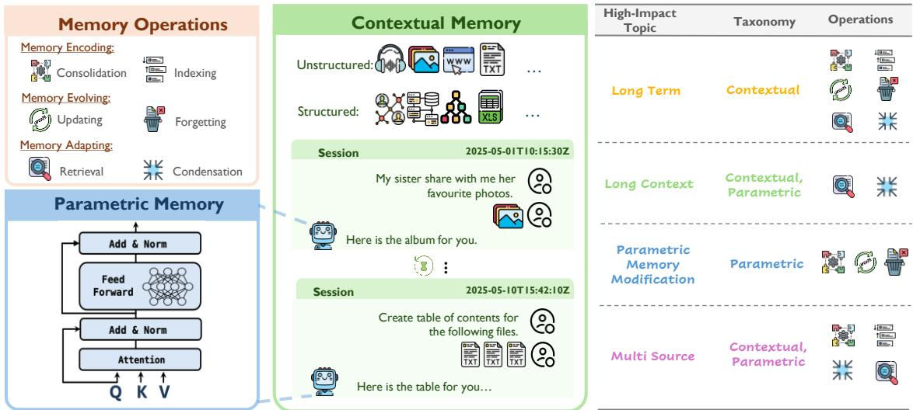  
Fig. 1. A unified framework of memory: Taxonomy, Core Operations, and Applications in LLM-based agents.

## 2.1 Memory Representation

From the perspective of memory representation, we divide memory into Parametric Memory and Contextual Memory, where the latter comprises both Unstructured and Structured forms.

Parametric Memory refers to the knowledge implicitly stored within model internal parameters [21, 233, 289]. Acquired during pretraining or post-training, this memory is embedded in the model’s weights and accessed through feedforward computation at inference. It serves as a form of long-term and persistent memory enabling fast, context-free retrieval of factual and commonsense knowledge. However, it lacks transparency and is dificult to update selectively in response to new experiences or task-specific contexts.

Contextual Memory denotes explicit, external information that complements model parameters and is categorized into unstructured and structured forms. Contextual Unstructured Memory refers to an explicit and dynamically evolving memory system that stores, retrieves, and updates situational information in unstructured formats such as tex [375], images [281], audio [189] , videos [305, 352] or embeddings, derived from users, systems, and environments. It captures temporal [78], emotional [340], procedural [71], and semantic aspects of context without predefined schemas, enabling adaptive reasoning and continuity across interactions. The short-term form of Contextual Unstructured Memory includes concatenated prompts and Key–Value (KV) cache [336], which retains token-level representations during inference to maintain local coherence and eficient context reuse. In contrast, its long-term form extends to memory bufers [226], retrieval databases [295], or episodic storage [103] that store and refine contextual signals over time to support personalization and lifelong learning [153]. Meanwhile, Contextual Structured Memory denotes an explicit memory organized into predefined, interpretable formats or schemata, such as knowledge graphs [221, 308], relational tables [190], experiences [225] or ontologies [235], which remain easily queryable. These structures support symbolic reasoning and precise querying, often complementing the associative capabilities of pretrained language models (PLMs). While usually used as long-term memory, structured memory can be short-term, constructed at inference for local reasoning, or long-term, storing curated knowledge across sessions.

## 2.2 Memory Timescale

Besides the representation, the timescale serves as another critical dimension. Drawing on the temporal persistence of information, memory is typically categorized into long-term and short-term memory.

Long-term Memory refers to a cognitive system with virtually unlimited capacity for storing information over extended periods of time, ranging from hours to an entire lifetime [261]. In LLM agents, it refers to the ability to store, manage, and utilize information persistently across extended interactions with extended environment. This capability is essential for enabling continuity, personalization, and knowledge grounding in real-world applications such as multi-session agents [78], retrieval-augmented generation (RAG) [234], personalized assistants [65, 375], and long-term planning agents [329]. It encompasses both contextual memory (such as dialogue histories [103] and user-specific preferences [202, 358] and parametric memory (knowledge encoded within model parameters [23]). Meanwhile, it is closely aligned with functional perspectives, including semantic [295], episodic [183, 307], procedural [71] memory, which will be introduced in the following sections.

Short-term Memory refers to the temporary storage of information for immediate use [192]. In LLM-based agents, it typically denotes the KV cache [336] or current context window [226], which holds task-relevant information to support real-time reasoning and decision-making. Similar to human cognition, this short-term memory can be consolidated into long-term memory through processes such as summarization [190] and storage in external databases or model parameters. In practice, short-term memory is especially critical in long-context scenarios, where it helps mitigate hallucinations, address the “lost in the middle” problem [180] in ultra-long contexts [350], reduce error accumulation in multi-turn interactions [381], and enhance the reliability of multi-turn tool usage [192].

## 2.3 Memory Functional Type

Beyond temporal persistence, memory can also be characterized by its functional roles in supporting agentic intelligence. Drawing on cognitive science, we further distinguish memory into episodic, semantic, procedural, and working memory.

Episodic memory, a core type of long-term memory originating from cognitive psychology [279], refers to the storage of past experiences linked to temporal cues, events, dialogue histories, and spatial contexts, and it dynamically evolves as the environment changes. It is widely regarded as a form of long-term memory [74] and, in modern agent systems, often functions as an external memory module [232] that complements parametric knowledge. Recent work on agents [207] increasingly explores how to update episodic memories [47, 155], perform temporal reasoning [78], and retrieve and utilize relevant experiences [207] to enhance adaptability and decision-making in dynamic environments [333].

Semantic memory another fundamental form of long-term memory, refers to memory for facts concepts about the world [279]. In computational systems, it is often formalized into explicit, queryable structures such as knowledge graphs [239], relational tables [102], or implicit model parameters [226]. Within model parameters, semantic knowledge is encoded in distributed representations that capture general world facts and concepts learned during pretraining. In contrast to context-dependent episodic memory, semantic memory is relatively stable, generalizable, and abstracted from cumulative experiences. While in LLM, the boundary between semantic and episodic memory is often blurred, a parametric representations may intertwine factual knowledge with contextual associations. This integration of implicit and explicit semantic memory provides the foundation for memory-augmented reasoning and adaptive knowledge use in modern agents [381].

Procedural memory, also categorized as a form of long-term memory, refers to memory that supports the execution of learned skills and action sequences without conscious awareness of prior experiences [71, 225, 377]. In intelligent agents, procedural memory is typically formed in two ways: stored explicitly in external skill repositories for reuse [377], or encoded implicitly through large-scale training [171]. Training on execution data like trajectories and CoT reasoning fosters consistent task performance, particularly in tool-augmented [192] and RL-based systems [350]. Procedura memory underpins the automation and generalization of task-oriented behaviors.

Working Memory, a functional extension of short-term memory, functions as a dynamic control mechanism that not only temporarily stores information but also actively manipulates and updates it to support ongoing cognition [239, 294]. Its primary function is to actively select and integrate information from diverse sources, such as short-term contex (e.g., dialogue history) and activated long-term memory (e.g., retrieved knowledge or parametric outputs) and transien computational bufers like the Key–Value (KV) cache [31, 255]. In practice, working memory acts as the contro layer [168] for the agent context window, dynamically assembling the necessary inputs, including retrieved reasoning experience [225], tool outputs [192], and user data [281], to support complex reasoning, planning, and goal-directed behavior.

## 2.4 Memory Operations

To enable dynamic memory beyond static storage, modern agents require operations that govern the lifecycle of information and support its efective use during interaction with the external environment. These operations can be grouped into three functional categories: Memory Encoding, Memory Evolving, and Memory Adapting.

2.4.1 Memory Encoding. Memory encoding governs how information is transformed into storable representations and linked for later retrieval. It primarily involves two complementary processes: Consolidation and Indexing. These operations naturally incorporate the temporal nature of memory, where information evolves over time.

Consolidation [258] refers to transforming � short-term experiences $\mathcal { E } [ t , t + \Delta t ] ~ = ~ ( \epsilon _ { 1 } , \epsilon _ { 2 } , . ~ . ~ . , \epsilon _ { m } )$ between � and $t + \Delta _ { t }$ into persistent memory ${ \mathbf { } } _ { } { \mathbf { } } _ { } { \mathbf { } } _ { } { \mathbf { } } _ { } { \mathbf { } } _ { } { \mathbf { } } _ { } { \mathbf { } } _ { } { \mathbf { } } _ { } { \mathbf { } } _ { } { \mathbf { } } _ { } { \mathbf { } } _ { } { \mathbf { } } _ { } { \mathbf { } } _ { } { \mathbf { } } _ { } { \mathbf { } } _ { } { \mathbf { } } _ { } { \mathbf { } } _ { } { } \mathbf { } _ { } { } _ { } { \mathbf { } } _ { } { } \mathbf { } _ { } { } _ { } { } \mathbf { } _ { } { } _ { } { } \mathbf { } _ { } { } _ { } { } \mathbf { } _ { } { } _ { } { } \mathbf { } _ { } { } _ { } { } \mathbf { } _ { } { } _ { } { } \mathbf { } _ { } { } _ { } { } \mathbf { } _ { } { } _ { } { } \mathbf { } _ { } { } _ { } { } \mathbf { } _ { } { } _ { } { } \mathbf { } _ { }  _ { }$ . It encodes interaction histories (e.g., dialogs, trajectories) into durable forms such as model parameters [301], graphs [372], or knowledge bases [190]. It is essential for continual learning [73], personalization [358], external Memory Bank construction [375], and knowledge graph construction [331].

$$
\mathcal {M} _ {t + \Delta_ {t}} = \mathrm{Consolidate} (\mathcal {M} _ {t}, \mathcal {E} _ {[ t, t + \Delta_ {t} ]})\tag{1}
$$

Indexing [195] constructs auxiliary codes $\phi$ such as entities, attributes, or content-based representations [314] that serve as access points to stored memory. Beyond access, indexing encodes temporal [196] and relational structures [200] across memories, enabling eficient and coherent retrieval through traversable index paths. It further supports scalable retrieval across symbolic, neural, and hybrid memory systems.

$$
\mathcal {I} _ {t} = \operatorname{Index} (\mathcal {M} _ {t}, \phi)\tag{2}
$$

2.4.2 Memory Evolving. Memory evolving describes how stored information dynamically changes over time through two complementary processes: memory updating and memory forgetting.

Updating [136] reactivates existing memory representations in $\boldsymbol { \mathcal { M } } _ { t }$ and temporarily modify them with new knowledge $\mathcal { K } _ { t + \Delta _ { t } }$ . Updating parametric memory typically involves a locate-and-edit mechanism [70] that targets specific model components. Meanwhile, contextual memory updating involves summarization [375], pruning, or refinement [13] to reorganize or replace outdated content. Those updating operations support continual adaptation while maintaining

Rethinking Memory in LLM based Agents: Representations, Operations, and Emerging Topics

memory consistency.

$$
\mathcal {M} _ {t + \Delta_ {t}} = \mathrm{Update} (\mathcal {M} _ {t}, \mathcal {K} _ {t + \Delta_ {t}})\tag{3}
$$

Forgetting [49, 285] is the ability to selectively suppress memory content $\mathcal { F }$ from ${ \mathbf { } } _ { } { \mathbf { } } _ { } { \mathbf { } } _ { } { \mathbf { } } _ { } { \mathbf { } } _ { } { \mathbf { } } _ { } { \mathbf { } } _ { } { \mathbf { } } _ { } { \mathbf { } } _ { } { \mathbf { } } _ { } { \mathbf { } } _ { } { \mathbf { } } _ { } { \mathbf { } } _ { } { \mathbf { } } _ { } { \mathbf { } } _ { } { \mathbf { } } _ { } { } \mathbf { } _ { } { } _ { } { \mathbf { } } _ { } { } \mathbf { } _ { } { } _ { } { } \mathbf { } _ { } { } _ { } { } \mathbf { } _ { } { } _ { } { } \mathbf { } _ { } { } _ { } { } \mathbf { } _ { } { } _ { } { } \mathbf { } _ { } { } _ { } { } \mathbf { } _ { } { } _ { } { } \mathbf { } _ { } { } _ { } { } \mathbf { } _ { } { } _ { } { } \mathbf { } _ { } { } _ { } { } \mathbf { } _ { } { } _ { } { } \mathbf { } _ { }  _ { }$ that may be outdated, irrelevant, or harmful. In parametric memory, it is commonly implemented through unlearning techniques [119, 157] that modify model parameters to erase specific knowledge. In contextual memory, forgetting involves time-based deletion [375] or semantic filtering [296] to discard content that is no longer relevant. These operations help maintain memory eficiency and reduce interference.

$$
\mathcal {M} _ {t + \Delta_ {t}} = \operatorname{Forget} (\mathcal {M} _ {t}, \mathcal {F})\tag{4}
$$

However, these operations introduce inherent risks and limitations. Attackers can exploit vulnerabilities to alter or poison memory contents. Once corrupted, memory fragments may persist undetected and later trigger malicious actions. As discussed in Section $^ { 6 , }$ such threats call for robust approaches that address not only the memory operations but also the entire memory lifecycle.

2.4.3 Memory Adapting. Memory adapting refers to how stored memory is retrieved and used during inference, encompassing two operations: retrieval and compression.

Retrieval is the process of identifying and accessing relevant information from memory in response to inputs, aiming to support downstream tasks such as response generation, visual grounding, or intent prediction. Inputs Q can range from a simple query [65] to a complex multi-turn dialogue context [281], and from purely textual inputs to visual content [378] or even more modalities. Memory fragments are typically scored with a function sim() with those above a threshold � deemed relevant. Retrieval targets include memory from multiple sources [268], modalities [281], or even parametric representations [193] within models.

$$
\begin{array}{c} \text { Retrieve } (\mathcal {M} _ {t}, Q) = m _ {Q} \in \mathcal {M} _ {t} \\ \text { with   } \text { sim } (Q, m _ {Q}) \geq \tau \end{array}\tag{5}
$$

Condensation enables eficient context usage under limited context window by retaining salient information and discarding redundancies with a compression ratio � before feeding it into models. It can be broadly divided into pre-input compression and post-retrieval compression. Pre-input compression applies in long-context models without retrieval, where full-context inputs are scored, filtered, or summarized to fit within context constraints [41, 351]. Post-retrieval compression operates after memory access, reducing retrieved content either through contextual compression before model inference [325] or through parametric compression by integrating retrieved knowledge into model parameters [244]. Unlike memory consolidation, which summarizes information during memory construction [375], compression focuses on reducing memory at inference [149].

$$
\mathcal {M} _ {t} ^ {c o m p} = \operatorname{Compress} (\mathcal {M} _ {t}, \alpha)\tag{6}
$$

## 3 From Operations to Key Research Topics

This section analyzes how real-world systems manage and utilize memory through core operations. We examine four key research topics introduced in Section 1, guided by the framework in Figure 1, using the Relative Citation Index (RCI)—a time-adjusted metric that normalizes citation counts by publication age to highlight influential work.

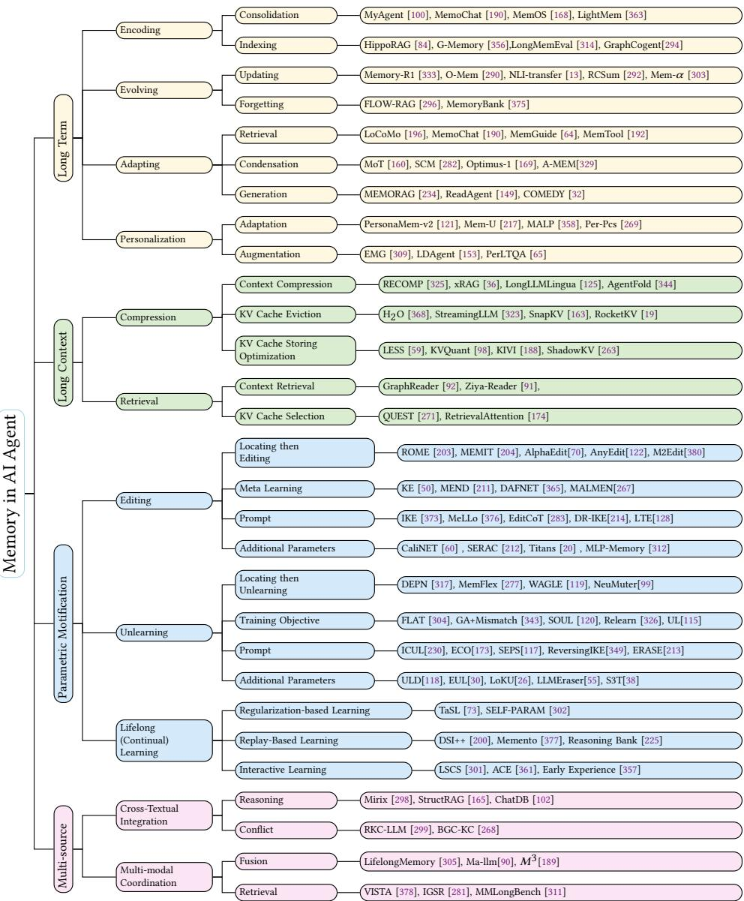  
Fig. 2. Operation-driven key research topics in AI agents, mapping core memory operations to four key research topics

RCI surfaces emerging trends and enduring contributions across memory research. Figure 2 shows the architectural landscape of these topics.

## 3.1 Long-term Memory

Long-term memory, as a research topic, examines how agents preserve and leverage information across extended interactions to achieve continuity, personalization, and cumulative learning. In this section, we discuss contextual long-term memory as a functional system that integrates both structured and unstructured forms, highlighting its core operations of encoding, evolving, and adapting in supporting complex reasoning and temporal coherence.

3.1.1 Memory Encoding. Memory Encoding is the foundational process of transforming raw inputs —such as dialogue histories or agent observations—into durable representations suitable for long-term storage. This process is realized through two critical and complementary operations: Memory Consolidation and Memory Indexing.

Memory Consolidation plays a central role in shaping long-term memory by stabilizing short-term context into enduring representations. In LLM-based agents, consolidation unfolds across multiple levels: (1) dialogue summarization or structuring converts interaction histories into retrievable traces [100, 190, 293, 375]; (2) reasoning experience consolidation encodes successful tool-use trajectories and problem-solving strategies [71, 225]; (3) parametric consolidation embeds stable knowledge directly into model parameters through methods such as continual pretraining [126], supervised finetuning [39], or reinforcement learning [303, 333]; (4) event-level consolidation organizes episodic information into structured event graphs [372]; (5) knowledge-level consolidation populates knowledge graphs with factual triples for symbolic reasoning [239]. Collectively, these processes extend the agent’s temporal memory horizon, enabling the persistent retention of contextual, episodic, and semantic memory across extended interaction with the external environment. Nevertheless, robust long-term consolidation remains challenging-requiring the balance between stability and adaptability, mitigating context loss from over-compression, and preserving relevance under continuous updates [361]. This highlights the critical need for dynamic consolidation strategies within complex, evolving memory systems.

Memory Indexing provides the foundational structure for long-term memory, transforming vast collections of experiences into a searchable repository that enables eficient and accurate retrieval. Recent work categorizes memory indexing into three paradigms: graph-based indexing, exemplified by HippoRAG [84], constructs lightweight knowledge graphs to explicitly map the relational structure between memory fragments; signal-enhanced indexing, where systems like LongMemEval [314] enrich memory keys with metadata such as timestamps or summaries to refine retrieval accuracy; and timeline-based indexing, as demonstrated in Theanine [222], which organizes memories along temporal and causal chains to enable chronologically-informed retrieval. These strategies highlight the need to integrate structure, retrieval signals, and temporal dynamics for efective long-term memory management. These paradigms signal a shift from simple semantic similarity to a crucial synthesis of relational structure, metadata signals, and temporal dynamics, enabling the development of scalable and contextually aware memory systems.

3.1.2 Memory Evolving. Memory Evolving involves operations such as forgetting and updating. Here, memory is dynamically refined through the incorporation of new knowledge, the correction of outdated or erroneous content, and the selective removal of low-value information. These processes ensure that the memory remains accurate, eficient, and contextually relevant, enabling agents to adapt to evolving tasks and environments.

Memory Updating is the dynamic process of maintaining the internal consistency and accuracy of long-term memory by continually creating new representations [32], integrating them with existing knowledge, and pruning outdated or irrelevant information [13]. Recent research are broadly categorized as either intrinsic or extrinsic. Intrinsic Updating operates through self-contained processes to refine its knowledge base: selective editing [13] improves memory by selectively deleting outdated information; recursive summarization [292] compresses dialogue histories through iterative summarization; memory blending merges past and present representations to form evolved insights [139]; and self-reflective evolving enhances factual consistency by verifying memories against retrieved evidence [262]. Extrinsic Updating relies on external signals, such as incorporating direct user corrections into memory to enable

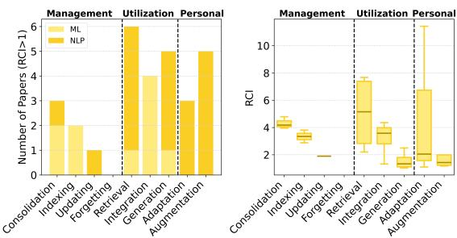  
Fig. 3. Publication statistic of highlighted papers (RCI > 1) discussed in long-term memory.

Memory Forgeting involves the removal of previously consolidated long-term memory representations. Distinct from the passive decay studied in cognitive psychology, forgetting in LLM agents is an active, targeted "unlearning" of consolidated information, driven by the need to expunge sensitive, harmful, or private content to meet external constraints [32, 212]. Consequently, developing robust unlearning capabilities for safety, privacy, and compliance has become a critical research focus [69, 118, 157, 185, 187]. The foremost challenge is to achieve precise and complete removal of targeted data without causing collateral damage to the integrity and performance of the remaining valid knowledge.

continual system improvement [45]. Ultimately, the success of any memory update hinges on its ability to integrate new information without corrupting critical prior knowledge or violating the factual and stylistic consistency.

3.1.3 Memory Adapting. Memory adapting focuses on retrieving and condensing relevant information from stored long-term memory to support reasoning, decision-making, and generation. It bridges the gap between the vast, passive repository of stored knowledge and the immediate context required for efective reasoning and generation. Memory Retrieval selects relevant information, while Memory Condensation transforms that information into a structured, compact context for the model to use. The ultimate success of these operations is measured by their ability to suppor the final stage of Memory Grounded Generation.

Memory Retrieval focuses on selecting the most relevant memory entries for a given query. Retrieval methods can be categorized into three primary paradigms: (1) query-centered retrieval, which refines the query itself for better search accuracy, as seen in FLARE [129] and IterCQR [116]; (2) memory-centered retrieval, which improves the organization and ranking of stored information through enhanced indexing [314] or reranking [65]; and (3) event-centered retrieval, which leverages temporal and causal structures for context-aware selection, as explored in LoCoMo [196] and MSC [327]. While techniques like multi-hop graph traversal further enrich this process [84], the core challenge remains in developing adaptive retrieval strategies that can dynamically adjust to the evolving structure and relevance of the memory store itself.

Memory Condensation is the inference-time process of transforming raw, retrieved long-term memories into a structured and compact context for the LLM. Integration may span multiple memory sources (e.g., long-term dialogue histories, external knowledge bases) and modalities (e.g., text, images, or videos), enabling richer and contextually grounded generation. Recent eforts on memory integration can be broadly categorized into two strategies. Static contextual integration approaches, such as EWE [31] and Optimus-1 [169], focus on retrieving and combining static memory entries at inference time to enrich context and improve reasoning consistency. In contrast, dynamic memory evolving approaches, exemplified by A-MEM [100], Synapse [374], R2I [247], and SCM [282], emphasize enabling memory to grow, adapt, and restructure over the course of interactions, either through dynamic linking or controlled memory updates. While static integration strengthens immediate contextual grounding, recent work has transformed condensation into a more agentic paradigm, Agentic Context Engineering (ACE) [361], in which an autonomous agen proactively refines, prioritizes, and restructures retrieved contexts to maximize reasoning eficiency. This agent-driven evolution of memory condensation represents a crucial step toward building adaptive, self-improving, and lifelong learning agents.

Memory Grounded Generation can be broadly categorized into three types based on how memory influences generation. Self-Reflective Reasoning uses memory of prior thinking processes to guide guide intermediate reasoning steps, such as MoT [160] and StructRAG [165]. Feedback-Guided Correctionleverages knowledge of past errors or user feedback to constrain decoding and prevent their repetition [234, 270]; Contextually-Aligned Long-Term Generation integrates summaries of distant history to maintain coherence throughout long dialogues or documents [32, 190]. The primary challenge across all these methods is mitigating the impact of noise or inaccuracies from the earlier retrieval operations, ensuring the final output is both reliable and factually grounded.

3.1.4 Personalization. Personalization is key but challenging for long-term memory, limited by data sparsity, privacy, and changing user preferences. Current methods can be broadly categorized into two lines: model-level adaptation and external memory augmentation.

Model-Level Adaptation encodes user preferences into model parameters via fine-tuning or lightweight updates. One strategy involves embedding user traits into a latent space, where methods like CLV use contrastive learning to cluster persona representations that guide generation [272]. A more prevalent strategy employs parameter-eficient techniques; for instance, RECAP injects user histories via a prefix encoder [182], while Per-Pes assembles modular adapters that reflect user behaviors [269]. In specialized domains, MaLP [358] introduces a dual-process memory for modeling short- and long-term personalization in medical dialogues. The central challenge for this paradigm is managing the personalization-generalization trade-of: efectively specializing the model to an individual without compromising its broad, pre-trained capabilities.

External Memory Augmentation personalizes responses by retrieving user-specific information from an external repository at inference time. This approach varies by memory format: structured memories like user profiles or knowledge graphs are used to create personalized prompts in LaMP [246]; unstructured memories, such as dialogue histories, provide rich contextual data for alignment in systems like LAPDOG [105]; and hybrid systems like SiliconFriend [375] maintain persistent, cross-session memory stores. While these approaches scale well, they often treat long-term memory as a passive bufer, leaving its potential for proactive planning and decision-making largely untapped

3.1.5 Discussion. Long-term memory evaluation remains constrained by static assumptions. Current benchmarks mainly follow two paradigms: knowledge-based question answering (QA) and multi-turn dialogue. QA tasks test a model’s ability to retrieve and reason over factual knowledge, leveraging both parametric memory [21, 51, 336] and unstructured contextual memory [132, 245]. Techniques like self-evolution alignment [364] and salient memory distillation [147, 190] enhance factual grounding. However, these benchmarks often assume static memory and overlook dynamic operations such as updating, selective retention, and temporal continuity [196, 314]. In contrast, multi-turn dialogue benchmarks (e.g., LoCoMo [196], LongMemEval [314]) better capture real-world memory use by spanning 20–30 turns and enabling analyses of cross-session retrieval, updating, and event reasoning. Yet most still treat dialogue history as static context, focusing narrowly on QA accuracy while neglecting operations like indexing, consolidation, forgetting, and user adaptation. This static lens limits understanding of how memory evolves over time, especially in interactive settings requiring temporal adaptation. Recent work has begun addressing these challenges through agent-based systems [329] that integrate long-term memory into multi-turn planning and generation.

Mismatch between memory retrieval and memory-grounded generation reveals context engineering bottlenecks. We analyze retrieval–generation performance gaps reported in recent studies [84, 196, 314, 375]. As shown in Figure 4, state-of-the-art models achieve Recall@5 above 90 on 2Wiki and MemoryBank [84, 375], yet generation metrics (e.g.,

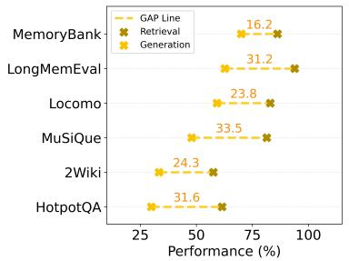  
(a) Benchmark

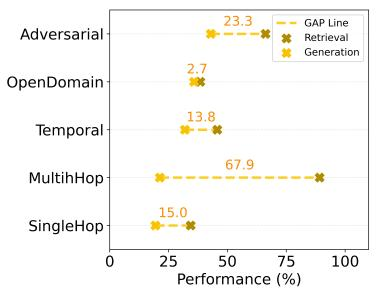  
(b) Task on LoCoMo

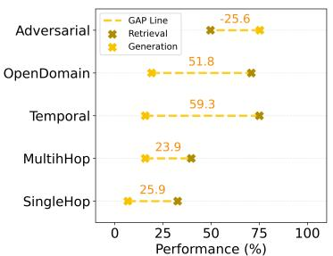  
(c) Task on MemInsight

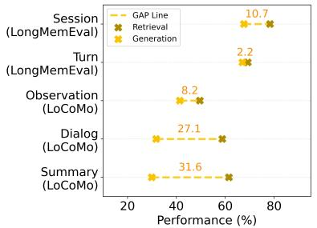  
(d) Format

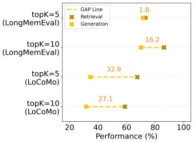  
(e) TopK

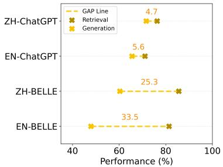  
(f) Language & Model  
Fig. 4. Benchmark for evaluating long-term memory. $^ { * } M 0 ^ { * }$ denotes modality. “Ops” denotes operability. “DS Type” indicates datase type (QA – question answering, MS – multi-session dialogue). “Per” and “TR” indicate whether persona and temporal reasoning are present.

F1) lag by over 30 points. This indicates that high retrievability does not guarantee efective generation. Several factors contribute: compact memory formats (e.g., dialogue turns or task-level observations) better support generation than verbose entries; longer temporal distance between memory and query, as in MemInsight on LoCoMo [245], degrades generation even with accurate retrieval, highlighting temporal reasoning as a key bottleneck in memory-grounded generation. Recent eforts such as TREMU [78] attempt to address this via chain-of-thought supervision, yet empirica gains remain limited, further suggesting that long-horizon agents will increasingly encounter this constraint; retrieving more items introduces noise that impairs decoding; and multilingual settings reveal a persistent language gap, with English outperforming Chinese. These findings show that while current systems retrieve relevant memories, they remain limited in structuring and leveraging them for downstream generation.

Memory operations remain under-evaluated in current benchmarks. Despite growing interest in memory-augmented models, current evaluations primarily focus on retrieval accuracy (e.g., Recall@k, Hit@k, NDCG) and post-retrieva generation quality (e.g., F1, BLEU, ROUGE-L), as seen in LoCoMo and LongMemEval. While some studies incorporate human assessments of memorability, coherence, and correctness, these eforts largely overlook procedural aspects of memory use—such as consolidation, updating, forgetting, and selective retention. Some recent eforts, such as MemoryBank and ChMapData-test [313], begin to address aspects of memory updating and long-term planning, but remain isolated and narrow in scope. There remains a pressing need for comprehensive benchmarks that span parametric, contextual unstructured, and structured memory, along with dynamic evaluation protocols that assess memory reliability, temporal reasoning, and multi-session dialogue consistency beyond static QA accuracy.

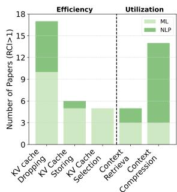

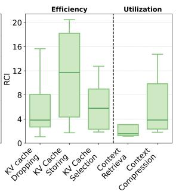  
Fig. 5. Publication statistic of highlighted papers (RCI > 1) discussed in long-term memory.

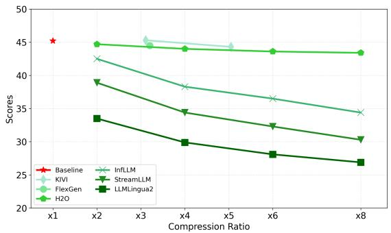  
Fig. 6. Compression based method performance vs. compression rate on LongBench [15]. Data borrowed from Yuan et al. [353].

Publication Trend. As shown in Figure 3, retrieval and generation dominate recent literature, especially in NLP. Core operations like consolidation and indexing receive more attention in ML, while forgetting remains underexplored. Personalization is largely limited to NLP due to practical application needs. In terms of citation impact, consolidation, retrieval, and integration play key roles—driven by advances in memory-aware fine-tuning, summarization, retrievalaugmented generation, and prompt fusion.

Shift evaluation from isolated memory operations toward systematic assessment of memory encoding, evolving, and adapting.

Efective methods for long-horizon temporal reasoning beyond dialogue are still lacking.

Addressing the retrieval–generation disconnect requires context engineering strategies that prioritize concise, reliable memory condensation.

Advance personalized agents by moving beyond memory storage toward adaptive reuse and personalization of session-spanning memories.

## 3.2 Long-context Memory

Managing vast quantities of multi-sourced external memory (short-term memory) in conversational search presents significant challenges in long-context language understanding. While advancements in model design and long-context training have enabled LLMs to process millions of input tokens [56, 58], efectively managing memory within such extensive contexts remains a complex issue. These challenges can be broadly categorized into two main aspects with respect to memory operations: 1) Memory Compression, which focuses on compressing the short-term memory of the context tokens or KV cache to enable eficient long context decoding and Memory Retrieval optimizes the selection of contextual memory for efective long context processing. In this section, we systematically review eforts made in handling these challenges.

3.2.1 Memory Compression. To manage extensive amounts of multi-sourced external memory, LLMs must be optimized to eficiently process lengthy contexts. In this section, we discuss approaches for eficiently processing long-context short-term memory, which focuses on memory compression. Specifically, we discuss both memory operations of context tokens (e.g., documents, dialogue histories), and memory operations of KV cache (i.e., working memory).

Context Compression utilizes memory compression operations to optimize contextual memory utilization, which generally involves two major approaches: soft prompt compression and hard prompt compression [167]. Soft prompt compression focuses on compressing chunks of input tokens into the continuous vectors in the inference stage (e.g., AutoCompressors [37], xRAG [36], CEPE [345]), or encoding task-specific long context (e.g., database schema) to parametric memory of finetuned models in the training stage (e.g., YORO [142]), to reduce the input sequence length.

While hard prompt compression directly compresses long input chunks into shorter natural language chunks. Eviction based methods selectively prune uninformative tokens (e.g., Selective Context [162], Adaptively Sparse Attention [7], HOMER [257]) or chunks (e.g., Semantic Compression [72]) from the context to shorten the input. Summarization based methods (e.g., RECOMP [325], CompAct [347], Nano-Capsulator [40], LLMLingua series [124, 125, 227]) in contrast compress long inputs by abstracting the key information. Hybrid methods (e.g., TCRA-LLM [176]) combine the features of evicting uninformative tokens and abstracting context chunks to empower context compression. With both sof prompts and hard prompts, LLMs are allowed to more efectively utilize the context via memory compression.

Beyond static compression, RL-based Active Management has recently emerged, treating context utilization as a dynamic decision-making process. Methods such as AgentFold [344] and FoldGRPO [264] utilize Reinforcement Learning from Verifiable Rewards (RLVR) to train LLM agents to actively manage and compress long-context information during task execution. Unlike traditional summarization or pruning, these approaches allow the agent to learn an optimal policy for memory retention by optimizing against task-specific rewards. By transitioning from static soft and hard compression to RL-driven active management, LLMs can move beyond simple token reduction toward task-aware memory optimization for long-context memory processing

KV Cache Eviction. In long-context processing, KV cache (working memory) aims to minimize unnecessary keyvalue computations by storing past key-value pairs as external parametric memory. However, as context length increases, the memory requirement for storing these memory grows quadratically, making it infeasible for handling extremely long contexts. KV Cache Eviction aims to reduce cache size by eliminating unnecessary KV cache. Static eviction approaches select unnecessary cache with fixed pattern. For instance, StreamingLLM [323] and LM-Infinite [86] use an Λ-shaped sparse pattern, LCKV [315] only retain the KV cache from top layer, while LaCache [251] use a ladder-shaped eviction pattern to retain long-range dependency. In contrast, dynamic eviction approaches are more flexible, which decide the KV cache to be eliminated with respect to the query (e.g., H2O [368], FastGen [77], Keyformer [2], Radar [88], NACL [35]), or the model behavior (attention weight) during inference (e.g., SnapKV [163], HeadKV [76], Scissorhands [184], PyramidInfer [334], $\mathrm { L } _ { 2 }$ Norm [53], SirLLM [342], D-LLM [127], CateKV [123], RocketKV [19]). Considering the risk of potential information loss when discarding KV cache, merging based approaches (e.g., MiniCache [172], InfiniPot [138], CHAI [3]) merge similar KV cache or storing KV cache with special tokens (Activation Beacon [360]) instead of directly discarding to reduce information loss.

KV Cache Storing Optimization. In another way of conducting compressing KV cache, KV Cache Storing Optimization considers the potential information loss when removing less important elements, and focus on how to preserve the entire KV cache at a smaller footprint. For instance, LESS [59], Eigen [249] and ShadowKV [263] compress KV cache entries into low-rank representations, while FlexGen [250], Atom [371], KVQuant [98], ZipCache [93], KIVI [188] dynamically quantize KV cache to reduce memory allocation. More recently, dynamic methods (e.g., Kelle [322]) propose software-hardware co-design solution to reduce the cost of storing KV cache. These approaches provide less performance drop compared with KV cache eviction methods but remain limited due to the quadratic nature of the growing memory. Future works should continue focusing on the trade-of between less memory cost and less performance drop.

3.2.2 Memory Retrieval. Apart from compressing contextual memory to reduce the load for processing long context, optimizing memory retrieval from long-context raises another important challenge, for efectively identity key information from the noisy context. Considering the type of contextual memory, these eforts can be summarized as contextual retrieval and KV cache selection.

Context Retrieval aims to enhance LLM’s ability in identifying and locating key information from the contextual memory. Graph-based approaches such as CGSN [219] and GraphReader [158] decompose documents into graph structures for efective context selection. Token-level context selection approaches (e.g., TRAMS [351], Selection-p [41], PASTA [362]) pruning and (or) selecting tokens deemed most important. In contrast, methods such as NBCE [259], FragRel [354], and Sparse RAG [382] perform context selection at the fragment level, choosing the relevant context fragments based on their importance to the specific task. Furthermore, training-based approaches as Ziya-Reader [91] and FILM [6] train LLMs with specialized data to help improve their context selection ability. Other methods like MemGPT [226], Neurocache [244] and AWESOME [24] preserve an external vector memory cache to efectively store and retrieve first encode external memory into vector space, and this external vector memory can be efectively updated or retrieved to enable long-term memory utilization. Together with these methods, LLMs are allowed to better identify key information in the context via memory retrieval.

KV Cache Selection selectively loads essential KV caches to accelerate inference, focusing on eficient memory retrieval. QUEST [271], TokenSelect [316], and Selective Attention [151] apply query-aware KV cache selection to identify critical caches for faster inference. Similarly, RetrievalAttention [174] employs Approximate Nearest Neighbor (ANN) search to locate important caches. By storing KV caches externally and retrieving them during inference, Memorizing Transformers [318], LongLLaMA [280], ReKV [54], and ArkVale [33] eficiently process long contexts. These methods provide flexibility by avoiding KV cache eviction and integrating with storage optimization techniques (e.g., Tang et al. [271] shows QUEST is compatible with Atom [371]).

## 3.2.3 Discussion.

Lost in the Context. Despite claims that context length can extend to millions of tokens, long-context LLMs have been found to miss crucial information in the middle of the context during tasks such as question answering and key-value retrieval [179, 241]. This “lost in the middle” issue is especially critical when managing vast amounts of external memory, as essential information may be located at various positions within the long context. Such limitations also extend to the multimodal contexts; as demonstrated in MMLongBench [311], Long-Context Vision Language Models (LCVLMs) exhibit a similar “lost-in-the-middle” phenomenon when processing lengthy interleaved text-image documents. In addition, in more complex scenarios requiring reasoning based on contextual memory, LLMs also fail to efectively aggregate memory across diferent part of the context [106]. Furthermore, though higher recall can be obtained with larger retrieval set, irrelevant information will mislead LLMs and harm the generation quality [131, 252]. Efective contextual utilization become a key challenge in addressing these limitations, encompassing context retrieval and context compression across memory operations.

Trade-of between compression rate and performance drop. Compression, as one of the major memory operations involved in long context memory, is widely used in compressing both parametric memory (KV cache) and contextual memory (Context), to balance the eficiency (compression rate) and efectiveness (performance drop). Diferent compression-based strategies have their own pros and cons. For example, KV cache eviction methods typically achieve higher compression rates but result in greater information loss and, consequently, a more significant performance drop. Yuan et al. [353] propose an universal benchmarking on these diferent strategies, qualitatively showcase the pros and cons according to diferent strategies. As illustrated in Figure 6, generally, KV cache storage optimization methods (with ’x’ marker) achieves best trade-of between efectiveness and eficiency. In contrast, KV cache eviction methods (with ∇ marker) are more flexible, with fully customization compression rate, but less efective. In the other hand compressing the contextual memory (with Δ marker) are less efective compared with compressing the parametric memory, as evidenced by the comparatively poor performance of LLMLingua2.

Publication Trending. Figure 5 summarizes publication trends on long context. The NLP community focuses more on utilization with contextual memory, while the ML community dedicates more efort to eficiency via parametric memory. From an RCI perspective, KV cache storage optimization dominates discussions on long context topics. This dominance is not only for balancing eficiency and efectiveness, but also due to its compatibility with other long context methods. Comparing the two memory operation, retrieval methods generally get less attention. One reason for this is the overlap between context retrieval and other topics, such as long-term memory and multi-source memory, which leads to context retrieval being somewhat underestimated in Figure 5. Additionally, understanding the relationship between RAG and long-context [131, 166] is crucial for the development of memory-based LLM agent. However, impactful work on contextual utilization in complex environments is still lacking. Addressing this gap is a valuable future direction.

Balancing the trade-of between reduced memory usage and minimized performance degradation in KV cache optimization represents an exciting area for future research.

Contextual utilization with complex environment (e.g., multi-source memory) is a pivotal research direction for advancing the development of intelligent agents.

## 3.3 Parametric Memory Modification

Modifying parametric memory, which is encoded knowledge within the LLM parameters, is crucial for dynamically adapting stored memory. Methods for parametric memory modification can be broadly categorized into three types: (1) Editing is the localized modification of model parameters without requiring full model retraining; (2) Unlearning selectively removes unwanted or sensitive information; and (3) Continual Learning incrementally incorporates new knowledge while mitigating catastrophic forgetting. This section systematically reviews recent research in these categories, with detailed analyses and comparisons presented in subsequent subsections.

3.3.1 Editing. Parametric memory editing updates specific knowledge stored in the parametric memory without ful retraining. One prominent line of work involves directly modifying model weights. A dominant strategy is locatingthen-editing method [52, 70, 83, 107, 201, 203, 205], which uses attribution or tracing to find where facts are stored then modifies the identified memory directly. Another approach is meta-learning [50, 83, 159, 211, 267, 365], where an editor network learns to predict targeted weight changes for quick and robust corrections. Some methods avoid altering the original weights altogether. Prompt-based methods [373, 376] use crafted prompts like ICL to steer outputs indirectly. Additional-parameter methods [48, 60, 212, 289, 300] add external parametric memory modules to adjus behavior without touching model weights. These approaches vary in eficiency and scalability, though most focus on entity-level edits.

3.3.2 Unlearning. Parametric memory unlearning enables selective forgetting by removing specific memory while retaining unrelated memory. Recent work explores several strategies. Additional-parameter methods add component such as logit diference modules [118] or unlearning layers [30] to adjust memory without retraining the whole model. Prompt-based methods manipulate inputs [173] or use ICL [231] to externally trigger forgetting. Locatingthen-unlearning methods [119, 277, 317] first identify responsible parametric memory, then apply targeted updates or deactivations. Training objective-based methods [120, 185, 304, 343] modify the training loss functions or optimization strategies explicitly to encourage memory forgetting. These approaches aim to erase memory when given explicit forgetting targets, while preserving non-targeted knowledge and balancing eficiency and precision.

3.3.3 Continual Learning. Continual learning [287] enables long-term memory persistence by mitigating catastrophic forgetting in model parameters. Two main approaches are regularization-based and replay-based methods. Regularization constrains updates to important weights, preserving vital parametric memory; methods like TaSL [73], SELF-PARAM [302], EWC [141], and POCL [319] apply such constraints to embed knowledge without replay. In contrast, replay-based methods reinforce memory by reintroducing past samples, particularly suited to incorporating retrieved external knowledge or historical experiences during training. For example, DSI++ [200] leverages generative memory to supplement learning with pseudo queries, maintaining retrieval performance without full retraining. Beyond these paradigms, agent-based work such as LifeSpan Cognitive System (LSCS) [301] extends continual learning into an interactive setting, enabling agents to incrementally acquire and consolidate memory through real-time experience LSCS provides valuable insights into how external memory can be encoded into model parameters continually.

## 3.3.4 Discussion.

SOTA Solution Analysis. We select recent SOTA methods across diferent categories and report their performance in Figure 10 on the most widely used datasets for memory editing (CounterFact [203] and ZsRE [152]) and memory unlearning (ToFU [197]). We aim to ensure a fair comparison by using consistent base models and appropriate evaluation metrics. Specifically, for CounterFact and ZsRE, we follow Meng et al. [203], where 2,000 samples are randomly selected from the dataset for updates, with 100 samples per edit. All methods on CounterFact use GPT-J as the base model; for ZsRE, most use GPT-2, except MELO, which uses T5-small. For the ToFU benchmark, all methods use LLaMA2-7B-chat under the 10% forgetting setting. Prompt-based methods achieve strong overall performance across all benchmarks, while meta-learning methods generally underperform compared to others. We observe that the same methods tend to perform worse on ZsRE than on CounterFact. This drop is primarily due to significantly lower specificity scores on ZsRE, which in turn lowers the overall score. This highlights the challenge of achieving precise, targeted edits and suggests that improving specificity remains a promising research direction. Additionally, we find that most current SOTA methods achieve high scores on the ToFU benchmark, suggesting it may be insuficiently challenging and that new unlearning benchmarks are needed

Scaling Challenges. Figure 8 shows the maximum number of sequential edits supported by diferent methods. Except for MemoryLLM, which supports up to 650k updates, most methods only test 1,000 to 5,000 edits. We also note that research on sequential unlearning remains sparse and presents an open area for future exploration. Figure 9 illustrates the distribution of model sizes used across diferent methods. In both editing and unlearning, non-prompt-based methods are typically applied to medium or small models (≤ 20B). In contrast, prompt-based approaches are more commonly evaluated on larger models, likely due to their reliance on stronger instruction-following and in-context learning capabilities. Non-prompt methods, on the other hand, often face scalability challenges due to higher computational costs, making them dificult to apply to large models. This highlights the need to further investigate how to balance model size with editing or unlearning efectiveness and eficiency.

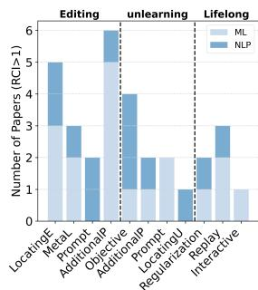

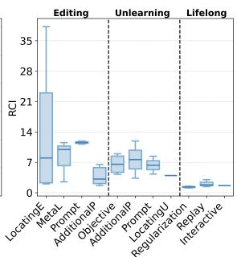  
Fig. 7. Publication statistic of highlighted papers (RCI > 1) discussed in this section.

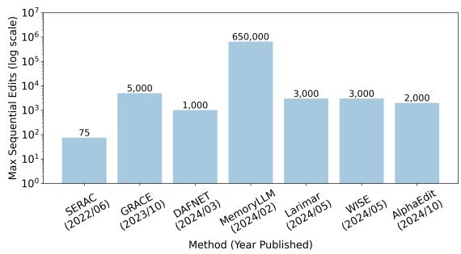  
Fig. 8. Maximum sequential edits supported by diferent model editing methods

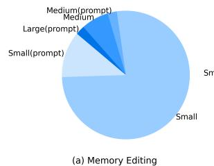

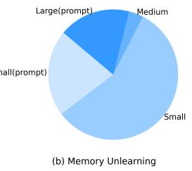  
Fig. 9. Model size distribution in memory editing and unlearning.

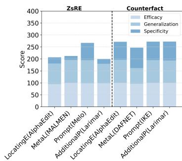

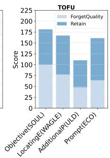  
Fig. 10. SOTA solutions across diferent categories on the CounterFact (editing), ZsRE (editing) and TOFU (unlearning) benchmark.

Publication Trending. Figure 7 presents publication statistics of papers with RCI > 1 across editing, unlearning, and lifelong learning. Editing has attracted the most attention, especially locating-then-editing and additional-paramete methods. NLP venues focus more on editing, while ML work is more evenly distributed across the three areas. Locatingthen-editing also shows the highest RCI variance, reflecting several highly influential studies. Although unlearning is less represented, it demonstrates strong potential in objective- and parameter-based categories. Lifelong learning, by contrast, remains relatively underexplored.

Current editing methods often lack specificity, while unlearning benchmarks like TOFU may be too simple to reveal real limitations.

Agents should leverage continual learning to self-evolve through sustained interaction with the environment, without overwriting stable parametric memory.

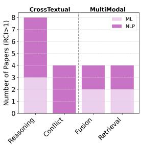

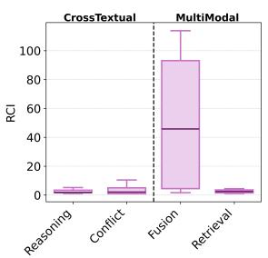  
Fig. 11. Publication statistic of highlighted papers (RCI > 1) discussed in multi-source memory.

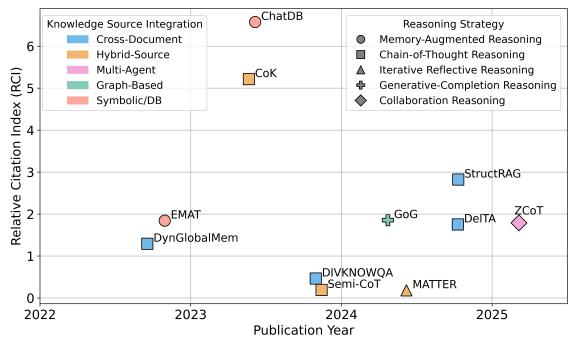  
Fig. 12. Trends in cross-textual reasoning: memory sources and reasoning strategies.

## 3.4 Multi-source Memory

Multi-source memory is essential for real-world AI deployment, where systems must reason over internal parameters and external knowledge bases spanning structured data (e.g., knowledge graphs, tables) and unstructured multi-modal content (e.g., text, audio, images, videos). This section examines key challenges across two dimensions: cross-textual integration and multi-modal coordination.

3.4.1 Cross-textual Integration. Cross-textual integration enables an AI agent to perform deeper reasoning and resolve conflicts from multiple textual sources to support more contextually grounded responses.

Reasoning focuses on integrating multi-format memory to generate factually and semantically consistent responses. One line of research investigates reasoning over memories from diferent domains, particularly through the precise manipulation of structured symbolic memories, as demonstrated by ChatDB [102] and Neurosymbolic [295]. Other works [220, 320] explore the dynamic integration of domain-specific parameterized memories to enable more flexible reasoning. Multi-source reasoning across diverse document sources has also been studied, as seen in DelTA [306] and dynamic-MT [63]. Additionally, several studies [148, 165, 331, 369] have investigated heterogeneous knowledge integration by retrieving information from both structured and unstructured sources. While these eforts have made substantial progress in combining parameterized and external memories for reasoning, achieving unified reasoning over heterogeneous, multi-source memories remains a major open challenge. In particular, more work is needed to efectively integrate parameterized memories with both structured and unstructured external knowledge sources.

Conflict in multi-source memory refers to factual or semantic inconsistencies that arise during the retrieval and reasoning over heterogeneous memory representations. These conflicts often emerge when integrating parametric and contextual memories, or combining structured and unstructured knowledge such as triples, tables, and free text [328]. Prior work has focused on identifying and localizing such inconsistencies. For example, RKC-LLM [299] proposes an evaluation framework to assess models’ ability to detect contextual contradictions, while BGC-KC [268] highlights models’ tendency to favor internal knowledge over retrieved content, motivating source attribution and trust calibration. These methods ofer important foundations for memory conflict understanding, though many remain limited to static scenarios or single-source reasoning.

3.4.2 Multi-Modal Coordination. As memory-augmented systems evolve toward multi-modal settings, a key challenge lies in fusion and retrieval over heterogeneous modalities such as text, image, audio, and video

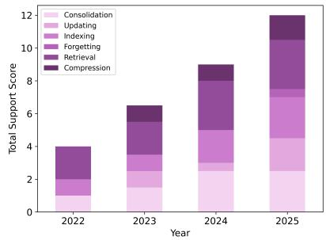  
Fig. 13. Evolution of memory operation support across Years.

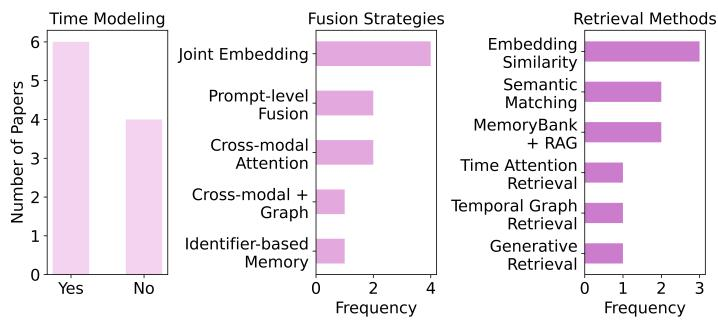  
Fig. 14. Analysis of temporal modeling, fusion strategies, and retrieval method in multi-modal coordination.

Fusion refers to aligning the retrieved information across diverse modalities. From a memory perspective, fusion serves as a key mechanism for integrating cross-modal information over time. Existing approaches can be broadly divided into two lines. The first focuses on unified semantic projection, where models such as UniTransSeR [194], MultiInstruct [332], PaLM-E [62], and NExT-Chat [355] embed heterogeneous inputs into a shared representation space for reuse and query. The second line emphasizes long-term cross-modal memory integration. For example, LifelongMemory [305] introduces a transformer with persistent memory to accumulate visual-textual knowledge across patient records. Similarly, MA-LMM [90] maintains a multimodal memory bank to extend temporal understanding in long videos. While efective at aligning modalities, current fusion methods often fall short in supporting long-term multimodal memory management. Key challenges include dynamic memory updates and maintaining consistency across heterogeneous sources.

Retrieval in multi-modal systems enables access to stored knowledge across modalities such as text, image, and video. Most existing methods rely on embedding-based similarity computation, grounded in vision-language models like QwenVL [14], CLIP [237] or other multi-modal models [164]. These models project heterogeneous inputs into a shared semantic space, allowing for cross-modal retrieval. For instance, VISTA [378] enhances retrieval via visua token representations, while UniVL-DR [186] integrates video and language through a unified dual encoder. More recently, IGSR [281] extends retrieval to multi-session conversations by introducing intent-aware sticker retrieval, yet it still remains anchored in similarity-based retrieval. The limitations of such approaches are underscored by MMLongBench [311], which reveals that even state-of-the-art Large Vision-Language Models (LVLMs) struggle with cross-modality retrieval. Consequently, these methods often lack the capacity for reasoning-driven retrieval and neglec critical modalities like audio and sensorimotor signals required for embodied interaction. To bridge these gaps, M3 [189] introduces a Multi-modal Memory Modelling framework for open-ended agents that unifies storage and reasoning across diverse data types, including audio and sensorimotor signals. By enabling dynamic updates and reasoning-driven retrieval, M3 moves beyond shallow alignment to ensure robust long-term memory management.

## 3.4.3 Discussion.

Trends in Multi-Source Memory Integration. Recent studies [256, 281] reveal a steady evolution in how multi-source memory is organized, retrieved, and reasoned over. While diverse methods have been proposed for cross-textual integration and multi-modal coordination, a closer look at representative models (Figures 12, 13, 14) highlights shared challenges and emerging trends. These developments reflect a broader shift from static retrieval pipelines toward dynamic, context-sensitive memory systems capable of supporting temporally grounded, cross-source reasoning across tasks and sessions.

Cross-textual integration involves two key design axes: source type and reasoning mechanism. Early models such as ChatDB [102] and EMAT [320] use symbolic memory (e.g., databases, tables) accessed via explicit queries, ofering transparency but limited scalability in open-domain settings. More recent systems like StructRAG [165], DelTA [306], and Chain-of-Knowledge [161] adopt unstructured memory and neural retrieval, combining attention-based fusion with chain-of-thought reasoning. Yet, most still treat memory as static, disconnected from real-time inference. Newer models such as MATTER [148], GoG [331], and ZCoT [208] move toward inference-aware memory, using retrieval-generation loops and collaborative agents to evolve memory dynamically. Despite this shift, resolving conflicts across heterogeneous sources remains a major challenge. Retrieved and parametric content are often merged without consistency checks or source attribution, leading to hallucinations and factual drift [268, 379]. Preliminary solutions such as multi-step conflict resolution [299] and epistemic calibration [328] are promising but lack scalability. Future work should pursue integrated, conflict-aware memory systems capable of dynamic reasoning under uncertainty and source ambiguity.

Multi-modal memory coordination has advanced across three key dimensions: fusion, retrieval, and temporal modeling. As shown in Figure 14, common strategies include joint embedding [90, 194, 281, 311, 378] and prompt-leve fusion [82, 305], while recent methods such as identifier-based memory [164] and cross-modal graph fusion [218] enable more selective, task-adaptive integration. Retrieval has evolved from static similarity toward temporally contextualized approaches, including temporal graphs and time-aware attention [324], facilitating reasoning over extended interactions. Notably, 60% of surveyed models encode temporal information, underscoring the importance of time in long-horizon tasks. Beyond retrieval and fusion, operational control—such as memory updating, indexing, and compression—is becoming increasingly essential. While earlier systems (2022–2023) mainly focused on retrieval, newer agents like E-Agent [80] and WorldMem [324] adopt self-maintaining architectures that continuously refine memory content over time. For example, WorldMem compresses multi-modal logs, while E-Agent dynamically updates internal memory to support long-horizon planning. These systems highlight a shift from passive memory querying to active, operationally rich architectures.

Publication Trend. As shown in Figure 11, cross-textual reasoning dominates publication volume, reflecting its foundational role in multi-source integration. Fusion research, particularly work driven by CLIP [237], demonstrates the highest citation impact and influence on multi-modal learning. In contrast, dynamic retrieval and conflict resolution remain underexplored. Together, these trends suggest a field transitioning from surface-level integration toward deeper, operation-aware, and temporally structured memory architectures.

Design conflict-aware memory mechanisms that explicitly detect, attribute, and resolve inconsistencies across evolving memories and heterogeneous representations.

Develop self-maintaining memory architectures with built-in indexing, updating, compression, and consistency checks for long-term, cross-session use.

Advance long-horizon reasoning by integrating multi-modal long-context understanding with multi-turn dialogue reasoning, a core requirement for real-world agents.

Table 1. Product Memory Design Trade-ofs. Representative products are compared to highlight recurring design choices and limitations of memory systems.

<table><tr><td>Products</td><td>Domain</td><td>Dominant Memory</td><td>Prioritized Operations</td><td>User Experience</td><td>Limitations</td></tr><tr><td>ChatGPT [223]</td><td>General</td><td>Parametric</td><td>Consolidation Retrieval Condensation</td><td>Consistency / Accuracy / General</td><td>Hallucination; limited personalization and modal memory management.</td></tr><tr><td>Replika [191]</td><td>Personal</td><td>Contextual</td><td>Updating Retrieval</td><td>Empathy / Adaptation</td><td>Privacy risks; memory drift; limited cross-session continuity; simple slot-based memory management.</td></tr><tr><td>GitHub Copilot [79]</td><td>Task-oriented</td><td>Parametric</td><td>Condensation</td><td>Efficiency / Reliability</td><td>No cross-session task continuity; no user-level personalization; no persistent long-term memory.</td></tr><tr><td>Doubao [22]</td><td>Multi-modal</td><td>Parametric</td><td>Consolidation Retrieval Condensation</td><td>General / Stylization / Low latency</td><td>Hallucination; modality gap; session-bound.</td></tr></table>

## 4 Memory In Practice

Memory augmentation agents operationalize theoretical memory concepts through an interdependent hierarchy of products, development tools, and infrastructure. Products such as assistants and copilots utilize parametric and contextua memory to support personalization and long-horizon reasoning. Development tools translate practical demands into frameworks that manage storage, retrieval, and adaptation. Infrastructure provides the computational backbone tha supports memory operations at scale. The interaction among these layers is bidirectional: product requirements drive development tool design, tools constrain infrastructural implementation, and infrastructural advances enable richer product capabilities. Understanding and bridging the gaps among them clarifies both the technical and conceptua frontiers of agent memory mechanisms.

## 4.1 Products

The agent products can be broadly categorized based on their dominant memory types and application focus. General agents like ChatGPT [223], Gemini [81], Claude [8], Grok [321], and DeepSeek [171] rely predominantly on large-scale parametric memory to encode broad cross-domain knowledge within model weights and underpin stable reasoning and factual generalization. Limited user contextual memory is layered on top to improve retrieval and situational grounding. Personal agents primarily leverage contextual memory to capture user preferences, interaction history, and afective cues, enabling personalized and adaptive responses [97, 153, 236] such as Replika [191], Character.AI [27], Me.bot, Tencent ima.copilot [276] and Doubao [22]. These agents achieve long-term personalization and socia coherence, though at the cost of privacy management and memory drift. Task-oriented agents rely on contextua memory and specific domain knowledge to execute multi-step reasoning and maintain session continuity like GitHub Copilot [79], Cursor [111], Coze [44], DeepResearcher [275], WebSearcher [275] and CodeBuddy [370]. For these agents achieving a high task success rate remains the primary consideration for user satisfaction and practical efectiveness. Multi-modal agents represent a more integrated paradigm that unifies parametric and contextual memory across language, vision, and action modalities. Representative examples such as Mobile assistants (Doubao [22], Siri [11],

Table 2. Memory Development Tools Trade-ofs. Representative development tools are compared to highlight the special design and potential limitations.

<table><tr><td>Tool</td><td>Category</td><td>Memory Type</td><td>Prioritized Operations</td><td>Key Features</td><td>Limitations</td></tr><tr><td>EasyEdit [291]</td><td>Parametric Editing</td><td>Parametric</td><td>Updating</td><td>Directly modifies LLM weights (WISE [289])</td><td>Ripple Effects: Editing facts may damage general reasoning; high computational cost.</td></tr><tr><td>Zep [239]</td><td>Temporal Memory Construction</td><td>Contextual</td><td>Consolidation, Updating</td><td>Temporal knowledge graphs; incremental summarization; robust temporal reasoning.</td><td>Controllability; Information loss</td></tr><tr><td>Mem0 [255]</td><td>Personalized Memory Layer</td><td>Contextual</td><td>Consolidation Indexing Updating</td><td>User-level personalization across sessions; hybrid search (Vector + Graph); developer-friendly API.</td><td>Lossy condensation; user-centric personalization rather than complex task or world-state memory.</td></tr><tr><td>MemOS [168]</td><td>Memory Scheduling &amp; Hierarchical Management</td><td>Contextual</td><td>Updating Retrieval</td><td>Hierarchical OS-style scheduling (Short/Long/Working) for optimized context window and memory management.</td><td>Control overhead; latency</td></tr><tr><td>Graphiti [92]</td><td>Graph Memory Construction</td><td>Contextual</td><td>Indexing Updating Retrieval</td><td>Dynamic construction of knowledge graphs from unstructured streams; semantic relationship tracking.</td><td>Strictly typed graphs can be brittle with high token consumption for graph construction.</td></tr></table>

Xiaoyi [109]) and Embodied Agent extend memory beyond text to perception and embodiment, marking a step toward general, long-horizon agents.

Although these products have partially integrated memory-related functions, their memory scope and modality difer substantially across domains. ChatGPT and Doubao support long-range and cross-session adaptation through largemodel backbones, but their memory management remains relatively simple and prone to hallucination. Their multimodal memory functions are limited to basic image-grounded retrieval rather than integrated cross-modal reasoning. Replika, as a personalization-oriented companion system, relies heavily on transparent and user-driven memory updates However, its stored content depends entirely on user input, lacking autonomous management and raising privacy concerns, while higher-level session memory remains undeveloped. In contrast, GitHub Copilot, constrained by the complexity of programming tasks, operates mainly within a short-term working memory window without persistent task-level or project-level memory coordination, and lacks personalized code adaptation. Overall, these systems remain in an early stage of memory integration, where memory operations are largely prompt-based rather than dynamically managed. This gap highlights the need for more advanced development tools to support scalable, transparent, and adaptive memory mechanisms across products and domains

## 4.2 Development Tools

Frameworks. On top of core infrastructure, frameworks ofer modular interface for memory-related operations. Examples include Graphiti [92], LlamaIndex [175], LangChain [28], LangGraph [112], EasyEdit [291], CrewAI [66], MemU [217], and Letta [226]. These frameworks abstract complex memory processes into configurable pipelines, enabling developers to construct multi-modal, persistent, and updatable memory modules that interact with LLM agents. Memory Layer Systems. These systems operationalize memory as a service layer, providing orchestration, persistence, and lifecycle management. Tools like Mem0 [255], Zep [239], Memary [140], MemOS [168] and Memobase [140] focus on maintaining temporal consistency, indexing memory by session or topic, and ensuring eficient recall. These platforms often combine symbolic and sub-symbolic memory representations and provide internal APIs for memory access and manipulation over time.

## 4.3 Infrastructure

Memory tools rely on a robust foundational infrastructure to operationalize the storage, retrieval, and evolution o memory. This infrastructure is anchored by persistent storage systems, such as graph databases like Neo4j [216] and vector stores [61], which work in tandem with retrieval mechanisms ranging from sparse BM25 [243] to dense embedding retrieval [113, 224] to ensure precise access. The execution of complex memory lifecycle operations—including dynamic updating and targeted forgetting—depends on the reasoning capabilities of LLMs [1, 171] guided by optimized prompt engineering. Crucially, to support the high throughput and scalability required by these tools, the underlying computational layer incorporates acceleration technologies such as FlashAttention [46], sequence parallelism, and eficient Key-Value (KV) cache management strategies [146], all designed to enable the efective processing of ultra-long contexts and massive interaction histories.

## 5 The Cognitive Gap between Biological and Agent Memory

Human memory is not a monolithic storage but a complex, hierarchical interaction between sensory, short-term, and long-term systems [12]. While agents aim to emulate these functions to support reasoning, their underlying mechanisms are diferent from biological cognitive architectures. As summarized in Table 3, current agentic implementations remain focused on static persistence, lacking the dynamic sophistication of biological memory in terms of encoding, evolving, and adapting.

Encoding: From Verbatim Recording to Constructive Schematization. Human encoding is inherently constructive; we do not record snapshots but restructure the past through present cognition to fit internal schemas. In contrast, agents typically perform verbatim recording (in databases) or static parameterization (in weights), leading to an accumulation of fragmented traces rather than a synthesized self-model. This reliance on "raw" data prevents agents from pruning noise at the point of entry. While current training (e.g., pre/post-training [171]) attempts internalization, it remains a discrete process that fails to bridge the gap between static "knowing that" and the adaptive cognitive structures required to filter environmental complexity.

Evolving: From Summarization to Internalization. Memory evolution in humans relies on sleep-dependent reconsolidation, where episodic traces are distilled into semantic structures of general world knowledge. This active synthesis prunes noise and extracts causal patterns to prevent overfitting to immediate reality. In contrast, agent memory evolution depends on explicit operations like summarization or hard deletion to simulate memory dynamics. While frameworks such as ACE [361] utilize summarization for short-term bufer condensation, they primarily address immediate task resolution rather than long-term cognitive growth. Conversely, although systems like G-Memory [356] construct long-term archives via hierarchical graphs, this remains a symbolic approach to evolution. These mechanisms treat memory like a static library that needs filing, whereas human memory is like a muscle. While agents can summarize a book (ephemera experience), they fail to turn that knowledge into the instinctive skill (procedural wisdom) needed to perform a task naturally. Consequently, contemporary agents remain reactive note-takers limited by artificially compressed histories, lacking the capacity for long-lifecycle evolving or the construction of a consistent self-representation.

<table><tr><td>Aspect</td><td>Human Memory</td><td>Agent Memory</td></tr><tr><td>Storage</td><td>Distributed, interconnected neural systems across brain regions</td><td>Model parameter, modular, and context-dependent</td></tr><tr><td>Ownership</td><td>Individual and private.</td><td>Shareable, replicable, and broadcastable.</td></tr><tr><td>Volume</td><td>Biologically limited</td><td>Scalable, bounded only by storage and compute limits</td></tr><tr><td>Memory Encoding</td><td>Slow, biologically driven, passive</td><td>Fast, explicit, policy-driven and selective</td></tr><tr><td>Memory Evolving</td><td>Indirect, reconsolidation-based, error-prone</td><td>Precise, programmable, supports rollback-/unlearning</td></tr><tr><td>Memory Adaption</td><td>Implicit, salience- and frequency-biased</td><td>Explicit, customizable (e.g., quantization, summarization)</td></tr></table>

Table 3. Key diferences between human and agent memory.

Adapting: From Retrieval to Meaning Construction. Human memory utilization is a process of dynamic reconstruction driven by homeostatic needs and self-consistency [12]. In contrast, current agents predominantly rely on Retrieval-Augmented Generation (RAG) and extremely long context windows. While expanding the context window provides a larger bufer, it represents a brute-force architectural scaling that bypasses the necessity of semantic internalization. Such "long-context" dependency leads to a diminishing signal-to-noise ratio and prohibitive computational costs. As evidenced by the ’lost-in-the-middle’ phenomenon [179], retrieval without inference-time reconsolidation, characterized by the active rewriting of historical traces like AgentFold [344] and FoldGRPO [264], struggles to develop a coherent causal representation. The next frontier is to move beyond passive retrieval toward active thinkers who reconstruct their internal state in real-time to adapt to environmental dynamics

Storage, Ownership and Volume. The divergence between biological and agent memory is rooted in the fundamental properties of their physical and systemic substrates, primarily manifested in storage, data ownership, and resource scalability. Regarding storage, human memory is characterized by biological holistic interconnection, enabling associative recall across the entire brain. Conversely, agents rely on heterogeneous representations—segregating data into disconnected formats like documents, graphs, and vector embeddings—which prioritizes local pattern matching over global semantic coherence. This systemic gap extends to data ownership: human memory is inherently private and individual-bounded, whereas agent memory is replicable and broadcastable, enabling collective intelligence but challenging the ethical "right to be forgotten." Finally, while the human brain achieves complex memory evolving with extreme metabolic frugality (∼20W) [17], agent memory remains constrained by the computational and environmental costs of silicon-based scaling, necessitating a shift toward bio-inspired eficiency that prioritizes semantic density over raw data volume.

## 6 Open Challenges and Future Directions

This section outlines the open challenges in core memory topics and proposes future research directions. We then explore broader perspectives, including biologically inspired models, lifelong learning, multi-agent memory, and unified memory representation, which further extend the capabilities and theoretical grounding of memory systems. Together, these discussions provide a roadmap for advancing reliable, interpretable, and adaptive memory in AI.

## 6.1 Topic-Specific Directions

Designing memory-centric AI requires addressing core limitations and emerging demands. Guided by RCI analysis and trends, we outline key challenges shaping future memory research.

Unified evaluation is needed to address consistency, personalization, and temporal reasoning in long-term memory. Existing benchmarks rarely assess core operations such as consolidation, updating, retrieval, and forgetting in dynamic, multi-session settings. This gap contributes to the retrieval–generation mismatch, where retrieved content is often outdated, irrelevant, or misaligned due to poor memory maintenance. Addressing these issues requires tempora reasoning, structure-aware generation, and retrieval robustness, along with systems supporting personalized reuse and adaptive memory management across sessions.

Long-context Processing: Eficiency vs. Expressivity. Scaling memory length exacerbates trade-ofs between computational cost and modeling fidelity. Techniques such as KV cache compression and recurrent memory reuse ofer eficiency but risk information loss or instability. Meanwhile, reasoning over complex environments, especially in multi-source or multi-modal settings, requires selective context integration, source diferentiation, and attention modulation. Bridging these demands, mechanisms that balance contextual bandwidth with task relevance and stability increasingly pointing toward the use of RL-based frameworks to learn active optimal context management and folding policies.

While promising, parametric memory modification requires further research to improve control, erasure, and scalability. Current editing methods often lack specificity, while unlearning benchmarks like TOFU may be too simple to expose real limitations. Most approaches fail to scale beyond thousands of edits or support models over 20B parameters. Lifelong learning remains underexplored despite its potential. Future work should develop more realistic benchmarks, improve eficiency, and unify editing, unlearning, and continual learning into a cohesive framework.

Multi-source Integration: Consistency, Compression, and Coordination. Modern agents rely on heterogeneous memory comprising structured knowledge, unstructured histories, and multi-modal signals but face redundancy, inconsistency, and ambiguity. These stem from misaligned temporal scopes, conflicting semantics, and missing attribution across modalities. Resolving them requires conflict resolution, temporal grounding, and provenance tracking. Eficien indexing and compression are essential for scalability and interpretability in multi-session settings.

## 6.2 Broader Perspectives

In addition to the core topics outlined above, a range of broader perspectives is emerging that further enriches the landscape of memory-centric agents.

Procedural Tool Memory and Skill Acquisition. As agents become more action-oriented, memory needs to evolve from static fact storage toward procedural tool memory, where tool use is internalized as reusable skills rather than repeatedly consulting the tool API during extended interactions. Frameworks such as ReAct [341] already hint at this shift by coupling reasoning with action trajectories, enabling agents to learn from execution feedback instead of treating tools as stateless calls. Recent infrastructure, including MCP [9] servers, further supports this evolving by framing tools as persistent services that allow for experience accumulation across interactions. Benchmarks like BFCL v4 [229] explicitly expose the need for memorizing execution traces, error-recovery strategies, and tool-chain compositions, rather than relying on ad hoc prompting. Industrial systems have begun to operationalize this idea, exemplified by Anthropic’s introduction of skills [10] in Claude, which treat tool use as a form of procedural memory that improves reliability and reduces inference cost.

Parametric Sharing: Memory as Dynamic Weights. While textual memory (e.g., RAG) provides transparency, it inevitably sufers from information loss during compression and natural language conversion. We propose Parametric Sharing, where memory is exchanged as model-native representations [21]—such as dynamic adapters or specialized memory layers—directly within the latent space [383]. This approach preserves high-dimensional semantic nuances and enhances the collective reasoning of fused systems by bypassing the "bottleneck" of explicit text. Future work should explore standardized neural memory protocols and cross-model weight alignment to enable heterogeneous agents to merge internalized experiences into a collaborative parametric intelligence.

Lifelong Learning. Future research should shift from discrete task-based learning to managing real-time environment streams [361], focusing on mitigating catastrophic forgetting while maintaining rapid adaptation [73]. Under extreme data sparsity, agents must utilize meta-learning to optimize a "memory value function," enabling the autonomous determination of "solidification value" for selective memory internalization [277]. Crucially, personalized representations must transcend the restrictive inductive bias of the base model’s pre-trained distribution, which often suppresses unique individual traits. By integrating structural [239] and unstructured memory [13] into a dynamic personalized parameter space (e.g., evolving LoRA or embeddings), agents can decouple personal traces from general knowledge. This ensures causal consistency across infinite horizons, evolving agents from task-oriented tools into longitudinal, habit-aware companions.

Memory in Multi-agent Systems. In multi-agent systems, memory is not only individual but also distributed. Agents must manage their own internal memories while interacting with and learning from others [298]. This raises unique challenges such as memory sharing, alignment, conflict resolution, and consistency across agents. Efective multiagent memory systems should support both local retention of personalized experiences and global coordination through shared memory spaces or communication protocols. Future work may explore decentralized memory architectures, cross-agent memory synchronization, and collective memory consolidation to enable collaborative planning, reasoning, and long-term coordination.

Multi-modal Memory. Multi-modal memory inherently reflects how humans perceive the real world. While advancements like M3-agent [189] and GUI-agent [97] have explored multi-modal memory processing capabilities, this field remains in its preliminary stages. Significant challenges persist in aligning multi-modal memories within a unified semantic space and enabling efective retrieval and reasoning. Specifically, current systems sufer from weak reasoning during multi-turn interactions and data misalignment, highlighting critical directions for future research.

Biological Inspirations for Memory Design. Memory in biological systems ofers key insights for building more resilient and adaptive AI memory architectures. The brain manages the stability–plasticity dilemma through complementary learning systems: the hippocampus encodes fast-changing episodic experiences, while the cortex slowly integrates stable long-term memory [144, 199]. Inspired by this, AI models increasingly adopt dual-memory architectures, synaptic consolidation, and experience replay to mitigate forgetting [242, 284]. Cognitive concepts like memory reconsolidation [67], bounded memory capacity [43], and compartmentalized knowledge [75] further inform strategies for update-aware recall, eficient storage, and context-sensitive generalization.

Meanwhile, the K-Line Theory [210] points out that hierarchical memory structures are fundamental to biological cognition. These structures enable humans to eficiently organize memory across diferent levels of abstraction, as seen in how infants group specific objects like "apple" and "banana" into broader categories like "fruit" and "food." Organizing the agent memory with hierarchy structures for scalability and eficiency raises new challenges [87, 310] and future directions [96, 308] for memory research.

Parametric Memory Retrieval. While recent knowledge editing methods [70, 289] claim they can localize and modify specific representations, enabling models to selectively retrieve knowledge from their own parameters remains an open challenge. Eficient retrieval and integration of latent memory could significantly enhance memory utilization and reduce dependence on external indexing and memory management.

Spatio-temporal Memory captures not only the structural relationships among information but also their tempora evolution, enabling agents [150] to adaptively update knowledge while preserving historical context [372]. For example the agent may record that a user once disliked broccoli but later adjusts its memory based on recent purchase patterns. By maintaining access to both historical and current states, spatio-temporal memory supports temporally informed reasoning and nuanced personalization. However, eficiently managing and reasoning over long-term spatio-tempora memory remains a key challenge

Unified Memory Representation. While parametric memory [335] provides compact and implicit knowledge storage, and external memory [375] ofers explicit and interpretable information, unifying their representational spaces and establishing joint indexing mechanisms is essential for efective memory consolidation and retrieval. Future work could focus on developing unified memory representation frameworks that support shared indexing, hybrid storage, and memory operations across modalities and knowledge forms.

Memory Threats & Safety. While memory significantly enhances the utility of LLMs by enabling up-to-date and personalized responses, its management remains a critical safety concern. Memory often stores sensitive and confidential data, making operations like adding or removing information far from trivial. Recent research has exposed serious vulnerabilities in memory handling, particularly in machine unlearning techniques designed to selectively erase data. Multiple studies [18, 187] have demonstrated that these methods are prone to malicious attacks, which strengthens the need for more secure and reliable memory operations.

## 7 Conclusions

This survey provides a comprehensive overview of agent memory, classifying it into parametric and contextual types and mapping operations to encoding, evolving, and adapting. Complemented by functional perspectives like episodic, semantic, procedural, and working memory, this framework clarifies how memory supports reasoning, personalization and collaboration. By analyzing four key topics, including long-term memory, long context memory, parametric modification, and multi-source memory, we highlight progress, challenges, and pathways for future work, while ofering practical benchmarks and tool guidance for industry.

## References

[1] Josh Achiam, Steven Adler, Sandhini Agarwal, Lama Ahmad, Ilge Akkaya, Florencia Leoni Aleman, Diogo Almeida, Janko Altenschmidt, Sam Altman, Shyamal Anadkat, et al. 2023. Gpt-4 technical report. arXiv preprint arXiv:2303.08774 (2023).

[2] Muhammad Adnan, Akhil Arunkumar, Gaurav Jain, Prashant J. Nair, Ilya Soloveychik, and Purushotham Kamath. 2024. Keyformer: KV Cache reduction through key tokens selection for Eficient Generative Inference. In Proceedings ofMachine Learning and Systems. https://proceedings. mlsys.org/paper\_files/paper/2024/file/48fecef47b19fe501d27d338b6d52582-Paper-Conference.pdf

[3] Saurabh Agarwal, Bilge Acun, and Basil et al. Hosmer. 2024. CHAI: Clustered Head Attention for Eficient LLM Inference. In ICML. https: //proceedings.mlr.press/v235/agarwal24a.html

[4] Qingyao Ai, Yichen Tang, Changyue Wang, Jianming Long, Weihang Su, and Yiqun Liu. 2025. MemoryBench: A Benchmark for Memory and Continual Learning in LLM Systems. arXiv preprint arXiv:2510.17281 (2025).

[5] Chenxin An, Shansan Gong, Ming Zhong, Xingjian Zhao, Mukai Li, Jun Zhang, Lingpeng Kong, and Xipeng Qiu. 2024. L-Eval: Instituting Standardized Evaluation for Long Context Language Models. In Proceedings ofthe 62nd Annual Meeting ofthe Association for Computational

Linguistics (Volume 1: Long Papers). doi:10.18653/v1/2024.acl-long.776

[6] Shengnan An, Zexiong Ma, Zeqi Lin, Nanning Zheng, Jian-Guang Lou, and Weizhu Chen. 2024. Make Your LLM Fully Utilize the Context. In Advances in Neural Information Processing Systems. https://proceedings.neurips.cc/paper\_files/paper/2024/file/71c3451f6cd6a4f82bb822db25cea4fd-Paper-Conference.pdf

[7] Sotiris Anagnostidis, Dario Pavllo, and Luca et al. Biggio. 2023. Dynamic Context Pruning for Eficient and Interpretable Autoregressive Transformers. In NeurIPS. https://proceedings.neurips.cc/paper\_files/paper/2023/file/cdaac2a02c4fdcae77ba083b110efcc3-Paper-Conference.pdf

[8] Anthropic. 2023. Claude: AI Thinking Partner. https://www.claude.com/. Accessed: 2025-11-01.

[9] Anthropic. 2024. Introducing the Model Context Protocol. https://www.anthropic.com/news/model-context-protocol. Model Context Protocol (MCP) Specification.

[10] Anthropic. 2025. Equipping agents for the real world with Agent Skills. https://claude.com/blog/skills. Accessed: 2025-12-21.

[11] Apple Inc. 2025. Siri: Apple’s Intelligent Voice Assistant. https://www.apple.com/siri/ Accessed: 2025-11-01.

[12] Alan Baddeley. 1988. Cognitive Psychology and Human Memory. Trends in Neurosciences 11, 4 (1988), 176–181.

[13] Sanghwan Bae, Donghyun Kwak, Soyoung Kang, Min Young Lee, Sungdong Kim, Yuin Jeong, Hyeri Kim, Sang-Woo Lee, Woomyoung Park, and Nako Sung. 2022. Keep Me Updated! Memory Management in Long-term Conversations. In Findings ofthe Association for Computational Linguistics: EMNLP 2022. doi:10.18653/v1/2022.findings-emnlp.276

[14] Jinze Bai, Shuai Bai, Shusheng Yang, Shijie Wang, Sinan Tan, Peng Wang, Junyang Lin, Chang Zhou, and Jingren Zhou. 2023. Qwen-VL: A Versatile Vision-Language Model for Understanding, Localization, Text Reading, and Beyond. arXiv (2023). https://arxiv.org/abs/2308.12966

[15] Yushi Bai, Xin Lv, Jiajie Zhang, Hongchang Lyu, Jiankai Tang, Zhidian Huang, Zhengxiao Du, Xiao Liu, Aohan Zeng, Lei Hou, Yuxiao Dong, Jie Tang, and Juanzi Li. 2024. LongBench: A Bilingual, Multitask Benchmark for Long Context Understanding. In Proceedings ofthe 62nd Annual Meeting ofthe Association for Computational Linguistics (Volume 1: Long Papers). doi:10.18653/v1/2024.acl-long.172

[16] Yushi Bai, Shangqing Tu, Jiajie Zhang, Hao Peng, Xiaozhi Wang, Xin Lv, Shulin Cao, Jiazheng Xu, Lei Hou, Yuxiao Dong, Jie Tang, and Juanzi Li. 2025. LongBench v2: Towards Deeper Understanding and Reasoning on Realistic Long-context Multitasks. https://arxiv.org/abs/2412.15204

[17] Vijay Balasubramanian. 2021. Brain power. Proceedings ofthe National Academy ofSciences 118, 32 (2021), e2107022118.

[18] Fazl Barez, Tingchen Fu, Ameya Prabhu, Stephen Casper, Amartya Sanyal, Adel Bibi, Aidan O’Gara, Robert Kirk, Ben Bucknall, Tim Fist, Luke Ong, Philip Torr, Kwok-Yan Lam, Robert Trager, David Krueger, Sören Mindermann, José Hernandez-Orallo, Mor Geva, and Yarin Gal. 2025. Open Problems in Machine Unlearning for AI Safety. https://arxiv.org/abs/2501.04952

[19] Payman Behnam, Yaosheng Fu, Ritchie Zhao, Po-An Tsai, Zhiding Yu, and Alexey Tumanov. 2025. RocketKV: Accelerating Long-Context LLM Inference via Two-Stage KV Cache Compression. In Forty-second International Conference on Machine Learning. https://openreview.net/forum?id= RyOpooIxDF

[20] Ali Behrouz, Peilin Zhong, and Vahab Mirrokni. 2024. Titans: Learning to memorize at test time. arXiv (2024). https://arxiv.org/abs/2501.0066

[21] Vincent-Pierre Berges, Barlas Oğuz, Daniel Haziza, Wen-tau Yih, Luke Zettlemoyer, and Gargi Ghosh. 2024. Memory Layers at Scale. doi:10.48550 arXiv.2412.09764

[22] ByteDance Seed Team. 2025. Doubao-1.5-pro: A High-Eficiency Sparse MoE Multimodal AI Model. https://seed.bytedance.com/en/special/doubao 1\_5\_pro Accessed: 2025-11-01.

[23] Jiaqi Cao, Jiarui Wang, Rubin Wei, Qipeng Guo, Kai Chen, Bowen Zhou, and Zhouhan Lin. 2025. Memory Decoder: A Pretrained, Plug-and-Play Memory for Large Language Models. arXiv preprint arXiv:2508.09874 (2025).

[24] Shuyang Cao and Lu Wang. 2024. AWESOME: GPU Memory-constrained Long Document Summarization using Memory Mechanism and Global Salient Content. In Proceedings of the 2024 Conference of the North American Chapter of the Association for Computational Linguistics: Human Language Technologies (Volume 1: Long Papers). doi:10.18653/v1/2024.naacl-long.330

[25] Zhiwei Cao, Qian Cao, Yu Lu, Ningxin Peng, Luyang Huang, Shanbo Cheng, and Jinsong Su. 2024. Retaining Key Information under High Compression Ratios: Query-Guided Compressor for LLMs. In Proceedings ofthe ACL. doi:10.18653/v1/2024.acl-long.68

[26] Sungmin Cha, Sungjun Cho, Dasol Hwang, and Moontae Lee. 2025. Towards Robust and Parameter-Eficient Knowledge Unlearning for LLMs. In The Thirteenth International Conference on Learning Representations. https://openreview.net/forum?id=1ExfUpmIW4

[27] Character Technologies, Inc. 2023. Character.AI: A Platform for Creating and Interacting with AI Characters. https://character.ai Accessed: 2025-11-01.

[28] Harrison Chase. 2022. LangChain. https://www.langchain.com

[29] Ding Chen, Simin Niu, Kehang Li, Peng Liu, Xiangping Zheng, Bo Tang, Xinchi Li, Feiyu Xiong, and Zhiyu Li. 2025. HaluMem: Evaluating Hallucinations in Memory Systems of Agents. arXiv preprint arXiv:2511.03506 (2025)

[30] Jiaao Chen and Diyi Yang. 2023. Unlearn What You Want to Forget: Eficient Unlearning for LLMs. In Proceedings of the 2023 Conference on Empirical Methods in Natural Language Processing. 12041–12052

[31] Mingda Chen, Yang Li, Karthik Padthe, et al. 2024. Improving Factuality with Explicit Working Memory. arXiv preprint arXiv:2412.18069 (2024)

[32] Nuo Chen, Hongguang Li, Juhua Huang, Baoyuan Wang, and Jia Li. 2024. Compress to impress: Unleashing the potential of compressive memory in real-world long-term conversations. arXiv preprint arXiv:2402.11975 (2024).

[33] Renze Chen, Zhuofeng Wang, and Beiquan et al. Cao. 2024. ArkVale: Eficient Generative LLM Inference with Recallable Key-Value Eviction. In NeurIPS. https://proceedings.neurips.cc/paper\_files/paper/2024/file/cd4b49379efac6e84186a3fce108c37-Paper-Conference.pdf

[34] Wenhu Chen, Zhihao He, Yu Su, Yunyao Yu, William Wang, and Xifeng Yan. 2021. HybridQA: A Dataset of Multi-Hop Question Answering over Tabular and Textual Data. In Proceedings ofthe International Conference on Learning Representations (ICLR).

[35] Yilong Chen, Guoxia Wang, Junyuan Shang, Shiyao Cui, Zhenyu Zhang, Tingwen Liu, Shuohuan Wang, Yu Sun, Dianhai Yu, and Hua Wu. 2024. NACL: A General and Efective KV Cache Eviction Framework for LLM at Inference Time. In Proceedings ofthe ACL. doi:10.18653/v1/2024.acl long.428

[36] Xin Cheng, Xun Wang, Xingxing Zhang, Tao Ge, Si-Qing Chen, Furu Wei, Huishuai Zhang, and Dongyan Zhao. 2024. xrag: Extreme context compression for retrieval-augmented generation with one token. arXiv preprint arXiv:2405.13792 (2024)

[37] Alexis Chevalier, Alexander Wettig, Anirudh Ajith, and Danqi Chen. 2023. Adapting Language Models to Compress Contexts. In Proceedings of the EMNLP. doi:10.18653/v1/2023.emnlp-main.232

[38] Somnath Basu Roy Chowdhury, Krzysztof Marcin Choromanski, Arijit Sehanobish, Kumar Avinava Dubey, and Snigdha Chaturvedi. 2025. Towards Scalable Exact Machine Unlearning Using Parameter-Eficient Fine-Tuning. In The Thirteenth International Conference on Learning Representations. https://openreview.net/forum?id=oe51Q5Uo37

[39] Tianzhe Chu, Yuexiang Zhai, Jihan Yang, Shengbang Tong, Saining Xie, Dale Schuurmans, Quoc V Le, Sergey Levine, and Yi Ma. 2025. Sft memorizes, rl generalizes: A comparative study of foundation model post-training. arXiv preprint arXiv:2501.17161 (2025).

[40] Yu-Neng Chuang, Tianwei Xing, Chia-Yuan Chang, Zirui Liu, Xun Chen, and Xia Hu. 2024. Learning to Compress Prompt in Natural Language Formats. In Proceedings of the 2024 Conference of the North American Chapter of the Association for Computational Linguistics: Human Language Technologies (Volume 1: Long Papers). doi:10.18653/v1/2024.naacl-long.429

[41] Tsz Ting Chung, Leyang Cui, Lemao Liu, Xinting Huang, Shuming Shi, and Dit-Yan Yeung. 2024. Selection-p: Self-Supervised Task-Agnostic Prompt Compression for Faithfulness and Transferability. In Findings ofthe Association for Computational Linguistics: EMNLP 2024. doi:10.18653 v1/2024.findings-emnlp.646

[42] Codebuddy AI Inc. 2025. CodeBuddy: AI-Powered Coding Assistant. https://codebuddy.ca/ Accessed: 2025-05-23.

[43] Nelson Cowan. 2001. The magical number 4 in short-term memory: A reconsideration of mental storage capacity. Behavioral and Brain Sciences (2001).

[44] Coze. 2024. Coze: Build your own AI agent. https://www.coze.cn/. Accessed: 2025-04-19.

[45] Bhavana Dalvi Mishra, Oyvind Tafjord, and Peter Clark. 2022. Towards Teachable Reasoning Systems: Using a Dynamic Memory of User Feedback for Continual System Improvement. In Proceedings ofthe 2022 Conference on Empirical Methods in Natural Language Processing. https: //aclanthology.org/2022.emnlp-main.644/

[46] Tri Dao. 2024. FlashAttention-2: Faster Attention with Better Parallelism and Work Partitioning. In The Twelfth International Conference on Learning Representations. https://openreview.net/forum?id=mZn2Xyh9Ec

[47] Payel Das, Subhajit Chaudhury, Elliot Nelson, Igor Melnyk, Sarathkrishna Swaminathan, Sihui Dai, Aurélie Lozano, Georgios Kollias, Viji Chenthamarakshan, Jiří Navrátil, Soham Dan, and Pin-Yu Chen. 2024. Larimar: Large Language Models with Episodic Memory Control. In International Conference on Machine Learning. https://arxiv.org/abs/2403.1190

[48] Payel Das, Subhajit Chaudhury, Elliot Nelson, Igor Melnyk, Sarathkrishna Swaminathan, Sihui Dai, Aurélie C. Lozano, Georgios Kollias, Vijil Chenthamarakshan, Jirí Navrátil, Soham Dan, and Pin-Yu Chen. 2024. Larimar: Large Language Models with Episodic Memory Control. In ICML. https://openreview.net/forum?id=t8mt4YrPsq

[49] Ronald L Davis and Yi Zhong. 2017. The biology of forgetting—a perspective. Neuron (2017).

[50] Nicola De Cao, Wilker Aziz, and Ivan Titov. 2021. Editing Factual Knowledge in Language Models. In Proceedings ofthe 2021 Conference on Empirical Methods in Natural Language Processing.

[51] Cyprien de Masson D’Autume, Sebastian Ruder, Lingpeng Kong, et al. 2019. Episodic Memory in Lifelong Language Learning. Advances in Neural Information Processing Systems 32 (2019).

[52] Jingcheng Deng, Zihao Wei, Liang Pang, Hanxing Ding, Huawei Shen, and Xueqi Cheng. 2025. Everything is Editable: Extend Knowledge Editing to Unstructured Data in Large Language Models. In The Thirteenth International Conference on Learning Representations. https://openreview.net/ forum?id=X5rO5VyTgB

[53] Alessio Devoto, Yu Zhao, Simone Scardapane, and Pasquale Minervini. 2024. A Simple and Efective �2 Norm-Based Strategy for KV Cache Compression. In EMNLP. doi:10.18653/v1/2024.emnlp-main.1027

[54] Shangzhe Di, Zhelun Yu, and Guanghao et al. Zhang. 2025. Streaming Video Question-Answering with In-context Video KV-Cache Retrieval. In ICLR. https://openreview.net/forum?id=8g9fs6mdEG

[55] Chenlu Ding, Jiancan Wu, Yancheng Yuan, Jinda Lu, Kai Zhang, Alex Su, Xiang Wang, and Xiangnan He. 2025. Unified Parameter-Eficien Unlearning for LLMs. In The Thirteenth International Conference on Learning Representations. https://openreview.net/forum?id=zONMuIVCAT

[56] Jiayu Ding, Shuming Ma, Li Dong, Xingxing Zhang, Shaohan Huang, Wenhui Wang, Nanning Zheng, and Furu Wei. 2023. LongNet: Scaling Transformers to 1,000,000,000 Tokens. arXiv preprint arXiv:2307.02486 (2023). https://arxiv.org/abs/2307.02486

[57] Xuanwen Ding, Jie Zhou, Liang Dou, Qin Chen, Yuanbin Wu, Arlene Chen, and Liang He. 2024. Boosting Large Language Models with Continual Learning for Aspect-based Sentiment Analysis. In Findings ofthe EMNLP. doi:10.18653/v1/2024.findings-emnlp.252

[58] Yiran Ding, Li Lyna Zhang, Chengruidong Zhang, Yuanyuan Xu, Ning Shang, Jiahang Xu, Fan Yang, and Mao Yang. 2024. LongRoPE: Extending LLM Context Window Beyond 2 Million Tokens. arXiv preprint arXiv:2402.13753 (2024). https://arxiv.org/abs/2402.13753

[59] Harry Dong, Xinyu Yang, Zhenyu Zhang, Zhangyang Wang, Yuejie Chi, and Beidi Chen. 2024. Get More with LESS: Synthesizing Recurrence with KV Cache Compression for Eficient LLM Inference. In Proceedings of the 41st International Conference on Machine Learning. https: //proceedings.mlr.press/v235/dong24f.html

[60] Qingxiu Dong, Damai Dai, Yifan Song, Jingjing Xu, Zhifang Sui, and Lei Li. 2022. Calibrating Factual Knowledge in Pretrained Language Models In Findings ofthe Association for Computational Linguistics: EMNLP 2022. 5937–5947

[61] Matthijs Douze, Alexandr Guzhva, Chengqi Deng, JefJohnson, Gergely Szilvasy, Pierre-Emmanuel Mazar’e, Maria Lomeli, Lucas Hosseini, and Herv’e J’egou. 2024. The faiss library. arXiv preprint arXiv:2401.08281 (2024).

[62] Danny Driess, Fei Xia, Mehdi SM Sajjadi, Corey Lynch, Aakanksha Chowdhery, Brian Ichter, Ayzaan Wahid, Jonathan Tompson, Quan Vuong, Tianhe Yu, et al. 2023. PaLM-E: An Embodied Multimodal Language Model. arXiv preprint arXiv:2303.03378 (2023).

[63] Xinya Du, Sha Li, and Heng Ji. 2022. Dynamic Global Memory for Document-level Argument Extraction. In Proceedings ofthe ACL. doi:10.18653 v1/2022.acl-long.361

[64] Yiming Du, Bingbing Wang, Yang He, Bin Liang, Baojun Wang, Zhongyang Li, Lin Gui, Jef Z. Pan, Ruifeng Xu, and Kam-Fai Wong. 2025. MemGuide Intent-Driven Memory Selection for Goal-Oriented Multi-Session LLM Agents. arXiv preprint. doi:10.48550/arXiv.2505.20231 arXiv:2505.20231.

[65] Yiming Du, Hongru Wang, Zhengyi Zhao, et al. 2024. PerLTQA: A Personal Long-term Memory Dataset for Memory Classification, Retrieval, and Synthesis in QA. arXiv preprint arXiv:2402.16288 (2024)

[66] Zhihua Duan and Jialin Wang. 2024. Exploration of LLM Multi-Agent Application Implementation Based on LangGraph+ CrewAI. arXiv preprint arXiv:2411.18241 (2024)

[67] Yadin Dudai, Avi Karni, and Jan Born. 2015. The consolidation and transformation of memory. Neuron (2015).

[68] Ritam Dutt, Kasturi Bhattacharjee, Rashmi Gangadharaiah, Dan Roth, and Carolyn Rose. 2022. PerKGQA: Question answering over personalized knowledge graphs. In Findings ofthe Association for Computational Linguistics: NAACL 2022.

[69] Ronen Eldan and Mark Russinovich. 2024. Who’s Harry Potter? Approximate Unlearning for LLMs. https://openreview.net/forum?id=PDct7vrcvT

[70] Junfeng Fang, Houcheng Jiang, Kun Wang, Yunshan Ma, Jie Shi, Xiang Wang, Xiangnan He, and Tat-Seng Chua. 2025. AlphaEdit: Null-Space Constrained Model Editing for Language Models. In The Thirteenth International Conference on Learning Representations. https://openreview.net/ forum?id=HvSytvg3Jh

[71] Runnan Fang, Yuan Liang, Xiaobin Wang, Jialong Wu, Shuofei Qiao, Pengjun Xie, Fei Huang, Huajun Chen, and Ningyu Zhang. 2025. Memp: Exploring Agent Procedural Memory. arXiv preprint arXiv:2508.06433 (2025)

[72] Weizhi Fei, Xueyan Niu, and Pingyi et al. Zhou. 2024. Extending Context Window of Large Language Models via Semantic Compression. In ACL Findings. doi:10.18653/v1/2024.findings-acl.306

[73] Yujie Feng, Xu Chu, Yongxin Xu, et al. 2024. TaSL: Continual Dialog State Tracking via Task Skill Localization and Consolidation. In Proceedings of the 62nd Annual Meeting ofthe Association for Computational Linguistics. doi:10.18653/v1/2024.acl-long.69

[74] Zafeirios Fountas, Martin A Benfeghoul, Adnan Oomerjee, Fenia Christopoulou, Gerasimos Lampouras, Haitham Bou-Ammar, and Jun Wang. 2024. Human-like Episodic Memory for Infinite Context LLMs. arXiv preprint arXiv:2407.09450 (2024).

[75] Nicholas T Franklin, Kenneth A Norman, Charan Ranganath, Jefrey M Zacks, and Samuel J Gershman. 2020. Structured event memory: A neuro-symbolic model of event cognition. Psychological Review (2020).

[76] Yu Fu, Zefan Cai, Abedelkadir Asi, Wayne Xiong, Yue Dong, and Wen Xiao. 2025. Not All Heads Matter: A Head-Level KV Cache Compression Method with Integrated Retrieval and Reasoning. In International Conference on Learning Representations. https://openreview.net/forum?id=FJFVmeXusW

[77] Suyu Ge, Yunan Zhang, Liyuan Liu, Minjia Zhang, Jiawei Han, and Jianfeng Gao. 2024. Model Tells You What to Discard: Adaptive KV Cache Compression for LLMs. In The Twelfth International Conference on Learning Representations. https://openreview.net/forum?id=uNrFpDPMyo

[78] Yubin Ge, Salvatore Romeo, Jason Cai, Raphael Shu, Monica Sunkara, Yassine Benajiba, and Yi Zhang. 2025. Tremu: Towards Neuro-Symbolic Temporal Reasoning for LLM-Agents with Memory in Multi-Session Dialogues. arXiv preprint arXiv:2502.01630 (2025).

[79] GitHub and OpenAI. 2021. GitHub Copilot: Your AI pair programmer. https://github.com/features/copilot. Accessed May 2025

[80] Marc Glocker, Peter Hönig, Matthias Hirschmanner, and Markus Vincze. 2025. LLM-Empowered Embodied Agent for Memory-Augmented Task Planning in Household Robotics. arXiv preprint arXiv:2504.21716 (2025).

[81] Google AI / DeepMind. 2024. Gemini: Multimodal AI Assistant. https://gemini.google/. Accessed: 2025-11-01.

[82] Xudong Guo, Kaixuan Huang, and Jiale et al. Liu. 2024. Embodied LLM Agents Learn to Cooperate in Organized Teams. arXiv preprint arXiv:2403.12482 (2024)

[83] Yaming Guo, Siyang Guo, Hengshu Zhu, and Ying Sun. 2025. Towards Lifelong Model Editing via Simulating Ideal Editor. In Forty-second International Conference on Machine Learning. https://openreview.net/forum?id=VdEG08ZJCH

[84] Bernal Jiménez Gutiérrez, Yiheng Shu, Yu Gu, et al. 2024. HippoRAG: Neurobiologically Inspired Long-term Memory for Large Language Models. In NeurIPS.

[85] Bernal Jiménez Gutiérrez, Yiheng Shu, Weijian Qi, Sizhe Zhou, and Yu Su. 2025. From RAG to Memory: Non-Parametric Continual Learning for Large Language Models. arXiv preprint arXiv:2502.14802 (2025).

[86] Chi Han, Qifan Wang, Hao Peng, Wenhan Xiong, Yu Chen, Heng Ji, and Sinong Wang. 2024. LM-Infinite: Zero-Shot Extreme Length Generalization for Large Language Models. In Proceedings ofthe NAACL-HLT. doi:10.18653/v1/2024.naacl-long.222

[87] Kaiqiao Han, Tianqing Fang, Zhaowei Wang, Yangqiu Song, and Mark Steedman. [n. d.]. Concept-Reversed Winograd Schema Challenge: Evaluating and Improving Robust Reasoning in Large Language Models via Abstraction. In Proceedings of the 2025 Conference of the Nations of the Americas

Chapter ofthe Association for Computational Linguistics: Human Language Technologies (Volume 2: Short Papers). Association for Computational Linguistics.

[88] Yongchang Hao, Mengyao Zhai, Hossein Hajimirsadeghi, Sepidehsadat Hosseini, and Frederick Tung. 2025. Radar: Fast Long-Context Decoding for Any Transformer. In The Thirteenth International Conference on Learning Representations. https://openreview.net/forum?id=ZTpWOwMrzQ

[89] Shirley Anugrah Hayati, Dongyeop Kang, Qingxiaoyang Zhu, Weiyan Shi, and Zhou Yu. 2020. INSPIRED: Toward Sociable Recommendation Dialog Systems. In Proceedings ofthe EMNLP. doi:10.18653/v1/2020.emnlp-main.654

[90] Bo He, Hengduo Li, Young Kyun Jang, Menglin Jia, Xuefei Cao, Ashish Shah, Abhinav Shrivastava, and Ser-Nam Lim. 2024. Ma-lmm: Memoryaugmented large multimodal model for long-term video understanding. In Proceedings ofthe IEEE/CVF Conference on Computer Vision and Pattern Recognition. 13504–13514.

[91] Junqing He, Kunhao Pan, Xiaoqun Dong, Zhuoyang Song, LiuYiBo LiuYiBo, Qianguosun Qianguosun, Yuxin Liang, Hao Wang, Enming Zhang, and Jiaxing Zhang. 2024. Never Lost in the Middle: Mastering Long-Context Question Answering with Position-Agnostic Decompositional Training. In Proceedings of the 62nd Annual Meeting of the Association for Computational Linguistics (Volume 1: Long Papers). doi:10.18653/v1/2024.acl-long.736

[92] Yang He, Ruijie Fang, Isil Dillig, and Yuepeng Wang. 2025. Graphiti: Bridging Graph and Relational Database Queries. arXiv preprint arXiv:2504.03182 (2025).

[93] Yefei He, Luoming Zhang, and Weijia et al. Wu. 2024. ZipCache: Accurate and Eficient KV Cache Quantization with Salient Token Identification. In NeurIPS. https://proceedings.neurips.cc/paper\_files/paper/2024/file/7e57131fdeb815764434b65162c88895-Paper-Conference.pdf

[94] Zihong He, Weizhe Lin, Hao Zheng, Fan Zhang, Matt W. Jones, Laurence Aitchison, Xuhai Xu, Miao Liu, Per Ola Kristensson, and Junxiao Shen. 2024. Human-inspired Perspectives: A Survey on AI Long-term Memory. arXiv (2024). https://arxiv.org/abs/2411.00489

[95] Xanh Ho, Anh-Khoa Nguyen Duong, Saku Sugawara, and Akiko Aizawa. 2020. Constructing a multi-hop qa dataset for comprehensive evaluation of reasoning steps. arXiv preprint arXiv:2011.01060 (2020)

[96] Ruixin Hong, Hongming Zhang, Xiaoman Pan, Dong Yu, and Changshui Zhang. 2024. Abstraction-of-Thought Makes Language Models Better Reasoners. In Findings of the Association for Computational Linguistics: EMNLP 2024. Association for Computational Linguistics. doi:10.18653/v1 2024.findings-emnlp.110

[97] Wenyi Hong, Weihan Wang, Qingsong Lv, Jiazheng Xu, Wenmeng Yu, Junhui Ji, Yan Wang, Zihan Wang, Yuxuan Zhang, Juanzi Li, Bin Xu, Yuxiao Dong, Ming Ding, and Jie Tang. 2023. CogAgent: A Visual Language Model for GUI Agents. arXiv preprint arXiv:2312.08914 (2023). https://arxiv.org/abs/2312.08914

[98] Coleman Hooper, Sehoon Kim, Hiva Mohammadzadeh, Michael W. Mahoney, Yakun Sophia Shao, Kurt Keutzer, and Amir Gholami. 2024. KVQuant: Towards 10 Million Context Length LLM Inference with KV Cache Quantization. In Advances in Neural Information Processing Systems.

[99] Lishuai Hou, Zixiong Wang, Gaoyang Liu, Chen Wang, Wei Liu, and Kai Peng. 2025. Decoupling Memories, Muting Neurons: Towards Practical Machine Unlearning for Large Language Models. In Findings ofthe Association for Computational Linguistics: ACL 2025, Wanxiang Che, Joyce Nabende, Ekaterina Shutova, and Mohammad Taher Pilehvar (Eds.). Association for Computational Linguistics, Vienna, Austria, 13978–13999. doi:10.18653/v1/2025.findings-acl.719

[100] Yuki Hou, Haruki Tamoto, and Homei Miyashita. 2024. "My agent understands me better": Integrating Dynamic Human-like Memory Recall and Consolidation in LLM-Based Agents. In CHI Extended Abstracts. doi:10.1145/3613905.3650839

[101] Zhijian Hou, Lei Ji, Difei Gao, Wanjun Zhong, Kun Yan, Chao Li, Wing-Kwong Chan, Chong-Wah Ngo, Nan Duan, and Mike Zheng Shou. 2023. Groundnlq@ ego4d natural language queries challenge 2023. arXiv (2023). https://arxiv.org/abs/2306.15255

[102] Chenxu Hu, Jie Fu, Chenzhuang Du, Simian Luo, Junbo Zhao, and Hang Zhao. 2023. ChatDB: Augmenting LLMs with Databases as Their Symboli Memory. https://arxiv.org/abs/2306.0390

[103] Yuanzhe Hu, Yu Wang, and Julian McAuley. 2025. Evaluating Memory in LLM Agents via Incremental Multi-Turn Interactions. arXiv preprint arXiv:2507.05257 (2025).

[104] Luyang Huang, Shuyang Cao, Nikolaus Parulian, Heng Ji, and Lu Wang. 2021. Eficient Attentions for Long Document Summarization. In Proceedings ofthe 2021 Conference ofthe North American Chapter ofthe Association for Computational Linguistics: Human Language Technologies. doi:10.18653/v1/2021.naacl-main.112

[105] Qiushi Huang, Shuai Fu, Xubo Liu, Wenwu Wang, Tom Ko, Yu Zhang, and Lilian Tang. 2023. Learning Retrieval Augmentation for Personalized Dialogue Generation. In Proceedings ofthe 2023 Conference on Empirical Methods in Natural Language Processing. doi:10.18653/v1/2023.emnlpmain.154

[106] Wenyu Huang, Pavlos Vougiouklis, Mirella Lapata, and Jef Z. Pan. 2025. Masking in Multi-hop QA: An Analysis of How Language Models Perform with Context Permutation. arXiv:2505.11754 [cs.CL] https://arxiv.org/abs/2505.11754

[107] Xiusheng Huang, Yequan Wang, Jun Zhao, and Kang Liu. 2024. Commonsense Knowledge Editing Based on Free-Text in LLMs. In Proceedings of the 2024 Conference on Empirical Methods in Natural Language Processing. 14870–14880.

[108] Yunpeng Huang, Jingwei Xu, Junyu Lai, Zixu Jiang, Taolue Chen, Zenan Li, Yuan Yao, Xiaoxing Ma, Lijuan Yang, Hao Chen, et al. 2023. Advancing transformer architecture in long-context large language models: A comprehensive survey. arXiv preprint arXiv:2311.12351 (2023).

[109] Huawei Technologies Co., Ltd. 2025. Xiaoyi: Huawei’s AI Smart Assistant. https://xiaoyi.huawei.com/chat/ Accessed: 2025-11-01.

[110] B. Ian Hutchins, Xin Yuan, and James M. et al. Anderson. 2016. Relative Citation Ratio (RCR): A New Metric That Uses Citation Rates to Measure Influence at the Article Level. PLOS Biology (2016). doi:10.1371/journal.pbio.1002541

[111] Anysphere Inc. 2024. Cursor: An AI-Powered Code Editor. https://www.cursor.sh Version 0.x, Accessed: 2025-11-01.

[112] LangChain Inc. 2025. LangGraph: Build Resilient Language Agents as Graphs. https://github.com/langchain-ai/langgraph

[113] Gautier Izacard, Mathilde Caron, Lucas Hosseini, Sebastian Riedel, Piotr Bojanowski, Armand Joulin, and Edouard Grave. 2021. Unsupervised dense information retrieval with contrastive learning. arXiv (2021). https://arxiv.org/abs/2112.09118

[114] Jihyoung Jang, Minseong Boo, and Hyounghun Kim. 2023. Conversation Chronicles: Towards Diverse Temporal and Relational Dynamics in Multi-session Conversations. arXiv preprint arXiv:2310.13420 (2023).

[115] Joel Jang, Dongkeun Yoon, Sohee Yang, Sungmin Cha, Moontae Lee, Lajanugen Logeswaran, and Minjoon Seo. 2023. Knowledge Unlearning for Mitigating Privacy Risks in Language Models. In Proceedings of the 61st Annual Meeting of the Association for Computational Linguistics (Volume 1: Long Papers), Anna Rogers, Jordan Boyd-Graber, and Naoaki Okazaki (Eds.). Association for Computational Linguistics, Toronto, Canada, 14389–14408. doi:10.18653/v1/2023.acl-long.805

[116] Yunah Jang, Kang-il Lee, Hyunkyung Bae, Hwanhee Lee, and Kyomin Jung. 2024. IterCQR: Iterative Conversational Query Reformulation with Retrieval Guidance. In Proceedings ofthe 2024 Conference ofthe North American Chapter ofthe Association for Computational Linguistics: Human Language Technologies (Volume 1: Long Papers). doi:10.18653/v1/2024.naacl-long.449

[117] Wonje Jeung, Sangyeon Yoon, and Albert No. 2025. SEPS: A Separability Measure for Robust Unlearning in LLMs. In Proceedings of the 2025 Conference on Empirical Methods in Natural Language Processing, Christos Christodoulopoulos, Tanmoy Chakraborty, Carolyn Rose, and Violet Peng (Eds.). Association for Computational Linguistics, Suzhou, China, 5556–5587. doi:10.18653/v1/2025.emnlp-main.283

[118] Jiabao Ji, Yujian Liu, Yang Zhang, et al. 2024. Reversing the Forget-Retain Objectives: An Eficient LLM Unlearning Framework from Logit Diference. Advances in Neural Information Processing Systems 37 (2024).

[119] Jinghan Jia, Jiancheng Liu, Yihua Zhang, Parikshit Ram, Nathalie Baracaldo, and Sijia Liu. 2024. WAGLE: Strategic Weight Attribution for Efective and Modular Unlearning in Large Language Models. In NeurIPS

[120] Jinghan Jia, Yihua Zhang, Yimeng Zhang, et al. 2024. SOUL: Unlocking the Power of Second-Order Optimization for LLM Unlearning. In Proceedings ofthe 2024 Conference on Empirical Methods in Natural Language Processing. doi:10.18653/v1/2024.emnlp-main.245

[121] Bowen Jiang, Yuan Yuan, Maohao Shen, Zhuoqun Hao, Zhangchen Xu, Zichen Chen, Zijun Liu, Anirudh Ravi Vijjini, Jiaming He, et al. 2025 PersonaMem-v2: Towards Personalized Intelligence via Learning Implicit User Personas and Agentic Memory. arXiv preprint arXiv:2512.06688 (2025).

[122] Houcheng Jiang, Junfeng Fang, Ningyu Zhang, Mingyang Wan, Guojun Ma, Xiang Wang, Xiangnan He, and Tat-Seng Chua. 2025. AnyEdit: Edit Any Knowledge Encoded in Language Models. In Forty-second International Conference on Machine Learning. https://openreview.net/forum?id= aJIoBur0Ef

[123] Haoyun Jiang, Haolin li, jianwei zhang, Fei Huang, Qiang Hu, Minmin Sun, Shuai Xiao, Yong Li, Junyang Lin, and Jiangchao Yao. 2025. CateKV: On Sequential Consistency for Long-Context LLM Inference Acceleration. In Forty-second International Conference on Machine Learning. https: //openreview.net/forum?id=u7dlwgKstN

[124] Huiqiang Jiang, Qianhui Wu, Chin-Yew Lin, Yuqing Yang, and Lili Qiu. 2023. LLMLingua: Compressing Prompts for Accelerated Inference of Large Language Models. In Proceedings of the 2023 Conference on Empirical Methods in Natural Language Processing. doi:10.18653/v1/2023.emnlp-main.825

[125] Huiqiang Jiang, Qianhui Wu, Xufang Luo, Dongsheng Li, Chin-Yew Lin, Yuqing Yang, and Lili Qiu. 2024. LongLLMLingua: Accelerating and Enhancing LLMs in Long Context Scenarios via Prompt Compression. In Proceedings of the 62nd Annual Meeting of the Association for Computational Linguistics (Volume 1: Long Papers). doi:10.18653/v1/2024.acl-long.91

[126] Xun Jiang, Feng Li, Han Zhao, Jiaying Wang, Jun Shao, Shihao Xu, Shu Zhang, Weiling Chen, Xavier Tang, Yize Chen, Mengyue Wu, Weizhi Ma Mengdi Wang, and Tianqiao Chen. 2024. Long Term Memory: The Foundation of AI Self-Evolution. arXiv (2024). https://arxiv.org/abs/2410.15665

[127] Yikun Jiang, Huanyu Wang, and Lei et al. Xie. 2024. D-LLM: A Token Adaptive Computing Resource Allocation Strategy for Large Language Models. In NeurIPS. https://proceedings.neurips.cc/paper\_files/paper/2024/file/03469b1a66e351b18272be23baf3b809-Paper-Conference.pdf

[128] Yuxin Jiang, Yufei Wang, Chuhan Wu, Wanjun Zhong, Xingshan Zeng, Jiahui Gao, Liangyou Li, Xin Jiang, Lifeng Shang, Ruiming Tang, Qun Liu, and Wei Wang. 2024. Learning to Edit: Aligning LLMs with Knowledge Editing. In Proceedings of the 62nd Annual Meeting of the Association for Computational Linguistics (Volume 1: Long Papers), Lun-Wei Ku, Andre Martins, and Vivek Srikumar (Eds.). Association for Computational Linguistics, Bangkok, Thailand, 4689–4705. doi:10.18653/v1/2024.acl-long.258

[129] ZhengbaoJiang, Frank Xu, Luyu Gao, Zhiqing Sun, Qian Liu,Jane Dwivedi-Yu, Yiming Yang,Jamie Callan, and Graham Neubig. 2023. Active Retrieval Augmented Generation. In Proceedings ofthe 2023 Conference on Empirical Methods in Natural Language Processing. doi:10.18653/v1/2023.emnlp main.495

[130] Carlos E Jimenez, John Yang, Alexander Wettig, Shunyu Yao, Kexin Pei, Ofir Press, and Karthik R Narasimhan. 2024. SWE-bench: Can Language Models Resolve Real-world GitHub Issues?. In ICLR. https://openreview.net/forum?id=VTF8yNQM66

[131] Bowen Jin, Jinsung Yoon, Jiawei Han, and Sercan O Arik. 2025. Long-Context LLMs Meet RAG: Overcoming Challenges for Long Inputs in RAG. In The Thirteenth International Conference on Learning Representations. https://openreview.net/forum?id=oU3tpaR8fm

[132] Mingyu Jin, Weidi Luo, and Sitao et al. Cheng. 2024. Disentangling Memory and Reasoning Ability in Large Language Models. arXiv preprint arXiv:2411.13504 (2024)

[133] Zhuoran Jin, Pengfei Cao, Chenhao Wang, Zhitao He, Hongbang Yuan, Jiachun Li, Yubo Chen, Kang Liu, and Jun Zhao. 2024. RWKU: Benchmarking Real-World Knowledge Unlearning for Large Language Models. In NeurIPS Datasets and Benchmarks Track. https://openreview.net/forum?id= wOmtZ5FgMH

[134] Mandar Joshi, Eunsol Choi, Daniel Weld, and Luke Zettlemoyer. 2017. TriviaQA: A Large Scale Distantly Supervised Challenge Dataset for Reading Comprehension. In Proceedings ofthe 55th Annual Meeting ofthe Association for Computational Linguistics (Volume 1: Long Papers) doi:10.18653/v1/P17-1147

[135] Gregory Kamradt. 2023. Needle In A Haystack - Pressure Testing LLMs. https://github.com/gkamradt/LLMTest\_NeedleInAHaystack

[136] Christopher Kiley and Colleen M Parks. 2022. Mechanisms of memory updating: State dependency vs. reconsolidation. Journal of cognition (2022).

[137] Jiho Kim, Woosog Chay, Hyeonji Hwang, Daeun Kyung, Hyunseung Chung, Eunbyeol Cho, Yohan Jo, and Edward Choi. 2024. DialSim: A Real-Tim Simulator for Evaluating Long-Term Multi-Party Dialogue Understanding of Conversational Agents. arXiv preprint arXiv:2406.13144 (2024)

[138] Minsoo Kim, Kyuhong Shim, Jungwook Choi, and Simyung Chang. 2024. InfiniPot: Infinite Context Processing on Memory-Constrained LLMs. In EMNLP. doi:10.18653/v1/2024.emnlp-main.897

[139] Seo Hyun Kim, Keummin Ka, Yohan Jo, Seung-won Hwang, Dongha Lee, and Jinyoung Yeo. 2024. Ever-Evolving Memory by Blending and Refining the Past. arXiv (2024). https://arxiv.org/abs/2403.04787

[140] kingjulio8238. 2025. Memary. https://github.com/kingjulio8238/Memary

[141] James Kirkpatrick, Razvan Pascanu, Neil Rabinowitz, et al. 2017. Overcoming Catastrophic Forgetting in Neural Networks. Proceedings ofthe National Academy ofSciences 114, 13 (2017)

[142] Hideo Kobayashi, Wuwei Lan, Peng Shi, Shuaichen Chang, Jiang Guo, Henghui Zhu, Zhiguo Wang, and Patrick Ng. 2025. You Only Read Once (YORO): Learning to Internalize Database Knowledge for Text-to-SQL. In Proceedings ofNAACL-HLT (Long Papers). 1889–1901. https: //aclanthology.org/2025.naacl-long.94

[143] Tom’aš Kočisk’y, Jonathan Schwarz, Phil Blunsom, Chris Dyer, Karl Moritz Hermann, G’abor Melis, and Edward Grefenstette. 2018. The NarrativeQA Reading Comprehension Challenge. Transactions ofthe Association for Computational Linguistics (2018). doi:10.1162/tacl\_a\_00023

[144] Dharshan Kumaran, Demis Hassabis, and James L McClelland. 2016. What learning systems do intelligent agents need? Complementary learning systems theory updated. Trends in Cognitive Sciences (2016).

[145] Tom Kwiatkowski, Jennimaria Palomaki, Olivia Redfield, Michael Collins, Ankur Parikh, Chris Alberti, Danielle Epstein, Illia Polosukhin, Jacob Devlin, Kenton Lee, et al. 2019. Natural questions: a benchmark for question answering research. Transactions ofthe Association for Computational Linguistics (2019).

[146] Woosuk Kwon, Zhuohan Li, Siyuan Zhuang, Ying Sheng, Lianmin Zheng, Cody Hao Yu, Joseph E. Gonzalez, Hao Zhang, and Ion Stoica. 2023. Eficient Memory Management for Large Language Model Serving with PagedAttention. In Proceedings ofthe ACM SIGOPS 29th Symposium on Operating Systems Principles.

[147] Jack Lanchantin, Shubham Toshniwal, and Jason et al. Weston. 2023. Learning to Reason and Memorize with Self-Notes. NeurIPS (2023).

[148] Dongkyu Lee, Chandana Satya Prakash, Jack FitzGerald, and Jens Lehmann. 2024. MATTER: Memory-Augmented Transformer Using Heterogeneous Knowledge Sources. In Findings ofthe ACL. https://aclanthology.org/2024.findings-acl.953

[149] Kuang-Huei Lee, Xinyun Chen, Hiroki Furuta, John Canny, and Ian Fischer. 2024. A Human-Inspired Reading Agent with Gist Memory of Very Long Contexts. In Proceedings ofthe 41st International Conference on Machine Learning. https://proceedings.mlr.press/v235/lee24c.htm

[150] Mingcong Lei, Yiming Zhao, Ge Wang, Zhixin Mai, Shuguang Cui, Yatong Han, and Jinke Ren. 2025. STMA: A Spatio-Temporal Memory Agent for Long-Horizon Embodied Task Planning. arXiv (2025)

[151] Yaniv Leviathan, Matan Kalman, and Yossi Matias. 2025. Selective Attention Improves Transformer. In ICLR. https://openreview.net/forum?id= v0FzmPCd1e

[152] Omer Levy, Minjoon Seo, Eunsol Choi, et al. 2017. Zero-shot Relation Extraction via Reading Comprehension. In Proceedings ofCoNLL.

[153] Hao Li, Chenghao Yang, An Zhang, Yang Deng, Xiang Wang, and Tat-Seng Chua. 2024. Hello again! llm-powered personalized agent for long-term dialogue. arXiv preprint arXiv:2406.05925 (2024).

[154] Jiaqi Li, Mengmeng Wang, Zilong Zheng, and Muhan Zhang. 2024. LooGLE: Can Long-Context Language Models Understand Long Contexts?. In ACL. 16304–16333. doi:10.18653/v1/2024.acl-long.859

[155] Ji-An Li, Corey Zhou, Marcus Benna, and Marcelo G Mattar. 2024. Linking In-Context Learning in Transformers to Human Episodic Memory. Advances in Neural Information Processing Systems 37 (2024), 6180–6212.

[156] Nathaniel Li, Alexander Pan, Anjali Gopal, Summer Yue, Daniel Berrios, Alice Gatti, Justin D Li, Ann-Kathrin Dombrowski, Shashwat Goel, Gabriel Mukobi, et al. 2024. The WMDP benchmark: measuring and reducing malicious use with unlearning. In Proceedings ofthe 41st International Conference on Machine Learning. 28525–28550.

[157] Na Li, Chunyi Zhou, Yansong Gao, Hui Chen, Zhi Zhang, Boyu Kuang, and Anmin Fu. 2025. Machine Unlearning: Taxonomy, Metrics, Applications, Challenges, and Prospects. IEEE Transactions on Neural Networks and Learning Systems (2025). doi:10.1109/TNNLS.2025.3530988

[158] Shilong Li, Yancheng He, Hangyu Guo, Xingyuan Bu, Ge Bai, Jie Liu, Jiaheng Liu, Xingwei Qu, Yangguang Li, Wanli Ouyang, Wenbo Su, and Bo Zheng. 2024. GraphReader: Building Graph-based Agent to Enhance Long-Context Abilities of Large Language Models. In Findings ofthe Association for Computational Linguistics: EMNLP 2024. doi:10.18653/v1/2024.findings-emnlp.746

[159] Xiaopeng Li, Shasha Li, Shezheng Song, Jing Yang, Jun Ma, and Jie Yu. 2024. Pmet: Precise model editing in a transformer. In Proceedings ofthe AAAI Conference on Artificial Intelligence, Vol. 38. 18564–18572.

[160] Xiaonan Li and Xipeng Qiu. 2023. MoT: Memory-of-Thought Enables ChatGPT to Self-Improve. In Proceedings ofthe 2023 Conference on Empirical Methods in Natural Language Processing. doi:10.18653/v1/2023.emnlp-main.392

[161] Xingxuan Li, Ruochen Zhao, Yew Ken Chia, Bosheng Ding, Shafiq Joty, Soujanya Poria, and Lidong Bing. 2024. Chain-of-Knowledge: Grounding Large Language Models via Dynamic Knowledge Adapting over Heterogeneous Sources. In International Conference on Learning Representations. https://arxiv.org/abs/2305.13269

[162] Yucheng Li, Bo Dong, and Frank et al. Guerin. 2023. Compressing Context to Enhance Inference Eficiency of Large Language Models. In EMNLP. doi:10.18653/v1/2023.emnlp-main.391

[163] Yuhong Li, Yingbing Huang, Bowen Yang, Bharat Venkitesh, Acyr Locatelli, Hanchen Ye, Tianle Cai, Patrick Lewis, and Deming Chen. 2024. SnapKV: LLM Knows What You are Looking for Before Generation. In Advances in Neural Information Processing Systems, Vol. 37. 22947–22970. https://proceedings.neurips.cc/paper\_files/paper/2024/file/28ab418242603e0f7323e54185d19bde-Paper-Conference.pdf

[164] Yongqi Li, Wenjie Wang, Leigang Qu, Liqiang Nie, Wenjie Li, and Tat-Seng Chua. 2024. Generative Cross-Modal Retrieval: Memorizing Images in Multimodal Language Models for Retrieval and Beyond. In Proceedings of the ACL. doi:10.18653/v1/2024.acl-long.639

[165] Zhuoqun Li, Xuanang Chen, Haiyang Yu, Hongyu Lin, Yaojie Lu, Qiaoyu Tang, Fei Huang, Xianpei Han, Le Sun, and Yongbin Li. 2024. Structrag: Boosting knowledge intensive reasoning of LLMs via inference-time hybrid information structurization. In The Thirteenth International Conference on Learning Representations.

[166] Zhuowan Li, Cheng Li, Mingyang Zhang, Qiaozhu Mei, and Michael Bendersky. 2024. Retrieval Augmented Generation or Long-Context LLMs? A Comprehensive Study and Hybrid Approach. In Proceedings of the 2024 Conference on Empirical Methods in Natural Language Processing: Industry Track. doi:10.18653/v1/2024.emnlp-industry.66

[167] Zongqian Li, Yinhong Liu, Yixuan Su, and Nigel Collier. 2024. Prompt compression for large language models: A survey. arXiv preprint arXiv:2410.12388 (2024).

[168] Zhiyu Li, Shichao Song, Hanyu Wang, Simin Niu, Ding Chen, Jiawei Yang, Chenyang Xi, Huayi Lai, Jihao Zhao, Yezhaohui Wang, et al. 2025. MemOS: An Operating System for Memory-Augmented Generation (MAG) in Large Language Models. arXiv preprint arXiv:2505.22101 (2025).

[169] Zaijing Li, Yuquan Xie, Rui Shao, et al. 2024. Optimus-1: Hybrid Multimodal Memory Empowered Agents Excel in Long-horizon Tasks. arXiv preprint arXiv:2408.03615 (2024).

[170] Greg Linden, Brent Smith, and Jeremy York. 2003. Amazon.com Recommendations: Item-to-Item Collaborative Filtering. IEEE Internet Computing 7, 1 (2003), 76–80.

[171] Aixin Liu, Bei Feng, Bing Xue, Bingxuan Wang, Bochao Wu, Chengda Lu, Chenggang Zhao, Chengqi Deng, Chenyu Zhang, Chong Ruan, et al. 2024. Deepseek-v3 technical report. arXiv preprint arXiv:2412.19437 (2024).

[172] Akide Liu, Jing Liu, and Zizheng et al. Pan. 2024. MiniCache: KV Cache Compression in Depth Dimension for Large Language Models. In NeurIPS. https://proceedings.neurips.cc/paper\_files/paper/2024/file/fd0705710bf01b88a60a3d479ea341d9-Paper-Conference.pdf

[173] Chris Liu, Yaxuan Wang, Jefrey Flanigan, et al. 2024. Large Language Model Unlearning via Embedding-corrupted Prompts. Advances in Neural Information Processing Systems 37 (2024)

[174] Di Liu, Meng Chen, Baotong Lu, Huiqiang Jiang, Zhenhua Han, Qianxi Zhang, Qi Chen, Chengruidong Zhang, Bailu Ding, Kai Zhang, Chen Chen, Fan Yang, Yuqing Yang, and Lili Qiu. 2024. RetrievalAttention: Accelerating Long-Context LLM Inference via Vector Retrieval. https: //arxiv.org/abs/2409.10516

[175] Jerry Liu. 2022. LlamaIndex. https://www.llamaindex.ai

[176] Junyi Liu, Liangzhi Li, and Tong et al. Xiang. 2023. TCRA-LLM: Token Compression Retrieval Augmented Large Language Model for Inference Cost Reduction. In EMNLP Findings. doi:10.18653/v1/2023.findings-emnlp.655

[177] Jiahong Liu, Zexuan Qiu, Zhongyang Li, Quanyu Dai, Jieming Zhu, Minda Hu, Menglin Yang, and Irwin King. 2025. A Survey of Personalized Large Language Models: Progress and Future Directions. arXiv preprint arXiv:2502.11528 (2025).

[178] Minqian Liu, Shiyu Chang, and Lifu Huang. 2022. Incremental prompting: Episodic memory prompt for lifelong event detection. arXiv (2022) https://arxiv.org/abs/2204.07275

[179] Nelson F Liu, Kevin Lin, John Hewitt, et al. 2024. Lost in the Middle: How Language Models Use Long Contexts. Transactions of the Association for Computational Linguistics 12 (2024)

[180] Nelson F. Liu, Kevin Lin, John Hewitt, Ashwin Paranjape, Michele Bevilacqua, Fabio Petroni, and Percy Liang. 2024. Lost in the Middle: How Language Models Use Long Contexts. Transactions ofthe Association for Computational Linguistics (2024). doi:10.1162/tacl\_a\_00638

[181] Shuai Liu, Hyundong Cho, Marjorie Freedman, Xuezhe Ma, and Jonathan May. 2023. RECAP: Retrieval-Enhanced Context-Aware Prefix Encoder for Personalized Dialogue Response Generation. In Proceedings ofthe 61st Annual Meeting ofthe Association for Computational Linguistics (Volume 1: Long Papers). doi:10.18653/v1/2023.acl-long.468

[182] Shuai Liu, Hyundong J Cho, Marjorie Freedman, Xuezhe Ma, and Jonathan May. 2023. RECAP: retrieval-enhanced context-aware prefix encoder for personalized dialogue response generation. arXiv preprint arXiv:2306.07206 (2023)

[183] WenTao Liu, Ruohua Zhang, and Aimin et al. Zhou. 2025. Echo: A Large Language Model with Temporal Episodic Memory. arXiv preprint arXiv:2502.16090 (2025)

[184] Zichang Liu, Aditya Desai, Fangshuo Liao, Weitao Wang, Victor Xie, Zhaozhuo Xu, Anastasios Kyrillidis, and Anshumali Shrivastava. 2023. Scissorhands: Exploiting the Persistence of Importance Hypothesis for LLM KV Cache Compression at Test Time. In NeurIPS. https://openreview. net/forum?id=JZfg6wGi6g

[185] Zheyuan Liu, Guangyao Dou, Zhaoxuan Tan, Yijun Tian, and Meng Jiang. 2024. Towards Safer Large Language Models through Machine Unlearning In Findings ofthe Association for Computational Linguistics: ACL 2024. 1817–1829.

[186] Zhenghao Liu, Chenyan Xiong, Yuanhuiyi Lv, Zhiyuan Liu, and Ge Yu. 2023. Universal Vision-Language Dense Retrieval: Learning A Unified Representation Space for Multi-Modal Retrieval. In Proceedings ofICLR.

[187] Ziyao Liu, Huanyi Ye, Chen Chen, Yongsen Zheng, and Kwok-Yan Lam. 2025. Threats, Attacks, and Defenses in Machine Unlearning: A Survey. IEEE Open Journal ofthe Computer Society (2025). doi:10.1109/OJCS.2025.3543483

[188] Zirui Liu, Jiayi Yuan, Hongye Jin, Shaochen Zhong, Zhaozhuo Xu, Vladimir Braverman, Beidi Chen, and Xia Hu. 2024. KIVI: A Tuning-Free Asymmetric 2bit Quantization for KV Cache. In International Conference on Machine Learning. https://proceedings.mlr.press/v235/liu24bz.html

[189] Lin Long, Yichen He, Wentao Ye, Yiyuan Pan, Yuan Lin, Hang Li, Junbo Zhao, and Wei Li. 2025. Seeing, Listening, Remembering, and Reasoning: A Multimodal Agent with Long-Term Memory. arXiv:2508.09736 [cs.CV] https://arxiv.org/abs/2508.09736

[190] Junru Lu, Siyu An, and Mingbao et al. Lin. 2023. Memochat: Tuning LLMs to Use Memos for Consistent Long-range Open-domain Conversation. arXiv preprint arXiv:2308.08239 (2023).

[191] Luka, Inc. 2025. Replika: The AI companion who cares. https://replika.com/. Accessed: 2025-05-14.

[192] Elias Lumer, Anmol Gulati, Vamse Kumar Subbiah, Pradeep Honaganahalli Basavaraju, and James A Burke. 2025. MemTool: Optimizing Short-Term Memory Management for Dynamic Tool Calling in LLM Agent Multi-Turn Conversations. arXiv preprint arXiv:2507.21428 (2025).

[193] Kun Luo, Zheng Liu, Shitao Xiao, Tong Zhou, Yubo Chen, Jun Zhao, and Kang Liu. 2024. Landmark Embedding: A Chunking-Free Embedding Method For Retrieval Augmented Long-Context Large Language Models. In Proceedings ofthe 62nd Annual Meeting ofthe Association for Computational Linguistics (Volume 1: Long Papers). doi:10.18653/v1/2024.acl-long.180

[194] Zhiyuan Ma, Jianjun Li, Guohui Li, and Yongjing Cheng. 2022. UniTranSeR: A Unified Transformer Semantic Representation Framework for Multimodal Task-Oriented Dialog System. In Proceedings ofthe 60th Annual Meeting ofthe Association for Computational Linguistics (Volume 1: Long Papers). doi:10.18653/v1/2022.acl-long.9

[195] Aru Maekawa, Hidetaka Kamigaito, Kotaro Funakoshi, and Manabu Okumura. 2023. Generative replay inspired by hippocampal memory indexing for continual language learning. In Proceedings ofthe 17th Conference ofthe European Chapter ofthe Association for Computational Linguistics.

[196] Adyasha Maharana, Dong-Ho Lee, Sergey Tulyakov, et al. 2024. Evaluating Very Long-term Conversational Memory of LLM Agents. arXiv preprint arXiv:2402.17753 (2024).

[197] Pratyush Maini, Zhili Feng, Avi Schwarzschild, Zachary Chase Lipton, and J Zico Kolter. 2024. TOFU: A Task of Fictitious Unlearning for LLMs. In First Conference on Language Modeling. https://openreview.net/forum?id=B41hNBoWLo

[198] Karttikeya Mangalam, Raiymbek Akshulakov, and Jitendra Malik. 2023. EgoSchema: A Diagnostic Benchmark for Very Long-form Video Language Understanding. In Advances in Neural Information Processing Systems (NeurIPS).

[199] James L McClelland, Bruce L McNaughton, and Randall C O’Reilly. 1995. Why there are complementary learning systems in the hippocampus and neocortex: Insights from the successes and failures of connectionist models of learning and memory. Psychological Review (1995).

[200] Sanket Vaibhav Mehta, Jai Gupta, Yi Tay, Mostafa Dehghani, Vinh Q Tran, Jinfeng Rao, Marc Najork, Emma Strubell, and Donald Metzler. 2022. DSI++: Updating transformer memory with new documents. arXiv preprint arXiv:2212.09744 (2022)

[201] Daniel Mela, Aitor González-Agirre, Javier Hernando, and Marta Villegas. 2024. Mass-Editing Memory with Attention in Transformers: A cross-lingual exploration of knowledge. In Findings ofthe Association for Computational Linguistics: ACL 2024. 5831–5847.

[202] memodb io. 2025. Memobase: Profile-Based Long-Term Memory for AI Applications. https://github.com/memodb-io/memobase

[203] Kevin Meng, David Bau, Alex Andonian, et al. 2022. Locating and Editing Factual Associations in GPT. Advances in Neural Information Processing Systems 35 (2022)

[204] Kevin Meng, Arnab Sen Sharma, Alex Andonian, et al. 2022. Mass-editing Memory in a Transformer. arXiv preprint arXiv:2210.07229 (2022)

[205] Kevin Meng, Arnab Sen Sharma, Alex J Andonian, Yonatan Belinkov, and David Bau. 2023. Mass-Editing Memory in a Transformer. In The Eleventh International Conference on Learning Representations. https://openreview.net/forum?id=MkbcAHIYgyS

[206] Stephen Merity, Caiming Xiong, James Bradbury, and Richard Socher. 2017. Pointer Sentinel Mixture Models. In International Conference on Learning Representations. https://openreview.net/forum?id=Byj72udxe

[207] Xin Miao, Yongqi Li, Shen Zhou, and Tieyun Qian. 2024. Episodic Memory Retrieval from LLMs: A Neuromorphic Mechanism to Generate Commonsense Counterfactuals for Relation Extraction. In Findings ofACL. 2489–2511

[208] Julie Michelman, Nasrin Baratalipour, and Matthew Abueg. 2025. Enhancing Reasoning with Collaboration and Memory. arXiv preprint arXiv:2503.05944 (2025).

[209] Mindverse AI. 2025. Me.bot: Your AI Second Brain. https://www.me.bot/ Accessed: 2025-05-23.

[210] Marvin Minsky. 1980. K-Lines: A theory of memory. Cognitive Science (1980). doi:10.1016/S0364-0213(80)80014-0

[211] Eric Mitchell, Charles Lin, Antoine Bosselut, Chelsea Finn, and Christopher D Manning. 2022. Fast Model Editing at Scale. In International Conference on Learning Representations. https://openreview.net/forum?id=0DcZxeWfOP

[212] Eric Mitchell, Charles Lin, Antoine Bosselut, Christopher D Manning, and Chelsea Finn. 2022. Memory-based model editing at scale. In International Conference on Machine Learning. PMLR, 15817–15831.

[213] Andrei Ioan Muresanu, Anvith Thudi, Michael R. Zhang, and Nicolas Papernot. 2025. Fast Exact Unlearning for In-Context Learning Data for LLMs. In Forty-second International Conference on Machine Learning. https://openreview.net/forum?id=TzNVZEsqTi

[214] Mahmud Wasif Nafee, Maiqi Jiang, Haipeng Chen, and Yanfu Zhang. 2025. Dynamic Retriever for In-Context Knowledge Editing via Policy Optimization. In Proceedings ofthe 2025 Conference on Empirical Methods in Natural Language Processing, Christos Christodoulopoulos, Tanmoy Chakraborty, Carolyn Rose, and Violet Peng (Eds.). Association for Computational Linguistics, Suzhou, China, 16755–16768. doi:10.18653/v1/2025.

emnlp-main.848

[215] Ramesh Nallapati, Bowen Zhou, Cicero dos Santos, Çağlar Gu¤lçehre, and Bing Xiang. 2016. Abstractive Text Summarization using Sequence-tosequence RNNs and Beyond. In Proceedings ofthe 20th SIGNLL Conference on Computational Natural Language Learning. doi:10.18653/v1/K16-1028 [216] Neo4j. 2012. Neo4j - The World’s Leading Graph Database. https://neo4j.com/

[217] NevaMind-AI. 2025. MemU: An open-source memory framework for AI companions. https://github.com/NevaMind-AI/memU. Accessed: October 29, 2025.

[218] Cam-Van Thi Nguyen, Anh-Tuan Mai, and The-Son et al. Le. 2023. Conversation Understanding using Relational Temporal Graph Neural Networks with Auxiliary Cross-Modality Interaction. In EMNLP. doi:10.18653/v1/2023.emnlp-main.937

[219] Yuxiang Nie, Heyan Huang, Wei Wei, and Xian-Ling Mao. 2022. Capturing Global Structural Information in Long Document Question Answering with Compressive Graph Selector Network. In Proceedings ofthe 2022 Conference on Empirical Methods in Natural Language Processing. doi:10. 18653/v1/2022.emnlp-main.336

[220] Cicero Nogueira dos Santos, James Lee-Thorp, Isaac Noble, Chung-Ching Chang, and David Uthus. 2024. Memory Augmented Language Models through Mixture of Word Experts. In Proceedings ofthe NAACL-HLT. doi:10.18653/v1/2024.naacl-long.249

[221] Barlas Oguz, Xilun Chen, Vladimir Karpukhin, Stan Peshterliev, Dmytro Okhonko, Michael Schlichtkrull, Sonal Gupta, Yashar Mehdad, and Scott Yih. 2022. UniK-QA: Unified Representations of Structured and Unstructured Knowledge for Open-Domain Question Answering. In Findings ofthe Association for Computational Linguistics: NAACL 2022. doi:10.18653/v1/2022.findings-naacl.115

[222] Kai Tzu-iunn Ong, Namyoung Kim, Minju Gwak, Hyungjoo Chae, Taeyoon Kwon, Yohan Jo, Seung-won Hwang, Dongha Lee, and Jinyoung Yeo. 2025. Towards Lifelong Dialogue Agents via Timeline-based Memory Management. In Proceedings of the 2025 NAACL-HLT. https: //arxiv.org/abs/2406.10996

[223] OpenAI. 2022. Chatgpt: Optimizing language models for dialogue. https://openai.com/blog/chatgpt

[224] OpenAI. 2025. OpenAI Platform Documentation: Embeddings Guide. https://platform.openai.com/docs/guides/embeddings

[225] Siru Ouyang, Jun Yan, I-Hung Hsu, Yanfei Chen, Ke Jiang, Zifeng Wang, Rujun Han, Long T. Le, Samira Daruki, Xiangru Tang, Vishy Tirumalashetty George Lee, Mahsan Rofouei, Hangfei Lin, Jiawei Han, Chen-Yu Lee, and Tomas Pfister. 2025. ReasoningBank: Scaling Agent Self-Evolving with Reasoning Memory. arXiv preprint arXiv:2509.25140 (2025). https://arxiv.org/abs/2509.25140

[226] Charles Packer, Vivian Fang, Shishir G Patil, et al. 2023. MemGPT: Towards LLMs as Operating Systems. arXiv preprint arXiv:2310.00000 (2023)

[227] Zhuoshi Pan, Qianhui Wu, Huiqiang Jiang, Menglin Xia, Xufang Luo, Jue Zhang, Qingwei Lin, Victor Rühle, Yuqing Yang, Chin-Yew Lin, H. Vicky Zhao, Lili Qiu, and Dongmei Zhang. 2024. LLMLingua-2: Data Distillation for Eficient and Faithful Task-Agnostic Prompt Compression. In Findings ofthe ACL. doi:10.18653/v1/2024.findings-acl.57

[228] Joon Sung Park, Joseph O’Brien, Carrie Jun Cai, Meredith Ringel Morris, Percy Liang, and Michael S Bernstein. 2023. Generative Agents: Interactive Simulacra of Human Behavior. In Proceedings of the 36th Annual ACM Symposium on User Interface Software and Technology. 1–22.

[229] Shishir G. Patil, Fanjia Yan, Tianjun Zhang, Siddharth Jha, Pranav Gade, and Joseph E. Gonzalez. 2024. The Berkeley Function Calling Leaderboard: From Tool Use to Agentic Evaluation of Large Language Models. In The Thirty-eighth Annual Conference on Neural Information Processing Systems (NeurIPS). https://openreview.net/forum?id=2GmDdhBdDk

[230] Martin Pawelczyk, Seth Neel, and Himabindu Lakkaraju. 2023. In-context Unlearning: Language Models as Few-shot Unlearners. arXiv preprint arXiv:2310.07579 (2023).

[231] Martin Pawelczyk, Seth Neel, and Himabindu Lakkaraju. 2024. In-Context Unlearning: Language Models as Few-Shot Unlearners. In International Conference on Machine Learning. PMLR, 40034–40050.

[232] Mathis Pink, Qinyuan Wu, Vy Ai Vo, Javier Turek, Jianing Mu, Alexander Huth, and Mariya Toneva. 2025. Position: Episodic Memory is the Missing Piece for Long-Term LLM Agents. arXiv preprint arXiv:2502.06975 (2025)

[233] USVSN Sai Prashanth, Alvin Deng, Kyle O’Brien, et al. 2024. Recite, Reconstruct, Recollect: Memorization in LMs as a Multifaceted Phenomenon. arXiv preprint arXiv:2406.17746 (2024).

[234] Hongjin Qian, Peitian Zhang, Zheng Liu, Kelong Mao, and Zhicheng Dou. 2024. Memorag: Moving towards next-gen rag via memory-inspired knowledge discovery. arXiv preprint arXiv:2409.05591 (2024).

[235] Zhangcheng Qiang, Weiqing Wang, and Kerry Taylor. 2023. Agent-OM: Leveraging LLM Agents for Ontology Matching. arXiv preprint arXiv:2312.00326 (2023)

[236] Yujia Qin, Yining Ye, Junjie Fang, Haoming Wang, Shihao Liang, Shizuo Tian, Junda Zhang, Jiahao Li, Yunxin Li, Shijue Huang, Wanjun Zhong, Kuanye Li, Jiale Yang, Yu Miao, Woyu Lin, Longxiang Liu, Xu Jiang, Qianli Ma, Jingyu Li, Xiaojun Xiao, Kai Cai, Chuang Li, Yaowei Zheng, Chaolin Jin, Chen Li, Xiao Zhou, Minchao Wang, Haoli Chen, Zhaojian Li, Haihua Yang, Haifeng Liu, Feng Lin, Tao Peng, Xin Liu, and Guang Shi. 2025. UI-TARS: Pioneering Automated GUI Interaction with Native Agents. arXiv preprint arXiv:2501.12326 (2025). https://arxiv.org/abs/2501.12326

[237] Alec Radford, Jong Wook Kim, Chris Hallacy, Aditya Ramesh, Gabriel Goh, Sandhini Agarwal, Girish Sastry, Amanda Askell, Pamela Mishkin, Jack Clark, Gretchen Krueger, and Ilya Sutskever. 2021. Learning Transferable Visual Models From Natural Language Supervision. In International Conference on Machine Learning. https://proceedings.mlr.press/v139/radford21a.htm

[238] Jack W. Rae, Anna Potapenko, Siddhant M. Jayakumar, Chloe Hillier, and Timothy P. Lillicrap. 2020. Compressive Transformers for Long-Range Sequence Modelling. In International Conference on Learning Representations. https://openreview.net/forum?id=SylKikSYDH

[239] Preston Rasmussen, Pavlo Paliychuk, Travis Beauvais, Jack Ryan, and Daniel Chalef. 2025. Zep: A Temporal Knowledge Graph Architecture for Agent Memory. arXiv preprint arXiv:2501.13956 (2025).

[240] Abhinav Rastogi, Xiaoxue Zang, Srinivas Sunkara, Raghav Gupta, and Pranav Khaitan. 2020. Towards scalable multi-domain conversational agents: The schema-guided dialogue dataset. In AAAI Conference on Artificial Intelligence

[241] Mathieu Ravaut, Aixin Sun, Nancy Chen, and Shafiq Joty. 2024. On Context Utilization in Summarization with Large Language Models. In Proceedings ofthe 62nd Annual Meeting ofthe Association for Computational Linguistics (Volume 1: Long Papers). doi:10.18653/v1/2024.acl-long.153

[242] Steven Ritter, Jane X Wang, Zeb Kurth-Nelson, Siddhant Jayakumar, Charles Blundell, and Timothy Lillicrap. 2018. Meta-learning through Hebbian plasticity in random networks. In Advances in Neural Information Processing Systems (NeurIPS).

[243] Stephen E Robertson, Steve Walker, Susan Jones, Micheline M Hancock-Beaulieu, Mike Gatford, et al. 1995. Okapi at TREC-3. Nist Special Publication Sp (1995).

[244] Ali Safaya and Deniz Yuret. 2024. Neurocache: Eficient Vector Retrieval for Long-range Language Modeling. In Proceedings ofthe 2024 Conference ofthe North American Chapter ofthe Association for Computational Linguistics: Human Language Technologies (Volume 1: Long Papers). doi:10.18653/ v1/2024.naacl-long.50

[245] Rana Salama, Jason Cai, and Michelle et al. Yuan. 2025. MemInsight: Autonomous Memory Augmentation for LLM Agents. arXiv preprint arXiv:2503.21760 (2025).

[246] Alireza Salemi, Sheshera Mysore, Michael Bendersky, and Hamed Zamani. 2023. Lamp: When large language models meet personalization. arXiv preprint arXiv:2304.11406 (2023).

[247] Mohammad Reza Samsami, Artem Zholus, Janarthanan Rajendran, and Sarath Chandar. 2024. Mastering Memory Tasks with World Models. In International Conference on Learning Representations. https://openreview.net/forum?id=1vDArHJ68h

[248] Gabriel Sarch, Lawrence Jang, Michael Tarr, William W Cohen, Kenneth Marino, and Katerina Fragkiadaki. 2024. Vlm agents generate their own memories: Distilling experience into embodied programs of thought. Advances in Neural Information Processing Systems (2024)

[249] Utkarsh Saxena, Gobinda Saha, Sakshi Choudhary, and Kaushik Roy. 2024. Eigen Attention: Attention in Low-Rank Space for KV Cache Compression. In Findings ofEMNLP. 15332–15344. doi:10.18653/v1/2024.findings-emnlp.899

[250] Ying Sheng, Lianmin Zheng, Binhang Yuan, Zhuohan Li, Max Ryabinin, Beidi Chen, Percy Liang, Christopher Ré, Ion Stoica, and Ce Zhang. 2023. FlexGen: high-throughput generative inference of large language models with a single GPU. In International Conference on Machine Learning. https://github.com/FMInference/FlexGen

[251] Dachuan Shi, Yonggan Fu, Xiangchi Yuan, Zhongzhi Yu, Haoran You, Sixu Li, Xin Dong, Jan Kautz, Pavlo Molchanov, and Yingyan Celine Lin. 2025. LaCache: Ladder-Shaped KV Caching for Eficient Long-Context Modeling of Large Language Models. In Forty-second International Conference on Machine Learning. https://openreview.net/forum?id=SDjZtxDo35

[252] Freda Shi, Xinyun Chen, Kanishka Misra, Nathan Scales, David Dohan, Ed H. Chi, Nathanael Schärli, and Denny Zhou. 2023. Large Language Models Can Be Easily Distracted by Irrelevant Context. In International Conference on Machine Learning. https://proceedings.mlr.press/v202/shi23a.html

[253] Haizhou Shi and Hao Wang. 2023. A unified approach to domain incremental learning with memory: Theory and algorithm. Advances in Neural Information Processing Systems (2023).

[254] Weijia Shi, Jaechan Lee, Yangsibo Huang, et al. 2024. MUSE: Machine Unlearning Six-way Evaluation for Language Models. arXiv preprint arXiv:2407.06460 (2024).

[255] Taranjeet Singh and Deshraj Yadav. 2024. Mem0: The Memory Layer for your AI agents. https://github.com/mem0ai/mem0

[256] Enxin Song, Wenhao Chai, Guanhong Wang, Yucheng Zhang, Haoyang Zhou, Feiyang Wu, Haozhe Chi, Xun Guo, Tian Ye, Yanting Zhang, et al. 2024. MovieChat: From Dense Token to Sparse Memory for Long Video Understanding. In CVPR. 18221–18232

[257] Woomin Song, Seunghyuk Oh, and Sangwoo et al. Mo. 2024. Hierarchical Context Merging: Better Long Context Understanding for Pre-trained LLMs. In ICLR. https://openreview.net/forum?id=ulaUJFd96G

[258] Larry R Squire, Lisa Genzel, John T Wixted, and Richard G Morris. 2015. Memory consolidation. Cold Spring Harbor perspectives in biology (2015).

[259] Jianlin Su, Murtadha Ahmed, Bo Wen, Luo Ao, Mingren Zhu, and Yunfeng Liu. 2024. Naive Bayes-based Context Extension for Large Language Models. In Proceedings of the 2024 Conference of the North American Chapter of the Association for Computational Linguistics: Human Language Technologies (Volume 1: Long Papers), Kevin Duh, Helena Gomez, and Steven Bethard (Eds.). Association for Computational Linguistics, Mexico City, Mexico, 7791–7807. doi:10.18653/v1/2024.naacl-long.43

[260] Xin Su, Tiep Le, Steven Bethard, and Phillip Howard. 2023. Semi-structured chain-of-thought: Integrating multiple sources of knowledge for improved language model reasoning. arXiv preprint arXiv:2311.08505 (2023).

[261] Theodore Sumers, Shunyu Yao, Karthik Narasimhan, and Thomas Grifiths. 2024. Cognitive Architectures for Language Agents. Transactions on Machine Learning Research (2024). https://openreview.net/forum?id=1i6ZCvflQJ Survey Certification

[262] Hao Sun, Hengyi Cai, Bo Wang, Yingyan Hou, Xiaochi Wei, Shuaiqiang Wang, Yan Zhang, and Dawei Yin. 2024. Towards Verifiable Text Generation with Evolving Memory and Self-Reflection. In Proceedings of the 2024 Conference on Empirical Methods in Natural Language Processing. https://aclanthology.org/2024.emnlp-main.469

[263] Hanshi Sun, Li-Wen Chang, Wenlei Bao, Size Zheng, Ningxin Zheng, Xin Liu, Harry Dong, Yuejie Chi, and Beidi Chen. 2025. ShadowKV: KV Cache in Shadows for High-Throughput Long-Context LLM Inference. In Forty-second International Conference on Machine Learning. https: //openreview.net/forum?id=oa7MYAO6h6

[264] Weiwei Sun, Miao Lu, Zhan Ling, Kang Liu, Xuesong Yao, Yiming Yang, andJiecao Chen. 2025. Scaling Long-Horizon LLM Agent via Context-Folding. arXiv:2510.11967 [cs.CL] https://arxiv.org/abs/2510.1196

[265] Alon Talmor and Jonathan Berant. 2018. The Web as a Knowledge-base for Answering Complex Questions. In Proceedings ofthe 2018 Conference of the North American Chapter ofthe Association for Computational Linguistics: Human Language Technologies.

[266] Alon Talmor, Jonathan Herzig, Nicholas Lourie, and Jonathan Berant. 2019. CommonsenseQA: A Question Answering Challenge Targeting Commonsense Knowledge. In Proceedings ofthe 2019 Conference ofthe North American Chapter ofthe Association for Computational Linguistics: Human Language Technologies, Volume 1 (Long and Short Papers). doi:10.18653/v1/N19-1421

[267] Chenmien Tan, Ge Zhang, and Jie Fu. 2024. Massive Editing for Large Language Models via Meta Learning. In The Twelfth International Conference on Learning Representations. https://openreview.net/forum?id=L6L1CJQ2PE

[268] Hexiang Tan, Fei Sun, and Wanli et al. Yang. 2024. Blinded by Generated Contexts: How Language Models Merge Generated and Retrieved Contexts When Knowledge Conflicts?. In ACL. doi:10.18653/v1/2024.acl-long.337

[269] Zhaoxuan Tan, Zheyuan Liu, and Meng Jiang. 2024. Personalized Pieces: Eficient Personalized Large Language Models through Collaborative Eforts. In Proceedings ofthe 2024 Conference on Empirical Methods in Natural Language Processing. doi:10.18653/v1/2024.emnlp-main.371

[270] Niket Tandon, Aman Madaan, Peter Clark, and Yiming Yang. 2021. Learning to repair: Repairing model output errors after deployment using a dynamic memory of feedback. arXiv (2021). https://arxiv.org/abs/2112.09737

[271] Jiaming Tang, Yilong Zhao, Kan Zhu, Guangxuan Xiao, Baris Kasikci, and Song Han. 2024. QUEST: Query-Aware Sparsity for Eficient Long-Context LLM Inference. In Proceedings ofthe 41st International Conference on Machine Learning. https://proceedings.mlr.press/v235/tang24l.html

[272] Yihong Tang, Bo Wang, Miao Fang, Dongming Zhao, Kun Huang, Ruifang He, and Yuexian Hou. 2023. Enhancing Personalized Dialogue Generation with Contrastive Latent Variables: Combining Sparse and Dense Persona. In Proceedings ofthe 61st Annual Meeting ofthe Association for Computational Linguistics (Volume 1: Long Papers), Anna Rogers, Jordan Boyd-Graber, and Naoaki Okazaki (Eds.). Association for Computational Linguistics, Toronto, Canada, 5456–5468. doi:10.18653/v1/2023.acl-long.299

[273] Yihong Tang, Bo Wang, Miao Fang, Dongming Zhao, Kun Huang, Ruifang He, and Yuexian Hou. 2023. Enhancing Personalized Dialogue Generation with Contrastive Latent Variables: Combining Sparse and Dense Persona. In Proceedings ofthe 61st Annual Meeting ofthe Association for Computational Linguistics (Volume 1: Long Papers). doi:10.18653/v1/2023.acl-long.299

[274] Yi Tay, Mostafa Dehghani, Samira Abnar, Yikang Shen, Dara Bahri, Philip Pham, Jinfeng Rao, Liu Yang, Sebastian Ruder, and Donald Metzler. 2021. Long Range Arena : A Benchmark for Eficient Transformers. In International Conference on Learning Representations. https://openreview.net/ forum?id=qVyeW-grC2k

[275] Tongyi DeepResearch Team. 2025. Tongyi DeepResearch: A New Era of Open-Source AI Researchers. https://github.com/Alibaba-NLP DeepResearch.

[276] Tencent. 2025. ima.copilot: Intelligent Workbench Powered by Tencent’s Hunyuan Model. https://ima.qq.com/ Accessed: 2025-05-23.

[277] Bozhong Tian, Xiaozhuan Liang, Siyuan Cheng, Qingbin Liu, Mengru Wang, Dianbo Sui, Xi Chen, Huajun Chen, and Ningyu Zhang. 2024. To Forget or Not? Towards Practical Knowledge Unlearning for Large Language Models. In Findings ofthe Association for Computational Linguistics: EMNLP 2024. 1524–1537.

[278] Harsh Trivedi, Niranjan Balasubramanian, Tushar Khot, and Ashish Sabharwal. 2022. MuSiQue: Multihop Questions via Single-hop Question Composition Transactions of the Association for Computational Linguistics (2022) doi:10 1162/tacl a 0047

[279] Endel Tulving et al. 1972. Episodic and Semantic Memory. Organization of Memory 1, 381-403 (1972), 1.

[280] Szymon Tworkowski, Konrad Staniszewski, and Mikołaj et al. Pacek. 2023. Focused Transformer: Contrastive Training for Context Scaling. In NeurIPS. https://proceedings.neurips.cc/paper\_files/paper/2023/file/8511d06d5590f4bda24d42087802cc81-Paper-Conference.pdf

[281] Bingbing Wang, Yiming Du, Bin Liang, Zhixin Bai, Min Yang, Baojun Wang, Kam-Fai Wong, and Ruifeng Xu. 2025. A New Formula for Sticker Retrieval: Reply with Stickers in Multi-Modal and Multi-Session Conversation. In Proceedings of the AAAI Conference on Artificial Intelligence.

[282] Bing Wang, Xinnian Liang, Jian Yang, Hui Huang, Shuangzhi Wu, Peihao Wu, Lu Lu, Zejun Ma, and Zhoujun Li. 2024. Enhancing Large Language Model with Self-Controlled Memory Framework. https://arxiv.org/abs/2304.13343

[283] Changyue Wang, Weihang Su, Qingyao Ai, Yichen Tang, and Yiqun Liu. 2025. Knowledge Editing through Chain-of-Thought. In Proceedings of the 2025 Conference on Empirical Methods in Natural Language Processing, Christos Christodoulopoulos, Tanmoy Chakraborty, Carolyn Rose, and Violet Peng (Eds.). Association for Computational Linguistics, Suzhou, China, 10684–10704. doi:10.18653/v1/2025.emnlp-main.540

[284] Jane X Wang, Zeb Kurth-Nelson, Dharshan Kumaran, Dhruva Tirumala, Hubert Soyer, Joel Z Leibo, Demis Hassabis, and Matthew Botvinick. 2021. Dual-system episodic control: Integrating episodic memory and reinforcement learning. Nature Human Behaviour (2021).

[285] Kewen Wang, Zhe Wang, Rodney Topor, et al. 2009. Concept and Role Forgetting in ALC Ontologies. In Proceedings of the 8th International Semantic Web Conference (ISWC)

[286] Lingzhi Wang, Tong Chen, Wei Yuan, et al. 2023. KGA: A General Machine Unlearning Framework Based on Knowledge Gap Alignment. arXiv preprint arXiv:2305.06535 (2023).

[287] Liyuan Wang, Xingxing Zhang, Hang Su, and Jun Zhu. 2024. A comprehensive survey of continual learning: Theory, method and application. IEEE Transactions on Pattern Analysis and Machine Intelligence (2024)

[288] Liyuan Wang, Xingxing Zhang, Kuo Yang, Longhui Yu, Chongxuan Li, Lanqing Hong, Shifeng Zhang, Zhenguo Li, Yi Zhong, and Jun Zhu. 2022 Memory replay with data compression for continual learning. arXiv (2022). https://arxiv.org/abs/2202.06592

[289] Peng Wang, Zexi Li, Ningyu Zhang, Ziwen Xu, Yunzhi Yao, Yong Jiang, Pengjun Xie, Fei Huang, and Huajun Chen. 2024. Wise: Rethinking the knowledge memory for lifelong model editing of large language models. Advances in Neural Information Processing Systems (2024)

[290] Piaohong Wang, Motong Tian, Jiaxian Li, Yuan Liang, Yuqing Wang, Qianben Chen, Tiannan Wang, Zhicong Lu, Jiawei Ma, Yuchen Eleanor Jiang, and Wangchunshu Zhou. 2025. O-Mem: Omni Memory System for Personalized, Long Horizon, Self-Evolving Agents. arXiv preprint arXiv:2511.13593 (2025).

[291] Peng Wang, Ningyu Zhang, Bozhong Tian, Zekun Xi, Yunzhi Yao, Ziwen Xu, Mengru Wang, Shengyu Mao, Xiaohan Wang, Siyuan Cheng, Kangwei Liu, Yuansheng Ni, Guozhou Zheng, and Huajun Chen. 2024. EasyEdit: An Easy-to-use Knowledge Editing Framework for Large Language Models. In Proceedings ofthe 62nd Annual Meeting ofthe Association for Computational Linguistics (Volume 3: System Demonstrations). doi:10.18653/v1/2024.acl-demos.9

[292] Qingyue Wang, Yanan Fu, Yanan Cao, Shi Wang, Zhiliang Tian, and Liang Ding. 2025. Recursively Summarizing Enables Long-Term Dialogue Memory in Large Language Models. Neurocomputing (2025). doi:10.1016/j.neucom.2025.130193

[293] Qingyue Wang, Yanhe Fu, Yanan Cao, Shuai Wang, Zhiliang Tian, and Liang Ding. 2025. Recursively summarizing enables long-term dialogue memory in large language models. Neurocomputing (2025). doi:10.1016/j.neucom.2025.130193

[294] Rongzheng Wang, Qizhi Chen, Yihong Huang, Yizhuo Ma, Muquan Li, Jiakai Li, Ke Qin, Guangchun Luo, and Shuang Liang. 2025. GraphCogent: Overcoming LLMs’ Working Memory Constraints via Multi-Agent Collaboration in Complex Graph Understanding. arXiv preprint arXiv:2508.12379 (2025).

[295] Siyuan Wang, Zhongyu Wei, Yejin Choi, et al. 2024. Symbolic Working Memory Enhances Language Models for Complex Rule Application. arXiv preprint arXiv:2408.13654 (2024).

[296] Shang Wang, Tianqing Zhu, Dayong Ye, and Wanlei Zhou. 2024. When Machine Unlearning Meets Retrieval-Augmented Generation (RAG): Keep Secret or Forget Knowledge? arXiv preprint arXiv:2410.15267 (2024).

[297] Song Wang, Yaochen Zhu, Haochen Liu, Zaiyi Zheng, Chen Chen, and Jundong Li. 2024. Knowledge editing for large language models: A survey. Comput. Surveys 57, 3 (2024), 1–37.

[298] Yu Wang and Xi Chen. 2025. Mirix: Multi-agent memory system for llm-based agents. arXiv preprint arXiv:2507.07957 (2025)

[299] Yike Wang, Shangbin Feng, Heng Wang, Weijia Shi, Vidhisha Balachandran, Tianxing He, and Yulia Tsvetkov. 2023. Resolving knowledge conflicts in large language models. arXiv preprint arXiv:2310.00935 (2023)

[300] Yu Wang, Yifan Gao, Xiusi Chen, Haoming Jiang, Shiyang Li, Jingfeng Yang, Qingyu Yin, Zheng Li, Xian Li, Bing Yin, et al. 2024. MEMORYLLM: towards self-updatable large language models. In International Conference on Machine Learning.

[301] Yu Wang, Chi Han, Tongtong Wu, Xiaoxin He, Wangchunshu Zhou, Nafis Sadeq, Xiusi Chen, Zexue He, Wei Wang, Gholamreza Hafari, et al. 2024. Towards lifespan cognitive systems. arXiv preprint arXiv:2409.13265 (2024)

[302] Yu Wang, Xinshuang Liu, Xiusi Chen, Sean O’Brien, Junda Wu, and Julian McAuley. 2024. Self-Updatable Large Language Models by Integrating Context into Model Parameters. In The Thirteenth International Conference on Learning Representations.

[303] Yu Wang, Ryuichi Takanobu, Zhiqi Liang, Yuzhen Mao, Yuanzhe Hu, Julian McAuley, and Xiaojian Wu. 2025. Mem-{\alpha}: Learning Memory Construction via Reinforcement Learning. arXiv preprint arXiv:2509.25911 (2025).

[304] Yaxuan Wang, Jiaheng Wei, Chris Yuhao Liu, Jinlong Pang, Quan Liu, Ankit Shah, Yujia Bao, Yang Liu, and Wei Wei. 2025. LLM Unlearning via Loss Adjustment with Only Forget Data. In The Thirteenth International Conference on Learning Representations. https://openreview.net/forum?id= 6ESRicalFE

[305] Ying Wang, Yanlai Yang, and Mengye Ren. 2023. LifelongMemory: Leveraging LLMs for Answering Queries in Long-form Egocentric Videos. arXiv preprint arXiv:2312.05269 (2023).

[306] Yutong Wang, Jiali Zeng, Xuebo Liu, Derek F. Wong, Fandong Meng, Jie Zhou, and Min Zhang. 2025. DelTA: An Online Document-Level Translation Agent Based on Multi-Level Memory. In International Conference on Learning Representations. https://openreview.net/forum?id=hoYFLRNbhc

[307] Yun Wang, Long Zhang, Jingren Liu, Jiaqi Yan, Zhanjie Zhang, Jiahao Zheng, Xun Yang, Dapeng Wu, Xiangyu Chen, and Xuelong Li. 2025. Episodi Memory Representation for Long-form Video Understanding. arXiv preprint arXiv:2508.09486 (2025)

[308] Zhaowei Wang, Wei Fan, Qing Zong, Hongming Zhang, Sehyun Choi, Tianqing Fang, Xin Liu, Yangqiu Song, Ginny Wong, and Simon See. 2024. AbsInstruct: Eliciting Abstraction Ability from LLMs through Explanation Tuning with Plausibility Estimation. In Proceedings ofthe 62nd Annual Meeting of the Association for Computational Linguistics (Volume 1: Long Papers). Association for Computational Linguistics. doi:10.18653/v1/2024.acl long.55

[309] Zheng Wang, Zhongyang Li, Zeren Jiang, Dandan Tu, and Wei Shi. 2024. Crafting Personalized Agents through Retrieval-Augmented Generation on Editable Memory Graphs. In Proceedings ofthe 2024 Conference on Empirical Methods in Natural Language Processing. doi:10.18653/v1/2024.emnlp main.281

[310] Zhaowei Wang, Haochen Shi, Weiqi Wang, Tianqing Fang, Hongming Zhang, Sehyun Choi, Xin Liu, and Yangqiu Song. 2024. AbsPyramid: Benchmarking the Abstraction Ability of Language Models with a Unified Entailment Graph. In Findings ofthe Association for Computational Linguistics: NAACL 2024. Association for Computational Linguistics. doi:10.18653/v1/2024.findings-naacl.252

[311] Zhaowei Wang, Wenhao Yu, Xiyu Ren, Jipeng Zhang, Yu Zhao, Rohit Saxena, Liang Cheng, Ginny Wong, Simon See, Pasquale Minervini, et al. 2025. MMLongBench: Benchmarking Long-Context Vision-Language Models Efectively and Thoroughly. arXiv preprint arXiv:2505.10610 (2025)

[312] Rubin Wei, Jiaqi Cao, Jiarui Wang, Jushi Kai, Qipeng Guo, Bowen Zhou, and Zhouhan Lin. 2025. MLP Memory: Language Modeling with Retriever-pretrained External Memory. arXiv preprint arXiv:2508.01832 (2025)

[313] Bowen Wu, Wenqing Wang, and Haoran et al. Li. 2025. Interpersonal Memory Matters: A New Task for Proactive Dialogue Utilizing Conversationa History. arXiv preprint arXiv:2503.05150 (2025).

[314] Di Wu, Hongwei Wang, Wenhao Yu, et al. 2024. LongMemEval: Benchmarking Chat Assistants on Long-Term Interactive Memory. arXiv preprint arXiv:2410.10813 (2024).

[315] Haoyi Wu and Kewei Tu. 2024. Layer-Condensed KV Cache for Eficient Inference of Large Language Models. In ACL. doi:10.18653/v1/2024.acl long.602

[316] Wei Wu, Zhuoshi Pan, Chao Wang, Liyi Chen, Yunchu Bai, Tianfu Wang, Kun Fu, Zheng Wang, and Hui Xiong. 2025. TokenSelect: Eficient Long-Context Inference and Length Extrapolation for LLMs via Dynamic Token-Level KV Cache Selection. https://arxiv.org/abs/2411.02886

[317] Xinwei Wu, Junzhuo Li, Minghui Xu, Weilong Dong, Shuangzhi Wu, Chao Bian, and Deyi Xiong. 2023. DEPN: Detecting and Editing Privacy Neurons in Pretrained Language Models. In Proceedings ofthe 2023 Conference on Empirical Methods in Natural Language Processing. 2875–2886.

[318] Yuhuai Wu, Markus N Rabe, DeLesley Hutchins, et al. 2022. Memorizing Transformers. arXiv preprint arXiv:2203.08913 (2022).

[319] Yichen Wu, Hong Wang, Peilin Zhao, et al. 2024. Mitigating Catastrophic Forgetting in Online Continual Learning via Pareto Optimization. In International Conference on Machine Learning

[320] Yuxiang Wu, Yu Zhao, Baotian Hu, Pasquale Minervini, Pontus Stenetorp, and Sebastian Riedel. 2022. An Eficient Memory-Augmented Transformer for Knowledge-Intensive NLP Tasks. In Proceedings ofthe EMNLP. doi:10.18653/v1/2022.emnlp-main.346

[321] xAI. 2023. Grok. https://grok.com. Accessed: 2025-04-19.

[322] Tianhua Xia and Sai Qian Zhang. 2025. Kelle: Co-design KV Caching and eDRAM for Eficient LLM Serving in Edge Computing. arXiv:2510.16040 [cs.AR] https://arxiv.org/abs/2510.1604

[323] Guangxuan Xiao, Yuandong Tian, Beidi Chen, Song Han, and Mike Lewis. 2024. Eficient Streaming Language Models with Attention Sinks. In International Conference on Learning Representations. https://openreview.net/forum?id=NG7sS51zVF

[324] Zeqi Xiao, Yushi Lan, and Yifan et al. Zhou. 2025. WORLDMEM: Long-term Consistent World Simulation with Memory. arXiv preprint arXiv:2504.12369 (2025)

[325] Fangyuan Xu, Weijia Shi, and Eunsol Choi. 2024. RECOMP: Improving Retrieval-Augmented LMs with Context Compression and Selective Augmentation. In The Twelfth International Conference on Learning Representations. https://openreview.net/forum?id=mlJLVigNH

[326] Haoming Xu, Ningyuan Zhao, Liming Yang, Sendong Zhao, Shumin Deng, Mengru Wang, Bryan Hooi, Nay Oo, Huajun Chen, and Ningyu Zhang 2025. ReLearn: Unlearning via Learning for Large Language Models. In Proceedings ofthe 63rd Annual Meeting ofthe Association for Computational Linguistics (Volume 1: Long Papers), Wanxiang Che, Joyce Nabende, Ekaterina Shutova, and Mohammad Taher Pilehvar (Eds.). Association for Computational Linguistics, Vienna, Austria, 5967–5987. doi:10.18653/v1/2025.acl-long.297

[327] Jing Xu, Arthur Szlam, and Jason Weston. 2021. Beyond Goldfish Memory: Long-term Open-domain Conversation. arXiv preprint arXiv:2107.07567 (2021).

[328] Rongwu Xu, Zehan Qi, Zhijiang Guo, Cunxiang Wang, Hongru Wang, Yue Zhang, and Wei Xu. 2024. Knowledge conflicts for llms: A survey. arXiv preprint arXiv:2403.08319 (2024).

[329] Wujiang Xu, Zujie Liang, Kai Mei, Hang Gao, Juntao Tan, and Yongfeng Zhang. 2025. A-MEM: Agentic Memory for LLM Agents. arXiv (2025). https://arxiv.org/abs/2502.12110

[330] Xinchao Xu, Zhibin Gou, Wenquan Wu, et al. 2022. Long Time No See! Open-domain Conversation with Long-term Persona Memory. arXiv preprint arXiv:2203.05797 (2022)

[331] Yao Xu, Shizhu He, Jiabei Chen, Zihao Wang, Yangqiu Song, Hanghang Tong, Guang Liu, Kang Liu, and Jun Zhao. 2024. Generate-on-graph: Treat llm as both agent and kg in incomplete knowledge graph question answering. arXiv preprint arXiv:2404.14741 (2024)

[332] Zhiyang Xu, Ying Shen, and Lifu Huang. 2023. MultiInstruct: Improving Multi-Modal Zero-Shot Learning via Instruction Tuning. In Proceedings of the 61st Annual Meeting of the Association for Computational Linguistics (Volume 1: Long Papers). doi:10.18653/v1/2023.acl-long.64

[333] Sikuan Yan, Xiufeng Yang, Zuchao Huang, Ercong Nie, Zifeng Ding, Zonggen Li, Xiaowen Ma, Hinrich Schütze, Volker Tresp, and Yunpu Ma. 2025 Memory-r1: Enhancing large language model agents to manage and utilize memories via reinforcement learning. arXiv preprint arXiv:2508.19828 (2025).

[334] Dongjie Yang, Xiaodong Han, and Yan et al. Gao. 2024. PyramidInfer: Pyramid KV Cache Compression for High-throughput LLM Inference. In ACL Findings. doi:10.18653/v1/2024.findings-acl.195

[335] Hongkang Yang, Zehao Lin, Wenjin Wang, Hao Wu, Zhiyu Li, Bo Tang, Wenqiang Wei, Jinbo Wang, Zeyun Tang, Shichao Song, et al. 2024. ������3: Language Modeling with Explicit Memory. arXiv preprint arXiv:2407.01178 (2024).

[336] Hongkang Yang, Zehao Lin, and Wenjin et al. Wang. 2024. Memory3: Language Modeling with Explicit Memory. arXiv preprint arXiv:2407.01178 (2024).

[337] John Yang, Carlos E Jimenez, Alex L Zhang, Kilian Lieret, Joyce Yang, Xindi Wu, Ori Press, Niklas Muennighof, Gabriel Synnaeve, Karthik R Narasimhan, Diyi Yang, Sida Wang, and Ofir Press. 2025. SWE-bench Multimodal: Do AI Systems Generalize to Visual Software Domains?. In ICLR. https://openreview.net/forum?id=riTiq3i21b

[338] Yijun Yang, Zeyu Huang, Wenhao Zhu, Zihan Qiu, Fei Yuan, Jef Z. Pan, and Ivan Titov. 2025. A Controllable Examination for Long-Context Language Models. In The Thirty-ninth Annual Conference on Neural Information Processing Systems Datasets and Benchmarks Track. https: //openreview.net/forum?id=atjpGqjG73

[339] Zhilin Yang, Peng Qi, Saizheng Zhang, Yoshua Bengio, William W Cohen, Ruslan Salakhutdinov, and Christopher D Manning. 2018. HotpotQA: A dataset for diverse, explainable multi-hop question answering. arXiv preprint arXiv:1809.09600 (2018).

[340] Zhou Yang, Zhaochun Ren, Wang Yufeng, Haizhou Sun, Chao Chen, Xiaofei Zhu, and Xiangwen Liao. 2024. An Iterative Associative Memory Model for Empathetic Response Generation. In Proceedings ofthe 62nd Annual Meeting ofthe Association for Computational Linguistics (Volume 1: Long Papers). doi:10.18653/v1/2024.acl-long.170

[341] Shunyu Yao, Jefrey Zhao, Dian Yu, Nan Du, Izhak Shafran, Karthik Narasimhan, and Yuan Cao. 2023. ReAct: Synergizing Reasoning and Acting in Language Models. In The Eleventh International Conference on Learning Representations (ICLR). https://openreview.net/forum?id=WE\_vluYpwdu

[342] Yao Yao, Zuchao Li, and Hai Zhao. 2024. SirLLM: Streaming Infinite Retentive LLM. In Proceedings ofthe 62nd Annual Meeting ofthe Association for Computational Linguistics. doi:10.18653/v1/2024.acl-long.143

[343] Yuanshun Yao, Xiaojun Xu, and Yang Liu. 2024. Large language model unlearning. Advances in Neural Information Processing Systems 37 (2024), 105425–105475

[344] Rui Ye, Zhongwang Zhang, Kuan Li, Huifeng Yin, Zhengwei Tao, Yida Zhao, Liangcai Su, Liwen Zhang, Zile Qiao, Xinyu Wang, Pengjun Xie, Fei Huang, Siheng Chen, Jingren Zhou, and Yong Jiang. 2025. AgentFold: Long-Horizon Web Agents with Proactive Context Management. arXiv:2510.24699 [cs.CL] https://arxiv.org/abs/2510.24699

[345] Howard Yen, Tianyu Gao, and Danqi Chen. 2024. Long-Context Language Modeling with Parallel Context Encoding. In Proceedings ofthe 62nd Annual Meeting of the Association for Computational Linguistics (Volume 1: Long Papers). doi:10.18653/v1/2024.acl-long.142

[346] Wen-tau Yih, Ming-Wei Chang, Xiaodong He, and Jianfeng Gao. 2016. The Value of Semantic Parse Labeling for Knowledge Base Question Answering. In Proceedings ofthe 54th Annual Meeting ofthe Association for Computational Linguistics (Volume 1: Long Papers).

[347] Chanwoong Yoon, Taewhoo Lee, and Hyeon et al. Hwang. 2024. CompAct: Compressing Retrieved Documents Actively for Question Answering. In EMNLP. doi:10.18653/v1/2024.emnlp-main.1194

[348] Peter Young, Alice Lai, Micah Hodosh, and Julia Hockenmaier. 2014. From image descriptions to visual denotations: New similarity metrics for semantic inference over event descriptions. Transactions ofthe Association for Computational Linguistics (2014)

[349] Paul Youssef, Zhixue Zhao, Jörg Schlötterer, and Christin Seifert. 2025. How to Make LLMs Forget: On Reversing In-Context Knowledge Edits In Proceedings of the 2025 Conference of the Nations of the Americas Chapter of the Association for Computational Linguistics: Human Language Technologies (Volume 1: Long Papers), Luis Chiruzzo, Alan Ritter, and Lu Wang (Eds.). Association for Computational Linguistics, Albuquerque, New Mexico, 12656–12669. doi:10.18653/v1/2025.naacl-long.630

[350] Hongli Yu, Tinghong Chen, Jiangtao Feng, Jiangjie Chen, Weinan Dai, Qiying Yu, Ya-Qin Zhang, Wei-Ying Ma, Jingjing Liu, Mingxuan Wang, et al. 2025. MemAgent: Reshaping Long-Context LLM with Multi-Conv RL-based Memory Agent. arXiv preprint arXiv:2507.02259 (2025).

[351] Haofei Yu, Cunxiang Wang, Yue Zhang, and Wei Bi. 2023. TRAMS: Training-free Memory Selection for Long-range Language Modeling. In Finding ofthe Association for Computational Linguistics: EMNLP 2023. doi:10.18653/v1/2023.findings-emnlp.331

[352] Jiwen Yu, Jianhong Bai, Yiran Qin, Quande Liu, Xintao Wang, Pengfei Wan, Di Zhang, and Xihui Liu. 2025. Context as memory: Scene-consistent interactive long video generation with memory retrieval. arXiv preprint arXiv:2506.03141 (2025).

[353] Jiayi Yuan, Hongyi Liu, Shaochen Zhong, Yu-Neng Chuang, Songchen Li, Guanchu Wang, Duy Le, Hongye Jin, Vipin Chaudhary, Zhaozhuo Xu, Zirui Liu, and Xia Hu. 2024. KV Cache Compression, But What Must We Give in Return? A Comprehensive Benchmark of Long Context Capable Approaches. In Findings of EMNLP. 4623–4648. doi:10.18653/v1/2024.findings-emnlp.266

[354] Xihang Yue, Linchao Zhu, and Yi Yang. 2024. FragRel: Exploiting Fragment-level Relations in the External Memory of Large Language Models In Findings ofthe Association for Computational Linguistics: ACL 2024, Lun-Wei Ku, Andre Martins, and Vivek Srikumar (Eds.). Association for Computational Linguistics, Bangkok, Thailand, 16348–16361. doi:10.18653/v1/2024.findings-acl.968

[355] Ao Zhang, Yuan Yao, Wei Ji, Zhiyuan Liu, and Tat-Seng Chua. 2023. NExT-Chat: An LMM for Chat, Detection and Segmentation. arXiv preprint arXiv:2311.04498 (2023).

[356] Guibin Zhang, Muxin Fu, Guancheng Wan, Miao Yu, Kun Wang, and Shuicheng Yan. 2025. G-Memory: Tracing Hierarchical Memory for Multi-Agent Systems. arXiv preprint arXiv:2506.07398 (2025).

[357] Kai Zhang, Xiangchao Chen, Bo Liu, Tianci Xue, Zeyi Liao, Zhihan Liu, Xiyao Wang, Yuting Ning, Zhaorun Chen, Xiaohan Fu, et al. 2025. Agent learning via early experience. arXiv preprint arXiv:2510.08558 (2025)

[358] Kai Zhang, Yangyang Kang, Fubang Zhao, and Xiaozhong Liu. 2024. LLM-based Medical Assistant Personalization with Short- and Long-Term Memory Coordination. In Proceedings ofthe 2024 Conference ofthe North American Chapter ofthe Association for Computational Linguistics: Human Language Technologies (Volume 1: Long Papers). doi:10.18653/v1/2024.naacl-long.132

[359] Ningyu Zhang, Yunzhi Yao, Bozhong Tian, et al. 2024. A Comprehensive Study of Knowledge Editing for Large Language Models. arXiv preprint arXiv:2401.01286 (2024).

[360] Peitian Zhang, Zheng Liu, and Shitao et al. Xiao. 2025. Long Context Compression with Activation Beacon. In ICLR. https://openreview.net/ forum?id=1eQT9OzfNQ

[361] Qizheng Zhang, Changran Hu, Shubhangi Upasani, Boyuan Ma, Fenglu Hong, Vamsidhar Kamanuru, Jay Rainton, Chen Wu, Mengmeng Ji, Hanchen Li, et al. 2025. Agentic Context Engineering: Evolving Contexts for Self-Improving Language Models. arXiv preprint arXiv:2510.04618 (2025).

[362] Qingru Zhang, Chandan Singh, and Liyuan et al. Liu. 2024. Tell Your Model Where to Attend: Post-hoc Attention Steering for LLMs. In ICLR. https://openreview.net/forum?id=xZDWO0oejD

[363] Qingyang Zhang, Ningyu Zhang, et al. 2025. LightMem: Lightweight and Eficient Memory-Augmented Generation. arXiv preprint arXiv:2510.18866 (2025).

[364] Siyuan Zhang, Yichi Zhang, and Yinpeng et al. Dong. 2025. Self-Memory Alignment: Mitigating Factual Hallucinations with Generalized Improvement. arXiv preprint arXiv:2502.19127 (2025).

[365] Taolin Zhang, Qizhou Chen, Dongyang Li, Chengyu Wang, Xiaofeng He, Longtao Huang, Jun Huang, et al. 2024. DAFNet: Dynamic Auxiliary Fusion for Sequential Model Editing in Large Language Models. In Findings of the Association for Computational Linguistics: ACL 2024. 1588–1602.

[366] Xinrong Zhang, Yingfa Chen, Shengding Hu, Zihang Xu, Junhao Chen, Moo Hao, Xu Han, Zhen Thai, Shuo Wang, Zhiyuan Liu, and Maosong Sun. 2024. ∞Bench: Extending Long Context Evaluation Beyond 100K Tokens. In ACL. 15262–15277. doi:10.18653/v1/2024.acl-long.814

[367] Zeyu Zhang, Xiaohe Bo, Chen Ma, Rui Li, Xu Chen, Quanyu Dai, Jieming Zhu, Zhenhua Dong, and Ji-Rong Wen. 2024. A survey on the memory mechanism of large language model based agents. arXiv preprint arXiv:2404.13501 (2024).

[368] Zhenyu Zhang, Ying Sheng, Tianyi Zhou, Tianlong Chen, Lianmin Zheng, Ruisi Cai, Zhao Song, Yuandong Tian, Christopher Re, Clark Barrett, Zhangyang Wang, and Beidi Chen. 2023. H2O: Heavy-Hitter Oracle for Eficient Generative Inference of Large Language Models. In Thirty-seventh Conference on Neural Information Processing Systems. https://openreview.net/forum?id=RkRrPp7GKO

[369] Wenting Zhao, Ye Liu, Tong Niu, Yao Wan, Philip S. Yu, Shafiq Joty, Yingbo Zhou, and Semih Yavuz. 2024. DIVKNOWQA: Assessing the Reasoning Ability of LLMs via Open-Domain Question Answering over Knowledge Base and Text. In Findings ofthe Association for Computational Linguistics: NAACL 2024. doi:10.18653/v1/2024.findings-naacl.5

[370] Wayne Xin Zhao, Yusheng Wang, Yujia Yuan, Qitian Xiao, Yichong He, Jingyuan Zhang, and Ji-Rong Wen. 2024. CodeBuddy: Teaching Large Language Models to Write Better Code via Self-Improvement Feedback. In ACL. https://arxiv.org/abs/2403.09161 arXiv preprint arXiv:2403.09161.

[371] Yilong Zhao, Chien-Yu Lin, Kan Zhu, Zihao Ye, Lequn Chen, Size Zheng, Luis Ceze, Arvind Krishnamurthy, Tianqi Chen, and Baris Kasikci. 2024. Atom: Low-Bit Quantization for Eficient and Accurate LLM Serving. In MLSys. https://proceedings.mlsys.org/paper\_files/paper/2024/hash 5edb57c05c81d04beb716ef1d542fe9e-Abstract-Conference.html

[372] Zhengyi Zhao, Shubo Zhang, Yiming Du, Bin Liang, Baojun Wang, Zhongyang Li, Binyang Li, and Kam-Fai Wong. 2025. EventWeave: A Dynamic Framework for Capturing Core and Supporting Events in Dialogue Systems. arXiv preprint arXiv:2503.23078 (2025)

[373] Ce Zheng, Lei Li, Qingxiu Dong, Yuxuan Fan, Zhiyong Wu, Jingjing Xu, and Baobao Chang. 2023. Can We Edit Factual Knowledge by In-Context Learning?. In Proceedings of the 2023 Conference on Empirical Methods in Natural Language Processing. 4862–4876.

[374] Longtao Zheng, Rundong Wang, Xinrun Wang, and Bo An. 2024. Synapse: Trajectory-as-Exemplar Prompting with Memory for Computer Control. In International Conference on Learning Representations. https://arxiv.org/abs/2306.07863

[375] Wanjun Zhong, Lianghong Guo, Qiqi Gao, et al. 2024. MemoryBank: Enhancing Large Language Models with Long-term Memory. In Proceedings ofthe AAAI Conference on Artificial Intelligence

[376] Zexuan Zhong, Zhengxuan Wu, Christopher D Manning, Christopher Potts, and Danqi Chen. 2023. MQuAKE: Assessing Knowledge Editing in Language Models via Multi-Hop Questions. In Proceedings of the 2023 Conference on Empirical Methods in Natural Language Processing. 15686–15702.

[377] Huichi Zhou, Yihang Chen, Siyuan Guo, Xue Yan, Kin Hei Lee, Zihan Wang, Ka Yiu Lee, Guchun Zhang, Kun Shao, Linyi Yang, et al. 2025. AgentFly: Fine-tuning LLM Agents without Fine-tuning LLMs. arXiv preprint arXiv:2508.16153 (2025).

[378] Junjie Zhou, Zheng Liu, Shitao Xiao, Bo Zhao, and Yongping Xiong. 2024. VISTA: Visualized Text Embedding For Universal Multi-Modal Retrieval. In Proceedings ofthe 62nd Annual Meeting ofthe Association for Computational Linguistics (Volume 1: Long Papers).

[379] Wenxuan Zhou, Sheng Zhang, Hoifung Poon, and Muhao Chen. 2023. Context-faithful Prompting for Large Language Models. In Findings of EMNLP. doi:10.18653/v1/2023.findings-emnlp.968

[380] Yang Zhou, Pengfei Cao, Yubo Chen, Qingbin Liu, Dianbo Sui, Xi Chen, Kang Liu, and Jun Zhao. 2025. M2Edit: Locate and Edit Multi-Granularity Knowledge in Multimodal Large Language Model. In Proceedings ofthe 2025 Conference on Empirical Methods in Natural Language Processing Christos Christodoulopoulos, Tanmoy Chakraborty, Carolyn Rose, and Violet Peng (Eds.). Association for Computational Linguistics, Suzhou, China, 29017–29030. doi:10.18653/v1/2025.emnlp-main.1478

[381] Zijian Zhou, Ao Qu, Zhaoxuan Wu, Sunghwan Kim, Alok Prakash, Daniela Rus, Jinhua Zhao, Bryan Kian Hsiang Low, and Paul Pu Liang. 2025 MEM1: Learning to Synergize Memory and Reasoning for Eficient Long-Horizon Agents. arXiv preprint arXiv:2506.15841 (2025).

[382] Yun Zhu, Jia-Chen Gu, Caitlin Sikora, Ho Ko, Yinxiao Liu, Chu-Cheng Lin, Lei Shu, Liangchen Luo, Lei Meng, Bang Liu, and Jindong Chen. 2025. Accelerating Inference of Retrieval-Augmented Generation via Sparse Context Selection. In The Thirteenth International Conference on Learning Representations. https://openreview.net/forum?id=HE6pJoNnFp

[383] Jiaru Zou, Xiyuan Yang, Ruizhong Qiu, Gaotang Li, Katherine Tieu, Pan Lu, Ke Shen, Hanghang Tong, Yejin Choi, Jingrui He, James Zou, Mengdi Wang, and Ling Yang. 2025. Latent Collaboration in Multi-Agent Systems. arXiv:arXiv:2511.20639 [cs.CL] https://arxiv.org/abs/2511.20639

## Appendix

## A GPT-based Pipeline Selection

To facilitate large-scale relevance filtering aligned with our taxonomy, we design a GPT-based scoring pipeline to evaluate the alignment between paper abstracts and predefined task definitions (Table 4). Each abstract is paired with a corresponding task definition and scored on a 1–10 scale by the model, with a threshold of ≥ 8 used to retain high-relevance papers for further analysis. We adopt GPT-4o-mini as the scoring backbone due to its favorable trade-of between performance and eficiency. Despite its relatively lightweight architecture, GPT-4o-mini demonstrates strong zero-shot reasoning capabilities, making it a cost-efective and suficiently accurate choice for abstract-level topic relevance estimation across a corpus of over 30,000 papers. The exact prompt format used in this evaluation process is illustrated in Figure 18.

## B Relative Citation Index

In this work, we identify impactful works by Relative Citation Index (RCI) metric inspired by the RCR metrics [110], which estimate the expected citations with respect to publication age to prevent bias between original citations from diferent publication dates. The age $A _ { i }$ of a paper $\mathscr { p } _ { i }$ is computed as:

$$
A = T - Y e a r _ {i}\tag{7}
$$

, where � is the date when the citation is collected (20th April 2025) and ����� is the year where paper � is first published. Thus, we can model the relation between citation number $C _ { i }$ and age $A _ { i }$ of paper $\mathcal { P } i$ in three diferent way, which are: linear model:

$$
C _ {i} = \beta + \alpha A _ {i}\tag{8}
$$

exponential model:

$$
C _ {i} = \exp (\beta + \alpha A _ {i})\tag{9}
$$

log-log regression model:

$$
\log (C _ {i} + 1) = \beta + \alpha \log A _ {i} + \epsilon_ {i}\tag{10}
$$

We collect papers from past 3 years (2022 to 2025) from Top NLP and ML conferences (i.e., ACL, NAACL, EMNLP, NeurIPS, ICML, ICLR). To reduce the bias from diferent research area, we use GPT to score the relevance of a paper with the four topics discussed in the paper, using the prompt shown in Figure 18. We pick all the papers with score equal and higher than 8 and collect their publication date and citation numbers from Semantic Scholar API1. For papers without publication date field, we use the first conference day as the publication date. We gather a total number of 3,932 valid papers after the processing and compute the estimated $\hat { \beta }$ and �ˆ accordingly2. Figure 15 shows the estimated age-citation model, where we can find that the log-log regression model best fit the data, which almost perfectly fitting the median citation with respect to publication age. In addition, log-log regression model grantees that the expected citation equals 0 when a paper is freshly released, which follows the intuition. Thus, we pick log-log regression mode to compute the expected citation for next step3, and we are able to obtain the expected citation number $\hat { C } _ { i }$ of paper $\mathcal { P } i$

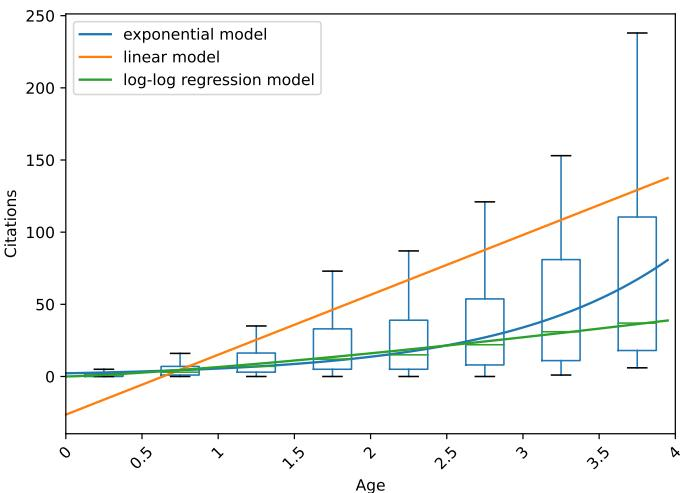  
Fig. 15. Boxplot of citation distributions from the 3,932 papers with respect to age, red curve is the expected citations $\hat { C } _ { i }$ . Generally $R C I > = 1$ indicate the paper is above median citations in its age group, and higher ��� indicate higher research impact.

with age $A _ { i }$ as:

$$
\hat {C} _ {i} = \exp (\hat {\beta}) A _ {i} ^ {\hat {\alpha}}\tag{11}
$$

Then we compute the relative citation index ���� of paper $\mathbf { \nabla } \mathcal { P } i$ as:

$$
R C I _ {i} = \frac {C _ {i}}{\hat {C} _ {i}}\tag{12}
$$

When $R C I _ { i } > = 1$ , we consider this paper over-cited than its expectations, and vice versa. In this paper, we focus on the paper with $R C I > = 1 { , }$ , for which we believe has more influence

## C RCI-Driven Analysis of Topic Impact

In this study, we leverage both RCI and publication volume trends to gain a clearer understanding of the development and influence of various memory-related research topics. As shown in Figure 16, boxplots illustrate the distribution of median Relative Citation Index (RCI) values across topics by year. Notably, 2023 stands out as a pivotal year following the emergence of large language models (LLMs), with a surge in both the quantity and quality of publications related to long-context and parametric memory, suggesting that these areas were directly shaped by the advancement of LLMs. In contrast, long-term memory and multi-source memory maintained relatively stable average impact levels, indicating continued activity without the emergence of disruptive or field-defining work during that period.

Figure 17 visualizes the temporal trends in publication volume and median RCI for each topic. All topics experienced notable growth in publication counts, with long-context in particular expanding from one of the least represented topics before 2022 to the most prominent by 2024—largely driven by the rise of LLMs. Furthermore, the RCI of long-term memory has shown a steady increase, reflecting a growing body of valuable work in that domain. By contrast, other topics witnessed a noticeable decline in RCI medians after 2023, though their influence levels remained comparable to those seen prior to 2022. These patterns collectively underscore the substantial impact of large models in catalyzing progress across memory-related research, especially in the areas of long-context and parametric memory.

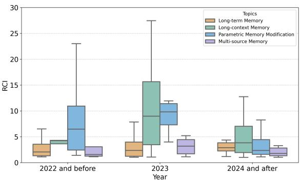  
Fig. 16. Overall distribution of median RCI across topics and years

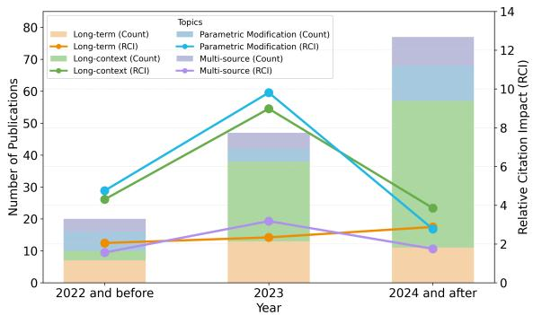  
Fig. 17. Overall temporal trends of topic-wise publication volume and median RCI.

## D Chord Analysis of Interactions Among Memory Types, Operations, Topics, and Venues

We present a chord-based analysis of memory research from two perspectives: (1) the interactions among memory types, operations, and topics, and (2) their distribution across major ML and NLP conference venues.

## D.1 Memory Interactions Across Types, Operations, and Topics

To intuitively analyze the strength of connections between memory types, operations, and research topics, we examine 132 method-focused papers with an $\mathrm { R C I } \geq 1$ and generate a final chord diagram (as shown in Figure 19) based on the analysis.

From the perspective of memory types, research predominantly focuses on parametric memory and contextua unstructured memory, with most work centered on compression, retrieval, forgetting, and updating. In contrast, contextual structured memory is relatively underexplored, likely because LLMs are optimized for sequential text and perform less efectively on structured inputs.

From the operation perspective, compression and retrieval are the most frequently studied, while indexing receives comparatively less attention. This is largely because most existing works focus on the use of memory, where retrieva and compression are two fundamental operations. In the case of consolidation, most studies refer to storing knowledge either in model parameters via training on unstructured text or transforming it into a fixed external memory format.

Updating and forgetting are mainly associated with knowledge editing and unlearning, typically within parametric memory. These directions aim to incrementally modify parameters in the model based on external input. However, due to the opaque nature of model internals, such memory operations remain at an early stage of active exploration. In contrast, memory indexing mechanisms for LLMs have received limited attention.

From the topic perspective, parametric modification studies are mostly centered on parametric memory, though some works attempt parameter adaptation through continual learning over unstructured text. Research under the long-context theme primarily focuses on compression and retrieval within unstructured memory, with some leveraging parameterized forms like key-value caches. In long-term memory studies, the emphasis is also on unstructured memory, particularly in terms of consolidation, compression, and retrieval. Research related to multi-source memory is still limited and typically involves integrating structured and unstructured information.

In summary, the limited exploration of contextual structured memory highlights an opportunity to develop more comprehensive memory operations by integrating it with unstructured memory. Second, research on multi-source memory remains scarce, despite the substantial challenges it poses—particularly the issue of memory conflicts arising from heterogeneous sources. Designing robust and consistent strategies for multi-source memory integration is thus a promising direction. Finally, although indexing has been extensively studied in traditional database systems, it remains underexplored in the context of LLM-based agents. The complexity of memory types and the need for vectorized or sparse retrieval methods call for new indexing approaches specifically tailored to reasoning and interaction in LLMs

## D.2 Memory Interactions Across Conference Venues

In addition to our primary paper collection, we also analyzed 81 method-focused papers with RCI ≥ 1 across major conferences. As shown in Figure 20, from the operation perspective, compression, forgetting, and updating appear more frequently in ML conferences (ICLR, ICML, NeurIPS), while retrieval and consolidation are more commonly featured in NLP conferences (ACL, EMNLP, NAACL). This distribution suggests that the former set of operations is still in the stage of theoretical exploration, whereas the latter is more grounded in practical application. Consequently, compression, forgetting, and updating still hold substantial potential for translation into real-world systems.

Indexing remains underrepresented in both ML and NLP venues. This may be partly due to its frequent co-occurrence with retrieval, and partly because current vector-based indexing approaches are relatively uniform, with few novel alternatives available.

From the topic perspective, long-term memory is more frequently addressed in NLP conferences, while long-context topics are more common in ML venues—likely reflecting the difering application- and theory-oriented focuses of these communities. Parameter modification appears more often in ML conferences, whereas multi-source memory is more prevalent in NLP conferences, highlighting the fact that multi-source memory challenges often arise during real-world applications and system integration.

<table><tr><td>Topic Name</td><td>Definition in Prompt</td></tr><tr><td>Long-Term Memory</td><td>Definition: Creating systems that ensure knowledge from past interactions remains accessible as new tasks emerge, maintaining continuity in multi-turn conversations.Features: Memory retention, retrieval, and attribution-preserving, accessing, and contextualizing memory to support coherent interaction.</td></tr><tr><td>Long-Context</td><td>Definition: Efficiently processing, interpreting, and utilizing very long input sequences without performance degradation.Features: Optimized attention, context compression, and mitigation of the “lost-in-the-middle” problem.</td></tr><tr><td>Parametric Memory Modification</td><td>Definition: Managing and updating internal parameters to preserve accuracy, privacy, and adaptability without full retraining.Features: Selective unlearning, precise model editing, distillation, and lifelong learning.</td></tr><tr><td>Multi-Source</td><td>Definition: Integrating and harmonizing diverse data types into a unified framework while resolving inconsistencies.Features: Multi-modal fusion, semantic consistency, conflict resolution, and redundancy removal.</td></tr><tr><td>Personalization*</td><td>Definition: Building user-centric memory systems that adapt to individual preferences and history while preserving privacy.Features: Privacy-aware profiling, consistent personalization, and long-term continuity.</td></tr><tr><td colspan="2">Table 4. Definitions and features of the five memory-centric evaluation topics. *Personalization is treated as a specialized form of long-term memory that focuses on user-centric adaptation across sessions.</td></tr></table>

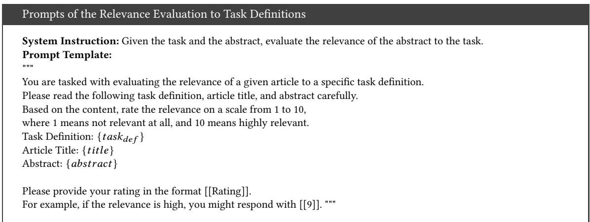  
Fig. 18. Prompt for evaluating article relevance to specific task definitions.

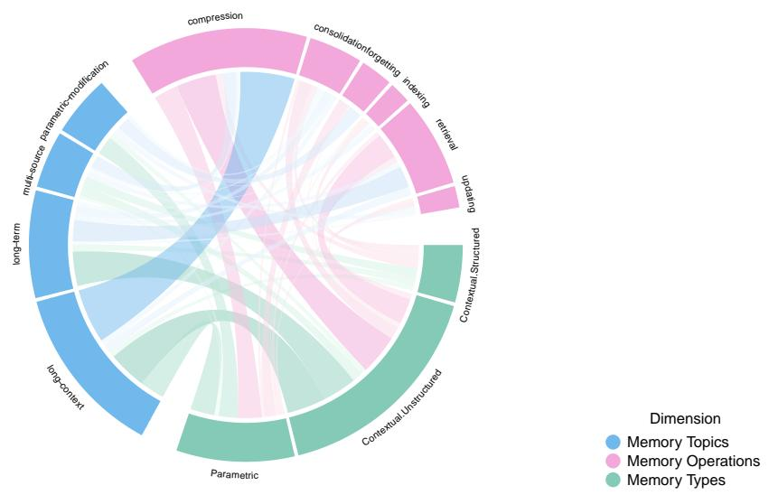

Fig. 19. Chord Map of Interactions Across Memory Topics, Operations, and Types.  
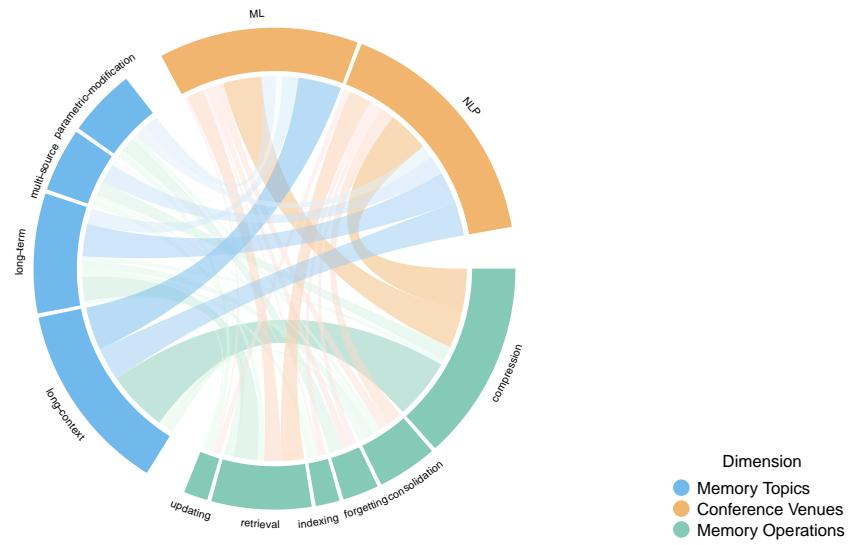  
Fig. 20. Chord Map of Interactions Across Memory Topics, Operations, and Conference Venues.

<table><tr><td>Datasets</td><td>Mo</td><td>Operations</td><td>DS Type</td><td>Per</td><td>TR</td><td>Metrics</td><td>Purpose</td><td>Year</td></tr><tr><td>PersonaMem-v2 [121]</td><td>text</td><td>Updating, Retrieval</td><td>MS</td><td>✓</td><td>✓</td><td>Accuracy, Persona Score</td><td>Benchmarks implicit user persona learning and agentic memory updates over long contexts.</td><td>2025</td></tr><tr><td>MemoryBench [4]</td><td>text</td><td>Updating, Retrieval, Forgetting</td><td>QA</td><td>✘</td><td>✓</td><td>Accuracy, Retention Rate</td><td>Comprehensive benchmark for memory correctness, persistence, and continual learning.</td><td>2025</td></tr><tr><td>HaluMem [29]</td><td>text</td><td>Retrieval</td><td>QA</td><td>✘</td><td>✘</td><td>Accuracy, Hallucination Rate, Omission Rate</td><td>Evaluates hallucinations in memory extraction, updating, and retrieval.</td><td>2025</td></tr><tr><td>BFCL V4 [229]</td><td>text (API/-Code)</td><td>Updating, Retrieval, Reasoning</td><td>QA (API)</td><td>✘</td><td>✘</td><td>AST Accuracy, Execution Success</td><td>Benchmarks function-calling capabilities, featuring a dedicated memory category for CRUD-style tool usage.</td><td>2025</td></tr><tr><td>LongMemEval [314]</td><td>text</td><td>Indexing, Retrieval, Compression</td><td>MS</td><td>✘</td><td>✓</td><td>Recall@K, NDCG@K, Accuracy</td><td>Benchmarks chat assistants on long-term memory abilities, including temporal reasoning.</td><td>2024</td></tr><tr><td>LoCoMo [196]</td><td>text + image</td><td>Indexing, Retrieval, Compression</td><td>MS</td><td>✘</td><td>✓</td><td>Accuracy, ROUGE, Precision, Recall, F1</td><td>Evaluates long-term memory in LLMs across QA, event summarization, and multimodal dialogue tasks.</td><td>2024</td></tr><tr><td>MemoryBank [375]</td><td>text</td><td>Updating, Retrieval</td><td>MS</td><td>✓</td><td>✘</td><td rowspan="2">Accuracy, Human Eval MAP, Recall, Precision, F1, Accuracy, GPT-4 score</td><td>Enhances LLMs with long-term memory, adapting to user personalities and evolving contexts.</td><td>2024</td></tr><tr><td>PerLTQA [65]</td><td>text</td><td>Retrieval</td><td>MS</td><td>✓</td><td>✘</td><td>Evaluates personalized long-term memory QA capabilities.</td><td>2024</td></tr><tr><td>MALP [358]</td><td>text</td><td>Retrieval, Compression</td><td>QA</td><td>✓</td><td>✘</td><td>ROUGE, Accuracy, Win Rate</td><td>Preference-conditioned dialogue generation; supports PEFT customization.</td><td>2024</td></tr><tr><td>DialSim [137]</td><td>text</td><td>Retrieval</td><td>MS</td><td>✓</td><td>✘</td><td>Accuracy</td><td>Evaluates dialogue systems under realistic, real-time, and long-context multi-party conversations.</td><td>2024</td></tr><tr><td>CC [114]</td><td>text</td><td>Retrieval</td><td>MS</td><td>✘</td><td>✓</td><td>BLEU, ROUGE</td><td>Models long-term dialogues incorporating temporal and relationship contexts.</td><td>2023</td></tr><tr><td>LAMP [246]</td><td>text</td><td>Consolidation, Retrieval, Compression</td><td>MS</td><td>✓</td><td>✓</td><td>Accuracy, F1, ROUGE</td><td>Provides user- and time-based splits for evaluating short- and long-term personalization.</td><td>2023</td></tr><tr><td>MSC [327]</td><td>text</td><td>Consolidation, Retrieval, Compression</td><td>MS</td><td>✓</td><td>✘</td><td>PPL</td><td>Multi-session human-human chats for evolving shared knowledge evaluation.</td><td>2022</td></tr><tr><td>DuLeMon [330]</td><td>text</td><td>Consolidation, Updating, Retrieval, Compression</td><td>MS</td><td>✓</td><td>✘</td><td>Accuracy, F1, Recall, Precision, PPL, BLEU, DISTINCT</td><td>Supports dynamic persona tracking and consistent long-term human-bot interactions.</td><td>2022</td></tr><tr><td>2WikiMultiHopQA [95]</td><td>table + knowledge base + text</td><td>Indexing, Retrieval, Compression</td><td>QA</td><td>✘</td><td>✘</td><td>EM, F1</td><td>Multi-hop QA combining structured and unstructured data with reasoning paths.</td><td>2020</td></tr><tr><td>NQ [145]</td><td>text</td><td>Retrieval, Compression</td><td>QA</td><td>✘</td><td>✘</td><td>EM, F1</td><td>Open-domain QA based on real Google search queries.</td><td>2019</td></tr><tr><td>HotpotQA [339]</td><td>text</td><td>Retrieval, Compression</td><td>QA</td><td>✘</td><td>✘</td><td>EM, F1</td><td>Multi-hop QA with explainable reasoning and supporting facts at the sentence level.</td><td>2018</td></tr></table>

Table 5. Datasets used for evaluating long-term memory. “Mo” = modality; “Ops” = supported operations; “DS Type” = dataset type (QA – question answering, MS – multi-session dialogue); “Per” and “TR” = presence of persona and temporal reasoning.

<table><tr><td>Datasets</td><td>Modality</td><td>Operations</td><td>Metrics</td><td>Purpose</td><td>Year</td></tr><tr><td>LongBioBench [338]</td><td>text</td><td>retrieval</td><td>EM</td><td>Controllable long-context multi-hop examination for LLMs</td><td>2025</td></tr><tr><td>LongBench v2 [16]</td><td>text + table + KG</td><td>compression, retrieval</td><td>Accuracy</td><td>Updated version of LongBench, longer and more challenging, with a consistent multi-choice format for reliable evaluation.</td><td>2024</td></tr><tr><td>SWE-bench Multimodal [337]</td><td>text + image</td><td>compression, retrieval</td><td>Resolution rate, Inference cost</td><td>Extends SWE-bench with multimodal tasks (517 instances) to test reasoning with images.</td><td>2024</td></tr><tr><td>∞Bench [366]</td><td>text</td><td>compression, retrieval</td><td>F1, Accuracy, ROUGE-L-Sum</td><td>Benchmark with 12 tasks targeting extreme long contexts (average &gt;100K tokens).</td><td>2024</td></tr><tr><td>L-Eval [5]</td><td>text</td><td>compression, retrieval</td><td>ROUGE-L, F1, GPT-4</td><td>20 tasks designed to evaluate long-context LLMs from various perspectives.</td><td>2023</td></tr><tr><td>LongBench [15]</td><td>text</td><td>compression, retrieval</td><td>F1, ROUGE-L, Accuracy, EM, Edit Sim</td><td>Includes 14 English tasks, 5 Chinese tasks, and 2 code tasks for systematic long-context evaluation.</td><td>2023</td></tr><tr><td>SWE-bench [130]</td><td>text</td><td>compression, retrieval</td><td>Resolution rate (% Resolved)</td><td>Tests LLMs on solving GitHub issues (2,294 instances), requiring reasoning over large codebases.</td><td>2023</td></tr><tr><td>NIAH [135]</td><td>text</td><td>retrieval</td><td>Recall Accuracy</td><td>Evaluating LLMs on finding specific data (needle) in long contexts (haystack).</td><td>2023</td></tr><tr><td>LooGLE [154]</td><td>text</td><td>compression, retrieval</td><td rowspan="2">BLEU-1, BLEU-4, ROUGE-1, ROUGE-4, ROUGE-L, Meteor, Bert, GPT-4 scores ROUGE-1, ROUGE-2, ROUGE-L, Bert Score</td><td>Benchmark with 7 tasks for extreme long context (each doc &gt;24K tokens).</td><td>2023</td></tr><tr><td>GovReport [104]</td><td>text</td><td>compression</td><td>Government research reports for evaluating long-document summarization.</td><td>2021</td></tr><tr><td>MusiQue [278]</td><td>text</td><td>retrieval</td><td>F1</td><td>Multi-hop QA benchmark for reasoning and long-context QA tasks.</td><td>2021</td></tr><tr><td>LRA [274]</td><td>text + image</td><td>compression, retrieval</td><td>Accuracy</td><td>Six tasks designed to evaluate efficient long-context models.</td><td>2020</td></tr><tr><td>NaturalQuestions [145]</td><td>text</td><td>retrieval</td><td>EM, F1</td><td>QA dataset used for retrieval and reasoning tasks with long contexts.</td><td>2019</td></tr><tr><td>PG-19 [238]</td><td>text</td><td>compression</td><td>PPL</td><td>Book corpus from Project Gutenberg for long-context language modeling.</td><td>2019</td></tr><tr><td>TriviaQA [134]</td><td>text</td><td>retrieval</td><td>EM, F1</td><td>QA dataset suitable for testing long-context understanding and reasoning.</td><td>2017</td></tr><tr><td>NarrativeQA [143]</td><td>text</td><td>retrieval</td><td>BLEU-1, BLEU-4, Meteor, ROUGE-L, MRR</td><td>QA dataset for comprehension over narrative texts with long contexts.</td><td>2017</td></tr><tr><td>CNN/DailyMail [215]</td><td>text</td><td>compression</td><td>ROUGE-1, ROUGE-2, ROUGE-L</td><td>News articles for summarization tasks, suitable for long-context evaluation.</td><td>2016</td></tr><tr><td>WikiText-103 [206]</td><td>text</td><td>compression</td><td>PPL</td><td>Wikipedia-based corpus of 100M tokens for long-context language modeling.</td><td>2016</td></tr><tr><td>Dataset</td><td>Modality</td><td>Operations</td><td>Metrics</td><td>Purpose</td><td>Year</td></tr><tr><td>KnowEdit[359]</td><td>text</td><td>updating</td><td>Edit Success, Portability, Locality, Fluency</td><td>Provides a comprehensive benchmark of six datasets for evaluating knowledge insertion, modification, and erasure.</td><td>2024</td></tr><tr><td>MUSE[254]</td><td>text</td><td>forgetting</td><td>VerbMem, KnowMem, PrivLeak</td><td>A benchmark for machine unlearning, assessing six key properties for unlearned models.</td><td>2024</td></tr><tr><td>KnowUnDo[277]</td><td>text</td><td>forgetting</td><td>Unlearn Success, Retention Success, Perplexity, ROUGE-L</td><td>Evaluates unlearning in domains with copyrighted content and user privacy, checking if essential knowledge is inadvertently erased.</td><td>2024</td></tr><tr><td>RWKU[133]</td><td>text</td><td>forgetting</td><td>ROUGE-L</td><td>Tests real-world unlearning under corpus-free conditions with adversarial assessments.</td><td>2024</td></tr><tr><td>WMDP[156]</td><td>text</td><td>forgetting</td><td>QA Accuracy</td><td>Benchmarks hazardous knowledge detection and unlearning for biosecurity, cybersecurity, and chemical security.</td><td>2024</td></tr><tr><td>TOFU[197]</td><td>text</td><td>forgetting</td><td>Probability, ROUGE, Truth Ratio</td><td>A dataset of facts about 200 fictitious authors for unlearning research.</td><td>2024</td></tr><tr><td>ABSA[57]</td><td>text</td><td>consolidation</td><td>F1</td><td>For aspect-based sentiment analysis to assess LLMs in continual learning tasks.</td><td>2024</td></tr><tr><td>MQUAKE-CF[376]</td><td>text</td><td>updating</td><td>Edit-wise Success Rate, Instance-wise Accuracy, Multi-hop Accuracy</td><td>Evaluates counterfactual knowledge propagation through multi-hop reasoning (up to 4 hops).</td><td>2023</td></tr><tr><td>MQUAKE-T[376]</td><td>text</td><td>updating</td><td>Edit-wise Success Rate, Instance-wise Accuracy, Multi-hop Accuracy</td><td>Assesses temporal knowledge propagation through multi-hop reasoning chains with one edit per chain.</td><td>2023</td></tr><tr><td>Counterfact[203]</td><td>text</td><td>updating</td><td>Efficacy Score, Efficacy Magnitude, Paraphrase Scores, Neighborhood Score</td><td>Evaluates substantial and improbable factual changes beyond superficial edits.</td><td>2022</td></tr><tr><td>zsRE[50]</td><td>text</td><td>updating</td><td>Success Rate, Retain Accuracy, Equivalence Accuracy, Performance Deterioration</td><td>One of the earliest datasets for evaluating knowledge editing.</td><td>2021</td></tr><tr><td>SGD[240]</td><td>text</td><td>consolidation</td><td>JGA, FWT, BWT</td><td>Multi-turn task-oriented dialogue for evolving user intents and continual schema updates.</td><td>2020</td></tr><tr><td>INSPIRED[89]</td><td>text</td><td>consolidation</td><td>JGA, FWT, BWT</td><td>Dialogue dataset supporting incremental intent changes in task-oriented settings.</td><td>2020</td></tr><tr><td>Natural Questions[145]</td><td>text</td><td>consolidation</td><td>Indexing Accuracy, Hits@1</td><td>Multi-purpose QA dataset with indexed documents for dynamic continual learning.</td><td>2019</td></tr></table>

Table 6. Datasets for long-context memory evaluation, sorted from newest to oldest.

Table 7. Datasets for parametric memory evaluation, sorted by year from newest to oldest.

Rethinking Memory in LLM based Agents: Representations, Operations, and Emerging Topics

<table><tr><td>Datasets</td><td>Mo</td><td>Ops</td><td>Src#</td><td>Mod#</td><td>Task</td><td>Metrics</td><td>Purpose</td><td>Year</td></tr><tr><td>MultiChat [281]</td><td>text + image</td><td>Retrieval</td><td>2</td><td>2</td><td>Retrieval</td><td>Precision, mAP, GPT-4</td><td>Image-grounded sticker retrieval with cross-session image-text dialogue context.</td><td>2025</td></tr><tr><td>MovieChat-1K [256]</td><td>text + video</td><td>Retrieval</td><td>2</td><td>2</td><td>QA</td><td>Accuracy</td><td>Long-term video understanding for large multimodal models in video QA and captioning tasks.</td><td>2025</td></tr><tr><td>Context-conflicting [268]</td><td>text</td><td>Compression</td><td>2</td><td>1</td><td>Conflict</td><td>DiffGR, EM, Similarity</td><td>Evaluate models&#x27; ability to handle conflicting evidence across sources.</td><td>2024</td></tr><tr><td>EgoSchema [198]</td><td>video + text</td><td>Retrieval, Compression</td><td>3</td><td>2</td><td>Fusion</td><td>Accuracy</td><td>Combines episodic video memory, social schema, and conversation for long-term QA.</td><td>2023</td></tr><tr><td>Ego4D NLQ [101]</td><td>video + text</td><td>Retrieval, Compression</td><td>2</td><td>2</td><td>Fusion</td><td>Recall@K</td><td>QA over egocentric video with temporal memory using natural language queries.</td><td>2022</td></tr><tr><td>2WikiMultihopQA [95]</td><td>text</td><td>Indexing, Retrieval, Compression</td><td>2</td><td>1</td><td colspan="2">ReasoningEM, F1</td><td>Multi-hop QA requiring reasoning across two Wikipedia passages with sentence-level evidence.</td><td>2020</td></tr><tr><td>HybridQA [34]</td><td>text</td><td>Retrieval, Compression</td><td>2</td><td>1</td><td colspan="2">ReasoningEM, F1</td><td>QA requiring reasoning across structured tables and unstructured text.</td><td>2020</td></tr><tr><td>CommonsenseVQA [266]</td><td>text + image</td><td>Retrieval, Compression</td><td>2</td><td>2</td><td>Fusion</td><td>Accuracy</td><td>Commonsense QA over visual scenes requiring visual-text fusion.</td><td>2019</td></tr><tr><td>NaturalQuestions [145]</td><td>text</td><td>Retrieval, Compression</td><td>&gt;1*</td><td>1</td><td>Conflict</td><td>EM, F1</td><td>Real-world QA over Google search snippets; also used for contradiction analysis.</td><td>2019</td></tr><tr><td>ComplexWebQuestions [265]</td><td>text</td><td>Retrieval, Compression</td><td>&gt;1*</td><td>1</td><td colspan="2">ReasoningEM, F1</td><td>Compositional QA requiring multi-step reasoning across web snippets.</td><td>2018</td></tr><tr><td>HotpotQA [339]</td><td>text</td><td>Retrieval, Compression</td><td>2</td><td>1</td><td>Conflict</td><td>EM, F1, Supporting Fact Accuracy</td><td>Multi-hop QA with paragraph-level sources and sentence-level supporting facts.</td><td>2018</td></tr><tr><td>TriviaQA [134]</td><td>text</td><td>Retrieval, Compression</td><td>≥6</td><td>1</td><td>Conflict</td><td>EM, F1</td><td>Trivia-style QA with noisy web sources; used for source disagreement studies.</td><td>2017</td></tr><tr><td>WebQuestionsSP [346]</td><td>text</td><td>Indexing, Retrieval, Compression</td><td>&gt;1*</td><td>1</td><td colspan="2">ReasoningF1, Accuracy</td><td>Enhanced WebQuestions with structured reasoning chains.</td><td>2016</td></tr><tr><td>Flickr30K [348]</td><td>text + image</td><td>Retrieval, Compression</td><td>2</td><td>2</td><td>Retrieval</td><td>Similarity</td><td>Image-caption pairs widely used for cross-modal retrieval and alignment tasks.</td><td>2014</td></tr></table>

Table 8. Datasets used for evaluating multi-source memory. “Mo” denotes data modality. “Ops” indicates operations. “Src#” = number of information sources per instance; “Mod#” = number of modalities; “Task” = retrieval, fusion, reasoning, or conflict resolution.

<table><tr><td>Method</td><td>Type</td><td>TF</td><td>RE</td><td>DS</td><td>Input</td><td>Output</td><td>LMs</td><td>Ops</td><td>Features</td><td>Year</td></tr><tr><td>EWE[31]</td><td>Memory Grounded Generation</td><td>✓</td><td>✓</td><td>✓</td><td>Context</td><td>Response</td><td>Llama-3.1-70B, 8B</td><td>Updating, Retrieval</td><td>Explicit working memory, online fact-checking feedback, factual long-form generation</td><td>2025</td></tr><tr><td>ICAL[248]</td><td>Generation</td><td>✓</td><td>✓</td><td>✓</td><td>Examples + Task Instruction</td><td>Trajectory + Thoughts</td><td>GPT4V, Qwen2VL</td><td>Updating</td><td>Trajectory abstraction memory, multi-modal, iterative reasoning correction</td><td>2025</td></tr><tr><td>MEMORAG[234]</td><td>Memory Grounded Generation</td><td>✓</td><td>✓</td><td>✓</td><td>Context + Query</td><td>Response</td><td>Mistral7B-Instruct, Phi-3-mini-128K-instruct, GPT-4o</td><td>Retrieval, Compression</td><td>Global memory retrieval, KV memory compression, Feedback-guided generation</td><td>2024</td></tr><tr><td>ReadAgent[149]</td><td>Generation</td><td>✓</td><td>✓</td><td>✓</td><td>Context + Query</td><td>Retrieved Passages/-Summary</td><td>PaLM 2</td><td>Updating, Retrieval</td><td>Episodic gist memory, dynamic memory retrieval, extended context window</td><td>2024</td></tr><tr><td>FLOW-RAG[296]</td><td>Updating</td><td>✓</td><td>✓</td><td>✓</td><td>Knowledge Base + Query</td><td>Response</td><td>GPT4o, Gemini, llama2-7B-chat</td><td>Forgetting</td><td>RAG-based unlearning</td><td>2024</td></tr><tr><td>HippoRAG[84]</td><td>Retrieval</td><td>✓</td><td>✓</td><td>✓</td><td>Context + Query</td><td>Response</td><td>ColBERTv2, GPT-3.5-turbo, Llama-3.1-8B, 70B</td><td>Indexing</td><td>Hippocampal-inspired retrieval, multi-hop QA, Knowledge graph integration</td><td>2024</td></tr><tr><td>IterCQR[116]</td><td>Retrieval</td><td>✓</td><td>✓</td><td>✓</td><td>Dialogue History + Query</td><td>Retrieved Results</td><td>Transformer++</td><td>Retrieval</td><td>Iterative query reformulation, context-aware query rewriting</td><td>2024</td></tr><tr><td>MemoryBank[375]</td><td>Consolidation</td><td>✓</td><td>✓</td><td>✓</td><td>Retrieved &amp; Context + Query</td><td>Response</td><td>ChatGLM-6B, BELLE-7B, gpt-3.5-turbo</td><td>Consolidation, Updating, Forgetting, Retrieval</td><td>Fine-tuning, RAG, Ebbinghaus Forgetting</td><td>2024</td></tr><tr><td>FLARE[129]</td><td>Retrieval</td><td>✓</td><td>✓</td><td>✓</td><td>Database + Query</td><td>Response</td><td>WebGPT, WebCPM</td><td>Retrieval</td><td>Active retrieval during generation, forward-looking query prediction</td><td>2023</td></tr><tr><td>MemoChat[190]</td><td>Consolidation</td><td>✓</td><td>✓</td><td>✓</td><td>Dialogue History + Query</td><td>Response</td><td>GPT4, ChatGPT, Vicuna-7B, 13B, 33B, T5</td><td>Consolidation, Retrieval</td><td>Structured memos, memory-driven dialogue, memorization-retrieval-response cycle</td><td>2023</td></tr><tr><td>NLI-Transfer[13]</td><td>Updating</td><td>✓</td><td>✓</td><td>✓</td><td>Memory + Dialogue History</td><td>Response</td><td>T5</td><td>Consolidation, Updating, Retrieval</td><td>Session-level memory tracking, evolving dialogue system</td><td>2022</td></tr></table>

Table 9. Overview of methods for long-term memory in memory management and utilization. “TF” (Training Free) denotes whether the method operates without additional gradient-based updates; “RE” (Retrieval Module) denotes whether the method uses retrieval: “DS” (Dialogue System) denotes whether the method is designed for dialogue tasks

<table><tr><td>Method</td><td>Type</td><td>TF</td><td>RE</td><td>Input</td><td>Output</td><td>LMs</td><td>Ops</td><td>Features</td><td>Year</td></tr><tr><td>LD-Agent[153]</td><td>Augmentation</td><td>√</td><td>√</td><td>Retrieved &amp; Context + Query</td><td>Response</td><td>ChatGLM, BlenderBot, ChatGPT</td><td>Consolidation, Updating, Retrieval</td><td>long-term dialogue modeling, event &amp; persona memory, mudular agent architecture</td><td>2025</td></tr><tr><td>SiliconFriend[375]</td><td>Augmentation</td><td>✗</td><td>√</td><td>Retrieved &amp; Context + Query</td><td>Response</td><td>ChatGLM-6B, BELLE-7B, gpt-3.5-turbo</td><td>Consolidation, Updating, Forgetting, Retrieval</td><td>fine-tuning, RAG, Ebbinghaus Forgetting</td><td>2024</td></tr><tr><td>MALP[358]</td><td>Adaption</td><td>✗</td><td>√</td><td>Retrieved &amp; Context + Query</td><td>Response</td><td>GPT3.5, LLaMA-7B, LLaMA-13B</td><td>Consolidation, Retrieval</td><td>memory coordination, computational bionic memory mechanism, patient profile, self-chat</td><td>2024</td></tr><tr><td>PERPCS[269]</td><td>Adaption</td><td>✗</td><td>✗</td><td>User History</td><td>/</td><td>Llama-2-7B</td><td>Consolidation</td><td>modular PEFT sharing, collaborative personalization, user history assembly</td><td>2024</td></tr><tr><td>LAPDOG[105]</td><td>Augmentation</td><td>√</td><td>√</td><td>Retrieved &amp; Context + Query</td><td>Response</td><td>T5</td><td>Consolidation, Updating, Retrieval</td><td>Story-based persona retrieval, joint retriever-generator training</td><td>2024</td></tr><tr><td>RECAP[181]</td><td>Augmentation</td><td>✗</td><td>√</td><td>Retrieved &amp; Context + Query</td><td>Response</td><td>Transformers</td><td>Retrieval</td><td>hierarchical transformer retriever, context-aware prefix encoder</td><td>2023</td></tr><tr><td>CLV[273]</td><td>Adaption</td><td>✗</td><td>✗</td><td>Persona + Query</td><td>Response</td><td>GPT-2</td><td>Consolidation</td><td>contrastive learning, clustered dense persona, dialogue generation</td><td>2023</td></tr><tr><td>PERKGQA[68]</td><td>Augmentation</td><td>√</td><td>√</td><td>Retrieved &amp; Knowledge Graph + Query</td><td>Response</td><td>RoBERTa</td><td>Retrieval</td><td>long-term dialogue modeling, event &amp; persona memory, mudular agent architecture</td><td>2022</td></tr></table>

Table 10. Overview of methods for long-term memory in personalization. "TF" (Training Free) denotes whether the method operates without additional gradient-based updates. "RE" (Retrieval Module) denotes whether the method needs Retrieval.

Rethinking Memory in LLM based Agents: Representations, Operations, and Emerging Topics

<table><tr><td>Method</td><td>Type</td><td>TF</td><td>FC</td><td>Operations</td><td>LMs</td><td>Features</td><td>Year</td></tr><tr><td>FoldGRPO[264]</td><td>ContextCompression</td><td>✗</td><td>✗</td><td>Compression</td><td>Seed-OSS-36B</td><td>RL framework training agents to actively fold detailed histories into concise summaries</td><td>2025</td></tr><tr><td>RECOMP[325]</td><td>ContextCompression</td><td>✗</td><td>✗</td><td>Compression</td><td>GPT-2, GPT2-XL, GPT-J, Flan-UL2</td><td>Hard prompt compression with extractive and abstractive strategies</td><td>2024</td></tr><tr><td>LongLLMLingua[125]</td><td>ContextCompression</td><td>√</td><td>✗</td><td>Compression</td><td>GPT-3.5-Turbo-06136, LongChat-13B-16k</td><td>Hard prompt compression for efficient input representation</td><td>2024</td></tr><tr><td>LLMLingua-2[227]</td><td>ContextCompression</td><td>✗</td><td>✗</td><td>Compression</td><td>XLM-RoBERTa-Large, Multilingual-BERT</td><td>Hard prompt compression with data distillation for multilingual contexts</td><td>2024</td></tr><tr><td>QGC[25]</td><td>ContextCompression</td><td>✗</td><td>✗</td><td>Compression</td><td>LongChat-13B-16K, LLaMA-2-7B</td><td>Query-guided dynamic context compression</td><td>2024</td></tr><tr><td>xRAG[36]</td><td>ContextCompression</td><td>✗</td><td>✗</td><td>Compression</td><td>Mistral-7B, Mixtral-8x7B</td><td>Soft prompt compression for parametric integration</td><td>2024</td></tr><tr><td>AutoCompressor[37]</td><td>ContextCompression</td><td>✗</td><td>√</td><td>Compression</td><td>OPT-1.3B, OPT-2.7B, LLaMA-2-7B</td><td>Soft prompt compression for general-purpose efficiency</td><td>2023</td></tr><tr><td>StreamingLLM[323]</td><td>KV CacheEviction</td><td>√</td><td>✗</td><td>Compression</td><td>Llama-2, MPT, PyThia, Falcon</td><td>Static KV cache eviction, Attention sink in the initial tokens</td><td>2024</td></tr><tr><td>FastGen[77]</td><td>KV CacheEviction</td><td>√</td><td>✗</td><td>Compression</td><td>Llama-1 7B/13B/30B/65B</td><td>Adaptive profiling-based KV cache eviction</td><td>2024</td></tr><tr><td>SnapKV[163]</td><td>KV CacheEviction</td><td>√</td><td>✗</td><td>Compression</td><td>LWM-Text-Chat-1M, LongChat-7b-v1.5-32k, Mistral-7B-Instruct-v0.2, Mixtral-8x7B-Instruct-v0.1</td><td>Head-wise KV cache eviction, Attention head behavior</td><td>2024</td></tr><tr><td>LESS[59]</td><td>KV CacheStoring Optimization</td><td>✗</td><td>√</td><td>Compression</td><td>Llama-2 13B, Falcon 7B</td><td>Low-rank KV cache storage enabling querying of all tokens</td><td>2024</td></tr><tr><td>KIVI[188]</td><td>KV CacheStoring Optimization</td><td>√</td><td>√</td><td>Compression</td><td>Llama-2 7B/13B, Llama-3 8B, Falcon 7B, Mistral-7B</td><td>Asymmetrical KV cache quantization</td><td>2024</td></tr><tr><td>KVQuant[98]</td><td>KV CacheStoring Optimization</td><td>√</td><td>√</td><td>Compression</td><td>LLaMA-7B/13B/30B/65B, Llama-2-7B/13B/70B, Llama-3-8B/70B, Mistral-7B</td><td>KV cache quantization</td><td>2024</td></tr><tr><td> $H_2O$ [368]</td><td>KV CacheEviction</td><td>√</td><td>✗</td><td>Compression</td><td>OPT, Llama-1, GPT-NeoX</td><td>Dynamic KV cache eviction, Retain Heavy Hitter tokens</td><td>2023</td></tr><tr><td>Scissorhands[184]</td><td>KV CacheEviction</td><td>√</td><td>✗</td><td>Compression</td><td>OPT 6.7B, 13B, 30B, 66B</td><td>Dynamic KV cache eviction, Persistence of importance hypothesis</td><td>2023</td></tr><tr><td>ShadowKV[263]</td><td>KV CacheStoring Optimization</td><td>√</td><td>√</td><td>Compression</td><td>Llama-3.1-8B, Llama-3-8B-1M, GLM-4-9B-1M, Yi-9B-200K, Phi-3-Mini-128K, and Qwen2-7B-128K</td><td>Reduces GPU memory usage by keeping compressed shadow versions of keys on the GPU while offloading full data to the CPU</td><td>2025</td></tr><tr><td>FlexGen[250]</td><td>KV CacheStoring Optimization</td><td>√</td><td>√</td><td>Compression</td><td>OPT 6.7B to 175B</td><td>KV cache quantization and offloading</td><td>2023</td></tr></table>

Table 11. Overview of methods for long-context memory compression. “TF” (Training Free) indicates no additional gradient-based updates. “FC” (Full Context) indicates that the method preserves the access to all context tokens.

Du et al.

<table><tr><td>Method</td><td>Type</td><td>TF</td><td>FC</td><td>Operations</td><td>LMs</td><td>Features</td><td>Year</td></tr><tr><td>Sparse RAG [382]</td><td>Context Selection</td><td>✕</td><td>✕</td><td>Retrieval</td><td>Gemini</td><td>Sparse context selection, reduces the number of documents involved during decoding</td><td>2025</td></tr><tr><td>GraphReader [158]</td><td>Context Selection</td><td>√</td><td>✕</td><td>Retrieval</td><td>GPT-4-128k</td><td>Graph-based agent; structures long context into a graph</td><td>2024</td></tr><tr><td>Ziya-Reader [91]</td><td>Context Selection</td><td>✕</td><td>√</td><td>Retrieval</td><td>Ziya2-13B-Base (LLaMA-2-13B)</td><td>Supervised fine-tuning; position-agnostic multi-step QA</td><td>2024</td></tr><tr><td>FILM [6]</td><td>Context Selection</td><td>✕</td><td>√</td><td>Retrieval</td><td>FILM-7B (Mistral 7B)</td><td>Data-driven approach; addresses the “lost in the middle” problem</td><td>2024</td></tr><tr><td>TokenSelect [316]</td><td>KV Cache Selection</td><td>√</td><td>√</td><td>Retrieval</td><td>Qwen2 7B, Llama-3 8B, Yi-1.5-6B</td><td>Dynamic token-level KV cache selection</td><td>2025</td></tr><tr><td>QUEST [271]</td><td>KV Cache Selection</td><td>√</td><td>√</td><td>Retrieval</td><td>LongChat-7B-v1.5-32K, Yarn-Llama2-7B-128K</td><td>Query-aware KV cache selection</td><td>2024</td></tr><tr><td>Memorizing Transformers [318]</td><td>KV Cache Selection</td><td>✕</td><td>√</td><td>Retrieval</td><td>Transformers</td><td>External KV cache memory for enhanced recall</td><td>2022</td></tr></table>

Table 12. Overview of methods for long-context memory retrieval. “TF” (Training Free) indicates no additional gradient-based updates. “FC” (Full Context) indicates that the method preserves the access to all context tokens.

<table><tr><td>Method</td><td>Type</td><td>PR</td><td>TF</td><td>BES</td><td>SEO</td><td>LMs</td><td>Main Advancement</td><td>Year</td></tr><tr><td>AlphaEdit [70]</td><td>locating-then-editing</td><td>✕</td><td>√</td><td>√</td><td>√</td><td>gpt2-xl-1.5b,gpt-j-6b,llama3-8b</td><td>Protect preserved knowledge by projecting perturbation onto the null space and adding a regularization term for sequential editing.</td><td>2024</td></tr><tr><td>MEMAT [201]</td><td>locating-then-editing</td><td>✕</td><td>√</td><td>√</td><td>✕</td><td>aguila-7b</td><td>Extension of MEMIT with attention head corrections for cross-lingual editing.</td><td>2024</td></tr><tr><td>DEM [107]</td><td>locating-then-editing</td><td>✕</td><td>√</td><td>√</td><td>✕</td><td>gpt-j-6b,llama2-7b</td><td rowspan="2">Uses a dynamic aware module to select editing layers, targeting commonsense knowledge editing in free text.Supports sequential editing via Intra-editing Attention Flow (within facts) and Inter-editing Attention Flow (across facts).</td><td>2024</td></tr><tr><td>DAFNET [365]</td><td>meta learning</td><td>✕</td><td>✕</td><td>✕</td><td>√</td><td>gpt-j-6b,llama2-7b</td><td>2024</td></tr><tr><td>Larimar [48]</td><td>additional parameters</td><td>√</td><td>√</td><td>√</td><td>√</td><td>gpt2-xl,gpt-j-6b</td><td>Introduces a decoupled latent memory module that conditions the LLM decoder at test time without parameter updates.</td><td>2024</td></tr><tr><td>MEMORYLLM [300]</td><td>additional parameters</td><td>√</td><td>✕</td><td>√</td><td>√</td><td>llama2-7b</td><td>Introduces a fixed-size memory pool that is incrementally and selectively updated in a frozen LLM.</td><td>2024</td></tr><tr><td>WISE [289]</td><td>additional parameters</td><td>√</td><td>✕</td><td>√</td><td>√</td><td>llama2-7b,mistral-7b,gpt-j-6b</td><td>Supports sequential editing through Side Memory Design and Knowledge Sharding and Merging.</td><td>2024</td></tr><tr><td>PMET [159]</td><td>locating-then-editing</td><td>✕</td><td>√</td><td>√</td><td>✕</td><td>gpt-j-6b,gpt-neox-20bgpt-j-6b,gpt2-xl-1.5b,gpt-neo,gpt-neox,opt-175b</td><td>Jointly optimizes attention heads and FFN, updating only FFN weights.</td><td>2023</td></tr><tr><td>IKE [373]</td><td>prompt</td><td>√</td><td>√</td><td>-</td><td>-</td><td>gpt2-xl-1.5b,gpt-neo,gpt-neox,opt-175b</td><td>First method to use in-context learning (ICL) for LLM editing.</td><td>2023</td></tr><tr><td>MeLLo [376]</td><td>prompt</td><td>√</td><td>√</td><td>-</td><td>-</td><td rowspan="2">vicuna-7b,gpt-j-6bbert-base,gpt-2,t5-xl,gpt-j-6b</td><td>Combines Question Decomposition + Self Check for editing.</td><td>2023</td></tr><tr><td>MALMEN [267]</td><td>meta learning</td><td>✕</td><td>✕</td><td>√</td><td>✕</td><td>Uses least squares to merge edits reliably and decouples networks to save memory,supporting massive batch editing.</td><td>2023</td></tr><tr><td>MEMIT [205]</td><td>locating-then-editing</td><td>✕</td><td>√</td><td>√</td><td>✕</td><td>gpt-j-6b,gpt-neox-20b</td><td>Optimizes a relaxed least-squares objective,enabling a closed-form solution for massive batch editing.</td><td>2022</td></tr><tr><td>ROME [203]</td><td>locating-then-editing</td><td>✕</td><td>√</td><td>✕</td><td>✕</td><td>gpt2-xl-1.5b</td><td>A classic locate-then-edit method performing a rank-one update on a single MLP layer.</td><td>2022</td></tr><tr><td>CaliNET [60]</td><td>additional parameters</td><td>√</td><td>✕</td><td>√</td><td>✕</td><td>t5-base,t5-large</td><td>Adds FFN-like calibration layers to modify outputs efficiently.</td><td>2022</td></tr><tr><td>SERAC [212]</td><td>additional parameters</td><td>√</td><td>✕</td><td>√</td><td>√</td><td>t5-large,bert-base,blenderbot-90m</td><td>Combines Scope Classifier + Counterfactual Model to support sequential or simultaneous edits with consistent results.</td><td>2022</td></tr><tr><td>GRACE [212]</td><td>additional parameters</td><td>√</td><td>✕</td><td>✕</td><td>√</td><td rowspan="2">t5-small,bert-base,gpt2-xl-1.5bgpt-neo,gpt-j-6b,t5-xl,t5-xxl,bert-base,bart-base</td><td>Supports sequential editing using a codebook with a deferral mechanism.</td><td>2022</td></tr><tr><td>MEND [211]</td><td>meta learning</td><td>✕</td><td>✕</td><td>√</td><td>✕</td><td>Decomposes gradient updates into a rank-one outer product for scalable, fast editing.</td><td>2021</td></tr><tr><td>KE [50]</td><td>meta learning</td><td>✕</td><td>✕</td><td>√</td><td>✕</td><td>bert-base,bart-base</td><td>First to use a hypernetwork to project sentence embeddings into a rank-1 gradient mask.</td><td>2021</td></tr></table>

Table 13. Overview of methods for parametric memory optimization in editing. "PR" (Parametric Reserving) denotes whether model weights remain untouched. "TF" (Training-Free) indicates editing without iterative optimization. "BES" (Batch Editing Support) highlights batch editing capability. "SEO" (Sequential Editing Optimization) shows mechanisms tailored for sequential edits. "LMs" lists the language models used for experiments.

<table><tr><td>Method</td><td>Type</td><td>PR</td><td>TF</td><td>BUS</td><td>SUO</td><td>LMs</td><td>Main Advancement</td><td>Year</td></tr><tr><td>ULD[118]</td><td>additional parameters</td><td>√</td><td>✗</td><td>√</td><td>✗</td><td>llama2-chat-7b, mistral-7b-instruct</td><td>Derives an unlearned LLM by computing the logit difference between the target and assistant models.</td><td>2024</td></tr><tr><td>ECO[173]</td><td>prompt</td><td>√</td><td>✗</td><td>√</td><td>✗</td><td>68 LLMs ranging from 0.5B to 236B</td><td>Performs unlearning by corrupting prompt embeddings detected by a classifier, without altering model weights.</td><td>2024</td></tr><tr><td>WAGLE[119]</td><td>locating-then-unlearning</td><td>✗</td><td>✗</td><td>√</td><td>✗</td><td>llama2-7b-chat, zephyr-7b-beta, llama2-7b</td><td>Uses bi-level optimization to compute weight attribution scores for selective fine-tuning to achieve efficient, modular unlearning.</td><td>2024</td></tr><tr><td>SOUL[120]</td><td>training objective</td><td>✗</td><td>✗</td><td>√</td><td>√</td><td>opt-1.3b, llama2-7b</td><td>Leverages a second-order optimizer for more effective LLM unlearning.</td><td>2024</td></tr><tr><td>SKU[185]</td><td>training objective</td><td>✗</td><td>✗</td><td>√</td><td>√</td><td>opt-2.7b, llama2-7b, llama2-13b</td><td>Combines harmful knowledge learning with task vector negation in a two-stage framework for robust unlearning.</td><td>2024</td></tr><tr><td>EUL[30]</td><td>additional parameters</td><td>√</td><td>✗</td><td>√</td><td>√</td><td>t5-base, t5-3b</td><td>Introduces unlearning layers to forget specific data, supporting sequential unlearning through a fusion mechanism to merge multiple layers.</td><td>2023</td></tr><tr><td>ICUL[231]</td><td>prompt</td><td>√</td><td>√</td><td>-</td><td>-</td><td>bloom-560m, bloom-1.1b, bloom-3b, llama2-7b</td><td>First method to leverage in-context learning (ICL) for unlearning in language models.</td><td>2023</td></tr><tr><td>GA+Mismatch[343]</td><td>training objective</td><td>✗</td><td>✗</td><td>√</td><td>✗</td><td>opt-1.3b, opt-2.7b, llama2-7b</td><td>Pioneered LLM unlearning by blending forgetting, random mismatch, and KL-based preservation objectives.</td><td>2023</td></tr><tr><td>KGA[286]</td><td>training objective</td><td>✗</td><td>✗</td><td>√</td><td>✗</td><td>bart-base, distil-bert, lstm</td><td>Simulates forgetting by aligning knowledge gaps between retain and forget models via distributional divergence minimization.</td><td>2023</td></tr><tr><td>DEPN[317]</td><td>locating-then-unlearning</td><td>√</td><td>√</td><td>√</td><td>✗</td><td>bert-base</td><td>Detects and disables privacy-related neurons to reduce sensitive data leakage in language models.</td><td>2023</td></tr></table>

Table 14. Overview of methods for parametric memory optimization in unlearning. "PR" (Parametric Reserving) indicates whether the method avoids direct modification of internal weights. "TF" (Training-Free) shows if the method works without iterative optimization. "BUS" (Batch Unlearning Support) marks support for multiple edits simultaneously. "SUO" (Sequential Unlearning Optimization) indicates sequential unlearning capabilities. "LMs" lists language models used for experiments.

Rethinking Memory in LLM based Agents: Representations, Operations, and Emerging Topics

<table><tr><td>Method</td><td>Type</td><td>TF</td><td>TB</td><td>TS</td><td>Domain</td><td>LMs</td><td>Main Advancement</td><td>Year</td></tr><tr><td>HippoRAG 2[85]</td><td></td><td>✗</td><td>✗</td><td>Task-Free</td><td>QuestionAnswering</td><td></td><td>Employs a training objective thatminimizes the Kullback-Leibler(KL) divergence between thepredictions of the original model andtarget model.Enhances Personalized</td><td>2025</td></tr><tr><td>SELF-PARAM[302]</td><td>Regularization-based Learning</td><td>√</td><td>√</td><td>Task-Free</td><td>QuestionAnswering</td><td>Llama-3.3-70B-Instruct</td><td>PageRank-based retrieval with deeperpassage integration and online LLMusage, achieving superior performanceon factual, associative, andsense-making memory tasks.</td><td>2025</td></tr><tr><td>MBPA++[301]</td><td>Replay-based</td><td>✗</td><td>✗</td><td>CIL</td><td>None</td><td>REPLAY, MBPA</td><td>Maintains a small, randomly selectedsubset (as low as 1%) of past examplesin memory to achieve performancecomparable to larger memory sizes.</td><td>2025</td></tr><tr><td>LSCS[301]</td><td>InteractiveLearning</td><td>✗</td><td>✗</td><td>CIL</td><td>Abstracting/Merging/Retrieval</td><td>/</td><td>Integrates multiple storagemechanisms to achieve abstraction,experience merging, and long-termretention with accurate recall.</td><td>2025</td></tr><tr><td>TaSL[73]</td><td>Regularization-based Learning</td><td>✗</td><td>✗</td><td>TIL</td><td>DialogueSystem</td><td>T5, Llama-7B</td><td>Parameter-level task skill localizationand consolidation enabling knowledgedetransfer without memory replay.</td><td>2024</td></tr><tr><td>EMP[178]</td><td>Replay-based</td><td>✗</td><td>✗</td><td>CLI</td><td>EventDetection</td><td rowspan="2">BERT-ED, KCnoEWC, SI, LwF,A-GEM,CLS-ER, ESM,etc.</td><td>Designs continuous promptsassociated with each event type.Introduces adaptive coefficients</td><td>2023</td></tr><tr><td>UDIL[253]</td><td>InteractiveLearning</td><td>✗</td><td>√</td><td>DLI</td><td>EventDetection</td><td>optimized during training to achievetighter generalization error bounds andimproved performance across domains.</td><td>2023</td></tr><tr><td>DSI++[200]</td><td>Replay-based</td><td>✗</td><td>√</td><td>TIL</td><td>InformationRetrieval</td><td>T5</td><td rowspan="2">Enables continual documentindexing while retaining queryperformance on old and new data.Enhances memory replay bycompressing data, balancing samplequality and quantity for continuallearning.</td><td>2022</td></tr><tr><td>MRDC[288]</td><td>Replay-based</td><td>✗</td><td>√</td><td>CIL</td><td>ObjectDetection</td><td>LUCIR,PODNet</td><td>2022</td></tr></table>

Table 15. Overview of methods for parametric memory modification in continual learning. "TB" denotes whether task boundaries exist. "TS" denotes task setings including TIL (Task Incremental Learning), CIL (Class Incremental Learning), DIL (Domain Incremental Learning), and Task-Free.

<table><tr><td>Method</td><td>Type</td><td>TF</td><td>STs</td><td>SNs</td><td>Input</td><td>Output</td><td>LMs</td><td>Ops</td><td>Features</td><td>Year</td></tr><tr><td>GoG[331]</td><td>reasoning</td><td>√</td><td>KG + text</td><td>WebQSP, CWQ</td><td>KG + prompt + query</td><td>answer</td><td>GPT-3.5, GPT-4, Qwen-1.5-72B-Chat, LLaMA3-70B-Instruct</td><td>Retrieval, Compression</td><td>Integrate internal and external knowledge</td><td>2024</td></tr><tr><td>RKC-LLM[299]</td><td>conflict</td><td>√</td><td>model + text</td><td>prompt + context</td><td>entities</td><td>answer</td><td>ChatGPT</td><td>Compression</td><td>Conflict span localization, instruction-guided conflict handling</td><td>2024</td></tr><tr><td>BGC-KC[268]</td><td>conflict</td><td>√</td><td>model + text</td><td>AIG, AIR</td><td>documents + query</td><td>answer</td><td>GPT-4, GPT-3.5, Llama2-13b, Llama2-7b</td><td>Retrieval, Compression</td><td>Attribution tracing framework, evaluate LLM bias</td><td>2024</td></tr><tr><td>Sem-CoT[260]</td><td>reasoning</td><td>✗</td><td>Knowledge Graph + text + Model</td><td>Wikidata, 2Wiki, MuSiQue, TKB</td><td>CoT prompt + query</td><td>answer</td><td>LLaMA2-7B, 13B, 70B, 65B</td><td>Retrieval, Compression</td><td>Semi-structured prompting for multi-source input fusion</td><td>2023</td></tr><tr><td>CoK[161]</td><td>reasoning</td><td>✗</td><td>Database + Tables + Text</td><td>Wikidata, Wikipedia, Wikitables, Flashcard, UpToDate, ScienceQA, CK-12</td><td>CoT prompt + query</td><td>answer</td><td>GPT-3.5-turbo</td><td>Retrieval, Compression</td><td>Heterogeneous knowledge integration, dynamic knowledge retrieval, adaptive query generation across formats</td><td>2023</td></tr><tr><td>DIVKNOWQA[369]</td><td>reasoning</td><td>✗</td><td>Knowledge Base + text</td><td>Wikidata, DIVKNOWQA</td><td>CoT prompt + query</td><td>answer</td><td>GPT-3.5-turbo</td><td>Retrieval, Compression</td><td>Two-hop reasoning, symbolic query generation for structured data</td><td>2023</td></tr><tr><td>StructRAG[165]</td><td>reasoning</td><td>✗</td><td>KG + Table + text</td><td>Loong, Podcast Transcripts</td><td>documents + query</td><td>answer</td><td>Qwen2-7B, 72B</td><td>Retrieval, Compression</td><td>Cognitive-inspired structurization, dynamic structure selection</td><td>2023</td></tr></table>

Table 16. Overview of methods for multi-source memory in cross-textual integration. "TF" (Training Free) denotes whether the method operates without additional gradient-based updates. "STs" denotes the source types. "SNs" denotes the source dataset names.

Rethinking Memory in LLM based Agents: Representations, Operations, and Emerging Topics

<table><tr><td>Method</td><td>Type</td><td>TF</td><td>STs</td><td>SNs</td><td>Input</td><td>Output</td><td>LMs</td><td>Ops</td><td>Features</td><td>Year</td></tr><tr><td>GoG[331]</td><td>reasoning</td><td>√</td><td>KG + text</td><td>WebQSP, CWQ</td><td>KG + prompt + query</td><td>answer</td><td>GPT-3.5, GPT-4, Qwen-1.5-72B-Chat, LLaMA3-70B-Instruct</td><td>Retrieval, Compression</td><td>Integrate internal and external knowledge</td><td>2024</td></tr><tr><td>RKC-LLM[299]</td><td>conflict</td><td>√</td><td>model + text</td><td>prompt + context</td><td>entities</td><td>answer</td><td>ChatGPT</td><td>Compression</td><td>Conflict span localization, instruction-guided conflict handling</td><td>2024</td></tr><tr><td>BGC-KC[268]</td><td>conflict</td><td>√</td><td>model + text</td><td>AIG, AIR</td><td>documents + query</td><td>answer</td><td>GPT-4, GPT-3.5, Llama2-13b, Llama2-7b</td><td>Retrieval, Compression</td><td>Attribution tracing framework, evaluate LLM bias</td><td>2024</td></tr><tr><td>Sem-CoT[260]</td><td>reasoning</td><td>✗</td><td>Knowledge Graph + text + Model</td><td>Wikidata, 2Wiki, MuSiQue, TKB</td><td>CoT prompt + query</td><td>answer</td><td>LLaMA2-7B, 13B, 70B, 65B</td><td>Retrieval, Compression</td><td>Semi-structured prompting for multi-source input fusion</td><td>2023</td></tr><tr><td>CoK[161]</td><td>reasoning</td><td>✗</td><td>Database + Tables + Text</td><td>Wikidata, Wikipedia, Wikitables, Flashcard, UpToDate, ScienceQA, CK-12</td><td>CoT prompt + query</td><td>answer</td><td>GPT-3.5-turbo</td><td>Retrieval, Compression</td><td>Heterogeneous knowledge integration, dynamic knowledge retrieval, adaptive query generation across formats</td><td>2023</td></tr><tr><td>DIVKNOWQA[369]</td><td>reasoning</td><td>✗</td><td>Knowledge Base + text</td><td>Wikidata, DIVKNOWQA</td><td>CoT prompt + query</td><td>answer</td><td>GPT-3.5-turbo</td><td>Retrieval, Compression</td><td>Two-hop reasoning, symbolic query generation for structured data</td><td>2023</td></tr><tr><td>StructRAG[165]</td><td>reasoning</td><td>✗</td><td>KG + Table + text</td><td>Loong, Podcast Transcripts</td><td>documents + query</td><td>answer</td><td>Qwen2-7B, 72B</td><td>Retrieval, Compression</td><td>Cognitive-inspired structurization, dynamic structure selection</td><td>2023</td></tr></table>

Table 17. Overview of methods for multi-source memory in cross-textual integration. "TF" (Training Free) denotes whether the method operates without additional gradient-based updates. "STs" denotes the source types. "SNs" denotes the source dataset names

<table><tr><td>Memory Tool</td><td>Level</td><td>Taxonomy</td><td>Operation</td><td>Function</td><td>Input/Output</td><td>Example Use</td><td>Source Type</td></tr><tr><td>FAISS [61]</td><td>Components</td><td>Contextual-Unstructured</td><td>Consolidation, Indexing, Retrieval</td><td>Library for fast storage, indexing, and retrieval of high-dimensional vectors</td><td>Vectors / Index, relevance scores</td><td>Vector database - index a large set of text embeddings and retrieve the most relevant documents for a query in a retrieval-augmented generation (RAG) system.</td><td>open</td></tr><tr><td>Neo4j [216]</td><td>Components</td><td>Contextual-Structured</td><td>Consolidation, Indexing, Updating, Retrieval</td><td>Native graph database supporting ACID transactions and Cypher query language</td><td>Nodes and relationships with properties / Query results via Cypher</td><td>Graph database - model and retrieve complex relational data for tasks like fraud detection and recommendation engines.</td><td>conditional open</td></tr><tr><td>BM25 [243]</td><td>Components</td><td>Contextual-Unstructured</td><td>Retrieval</td><td rowspan="2">A probabilistic ranking function for information retrieval to estimate the relevance of documents to a given query.An unsupervised dense retriever trained with contrastive learning, capable of retrieving semantically similar documents across languages.</td><td>Text queries / Ranked list of documents</td><td>Enhancing search engine results and document retrieval systems.</td><td>open</td></tr><tr><td>Contriever [113]</td><td>Components</td><td>Contextual-Unstructured</td><td>Retrieval</td><td>Query text / List of similar documents</td><td>High-recall retrieval tasks in multilingual question-answering systems.</td><td>open</td></tr><tr><td>Embedding Models (e.g., OpenAI embeddings [224])</td><td>Components</td><td>Contextual</td><td>Consolidation, Retrieval</td><td>Techniques to convert text, images, or audio into dense vector representations capturing semantic meaning.</td><td>Raw data / Vector embeddings</td><td>Text similarity computation, recommendation systems, and clustering tasks.</td><td>open</td></tr></table>

Table 18. Component-Level Tools for Memory Management and Utilization.

<table><tr><td>Memory Tool</td><td>Level</td><td>Taxonomy</td><td>Operation</td><td>Function</td><td>Input/Output</td><td>Example Use</td><td>Source Type</td></tr><tr><td>Graphiti [92]</td><td>framework</td><td>Contextual-Structured</td><td>Consolidation, Indexing, Updating, Retrieval</td><td>Framework for building and querying temporally-aware knowledge graphs tailored for AI agents in dynamic environments.</td><td>Multi-source data / Queryable knowledge graph</td><td>Constructing real-time knowledge graphs to enhance AI agent memory.</td><td>open</td></tr><tr><td>LLamaIndex [175]</td><td>framework</td><td>Contextual</td><td>Consolidation, Indexing, Retrieval</td><td>A flexible framework for building knowledge assistants using LLMs connected to enterprise data.</td><td>Text / Context-augmented responses</td><td>Developing knowledge assistants that process complex data formats.</td><td>open</td></tr><tr><td>LangChain [28]</td><td>framework</td><td>Contextual</td><td>Consolidation, Indexing, Updating, Forgetting, Retrieval</td><td>Provides a framework for building context-aware, reasoning applications by connecting LLMs with external data sources.</td><td>Input prompts / Multi-step reasoning outputs</td><td>Creating complex LLM applications like question-answering systems and chatbots.</td><td>open</td></tr><tr><td>LangGraph [112]</td><td>framework</td><td>Contextual-Structured</td><td>Consolidation, Indexing, Updating, Forgetting, Retrieval</td><td>Constructs controllable agent architectures supporting long-term memory and human-in-the-loop multi-agent systems.</td><td>Graph state / State updates</td><td>Building complex task workflows with multiple AI agents.</td><td>open</td></tr><tr><td>EasyEdit [291]</td><td>framework</td><td>Parametric</td><td>Updating</td><td>An easy-to-use knowledge editing framework for LLMs, enabling efficient behavior modification within specific domains.</td><td>Edit instructions / Updated model behavior</td><td>Modifying LLM knowledge in specific domains, such as updating factual information.</td><td>open</td></tr><tr><td>CrewAI [66]</td><td>framework</td><td>Contextual</td><td>Consolidation, Indexing, Retrieval</td><td>A platform for building and deploying multi-agent systems, supporting automated workflows using any LLM and cloud platform.</td><td>Multi-agent tasks / Collaborative results</td><td>Automating workflows across agents like project management and content generation.</td><td>open</td></tr><tr><td>Letta [226]</td><td>framework</td><td>Contextual-Unstructured</td><td>Consolidation, Retrieval</td><td>Constructs stateful agents with long-term memory, advanced reasoning, and custom tools within a visual environment.</td><td>User interactions / Improved Response</td><td>Developing AI agents that learn and improve over time.</td><td>open</td></tr></table>

Table 19. Framework-Level Tools for Memory Management and Utilization.

Rethinking Memory in LLM based Agents: Representations, Operations, and Emerging Topics

<table><tr><td>Memory Tool</td><td>Level</td><td>Taxonomy</td><td>Operation</td><td>Function</td><td>Input/Output</td><td>Example Use</td><td>Source Type</td></tr><tr><td>MemOS [168]</td><td>Application Layer</td><td>Contextual-Structured</td><td>Consolidation, Updating, Retrieval</td><td>An operating-system-like architecture that manages hierarchical memory (working, short-term, long-term) to optimize memory-augmented generation.</td><td>Agent queries, complex contexts / Hierarchical memory blocks</td><td>Managing complex memory resources for agents handling multi-step reasoning and long-horizon tasks.</td><td>open</td></tr><tr><td>O-Mem [290]</td><td>Application Layer</td><td>Contextual-Unstructured</td><td>Consolidation, Updating, Retrieval</td><td>An omni-memory system that enables agents to self-evolve and maintain long-horizon consistency through recursive memory consolidation.</td><td>Long-term interaction logs / Evolved memory state</td><td>Creating self-evolving personal AI assistants that adapt to user growth over time.</td><td>open</td></tr><tr><td>Mem0 [255]</td><td>Application Layer</td><td>Contextual-Unstructured</td><td>Consolidation, Indexing, Updating, Retrieval</td><td>Provides a smart memory layer for LLMs, enabling direct addition, updating, and searching of memories in models.</td><td>User interactions / Personalized responses</td><td>Enhancing AI systems with persistent context for customer support and personalized recommendations.</td><td>open</td></tr><tr><td>Zep [239]</td><td>Application Layer</td><td>Contextual-Structured</td><td>Consolidation, Indexing, Updating, Retrieval</td><td>Integrates chat messages into a knowledge graph, offering accurate and relevant user information.</td><td>Chat logs, business data / Knowledge graph query results</td><td>Augmenting AI agents with knowledge through continuous learning from user interactions.</td><td>open</td></tr><tr><td>Memory [140]</td><td>Application Layer</td><td>Contextual</td><td>Consolidation, Indexing, Updating, Retrieval</td><td>An open memory layer that emulates human memory to help AI agents manage and utilize information effectively.</td><td>Agent tasks / Memory management and utilization</td><td>Building AI agents with human-like memory characteristics.</td><td>open</td></tr><tr><td>Memobase [202]</td><td>Application Layer</td><td>Contextual</td><td>Consolidation, Indexing, Updating, Retrieval</td><td>A user profile-based long-term memory system designed to provide personalized experiences in generative AI applications.</td><td>User interactions / Personalized responses</td><td>Implementing virtual assistants, educational tools, and personalized AI companions.</td><td>open</td></tr><tr><td>Me.bot [209]</td><td>Product</td><td>Contextual</td><td>Consolidation, Indexing, Updating, Retrieval</td><td>AI-powered personal assistant that organizes notes, tasks, and memories, providing emotional support and productivity tools.</td><td>User inputs (text, voice) / Organized notes, reminders, summaries</td><td>Personal productivity enhancement, emotional support, idea organization.</td><td>closed</td></tr><tr><td>ima.copilot [276]</td><td>Product</td><td>Contextual</td><td>Consolidation, Indexing, Updating, Retrieval</td><td>Intelligent workstation powered by Tencent's Mix Huang model, building a personal knowledge base for learning and work scenarios.</td><td>User queries / Customized responses, knowledge retrieval</td><td>Enhancing learning efficiency, work productivity, knowledge management.</td><td>closed</td></tr><tr><td>Coze [44]</td><td>Product</td><td>Contextual</td><td>Consolidation</td><td>Enabling multi-agent collaboration across various platforms.</td><td rowspan="2">User-defined workflows / Response Query / Informative answers, generated images</td><td>Deployed chatbots, AI agents</td><td>closed</td></tr><tr><td>Grok [321]</td><td>Product</td><td>Contextual</td><td>Retrieval, Compression</td><td>AI assistant developed by xAI, designed to provide truthful, useful, and curious responses, with real-time data access and image generation.</td><td>Answering questions, generating images, providing insights.</td><td>closed</td></tr><tr><td>ChatGPT [223]</td><td>Product</td><td>Contextual</td><td>Consolidation, Retrieval</td><td>Conversational AI developed by OpenAI, capable of understanding and generating human-like text based on prompts.</td><td>User prompts / Generated text responses</td><td>Answering questions, generating images, providing insights.</td><td>closed</td></tr><tr><td>Replika [191]</td><td>Product</td><td>Contextual</td><td>Consolidation, Updating, Retrieval</td><td>AI companion maintaining longitudinal interaction history for emotional continuity.</td><td>Text input / Emotionally responsive dialogues</td><td>Affective support, mental wellness, simulated companionship.</td><td>closed</td></tr><tr><td>Amazon Recommender [170]</td><td>Product</td><td>Contextual</td><td>Consolidation, Retrieval, Indexing</td><td>Personalized recommendation engine using behavioral memory traces.</td><td>User behavior logs / Ranked product recommendations</td><td>E-commerce personalization, customer profiling, targeted marketing.</td><td>closed</td></tr><tr><td>GitHub Copilot [79]</td><td>Product</td><td>Contextual</td><td>Retrieval, Compression</td><td>Code assistant that provides suggestions based on coding history and file context.</td><td>Code editor context / Code completions, snippets</td><td>Programming aid, autocomplete, contextual understanding.</td><td>closed</td></tr><tr><td>CodeBuddy [42]</td><td>Product</td><td>Contextual</td><td>Retrieval, Compression</td><td>AI code assistant.</td><td>Code and edits / Personalized coding suggestions</td><td>Habit-aware code generation, interactive development support.</td><td>closed</td></tr><tr><td>Doubao [22]</td><td>Product</td><td>Contextual</td><td>Consolidation, Retrieval</td><td>High-efficiency multimodal AI assistant capable of handling long-context interactions and diverse everyday tasks.</td><td>Text, voice, image inputs / Answers, creative content</td><td>Daily conversation, writing assistance, coding support, and role-playing.</td><td>closed</td></tr><tr><td>Siri [11]</td><td>Product</td><td>Contextual</td><td>Consolidation, Retrieval</td><td>Intelligent voice assistant utilizing on-device personal semantic memory for context-aware and cross-application actions.</td><td>Voice commands / Action execution, personal information retrieval</td><td>Device control, retrieving personal context (e.g., flight schedules), and cross-app tasks.</td><td>closed</td></tr><tr><td>Xiaoyi [109]</td><td>Product</td><td>Contextual</td><td>Consolidation, Retrieval</td><td>Smart assistant integrated into HarmonyOS, leveraging ecosystem-level memory for proactive services and document understanding.</td><td>Voice, text, documents / Summaries, suggestions, IoT control</td><td>Document summarization, smart home control, and personalized travel planning.</td><td>closed</td></tr></table>

Table 20. Application Layer-Level Tools for Memory Management and Utilization.

Table 21. Product-Level Tools for Memory Utilization.
