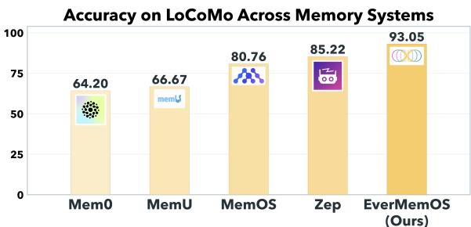
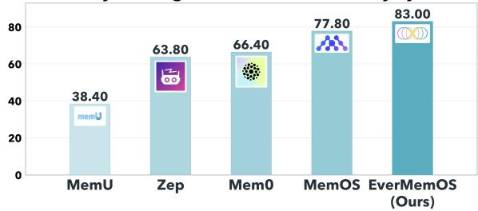
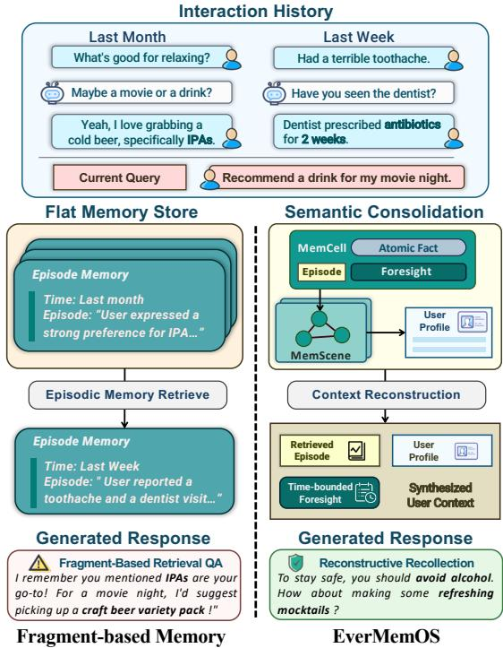
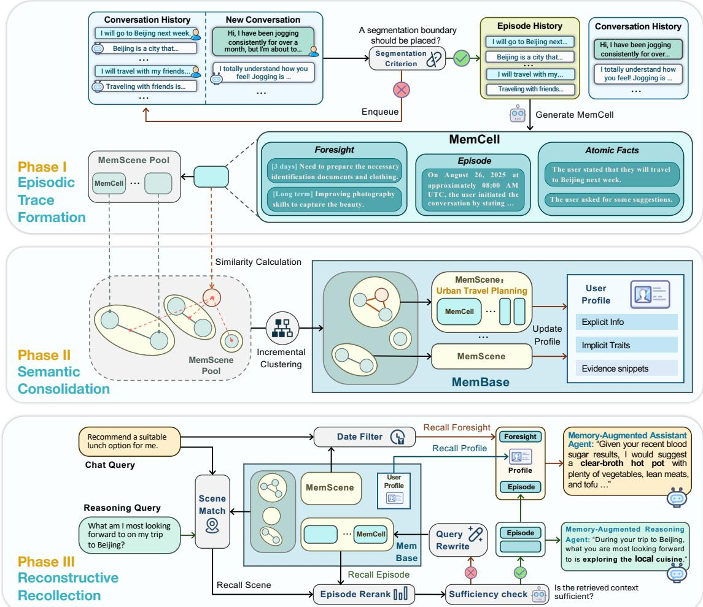
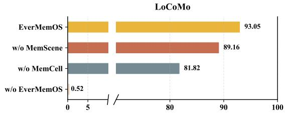
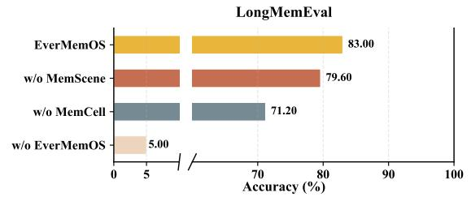
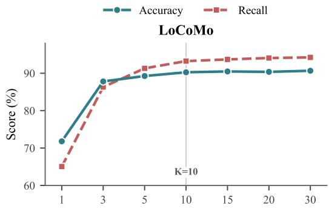
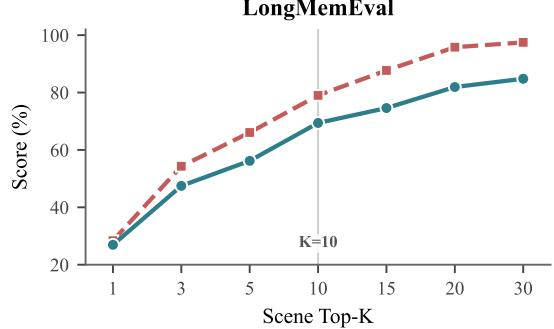
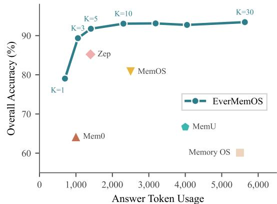
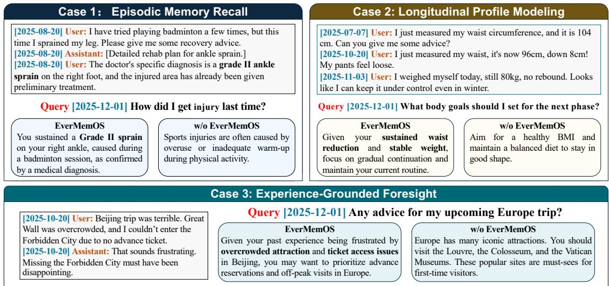

# EverMemOS: A Self-Organizing Memory Operating System for Structured Long-Horizon Reasoning

- 解析器: mineru-cloud 3.4.4（语言 en）
- 转换时间: 2026-09-24T15:35:24.886585+00:00
- 本地 PDF SHA256: `265314799f9803a841a3aeb6fca949ce5eb6923d1d8a450de26843993e1605fd`
- 图片: 22 个，1098 KB；字节已写入 assets/

> 本文件由 MinerU 云端接口转换，转换成功不等于已对 PDF 做视觉核验。
> 表格、公式与图像仍需在使用时核对；引用具体数字请回 pdf/ 定位原文。
> 分隔线之后为转换正文，上方 front matter 是本项目的登记信息。

---

# EverMemOS: A Self-Organizing Memory Operating System for Structured Long-Horizon Reasoning

Chuanrui Hu<sup>1,2</sup>\* , Xingze Gao<sup>1,2</sup>\* , Zuyi Zhou<sup>1,2</sup>, Dannong Xu<sup>1,2</sup>, Yi Bai<sup>1,2</sup>, Xintong Li<sup>1,2</sup>, Hui Zhang<sup>1,2</sup>, Tong Li<sup>1,2</sup>, Chong Zhang<sup>2</sup>, Lidong Bing<sup>2†</sup> , Yafeng Deng<sup>1,2†</sup>

<sup>1</sup>EverMind <sup>2</sup>Shanda Group

{chuanrui.hu, xingze.gao, zuyi.zhou, dannong.xu, baiyi, xintong.li, zhanghui, litong02, zhangchong, lidong.bing, dengyafeng}@shanda.com

## Abstract

Large Language Models (LLMs) are increasingly deployed as long-term interactive agents, yet their limited context windows make it difficult to sustain coherent behavior over extended interactions. Existing memory systems for LLMs often store isolated records and retrieve fragments, limiting their ability to consolidate evolving experience and resolve conflicts. We introduce EverMemOS, a self-organizing memory operating system that implements an engram-inspired lifecycle for computational memory. First, Episodic Trace Formation converts dialogue streams into MemCells that capture episodic traces, atomic facts, and timebounded foresight. Second, Semantic Consolidation organizes MemCells into thematic MemScenes, distilling stable semantic structures and updating user profiles. Finally, Reconstructive Recollection performs MemSceneguided agentic retrieval to compose the necessary and sufficient context for downstream reasoning. Experiments on LoCoMo, Long-MemEval, and PersonaMem-v2 show that EverMemOS significantly outperforms state-ofthe-art methods on memory-augmented reasoning tasks. Our code is available at https: //github.com/EverMind-AI/EverMemOS.

## 1 Introduction

Large Language Models (LLMs) are increasingly deployed as long-term interactive agents rather than transient conversational tools (Yehudai et al., 2025; Ferrag et al., 2025). For providing better personalized services, LLM-based agents must maintain consistent personas and user models over extended interactions while continuously incorporating new constraints over extended timeframes, spanning days, months, or even years. To address this challenge, expanding context windows is a direct approach, but ultra-long contexts still degrade in performance (e.g., the “Lost-in-the-Middle” phenomenon) and incur prohibitive computational costs (Liu et al., 2024). Consequently, recent research has increasingly focused on constructing memory for LLMs that can both store past information and organize experiences into coherent, evolving structures that support long-horizon reasoning (Wu et al., 2025; Maharana et al., 2024).



Accuracy on LongMemEval Across Memory Systems  
  
Figure 1: Evaluation results of different memory methods for LLMs on two benchmarks (LoCoMo and Long-MemEval). All methods are based on GPT-4.1-mini.

Recently, a broad range of memory-augmented approaches have been proposed, including retrievalbased memory (Zhong et al., 2024; Packer et al., 2024), trainable memory (Zheng et al., 2024; Gong et al., 2024), and more recently Memory Operating Systems that unify storage, retrieval, filtering, and updating (Li et al., 2025; Kang et al., 2025). However, enabling long-term consistency in reasoning remains challenging. While these methods improve scalability and modularity, most of them treat memory as flat collections of isolated records. As a result, many failures stem not from missing information but from poor integration, where fragmented experiences are not consolidated into higher-level semantic structures. Without consolidation and ab straction, agents may retrieve relevant facts yet fail to detect conflicts, maintain stable user models, or reason consistently over time. Therefore, a key limitation of existing memory methods is the absence of an explicit mechanism to transform fragmented episodic experiences into coherent and stable knowledge structures that support long-horizon reasoning.

To address the above limitation, we propose EverMemOS, a unified and product-ready Memory Operating System that models memory as a dynamic lifecycle for long-term LLM-based agents. As shown in Figure 1, EverMemOS significantly outperforms the state-of-the-art memory methods for LLMs in experimental evaluation, relatively improving overall accuracy by 9.2% on LoCoMo and 6.7% on LongMemEval compared to the strongest baseline method. EverMemOS aims to transform fragmented episodic experiences into coherent and stable knowledge structures that support long-horizon reasoning through three phases. First, Episodic Trace Formation transforms the unbounded stream of interaction history into discrete, stable memory traces (termed MemCells). Second, Semantic Consolidation transforms MemCells into stable, scene-level structures (termed Mem-Scenes) that support coherent aggregation, such as maintaining consistent user profiles across interactions. Finally, Reconstructive Recollection, guided by the principle of necessity and sufficiency, actively composes only the grounded context required for a given query and supports long-horizon reasoning, rather than indiscriminately retrieving all potentially relevant records.

EverMemOS does not aim to simulate biological memory at the neural level. Instead, it draws on organizing principles from biological memory systems and translates them into a computational framework. Figure 2 illustrates the intuition behind EverMemOS. A fragment-based system may recall a user’s preference for IPA and recommend an alcoholic drink, failing to account for a newly introduced constraint that the user is taking antibiotics. In contrast, EverMemOS consolidates these experiences into a coherent representation of the user’s state, enabling the agent to safely recommend a non-alcoholic alternative. Although such foresight-oriented behaviors are not explicitly captured by existing benchmarks, they expose a fundamental limitation of fragment-based memory and motivate the system-level design of EverMemOS. Empirically, comprehensive experiments on three benchmarks for memory-augmented reasoning consistently indicate the superiority of EverMemOS, compared to the state-of-the-art methods.

  
Figure 2: Comparison of typical fragment-based memory and EverMemOS in an interactive chat scenario.

Our contributions are summarized as follows:

• System Design: We introduce EverMemOS, a unified and product-ready Memory Operating System for LLMs that reconceptualizes memory as a lifecycle, shifting from passive storage of records to structured organization of experience.

• Innovative Method: We propose a threephase method that can transform fragmented episodic experiences into coherent and stable knowledge structures that support longhorizon reasoning.

• Empirical Validation: Experimental results demonstrate that EverMemOS achieves state-of-the-art performance on multiple longcontext benchmarks for memory-augmented reasoning, validating the effectiveness of lifecycle-based memory organization.

## 2 Related Work

## 2.1 Memory Mechanisms in LLMs

Context Window Extension. Large language models (LLMs) are constrained by fixed-length context windows. Prior work extends context via sparse attention (Beltagy et al., 2020; Zaheer et al., 2020), recurrence (Dai et al., 2019; Bulatov et al., 2022), and length extrapolation (Chen et al., 2024, 2025). However, longer context does not guarantee effective utilization: the “Lost-in-the-Middle” phenomenon persists (Liu et al., 2024; Bulatov et al., 2023), suggesting context extension alone is insufficient for durable memory.

Retrieval-Augmented and Parametric Memory. Retrieval-augmented generation (RAG) (Lewis et al., 2020) externalizes memory to alleviate window limits, but its reliability depends on retrieval quality (Ram et al., 2023). Parametric approaches internalize information, yet often suffer from forgetting and instability (De Lange et al., 2022). Hybrid approaches (Wang et al., 2023; Packer et al., 2024) alleviate issues but lack a unified organizational principle for persistent memory.

## 2.2 Memory Systems

Early Computational Memory. Early differentiable memory systems (e.g., NTM/DNC/Key– Value memories) (Graves et al., 2014, 2016; Miller et al., 2016) introduced external memory interaction, but scale poorly and are ill-suited to modern autoregressive LLMs.

Memory in LLM Agents. As LLM-based agents evolve (Xi et al., 2023; Xia et al., 2024), memory systems have shifted toward persistent state integration. Recent systems introduce episodic (Wang and Chen, 2025), semantic (Shinn et al., 2024), and hierarchical task memory (Sun and Zeng, 2025). However, many designs still rely on fragmented text units and limited consolidation, which can degrade long-horizon performance (Packer et al., 2024).

Memory Operating Systems. Recent work formalizes memory management as a system-level runtime. Some focus on lifecycle and capacity, such as Nemori’s (Nan et al., 2025) predictiondriven updates and MemoryOS’s (Kang et al., 2025) hierarchical control. Others, like Mem0 (Chhikara et al., 2025) and $Z e p$ (Rasmussen et al., 2025), prioritize structured fact maintenance via knowledge graphs, while MemOS (Li et al., 2025) targets unified scheduling across memory types.

While these systems advance structural organization, they primarily focus on storage optimization or fact maintenance. EverMemOS distinguishes itself by implementing a three-phase memory lifecycle that transforms episodic traces into synthesized semantic structures for long-horizon reasoning.

## 3 EverMemOS

## 3.1 Framework Overview

Drawing inspiration from the biological engram lifecycle (Josselyn et al., 2015), EverMemOS follows a three-phase workflow (Figure 3): (1) Episodic Trace Formation encodes interaction streams into MemCells; (2) Semantic Consolidation organizes MemCells into MemScenes and updates user profiles; and (3) Reconstructive Recollection performs MemScene-guided retrieval under the principle of necessity and sufficiency.

## 3.2 Memory Primitives

At the core of EverMemOS is the MemCell, the atomic unit bridging low-level data and high-level semantics. Formally, a MemCell c is a tuple c = $( E , { \mathcal { F } } , P , M )$ , where:

• E (Episode): A concise third-person narrative of the event, serving as the semantic anchor.

$\mathcal { F } = \{ f _ { 1 } , \ldots , f _ { n } \}$ (Atomic Facts): Discrete, verifiable statements derived from E for highprecision matching.

• P (Foresight): Forward-looking inferences (prospections; e.g., plans and temporary states) annotated with validity intervals $[ t _ { s t a r t } , t _ { e n d } ]$ to support temporal awareness.

• M (Metadata): Contextual grounding including timestamps and source pointers.

This structure turns memory from a static record $( E , { \mathcal { F } } )$ into a temporally grounded representation that also supports Foresight (P).

## 3.3 Phase I: Episodic Trace Formation

Grounded in the engram concept (Josselyn et al., 2015), this first phase transforms the unbounded stream of interaction history $\mathcal { D } = \{ d _ { 1 } , \ldots , d _ { T } \}$ into discrete, stable memory traces (MemCells). This process adopts a three-step pipeline to distill semantic signal from noisy interaction data:

  
Figure 3: The EverMemOS workflow mirrors an engram-inspired memory lifecycle: (1) Episodic Trace Formation segments continuous dialogue into MemCells with episodes, atomic facts, and time-bounded foresight. (2) Semantic Consolidation organizes MemCells into MemScenes and updates a user profile. (3) Reconstructive Recollection performs MemScene-guided retrieval to compose the necessary and sufficient context.

Contextual Segmentation To discretize continuous streams, a Semantic Boundary Detector processes interactions via a sliding window. Upon detecting a topic shift, accumulated turns are encapsulated as a raw episode history. We implement this step via LLM prompting; while boundary detection is not perfect, we find it robust in downstream evaluation (see Table 3).

Narrative Synthesis To resolve dialogue redundancy and ambiguity, the episode history is synthesized into a high-fidelity Episode (E). This rewriting process produces a concise, third-person narrative with resolved coreferences, establishing a stable semantic anchor.

Structural Derivation From E, the system extracts Atomic Facts (F) for precise matching and generates Foresight signals (P) with inferred validity intervals (e.g., distinguishing temporary "flu" from permanent "graduation"). Concretely, we prompt the LLM over the rewritten Episode E to output a constrained schema of Atomic Facts and Foresight signals with validity intervals [t , t ]. These components are bundled with metadata M to form the final MemCell c.

## 3.4 Phase II: Semantic Consolidation

Inspired by systems consolidation (McGaugh, 2000), EverMemOS employs an online mechanism that organizes MemCells into higher-order structures to transition from transient episodes to stable long-term knowledge.

Incremental Semantic Clustering EverMemOS organizes memory dynamically. When a new Mem-Cell c arrives, the system computes its embedding and retrieves the nearest MemScene centroid. If similarity exceeds a threshold τ, c is assimilated and the scene representation is incrementally updated; otherwise, a new MemScene is instantiated. This online process maintains thematic structure in real-time without batch reprocessing.

Scene-Driven Profile Evolution Scene-level consolidation can also update a compact User Profile from aggregated evidence. When a new Mem-Cell is assimilated into a MemScene, EverMemOS updates a concise scene summary and refreshes the user profile by prompting over these summaries (rather than individual turns), helping separate stable traits from temporary states. We maintain a compact profile of explicit facts (including timevarying measurements) and implicit traits, updated online from scene summaries with recency-aware updates and conflict tracking (Appendix B.3).

## 3.5 Phase III: Reconstructive Recollection

Building on theories of reconstructive memory (Schacter, 2008), retrieval in EverMemOS is modeled not as a static lookup but as an active Reconstruction process, guided by the principle of necessity and sufficiency. Given a query q, Ever-MemOS performs agentic retrieval grounded in MemScenes.

MemScene Selection We first compute relevance between the query and all MemCells by fusing dense and BM25 retrieval over their Atomic Facts F via Reciprocal Rank Fusion (RRF). We then score each MemScene by the maximum relevance among its constituent MemCells and select a small set of the highest-scoring MemScenes.

Episode and Foresight Filtering Within the selected MemScenes, we pool Episodes from their constituent MemCells and re-rank them to select a compact set for downstream inference. We then apply Foresight Filtering, retaining only timevalid Foresight whose validity intervals satisfy $t _ { n o w } \in [ t _ { s t a r t } , t _ { e n d } ]$ (discarding expired ones).

Agentic Verification and Query Rewriting The retrieved context is evaluated by an LLM-based verifier for sufficiency. If it is deemed insufficient, the system triggers a query rewriting step to supplement retrieval; otherwise, the context is passed to the downstream module. Prompt templates are provided in Appendix C.1.

Task Modes We consider two downstream settings that share the same retrieval pipeline: Memory-Augmented Reasoning and Memory-Augmented Chat. For Reasoning, we use the retrieved Episodes as context for benchmark evaluation. For Chat, the composed context additionally incorporates the User Profile and timevalid Foresight signals, filtered by the current time $t _ { n o w } \in [ t _ { s t a r t } , t _ { e n d } ] ;$ since these capabilities are not covered by existing reasoning benchmarks, we present them through qualitative case studies.

## 4 Experiments

We evaluate EverMemOS on two long-horizon memory-augmented reasoning benchmarks (Lo-CoMo (Maharana et al., 2024) and Long-MemEval (Wu et al., 2025)), and report a profile study on PersonaMem-v2 (Jiang et al., 2025).

## 4.1 Experimental Setup

Benchmarks We evaluate memory-augmented reasoning on LoCoMo and LongMemEval. Lo-CoMo contains 1,540 questions over 10 ultra-long dialogues (∼9K tokens each), spanning single-hop, multi-hop, and temporal questions. LongMemEval (S-setting, ∼115k tokens per conversation) evaluates 500 questions requiring full-history parsing across core capabilities (e.g., updates and abstention). We additionally evaluate user profiling on PersonaMem-v2.

Baselines We compare EverMemOS against state-of-the-art memory systems: Zep (Rasmussen et al., 2025), Mem0 (Chhikara et al., 2025), MemOS (Li et al., 2025), MemoryOS (Kang et al., 2025), and MemU<sup>1</sup>. Fair comparison: We standardize the answer-generation backbone across methods while keeping each baseline’s official memory configuration unchanged; for Long-MemEval, we report baseline scores from the official MemOS leaderboard. Full settings are provided in Appendix A.1.

Evaluation Protocol We adopt the LLM-as-ajudge protocol, following MemOS: each answer is evaluated by GPT-4o-mini and two auxiliary judge models, and scores are averaged across the three judgments in a blind setting. We validate the reliability of this protocol against human annotations in Section A.2 (Appendix), showing high agreement (Cohen’s κ > 0.89).

Implementation Details EverMemOS uses GPT-4.1-mini (or GPT-4o-mini where specified) for all reasoning and memory operations. Retrieval uses hybrid dense+BM25 fusion (RRF) with reranking. Default retrieval hyperparameters are in

Appendix A.1. Unless otherwise specified, quantitative experiments use Memory-Augmented Reasoning. We provide a token-level cost breakdown by lifecycle phase in Appendix (Table 8).

## 4.2 Main Results

Main results on two benchmarks are reported in Tables 1-2. We make three observations:

(1) Lifecycle-driven performance gains. EverMemOS outperforms the strongest baseline on each benchmark overall, i.e., Zep on LoCoMo by 7.0% and 9.2%, and MemOS on LongMemEval by 6.7%. We attribute this to the shift from flat memory storage to a structured lifecycle, which consolidates fragmented experiences into usable knowledge before retrieval, providing a more robust context than isolated record matching.

(2) Structural consolidation aids complex reasoning that requires integrating dispersed evidence. We can observe significant gains on Lo-CoMo multi-hop (+19.7%) and temporal (+10.0%) tasks, as well as LongMemEval knowledge update (+20.6%), validating the effectiveness of Mem-Scenes. By clustering related episodes into coherent thematic units, EverMemOS presents the solver with a complete narrative context. This enables LLMs to naturally bridge dispersed evidence and resolve state conflicts that confuse other models relying on fragmented retrieval.

(3) EverMemOS offers a favorable accuracyefficiency trade-off. As shown in Figure 6 , EverMemOS attains high accuracy with moderate retrieval budgets. This efficiency confirms the utility of the Reconstructive Recollection phase, where the agentic sufficiency check ensures the context is composed of necessary and sufficient evidence, avoiding the noise accumulation common in fixedbudget retrieval.

## 4.3 Ablation Study

We conduct ablations on LoCoMo to isolate the contributions of MemScenes, MemCells, and episode segmentation.

Impact of Memory Architecture. To isolate the contribution of memory structure, we compare EverMemOS with three degraded variants: w/o EverMemOS (no external memory), w/o MemScene (flat retrieval over MemCells), and w/o MemCell (retrieval over raw dialogue). The backbone model and prompts are fixed, and only the memory representation and retrieval pipeline are varied.



  
Figure 4: Ablation results (overall accuracy) on Lo-CoMo and LongMemEval.



  
Figure 5: Sensitivity analysis on the MemScene count (N).

As shown in Figure 4, performance degrades stepwise as structure is removed, revealing three corresponding capability losses. Removing Mem-Scenes eliminates scene-level organization, weakening cross-turn aggregation over related episodes. Removing MemCells further drops the stable semantic units (episodes/facts), forcing retrieval to rely on raw dialogue matching. Finally, removing external memory collapses long-horizon performance, indicating that many queries cannot be handled reliably within the context window alone.

Effectiveness of Episode Segmentation. We evaluate semantic episode segmentation against fixed heuristics and ground-truth boundaries under w/o MemScene to isolate boundary quality.

<table><tr><td>Method</td><td>Avg. Tokens</td><td>Single Hop</td><td>Multi Hop</td><td>Temporal</td><td>Open Domain</td><td>Overall</td></tr><tr><td colspan="7">GPT-4o-mini backbone</td></tr><tr><td>MemoryOS</td><td>5.2k</td><td>62.43</td><td>56.50</td><td>37.18</td><td>40.28</td><td>54.70</td></tr><tr><td>Mem0</td><td>1.0k</td><td>66.71</td><td>58.16</td><td>55.45</td><td>40.62</td><td>61.00</td></tr><tr><td>MemU</td><td>4.0k</td><td>72.77</td><td>62.41</td><td>33.96</td><td>46.88</td><td>61.15</td></tr><tr><td>MemOS</td><td>2.5k</td><td>81.45</td><td>69.15</td><td>72.27</td><td>60.42</td><td>75.87</td></tr><tr><td>Zep</td><td>1.4k</td><td>88.11</td><td>71.99</td><td>74.45</td><td>66.67</td><td>81.06</td></tr><tr><td>EverMemOS</td><td>2.5k</td><td>91.08 (↑3.4%)</td><td>86.17 (↑19.7%)</td><td>81.93 (↑10.0%)</td><td>66.67 (↑0.0%)</td><td>86.76 (↑7.0%)</td></tr><tr><td colspan="7">GPT-4.1-mini backbone</td></tr><tr><td>MemoryOS</td><td>5.5k</td><td>67.30</td><td>59.34</td><td>42.26</td><td>59.03</td><td>60.11</td></tr><tr><td>Mem0</td><td>1.0k</td><td>68.97</td><td>61.70</td><td>58.26</td><td>50.00</td><td>64.20</td></tr><tr><td>MemU</td><td>4.0k</td><td>74.91</td><td>72.34</td><td>43.61</td><td>54.17</td><td>66.67</td></tr><tr><td>MemOS</td><td>2.5k</td><td>85.37</td><td>79.43</td><td>75.08</td><td>64.58</td><td>80.76</td></tr><tr><td>Zep</td><td>1.4k</td><td>90.84</td><td>81.91</td><td>77.26</td><td>75.00</td><td>85.22</td></tr><tr><td>EverMemOS</td><td>2.3k</td><td>96.67 (↑6.4%)</td><td>91.84 (↑12.1%)</td><td>89.72 (↑16.1%)</td><td>76.04 (↑1.4%)</td><td>93.05 (↑9.2%)</td></tr></table>

Table 1: Main results on LoCoMo under two backbones. All metrics are accuracy (%), except Avg. Tokens. For EverMemOS, values in parentheses denote relative change (%) compared to the strongest baseline under the same backbone.

<table><tr><td>Method</td><td>Token</td><td>SS-User</td><td>SS-Asst</td><td>SS-Pref</td><td>Multi-S</td><td>Know. Upd</td><td>Temp. Reas</td><td>Overall</td></tr><tr><td>MemU</td><td>0.5k</td><td>67.14</td><td>19.64</td><td>76.67</td><td>42.10</td><td>41.02</td><td>17.29</td><td>38.40</td></tr><tr><td>Zep</td><td>1.6k</td><td>92.90</td><td>75.00</td><td>53.30</td><td>47.40</td><td>74.40</td><td>54.10</td><td>63.80</td></tr><tr><td>Mem0</td><td>1.1k</td><td>82.86</td><td>26.78</td><td>90.00</td><td>63.15</td><td>66.67</td><td>72.18</td><td>66.40</td></tr><tr><td>MemOS</td><td>1.4k</td><td>95.71</td><td>67.86</td><td>96.67</td><td>70.67</td><td>74.26</td><td>77.44</td><td>77.80</td></tr><tr><td>EverMemOS</td><td>2.8k</td><td>97.14 (↑1.5%)</td><td>85.71 (↑14.3%)</td><td>93.33 (↓3.5%)</td><td>73.68 (↑4.3%)</td><td>89.74 (↑20.6%)</td><td>77.44 (↑0.0%)</td><td>83.00 (↑6.7%)</td></tr></table>

Table 2: Main results on LongMemEval (accuracy, %). SS denotes single-session tasks; baselines are from the official MemOS results (Li et al., 2025). For EverMemOS, values in parentheses denote relative change (%) compared to the strongest baseline for that metric

  
Figure 6: Performance vs. cost frontier on LoCoMo by varying the retrieved episode count (K).

We compare three strategies: (1) Fixed Heuristics (fixed message count N = 10 or token thresholds N = 512, 1024); (2) Session (Oracle) (groundtruth session boundaries); and (3) EverMemOS (semantic segmentation with different backbones).

Table 3 shows that (i) semantic segmentation consistently outperforms fixed heuristics, especially coarse token chunking; (ii) it also outperforms Session (Oracle), suggesting sessions are not always optimal retrieval units; and (iii) results are robust across boundary-detection backbones (accuracy changes ≤0.7 points).

<table><tr><td rowspan="2">Segmentation Method</td><td colspan="2">Answer Model</td></tr><tr><td>GPT-4.1-mini</td><td>Qwen3-4B</td></tr><tr><td colspan="3">Heuristic Baselines</td></tr><tr><td>Fixed-Message-10</td><td>88.05</td><td>80.95</td></tr><tr><td>Fixed-Token-512</td><td>87.55</td><td>80.67</td></tr><tr><td>Fixed-Token-1024</td><td>84.52</td><td>75.19</td></tr><tr><td colspan="3">Semantic Segmentation</td></tr><tr><td>Session (Oracle)</td><td>87.66</td><td>80.63</td></tr><tr><td colspan="3">Default (EverMemOS)</td></tr><tr><td>w/ GPT-4.1-mini</td><td>89.16</td><td>83.07</td></tr><tr><td>w/ Qwen3-4B</td><td>89.78</td><td>82.73</td></tr></table>

Table 3: Comparison of boundary detection strategies. Session (Oracle) uses the ground-truth session partitions provided by LoCoMo.

## 4.4 Hyperparameter Analysis

We investigate the impact of retrieval scope via two hyperparameters: the number of retrieved MemScenes (N) and episodes (K). As shown in Figure 5, performance gains saturate around N = 10. Figure 6 further illustrates the efficiency– accuracy frontier governed by K. We therefore adopt N = 10 and K = 10 as the default configuration to balance performance with computational cost. Comprehensive sensitivity analysis is detailed in Appendix B.1.

  
Figure 7: Case studies illustrating Profile, Foresight, and Episode capabilities in Memory-Augmented Chat.

<table><tr><td>Scenario</td><td>Ep.+Prof.</td><td>Prof.-only</td><td>Ep.-only</td></tr><tr><td>Consultation</td><td>51.03</td><td>47.33</td><td>44.44</td></tr><tr><td>Email (Personal)</td><td>53.85</td><td>46.15</td><td>46.15</td></tr><tr><td>Translation</td><td>50.00</td><td>46.15</td><td>38.08</td></tr><tr><td>Email (Professional)</td><td>53.79</td><td>41.38</td><td>45.17</td></tr><tr><td>Writing (Creative)</td><td>55.10</td><td>48.57</td><td>42.04</td></tr><tr><td>Writing (Professional)</td><td>45.56</td><td>44.79</td><td>40.15</td></tr><tr><td>Knowledge Query</td><td>63.68</td><td>62.94</td><td>54.73</td></tr><tr><td>Social Media</td><td>47.90</td><td>44.96</td><td>36.13</td></tr><tr><td>Chat</td><td>52.09</td><td>44.87</td><td>41.83</td></tr><tr><td>Overall</td><td>53.25</td><td>48.30</td><td>43.93</td></tr></table>

Table 4: Profile ablation on PersonaMem v2 (Jiang et al., 2025) (5,000 questions across 9 scenarios; accuracy, %).

## 4.5 Profile Study

We evaluate the effect of the consolidated user profile on PersonaMem-v2 (32k) (Jiang et al., 2025); results are not directly comparable across dataset versions due to differences in task setup and annotations. Table 4 shows that adding the User Profile to episodic evidence improves overall accuracy by 9.32 points over episodes-only (53.25 vs. 43.93), indicating that semantic consolidation provides complementary signal beyond episodic retrieval. We defer the full comparison against other memory systems on PersonaMem-v2 to Appendix A.4.

## 4.6 Case Study

Existing benchmarks primarily evaluate answerlevel accuracy/recall and do not capture several capabilities required for long-term conversational agents, such as conflict detection, profile stability, and experience-grounded foresight. To complement quantitative results, Figure 7 shows three representative cases: (Episode) reconstructing a concrete past injury episode (a Grade-II ankle sprain during badminton) rather than producing a generic explanation; (Profile) maintaining longitudinal stability and using sustained improvements (waist 104→96 cm with stable weight) for trajectoryconsistent goal setting; and (Foresight) leveraging previously observed failures (overcrowding and missing advance tickets) to make proactive recommendations for future travel. Together, these cases illustrate coherent, experience-aware behavior beyond what is measured by existing benchmarks.

## 5 Conclusion

In this paper, we introduced EverMemOS, a unified memory operating system for long-horizon LLM agents. By modeling an explicit memory lifecycle composed of episodic trace formation, semantic consolidation, and reconstructive recollection, EverMemOS achieves state-of-the-art performance on memory-augmented reasoning benchmarks, with particularly strong gains on multi-hop and temporal questions. We hope EverMemOS provides an extensible foundation for building more consistent and context-aware interactive agents.

## Limitations

We evaluate EverMemOS on text-only conversational benchmarks. Although the MemCell and MemScene abstraction is modality-agnostic, extending EverMemOS to multimodal or embodied settings is beyond the scope of this work. Ever-MemOS introduces LLM-mediated operations for memory construction and retrieval, increasing latency and computational cost relative to single-pass baselines. While many components can be cached, batched, or run asynchronously, improving end-toend efficiency remains future work. Finally, current benchmarks lack protocols for stress-testing ultralong timelines, so our evaluation does not fully isolate performance in such regimes. This motivates future benchmarks for long-term memory organization and consolidation.

## References

Iz Beltagy, Matthew E Peters, and Arman Cohan. 2020. Longformer: The long-document transformer. In Proceedings of the 58th Annual Meeting of the Association for Computational Linguistics. Association for Computational Linguistics.

Atilim Gunes Bulatov, Valentin Khrulkov, Leyla Mirvakhabova, Alexey Markov, Artem Babenko, and Ivan Oseledets. 2022. Recurrent memory transformer. In Advances in Neural Information Processing Systems, pages 20230–20243.

Aydar Bulatov, Yuri Kuratov, and Mikhail S. Burtsev. 2023. Scaling transformer to 1m tokens and beyond with rmt. ArXiv, abs/2304.11062.

Guanzheng Chen, Xin Li, Zaiqiao Meng, Shangsong Liang, and Lidong Wang. 2024. Clex: Continuous length extrapolation for large language models. In International Conference on Learning Representations.

Guanzheng Chen, Xin Li, Michael Qizhe Shieh, and Lidong Bing. 2025. LongPO: Long context selfevolution of large language models through shortto-long preference optimization. In The Thirteenth International Conference on Learning Representations.

Prateek Chhikara, Dev Khant, Saket Aryan, Taranjeet Singh, and Deshraj Yadav. 2025. Mem0: Building production-ready ai agents with scalable long-term memory. Preprint, arXiv:2504 19413

Zihang Dai, Zhilin Yang, Yiming Yang, Jaime Carbonell, Quoc V Le, and Ruslan Salakhutdinov. 2019. Transformer-XL: Attentive language models beyond a fixed-length context. In Proceedings of the 57th Annual Meeting ofthe Associationfor Computational Linguistics, pages 2978–2988. Association for Com putational Linguistics.

Matthias De Lange, Rahaf Aljundi, Marc Masana, Sarah Parisot, Xu Jia, Aleš Leonardis, Greg Slabaugh, and Tinne Tuytelaars. 2022. A continual learning survey: Defying forgetting in classification tasks. IEEE Transactions on Pattern Analysis and Machine Intel ligence, 44(7):3366–3385.

Mohamed Amine Ferrag, Norbert Tihanyi, and Merouane Debbah. 2025. From llm reasoning to autonomous ai agents: A comprehensive review. arXiv preprint arXiv:2504.19678.

Yue Gong and 1 others. 2024. M+: An efficient memory structure for large language models. arXiv preprint arXiv:2404.09337.

Alex Graves, Greg Wayne, and Ivo Danihelka. 2014. Neural turing machines. arXiv preprint arXiv:1410.5401.

Alex Graves, Greg Wayne, Malcolm Reynolds, Tim Harley, Ivo Keck, William O’Brien, Alistair Kritzman, Stanislav Illarionov, Edward Grefenstette, Tiago Wuthrich, and 1 others. 2016. Hybrid computing using a neural network with dynamic external memory. Nature, 538(7626):471–476.

Bowen Jiang, Yuan Yuan, Maohao Shen, Zhuoqun Hao, Zhangchen Xu, Zichen Chen, Ziyi Liu, Anvesh Rao Vijjini, Jiashu He, Hanchao Yu, Radha Poovendran, Gregory Wornell, Lyle Ungar, Dan Roth, Sihao Chen, and Camillo Jose Taylor. 2025. Personamem-v2: Towards personalized intelligence via learning implicit user personas and agentic memory. arXiv preprint arXiv:2512.06688.

Sheena A Josselyn, Stefan Köhler, and Paul W Frankland. 2015. Finding the engram. Nature Reviews Neuroscience, 16(9):521–534.

Jiazheng Kang, Mingming Ji, Zhe Zhao, and Ting Bai. 2025. Memory os of ai agent. arXiv preprint arXiv:2506.06326.

Patrick Lewis, Ethan Perez, Aleksandra Piktus, Fabio Petroni, Vladimir Karpukhin, Naman Goyal, Yuxiang Kukliansky, Wen-tau Yih Chen, Tim Rocktäschel, Sebastian Riedel, and Douwe Kiela. 2020. Retrievalaugmented generation for knowledge-intensive nlp tasks. In Advances in Neural Information Processing Systems, volume 33, pages 9459–9474.

Zhiyu Li, Shichao Song, Chenyang Xi, Hanyu Wang, Chen Tang, Simin Niu, Ding Chen, Jiawei Yang, Chunyu Li, Qingchen Yu, and 1 others. 2025. Memos: A memory os for ai system. arXiv preprint arXiv:2507.03724.

Nelson F Liu, Kevin Lin, John Hewitt, Ashwin Paranjape, Michele Bevilacqua, Fabio Petroni, and Percy Liang. 2024. Lost in the middle: How language models use long contexts. Transactions ofthe Association for Computational Linguistics, 12:157–173.

Adyasha Maharana, Dong-Ho Lee, Sergey Tulyakov, Mohit Bansal, Francesco Barbieri, and Yuwei Fang. 2024. Evaluating very long-term conversational memory of llm agents. Preprint, arXiv:2402.17753.

James L McGaugh. 2000. Memory–a century of consolidation. Science, 287(5451):248–251.

Alexander Miller, Adam Fisch, Jesse Dodge, Amir-Hossein Karimi, Antoine Bordes, and Jason Weston. 2016. Key-value memory networks for directly reading documents. In Proceedings of the 2016 Conference on Empirical Methods in Natural Language Processing, pages 1400–1409. Association for Computational Linguistics.

Jiayan Nan, Wenquan Ma, Wenlong Wu, and Yize Chen. 2025. Nemori: Self-organizing agent memory inspired by cognitive science. Preprint, arXiv:2508.03341.

Charles Packer, Vivian Woodside, Neal Dhir, and Douwe Kiela. 2024. Memgpt: Towards llms as operating systems. In Advances in Neural Information Processing Systems.

Ori Ram, Eyal Shnarch, Jonathan Uziel, Lisa Haklay, and Amir Globerson. 2023. In-context retrieval augmented language models. Transactions of the Associationfor Computational Linguistics, 11:1316– 1331.

Preston Rasmussen, Pavlo Paliychuk, Travis Beauvais, Jack Ryan, and Daniel Chalef. 2025. Zep: A temporal knowledge graph architecture for agent memory. Preprint, arXiv:2501.13956.

Daniel L Schacter. 2008. Searching for memory: The brain, the mind, and the past. Basic books.

Noah Shinn, Federico Cassano, Ashwin Gopinath, Karthik Narasimhan, and Shunyu Yao. 2024. Reflexion: Language agents with verbal reinforcement learning. In Advances in Neural Information Pro cessing Systems, volume 36.

Haoran Sun and Shaoning Zeng. 2025. Hierarchical memory for high-efficiency long-term reasoning in llm agents. arXiv preprint arXiv:2507.22925.

Weizhi Wang, Li Dong, Hao Cheng, Xiaodong Liu, Xifeng Yan, Jianfeng Gao, and Furu Wei. 2023. Longmem: Augmenting language models with longterm memory. In Advances in Neural Information Processing Systems, volume 36, pages 20292–20306.

Yu Wang and Xi Chen. 2025. Mirix: Multi-agent memory system for llm-based agents. arXiv preprint arXiv:2507.07957.

Di Wu, Hongwei Wang, Wenhao Yu, Yuwei Zhang, Kai-Wei Chang, and Dong Yu. 2025. Longmemeval: Benchmarking chat assistants on long-term interactive memory. Preprint, arXiv:2410.10813.

Zhiheng Xi, Wenxiang Chen, Xin Guo, Wei He, Yi Ding, Boyang Hong, Ming Zhang, Junzhe Wang, Senjie Jin, Enyu Zhou, and 1 others. 2023. The rise and potential of large language model based agents: A survey. arXiv preprint arXiv:2309.07864.

Chun Xia, Yinlin Deng, Soren Dunn, and Lingming Zhang. 2024. Agentless: Demystifying llm-based software engineering agents. ArXiv, abs/2407.01489.

Asaf Yehudai, Lilach Eden, Alan Li, Guy Uziel, Yilun Zhao, Roy Bar-Haim, Arman Cohan, and Michal Shmueli-Scheuer. 2025. Survey on evaluation of llmbased agents. arXiv preprint arXiv:2503.16416.

Manzil Zaheer, Guru Guruganesh, Avinava Dubey, Joshua Ainslie, Chris Alberti, Santiago Ontañón, Philip Pham, Anirudh Ravula, Qifan Wang, Li Yang, and Amr Ahmed. 2020. Big Bird: Transformers for longer sequences. In Advances in Neural Information Processing Systems, pages 17283–17296.

Yanzhao Zhang, Mingxin Li, Dingkun Long, Xin Zhang, Huan Lin, Baosong Yang, Pengjun Xie, An Yang, Dayiheng Liu, Junyang Lin, Fei Huang, and Jingren Zhou. 2025. Qwen3 embedding: Advancing text embedding and reranking through foundation models. arXiv preprint arXiv:2506.05176.

Yuan Zheng and 1 others. 2024. Memoryllm: A framework for personalized and long-term dialogue generation. arXiv preprint arXiv:2401.17122.

W Zhong, L Guo, Q Gao, and 1 others. 2024. Memorybank: Enhancing large language models with long-term memory. In Proceedings ofthe AAAI Conference on Artificial Intelligence, volume 38, pages 19724–19731.

## A Evaluation Details

A.1 Evaluation Settings and Fair Comparison LoCoMo backbones. We report LoCoMo results under two backbones: GPT-4.1-mini (primary, reflecting an up-to-date backbone) and GPT-4o-mini (to facilitate comparison with prior work). Following common practice in LTMOS evaluation, we standardize the backbone used forfinal answer generation to isolate the contribution of memory management from the base model.

Baseline executability. For EverMemOS and MemoryOS, we execute the full pipeline (memory construction, retrieval, and answering) with the specified backbone. For Mem0, MemU, MemOS, and Zep, we use their official APIs for memory management/retrieval; in this setting, we keep each baseline’s official memory configuration and prompting unchanged and apply the unified backbone only at the answering stage.

LongMemEval. Due to the extreme input length of LongMemEval, we cannot stably run all baseline APIs end-to-end; we therefore report baseline results from the official MemOS leaderboard<sup>2</sup> and evaluate EverMemOS with GPT-4.1-mini under the same protocol.

Retrieval configuration. EverMemOS uses a hybrid retriever that fuses dense retrieval (encoder: Qwen3-Embedding-4B (Zhang et al., 2025)) and sparse retrieval (BM25) via Reciprocal Rank Fusion (RRF), followed by episode re-ranking (Qwen3-Reranker-4B (Zhang et al., 2025)). Unless otherwise specified, we retrieve the top-10 MemScenes and select 10 Episodes for downstream inference.

MemBase statistics and construction hyperparameters. We report dataset-level MemBase statistics (Table 5) and memory-construction hyperparameters (Table 6) for LoCoMo and Long-MemEval. MemScenes are the clustering units produced by Phase II, and each MemScene contains a small set of MemCells. We use the same pipeline across datasets, while adopting datasetspecific clustering hyperparameters to reflect different dialogue structures and time spans. Long-MemEval contains 500 dialogue–question pairs (one per conversation). Max time gap is the maximum allowed temporal distance (in days): when assigning a MemCell A to a candidate MemScene, if the closest-in-time MemCell B already in that MemScene is farther than this threshold, A is not clustered into that MemScene.

Table 5: MemBase statistics on LoCoMo and Long-MemEval.

<table><tr><td>Metric</td><td>LoCoMo</td><td>LongMemEval</td></tr><tr><td>Dataset scale</td><td></td><td></td></tr><tr><td>#Conversations</td><td>10</td><td>500</td></tr><tr><td>#Questions</td><td>1,540</td><td>500</td></tr><tr><td>MemBase statistics</td><td></td><td></td></tr><tr><td>#Total MemCells</td><td>702</td><td>54,755</td></tr><tr><td>#Total MemScenes</td><td>286</td><td>40,138</td></tr><tr><td>Avg MemCells/conv.</td><td>70.2</td><td>109.5</td></tr><tr><td>Avg MemScenes/conv.</td><td>28.6</td><td>80.3</td></tr><tr><td>Avg MemCells/MemScene</td><td>2.45</td><td>1.36</td></tr><tr><td>MemCells/conv. (range)</td><td>34–95</td><td>82–154</td></tr><tr><td>MemScenes/conv. (range)</td><td>13–49</td><td>60–102</td></tr></table>

Table 6: Memory-construction hyperparameters.

<table><tr><td>Hyperparameter</td><td>LoCoMo</td><td>LongMemEval</td></tr><tr><td>Clustering threshold  $\tau$ </td><td>0.70</td><td>0.50</td></tr><tr><td>Max time gap (days)</td><td>7</td><td>30</td></tr></table>

Multi-round query rewriting frequency. On LoCoMo (GPT-4.1-mini), the sufficiency checker triggers a second-round query rewriting for 31.0% of questions.

Default evaluation mode. Unless otherwise specified, quantitative experiments use Memory-Augmented Reasoning (Episodes-only). We additionally report the effect of the consolidated Profile in Table 4, while Foresight is illustrated in the qualitative Case Study (Memory-Augmented Chat).

## A.2 LLM-as-Judge Reliability

We randomly selected 25 non-overlapping Q&A pairs from LoCoMo and 25 from LongMemEval, and generated model answers for each question. We recruited annotators via Prolific. For each Q&A pair, five independent human evaluators judged whether the generated answer was correct given the question and the reference answer. All participants provided informed consent via the platform interface and were compensated at approximately \$12.00/hour, consistent with fair-pay guidelines for academic research and above local minimum wage standards. Table 7 shows strong agreement between the LLM-as-judge protocol and human annotations: Cohen’s κ exceeds 0.89 and accuracy remains above 98% across benchmarks. Pearson r is 0.891 on LoCoMo and 0.979 on LongMemEval. These results suggest that GPT-4o-mini achieves human-level reliability for answer verification, enabling evaluation that is rigorous, reproducible, and cost-efficient.

Table 7: Reliability matrix for LLM-as-Judge.

<table><tr><td>Model</td><td>Cohen&#x27;s κ</td><td>95% CI</td><td>Accuracy</td><td>Pearson r</td></tr><tr><td>LoCoMo</td><td>0.891</td><td>[0.742, 1.000]</td><td>0.984</td><td>0.891</td></tr><tr><td>LongMemEval</td><td>0.978</td><td>[0.936, 1.000]</td><td>0.992</td><td>0.979</td></tr></table>

## A.3 Token Cost Breakdown

To improve cost transparency, we log all LLM API calls during LoCoMo evaluation (1,540 questions) under two backbones (GPT-4.1-mini and GPT-4omini) and attribute token usage to stages in our pipeline. Since LoCoMo evaluation uses Memory-Augmented Reasoning (Episodes-only), we do not invoke the Profile module; therefore, profilerelated tokens are excluded from Table 8. Table 8 maps stages to EverMemOS phases. Phase I corresponds to memory construction (add). In this Episodes-only setting, Phase II uses non-LLM computation (clustering/embedding updates) and thus incurs no additional LLM tokens. Phase III consists of retrieval (search) and answer generation (answer). The evaluate stage reflects LLM-asjudge scoring (three judges per question) and is reported separately. Phase III consumes 10.27M tokens (∼6.7k/question) with GPT-4.1-mini and 9.31M tokens (∼6.0k/question) with GPT-4o-mini; Phase I consumes 9.42M and 9.34M tokens, respectively, amortized over memory building.

Table 8: Token-level cost breakdown on LoCoMo (1,540 questions) under two backbones. Tokens are reported in millions (M); Total includes both prompt and completion.

<table><tr><td>Stage</td><td>#Calls</td><td>Prompt (M)</td><td>Total (M)</td></tr><tr><td colspan="4">GPT-4.1-mini</td></tr><tr><td>add</td><td>7056</td><td>8.66</td><td>9.42</td></tr><tr><td>search</td><td>2017</td><td>4.12</td><td>4.45</td></tr><tr><td>answer</td><td>1540</td><td>4.63</td><td>5.82</td></tr><tr><td>search+answer</td><td>3557</td><td>8.75</td><td>10.27</td></tr><tr><td>evaluate</td><td>4620</td><td>2.35</td><td>2.38</td></tr><tr><td colspan="4">GPT-4o-mini</td></tr><tr><td>add</td><td>7250</td><td>8.60</td><td>9.34</td></tr><tr><td>search</td><td>2219</td><td>4.37</td><td>4.62</td></tr><tr><td>answer</td><td>1540</td><td>3.84</td><td>4.69</td></tr><tr><td>search+answer</td><td>3759</td><td>8.21</td><td>9.31</td></tr><tr><td>evaluate</td><td>4620</td><td>2.14</td><td>2.17</td></tr></table>

## A.4 PersonaMem v2: Full Comparison Results

Table 9 reports the full comparison on PersonaMem v2 (32k) (Jiang et al., 2025) (2,447 questions across 9 scenarios). The Profile row indicates whether a memory system provides a profile-like component (not necessarily named “Profile”) that summarizes stable user information (e.g., MemOS maintains explicit vs. implicit preferences). For methods with such a component (✓), we generate answers using the retrieved memories plus the system’s profilelike component; for methods without it (✗), we generate answers using the retrieved memories only. EverMemOS achieves the best overall accuracy (53.25%), outperforming the strongest baseline (MemOS, 50.72%) by 2.53 points.

## B Additional Analyses

## B.1 Hyperparameter Sensitivity and Efficiency Trade-off

To better understand retrieval budgets, we analyze the MemScene budget N and episode budget K under a simplified setting that disables the agentic verification-and-rewriting loop in Phase III, isolating one-shot retrieval. Figure 5 shows that increasing N improves evidence-session recall and answer accuracy initially but quickly saturates; N=10 already yields strong recall. We therefore avoid bruteforce expansion of the retrieved scene set for efficiency. We also set N=10 to ensure the candidate pool contains at least K=10 MemCells even in extreme cases where each retrieved MemScene contains only a single MemCell. We choose K=10 episodes because most memory questions can be answered with a compact set of episodes while still covering difficult instances whose annotated evidence spans up to 7–8 recalled episodes. Finally, Figure 6 shows a favorable cost–accuracy frontier: decreasing K substantially reduces tokens used for downstream reasoning, and at moderate K values EverMemOS can achieve both lower token usage and higher accuracy than strong baselines.

## B.2 Accuracy Exceeding Recall on LoCoMo

In Figure 5, accuracy can exceed recall at small K on LoCoMo. Table 10 quantifies this effect: even when none of the annotated evidence sessions are retrieved (“zero recall”), 12–20% of questions are still answered correctly.

This primarily reflects information redundancy and non-unique evidence annotations: salient facts (identity, preferences, goals) recur across sessions, so the annotated evidence is not always the only session that supports the answer. For example, a question about “Caroline’s identity” is annotated with session [1], yet sessions [11–15] also state she is a transgender woman, enabling a correct answer from alternative sessions. In addition, LLMs can sometimes infer the correct response from semantically related retrieved content even when the exact annotated session is missing.

<table><tr><td>Scenario</td><td>Zep</td><td>Mem0</td><td>MemU</td><td>MemoryOS</td><td>MemOS</td><td>EverMemOS</td></tr><tr><td>Consultation</td><td>39.51</td><td>43.21</td><td>37.86</td><td>35.80</td><td>48.15</td><td>51.03</td></tr><tr><td>Email (Personal)</td><td>42.51</td><td>41.30</td><td>33.20</td><td>36.84</td><td>49.80</td><td>53.85</td></tr><tr><td>Translation</td><td>36.92</td><td>43.08</td><td>38.46</td><td>40.00</td><td>51.92</td><td>50.00</td></tr><tr><td>Email (Professional)</td><td>37.59</td><td>42.41</td><td>32.76</td><td>35.86</td><td>50.00</td><td>53.79</td></tr><tr><td>Creative Writing</td><td>41.22</td><td>42.86</td><td>35.51</td><td>35.51</td><td>48.16</td><td>55.10</td></tr><tr><td>Writing (Professional)</td><td>40.54</td><td>34.75</td><td>35.14</td><td>35.91</td><td>48.26</td><td>45.56</td></tr><tr><td>Knowledge Query</td><td>63.43</td><td>59.20</td><td>56.97</td><td>57.96</td><td>61.94</td><td>63.68</td></tr><tr><td>Social Media</td><td>32.35</td><td>38.66</td><td>34.03</td><td>35.29</td><td>46.64</td><td>47.90</td></tr><tr><td>Chat</td><td>44.87</td><td>40.30</td><td>34.22</td><td>36.88</td><td>44.87</td><td>52.09</td></tr><tr><td>Profile</td><td>✕</td><td>✕</td><td>√</td><td>√</td><td>√</td><td>√</td></tr><tr><td>Overall</td><td>43.40</td><td>43.85</td><td>38.70</td><td>40.05</td><td>50.72</td><td>53.25</td></tr></table>

Table 9: Full comparison on PersonaMem v2 (32k) (Jiang et al., 2025) (5,000 questions across 9 scenarios; accuracy, %).

Table 10: Accuracy vs. recall statistics on LoCoMo.

<table><tr><td>Metric</td><td>K=1</td><td>K=3</td></tr><tr><td>Recall</td><td>65.06%</td><td>86.32%</td></tr><tr><td>Accuracy</td><td>71.80%</td><td>87.81%</td></tr><tr><td>Zero-recall questions</td><td>429</td><td>125</td></tr><tr><td>Answered correctly</td><td>52 (12.1%)</td><td>25 (20.0%)</td></tr></table>

Overall, recall computed against annotated evidence can underestimate retrieval usefulness when evidence is distributed. Increasing K from 1 to 3 reduces zero-recall cases by 71% (429→125), narrowing the accuracy–recall gap.

Illustrative Cases. We provide three representative examples where answers remain correct despite missing the annotated evidence sessions:

• Redundant identity facts. Q: “What is Caroline’s identity?” The gold answer is transgender woman. Although the evidence is annotated in session [1], later sessions also explicitly mention this identity; the retriever surfaces those alternatives at small K, and the model answers correctly.

• Distributed activity mentions. Q: “What activities does Melanie partake in?” The gold answer spans multiple hobbies (e.g., pottery, camping, painting, swimming) with evidence annotated across multiple sessions. Retrieved sessions may miss the annotated ones but still contain sufficient mentions (e.g., pottery/painting) to support a correct response.

• Inference from related signals. Q: “Would Caroline pursue writing as a career option?” While the evidence is annotated in session [7], retrieved content from other sessions describes her career goal (e.g., becoming a counselor), enabling the LLM to infer that writing is unlikely.

## B.3 Profile Extraction Example

EverMemOS maintains a compact User Profile with two fields: explicitfacts (verifiable attributes and time-varying measurements) and implicit traits (preferences and habits). The profile is updated online from Phase II scene summaries with recencyaware updates for time-varying fields and conflict tracking when evidence is inconsistent. Table 11 provides an abridged example.

## C Reproducibility Artifacts

## C.1 Prompts for Agentic Retrieval

To make our system behavior transparent and reproducible, we include the core prompt templates used by our agentic retrieval controller.<sup>3</sup>

Sufficiency check. We use an LLM-based sufficiency check to decide whether the currently retrieved documents contain enough evidence to answer the user query. The prompt template (with placeholders) is shown below.

Table 11: Profile extraction example (de-identified): abridged evidence snippets and the resulting user profile.

<div class="mineru-algorithm" style="white-space: pre-wrap; font-family:monospace;">
Evidence snippets (excerpt) Retrieved user profile (excerpt)

2025-07-07: “I just measured my waist circumference, and it is 104 cm. Can you give me some advice?”
2025-10-20: “My waist is now 96 cm, down 8 cm! My pants feel loose.”

2025-11-03: “The doctor said my fatty liver has improved (moderate → mild). Waist is now 95 cm.”

2025-11-03: “My weight is still 80 kg, no rebound. I can keep it under control even in winter.”

Explicit facts.
Waist circumference: baseline 104 cm; latest 95 cm ( $\Delta = -9$  cm).
Weight: stable at 80 kg (no rebound).
Fatty liver grade: moderate → mild (improved).
Implicit traits.
Self-management: goal-oriented; consistently tracks health metrics and responds well to feedback.
Preference: requests immediately actionable adjustments.
</div>

```txt
You are an expert in information retrieval
    → evaluation. Assess whether the retrieved
    → documents provide sufficient information to
    → answer the user's query.

User Query:
{query}

Retrieved Documents:
{retrieved_docs}

### Instructions:

1. **Analyze the Query's Needs**
- **Entities**: Who/What is being asked about?
- **Attributes**: What specific details
    → (color, time, location, quantity)?
- **Time**: Does it ask for a specific time
    → (absolute or relative like "last week")?

2. **Evaluate Document Evidence**
- Check **Content**: Do the documents mention
    → the entities and attributes?
- Check **Dates**: 
- Use the `Date` field of each document.
- For relative time queries (e.g., "last
    → week", "yesterday"), verify if document
    → dates fall within that timeframe.
- If the query asks "When did X happen?", do
    → you have the specific date or just a
    → vague mention?

3. **Judgment Logic**
- **Sufficient**: You can answer the query
    → *completely* and *precisely* using ONLY
    → the provided documents.
- **Insufficient**: 
- The specific entity is not found.
- The entity is found, but the specific
    → attribute (e.g., "price") is missing.
- The time reference cannot be resolved
    → (e.g., doc says "yesterday" but has no
    → date, or doc date doesn't match query
    → timeframe).
- Conflicting information without
    → resolution.

### Output Format (strict JSON):
{{ 
  "is_sufficient": true or false,
  "reasoning": "Brief explanation. If
    → insufficient, state WHY (e.g., 'Found X but
    → missing date', 'No mention of Y').",
  "key_information_found": ["Fact 1 (Source: Doc
    → 1)", "Fact 2 (Source: Doc 2)"],
```

```jsonl
"missing_information": ["Specific gap 1", "Specific gap 2"]
}}
```

Multi-query generation (condensed). When the current retrieval is deemed insufficient, we generate 2–3 complementary follow-up queries targeted at the missing information. We omit examples and keep only the constraints that affect behavior (inputs, strategy choices, and the strict JSON output schema).

<div class="mineru-algorithm" style="white-space: pre-wrap; font-family:monospace;">
You are an expert at query reformulation for
    $\rightarrow$ conversational memory retrieval.
Your goal is to generate 2-3 complementary
    $\rightarrow$ queries to find the MISSING information.

-------- Original Query:
{original_query}

Key Information Found:
{key_info}

Missing Information:
{missing_info}

Retrieved Documents (Context):
{retrieved_docs}

### Strategy Selection (choose based on why info
    $\rightarrow$ is missing)
- Pivot / Entity Association: search related
    $\rightarrow$ entities/categories
- Temporal Calculation: anchor relative times
    $\rightarrow$ using document dates
- Concept Expansion: synonyms / general-specific
    $\rightarrow$ variants
- Constraint Relaxation: remove one constraint at
    $\rightarrow$ a time

### Query Style Requirements (use DIFFERENT
    $\rightarrow$ styles)
1) Keyword Combo (2-5 words)
2) Natural Question (5-10 words)
3) Hypothetical Statement (HyDE, 5-10 words)

### Output Format (STRICT JSON)
{
    "queries": ["Query 1", "Query 2", "Query 3"],
</div>

<div class="mineru-algorithm" style="white-space: pre-wrap; font-family:monospace;">
"reasoning": "Strategy used for each query $\hookrightarrow$ (e.g., Q1: Pivot, Q2: Temporal)"
}
</div>

## C.2 End-to-End Inference Trace (LoCoMo Multi-Hop Example)

To improve transparency, we provide an end-toend inference trace for a representative LoCoMo multi-hop question (conversation locomo\_6), including the MemBase hierarchy (MemScenes and MemCells) and the two-round retrieval process (sufficiency check and query rewriting) that leads to a correct final answer. We denote the retrieved MemScene count as N and the retrieved MemCell (episode) count as K (corresponding to scene\_top\_k and response\_top\_k in our implementation).

## Trace at a glance.

• Question (multi-hop). “Does James live in Connecticut?” The dialogue never directly states James’s residence; the system must infer the answer from related evidence.

• MemBase hierarchy. 49 MemScenes / 91 MemCells; retrieval selects top N=10 Mem-Scenes (20%), then reranks/selects K=10 MemCells for answering.

• Round 1 retrieval + sufficiency. Top N=10 MemScenes (31 MemCells) → insufficient (is\_sufficient=false); missing an explicit residence mention / confirmation of living in Connecticut.

• Query rewriting. The controller generates refined queries targeting residence/location information.

• Round 2 retrieval. With 40 additional candidates, the top-ranked MemCell contains the key evidence that James adopted a dog from a shelter in Stamford, enabling an evidencegrounded inference.

• Inference + evaluation. Final answer: Likely yes; judged correct by 3/3 LLM judges.

Worked example (formatted). For readability, we summarize the trace in Table 12 (instead of printing raw JSON).

Table 12: End-to-end inference trace (LoCoMo multi hop example), summarized.

<table><tr><td>Stage</td><td>Key outputs</td></tr><tr><td>Input</td><td>Query: Does James live in Connecticut? (Category: multi-hop; Gold: Likely yes).</td></tr><tr><td>MemBase</td><td>49 MemScenes / 91 MemCells (conversation locomo_6).</td></tr><tr><td>Round 1</td><td>Top N=10 MemScenes (31 MemCells) → insufficient (is_sufficient=false); missing an explicit residence mention / confirmation of Connecticut.</td></tr><tr><td>Rewrite</td><td>Refined queries: (i) James residence Connecticut; (ii) Where does James currently live; (iii) James lives near McGee&#x27;s bar in Connecticut.</td></tr><tr><td>Round 2</td><td>+40 candidates; top result is James Adopts Shelter Dog Ned... (Apr 12, 2022) from cluster_004, mentioning “Stamford”.</td></tr><tr><td>Answer</td><td>Output: Likely yes; judged correct by 3/3 LLM judges.</td></tr></table>

Detailed trace. Round 1: initial retrieval and sufficiency check.

• Retrieval mode. Agentic MemSceneguided reranking (agentic\_scene\_rerank) with N=10 and K=10.

• Retrieved candidates. N=10 MemScenes (31 MemCells).

• Sufficiency verdict. is\_sufficient=false.

• Key information found. “James and Samantha moved in together near McGee’s Bar”; “James traveled to Nuuk recently”.

• Missing information. (i) explicit mention of James’s residence location; (ii) confirmation whether James lives in Connecticut.

Verifier rationale (excerpt).

```txt
None of the documents explicitly mention where
→ James currently lives or whether he lives in
→ Connecticut.
```

Query rewriting (Round 2 queries).

```txt
1) James residence Connecticut  
2) Where does James currently live  
3) James lives near McGee's bar in Connecticut
```

Round 2: top retrieved MemCells. The refined queries retrieve 40 additional candidates; top results are:

<table><tr><td>Rank</td><td>Scene</td><td>Subject (summary)</td></tr><tr><td>1</td><td>4</td><td>James Adopts Shelter Dog Ned and Discusses Gaming Progress with John (Apr 12, 2022)</td></tr><tr><td>2</td><td>43</td><td>James Announces Move-In with Samantha Near McGee’s Bar (Oct 31, 2022)</td></tr><tr><td>3</td><td>15</td><td>James Shares Recent Life Challenges and Support System (Jun 16, 2022)</td></tr><tr><td>4</td><td>44</td><td>James’s Family Road Trip Visiting Friends Josh and Mark (Nov 7, 2022)</td></tr><tr><td>5</td><td>22</td><td>James’s Upcoming Summer Trip to Toronto and Vancouver (Jul 9, 2022)</td></tr></table>

## Key evidence (dialogue excerpt).

I adopted a pup from a shelter in Stamford last

week and my days have been so much happier,→

with him in the fam.,→

## Key evidence (atomic fact).

• James adopted a pup named Ned from a shelter in Stamford last week (March 28–April 3, 2022).

## Answer + evaluation.

James adopted his dog Ned from a shelter located

in Stamford, which is a city in Connecticut,,→

strongly implying he lives near Stamford,,→

Connecticut. Furthermore, when James and,→

Samantha moved in together on October 31,,→

2022, they rented an apartment near McGee's,→

bar, a location they both favored. Although,→

the exact city of this apartment is not,→

explicitly stated, given no mention of,→

relocation to another state and the previous,→

connection to Stamford, it is highly likely,→

that their residence is still in Connecticut,,→

near Stamford. Therefore, based on these,→

details, James does live in Connecticut with,→

high confidence.,→

Result: is\_correct=true (3/3 judges).
