# Benchmarking Agent Memory in Interdependent Multi-Session Agentic Tasks

Zexue He \* 1 Yu Wang \* 2 Churan Zhi \* 2 Yuanzhe Hu \* 2 Tzu-Ping Chen \* 2 Lang Yin \* 3 Ze Chen 4 Tong Arthur Wu 5 Siru Ouyang 3 Zihan Wang 6 Jiaxin Pei 1 Julian McAuley 2 Yejin Choi 1 Alex Pentland 1

## Abstract

Existing evaluations of agents with memory typically assess memorization and action in isolation. One class of benchmarks evaluates memorization by testing recall of past conversations or text but fails to capture how memory is used to guide future decisions. Another class focuses on agent acting in single-session tasks without the need for long-term memory. However, in realistic settings, memorization and action are tightly coupled: agents acquire memory while interacting with the environment, and subsequently rely on that memory to solve future tasks. To capture this setting, we introduce MEMORYARENA, a unified evaluation gym for benchmarking agent memory in multi-session Memory-Agent-Environment loops. The benchmark consists of human-crafted agentic tasks with explicitly interdependent subtasks, where agents must learn from earlier actions and feedback by distilling experiences into memory, and subsequently use that memory to guide later actions to solve the overall task. MEMORYARENA supports evaluation across web navigation, preference-constrained planning, progressive information searching, and sequential formal reasoning, and reveals that agents with near-saturated performance on existing longcontext memory benchmarks like LoCoMo perform poorly in our agentic setting, exposing a gap in current evaluations for agents with memory. MEMORYARENA is released at https: //memoryarena.github.io/.

## 1. Introduction

Large language model (LLM) agents have two complementary core capabilities: the ability to memorize task-relevant knowledge over time (memorization) and the ability to act through interaction with an environment (action) (Hu et al., 2025b). However, existing evaluations of LLM agents with memory typically isolate and assess only one aspect. The first class of benchmarks focuses on evaluating memorization through recall or retrieval over static long-context inputs in question answering or summarization settings (Wu et al., 2025; Zhong et al., 2024; Maharana et al., 2024; Hu et al., 2025b), including benchmarks such as LoCoMo (Maharana et al., 2024) and LongMemEval (Wu et al., 2025). In these setups, agents are required to memorize provided conversations or text chunks, and are evaluated on whether they can recall specific information through downstream QA tasks. However, despite being effective at measuring factual recall, such benchmarks do not involve agentic decisionmaking, environment dynamics, or action-dependent consequences. As a result, although contemporary memory systems achieve near-saturated performance on these benchmarks, it remains unclear whether such gains meaningfully translate to improved performance for LLM agents operating in goal-driven, interactive settings.

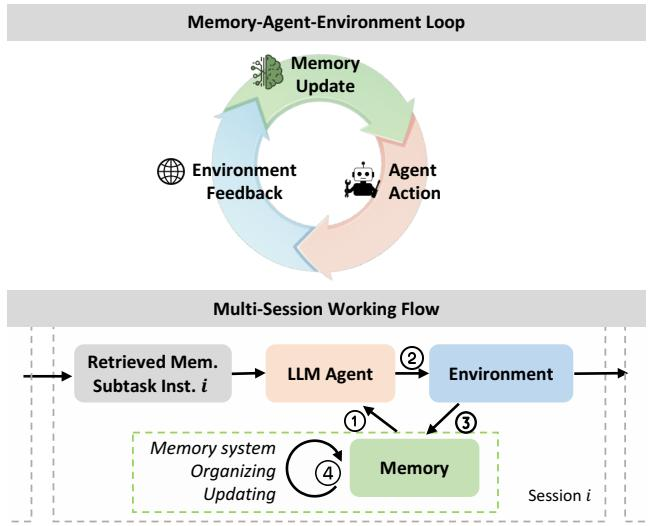  
Figure 1. MEMORYARENA Evaluates agents with Memory with multi-session tasks in a Memory-Agent-Environment Loop.

In contrast, the second class of benchmarks (Yao et al., 2022; Zhou et al.; Deng et al., 2023), such as SWE-Bench (Jimenez et al., 2023) and WebArena (Zhou et al.), primarily evaluate action by placing agents in dynamic environments, but are typically confined to a single session. In these settings, the previous interaction history is treated as flat context whenever it fits within the model’s context window, so information beyond short-term working memory is not causally required. However, in practical tasks, early interactions often introduce latent constraints, including compatibility requirements, shared preferences, and intermediate reasoning outcomes, that are not explicitly restated by the environment yet must be preserved and applied in subsequent decisions. As a result, success in these benchmarks does not reliably reflect an agent’s ability to retain and utilize information over extended horizons.

Benchmarking Agent Memory in Interdependent Multi-Session Agentic Tasks

<table><tr><td rowspan="2">Benchmark</td><td colspan="3">Memory-Agent-Env. Loops</td><td colspan="5">Task Settings</td></tr><tr><td>Memory Eval.</td><td>Agentic Actions</td><td>Env. Feedback</td><td>Multi-Sess. Tasks</td><td>Interdep. ST</td><td># T (# Q)</td><td># Interdep. ST</td><td>#S</td></tr><tr><td>LOCOMO (Maharana et al., 2024)</td><td>√</td><td>✗</td><td>✗</td><td>√</td><td>✗</td><td>7512</td><td>1</td><td rowspan="4">N/A $^{1}$ </td></tr><tr><td>LongMemEval (Wu et al., 2025)</td><td>√</td><td>✗</td><td>✗</td><td>√</td><td>✗</td><td>500</td><td>1</td></tr><tr><td>MemoryAgentBench (Hu et al., 2025b)</td><td>√</td><td>✗</td><td>✗</td><td>√</td><td>✗</td><td>2k</td><td>1</td></tr><tr><td>MemoryBench (Ai et al., 2025)</td><td>√</td><td>✗</td><td>✗</td><td>√</td><td>✗</td><td>778</td><td>1</td></tr><tr><td>WebArena (Zhou et al.)</td><td>✗</td><td>√</td><td>√</td><td>✗</td><td>✗</td><td>812</td><td>1</td><td>13.3</td></tr><tr><td>WebShop(Yao et al., 2022)</td><td>✗</td><td>√</td><td>√</td><td>✗</td><td>✗</td><td>200</td><td>1</td><td>7.3</td></tr><tr><td>VeriGUI (Liu et al., 2025)</td><td>✗</td><td>√</td><td>√</td><td>√</td><td>✗</td><td>130</td><td>4.5</td><td>214</td></tr><tr><td>Evo-Memory (Wei et al., 2025b)</td><td>√</td><td>√</td><td>√</td><td>√</td><td>✗</td><td>N/A $^{2}$ </td><td>N/A $^{2}$ </td><td>N/A $^{2}$ </td></tr><tr><td>AgencyBench (Li et al., 2026a)</td><td>✗</td><td>√</td><td>√</td><td>√</td><td>√</td><td>138</td><td>4.31 $^{3}$ </td><td>90</td></tr><tr><td>MEMORYARENA</td><td>√</td><td>√</td><td>√</td><td>√</td><td>√</td><td>701</td><td>6.9</td><td>57</td></tr></table>

Table 1. We compare benchmarks along key dimensions: if the benchmark evaluates different memory mechanism, if it evaluates agent actions, and if it involves environment feedbacks in memory–agent–environment loops. We also compare their evaluation task settings and scales. (Notations: T.: tasks; ST.: subtasks; Env.: environment; Interdep.: interdependent; S.: Steps, Q: Queries). Green checkmarks indicate supported features; red crosses indicate unsupported features. Note 1: These benchmarks use long-context conversational QA tasks without agentic actions; thus, the number of action steps is Not Applicable (N/A). Note 2: Evo-Memory constructs a multi-session setting by executing independent tasks from existing single-session agent benchmarks sequentially. Because these tasks are directly reused, there is no explicit subtask-level dependency or cross-session causal structure enforced. So the number of tasks, interdependent subtasks, and per-task action steps cannot be meaningfully defined or aggregated. We marked them as N/A. Note 3: Computed from the official AgencyBench-v2 release.

We argue that agent memory should be evaluated by treating memorization and action as inseparable components of agentic behavior. This requires assessing memory within a full interaction process, in which actions elicit environment feedback, feedback updates memory, and memory in turn conditions subsequent action selection across multi-session task execution. We refer to this process as a Memory-Agent-Environment loop, which unfolds over multiple episodes or sessions. In such settings, task success critically depends on an agent’s ability to retain and correctly reuse information acquired in earlier interactions.

To this end, we introduce MEMORYARENA, a unified evaluation gym for benchmarking the usefulness of agent memory using multi-session, interdependent agentic tasks. MEM-ORYARENA consists of human-crafted tasks with interdependent subtasks, where later actions are underspecified unless agents correctly track task-relevant information from prior sessions. We instantiate MEMORYARENA across four domains, including (1) bundled web shopping, (2) preferenceconstrained group travel planning, (3) progressive information searching, and (4) sequential formal reasoning over math and physical problems. Each task spans long horizons (with an average of 57 action steps) and produces extended reasoning traces with more than 40k tokens. Table 1 compares MEMORYARENA with existing memory and agent benchmarks along key dimensions.

MEMORYARENA evaluates various classes of state-of-theart agents, including long-context agents, agents augmented with retrieval-augmented generation (RAG) systems, and agents coupled with external memory systems, under a unified setting. Despite their strong performance on existing memory benchmarks, these agents exhibit low task completion rates in MEMORYARENA, revealing persistent difficulties in maintaining and exploiting latent task state across sessions. This gap shows that success on current benchmarks does not translate to effective memory use for guiding future actions in agentic settings, underscoring the need for more rigorous evaluation of long-horizon, multi-session agent memory.

## 2. Related Works

Evaluation Focusing on Memory. Prior work evaluates LLM memorization primarily through long context understanding and recall oriented benchmarks. Early stress test evaluations such as Needle in a Haystack1 probe a model’s ability to retrieve salient information embedded within extended contexts. Subsequent benchmarks including Long-Bench (Bai et al., 2024), L-Eval (An et al., 2024), RULER (Hsieh et al., 2024), and ∞-Bench (Zhang et al., 2024) systematize this retrieval based evaluation through question answering, summarization, and synthetic retrieval tasks. More recent efforts extend long context evaluation to conversational or episodic settings. LoCoMo (Maharana et al., 2024), LongMemEval (Wu et al., 2025), MemoryAgent-Bench (Hu et al., 2025a), MemoryBench (Ai et al., 2025), and EvoMem (Wei et al., 2025b) assess whether models can retain and recall information introduced in the previous interactions. However, these benchmarks primarily evaluate static memorization through post hoc recall using a single query and do not involve an agentic or interactive environment in which memory must be actively used. In contrast, MEMORYARENA focuses on LLM agents equipped with explicit memorization mechanisms and evaluates memory usage in sequential multi session agentic settings. Our evaluation emphasizes whether information acquired during earlier interactions can be persistently stored and correctly utilized to support later task execution, reflecting more realistic long-term agent behavior.

Evaluation Focusing on Agentic Abilities. A complementary line of work evaluates LLM agents through interactive execution benchmarks that emphasize model reasoning, action selection, and tool use in dynamic environments. Web-based agent environments such as Web-Shop (Yao et al., 2022), Mind2Web (Deng et al., 2023), and Mind2Web 2 (Gou et al., 2025) assess an agent’s ability to navigate web interfaces, invoke tools, and execute grounded actions in response to web transitions. Coding environments, such as SWE-bench (Jimenez et al., 2023), focus on software engineering tasks that require iterative reasoning and tool-mediated code edits to resolve isolated issues. More recent compositional search benchmarks such as BrowseComp (Wei et al., 2025a) and BrowseComp+ (Chen et al., 2025) evaluate agents’ capacity for deep research. MemoryGym (Pleines et al., 2025) measures within-episode retention in a partially observable control 2D environment. While these benchmarks provide valuable testbeds for evaluating agent execution and reasoning, they are typically formulated as single-session, independent tasks and do not require persistent memory across episodes. As a result, the role of agent memory is not explicitly evaluated. Recent work (Zhong et al., 2024; Wei et al., 2025b) feeds agentic tasks from above benchmarks in a streaming manner to enable test-time learning. However, unlike our setting, these evaluations do not enforce explicit dependencies across individual tasks. MEMORYARENA is the first one designed to assess agent memory using sequential subtasks with causal dependencies across sessions.

Several recent benchmarks highlight the gap between information recall from long conversation history and agentic deployment, but still most evaluate memory via question answering or tool grounding over a fixed history

<table><tr><td></td><td>#min ST(or Sess.)</td><td>#max ST(or Sess.)</td><td># avg T.Trace L</td><td># T (Groupsof Subtasks)</td></tr><tr><td rowspan="2">Bundled Web ShoppingIncluded domain</td><td>6</td><td>6</td><td>41.5k</td><td>150</td></tr><tr><td colspan="4">[Grocery, Beauty, Electronics, Home Decor, Baking]</td></tr><tr><td>Group Travel Planning</td><td>5</td><td>9</td><td>40.6k</td><td>270</td></tr><tr><td>Progressive Web Search</td><td>2</td><td>16</td><td>122.4k</td><td>221</td></tr><tr><td rowspan="2">Math Formal ReasoningIncluded Domains</td><td>2</td><td>16</td><td>18.1k</td><td>40</td></tr><tr><td colspan="4">[Pure math, Optimization, Learning theory]</td></tr><tr><td rowspan="2">Phys. Formal ReasoningIncluded Domains</td><td>2</td><td>12</td><td>14.1k</td><td>20</td></tr><tr><td colspan="4">[High energy theory, High energy phenomenology,High energy lattice, Condensed matter theory]</td></tr></table>

Table 2. Benchmark Statistics in MEMORYARENA.

Mem2ActBench (Shen et al., 2026), MemTrack (Deshpande et al., 2025), EMemBench (Li et al., 2026b), and AgentLongBench (Fang et al., 2026) construct long toolcall traces or enterprise-style workflow timelines and test whether agents can retrieve the correct facts or parameters to answer/complete post-hoc follow-up queries. They focus on retrieval from static reasoning traces rather than interdependent task sequences where distilled skills can influence future execution (e.g., learning from inductive problems in formal reasoning in MEMORYARENA). AgencyBench (Li et al., 2026a) and Beyond Task Completion (Akshathala et al., 2025) incorporate memory into agent execution, but use simple fixed add-and-retrieve tools, prioritizing overall agent capability over systematic evaluation on memory mechanisms. In contrast, MEMORYARENA enforces crosstask causal dependence and evaluates memory through end-to-end sequential task completion, measuring if agents can absorb experiences, acquire new skills, distill reusable knowledge from the past and eventually apply the new skill and understandings to inform future decisions rather than merely recalling previously seen facts.

## 3. MEMORYARENA: Agent Memory in Memory-Agent-Environment Loops

## 3.1. Task Composition and Data Preparation

Web Navigation: Bundled Web Shopping. The Bundled Web Shopping environment models real-world shopping scenarios in which users purchase related products over time rather than in a single transaction. Later purchases depend on recalling attributes of earlier items to ensure compatibility and preference consistency. We construct the Bundled Web Shopping environment by extending the shopping environment of (Yao et al., 2022), which contains tens of thousands of products with detailed descriptions and hierarchical category annotations. To reduce long-tail noise, we restrict our data to products from the five largest domains: Electronics, Home Decor, Baking, Beauty and Personal Care, and Grocery. Leveraging the category hierarchy, we first identify candidate groups of potentially compatible products by clustering items that share the same category path up to the penultimate level (for example, televisions from “Electronics > Television & Video > Televisions > TV Mounts, Stands & Turntables” and TV mounts from “Electronics > Television & Video >Televisions > LED & LCD TVs” fall under the same category tree). This procedure yields coarse compatibility trees, serving as the structural basis to design bundle shopping instructions.

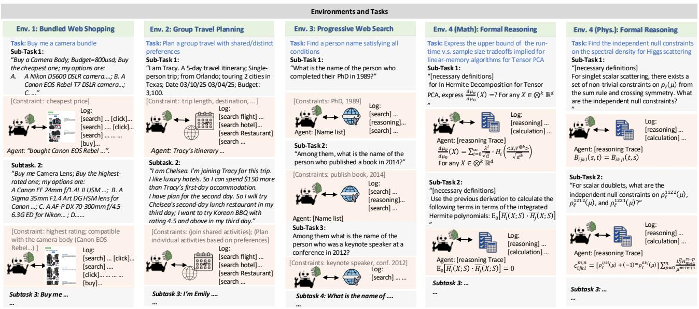  
Figure 2. MEMORYARENA supports four distinct evaluation environments, where a memory-augmented task agent completes a sequence of interdependent subtasks. Each subtask session involves multiple agent actions.

We then apply a fine-grained filtering process based on product features. We extract key attributes from product descriptions and construct accept–reject maps that encode feature-level compatibility between product pairs using commonsense reasoning (e.g., a 75-inch TV accepts a stand with 70 inches long but rejects a 50-inch stand). These maps are used to form chains of compatible products across sessions and to generate auxiliary incompatible items as negative distractors. Human annotators then manually verify all compatibility chains and remove invalid combinations. Finally, annotators compose multi-session shopping instructions in which each session presents a mixture of incompatible distractors, compatible candidates, and an additional selection constraint (e.g., highest rating or highest price) to guarantee a unique compatible item is satisfied. Solving each session requires the agent to recall prior purchases, identify compatibility constraints, discard negative options, and select a valid product. Using this process, we construct 150 representative multi-session bundled shopping tasks as the final test set. More details in data creation are in Appendix. A.2.1.

Compositional Information Seeking: Progressive Web Search We evaluate an agent’s ability to accumulate and reuse information across multiple search steps, where each step introduces an additional searching condition, and the final answer must satisfy all previously introduced conditions. Conceptually, this setting follows a form of progressive information seeking, in which a user begins with a coarse specification of the target and incrementally adds new constraints over time, requiring the agent to retain and integrate information acquired in earlier searches.

Our test data builds upon BrowseComp-Plus (Chen et al., 2025). Starting from its 830 entries, we apply a two-stage filtering and annotation process. First, we evaluate the original entries using a large language model agent with access to web search tools, and remove instances that the agent can answer correctly in a single interaction. These filtered instances are solvable without retaining or recalling any information beyond the current prompt and tool responses, i.e., they do not require storing, accumulating, or reusing information across interactions and therefore place no demand on long-term memory. For the remaining instances,we decompose each query into a group of subqueries, where each subquery introduces one additional constraint. Note that search conditions are listed in parallel in BrowseComp-Plus. Therefore, all decomposed query groups undergo the second verification by human annotators. Annotators first assess whether the decomposition is semantically coherent, has no repetition, or other mistakes, and identify the correct search result for each subquery conditioned only on information available from preceding subqueries. If any subquery is unanswerable under these constraints (for example, if it depends on information introduced only in later subqueries), the entire group is discarded. This process enforces a strict causal ordering among subqueries. Finally, we retain 221 high-quality compositional search tasks with dependent subqueries and annotated answers as the test set in this task.

Preference-constrained Planning: Group Travel Our environment models realistic group travel scenarios in which an initial itinerary is planned by one traveler and additional participants join incrementally. More realistically, while group members may share common activities due to overlapping interests, they may also request individualized or partial-group arrangements when preferences diverge. Supporting such scenarios requires an agent to recall precisely previous activities and traveler preferences, and to reason about how new constraints interact with existing plans.

We build this environment based on TravelPlanner (Xie et al., 2024), where a trip is represented as a sequence of daily activity slots (e.g., 3 meals, accommodations, sightseeing). We start with 45 single-traveler instances with a fully specified ground-truth itinerary. Then we transform each instance into a group travel scenario by treating the original traveler as a base participant with a fixed itinerary, and sequentially adding 5 to 8 additional travelers.

New travelers, by default, follow the base itinerary as shared group travel, but may specify personalized constraints that modify individual activity slots. These constraints take one of two forms. JOIN constraints specify that a traveler wishes to share a particular activity with another previously joined member (e.g., “I want to have dinner with Rebecca on the second day”), requiring the planning agent to assign the same activity choice to the later traveler. RELATION constraints define preferences relative to another member’s choice, expressed through comparisons along attributes such as price, rating, cuisine, room type, or house rules (e.g., “I want to stay at a hotel with at least a two-level higher rating than Rebecca’s”).

All constraints are carefully designed to progressively narrow the feasible candidate set and guarantee a unique valid solution in the underlying database. In total, we construct 270 group travel planning instances, where each traveler may reference or join any previous plans, forming dependency chains of up to depth four.

Sequential Formal Reasoning: Math & Physics The Formal Mathematical Reasoning environment is designed to reflect the structure and difficulty of research-level reasoning in scientific papers. Unlike standard math benchmarks that emphasize short, self-contained problems (e.g., AIME), major theoretical claims in fields such as learning theory and differential geometry typically depend on long-context arguments involving multiple intermediate results, definitions, and lemmas. Verifying a single claim often requires pages of derivations and careful reuse of previously established conclusions, making this setting a natural testbed for evaluating long-term memory and multi-step formal reasoning.

To construct this environment, we assemble a data creation team of senior PhD-level experts in theoretical mathematics and physics to manually curate and annotate academic papers with long and structured derivations. Experts review the papers, select those whose central claims rely on extended chains of prior results, and decompose each central claim into an ordered sequence of intermediate statements (primarily lemmas and propositions) following the original structure of the source paper. Similarly, papers are discarded if the derivation lacks strict causal consistency, meaning that any statement depends on information introduced later in the argument. For each remaining paper, experts record all necessary background required to justify each statement, such as notations, definitions, remarks, and algorithms. Each intermediate and final statement is then framed as a question with an expert-verified ground-truth answer, and the complete reasoning trajectory is recorded. Statements that are not naturally verifiable (e.g., existence assumptions) are provided as fixed facts to support subsequent reasoning.

The final test set consists of 40 multi-question problems in mathematics and 20 in physics, each corresponding to a full derivation chain extracted from real research papers. The expert-curated derivation chains ensure high quality and introduce challenges well beyond existing math benchmarks, making this environment a rigorous test of both long-context memory and formal reasoning.

## 3.2. Evaluation: Memory-Agent-Environment Loop

Single-Session Agent-Environment Interactions. When an LLM agent A interact with an environment E over certain agentic task $s \left( \mathrm { e . g } \right.$ ., buy a camera lens), the agent A interacts with $\mathcal { E }$ over a sequence of steps indexed by $t = 1 , . . . , T _ { i }$ At each step $t ,$ the agent selects an action (e.g., search the camera lens name) from its action space conditioned on the current instruction and the interaction history within the session, and the environment responds with an observation (e.g., show search results):

$$
a _ {i, t} \sim \pi_ {\mathcal {A}} (\cdot | s, o _ {i, 1: t - 1}, a _ {i, 1: t - 1}), \quad o _ {i _ {t}} \in \mathcal {O}\tag{1}
$$

In single-session tasks, the agent usually is provided with the complete interaction history (trace) as context at every step, until the task is terminated (e.g., after purchasing a camera lens).

Multi-session Agent-Environment Interactions. In real cases, a task may have multiple subtasks ${ \cal S } = \{ s _ { i } \} _ { i = 1 } ^ { n }$ , and subtasks are executed sequentially: $\left[ s _ { 1 } \to s _ { 2 } \to \cdot \cdot \cdot \to s _ { n } \right]$ Using bundled web shopping as an example (e.g., buy a camera body with lens and cases), each subtask $s _ { i }$ is executed as a separate session2 (e.g., first buy a camera body).

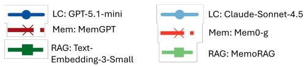

While each session is temporally isolated, later subtasks may depend on information acquired in earlier ones (e.g., the version of the camera body bought before must be known when buying lens), motivating the need for a persistent state across sessions.

Final: Memory-Agent-Environment Loop. We equip the agent A with a persistent memory system M, which stores information across subtask sessions and is initialized as empty at the beginning of each evaluation episode. M can be a long-context buffer, a RAG system, or another memory agent. Usually, a memory system defines the two abstract functions3: (1) retrieval which returns task-relevant memory given a query, and (2) update which incorporates information from a completed subtask into M.

At each action step t in subtask $s _ { i }$ , the agent retrieves relevant memory based on the current subtask, and actions are selected according to a memory-conditioned policy:

$$
m _ {i, t} = \operatorname{RETRIEVE} (\mathcal {M}, s _ {i}, a _ {i, 1: t - 1}, o _ {i, 1: t - 1}).\tag{2}
$$

$$
a _ {i, t} \sim \pi_ {\mathcal {A}} (\cdot | s _ {i}, o _ {i, 1: t - 1}, a _ {i, 1: t - 1}, m _ {i, t})\tag{3}
$$

Upon subtask completion, the memory system is updated as:

$$
\mathcal {M} \leftarrow \operatorname{UPDATE} (\mathcal {M}, (o _ {i, 1: T}, a _ {i, 1: T}))\tag{4}
$$

The updated memory is carried forward to the next subtask $s _ { i + 1 }$ , enabling information acquired in earlier sessions to influence future decision-making. We call it the Memory-Agent-Environment Loop.

In single-session execution, the agent–environment interaction implicitly follows a Memory-Agent-Environment loop, as the history of interactions added in the context of each action step can be viewed as the working memory of a single session. In such settings, persistent memory is not strictly required. In contrast, in multi-session settings, subtasks are executed in separate sessions whose interaction traces are no longer directly accessible once a session terminates. Task-relevant information must be selectively stored and retrieved through a persistent memory system in order to support decision-making in later subtasks. This explicitly enforces the Memory-Agent-Environment loop when the cumulative interaction trace spans multiple sessions and exceeds the scope of single-session context.

## 4. Experiments

## 4.1. Experimentation Setup

Following prior setups (Wu et al., 2025; Hu et al., 2025b), agents equipped with M has three representative paradigms in MEMORYARENA: Agents with Long-context buffers (Long-Context Agent) which append verbatim interaction history directly before the prompt before each subtask without explicit abstraction or consolidation, working as an in-context memory. We include GPT-5-mini, GPT-4.1- mini, and Gemini-3-flash, Claude-Sonnet-4.5. Agents with External Memory, where the agents maintain an external memory with learned or curated mechanisms for information abstraction, consolidation, and retrieval. We include five mainstream agents with external memory: MemGPT (Packer et al., 2023), Mem0 and its graph version Mem0-g (Chhikara et al., 2025), Mirix (Wang & Chen, 2025), and ReasoningBank (Ouyang et al., 2025).Agents with Retrieval-augmented generation (RAG) systems, which use an indexed document store to store past information and then access it via retrieval. We consider different retrieval methods, including BM25, an embedding-based RAG method that retrieves based on semantic similarity (using OpenAI text-embedding-3-small), and two structured RAG approaches, MemoRAG (Qian et al., 2025) and GraphRAG (Edge et al., 2024), in our evaluation.

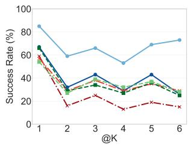  
(a) Bundled Web Shopping@k

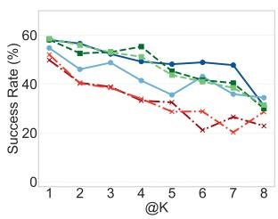  
(b) Group Travel Plan@k

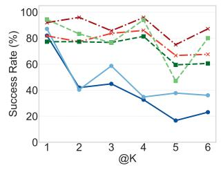

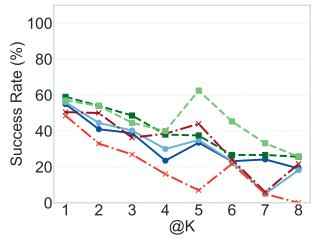  
(c) Progressive Web Search@k  
(d) Formal Reasoning@k  
Figure 3. Success Rate at subtask depth k. The decay trend indicates agents cannot sustain execution as dependencies span more sessions.

Inspired by Hu et al. (2025a), we further characterize above methods by the structure and complexity of its memory design, to guide our experiment analysis. 0D memory method stores raw history without abstraction or consolidation. This includes verbatim context used by longcontext agents and flat RAG methods such as BM25 and embedding-based RAG. 1D memory method introduces learned or heuristic mechanisms for consolidating and distilling information, while maintaining a flat memory structure. Examples include MemGPT (Packer et al., 2023), Mem0 (Chhikara et al., 2025), ReasoningBank (Ouyang et al., 2025), and memoRAG (Qian et al., 2025). 2D memory methods incorporate structured memory, including components like or tree/graph-based relational representations (e.g., MIRIX (Wang & Chen, 2025), Mem0-g (Chhikara et al., 2025), and GraphRAG (Edge et al., 2024)).

Benchmarking Agent Memory in Interdependent Multi-Session Agentic Tasks

<table><tr><td rowspan="3"></td><td rowspan="3">Memory Type</td><td rowspan="2" colspan="2">Bundled web shopping</td><td rowspan="2" colspan="3">Group Travel Planing</td><td rowspan="2" colspan="2">Progressive Web Search</td><td colspan="4">Formal Reasoning</td><td rowspan="3">All Task Avg SR</td></tr><tr><td colspan="2">Math</td><td colspan="2">Phys</td></tr><tr><td>SR</td><td>PS</td><td>SR</td><td>PS</td><td>sPS</td><td>SR</td><td>PS</td><td>SR</td><td>PS</td><td>SR</td><td>PS</td></tr><tr><td colspan="14">Task agent + Long Context</td></tr><tr><td>GPT-5.1-mini</td><td>0D</td><td>0.01</td><td>0.58</td><td>0.00</td><td>0.00</td><td>0.52</td><td>0.06</td><td>0.05</td><td>0.21</td><td>0.30</td><td>0.50</td><td>0.59</td><td>0.16</td></tr><tr><td>GPT-4.1-mini</td><td>0D</td><td>0.00</td><td>0.43</td><td>0.00</td><td>0.00</td><td>0.19</td><td>0.02</td><td>0.03</td><td>0.13</td><td>0.27</td><td>0.30</td><td>0.45</td><td>0.09</td></tr><tr><td>Gemini-3-Flash</td><td>0D</td><td>0.12</td><td>0.76</td><td>0.00</td><td>0.01</td><td>0.62</td><td>0.07</td><td>0.04</td><td>0.17</td><td>0.30</td><td>0.60</td><td>0.61</td><td>0.19</td></tr><tr><td>Claude-Sonnet-4.5</td><td>0D</td><td>0.12</td><td>0.79</td><td>0.00</td><td>0.06</td><td>0.44</td><td>0.02</td><td>0.03</td><td>0.20</td><td>0.25</td><td>0.45</td><td>0.59</td><td>0.16</td></tr><tr><td>Long Context Avg</td><td></td><td>0.06</td><td>0.64</td><td>0.00</td><td>0.02</td><td>0.44</td><td>0.04</td><td>0.04</td><td>0.18</td><td>0.28</td><td>0.46</td><td>0.56</td><td></td></tr><tr><td colspan="14">Task Agent + Memory Agents</td></tr><tr><td>Letta</td><td>1D</td><td>0.00</td><td>0.5</td><td>0.00</td><td>0.00</td><td>0.35</td><td>0.16</td><td>0.09</td><td>0.11</td><td>0.26</td><td>0.45</td><td>0.65</td><td>0.14</td></tr><tr><td>Mem0</td><td>1D</td><td>0.00</td><td>0.45</td><td>0.00</td><td>0.00</td><td>0.24</td><td>0.24</td><td>0.09</td><td>0.18</td><td>0.28</td><td>0.25</td><td>0.43</td><td>0.13</td></tr><tr><td>Mirix</td><td>2D</td><td>0.00</td><td>0.41</td><td>0.00</td><td>0.00</td><td>0.36</td><td>0.10</td><td>0.06</td><td>0.18</td><td>0.28</td><td>0.35</td><td>0.50</td><td>0.13</td></tr><tr><td>Mem0-g</td><td>2D</td><td>0.00</td><td>0.43</td><td>0.00</td><td>0.00</td><td>0.24</td><td>0.15</td><td>0.08</td><td>0.19</td><td>0.32</td><td>0.25</td><td>0.50</td><td>0.12</td></tr><tr><td>Reasoning Bank</td><td>1D</td><td>0.00</td><td>0.27</td><td>0.00</td><td>0.00</td><td>0.00</td><td>0.10</td><td>0.06</td><td>0.13</td><td>0.27</td><td>0.35</td><td>0.53</td><td>0.12</td></tr><tr><td>Memory Avg</td><td></td><td>0.00</td><td>0.41</td><td>0.00</td><td>0.00</td><td>0.24</td><td>0.15</td><td>0.08</td><td>0.16</td><td>0.28</td><td>0.33</td><td>0.52</td><td></td></tr><tr><td colspan="14">Task Agent + RAG Systems</td></tr><tr><td>BM25</td><td>0D</td><td>0.00</td><td>0.56</td><td>0.00</td><td>0.01</td><td>0.45</td><td>0.28</td><td>0.09</td><td>0.18</td><td>0.29</td><td>0.40</td><td>0.58</td><td>0.17</td></tr><tr><td>Text-Embedding-3-Small</td><td>0D</td><td>0.00</td><td>0.55</td><td>0.00</td><td>0.01</td><td>0.50</td><td>0.23</td><td>0.09</td><td>0.25</td><td>0.33</td><td>0.50</td><td>0.68</td><td>0.20</td></tr><tr><td>MemoRAG</td><td>1D</td><td>0.00</td><td>0.54</td><td>0.00</td><td>0.03</td><td>0.50</td><td>0.22</td><td>0.21</td><td>0.24</td><td>0.30</td><td>0.40</td><td>0.55</td><td>0.17</td></tr><tr><td>GraphRAG</td><td>2D</td><td>0.00</td><td>0.52</td><td>0.00</td><td>0.01</td><td>0.51</td><td>0.04</td><td>0.05</td><td>0.23</td><td>0.31</td><td>0.60</td><td>0.63</td><td>0.17</td></tr><tr><td>RAG Avg</td><td></td><td>0.00</td><td>0.54</td><td>0.00</td><td>0.02</td><td>0.49</td><td>0.19</td><td>0.11</td><td>0.23</td><td>0.31</td><td>0.48</td><td>0.61</td><td></td></tr><tr><td>All Method Avg</td><td></td><td>0.02</td><td>0.52</td><td>0.00</td><td>0.02</td><td>0.38</td><td>0.23</td><td>0.09</td><td>0.18</td><td>0.29</td><td>0.42</td><td>0.56</td><td></td></tr></table>

Table 3. Main results on task agent (gpt-5.1-mini) with long-context memory, memory agent, and RAG agent over four agentic environments MEMORYARENA. We bold the global best methods and underline the group best ones within each category. 0D: raw context without any processing; 1D: flat memory, 2D: structured memory. SR: Success Rate. PS: Progress Score (defined in Section 4.2). sPS: soft Process Score (we provided sPS here for more informative compression as PS is all near-zero in Group Travel Planning. See Section 4.2 for more details.)

All evaluation results are reported with GPT-5-mini as the task agent equipped with different memory systems (longcontext, RAG systems or memory systems) in this paper. We also provide results with Claude Sonnet-4.6 as task agent in Appendix C.1.

## 4.2. Evaluation Metrics

We define the Task Progress Score (PS) to measure how many subtasks are completed within a task. PS captures the fraction of subtasks that are correctly completed within a task, providing a fine-grained signal of partial progress even when full task success is not achieved. Formally, consider a test set of N tasks $( \{ S _ { 1 } , S _ { 2 } , \cdots , S _ { N } \} )$ ) where each task consists of $| S _ { i } |$ ordered substask $( S _ { i } = [ s _ { 1 } , s _ { 2 } , \cdots , s _ { | S _ { i } | } ] )$ Let $| s _ { i } ^ { \mathrm { p a s s } } |$ denote the number of passed subtasks in $S _ { i } ,$ , the overall PS is computed as the aggregated task-level PS:

$$
\mathrm{PS} _ {S _ {i}} = \frac {\left| s _ {i} ^ {\text { pass }} \right|}{\left| S _ {i} \right|}, \quad \mathrm{PS} = \frac {1}{N} \sum_ {i} ^ {N} \mathrm{PS} _ {S _ {i}}\tag{5}
$$

Specifically, for a subtask $s _ { j }$ with a set of constraints $C _ { j } =$ $\{ c _ { j _ { 1 } } , \dotsc , c _ { j _ { | C _ { j } | } } \}$ , let $| C _ { j } ^ { \mathrm { p a s s } } |$ denote the number of satisfied constraints in $s _ { j }$ , we define the soft Progress Score (sPS) for a task $S _ { j }$ as:

$$
\mathrm{sPS} _ {S _ {i}} = \frac {1}{| S _ {i} |} \sum_ {j = 1} ^ {| S _ {i} |} \frac {\left| C _ {j} ^ {\text { pass }} \right|}{\left| C _ {j} \right|}, \quad \mathrm{sPS} = \frac {1}{N} \sum_ {i = 1} ^ {N} \mathrm{sPS} _ {S _ {i}}\tag{6}
$$

Compared to the hard PS score that each subtask has a binary pass, soft Progress Score (sPS) measures partial satisfaction. This is a continuous generalization of the same notion of progress.

We also report the Task Success Rate (SR), which measures the percentage of tasks that are fully solved. In Bundled Web Shopping and Group Travel Planning, a task is successful if the final bundle or plan satisfies all group members. In Progressive Web Search and Formal Reasoning, success is determined by the correctness of the final subtask, which is the concluding search query or the major math or physics problems.

## 4.3. Main Results

Overall Results and Task Difficulty. Table 3 reports the Task Success Rate (SR) and Task Progress Score (PS) across environments. Overall, all methods achieve low SR and PS, with two environments exhibiting near-zero SR, indicating that MEMORYARENA poses a challenging evaluation setting. Examining the gap between SR and PS, we find that most methods have much higher PS than SR (except in Group Travel Planning with both near zero). This pattern suggests that while agents can make some progress on individual subtasks, they fail to integrate these partial successes into globally consistent solutions dramatically.

Group Travel Planning remains the most challenging environment in MEMORYARENA, with both SR and PS near zero across all methods. Here each subtask requires planning a 30-slot itinerary, where every slot is governed by constraints such as joining a group activity, coordinating an activity with one or more participants, or selecting an individual activity that depends on earlier decisions. Successfully completing the itinerary demands accurate recall of previously specified preferences and long-horizon reasoning over interdependent constraint chains across slots, placing strong requirements on both memorization and long-chain reasoning that remain beyond the capabilities of current agents.

To enable informative comparison in Group Travel Planning (as hard SR and PS are zero for all methods), we additionally report a soft Progress Score (sPS), where each subtask receives partial credit based on the fraction of constraints it satisfies. Task-level soft progress is computed by averaging subtask sPS, with overall sPS averaged across tasks. We use sPS when discussing Group Travel Planning in later analysis (see Equation (6) for details).

External Memory and RAG Systems Are Not Universally Beneficial. We find that augmenting GPT-5-mini with external memory or RAG does not consistently outperform using the model’s full long-context history alone. We attribute this outcome to two forms of mismatch. First, a representation mismatch: long-context agents reason over a self-consistent, verbatim interaction history, whereas external memory systems typically return compressed, segmented, or reordered information that may not align well with in-context learning over raw context. Second, a training mismatch: external memory systems are not jointly optimized with the task agent, leaving the agent suboptimal at formulating effective queries and integrating retrieved information into its reasoning process. Consequently, pairing strong long-context agents with external memory does not reliably produce a $^ { 6 6 } 1 + 1 > 2 ^ { 5 }$ effect.

When External Memory Helps. As shown in Table 3, external memory yields consistent performance gains in Progressive Web Search and Formal Reasoning. In Progressive Web Search, individual subtask traces can exceed 120k tokens, while in Formal Reasoning, subtasks require highly complex and domain-specific reasoning. Both settings push the agent beyond its effective reasoning capacity when conditioned on long contexts alone. In such regimes, long-context prompts are susceptible to attention saturation and error accumulation, as early mistakes persist in the context and propagate to later decisions. External memory mitigates these failure modes by selectively abstracting, distilling, and retaining task-relevant information, thereby reducing noise and alleviating attention saturation.

## 4.4. Results on Interdependent Subtasks

We analyze agent performance under increasing subtask interdependency using SR at subtask depth k (@k), defined as the fraction of task instances that are correctly completed at the k-th subtask. This metric characterizes how well agents sustain execution as dependencies span more sessions.

As shown in Figure 3, all evaluated methods exhibit a decay with no method maintaining a consistent flat region across environments. This observation suggests that neither longcontext models nor existing external memory or retrieval mechanisms are sufficient to reliably support agent longhorizon execution over deeply interdependent subtasks.

The rate of decay, however, varies across task settings. In Progressive Web Search, where each session induces substantially longer reasoning traces, (> 122k) long-context agents degrade more rapidly as k increases, as context can go beyond effective context window more easily. In contrast, agents augmented with external memory or retrieval exhibit slower decay, as these systems re-surface relevant information from earlier subtasks when the accumulated trace becomes not accessible directly. In tasks that require precise reuse of earlier subtask information, such as recalling intermediate results in formal reasoning or referencing exact activities and time slots in group travel planning, retrievalbased approaches are consistently more robust than agents with external memory that rely on heavier information consolidation and abstraction. In these cases,agents with RAG systems exhibit slower decay in SR@k than that with external memory.

## 4.5. Latency Evaluations

In Table 4, we additionally report subtask completion time as a diagnostic measure of end-to-end execution latency for agents equipped with different memory mechanisms (additional statistics are provided in Appendix C.2). Overall, agents with external memory always incur the highest latency, with retrieval-based systems falling in between, while long-context agents consistently exhibit the lowest latency across environments. Notably, long-context agents achieve this efficiency while remaining competitive in task performance in several settings (see Section 4.3).

<table><tr><td></td><td>Bundled Web Shopping</td><td>Group Travel Plan</td><td>Progressive Web Search</td><td>Formal Reasoning Math</td><td>Formal Reasoning Phys.</td><td>Avg.</td></tr><tr><td colspan="7">Long Context</td></tr><tr><td>GPT-5.1-mini</td><td>95</td><td>119</td><td>60</td><td>50</td><td>47</td><td>74.2</td></tr><tr><td>GPT-4.1-mini</td><td>31</td><td>63</td><td>22</td><td>21</td><td>31</td><td>33.6</td></tr><tr><td>Claude-Sonnet-4.5</td><td>56</td><td>52</td><td>180</td><td>83</td><td>38</td><td>81.8</td></tr><tr><td>Gemini-3-Flash</td><td>78</td><td>33</td><td>42</td><td>43</td><td>65</td><td>52.2</td></tr><tr><td colspan="7">Memory Systems</td></tr><tr><td>Letta</td><td>219</td><td>150</td><td>121</td><td>77</td><td>97</td><td>132.8</td></tr><tr><td>Mem0</td><td>109</td><td>125</td><td>229</td><td>49</td><td>62</td><td>114.8</td></tr><tr><td>Mirix</td><td>83</td><td>184</td><td>90</td><td>69</td><td>69</td><td>99.0</td></tr><tr><td>Mem0-g</td><td>112</td><td>194</td><td>230</td><td>40</td><td>50</td><td>125.2</td></tr><tr><td>Reasoning Bank</td><td>216</td><td>146</td><td>76</td><td>64</td><td>75</td><td>115.4</td></tr><tr><td colspan="7">RAG Systems</td></tr><tr><td>BM25</td><td>134</td><td>162</td><td>149</td><td>41</td><td>51</td><td>107.4</td></tr><tr><td>Text Embeddings</td><td>127</td><td>90</td><td>196</td><td>58</td><td>64</td><td>107.0</td></tr><tr><td>MemoRAG</td><td>101</td><td>192</td><td>80</td><td>64</td><td>77</td><td>102.8</td></tr><tr><td>GraphRAG</td><td>96</td><td>108</td><td>119</td><td>58</td><td>70</td><td>90.2</td></tr></table>

Table 4. Latency of agents with different memory paradigms (sec.).

Across both agents with external memory and agents with RAG systems, we do not observe a systematic relationship between memory operation complexity and execution latency. More complex memory mechanisms (e.g.,2D) do not necessarily incur higher task execution time, nor do simpler designs (e.g., 0D) consistently yield better efficiency. Substantial latency variation also exists among methods with similar memory architectures, indicating that operational complexity alone is not a reliable predictor of end-to-end latency.

These findings suggest that, beyond jointly optimizing memory mechanisms and task agents for functional integration, future work should explicitly consider the tradeoffs between memory effectiveness and execution latency—especially in multi-session agentic settings where memory is repeatedly accessed.

## 4.6. MEMORYARENA as a POMDP Testbed

We view the multi-session agent-environment loop in MEM-ORYARENA as a natural instance of a partially observable Markov decision process (POMDP). Across sessions, the agent never directly observes the full underlying task state (e.g., the latent bundle specification, the evolving set of group constraints, or the intermediate dependencies required by later subtasks). Instead, at each session it receives a partial observation consisting of the current subtask instruction and environment feedback. When no external memory is provided, the agent must rely on a truncated interaction trace (or its internal parametric knowledge), making the decision process effectively partially observable and historydependent.

This perspective yields a two-step connection to view MEM-ORYARENA as a POMDP-oriented testbed. First, MEM-ORYARENA exposes long-horizon partial observability in multi-session tasks, where performance decay with depth can be interpreted as belief drift: small errors in the agent’s implicit state estimate accumulate across sessions and eventually dominate downstream decisions, as shown in Figure 3.

Second, external memory in MEMORYARENA can be interpreted as an explicit mechanism for approximating beliefstate estimation. In an idealized setting, an optimal memory base that returns all and only the information necessary to infer the current belief state (i.e., the task-relevant sufficient statistics from past sessions) should enable an agent policy to act as if it were operating in a fully observed MDP (or, equivalently, to solve the underlying POMDP via a belief-MDP reduction). However, our empirical results show that current state-of-the-art memory systems and RAG systems still yield low Task SR, indicate that current SOTA memory do not reliably support the kind of state tracking information required by agent POMDP.

These results suggest two complementary bottlenecks. From memory-side: contemporary memory mechanisms, often optimized for generic recall, compression, or semanticsimilarity retrieval, have limited capacity to preserve and update task-relevant state variables that are sufficient for belief tracking under a task’s dependency. From agentside: task agents are not trained to query, interpret, and integrate memory outputs as structured cues for belief updates, which can lead to under-utilization or mis-utilization of retrieved information. In Appendix C.3, we further discuss the patterns of “failure to remember” task-relevant state and “failure to utilize” observed information, verifying that both bottlenecks exist in current memory-augmented agents. These motivate future work that jointly optimizes memory representations and agent training objectives with explicit awareness of POMDP state estimation for long-horizon planning.

## 5. Conclusions

We introduce MEMORYARENA, an evaluation gym for agent memory with curated multi-session tasks featuring interdependent subtasks, designed to assess whether memory can effectively support agent decision-making within a memory–agent–environment execution loop. Moving beyond recall-based memory benchmarks and single-session agent evaluations, MEMORYARENA treats memory as a functional component of agentic tasks. Empirically, state-of-the-art agent memory methods achieve low success rates in MEM-ORYARENA, revealing persistent challenges in maintaining and reusing memory across interdependent sessions and underscoring the need for testbeds that evaluate memory as a functionally coherent component of LLM agents.

## Impact Statement

This paper presents work whose goal is to advance the field of Machine Learning. There are many potential societal consequences of our work, none of which we feel must be specifically highlighted here.

While MEMORYARENA provides a compositional multisession evaluation with 4,850 subtasks at a granularity comparable to standard agentic benchmarks such as Web-Shop, its task-level scale can be further expanded, especially in expert-intensive domains such as research-level mathematics and physics. Because constructing such domainknowledge-heavy tasks requires substantial expert annotation (e.g., 8-10h per math/physics task by senior PhDs for Formal Reasoning tasks), we view MEMORYARENA as a growing community resource and welcome future contributions to broaden its coverage.

In addition, MEMORYARENA evaluates memory as a functional component of multi-session agent behavior, where retrieval, reasoning, and action are inherently coupled. A finergrained analysis of individual memory operations across different systems would provide deeper diagnostic insights, and we leave this as an important direction for future work.

## References

Ai, Q., Tang, Y., Wang, C., Long, J., Su, W., and Liu, Y. Memorybench: A benchmark for memory and continual learning in llm systems. arXiv preprint arXiv:2510.17281, 2025.

Akshathala, S., Adnan, B., Ramesh, M., Vaidhyanathan, K., Muhammed, B., and Parthasarathy, K. Beyond task completion: An assessment framework for evaluating agentic ai systems. arXiv preprint arXiv:2512.12791, 2025.

An, C., Gong, S., Zhong, M., Zhao, X., Li, M., Zhang, J., Kong, L., and Qiu, X. L-eval: Instituting standardized evaluation for long context language models. In Proceedings ofthe 62nd Annual Meeting ofthe Associationfor Computational Linguistics (Volume 1: Long Papers), pp. 14388–14411, 2024.

Bai, Y., Lv, X., Zhang, J., Lyu, H., Tang, J., Huang, Z., Du, Z., Liu, X., Zeng, A., Hou, L., et al. Longbench: A bilingual, multitask benchmark for long context understanding. In Proceedings of the 62nd annual meeting of the associationfor computational linguistics (volume 1: Long papers), pp. 3119–3137, 2024.

Chen, Z., Ma, X., Zhuang, S., Nie, P., Zou, K., Liu, A., Green, J., Patel, K., Meng, R., Su, M., et al. Browsecompplus: A more fair and transparent evaluation benchmark

of deep-research agent. arXiv preprint arXiv:2508.06600, 2025.

Chhikara, P., Khant, D., Aryan, S., Singh, T., and Yadav, D. Mem0: Building production-ready ai agents with scalable long-term memory. arXiv preprint arXiv:2504.19413, 2025.

Deng, X., Gu, Y., Zheng, B., Chen, S., Stevens, S., Wang, B., Sun, H., and Su, Y. Mind2web: Towards a generalist agent for the web. Advances in Neural Information Processing Systems, 36:28091–28114, 2023.

Deshpande, D., Gangal, V., Mehta, H., Kannappan, A., Qian, R., and Wang, P. Memtrack: Evaluating long-term memory and state tracking in multi-platform dynamic agent environments. arXiv preprint arXiv:2510.01353, 2025.

Edge, D., Trinh, H., Cheng, N., Bradley, J., Chao, A., Mody, A., Truitt, S., and Larson, J. From local to global: A graph rag approach to query-focused summarization. arXiv preprint arXiv:2404.16130, 2024.

Fang, S., Wang, Y., Liu, X., Lu, J., Tan, C., Chen, X., Huang, Y. Z., Qiu, X., et al. Agentlongbench: A controllable long benchmark for long-contexts agents via environment rollouts. arXiv preprint arXiv:2601.20730, 2026.

Gou, B., Huang, Z., Ning, Y., Gu, Y., Lin, M., Qi, W., Kopanev, A., Yu, B., Gutierrez, B. J., Shu, Y., et al.´ Mind2web 2: Evaluating agentic search with agent-as-ajudge. arXiv preprint arXiv:2506.21506, 2025.

Hsieh, C.-P., Sun, S., Kriman, S., Acharya, S., Rekesh, D., Jia, F., Zhang, Y., and Ginsburg, B. Ruler: What’s the real context size of your long-context language models? arXiv preprint arXiv:2404.06654, 2024.

Hu, Y., Liu, S., Yue, Y., Zhang, G., Liu, B., Zhu, F., Lin, J., Guo, H., Dou, S., Xi, Z., et al. Memory in the age of ai agents. arXiv preprint arXiv:2512.13564, 2025a.

Hu, Y., Wang, Y., and McAuley, J. Evaluating memory in llm agents via incremental multi-turn interactions. arXiv preprint arXiv:2507.05257, 2025b.

Jimenez, C. E., Yang, J., Wettig, A., Yao, S., Pei, K., Press, O., and Narasimhan, K. Swe-bench: Can language models resolve real-world github issues? arXiv preprint arXiv:2310.06770, 2023.

Li, K., Shi, J., Xiao, Y., Jiang, M., Sun, J., Wu, Y., Xia, S., Cai, X., Xu, T., Si, W., et al. Agencybench: Benchmarking the frontiers of autonomous agents in 1m-token real-world contexts. arXiv preprint arXiv:2601.11044, 2026a.

Li, X., Zhu, Z., Liu, S., Ma, Y., Zang, Y., Cao, Y., and Sun, A. Emembench: Interactive benchmarking of episodic memory for vlm agents. arXiv preprint arXiv:2601.16690, 2026b.

Liu, S., Liu, M., Zhou, H., Cui, Z., Zhou, Y., Zhou, Y., Fan, W., Zhang, G., Shi, J., Xuan, W., et al. Verigui: Verifiable long-chain gui dataset. arXiv preprint arXiv:2508.04026, 2025.

Maharana, A., Lee, D.-H., Tulyakov, S., Bansal, M., Barbieri, F., and Fang, Y. Evaluating very long-term conversational memory of llm agents. In Proceedings of the 62nd Annual Meeting of the Association for Computational Linguistics (Volume 1: Long Papers), pp. 13851–13870, 2024.

Ouyang, S., Yan, J., Hsu, I., Chen, Y., Jiang, K., Wang, Z., Han, R., Le, L. T., Daruki, S., Tang, X., et al. Reasoningbank: Scaling agent self-evolving with reasoning memory. arXiv preprint arXiv:2509.25140, 2025.

Packer, C., Fang, V., Patil, S., Lin, K., Wooders, S., and Gonzalez, J. Memgpt: Towards llms as operating systems. 2023.

Pleines, M., Pallasch, M., Zimmer, F., and Preuss, M. Memory gym: Towards endless tasks to benchmark memory capabilities of agents. Journal ofMachine Learning Research, 26(6):1–40, 2025.

Qian, H., Liu, Z., Zhang, P., Mao, K., Lian, D., Dou, Z., and Huang, T. Memorag: Boosting long context processing with global memory-enhanced retrieval augmentation. In Proceedings of the ACM on Web Conference 2025, pp. 2366–2377, 2025.

Shen, Y., Li, K., Zhou, W., and Hu, S. Mem2actbench: A benchmark for evaluating long-term memory utilization in task-oriented autonomous agents. arXiv preprint arXiv:2601.19935, 2026.

Wang, Y. and Chen, X. Mirix: Multi-agent memory system for llm-based agents. arXiv preprint arXiv:2507.07957, 2025.

Wei, J., Sun, Z., Papay, S., McKinney, S., Han, J., Fulford, I., Chung, H. W., Passos, A. T., Fedus, W., and Glaese, A. Browsecomp: A simple yet challenging benchmark for browsing agents. arXiv preprint arXiv:2504.12516, 2025a.

Wei, T., Sachdeva, N., Coleman, B., He, Z., Bei, Y., Ning, X., Ai, M., Li, Y., He, J., Chi, E. H., et al. Evo-memory: Benchmarking llm agent test-time learning with selfevolving memory. arXiv preprint arXiv:2511.20857, 2025b.

Wu, D., Wang, H., Yu, W., Zhang, Y., Chang, K.-W., and Yu, D. Longmemeval: Benchmarking chat assistants on longterm interactive memory. In The Thirteenth International Conference on Learning Representations, 2025.

Xie, J., Zhang, K., Chen, J., Zhu, T., Lou, R., Tian, Y., Xiao, Y., and Su, Y. Travelplanner: A benchmark for real-world planning with language agents. In Forty-first International Conference on Machine Learning, 2024.

Yao, S., Chen, H., Yang, J., and Narasimhan, K. Webshop: Towards scalable real-world web interaction with grounded language agents. Advances in Neural Information Processing Systems, 35:20744–20757, 2022.

Zhang, X., Chen, Y., Hu, S., Xu, Z., Chen, J., Hao, M., Han, X., Thai, Z., Wang, S., Liu, Z., et al. ∞ bench: Extending long context evaluation beyond 100k tokens. In Proceedings ofthe 62nd Annual Meeting ofthe Associationfor Computational Linguistics (Volume 1: Long Papers), pp. 15262–15277, 2024.

Zhong, W., Guo, L., Gao, Q., Ye, H., and Wang, Y. Memorybank: Enhancing large language models with long-term memory. In Proceedings of the AAAI Conference on Artificial Intelligence, volume 38, pp. 19724–19731, 2024.

Zhou, S., Xu, F. F., Zhu, H., Zhou, X., Lo, R., Sridhar, A., Cheng, X., Ou, T., Bisk, Y., Fried, D., et al. Webarena: A realistic web environment for building autonomous agents. In The Twelfth International Conference on Learning Representations.

## A. Appendix: More data details

## A.1. Data Examples

We provide data examples in Bundled web shopping in Figure 4, Group Travel Planning in Figure 5, progressive web search in Figure 6, and in formal reasoning (use Math as an example) in Figure 7. Due to the page limits, we omit some lengthy details in each examples.

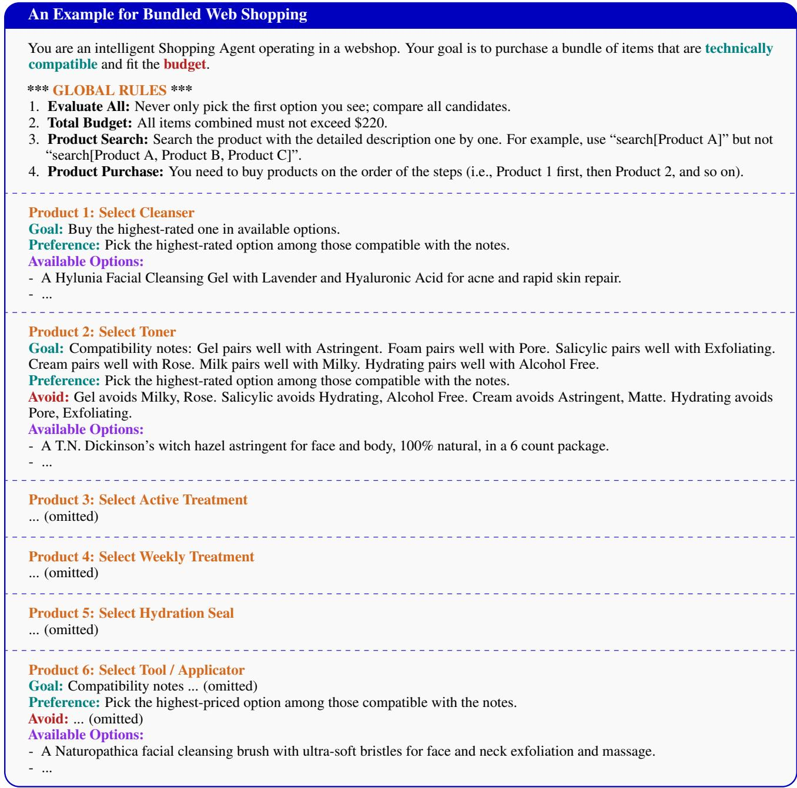  
Figure 4. Data example for bundled web shopping task.

Benchmarking Agent Memory in Interdependent Multi-Session Agentic Tasks  
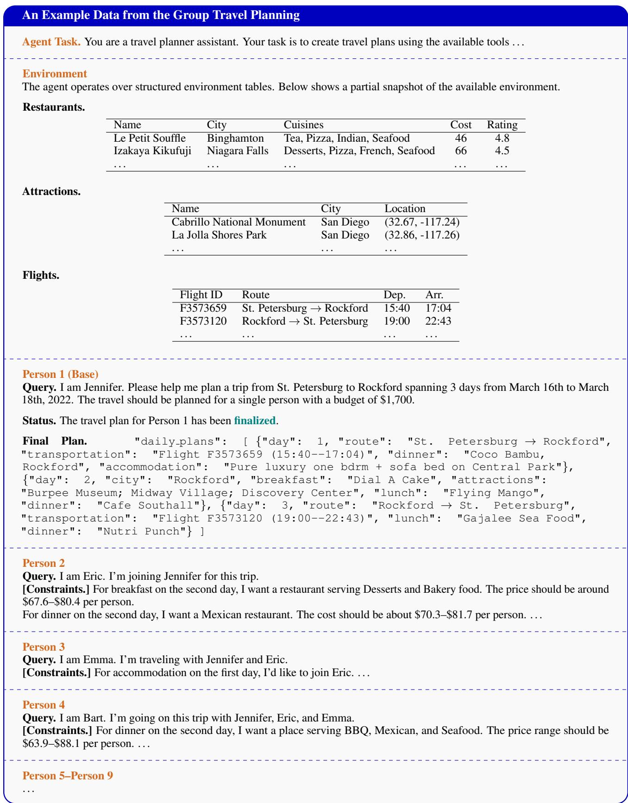  
Figure 5. Data example for the Group Travel Planning task.

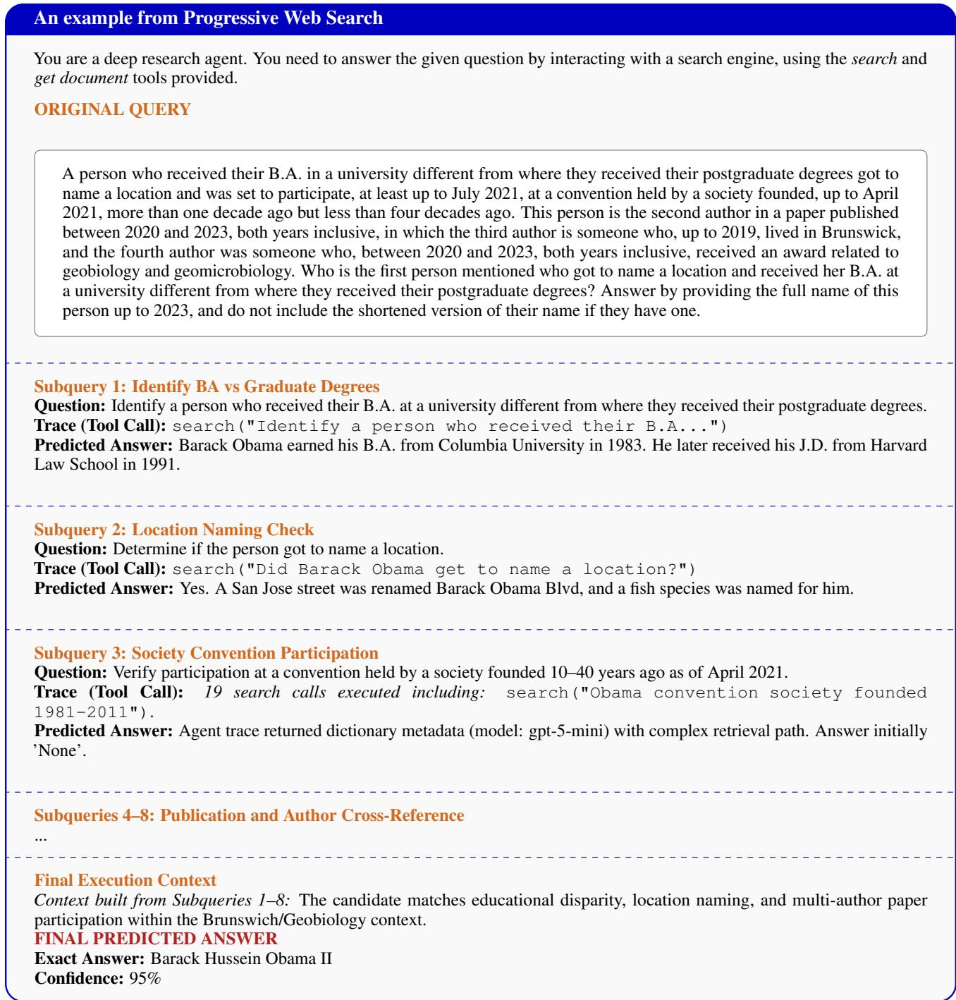  
Figure 6. Data example for the Progressive Web Search task.

<table><tr><td colspan="2">An example for Formal Reasoning (Math)</td></tr><tr><td colspan="2">Background: Mathematical Definitions and Necessary ContextThis section establishes the mathematical foundation for the problem: useful algorithms, definitions, prepositions, lemmas, etc.</td></tr><tr><td>Problem setup: Setting the stage, imagine that we are interested in a collection of k unknown data distributions $\mathcal{D} = \{\mathcal{D}_i\}_{i=1}^k$  supported on  $\mathcal{X} \times \mathcal{Y}$ , where  $\mathcal{X}$  (resp.  $\mathcal{Y}$ ) stands for the instance (resp. label) space. Given a hypothesis class  $\mathcal{H}$  and a prescribed loss function  $\ell : \mathcal{H} \times \mathcal{X} \times \mathcal{Y} \to [-1, 1]$ , we are asked to identify a (possibly randomized) hypothesis  $\widehat{h}$  achieving near-optimal worst-case loss across these data distributions, namely $\max_{1 \leq i \leq k} \underset{(x,y) \sim \mathcal{D}_i, \widehat{h}}{\mathbb{E}} [\ell(\widehat{h}, (x,y))] \leq \min_{h \in \mathcal{H}} \max_{1 \leq i \leq k} \underset{(x,y) \sim \mathcal{D}_i}{\mathbb{E}} [\ell(h, (x,y))] + \varepsilon$  ...</td><td>(7)</td></tr><tr><td colspan="2">...</td></tr><tr><td colspan="2">Algorithm 1 Hedge for multi-distribution learning on VC classes (MDL-Hedge-VC)input: k data distributions  $\{\mathcal{D}_1, \mathcal{D}_2, \ldots, \mathcal{D}_k\}$ , hypothesis class  $\mathcal{H}$ , target accuracy level  $\varepsilon$ , target success rate  $1 - \delta$ . ...</td></tr><tr><td colspan="2">Algorithm 2 Hedge for multi-loss multi-distribution learning (MLMDL-Hedge-VC)input: k data distributions  $\{\mathcal{D}_i\}_{i=1}^k$ , loss function class  $\mathcal{L} = \{\ell^j\}_{j=1}^R$ , hypothesis class  $\mathcal{H}$ , target accuracy level  $\varepsilon$ ...</td></tr><tr><td colspan="2">Iterative Problem Solving Process solve each problem one by one:Question 1: With probability at least  $1 - \delta/4$ , and  $h^t$  (resp.  $w^t$ ) is the hypothesis (resp. weight vector) computed in round t of Algorithm 1, upper bound  $L(h^t, w^t)$  for all  $1 \leq t \leq T$ .Question 2: Lemma 22 Given  $\pi \in \Delta(\mathcal{H})$ , we define  $L_i^\ell(h_\pi) = \mathbb{E}_{h \sim \pi}[L_i^\ell(h)]$ . With probability at least  $1 - \delta/4$ , upper bound  $L(h^t, u^t)$  for every  $1 \leq t \leq T$ , where  $h^t$  (resp.  $u^t$ ) is the hypothesis (resp. weight vector) computed in round t of Algorithm 2.Question 3: Lemma 23 Let  $h^{final}$  be the output policy of Algorithm 2, With probability at least  $1 - \delta/2$ , upper bound  $\max_{i \in [k], \ell \in \mathcal{L}} \frac{1}{T} \sum_{t=1}^{T} L_i^\ell(h^t)$ Question 4: Assume the conditions in Lemmas 22 and 23 hold. Recall the definition of  $h^t$  and  $u^t$  in Algorithm 2, and the definition that OPT =  $\min_{h \in \mathcal{H}} \max_{i \in [k], \ell \in \mathcal{L}} L_i^\ell(h)$ . Also recall that  $v^t = L(h^t, u^t) - \text{OPT}$ . Suppose  $(t_1, t_2)$  is a  $(p, q, x)$ -segment such that  $p \geq 2q$ . Lower bound  $t_2 - t_1$ . (Need to recall the answer from Question 2 and 3.)Question 5: Assume the conditions in Lemmas 22 and 23 hold. Let  $\delta' = \frac{\delta}{32T^4k^2}$ . For any  $1 \leq j \leq \tilde{j}$ , with probability at least  $1 - 8T^4k\delta'$ , upper bound  $|\mathcal{W}_j|$  (Need to recall the answer from Question 2 and 3.)Question 6: Let  $h^{final}$  be the output policy of Algorithm 2. Suppose total sample size exceeds  $\frac{(d+k \log(R)) \min\{log(R), k\}}{\varepsilon^2}$  poly log  $(k, d, \frac{1}{\varepsilon}, \frac{1}{\delta}, \log(R))$ , then upper bound  $\max_{1 \leq i \leq k} \max_{\ell \in \mathcal{L}} \underset{(x,y) \sim \mathcal{D}_i, h^{final}}{\mathbb{E}} [\ell(h^{final}, (x,y))]$ Question 7:...</td></tr></table>

Figure 7. An example from the math formal reasoning task with iterative problem solving in MEMORYARENA.

## A.2. More details in data creation and labeling process

## A.2.1. BUNDLED WEB SHOPPING

Our dataset construction pipeline consists of multiple stages. The initial phase focuses on the category analysis and filtering of the original WebShop data.

## STEP 1: CATEGORY STATISTICS AND FILTERING

First, we conducted a comprehensive frequency analysis of product categories within the WebShop dataset. Utilizing the hierarchical structure of category labels, we employed the Root Category (the first level of the category path, e.g., “Beauty & Personal Care” in “Beauty & Personal Care → Hair Care...”) as the primary partition criterion.

To ensure data validity and mitigate long-tail noise, we established a minimum sample threshold of 150. Only sub-categories containing item counts exceeding this threshold were retained. Based on these statistics, we selected the top-5 root categories with the highest item counts as the core data foundation for subsequent research.

## STEP 2: SCREENING RULE TEMPLATE CONSTRUCTION

In this phase, we hand-crafted a simplified data screening rule template comprising three stages. The template features a progressive structure:

• Level 1: Contains basic attributes: product category, extract pattern, and note. The

extract pattern typically utilizes regular expressions to precisely extract key features from unstructured text.

• Subsequent Levels: Introduce complex logical constraints alongside basic attributes:

– dependency map (Forward Compatibility): Ensures the current item’s specifications (e.g., lens mount type) match the subject device from the previous level.

– reject map (Negative Mutual Exclusion): Explicitly excludes logically conflicting combinations to ensure physical feasibility and logical self-consistency.

All results are evaluated human manual inspections.

## STEP 3: DATA INSTANTIATION AND TASK CONSTRUCTION

Following the establishment of data templates, we proceeded to the phase of data instantiation and purchase task generation.

Candidate Retrieval and Combination Generation Based on the constructed rule templates, we performed large-scale retrieval on the WebShop dataset (containing over one million items) to identify all item chain combinations satisfying the rule constraints. This process yielded a preliminary candidate set of tens of thousands of logically valid combinations.

Distractor Generation and Negative Sampling To construct challenging purchase tasks, we implemented a strict distractor sampling strategy for each level in the item chain:

• Candidate Expansion: First, we retrieved all potential items belonging to the same category label from the full dataset.

• Compatible Distractors: From the candidate pool, we selected 2 items that are logically compatible (satisfying the dependency map) but are not the target item.

• Incompatible Distractors: We selected 2 items that are logically mutually exclusive (satisfying the reject map) to serve as “hard negative” samples, thereby testing the model’s understanding of constraints.

Preference Injection and Ground Truth Determination With 3 compatible candidates (1 target item and 2 compatible distractors) identified, we introduced specific user preferences to determine the unique Ground Truth:

• We defined three typical preference dimensions: Highest Average Rating, Highest Price, and Lowest Price.

• The system randomly selects one preference and identifies the optimal solution among the compatible candidates as the Ground Truth.

Attribute Extraction and Prompt Encapsulation Upon completing item construction for all levels (including Ground Truth, compatible distractors, and incompatible distractors), we manually extract key attributes from unstructured descriptions to achieve structural alignment. Finally, the candidates and task instructions were encapsulated into a standardized Prompt Framework. This framework simulates a real-world user instruction scenario, requiring the Shopping Agent to reason and make decisions from the candidate list based on constraints and preferences, ultimately placing an order for the item matching the Ground Truth.

Test Set Scale Based on the aforementioned pipeline, we end with in a total of 150 high-quality test samples for final evaluation. All data is manually inspected by annotators.

## B. Reproducible Experiment Setups

All of our experiments run with official OpenAI API, Anthropic API, and Vertex AI APIs. For experiments that need to run on GPU, we use NVIDIA H100 GPUs.

## B.1. Prompts and Workflows in MEMORYARENA

Here we provide the prompts and evaluation workflows used across the four environments in MEMORYARENA. Because subtasks share a highly consistent structure, we retrieve memory once at the beginning of each subtask (i.e., session-level memory) to cover the shared skills needed within that subtask. This choice substantially reduces memory retrieval frequency and cost, while maintaining effectiveness in our experiments. If finer-grained control is desired, MEMORYARENA can also be configured to use action-level memory. We list the prompts in bundled web shopping in Figure 8, in Group Travel Plan in Figure 9, progressive web search in Figure 10, and formal reasoning (math) in Figure 11,

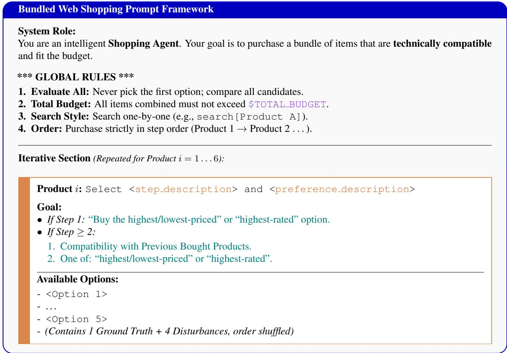  
Figure 8. Bundled Web Shopping Prompt Framework

Benchmarking Agent Memory in Interdependent Multi-Session Agentic Tasks  
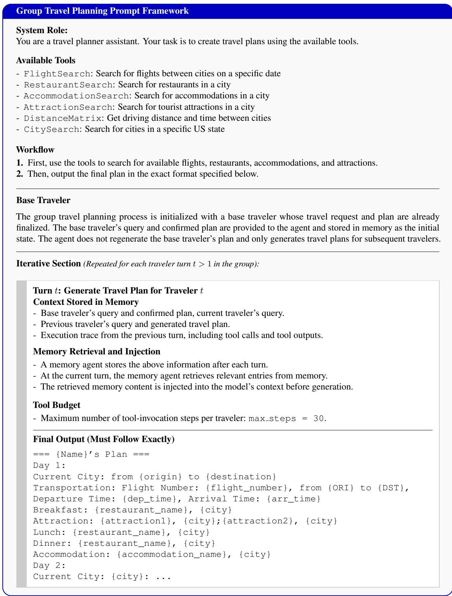  
Figure 9. Group Travel Planning Prompts

Benchmarking Agent Memory in Interdependent Multi-Session Agentic Tasks  
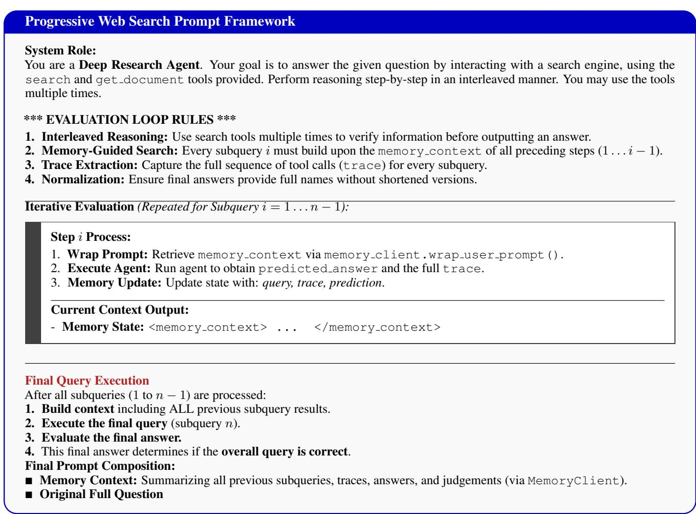  
Figure 10. Prompts used in Progressive Web Search tasks

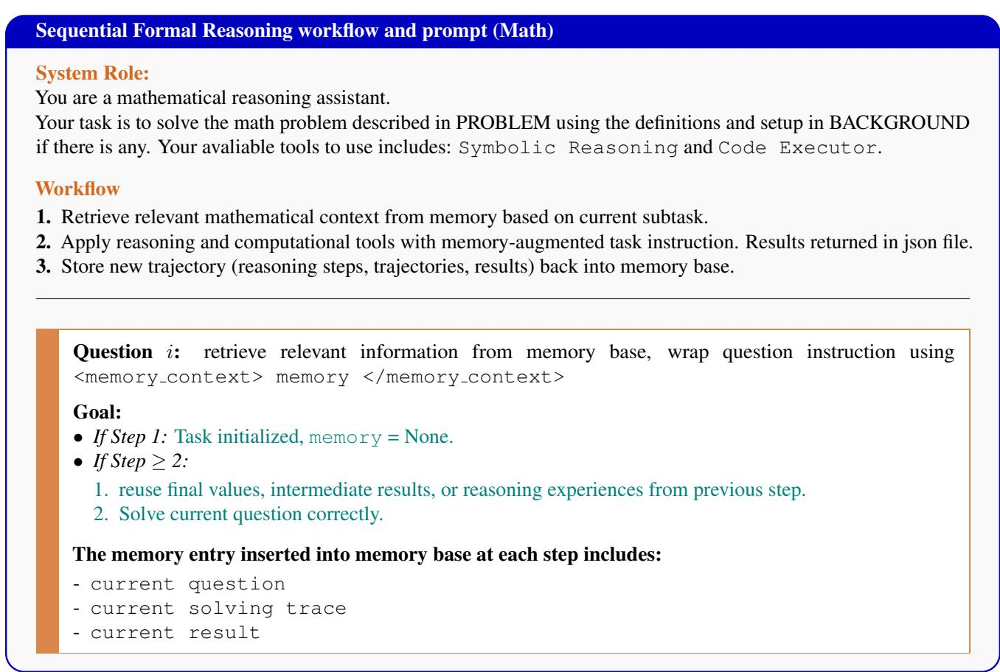  
Figure 11. Prompts and workflow used in Sequential Formal Reasoning (Math as an example) tasks

## B.1.1. BUNDLED WEB SHOPPING

Tasks and Environments. We evaluate various memory systems on the multi-step continuous purchasing tasks within WebShop (Yao et al., 2022). Each task necessitates the agent to sequentially complete multiple purchase sub-goals (e.g., 6 items) within a single shopping scenario, while simultaneously satisfying global constraints (such as cross-item technical compatibility) and adhering to preference rules (e.g., “lowest price” or “highest rating”). The environment operates as a turn-based system, providing inputs in the form of “observation + available action list.” In each turn, the agent is required to output exactly one valid action (e.g., search[...],click[...],click[Buy Now], page navigation, or option selection).

Experiment Settings. We benchmark multiple backbone language agents using unified action-constraint prompts. The generation settings utilize a maximum token limit of max tokens=4096 with default sampling parameters. We cap the single-step interaction rounds at max rounds=20 and implement timeout protection for environment requests (in seconds). We record the context window as the context budget in the experimental configuration. Memory systems are integrated via a unified interface: prior to each decision, retrieved or summarized history is injected into a <memory context> block within the input. Upon the completion of each single-step episode, the information is extracted from the interaction trajectory and final state to update the memory and analysis logs.

Prompt Usage. To operationalize these task requirements and constraints within the language agent, we design a structured prompt framework. This framework explicitly defines the system role and enforces global rules, such as budget limits and search styles. Furthermore, it guides the agent through an iterative decision-making process for each product, ensuring that both technical compatibility and specific user preferences (e.g., lowest price) are rigorously evaluated at every step

## B.1.2. PROGRESSIVE WEB SEARCH

## 1. Models and Hyperparameters

We set the temperature to be 0.1. According to which agentic model we would like to evaluate, we use GPT-5-mini, GPT-4.1-mini, Gemini-3-Flash, and Claude-Sonnet-4.5. The maximum number of tokens for model output is set to 15000.

## 2. Retriever in web search

When the agent answers each subquery, it uses OpenAI’s retriever backend and the text-embedding-3 model to encode queries and documents for semantic search. The retriever tool is set to retrieve the top k = 5 search results, where each result is truncated to the first 512 token of the corresponding document.

## 3. Decompose prompt

You are an expert at breaking down complex, multi-part questions into simpler, self-contained subqueries. Your task is to analyze the given question and decompose it into a series of smaller, more manageable subqueries that, when answered together, would provide all the information needed to answer the original question. Guidelines: 1. Each subquery should focus on a single piece of information or concept

2. Subqueries MUST be completely self-contained and answerable independently- do not use pronouns or references like ”this person”, ”the author”, ”these conditions”, ”they”, ”the movie”, etc.

3. Each subquery should include all necessary context and constraints from the original query

4. Preserve all important details and constraints from the original query

5. Return only the subqueries as a JSON array of strings query

## B.1.3. FORMAL REASONIN (MATH AND PHYS)

Experiment setups. set the maximum output to 8192, as formal reasoning tasks usually produce dense symbolic reasoning traces rather than lengthy natural language. We use a temperature of 0 to guarantee reproducibility. We also requires symbolic results output in LaTex.

## C. Appendix: More Results and Case Studies

## C.1. More results with another task agent

Following prior work (Hu et al., 2025b), we fix a strong task agent to evaluate memory systems. However, to address the concern, we provided additional results with a stronger task agent Claude Sonnet 4.6:

<table><tr><td rowspan="2"></td><td colspan="2">Shopping</td><td colspan="3">Travel</td><td colspan="2">Search</td><td colspan="2">Math</td><td colspan="2">Phys</td></tr><tr><td>SR</td><td>PS</td><td>SR</td><td>PS</td><td>sPS</td><td>SR</td><td>PS</td><td>SR</td><td>PS</td><td>SR</td><td>PS</td></tr><tr><td>Claude-Sonnet-4.6</td><td>0.13</td><td>0.79</td><td>0.00</td><td>0.20</td><td>0.89</td><td>0.06</td><td>0.05</td><td>0.37</td><td>0.4</td><td>0.4</td><td>0.53</td></tr><tr><td>Letta</td><td>0</td><td>0.48</td><td>0.00</td><td>0.00</td><td>0.15</td><td>0.23</td><td>0.11</td><td>0.16</td><td>0.27</td><td>0.4</td><td>0.53</td></tr><tr><td>Mem0-g</td><td>0</td><td>0.49</td><td>0.00</td><td>0.00</td><td>0.12</td><td>0.21</td><td>0.10</td><td>0.17</td><td>0.3</td><td>0.15</td><td>0.41</td></tr><tr><td>Text-Embedding-3-Small</td><td>0.04</td><td>0.55</td><td>0.00</td><td>0.04</td><td>0.42</td><td>0.27</td><td>0.09</td><td>0.37</td><td>0.35</td><td>0.63</td><td>0.68</td></tr><tr><td>MemoRAG</td><td>0.01</td><td>0.54</td><td>0.00</td><td>0.04</td><td>0.47</td><td>0.35</td><td>0.22</td><td>0.30</td><td>0.34</td><td>0.5</td><td>0.60</td></tr></table>

Table 5. MemoryArena results with Claude-Sonnet-4.6.

Results (Table Table 5) show consistent trends: although absolute scores improve slightly (due to a stronger base model), the task success rate remains low, and the relative comparison between long-context, memory systems, and RAG is unchanged. This suggests that our findings are robust across task agents.

Notably, running full evaluation (4,850 subtasks across multiple memory systems) is computationally expensive and incurs substantial API cost, making exhaustive evaluation over many task agents impractical. We design our codebase to be modular and easily extensible by replacing task agents or adding new memory.

## C.2. More Latency Results

Here, we provide task-level latency.

<table><tr><td></td><td>BWS</td><td>GTP</td><td>PWS</td><td>FR(M)</td><td>FR(P)</td><td>AVG</td></tr><tr><td colspan="7">Long Context</td></tr><tr><td>GPT-5.1-mini</td><td>570</td><td>802</td><td>837</td><td>390</td><td>190</td><td>557.8</td></tr><tr><td>GPT-4.1-mini</td><td>186</td><td>425</td><td>196</td><td>154</td><td>123</td><td>216.8</td></tr><tr><td>Claude-Sonnet-4.5</td><td>336</td><td>350</td><td>450</td><td>635</td><td>157</td><td>385.6</td></tr><tr><td>Gemini-3-Flash</td><td>468</td><td>227</td><td>101</td><td>334</td><td>251</td><td>276.2</td></tr><tr><td colspan="7">Memory Systems</td></tr><tr><td>Letta</td><td>1314</td><td>1013</td><td>654</td><td>331</td><td>180</td><td>698.4</td></tr><tr><td>Mem0</td><td>654</td><td>847</td><td>1320</td><td>374</td><td>337</td><td>706.4</td></tr><tr><td>Mirix</td><td>498</td><td>1243</td><td>587</td><td>535</td><td>250</td><td>622.6</td></tr><tr><td>Mem0-g</td><td>672</td><td>1310</td><td>1375</td><td>316</td><td>287</td><td>792.0</td></tr><tr><td>Reasoning Bank</td><td>1296</td><td>987</td><td>869</td><td>499</td><td>207</td><td>771.6</td></tr><tr><td colspan="7">RAG Systems</td></tr><tr><td>BM25</td><td>804</td><td>1094</td><td>1026</td><td>318</td><td>292</td><td>706.8</td></tr><tr><td>Text Embeddings</td><td>762</td><td>604</td><td>450</td><td>441</td><td>275</td><td>506.4</td></tr><tr><td>MemoRAG</td><td>606</td><td>1291</td><td>514</td><td>494</td><td>207</td><td>622.4</td></tr><tr><td>GraphRAG</td><td>576</td><td>726</td><td>862</td><td>449</td><td>256</td><td>573.8</td></tr></table>

Table 6. Latency in memory systems (sec.).

## C.3. More discussions on POMDP: failure to obverse and failure to utilize.

Fail to track with deeper dependency. We conduct an additional analysis by grouping constraints by their causal dependency distance (L0–L4). As shown in Table 7, pass rates decrease monotonically with depth and eventually drop to zero. Crucially, Non-zero performance at shallow levels shows information from earlier sessions is acquired, while degradation indicates failure to retain/use it later. Moreover, even long-context agents (all prior information is preserved, no retrieval or observation loss) still perform poorly. Together, these results indicate that the primary issue is not failure to observe.

<table><tr><td></td><td>L0</td><td>L1</td><td>L2</td><td>L3</td><td>L4</td></tr><tr><td>long-context</td><td>0.48</td><td>0.29</td><td>0.21</td><td>0.18</td><td>0.15</td></tr></table>

Table 7. Pass rate drop with dependency distance (on Group Travel Planning tasks)

Each value is a conditional success rate given previous correct constraints. Since all prior information is fully available in this setting, the monotonic decline cannot be attributed to observation. Instead, it reflects increasing difficulty in reasoning and track states over questions and accumulated memory, especially when memory gets longer (later levels).

Failure to utilize even with oracle-like memory. We first note that defining “oracle memory” is inherently challenging for agentic tasks. In realistic environments such as MEMORYARENA, the latent belief state is difficult to enumerate in advance, and the information needed for success goes beyond factual correctness: it also includes procedural knowledge distilled from prior reasoning and tool-use traces, such as reusable skills or experience, whose optimal representation is not directly verifiable even by humans. However, we try our best to approximate an oracle by constructing all “key information” that exists in memory: we inject golden outcomes of prior subtasks and LLM-distilled concise workflows into long-context agents (so minimizing retrieval loss). The results are:

<table><tr><td></td><td>Shopping</td><td>Travel</td><td>Search</td><td>Math</td></tr><tr><td>original</td><td>0.01</td><td>0.00</td><td>0.06</td><td>0.26</td></tr><tr><td> $\Delta$ </td><td>+0.016</td><td>+0.050</td><td>+0.05</td><td>+0.16</td></tr></table>

Table 8. ∆ performance with oracle memory in long-context settings.

We observe consistent improvements under this simulated oracle. However, overall success rates remain low, suggesting more challenges such as model reasoning over questions and memory than simple “failure to observe”.

## C.4. Case study: Performance Analysis on Different Models in MEMORYARENA

We provide case studies for each environment in MEMORYARENA. Each environments have 2 case studies with different models compared in each case. We also annotated the model that works correctly and wrongly pairwisely. Figure 12 and Figure 13 shows two cases in bundled web shopping, Figure 14 and Figure 15, Figure 16 and Figure 17 shows two cases in progressive web search, Figure 18 and Figure 19 shows two studies in math formal reasoning.

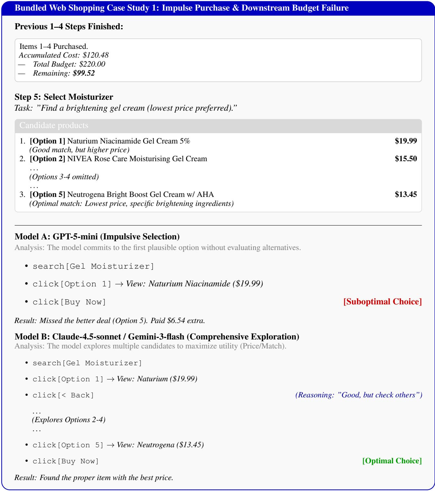  
Figure 12. Comparison of exploration depth. GPT-5-mini exhibits ”satisficing” behavior, purchasing the first relevant result (Option 1) immediately. In contrast, Gemini/Claude demonstrates ”optimizing” behavior by backtracking and exploring intermediate options, ultimately selecting Option 5 which best fits the ”brightening” goal and budget constraints.

## Bundled Web Shopping Case Study 2: RAG Failed Because of Inaccurate Retrieval

## The Crucial Context (Purchase History):

## Current Task Constraints (Step 3):

Goal: Buy a TV Wall Mount ..... Compatibility Rule: ”.... Dolby Atmos pairs well with Low Profile. Compact pairs well with Articulating.” Avoid Rule: ” .... Compact avoids Low Profile.”

## Context Visibility

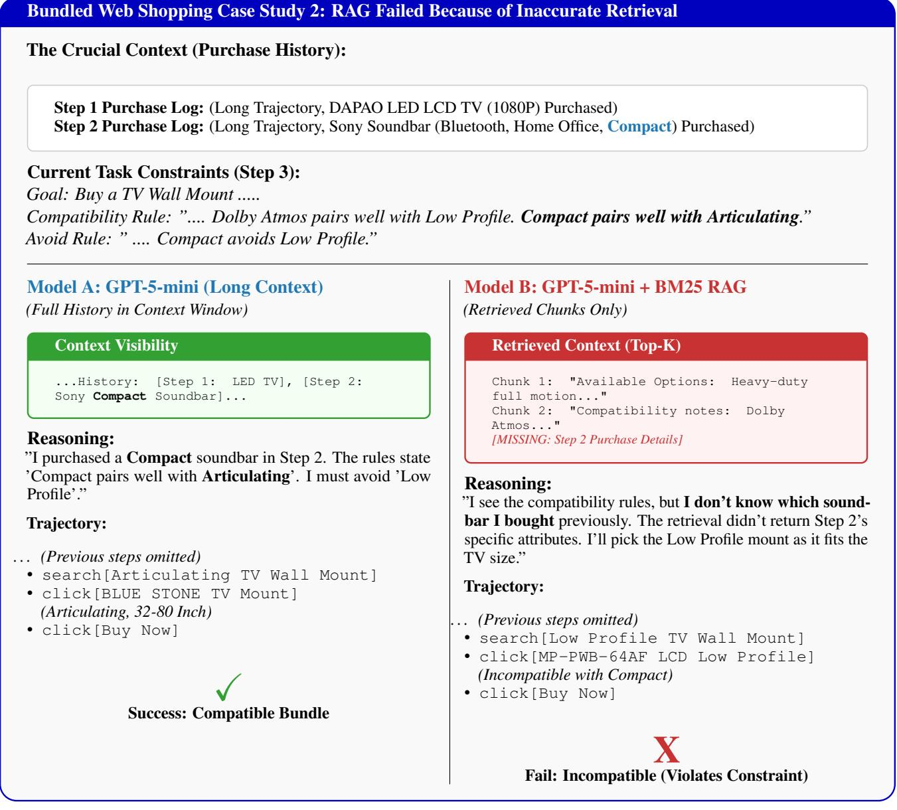

## Reasoning:

”I purchased a Compact soundbar in Step 2. The rules state ’Compact pairs well with Articulating’. I must avoid ’Low Profile’.”

## Trajectory:

. . . (Previous steps omitted)

• search[Articulating TV Wall Mount] • click[BLUE STONE TV Mount] (Articulating, 32-80 Inch)

• click[Buy Now]

Success: Compatible Bundle

## Reasoning:

”I see the compatibility rules, but I don’t know which soundbar I bought previously. The retrieval didn’t return Step 2’s specific attributes. I’ll pick the Low Profile mount as it fits the TV size.”

## Trajectory:

. . . (Previous steps omitted)

• search[Low Profile TV Wall Mount] • click[MP-PWB-64AF LCD Low Profile] (Incompatible with Compact)

• click[Buy Now]

Fail: Incompatible (Violates Constraint)

Figure 13. Impact of Retrieval Failure on Sequential Compatibility. The BM25 RAG model fails to retrieve the ”Compact” attribute from the Step 2 purchase history. Consequently, it violates the negative constraint (”Compact avoids Low Profile”), whereas the Long Context model correctly utilizes the history to select the ”Articulating” option.

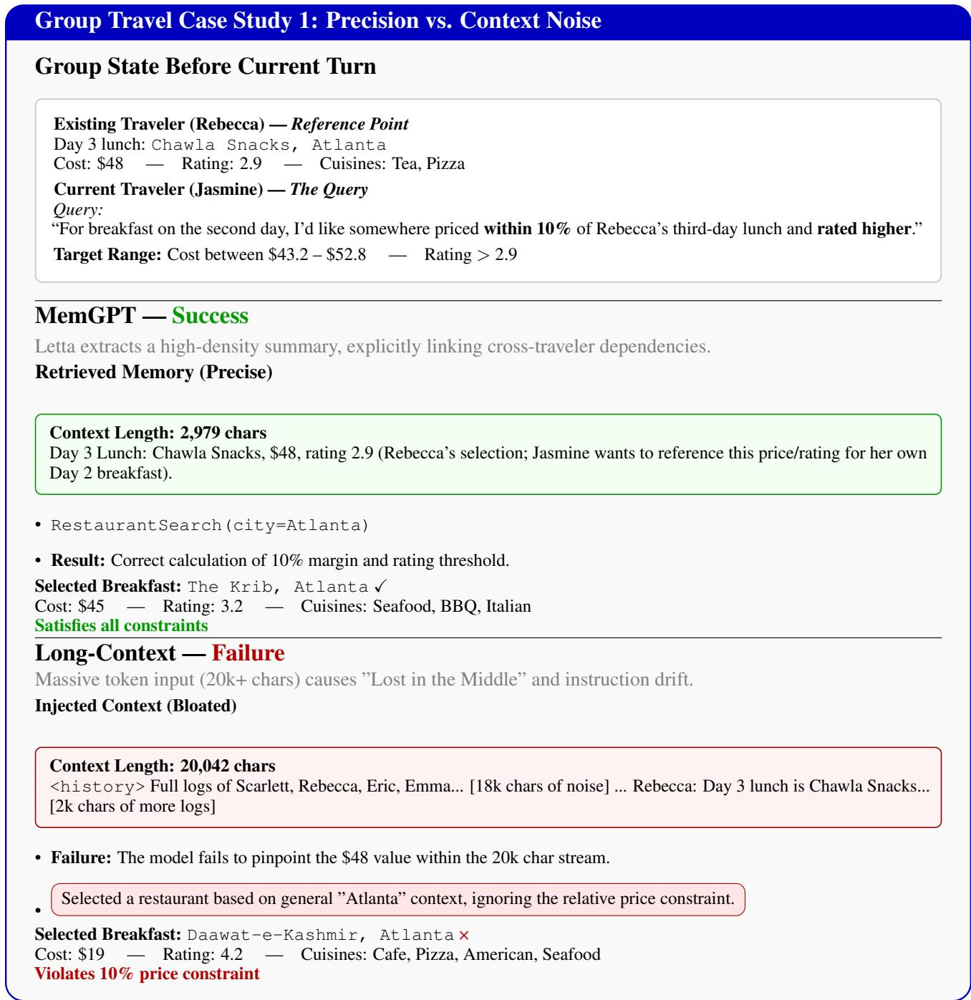  
Figure 14. Case study in Group travel planning: MemGPT achieves best precision in memory, however long-context cannot capture the correct details from the beginning and suffer from “lost in the middle”.

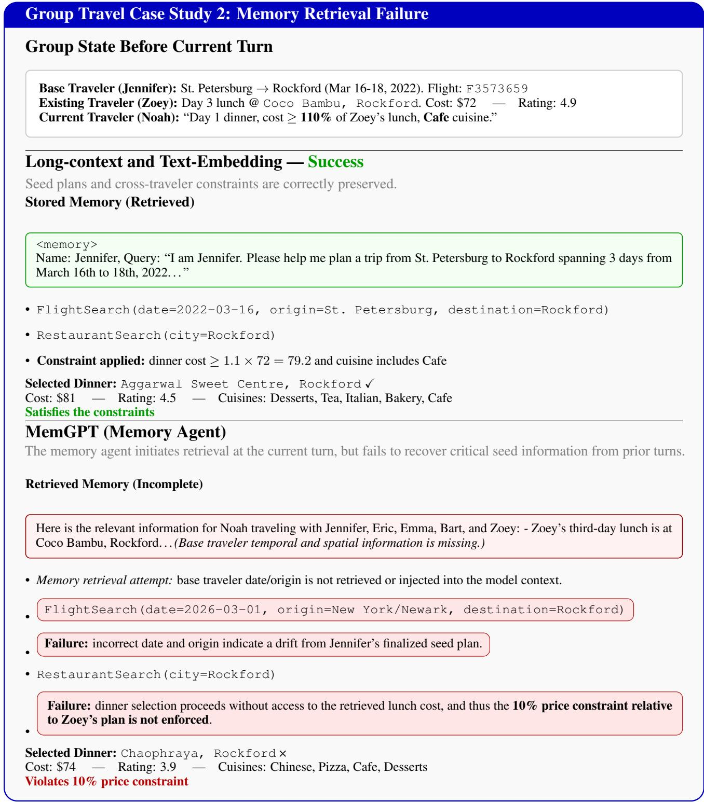  
Figure 15. Group Travel Planning case study: a memory retrieval failure causes drift from the finalized seed plan (wrong date/origin in flight search) and has a downstream constraint violation when selecting dinner.

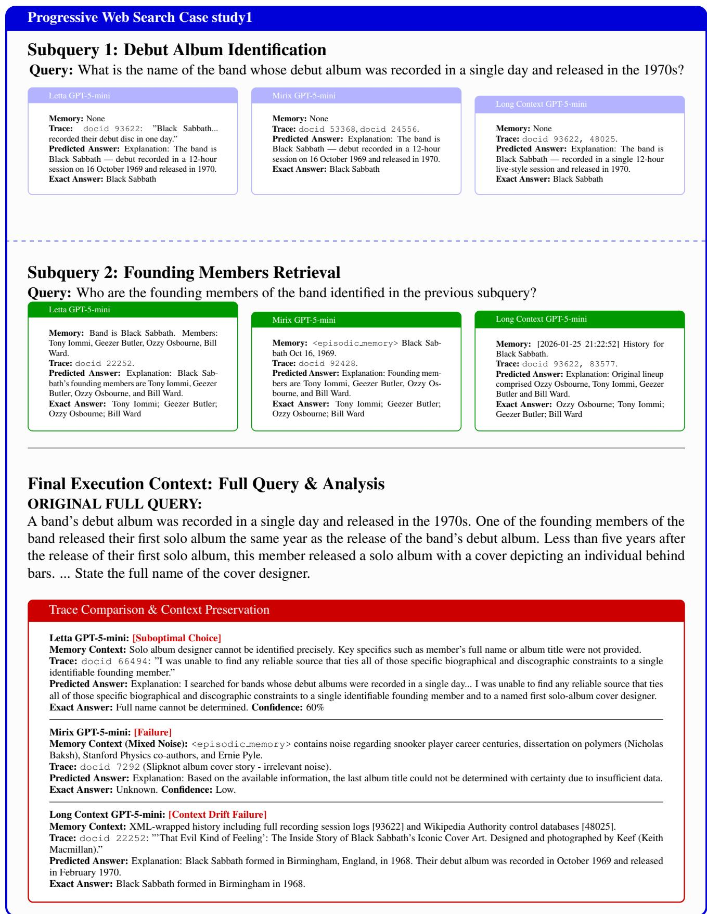  
Figure 16. Progressive Web Search case study 1: comparision between different models in memory retrieval.

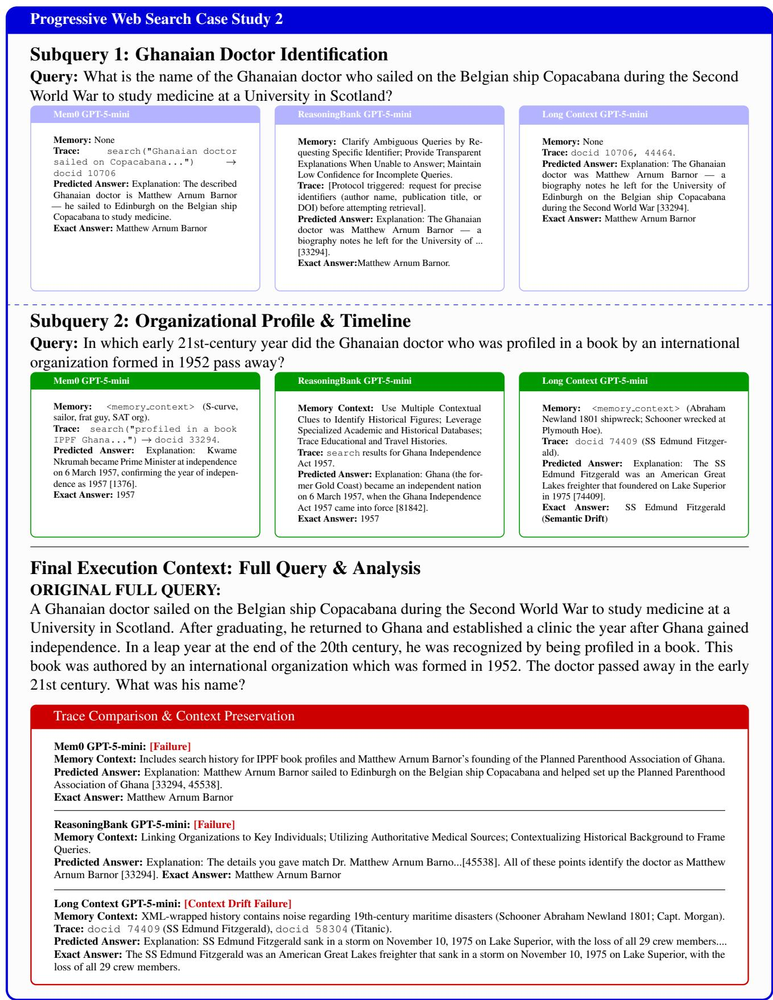  
Figure 17. Progressive Web Search case study 2: comparison between different memory systems.

## Sequential Formal Reasoning (math): Case Study 1

Problem Setup and Background
Lemma 26 For each $i \in \mathcal{W}_j$, there exist $1 \leq s_1 &lt; e_i \leq T$ satisfying $\frac{1}{2^{j+2}} &lt; w_i^{s_i} \leq \frac{1}{2^{j+1}}, \frac{1}{2^j} &lt; w_i^{e_i}$, and $w_i^t &gt; 2^{-(j+2)}$ for any $s_i \leq t \leq e_i$.
Lemma 27 Given $\mathcal{W}_j$ and $(s_i, e_i)$ for $i \in \mathcal{W}_j$ defined above, there exists a group of subsets $\{\mathcal{V}_j^n\}_{n=1}^N$ such that the conditions below hold
(i). $\mathcal{V}_j^n \subset \mathcal{W}_j$, $\mathcal{V}_j^n \cap \mathcal{V}_j^{n'} = \emptyset$, $\forall n \neq n'$;
(ii). $\sum_{n=1}^N |\mathcal{V}_j^n| \geq \frac{|\mathcal{W}_j|}{24\log_2(k)(\log_2(T)+1)}$;
(iii). There exists $1 \leq \widehat{s}_1 &lt; \widehat{e}_1 \leq \widehat{s}_2 &lt; \widehat{e}_2 \leq \cdots \leq \widehat{s}_N &lt; \widehat{e}_N \leq T$, and $\{g_n\}_{n=1}^N \in [1, \infty)^N$ such that for each $1 \leq n \leq N$, $(\widehat{s}_n, \widehat{e}_n)$ is a $\left(2^{-(j+1)} g_n |\mathcal{V}_j^n|, 2^{-(j+2)} |\mathcal{V}_j^n|, \frac{\log(2)}{2\log_2(k)}\right)$-segment with index set as $\mathcal{V}_j^n$. That is, the following hold for each $1 \leq n \leq N$:
- $\frac{g_n |\mathcal{V}_j^n|}{2^{j+2}} &lt; \sum_{i \in \mathcal{V}_j^n} w_i^{\widehat{s}_n} \leq \frac{g_n |\mathcal{V}_j^n|}{2^{j+1}}; \frac{g_n |\mathcal{V}_j^n|}{2^j} \cdot \exp\left(\frac{\log(2)}{2\log_2(k)}\right) &lt; \sum_{i \in \mathcal{V}_j^n} w_i^{\widehat{e}_n}$;
- $\sum_{i \in \mathcal{V}_j^n} w_i^t \geq \frac{|\mathcal{V}_j^n|}{2^{j+2}}$ for any $\widehat{s}_n \leq t \leq \widehat{e}_n$.

Subquery 1: With probability at least $1 - \delta / 4 .$ and $h ^ { t } \left( \mathrm { r e s p . ~ } w ^ { t } \right)$ is the hypothesis (resp. weight vector) computed in round t of Algorithm 1, upper bound $L ( h ^ { t } , w ^ { t } )$ for all $1 \leq t \leq T . . .$ Correct Answer: A tight enough upper bound is $\begin{array} { r } { \overline { { L } } ( h ^ { \overline { { t } } } , w ^ { t } ) \leq \operatorname* { m i n } _ { h \in \mathcal { H } } L ( h , w ^ { t } ) + \varepsilon _ { 1 } } \end{array}$

Subquery 2:...

Subquery 3: Let $h ^ { \mathrm { f i n a l } }$ be the output policy of Algorithm 2. With probability at least $1 - \delta / 2 ,$ , what is the upper bound of $\begin{array} { r } { \operatorname* { m a x } _ { i \in [ k ] , \ell \in \mathcal { L } } \frac { 1 } { T } \sum _ { t = 1 } ^ { T } L _ { i } ^ { \ell } ( h ^ { t } ) } \end{array}$

## Mirix GPT-5-mini

Memory: <episodic memory> User solved a math problem on multi-distribution learning with VC classes using Hedge algorithm, including an upper bound on population weighted loss with high probability for hypotheses and weight vectors computed by the algorithm.</episodic memory> <procedural memory> Uniform convergence upper bound on population weighted loss $L ( h ^ { t } , u ^ { t } )$ for hypotheses in Algorithm 2 for multi-distribution learning with VC classes</procedural memory> Trace: Let H be the hypothesis class and suppose each distribution i provides m i.i.d. labeled samples used to form empirical losses $\hat { L } _ { i } ^ { \ell } ( h )$ By the VC uniform convergence bound (uniform ove $\cdot \ h \in$ H and over the finite set of index pairs ( $i , \ell ) ,$ with probability at least $1 ~ - ~ \delta / \dot { \varepsilon }$ 2 there exists an error term ε (depending on the VC dimension d of H, the sample size m, k and |L| and δ) such that for all $\mathbf { \Psi } : \in \mathbf { \Psi } [ k ] , \ell \in \mathcal { L }$ and all $\mathbf { \Sigma } _ { \mathcal { Y } } \in \mathbf { \Sigma } _ { H }$ we have $\begin{array} { r l r } { | L _ { i } ^ { \ell } ( h ) } & { { } - } & { L _ { i } ^ { \ell } \hat { ( } h ) | \quad \le \quad \varepsilon . } \end{array}$ A convenient explicit form is d ln(2em/d)+ln(2k|L|δ) ε = ,which 2m yields the stated uniform deviation with probability at least $1 - \delta / 2 .$

Predicted Answer: With probability at least 1 ${ \dot { \delta } } / 2 ,$ $\begin{array} { r } { \operatorname* { m a x } _ { i \in [ k ] , \ell \in \mathcal { L } } \ \frac { 1 } { T } \sum _ { t = 1 } ^ { T } L _ { i } ^ { \ell ( h ^ { t } ) } } \end{array}$ ≤ $\begin{array} { r } { \operatorname* { m a x } _ { i \in [ k ] , \ell \in \mathcal { L } } \ \frac { 1 } { T } \sum _ { t = 1 } ^ { T } \hat { L } _ { i } ^ { \ell ( h ^ { t } ) } } \end{array}$ + $\begin{array} { r } { \varepsilon , \mathrm { w h e r e } ^ { \cdot \mathrm { ~ \textit ~ { ~ o n e ~ } ~ } \operatorname* { m a y } \mathrm { t a k e } } \quad \varepsilon } \\ { \sqrt { \frac { d \ln ( 2 e m / d ) + \ln ( 2 k | \mathcal { L } | \delta ) } { \cosh \cosh \cosh \cosh \cosh } } . } \end{array}$ = and d 2m $H$ and m the per-distribution sample size.

## ReasoningBank GPT-5-mini

## Memory: #Memory Item 1: Title Leveraging Uniform Convergence for High-Probability Bounds

\## Description Uniform convergence guarantees can be used to ensure that empirical estimates uniformly approximate true quantities with high probability across all hypotheses and rounds. ## Content By carefully choosing sample sizes and applying uniform convergence results, one can bound the deviation between empirical and true weighted losses simultaneously for all hy potheses and iterations, thus enabling high confidence statements about the algorithm’s out puts over multiple rounds., # Memory Item 2

\## Title Using Empirical Minimizers to Compare Against Randomized Classifiers ## Description The empirical minimizer of a weighted loss in each round provides a baseline that is no wors than the expected empirical loss of any random ized classifier distribution...

Trace: 1) Uniform deviation: By the uniform convergence guarantee (chosen sample sizes and union bounds over the T rounds and all i ∈ $[ k ] , \ell \in { \mathcal { L } } )$ , with probability at least $1 - \delta / 2$ we have simultaneously for every round t, ev ery hypothesis h and every $i , \ell | \hat { \widehat { L } } _ { i } ^ { \ell } ( h ; S _ { t } ) ~ -$ $\begin{array} { r } { L _ { i } ^ { \ell } ( h ) | \quad \leq \quad \varepsilon _ { 1 } , } \end{array}$ where $\widehat { L _ { i } ^ { \ell } } ( \cdot ; S _ { t } )$ is the empirical (weighted) loss on the sample used at round t. 2) Empirical-minimizer property: By construction $h ^ { t }$ minimizes the empirical weighted loss at round t, hence for any distri bution Q on H and any $i , \ell , \widehat { L } _ { i } ^ { \ell } ( h ^ { t } ; \mathcal { \bar { S } } _ { t } ) \ \leq$ 6

$$
\mathbb {E} _ {h \sim Q} [ \widehat {L} _ {i} ^ {\ell} (h; S _ {t}) ]. 3).
$$

h∼Q i Predicted Answer: With probability at least 1 δ/2, $\begin{array} { r l r } { \operatorname* { m a x } _ { i \in [ k ] , \ell \in \mathcal { L } } \frac { 1 } { T } \sum _ { t = 1 } ^ { T } L _ { i } ^ { \ell } ( h ^ { t } ) } & { { } } & { \leq } \end{array}$ maxi∈[k],ℓ∈L infQ∈∆(H) Eh∼Q[Lℓi(h)]+ 2ε1

## MemGPT GPT-5-mini

Memory: The most relevant informa tion from memory for upper bounding $\begin{array} { r } { [ \operatorname* { m a x } _ { i \in [ k ] , \ell \in \mathcal { L } } \ \frac { \mathrm { i } } { T } \sum _ { t = 1 } ^ { T } \bar { L } _ { i } ^ { \ell } ( h ^ { t } ) ] } \end{array}$ where $( h ^ { \mathrm { f i n a l } } )$ is the uniform mixture of $( { h ^ { t } } _ { t = 1 } ^ { T } )$ output by Algorithm 2, with probability at least $1 \dot { - } \delta / \dot { 2 } ,$ is as follows:- Algorithm 2 uses the Hedge algorithm over multiple loss functions and distributions with carefully chosen parameters including total rounds T, step size η, and sample size T ensuring uniform convergence for VC classes. From the uniform convergence and Hedge analy sis, for each round t, with probability at least ${ \bf \Phi } ( 1 - \delta / 4 ) ,$ , the risk satisfies: $L ( h ^ { t ^ { \prime } } , u ^ { t } ) \leq$ m $\begin{array} { r } { \mathrm { n } _ { h \in \mathcal { H } } \dot { L } ( h , u ^ { t } ) + \frac { \varepsilon } { 5 0 } \dot { ] } . . } \end{array}$ Trace: 1) By uniform convergence and the choice of sample size T1 in Algorithm 2, for each round t with high probability the empirical minimizer returned satisfie $L \dot { ( } h ^ { t } , u ^ { t } \dot { ) } \leq$ min $\begin{array} { r l } { \cdot h \in H ^ { L ( h , u ^ { t } ) } } & { { } + } \end{array}$ epsilon/50.2) Running Hedge across T rounds with step size eta and applying the Hedge regret bound gives that the average regret against the best fixed loss/distribution is small. Combining this with the per-round near-optimality from step 1 and concentration over the T rounds (plus a union bound) yields that the worst average loss over all distributions and loss functions is close to the optimal worst-case loss. 3) Collecting the erro terms (the Hedge regret, the uniform convergence slack $\dot { \epsilon } / 5 0 ,$ and concentration constants) and choosing parameters so these sum to at most epsilon, we obtain the stated high-probability bound. Predicted Answer: With probability at least 1 − $\delta / 2 , m a x _ { i \in [ k ] , l \in L } ( \dot { 1 } / T ) \sum _ { t = 1 } ^ { T } L _ { i } ^ { l } ( h ^ { t } )$ $\begin{array} { r } { \leq m i n _ { h \in H } \operatorname* { m a x } _ { i \in [ k ] , l \in L } L _ { i } ^ { l } ( h ) + \epsilon ; } \end{array}$

Figure 18. Case study 1: comparison between memory systems in Math Formal Reasoning.

## Sequential Formal Reasoning (math): Case Study 2 (continued)

Subquery 5: Lemma 22 Given $\pi \in \Delta ( \mathcal { H } )$ , we define $L _ { i } ^ { \ell } ( h _ { \pi } ) = \mathbb { E } _ { h \sim \pi } [ L _ { i } ^ { \ell } ( h ) ]$ ]. With probability at least $1 - \delta / 4 .$ , upper bound $L ( h ^ { t } , u ^ { t } )$ for every $1 \leq t \leq T _ { \cdot }$ , where ht (resp. ut) is the hypothesis (resp. weight vector) computed in round t of Algorithm 2. Correct Answer: A tight enough upper bound is $L ( h ^ { t } , u ^ { t } ) \leq \operatorname* { m i n } _ { h \in \mathcal { H } } L ( h , u ^ { t } ) + \varepsilon _ { 1 }$

$$
h ^ {\mathrm{final}}
$$

$$
\frac {1}{T} \sum_ {t = 1} ^ {T} L _ {i} ^ {\ell} (h ^ {t})
$$

$$
1 - \delta / 2,
$$

Correct Answer: A tight enough upper bound is $\begin{array} { r l } { \operatorname* { m a x } _ { i \in [ k ] , \ell \in \mathcal { L } } \frac { 1 } { T } \sum _ { t = 1 } ^ { T } L _ { i } ^ { \ell } ( h ^ { t } ) } & { { } \leq } \end{array}$ $\begin{array} { r } { \operatorname* { m i n } _ { h \in { \mathcal { H } } } \operatorname* { m a x } _ { i \in [ k ] , \ell \in { \mathcal { L } } } L _ { i } ^ { \ell } ( h ) + \varepsilon } \end{array}$

Subquery 6: Let $h ^ { \mathrm { f i n a l } }$ be the output policy of Algorithm 2. Suppose total sample size exceeds d+k log(R) min{log(R),k}ε2 poly log k, d, 1ε , 1δ , log(R), then upper bound max1≤i≤k maxℓ∈L E -ℓhfinal, (x, y) (x,y)∼Di,hfinal

## Mirix GPT-5-mini

Memory: <episodic memory> User solved a math problem to provide an asymptotic upper bound on the sample complexity of Algorithm 2 with high probability.</episodic memory> <episodic memory> User solved a math problem to upper bound |Wj | using Lemmas 26, 27 and segment length lower bound in multi-distribution learning context.</episodic memory>. <episodic memory>User solved a math problem on multi-distribution learning with VC classes using Hedge algorithm.. Additionally, the user solved a problem to lower bound the length of a (p,q,x)-segment given p >= 2q, showing that the segment length satisfiest2 − t1 >= (log(k|L|))/(2(p − q)2x2).</episodic memory> <procedural memory> Upper bound on |Wj | in multi-distribution learning using segment length lower bound and partitioning </procedural memory> Trace: 1) Uniform convergence. By VC uniform convergence (and the given sample-size lower bound), with probability at least $1 ~ - ~ \delta / 2$ we have simultaneously for every hypothesis h and every distribution i and loss type... 2) Hedge / regret on empirical losses. The internal Hedge/regret guarantee of Algorithm 2 (together with the number of rounds and samples per round ensured by the stated sample-size regime) implies that the final output policy hf inal has empirical worst-case loss at most the empirical minimax loss plus... 3) Combine empirical-to-population approximation with regret bound. Using the uniform deviation bound on both sides of the inequality in step 2 we get with probability at leas $\dot { 1 } - \dot { \delta } . .$ Predicted Answer: With probability at least 1 δ, max1≤i≤k maxℓ∈L $E _ { ( x , y ) \sim \mathcal { D } _ { i } , h ^ { \mathrm { f i n a l } } }$ $[ \ell ( h ^ { \mathrm { f i n a l } } , ( x , y ) ) ]$ ≤ minh∈H max1≤i≤k maxℓ∈L $E _ { ( x , y ) \sim \mathcal { D } _ { i } }$ $\left[ \ell ( h , ( x , y ) ) \right] + \varepsilon .$

## ReasoningBank GPT-5-mini

Memory: # Memory Item 1 ## Title Leveraging Uniform Convergence for High-Probability Guarantees ## Description Use uniform convergence results to simultaneously control deviations between empirical and true losses across all rounds and hypotheses. ## Content By applying uniform convergence with appropriate sample sizes and union bounds over rounds and indices, one can ensure with high probability that empirical losses uniformly ap proximate true losses within a small error, en abling reliable probabilistic upper bounds # Memory Item 2 ## Description Exploit the fact that chosen hy potheses minimize empirical loss to compare their performance against distributions on the hypothesis class. ## Content Recognizing that the chosen hypothe sis at each round minimizes empirical loss allows bounding its loss by the expectation over any dis tribution on hypotheses, facilitating the derivation of tight upper bounds via comparisons to arbitrary mixtures Trace: 1) By standard VC uniform convergence (using the given total sample size scaling), with probability at least $1 - \delta$ we have a uniform deviation bound across all rounds r and hypotheses h: for every r and every h, $\left| L _ { \hat { r } ( h ) } - L ^ { r } ( h ) \right| \leq \epsilon _ { 1 }$ 2) At each round r the algorithm picks hr to minimize the empirical weighted loss, so for any distribution Q on H we have $L _ { \hat { r } } ( h _ { r } ) \leq$ $\mathbb { E } _ { h \sim Q } [ L _ { \hat { r } } ( h ) ] .$ 3) Using the uniform deviation bound to replace empirical by true losses, for every Q: [Lr(h ) ≤ L (h ) + ϵ ≤ $\begin{array} { r l } & { \overset { ^ { \mathrm { t } } } { \underset { ^ { \mathrm { E } } h \sim Q } { \sim } } [ L _ { \hat { r } } ^ { \prime } ( h ) ] + \epsilon _ { 1 } ^ { \prime } \overset { ^ { \mathrm { ~ , ~ } } } { \leq } \mathbb { E } _ { h \sim Q } ^ { - } [ L ^ { r } ( h ) ] + } \end{array}$ Predicted Answer: With probability at least 1 − δ/2, ≤ maxi∈[k],ℓ∈L infQ∈∆(H) Eh∼Q[Lℓ(h)] + 2ε1

## MemGPT GPT-5-mini

Memory: From the stored information about Algorithm 2 and its guarantees: If the total sample size is at least on the order of [ (d+k log R) min{log R,k} ε2 polylog k, d, is the VC dimension of the hypothesis class, -(k) is the number of data distributions,- (R) is the number of loss functions,- (ε) is the desired accuracy,- (δ) is the confidence parameter, then with probability at least $( 1 - \stackrel { * } { \delta } / 2 )$ , the output policy $( h ^ { \mathrm { f i n a } \mathrm { \bar { l } } } )$ of Algorithm 2 satisfies [max1≤i≤k max $\mathbf { \Omega } \in \mathcal { L } ^ { \mathbb { E } } ( \mathbf { \Omega } _ { ( x , y ) \sim \mathcal { D } _ { i } , h } \mathrm { f i n }$ al $\left[ \ell \left( h ^ { \mathrm { f i n a l } } , ( x , y ) \right) \right]$ ≤ minh∈H max1≤i≤k,ℓ∈L $L _ { i } ^ { \ell } ( h ) + \varepsilon . ]$ In other words, the policy output by Algorithm 2 achieves the near-optimal worst-case expected loss across all distributions and losses, within an additive (ε) margin, with high probability, provided the sample complexity exceeds the above threshold. Trace: Assume the total sample size satisfies the stated lower bound. By the given guarantee for Algorithm 2 (from the memory context), when the sample complexity meets or exceeds that threshold, then with probability at least 1 − δ/2 the output policy $_ { h } { \dot { f } } ^ { i n a l }$ satisfies the desired uniform generalization bound. Concretely, this guarantee directly yields the upper bound on the worst-case expected loss over distributions i and losses L: the maximum expected loss of $_ { h } f i n a l$ is at most the optimal worst-case expected loss over hypotheses plus ϵ. Therefore the required upper bound follows immediately from the stated sample-complexity condition and the algorithm’s guarantee Predicted

1≤i≤k maxℓ∈L E -ℓhfinal, (x, y) (x,y)∼Di,hfinal

minh∈H minh∈

max1≤i≤k,ℓ∈L E -ℓh, (x, y) (x,y)∼Di +ε

Figure 19. Case study 2: comparision between memory systems in Math Formal Reasoning.
