# Agent Memory: Characterization and System Implications of Stateful Long-Horizon Workloads

Yasmine Omri $^{1*}$ Ziyu Gan $^{2*}$ Zachary Broveak $^{1}$ Robin Geens $^{3}$ Zexue He $^{1}$ Alex Pentland $^{1,4}$ Marian Verhelst $^{3}$ Tsachy Weissman $^{1}$ Thierry Tambe $^{1}$ $^{*}$ Equal contribution

$^{1}$ Stanford University $^{2}$ Independent Researcher $^{3}$ MICAS, KU Leuven $^{4}$ Massachusetts Institute of Technology

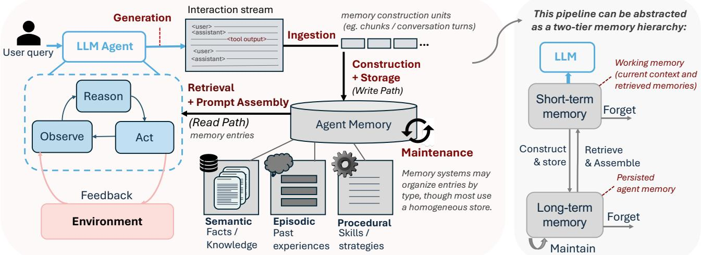  
Figure 1: Agent memory gives rise to short-term working memory and long-term memory: the agent retrieves relevant long-term state into its active context, updates memory after interaction, and maintains stored knowledge over time.

## Abstract

LLM agents are increasingly deployed on long-horizon tasks requiring sustained reasoning over extended interaction histories. Realizing this at scale requires agents to persistently store, retrieve, and update their own memory across sessions. A rich ecosystem of agent memory systems has emerged spanning flat retrieval, LLM-mediated extraction, consolidating fact stores, and agentic control flows. Yet, their system-level behavior remains uncharacterized. We present the first systems characterization of agent memory. First, we introduce a system-oriented taxonomy classifying agent memory systems along four axes. Second, we build a phase-aware profiling harness attributing cost to construction, retrieval, and generation. Third, we characterize ten representative systems across two benchmark suites, uncovering how design choices shift cost across the write and read paths. Finally, we derive 10 system recommendations covering construction scheduling, capability floors, amortization via query volume, freshness-latency tradeoffs, and fleet-scale management.

Correspondence to: yomri@stanford.edu, ziyu.gan@outlook.com

## 1. Introduction

Large language models (LLMs) are increasingly deployed as autonomous agents capable of multi-step reasoning, tool use, and persistent interaction over extended time horizons. Stateful execution enables LLMs to act as personal assistants that track user preferences across weeks of dialogue, code agents that maintain project context across editing sessions, deep-research agents that synthesize evidence across long investigation trajectories, and enterprise systems that integrate structured business data with ongoing conversational history $[16, 17, 25]$ . In these regimes, LLM agents accumulate state that far exceeds what a single inference context can hold. As such, realizing these long-horizon capabilities at scale requires agents to persistently store, selectively retrieve, and incrementally update their own memory across sessions, as illustrated by Fig.1.

Agent memory generalizes RAG from static retrieval to mutable state management. The evolution toward stateful agents reflects a progression in how LLMs manage knowledge. Early systems treated knowledge as purely parametric, encoded in model weights at training time. Retrieval-augmented generation (RAG) decoupled knowledge from parameters by attaching LLMs to static external corpora, enabling selective access to non-parametric state at inference time $[8, 11]$ . Long-horizon agents extend this further: the memory corpus is no longer a fixed document collection that is preprocessed and indexed a priori, but a mutable state produced by the agent's own interaction stream, often per user, and may be appended, summarized, consolidated, linked, or rewritten across sessions as new evidence arrives. This shift transforms memory from a passive retrieval target into an active systems component with a write path, a search path, and an ongoing maintenance policy.

A natural baseline is to preserve the full interaction history in the model's context window, relying on its native long-context capability as the memory mechanism. While context limits have rapidly scaled from tens of thousands to over one million tokens in just the last two years [23], this approach faces three fundamental limits. First, continuous multi-session interactions and tool traces inevitably exceed any fixed context budget, making external memory a functional prerequisite. Second, prefill costs scale quadratically with history length. Prefix caching mitigates this within active sessions but fails across sessions due to cache eviction and the massive KV-cache memory pressure placed on the serving stack. Third, reasoning and recall fidelity degrade significantly in long sequences. Models exhibit a "U-shaped" performance curve where facts in the middle of the context are routinely lost [13], and their effective context length for complex reasoning is often a fraction of the claimed window [5]. External memory systems resolve these constraints by decoupling capacity from context length. By persisting state externally and retrieving only a query-relevant subset, they bound per-query prefill costs and enable scalable, stateful execution for long-horizon agents.

The last year has seen a surge of agent memory systems capable of ingesting, encoding, and persisting an interaction stream into a queryable state. Their designs differ dramatically in construction mechanism, database structure, retrieval flow, and update policy $[1-3, 16, 26, 29]$ . Existing benchmarks evaluate these systems purely on downstream accuracy $[6, 14, 27, 28]$ , leaving their system-level behavior uncharacterized. Yet, these design choices drastically and asymmetrically redistribute cost: a system that compresses history into atomic facts slashes query-time prompt length but pays orders-of-magnitude more in construction-time LLM prefill; a graph-based memory improves relational retrieval while multiplying embedding traffic and storage footprint. These costs are invisible to accuracy metrics, yet critically dominate at deployment scale. In this paper, we present the first systems study of agent memory algorithms, spanning the full design space. Our study is organized around three research questions:

1) What are the key tradeoffs among emerging paradigms for constructing and using memory in long-horizon agent workloads?

2) What computational costs and system opportunities do these workloads expose, and what demands do they place on deployment infrastructure?

3) How do specific algorithmic design choices concerning the construction mechanism, storage organization, retrieval policy, and update strategy shape observable system characteristics such as utilization, bandwidth, latency, and scalability?

Our analysis reveals that agent memory workloads impose system needs beyond traditional LLM serving, making the following four contributions:

\- A system-oriented taxonomy classifying ten agent memory systems along four axes (construction, storage, retrieval, and mutability) with predicted cost signatures per paradigm.

\- A phase-aware profiling harness (to be open-sourced) tracking tokens, model calls, GPU utilization, and latency across construction, retrieval, and generation.

\- A comprehensive systems characterization spanning construction cost shape, capability thresholds, amortization structure, freshness scheduling, footprint growth, and retrieval tail behavior.

\- Ten system recommendations for agent memory serving infrastructure, scheduling, and system selection.

## 2. Agent Memory Paradigms

This section introduces the execution structure and design space of agent memory systems. We first decompose agent memory execution into its core runtime stages (Sec. 2.1), then categorize recent agent memory systems into four paradigms according to how they construct, organize, and retrieve persistent state (Sec. 2.2). Table 1 summarizes the representative systems considered in this study.

## 2.1. Agent Memory Execution Pipeline

Agent memory systems transform an interaction stream into persistent state that can be reused across future agent invocations. Although implementations differ widely, most systems can be decomposed into seven stages: ingestion, memory construction, storage, retrieval, prompt assembly, generation, and maintenance.

Ingestion. The ingestion stage receives the raw interaction stream, which may include user-assistant dialogue, tool calls, documents, execution traces, and environmental feedback. Ingestion defines the unit of memory processing: individual turns, fixed-size chunks, sliding windows, or complete sessions. This choice determines write granularity and the number of downstream construction operations.

Memory construction. We use memory construction to denote the write-path transformation from raw interaction history into persistent memory records. Construction takes one of four forms: absent (history retained directly in the prompt), deterministic (chunking or indexing without any LLM), LLM-mediated (extraction of facts, summaries, or structured records at predefined points, optionally with add, update, or delete consolidation over prior memories), or agentic (LLM-controlled writes, tool invocation, and record mutation) [1, 16, 26, 29].

Storage. The storage stage persists constructed memories in a system-specific agent database, which is not necessarily a vector store. Memories may be stored as raw prompt buffers, inverted indices, dense vector indices, knowledge graphs, or multi-store combinations coupling lexical, vector, graph, and structured metadata. The storage substrate determines memory footprint, update cost, index rebuild requirements, and available retrieval operators.

Retrieval. The retrieval stage selects memory records relevant to the current query. Retrieval ranges from a single-shot sparse or dense search to multi-stage pipelines combining sparse search, dense search, graph traversal, reranking, and filtering. In agentic systems, retrieval becomes a tool-mediated control loop where the LLM decides when to search, which memory type to query, and whether retrieved evidence is sufficient.

Prompt assembly. Retrieved memories are serialized into the final model context before generation. This stage is the interface between the external memory system and the LLM serving stack, yielding the prefill length of the final answer-generation call.

Generation. The generation stage invokes the task LLM on the current query and assembled memory context. All agent memory systems converge here, but arrive with different prompt lengths and prior orchestration costs. Two systems may use the same LLM and produce similar answers while imposing very different write-path and read-path workloads.

Maintenance. The maintenance stage updates memory over the agent's lifetime through deduplication, consolidation, conflict resolution, forgetting, compression, or re-embedding. In many current systems, maintenance is weak or absent: memory accumulates indefinitely with no freshness or pruning policy, which becomes critical for long-lived agents where state grows continuously and may become redundant or stale.

## 2.2. Taxonomy of Agent Memory Paradigms

Based on how the agent builds and interacts with the memory, we classify agent memory systems into four Paradigms: long-context memory, flat RAG memory, structure-augmented RAG memory, and agentic control flow. Table 1 summarizes representative systems across these paradigms and records their construction pipeline, agent database, retrieval pipeline, and mutability. For our workload characterization, we select ten agent memory systems spanning all four paradigms and their subdivisions. The remainder of this section describes each paradigm and its representative agent memory systems in turn.

PARADIGM I: Long-context memory. Long-context memory uses the model context itself as the memory substrate. Prior interactions are retained as raw text and passed directly, or after truncation, to the LLM.

① long\_context [5, 13]. This agent memory system performs no memory construction and stores no external representation. The full interaction history is inserted into the prompt, making retrieval equivalent to passthrough with maximal final-prompt growth.

PARADIGM II: Flat RAG memory. Flat RAG memory applies a deterministic indexing pipeline (each lexical or vector index) to raw interaction chunks. Construction is append-only and does not involve a LLM. Retrieval is typically single-shot. This paradigm is operationally closest to classical RAG, except the corpus is produced by the agent's own interaction stream rather than a static document collection.

② BM25 [19] chunks the interaction history into an inverted index. Construction uses no LLM or embedding model; retrieval is lexical top-k. BM25 represents the lowest-complexity external-memory design in our suite.

③ EmbedRAG [7, 8, 11] chunks and embeds the interaction history into a dense index. Retrieval embeds the query and returns nearest-neighbor chunks. Unlike BM25, construction and retrieval both route through the embedding service, but the write path remains single-shot and append-only.

PARADIGM III: Structure-augmented RAG memory. These systems use an LLM as a fixed extractor to derive facts, summaries, entities, triples, or graph records from the interaction stream $[1-3, 18, 21]$ . The LLM is called at predefined points to produce structured outputs, not as a free-form controller. We distinguish append-only variants, which enrich the retrieval substrate without revising prior records, from consolidating variants, which distill or update records over time.

PARADIGM III.a: Append-only structure-augmented RAG.

④ GraphRAG [2]. Uses an LLM to extract entity-relation structure from chunks, storing entities, relationships, and source chunks alongside dense representations. Retrieval combines dense lookup with graph expansion, exposing LLM-based extraction on the write path and graph traversal on the read path.

⑤ HippoRAG v2 [3]. Builds an associative memory over passages, entities, and facts via OpenIE-style extraction, with each view embedded separately and linked through a graph. Retrieval propagates relevance via Personalized PageRank over a coupled passage-entity-fact graph before reranking.

PARADIGM III.b: Consolidating structure-augmented RAG.

⑥ Mem0 [1]. Rewrites conversation turns into atomic facts and resolves each against existing memories via ADD, UPDATE, or DELETE decisions. Retrieval is compact: query embedding matched against the fact store with no retrieval-side LLM, separating a semantically expensive write path from a lightweight read path.

⑦ SimpleMem [12]. Processes dialogue through sliding windows into distilled memory entries with semantic, lexical, and structured views. Retrieval is hybrid, combining semantic search, keyword search, and structured filtering, with optional LLM planning and reflection rounds to expand evidence.

PARADIGM IV: Agentic control flow. Agentic memory systems expose memory operations to the LLM as part of its decision loop, turning construction and retrieval into variable-depth control flow $[16, 22, 26, 29]$ . Unlike Paradigm III, the LLM decides when to write, which tool to invoke, and whether retrieved evidence is sufficient.

TABLE 1: Agent Memory Systems. Categorization of representative agent memory systems into four paradigms with their construction pipeline, agent database, retrieval pipeline, and mutability. In the retrieval columns, “LLM” indicates an LLM call before final answer generation.

<table><tr><td rowspan="2">Paradigm</td><td rowspan="2">Agent Memory System</td><td colspan="3">Construction Pipeline</td><td colspan="2">Agent DB</td><td colspan="2">Retrieval Pipeline</td><td rowspan="2">Mutability</td></tr><tr><td>Agent Ctrl.</td><td>LLM</td><td>Embed</td><td>Struct.</td><td>Store</td><td>LLM</td><td>Flow</td></tr><tr><td>I: Long-context memory</td><td>long_context</td><td>✗</td><td>✗</td><td>✗</td><td>✗</td><td>raw context</td><td>✗</td><td>passthrough</td><td>append</td></tr><tr><td rowspan="2">II: Flat RAG memory</td><td>BM25</td><td>✗</td><td>✗</td><td>✗</td><td>✗</td><td>inverted index</td><td>✗</td><td>lexical top-k</td><td>append</td></tr><tr><td>embedRAG</td><td>✗</td><td>✗</td><td>√</td><td>✗</td><td>dense store</td><td>✗</td><td>dense top-k</td><td>append</td></tr><tr><td rowspan="2">III.a: Structure-aug. RAG append-only</td><td>GraphRAG</td><td>✗</td><td>√</td><td>√</td><td>√</td><td>graph store</td><td>optional</td><td>graph expand</td><td>append</td></tr><tr><td>HippoRAG v2</td><td>✗</td><td>√</td><td>√</td><td>√</td><td>multi-view graph</td><td>optional</td><td>PPR rerank</td><td>append</td></tr><tr><td rowspan="2">III.b: Structure-aug. RAG consolidating</td><td>Mem0</td><td>✗</td><td>√</td><td>√</td><td>√</td><td>dense store</td><td>✗</td><td>fact top-k</td><td>consolidate</td></tr><tr><td>SimpleMem</td><td>✗</td><td>√</td><td>√</td><td>√</td><td>hybrid store</td><td>√</td><td>iterative hybrid</td><td>consolidate</td></tr><tr><td rowspan="3">IV: Agentic control flow</td><td>A-Mem</td><td>√</td><td>√</td><td>√</td><td>√</td><td>graph store</td><td>✗</td><td rowspan="2">graph-structured map-reduce tool calls</td><td>mutate</td></tr><tr><td>Letta</td><td>√</td><td>√</td><td>optional</td><td>√</td><td>blocks+archive</td><td>√</td><td>mutate</td></tr><tr><td>MIRIX</td><td>√</td><td>√</td><td>√</td><td>√</td><td>multi-store DB</td><td>√</td><td>routed typed-memory search</td><td>mutate</td></tr></table>

⑧ A-Mem [29]. Treats memory as an evolving note graph. Each new note is matched against nearby memories and an LLM evolution step updates links, metadata, and neighboring records, exposing stateful mutation on the write path.

⑨ Letta [10]. Implements the MemGPT [16] abstraction, separating compact core memory from archival memory and exposing reads and writes as LLM-callable tools. Memory access is an action selected by the agent, making latency dependent on when and how the LLM invokes memory operations.

⑩ MIRIX [26]. Routes incoming information to type-specific extractors across episodic, semantic, procedural, and resource memory stores. Retrieval uses type-specific operators including vector search, temporal filtering, and LLM-based synthesis, stressing both the LLM control path and the heterogeneous database layer.

## 3. Workload Suite and Profiling Harness

## 3.1. Workload Suite

MemoryAgentBench. We use MemoryAgentBench (MAB) as our primary benchmark $[6]$ . MAB converts long-context tasks into incremental multi-turn streams and evaluates four memory competencies: accurate retrieval, test-time learning, long-range understanding, and selective forgetting. Table 2 summarizes the task families. Each sample is fed incrementally in 4096-token chunks. We use the full suite to study quality trends, but center our systems characterization on LongMemEval\_S\_\*, the most widely adopted long-term conversational memory setting in MAB. This workload contains five samples, each with approximately 360K tokens of history and 60 queries (300 total), cleanly separating construction over a long interaction history from repeated query-time retrieval and generation.

Because agent memory systems expose many implementation degrees of freedom, a perfectly apples-to-apples comparison is not possible. We therefore standardize the dominant controllable factors while preserving each system's native execution model. Within each model configuration, all systems use the same generation LLM and the same embedding backbone when LLM calls and/or embeddings are required. Histories are streamed in 4096-token chunks, matching the MAB protocol, but we retain each system's native buffering, parallel ingestion, and cross-chunk consolidation behavior, since these mechanisms are part of the system being characterized. At query time, we cap retrieval at 10 memory entries for all systems. In local-model settings with restricted context windows, if a system overflows the context budget, we reduce retrieval to 5 entries; for Letta, we additionally use 512-token ingestion chunks to avoid repeated context overflow during tool-mediated memory construction.

Several systems were originally designed for conversational agents rather than the full diversity of MAB tasks. To avoid penalizing them for prompt-format mismatch rather than memory quality, we make minimal task-adaptation changes. For dialogue-oriented systems such as SimpleMem, we update the extraction prompts so that they can consume non-dialogue histories and preserve task-relevant facts. For A-Mem, whose native parser assumes each conversational turn forms a coherent memory note, we aggregate consecutive fine-grained parsed units on non-dialogue datasets so that memory notes are comparable in granularity to conversation-derived notes. For Mem0 on in-context-learning datasets, we replace the default personalization-oriented extraction prompt with an ICL-aware prompt that preserves integer labels verbatim, since these labels are the task signal. For Letta with local models, we cap repeated tool calls during construction and retrieval and lightly specialize the system prompt to the task format. These adaptations are restricted to interface and prompt-level compatibility changes. For Letta, the tool-call caps prevent local models from emitting hundreds of duplicate memory tool calls, and task-specific system prompts ensure that task-critical symbols, such as ICL class labels, are stored rather than summarized away. For A-Mem, local backbones use the plain-text prompt variant, while API backbones retain the original JSON-schema prompt. For Mem0, the

ICL-aware extractor is applied only to ICL datasets; all other ingestion behavior is unchanged.

TABLE 2: MemoryAgentBench workloads. MAB groups memory-agent workloads into four task categories. AvgL denotes the average input length reported by MAB.

<table><tr><td>Task Category</td><td>Datasets</td><td>AvgL.</td></tr><tr><td>Accurate retrieval</td><td>SH-Doc QA, MH-Doc QA, LongMemEval_S_*, EventQA</td><td>197K-534K</td></tr><tr><td>Test-time learning</td><td>BANKING77, CLINC150, NLU, TREC, MovieRec</td><td>103K-1.44M</td></tr><tr><td>Long-range understanding</td><td>∞Bench-Sum, Detective QA</td><td>124K-172K</td></tr><tr><td>Selective forgetting</td><td>FactConsolidation-SH/MH</td><td>262K</td></tr></table>

MemoryArena. We additionally use MemoryArena $[4]$ , which contains multi-session tasks, where later sessions depend on information established earlier. We use its session structure to surface a systems property static benchmarks hide: freshness-latency tradeoff in Sec. 4.6. When construction is slower than session arrival, the system must either block queries until writes commit or serve stale memory, exposing scheduling and write-prioritization opportunities.

## 3.2. Serving and Hardware Setup

We evaluate two construction regimes. In the remote-construction regime, construction uses OpenAI-hosted models (GPT-4o-mini or GPT-4.1-mini for LLM calls, text-embedding-3-small for embeddings), matching most systems' original release configurations. In the local-construction regime, all models are served locally on one NVIDIA H100 80 GB HBM3 GPU via vLLM [9], enabling measurement of hardware utilization, energy, and phase-level bottlenecks. Each system runs in an isolated SLURM job, with one GPU and six Intel Xeon Platinum 8480C cores. The LLM ladder comprises Qwen3-32B, Qwen3-14B, Qwen3-8B, and Qwen3-1.7B; the embedding model is Qwen3-Embedding-0.6B. Qwen3-32B and Qwen3-14B use FP8 weight quantization to fit within a single 80 GB serving stack with sufficient KV-cache headroom for long-prefill execution [15, 24]; smaller models use BF16. The LLM server is allocated $75\%$ of GPU memory and the embedding server $15\%$ . Thinking mode is disabled for all calls to avoid context overflow from verbose reasoning traces.

## 3.3. Profiling Harness

We build a phase-aware profiling harness (to be open-sourced) that attributes cost to three logical phases: memory construction, retrieval, and generation. The harness records API telemetry and hardware telemetry on the same monotonic timeline, enabling per-phase attribution of token volume, call structure, latency, utilization, and energy.

API telemetry. We instrument every chat-completion and embedding request (whether remote or local through vLLM) issued by an agent memory system, recording call type, source label, start/end time, latency, prompt tokens, completion tokens, embedding input tokens, and number of embedded sequences. Calls are tagged with the active phase and the chunk, window, turn, or query index that triggered them.

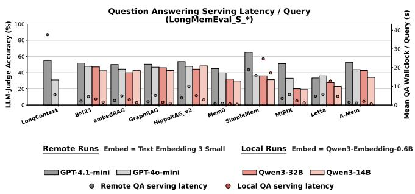  
Figure 2: Long-context prompting vs. external agent memory. Per-query serving latency (retrieval + generation, excluding construction) on LongMemEval\_S\_\* Remote construction via OpenAI API, Local construction via vLLM.

Hardware telemetry. A polling monitor samples GPU counters via NVML and DCGM-class GPM counters, recording device power, GPU utilization, VRAM footprint, SM activity, tensor-core activity, and HBM bandwidth. Samples are aligned with phase markers, and phase energy is computed by integrating device power over each interval. Together, the API and hardware telemetry characterize each agent memory system as a workload: call volume, prompt and embedding traffic, GPU energy, and how control flow manifests as construction, retrieval, and user-visible generation latency.

## 4. Characterizing Agent Memory Workloads

This section characterizes agent memory as a systems workload, tracing how design choices shift cost across construction, retrieval, and generation, and how operators should select and host agent memory systems for SLO-bound serving and fleet-scale deployment.

## 4.1. Why Agent Memory

To quantify the benefits of long-horizon agent memory systems over full-history baselines, we measure the task accuracy and execution times of running LongMemEval\_S\_\* for a multitude of agent memory systems. Fig. 2 plots per-query serving latency against accuracy, where each system ingests 5 samples of $\sim 360\mathrm{K}$ tokens of history each (300 total queries). Construction cost is excluded here and addressed in Sec. 4.2. Most agent memory systems serve queries in a fraction of long-context wall time while matching or exceeding its accuracy: Mem0 achieves $< 0.1$ s per query versus $\sim 38$ s for long-context (GPT-4.1-mini, OpenAI API, averaged over 300 queries). The taxonomy predicts this spread directly. Paradigm I pays full-history prefill at every query. Paradigm II eliminates the LLM from construction and performs deterministic top- $k$ retrieval, yielding the lowest per-query cost at the price of expressiveness. Paradigms III and IV move work into construction and introduce richer retrieval pipelines, giving query-time cost lower than long-context but higher and more variable than flat retrieval. Yet, Fig. 2 shows two orders of magnitude spread in per-query latency across systems on (local) identical hardware. The remainder of this section reveals comparable spread in construction cost, capability requirements, and storage footprint.

Insight 1: For long-horizon workloads, full-history prefill cost is substantial and grows with accumulated history. Agent memory systems reduce this cost, but span two orders of magnitude in per-query serving latency on identical hardware, with comparable spread in construction costs. These costs are invisible to accuracy metrics, and vary based on the system's construction and retrieval algorithms.

Recommendation 1: Long-horizon agent deployments should treat agent memory system selection as a system-level decision. Accuracy alone is an insufficient criterion when systems differ by orders of magnitude in construction cost, serving latency, and storage footprint.

## 4.2. Construction Dominates the Agent Lifecycle

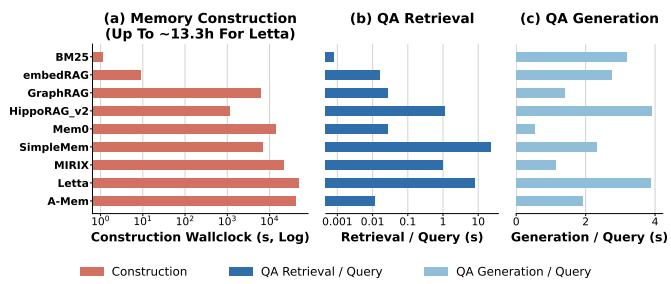  
Figure 3: Phase cost breakdown. Paradigm III and IV agent memory systems shift the majority of end-to-end energy into construction, which is invisible to the user at query time.

TABLE 3: End-to-end cost summary on LongMemEval (Qwen3-32B, n = 300 queries). Construct + 300 QA.

<table><tr><td>Agent memory system</td><td>Acc.</td><td>Wall</td><td>Calls</td><td>Total kJ</td><td>J/correct</td></tr><tr><td>BM25</td><td>47.0</td><td>16.3m</td><td>300</td><td>582</td><td>4,128</td></tr><tr><td>GraphRAG</td><td>46.0</td><td>1.83h</td><td>3,215</td><td>2,082</td><td>15,084</td></tr><tr><td>HippoRAG v2</td><td>44.3</td><td>44.2m</td><td>2,743</td><td>1,339</td><td>10,079</td></tr><tr><td>A-Mem</td><td>42.7</td><td>11.76h</td><td>19,230</td><td>14,864</td><td>116,116</td></tr><tr><td>embedRAG</td><td>39.8</td><td>14.4m</td><td>610</td><td>495</td><td>4,144</td></tr><tr><td>SimpleMem</td><td>36.0</td><td>3.92h</td><td>4,447</td><td>5,481</td><td>50,749</td></tr><tr><td>Mem0</td><td>32.0</td><td>4.02h</td><td>4,538</td><td>4,878</td><td>50,813</td></tr><tr><td>Letta</td><td>27.7</td><td>14.36h</td><td>18,394</td><td>15,429</td><td>185,873</td></tr><tr><td>MIRIX</td><td>20.0</td><td>6.03h</td><td>7,655</td><td>8,678</td><td>144,629</td></tr></table>

The per-query latency advantage in Fig. 2 is conditional on memory having already been constructed. Construction has two cost components that behave differently under scheduling. Energy is invariant: whatever LLM and embedding calls construction makes are paid regardless of when they run. Latency, by contrast, is schedulable; whether it can be hidden behind asynchronous or background writes depends on the agent memory system's consistency model, a question we address in Sec. 4.6. This section quantifies the energy component, which is the unhideable cost the operator pays to deploy each agent memory system. All experiments presented in this section were measured and averaged over five samples of LongMemEval\_S\_\*, totaling 1.8M tokens of history and 300 queries, and run using local vLLM serving (LLM=Qwen3-32B; Embed=Qwen3-Embedding-0.6B). Fig. 3 shows construction wall time, as well as the resulting time spent on retrieval and QA. Paradigm II agent memory systems (BM25, embedRAG) complete construction in under a minute through deterministic indexing. Paradigm III and IV systems invoke LLMs repeatedly to extract facts, triples, summaries, or memory updates, pushing wall time from hours (eg. SimpleMem \~3.9h) to over half a day (Letta \~13.3h). The energy consequences follow directly. Table 3 shows that end-to-end energy span is over 26.7×, from BM25 at 582 kJ to Letta at 15,429 kJ. Fig. 4 normalizes total energy by correct answers. Normalizing total energy by correct answers jointly prices construction and serving against task quality. This is inspired by the Intelligence per Watt metric proposed in [20]. BM25 establishes a floor of 4,145 J per correct answer. A-Mem and MIRIX reach 115 kJ and 197 kJ, a 28–47× premium that must be justified by capabilities flat retrieval cannot provide: mutation, conflict resolution, multi-type routing, or long-range reasoning.

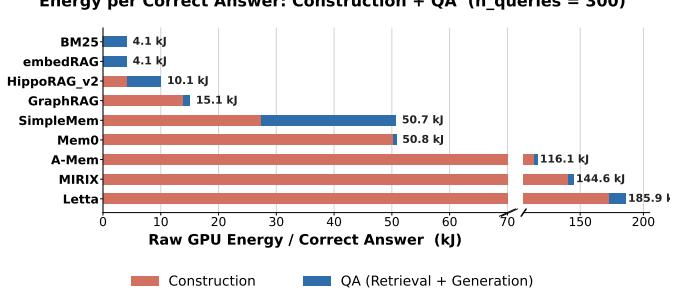  
Figure 4: Energy per correct answer. Normalizing total energy by correct answers jointly prices construction and serving against task quality. The spread across agent memory systems exceeds $47\times$ .

Insight 2: Construction energy dominates the agent lifecycle: for LLM-mediated agent memory systems, construction energy exceeds total query-phase energy across 300 queries. Energy per correct answer exceeds $47 \times$ across the suite, and agent memory systems with similar accuracy can differ by an order of magnitude on this axis.

Recommendation 2: Operators should account for energy across the full agent lifecycle, not just at query time. Construction dominates total energy for most LLM-mediated agent memory systems, which trade construction cost for capabilities such as mutation, structured retrieval, and multi-store routing. Systems with similar accuracy can differ by an order of magnitude in lifecycle energy depending on their construction pipeline.

## 4.3. Construction Is an Overwhelmingly Embedding and Prefill-dominated Workload

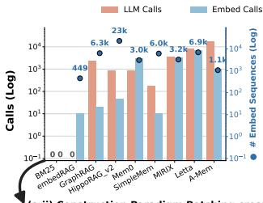  
(b) QA Phase (Per Query)
● # Embed Sequences (right axis)

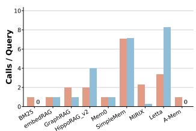

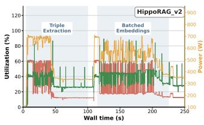

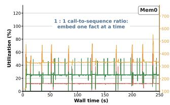

(c) Construction Tokens  
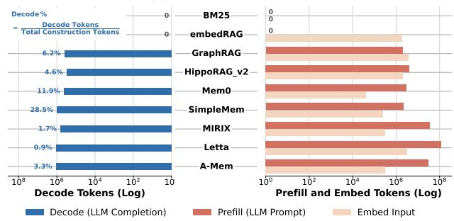  
Figure 5: Construction call structure and token decomposition. Embedding batching ratios split sharply by taxonomy paradigm: Paradigm III.a generates large-batch offline-indexing traffic; Paradigms III.b and IV generate sequential per-event traffic on the write-loop critical path.

The construction cost identified in Sec. 4.2 has a specific computational shape that follows from how each paradigm transforms interaction history into persistent records.

Fig. 5 decomposes construction traffic into LLM prompt tokens, completion tokens, and embedding input tokens. Construction is dominated by embedding and LLM prefill: the embedding model's entire forward pass is prefill with no decode component, and the LLM construction path reads a window or chunk and emits a compact structured output (a fact list, a JSON triple set, an ADD/UPDATE/DELETE decision) whose token count is small relative to the context consumed. The median decode share of total construction tokens is $4.6\%$ across agent memory systems, ranging from $0.9\%$ (Letta) to $28.5\%$ (SimpleMem, whose per-window memory entries are longer). Construction is a repeated long-read, short-write workload.

This creates a structural conflict with QA serving. QA traffic is latency-sensitive and optimized around time-to-first-token; construction traffic is throughput-oriented, processing large input volumes across many independent chunks with no user-facing latency pressure. Routing both through the same LLM endpoint means a large construction prefill job occupies KV-cache headroom and stalls the batch scheduler precisely when a latency-sensitive query arrives.

Embedding traffic is further bimodal by paradigm. Paradigm III.a agent memory systems submit large batches to the embedding server: GraphRAG yields $\sim$ 2,300 sequences per API call (batching $\sim$ 10 entity-relation tuples per chunk), HippoRAG v2 $\sim$ 125 sequences per call across three indexed views. Paradigms III.b and IV present the opposite shape: Mem0 must embed each extracted fact before its similarity search resolves the ADD/UPDATE/DELETE decision, producing a 1:1 call-to-sequence ratio; agentic systems are similarly sequential. An embedding server configured for batch throughput will create head-of-line blocking for latency-sensitive write-loop tenants.

Insight 3: Agent memory construction is prefill- and embedding-heavy: it repeatedly reads long chunks or windows and emits compact memory records. Unlike QA, construction is not on the user-facing decode path, so its cost profile is closer to background indexing than interactive serving. Embedding traffic splits further by paradigm, between large-batch offline indexing (Paradigm III.a) and sequential per-event writes (Paradigms III.b and IV).

Recommendation 3: Agent-serving systems should treat memory construction as a background throughput workload with explicit admission control. Construction jobs should be rate-limited, batched, or deferred when they would interfere with latency-sensitive QA. Paradigm III.a tenants benefit from large embedding batch sizes; Paradigms III.b and IV require per-call latency prioritization on the embedding path.

Recommendation 4: Construction pipelines should exploit reuse across overlapping inputs. Windowed and chunked memory systems can reduce repeated prefill cost through prefix reuse, chunk caching, and batching of independent construction units.

## 4.4. Construction-LLM Choice Is Agent memory system-Constrained

Sec. 4.2 showed that construction energy often dominates the agent lifecycle. A natural cost lever for an operator is to use a smaller, cheaper LLM for construction than for QA. Fig. 6 shows that this lever is available for most systems, but its safe range is set by the construction algorithm's output contracts.

For systems without hard output contracts (Mem0, SimpleMem, A-Mem), accuracy degrades smoothly as the construction LLM shrinks, permitting continuous accuracy-cost tradeoffs down to small models. GraphRAG is notably robust, maintaining $\sim47-48\%$ accuracy across the full ladder from Qwen3-1.7B to GPT-4o-mini, because its entity-relation extraction degrades gracefully rather than failing structurally. Systems with strict output contracts exhibit a harder floor. MIRIX fails entirely at Qwen3-1.7B, because its pipeline relies on multiple sub-agent tool calls that require well-formed JSON schemas and legal tool-call syntax; a model that cannot reliably satisfy these contracts produces a corrupted store from which the QA model can recover no useful evidence.

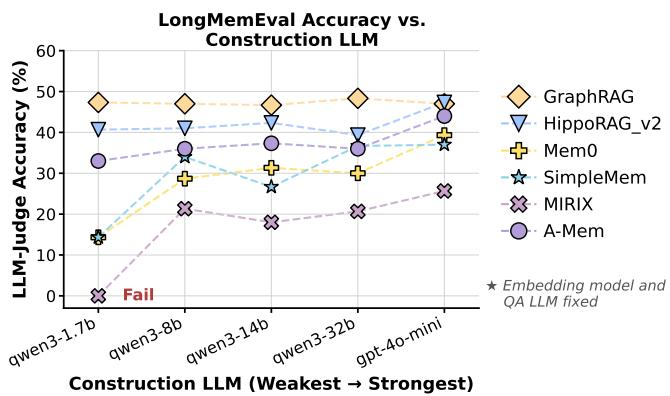  
Figure 6: Construction-LLM sensitivity. QA LLM is fixed to GPT-4o-mini. Embed is fixed to Text Embedding 3 Small. Construction LLM is swept for LLM-dependent systems.

Insight 4: Construction-LLM downscaling is available for most systems but its safe range is algorithm-constrained. Systems without hard output contracts tolerate smaller construction LLMs with graceful accuracy degradation. Systems with strict output contracts impose a capability floor: falling below it corrupts the memory store entirely, as seen with MIRIX's complete failure at Qwen3-1.7B.

Recommendation 5: Operators should treat the minimum viable construction LLM as an algorithm-imposed cost floor. For systems with strict output contracts, this floor must be validated before deployment; falling below it renders the store unusable. For systems without hard contracts, construction-LLM downscaling is a cost lever, tunable against an accuracy constraint.

## 4.5. The Construction-Serve-Accuracy Frontier

Fig. 7 plots construction wall time, per-query latency, and accuracy, each macro-averaged over all MemoryAgent-Bench datasets. BM25 completes construction in under a second and reaches the highest accuracy in the suite at 55.8%, but its query time ( $\sim$ 7.4 s) is behind Mem0, A-Mem, and GraphRAG. The structure-augmented and agentic systems pay substantially more construction cost without overtaking BM25 on accuracy: HippoRAG v2 reaches 47.4% at $\sim$ 277 s of construction, GraphRAG 47.0% at $\sim$ 2,850 s, and A-Mem 42.1% at $\sim$ 17,666 s, the most expensive build in the suite. The cost axes also trade against each other. Mem0 attains the lowest per-query latency ( $\sim$ 2.2 s) by distilling history into atomic facts, but pays $\sim$ 4,108 s of construction to do so and reaches only 26.8% accuracy. SimpleMem is the slowest at query time ( $\sim$ 18.4 s), because its retrieval pipeline adds intent planning, multi-view retrieval, and iterative reflection rounds on top of its compressed entries. No single system is therefore best on all three axes: each occupies a distinct point on the construction-serve-accuracy frontier.

BM25's strong aggregate showing should not be read as a universal result. The macro-average in Fig. 7a is computed over all datasets in MemoryAgentBench, many of which are recall-heavy and reward the exact-match retrieval that lexical indexing handles well. BM25 has well-documented weaknesses on queries requiring paraphrase matching, multi-hop reasoning, or temporal inference, the task families that motivate Paradigm III and IV designs. Fig. 7b shows this: the aggregate hides sharp per-category variation, and on the harder categories the gap between BM25 and the structure-augmented systems narrows or reverses.

Insight 5: No agent memory system is optimal across construction cost, per-query latency, and accuracy. Agent memory systems with similar accuracy occupy distinct positions on the construction-versus-query cost split.

Recommendation 6: Operators selecting an agent memory system should match the construction-versus-query cost split to the workload's query arrival pattern, in addition to matching the agent memory system's capability profile to the dominant task family. High-volume query workloads against stable histories favor agent memory systems that move work into construction. Continuous-ingestion workloads with sparse queries favor agent memory systems with low construction costs.

## 4.6. Inter-Session Construction Creates a Freshness-Latency Tradeoff

The preceding sections characterized agent memory in the batch-construct-then-query regime. When sessions instead arrive continuously and later queries depend on memory from earlier ones, the serving system faces a scheduling decision batch evaluation hides.

We characterize this regime using the physics split of MemoryArena $[4]$ : 20 multi-session tasks, each a sequence of interdependent subtasks where a later subtask depends on results established by earlier ones. Each subtask is one session, a retrieve-act-write cycle. We capture per-session timing traces and replay them under a controlled 5-second inter-session arrival schedule, emulating synchronous and asynchronous scheduling. All runs use Qwen3-32B (FP8) with Qwen3-Embedding-0.6B. We define staleness as the number of prior sessions not yet persisted to the memory store at query time; a system is fresh when staleness is zero. Fig. 8a–b shows one representative task under each mode, one row per system. In panel b, hatched markers indicate queries admitted before the prior write committed. Under synchronous scheduling, slow-construction systems extend the timeline as each session blocks on its own write. Under asynchronous scheduling, SimpleMem, MIRIX, Letta, Mem0, and A-Mem accumulate staleness, retrieving against memory one or more sessions behind the ingestion stream. Paradigm II systems (BM25, embedRAG) remain fresh in both modes. Fig. 8c shows per-session construction time across all papers, spanning five orders of magnitude: from $\sim10^{-3}$ s for BM25 to $\sim10$ s for Mem0 and MIRIX, with tails exceeding 100 s for inputs that trigger multiple consolidation rounds. Construction time alone does not determine feasibility: retrieval cost during the next session's action loop also contributes, and the cumulative time must fit within the inter-session interval to avoid a write backlog. When it does not, the operator faces a forced choice between synchronous scheduling, which exposes construction latency on the critical path, and asynchronous scheduling, which admits unbounded staleness.

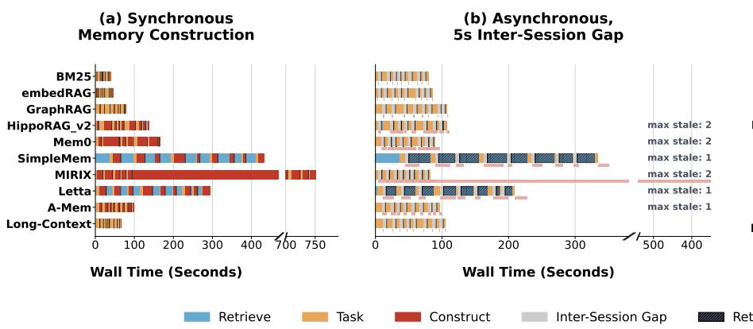

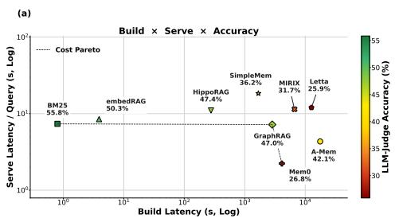

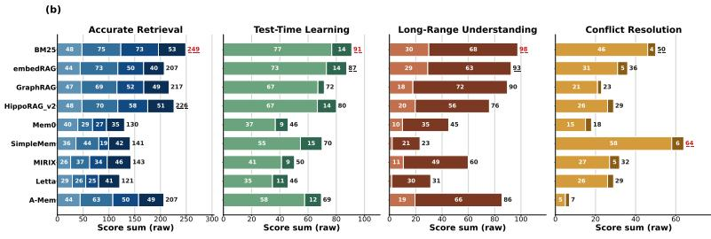  
Figure 7: (a) Construction-serve-accuracy frontier. Fast construction, fast per-query serving, and high accuracy cannot be jointly maximized. Accuracy and cost are macro-averaged over all MemoryAgentBench datasets (remote serving, GPT-4o-mini, text-embedding-3-small). (b) Performance of agent memory systems on various task categories in the MemoryAgentBench suite.

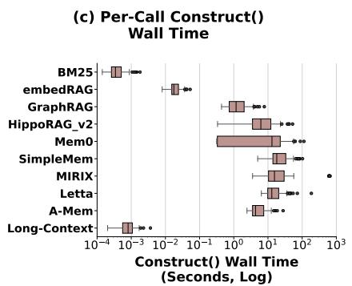  
Figure 8: Construction scheduling and per-session write latency under session arrivals (MemoryArena, physics split, 20 multi-session tasks). Under asynchronous scheduling, slow-construction agent memory systems serve queries against stale memory because prior session writes have not yet committed. Per-session write latency spans five orders of magnitude, from sub-millisecond for BM25 to tens of seconds for Paradigm IV systems.

Insight 6: For agent memory systems where per-session construction time exceeds the inter-session arrival interval, synchronous construction scheduling leads to user-facing latency and memory staleness, thus requiring concurrent (asynchronous) construction scheduling. Per-session construction time alone spans five orders of magnitude across systems, making it the dominant property for inter-session system selection.

Recommendation 7: For inter-session workloads with strict cross-session dependencies, cumulative construction and retrieval time should be treated as a hard feasibility constraint. Systems that exceed the arrival interval cannot satisfy both freshness and latency targets simultaneously; accuracy alone is an insufficient selection criterion when this constraint binds.

Recommendation 8: Construction cadence should be agent memory system-aware. Append-only memory can be updated continuously, but consolidating and mutating systems should monitor marginal per-chunk construction cost and trigger compaction or offline rebuild when new chunks increasingly spend time comparing against or rewriting prior records.

## 4.7. Per-User Memory Footprint Growth Diverges Across Agent Memory Systems

Agent memory is per-user, unbounded, and accumulates continuously, so per-user costs compound across users and over deployment lifetime. Fig. 9 tracks construction time, LLM token cost, retrieval latency, and on-disk footprint as we scale one user's history from about $64\mathrm{K}$ to $1\mathrm{M}$ tokens, using LongMemEval's arbitrary context generation [28].

On-disk footprint (panel c) grows roughly proportionally to content volume for most systems, with a $\sim9\times$ spread at 1 M tokens. Multi-view designs inflate the proportionality constant (HippoRAG v2 reaches $\sim62$ MB at 1 M tokens); consolidating systems have the potential to compress storage over time as redundant records are merged, keeping footprint lower than their ingestion volume would suggest (Mem0 at $\sim$ 12 MB). None of the evaluated systems prune or forget by default, so footprint grows monotonically under default behavior; bounding fleet storage requires an independent forgetting policy. LLM token cost (panel b) reveals a sharper divergence. Paradigm IV agentic systems (Letta, A-Mem, MIRIX) scale super-linearly in token cost: each new ingestion issues tool calls that query and assess the growing memory store before merging or rewriting records, so per-ingestion token cost rises with store size and total cost compounds with history length. Letta in particular diverges steeply beyond 256 K tokens. Paradigm II systems (BM25, embedRAG) incur negligible LLM token cost at all scales. At fleet scale, projecting 1 M-token footprints to 100 K users gives a $\sim$ 9× storage spread, from $\sim$ 0.7 TB (embedRAG) to $\sim$ 6.2 TB (HippoRAG v2). But for long-lived deployments the more consequential variable is the token-cost growth slope: agentic systems whose construction cost compounds with memory size will become disproportionately expensive as user histories grow. Retrieval latency (panel d), by contrast, stays nearly flat as the store grows: index-lookup retrieval is sub-linear in store size, decoupling per-query read cost from history length.

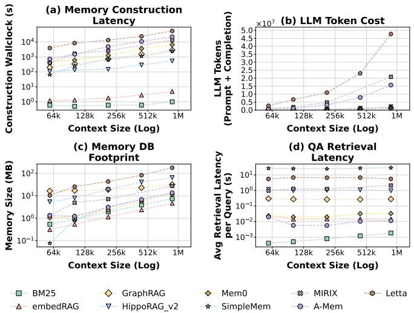  
Figure 9: Scaling with input length. Construction time, LLM token cost, retrieval latency, and on-disk footprint as a single user's history scales from 64K to about 1M tokens (local serving, Qwen3-32B, Qwen3-Embedding-0.6B).

Insight 7: Per-user memory footprints vary by up to 9× across systems at 1M tokens, but construction token cost diverges far more sharply. Paradigm IV agentic systems scale super-linearly in LLM token cost as growing memory stores amplify per-ingestion work. Multi-view representations inflate storage growth; consolidating systems dampen it. An agent's long-term cost is therefore dictated by its algorithmic growth slope, not its initial footprint.

Recommendation 9: Selecting memory for long-lived agents requires evaluating both baseline footprint and cost growth slope. Agentic systems whose construction cost compounds with memory size should be paired with active compaction or summarization policies to prevent unbounded cost escalation. Because all evaluated systems accumulate state monotonically by default, operators must add independent pruning or forgetting policies to bound fleet-scale storage and token costs.

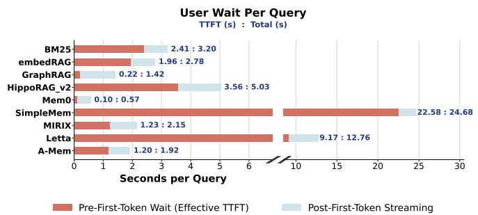  
Figure 10: Effective time-to-first-token. Pre-answer latency spans two orders of magnitude on identical hardware. The dominant variable is retrieval pipeline depth, not LLM serving speed.

## 4.8. Serving Latency Structure

Sec. 4.6 treated per-session construction and retrieval time as inputs to the scheduling decision; this section explains what sets them. On identical hardware and a fixed corpus, effective time-to-first-token spans two orders of magnitude across systems (Fig. 10, \~0.10 s for Mem0 to \~22.6 s for SimpleMem), and per-session construction time spans five (Fig. 8c). With the serving stack held constant, the variation comes from how each algorithm bounds its own work. Agent memory systems fall into two regimes, and a system can sit in different regimes for construction versus retrieval. Algorithm-bounded phases stop at a point fixed by the algorithm: BM25's single top-k lookup, HippoRAG v2's fixed passage-entity-fact-PPR sequence, GraphRAG's one extraction call per chunk. Per-phase cost varies with input and graph topology, but its worst case is bounded by static properties the operator can profile in advance. LLM-bounded phases continue until the LLM decides they are done: MIRIX's type-specific tool calls, SimpleMem's reflection rounds, Letta's tool-driven memory access, A-Mem's note evolution. When the specification permits arbitrary depth, only an explicit iteration cap bounds cost. The two regimes produce distinct tail behavior. As seen in Fig. /reffig:tail-latency, deterministic systems have narrow tails: BM25 and embedRAG show p95/p50 ratios near 1.3×, and HippoRAG v2 only slightly wider at 1.6× as PPR convergence depends on the query's seed distribution. LLM-bounded systems show the widest tails, reaching 5.9× for GraphRAG and 3.9× for Letta, since extra tool calls or reflection rounds drive latency beyond what the corpus alone predicts.

Insight 8: LLM-bounded agent memory systems produce construction and retrieval costs that are less tightly constrained by the input size alone than deterministic paradigms, since runtime LLM decisions can introduce variable numbers of reasoning, tool-use, or refinement steps. External iteration caps or timeouts are therefore required to bound worst-case cost.

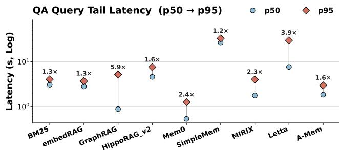  
Figure 11: QA tail latency by agent memory system. Fixed-depth pipelines (Paradigm II) have p95/p50 near $1.3\times$ . Systems with more complex store structures or query-adaptive pipelines display wider tails at QA time.

Recommendation 10: Latency-sensitive deployments should treat worst-case latency, on both construction and retrieval, as a selection criterion. Algorithm-bounded systems can be provisioned from worst-case latency measured on representative inputs. LLM-bounded systems require external iteration caps and timeouts, since profiling samples the LLM's behavior on tested inputs but does not bound it on others.

## 5. Discussion & Conclusion

This paper presents the first systems characterization of agent memory workloads. Across ten agent memory systems spanning four paradigms, we find that the dominant cost in agent memory is not query-time serving but construction, and that construction is structurally embedding and prefill-dominated, and in direct tension with latency-sensitive QA traffic when co-located on the same serving stack. The taxonomy introduced in Sec. 2.2 predicts this behavior: paradigm membership determines construction cost shape, embedding traffic pattern, capability sensitivity to construction-model choice, and retrieval tail width, making it a systematic lens for deployment decisions beyond the representative agent memory systems evaluated here. Several open challenges extend beyond our current scope. Multi-node and multi-agent deployments introduce consistency and coordination requirements across distributed memory stores that single-node characterization cannot capture. Multimodal memory, persisting and retrieving images, audio, and structured observations alongside text, is an emerging and less mature frontier that we expect will amplify the construction cost, storage footprint, and retrieval complexity challenges identified here. The taxonomy and profiling methodology developed in this work provide a foundation for characterizing these richer settings as they mature.

## Acknowledgments

We thank the staff of the Stanford Marlowe computing cluster and NVIDIA solutions architects Zoe Ryan and

Amanda Butler for their continued support. We would also like to thank the Stanford PORTAL and MemoryDAX industrial affiliates program. Finally, we thank the Knight-Hennessy Fellowship for partly funding this research.

Statement on Generative AI: Codebase development was accelerated using Claude Code. Claude was additionally used to assist in improving the presentation of this writing. All technical content, experimental design, analysis, and conclusions are the work of the authors.

## References

[1] P. Chhikara, D. Khant, S. Aryan, T. Singh, and D. Yadav, “Mem0: Building Production-Ready AI Agents with Scalable Long-Term Memory,” 2025. [Online]. Available: https://arxiv.org/abs/2504.19413

[2] D. Edge, H. Trinh, N. Cheng, J. Bradley, A. Chao, A. Mody, S. Truitt, D. Metropolitansky, R. O. Ness, and J. Larson, “From Local to Global: A Graph RAG Approach to Query-Focused Summarization,” 2025. [Online]. Available: https://arxiv.org/abs/2404.16130

[3] B. J. Gutiérrez, Y. Shu, W. Qi, S. Zhou, and Y. Su, “From RAG to memory: non-parametric continual learning for large language models,” in Proceedings of the 42nd International Conference on Machine Learning, ser. ICML’25. JMLR.org, 2025.

[4] Z. He, Y. Wang, C. Zhi, Y. Hu, T.-P. Chen, L. Yin, Z. Chen, T. A. Wu, S. Ouyang, Z. Wang, J. Pei, J. McAuley, Y. Choi, and A. Pentland, “MemoryArena: Benchmarking Agent Memory in Interdependent Multi-Session Agentic Tasks,” 2026. [Online]. Available: https://arxiv.org/abs/2602.16313

[5] C.-P. Hsieh, S. Sun, S. Kriman, S. Acharya, D. Rekesh, F. Jia, Y. Zhang, and B. Ginsburg, “RULER: What’s the Real Context Size of Your Long-Context Language Models?” 2024. [Online]. Available: https://arxiv.org/abs/2404.06654

[6] Y. Hu, Y. Wang, and J. McAuley, “Evaluating Memory in LLM Agents via Incremental Multi-Turn Interactions,” 2026. [Online]. Available: https://arxiv.org/abs/2507.05257

[7] J. Johnson, M. Douze, and H. Jegou, “Billion-Scale Similarity Search with GPUs,” IEEE Transactions on Big Data, vol. 7, no. 03, pp. 535–547, Jul. 2021. [Online]. Available: https://doi.ieeecomputersociety.org/10.1109/TBDATA.2019.2921572

[8] V. Karpukhin, B. Oguz, S. Min, P. Lewis, L. Wu, S. Edunov, D. Chen, and W.-t. Yih, “Dense Passage Retrieval for Open-Domain Question Answering,” in Proceedings of the 2020 Conference on Empirical Methods in Natural Language Processing (EMNLP), B. Webber, T. Cohn, Y. He, and Y. Liu, Eds. Online: Association for Computational Linguistics, Nov. 2020, pp. 6769–6781. [Online]. Available: https://aclanthology.org/2020.emnlp-main.550/

[9] W. Kwon, Z. Li, S. Zhuang, Y. Sheng, L. Zheng, C. H. Yu, J. Gonzalez, H. Zhang, and I. Stoica, “Efficient Memory Management for Large Language Model Serving with PagedAttention,” in Proceedings of the 29th Symposium on Operating Systems Principles, ser. SOSP ’23. New York, NY, USA: Association for Computing Machinery, 2023, p. 611–626. [Online]. Available: https://doi.org/10.1145/3600006.3613165

[10] Letta, “Stateful Agents: The Missing Link in LLM Intelligence,” February 2025. [Online]. Available: https://www.letta.com/blog/stateful-agents

[11] P. Lewis, E. Perez, A. Piktus, F. Petroni, V. Karpukhin, N. Goyal, H. Küttler, M. Lewis, W.-t. Yih, T. Rocktäschel, S. Riedel, and D. Kiela, “Retrieval-Augmented Generation for K knowledge-Intensive NLP Tasks,” in Proceedings of the 34th International Conference on Neural Information Processing Systems, ser. NIPS '20. Red Hook, NY, USA: Curran Associates Inc., 2020.

[12] J. Liu, Y. Su, P. Xia, S. Han, Z. Zheng, C. Xie, M. Ding, and H. Yao, "SimpleMem: Efficient Lifelong Memory for LLM Agents," 2026. [Online]. Available: https://arxiv.org/abs/2601.02553

[13] N. F. Liu, K. Lin, J. Hewitt, A. Paranjape, M. Bevilacqua, F. Petroni, and P. Liang, “Lost in the Middle: How Language Models Use Long Contexts,” vol. 12. Cambridge, MA: MIT Press, 2024, pp. 157–173. [Online]. Available: https://aclanthology.org/2024.tacl-1.9/

[14] A. Maharana, D.-H. Lee, S. Tulyakov, M. Bansal, F. Barbieri, and Y. Fang, “Evaluating Very Long-Term Conversational Memory of LLM Agents,” in Proceedings of the 62nd Annual Meeting of the Association for Computational Linguistics (Volume 1: Long Papers), L.-W. Ku, A. Martins, and V. Srikumar, Eds. Bangkok, Thailand: Association for Computational Linguistics, Aug. 2024, pp. 13 851–13 870. [Online]. Available: https://aclanthology.org/2024.acl-long.747/

[15] P. Micikevicius, D. Stosic, N. Burgess, M. Cornea, P. Dubey, R. Grisenthwaite, S. Ha, A. Heinecke, P. Judd, J. Kamalu, N. Mellempudi, S. Oberman, M. Shoeybi, M. Siu, and H. Wu, "FP8 Formats for Deep Learning," 2022. [Online]. Available: https://arxiv.org/abs/2209.05433

[16] C. Packer, S. Wooders, K. Lin, V. Fang, S. G. Patil, I. Stoica, and J. E. Gonzalez, “MemGPT: Towards LLMs as Operating Systems,” 2024. [Online]. Available: https://arxiv.org/abs/2310.08560

[17] J. S. Park, J. O'Brien, C. J. Cai, M. R. Morris, P. Liang, and M. S. Bernstein, "Generative Agents: Interactive Simulacra of Human Behavior," in Proceedings of the 36th Annual ACM Symposium on User Interface Software and Technology, ser. UIST '23. New York, NY, USA: Association for Computing Machinery, 2023. [Online]. Available: https://doi.org/10.1145/3586183.3606763

[18] P. Rasmussen, P. Paliychuk, T. Beauvais, J. Ryan, and D. Chalef, “Zep: A Temporal Knowledge Graph Architecture for Agent Memory,” 2025. [Online]. Available: https://arxiv.org/abs/2501.13956

[19] S. Robertson and H. Zaragoza, “The Probabilistic Relevance Framework: BM25 and Beyond,” Found. Trends Inf. Retr., vol. 3, no. 4, p. 333–389, Apr. 2009. [Online]. Available: https://doi.org/10.1561/1500000019

[27] T. Wei, N. Sachdeva, B. Coleman, Z. He, Y. Bei, X. Ning, M. Ai, Y. Li, J. He, E. H. Chi, C. Wang, S. Chen, F. Pereira, W.-C. Kang, and D. Z. Cheng, “Evo-Memory: Benchmarking LLM Agent Test-time Learning with Self-Evolving Memory,” 2026. [Online]. Available: https://arxiv.org/abs/2511.20857

[20] J. Saad-Falcon, A. Narayan, H. O. Akengin, J. W. Griffin, H. Shandilya, A. G. Lafuente, M. Goel, R. Joseph, S. Natarajan, E. K. Guha, S. Zhu, B. Athiwaratkun, J. Hennessy, A. Mirhoseini, and C. Ré, "Intelligence per watt: Measuring intelligence efficiency of local ai," 2026. [Online]. Available: https://arxiv.org/abs/2511.07885

[21] P. Sarthi, S. Abdullah, A. Tuli, S. Khanna, A. Goldie, and C. D. Manning, “RAPTOR: Recursive Abstractive Processing for Tree-Organized Retrieval,” 2024. [Online]. Available: https://arxiv.org/abs/2401.18059

[22] N. Shinn, F. Cassano, A. Gopinath, K. Narasimhan, and S. Yao, "Reflexion: Language Agents with Verbal Reinforcement Learning," in Proceedings of the 37th International Conference on Neural Information Processing Systems, ser. NIPS '23. Red Hook, NY, USA: Curran Associates Inc., 2023.

[23] G. Team et al., “Gemini 1.5: Unlocking multimodal understanding across millions of tokens of context,” 2024. [Online]. Available: https://arxiv.org/abs/2403.05530

[24] vLLM Project, “vLLM quantization documentation: FP8,” 2025, online: https://docs.vllm.ai/en/latest/features/quantization/fp8.html.

[25] L. Wang, C. Ma, X. Feng, Z. Zhang, H. Yang, J. Zhang, Z. Chen, J. Tang, X. Chen, Y. Lin, W. X. Zhao, Z. Wei, and J. Wen, “A Survey on Large Language Model Based Autonomous Agents,” Front. Comput. Sci., vol. 18, no. 6, Mar. 2024. [Online]. Available: https://doi.org/10.1007/s11704-024-40231-1

[26] Y. Wang and X. Chen, “MIRIX: Multi-Agent Memory System for LLM-Based Agents,” 2025. [Online]. Available: https://arxiv.org/abs/2507.07957

[28] D. Wu, H. Wang, W. Yu, Y. Zhang, K.-W. Chang, and D. Yu, “LongMemEval: Benchmarking Chat Assistants on Long-Term Interactive Memory,” 2024. [Online]. Available: https://arxiv.org/abs/2410.10813

[29] W. Xu, Z. Liang, K. Mei, H. Gao, J. Tan, and Y. Zhang, “A-MEM: Agentic Memory for LLM Agents,” 2025. [Online]. Available: https://arxiv.org/abs/2502.12110
